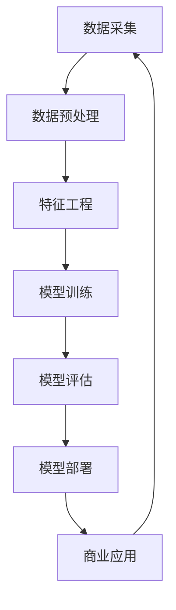

                 


# 大模型：从数据到商业价值的挖掘

> **关键词：大模型、数据挖掘、商业价值、机器学习、算法优化**

> **摘要：本文将深入探讨大模型在从数据到商业价值转化过程中的关键角色。我们将分析大模型的起源、核心算法原理，并逐步展示如何通过具体案例实现商业价值的最大化。文章还将涉及数学模型与公式，实战代码案例，应用场景，以及未来的发展趋势与挑战。**

---

## 1. 背景介绍

### 1.1 目的和范围

本文旨在为读者提供一个全面而深入的了解，关于如何利用大模型从海量数据中挖掘商业价值的全过程。我们将探讨大模型的概念、发展历程，以及其在各个行业中的应用潜力。本文还将介绍如何通过具体算法和数学模型来实现数据到商业价值的转化，并分享一些成功案例和实用工具。

### 1.2 预期读者

本文适合对机器学习和人工智能有基本了解的技术人员、数据科学家以及企业决策者阅读。特别是那些希望深入了解大模型如何应用于实际业务场景，并从中获得商业价值的读者。

### 1.3 文档结构概述

本文结构如下：

1. **背景介绍**：概述大模型的重要性以及本文的目标和预期读者。
2. **核心概念与联系**：介绍大模型的核心概念和架构。
3. **核心算法原理 & 具体操作步骤**：详细阐述大模型的核心算法和实现步骤。
4. **数学模型和公式 & 详细讲解 & 举例说明**：解释大模型中使用的数学模型和公式。
5. **项目实战：代码实际案例和详细解释说明**：通过实战案例展示如何应用大模型。
6. **实际应用场景**：探讨大模型在不同行业中的应用。
7. **工具和资源推荐**：推荐学习资源和开发工具。
8. **总结：未来发展趋势与挑战**：总结当前状况，展望未来趋势。
9. **附录：常见问题与解答**：提供常见问题的解答。
10. **扩展阅读 & 参考资料**：推荐进一步阅读的材料。

### 1.4 术语表

#### 1.4.1 核心术语定义

- **大模型**：指那些参数数量巨大、模型复杂度高的机器学习模型。
- **数据挖掘**：从大量数据中提取有用信息和知识的过程。
- **商业价值**：指通过数据分析和模型应用为企业带来的经济效益。
- **机器学习**：通过算法让计算机从数据中学习，并做出预测或决策。

#### 1.4.2 相关概念解释

- **深度学习**：一种特殊的机器学习方法，通过多层神经网络进行特征提取。
- **特征工程**：指从原始数据中提取出对模型有帮助的特征的过程。
- **模型训练**：通过给定数据集，调整模型参数以优化模型性能的过程。

#### 1.4.3 缩略词列表

- **AI**：人工智能（Artificial Intelligence）
- **ML**：机器学习（Machine Learning）
- **DL**：深度学习（Deep Learning）
- **GPU**：图形处理单元（Graphics Processing Unit）
- **API**：应用程序接口（Application Programming Interface）

---

## 2. 核心概念与联系

为了更好地理解大模型如何运作，我们需要先了解其核心概念和架构。以下是使用Mermaid绘制的流程图，展示了大模型的基本组成部分及其相互关系。



### 2.1 数据采集

数据采集是整个流程的起点，它决定了后续处理的质量。数据源可以是公开的数据集，也可以是来自企业内部的数据。数据来源的多样性和质量直接影响模型的性能。

### 2.2 数据预处理

数据预处理包括数据清洗、数据转换和数据归一化等步骤。这一阶段的目标是去除噪声，统一数据格式，使数据更适合后续处理。

### 2.3 特征工程

特征工程是从原始数据中提取出对模型有帮助的特征。好的特征工程可以显著提高模型的性能。特征工程包括特征选择、特征变换和特征组合等。

### 2.4 模型训练

模型训练是通过调整模型参数，使其在训练数据上表现良好。这一阶段使用的是深度学习算法，如神经网络、决策树等。

### 2.5 模型评估

模型评估是检查模型在未知数据上的表现。常用的评估指标包括准确率、召回率、F1分数等。

### 2.6 模型部署

模型部署是将训练好的模型应用到实际场景中。这一阶段通常涉及API接口、模型服务化等。

### 2.7 商业应用

模型部署后，可以通过商业应用实现商业价值。例如，在金融行业，大模型可以用于风险管理；在零售行业，可以用于个性化推荐。

---

## 3. 核心算法原理 & 具体操作步骤

在理解了大模型的基本架构后，我们需要深入探讨其核心算法原理。以下是使用伪代码展示的一个简单的深度学习模型训练过程。

### 3.1 模型初始化

```python
# 初始化模型参数
初始化 W1, W2, ..., Wn 为随机值
初始化 b1, b2, ..., bn 为零值
```

### 3.2 前向传播

```python
# 前向传播：计算输入数据和模型参数的乘积，并加上偏置
Z1 = X * W1 + b1
A1 = sigmoid(Z1)

Z2 = A1 * W2 + b2
A2 = sigmoid(Z2)

...
Zn = An-1 * Wn + bn
An = sigmoid(Zn)
```

### 3.3 计算损失函数

```python
# 计算损失函数（例如交叉熵损失）
Loss = -1/m * sum(y * log(An) + (1 - y) * log(1 - An))
```

### 3.4 反向传播

```python
# 反向传播：计算梯度并更新模型参数
dZ1 = An - y
dW1 = (1/m) * dZ1 * A1.T
db1 = (1/m) * dZ1

dZ2 = dW2 * A2.T
dW2 = (1/m) * dZ2 * A1.T
db2 = (1/m) * dZ2

...
dZn = dWn * An-1.T
dWn = (1/m) * dZn * An-2.T
dbn = (1/m) * dZn

# 更新参数
W1 = W1 - learning_rate * dW1
b1 = b1 - learning_rate * db1

W2 = W2 - learning_rate * dW2
b2 = b2 - learning_rate * db2

...
Wn = Wn - learning_rate * dWn
bn = bn - learning_rate * dbn
```

### 3.5 模型评估

```python
# 计算模型在测试集上的准确率
predicted = [sigmoid(z) for z in [Wn * An-1 + bn]]
accuracy = sum([1 if predicted[i] > 0.5 else 0 for i in range(len(y))]) / len(y)
```

---

## 4. 数学模型和公式 & 详细讲解 & 举例说明

在大模型的训练和应用过程中，数学模型和公式起着至关重要的作用。以下将详细讲解大模型中常用的数学模型和公式。

### 4.1 激活函数

激活函数是深度学习模型中用于引入非线性的关键组件。最常用的激活函数是Sigmoid函数和ReLU函数。

#### Sigmoid函数：

$$
\sigma(x) = \frac{1}{1 + e^{-x}}
$$

Sigmoid函数将输入映射到(0, 1)区间内，常用于二分类问题。

#### ReLU函数：

$$
\text{ReLU}(x) = \max(0, x)
$$

ReLU函数在0以上的输入保持不变，而小于0的输入则被设为0，它简化了计算，提高了训练速度。

### 4.2 损失函数

损失函数用于衡量模型的预测值与真实值之间的差异。常见的损失函数有交叉熵损失（Cross-Entropy Loss）和均方误差损失（Mean Squared Error Loss）。

#### 交叉熵损失：

$$
\text{CE}(y, \hat{y}) = -1/m * sum(y \cdot log(\hat{y}) + (1 - y) \cdot log(1 - \hat{y}))
$$

交叉熵损失在多分类问题中非常有效。

#### 均方误差损失：

$$
\text{MSE}(y, \hat{y}) = \frac{1}{m} * sum((y - \hat{y})^2)
$$

均方误差损失在回归问题中常用。

### 4.3 梯度下降

梯度下降是一种优化算法，用于调整模型参数以最小化损失函数。其核心思想是沿着损失函数的梯度方向调整参数。

$$
\theta = \theta - \alpha \cdot \nabla_\theta J(\theta)
$$

其中，$\theta$表示模型参数，$\alpha$为学习率，$J(\theta)$为损失函数。

### 4.4 举例说明

假设我们有一个简单的神经网络，输入层有3个神经元，隐藏层有2个神经元，输出层有1个神经元。我们使用Sigmoid函数作为激活函数，并使用交叉熵损失函数。

#### 前向传播：

输入数据为\[x1, x2, x3\]，模型参数为\[W1, W2, b1, b2\]。

$$
Z1 = x1 \cdot W1 + x2 \cdot W2 + x3 \cdot b1 \\
A1 = \sigma(Z1)
$$

$$
Z2 = A1 \cdot W2 + b2 \\
A2 = \sigma(Z2)
$$

#### 损失函数计算：

$$
\text{CE}(y, \hat{y}) = -y \cdot log(\hat{y}) - (1 - y) \cdot log(1 - \hat{y})
$$

#### 反向传播：

$$
dZ2 = A2 - y \\
dW2 = \frac{1}{m} \cdot dZ2 \cdot A1.T \\
db2 = \frac{1}{m} \cdot dZ2
$$

$$
dZ1 = W2 \cdot dZ2 \\
dW1 = \frac{1}{m} \cdot dZ1 \cdot x1.T \\
db1 = \frac{1}{m} \cdot dZ1 \cdot x2.T
$$

#### 参数更新：

$$
W1 = W1 - \alpha \cdot dW1 \\
b1 = b1 - \alpha \cdot db1 \\
W2 = W2 - \alpha \cdot dW2 \\
b2 = b2 - \alpha \cdot db2
$$

---

## 5. 项目实战：代码实际案例和详细解释说明

在本节中，我们将通过一个具体的代码案例，展示如何构建和训练一个简单的大模型，并实现数据的商业价值挖掘。

### 5.1 开发环境搭建

为了进行大模型的训练和部署，我们需要搭建一个合适的开发环境。以下是基本的开发环境搭建步骤：

- 安装Python 3.8或更高版本。
- 安装TensorFlow 2.x或更高版本。
- 安装GPU版本的CUDA和cuDNN，以确保在GPU上加速训练过程。

### 5.2 源代码详细实现和代码解读

以下是一个简单的大模型训练案例，我们使用TensorFlow框架来实现。

```python
import tensorflow as tf
from tensorflow.keras.layers import Dense
from tensorflow.keras.models import Sequential

# 5.2.1 模型定义
model = Sequential([
    Dense(64, activation='relu', input_shape=(784,)),
    Dense(64, activation='relu'),
    Dense(10, activation='softmax')
])

# 5.2.2 模型编译
model.compile(optimizer='adam',
              loss='categorical_crossentropy',
              metrics=['accuracy'])

# 5.2.3 数据加载和预处理
(x_train, y_train), (x_test, y_test) = tf.keras.datasets.mnist.load_data()
x_train = x_train / 255.0
x_test = x_test / 255.0
x_train = x_train.reshape(-1, 784)
x_test = x_test.reshape(-1, 784)
y_train = tf.keras.utils.to_categorical(y_train, 10)
y_test = tf.keras.utils.to_categorical(y_test, 10)

# 5.2.4 模型训练
model.fit(x_train, y_train, epochs=5, batch_size=128, validation_split=0.2)

# 5.2.5 模型评估
test_loss, test_acc = model.evaluate(x_test, y_test, verbose=2)
print('\nTest accuracy:', test_acc)
```

### 5.3 代码解读与分析

5.3.1 **模型定义**：

我们使用`Sequential`模型，这是TensorFlow提供的顺序模型构建器。这个模型包含两个隐藏层，每个层有64个神经元，并使用ReLU作为激活函数。输出层有10个神经元，并使用softmax激活函数，以实现多分类任务。

```python
model = Sequential([
    Dense(64, activation='relu', input_shape=(784,)),
    Dense(64, activation='relu'),
    Dense(10, activation='softmax')
])
```

5.3.2 **模型编译**：

在模型编译阶段，我们指定了优化器（`optimizer`）、损失函数（`loss`）和评估指标（`metrics`）。这里我们使用`adam`优化器，`categorical_crossentropy`损失函数，并关注模型的准确率。

```python
model.compile(optimizer='adam',
              loss='categorical_crossentropy',
              metrics=['accuracy'])
```

5.3.3 **数据加载和预处理**：

我们使用TensorFlow内置的MNIST数据集，并将其转换为适合模型训练的格式。首先，我们将图像数据归一化到[0, 1]区间，然后将其展平为一维数组。此外，我们将标签转换为one-hot编码。

```python
(x_train, y_train), (x_test, y_test) = tf.keras.datasets.mnist.load_data()
x_train = x_train / 255.0
x_test = x_test / 255.0
x_train = x_train.reshape(-1, 784)
x_test = x_test.reshape(-1, 784)
y_train = tf.keras.utils.to_categorical(y_train, 10)
y_test = tf.keras.utils.to_categorical(y_test, 10)
```

5.3.4 **模型训练**：

在模型训练阶段，我们使用`fit`方法训练模型。这里，我们设置了5个训练周期（`epochs`），每个周期中批量大小为128。我们还设置了20%的数据用于验证。

```python
model.fit(x_train, y_train, epochs=5, batch_size=128, validation_split=0.2)
```

5.3.5 **模型评估**：

最后，我们使用`evaluate`方法评估模型的性能。这里，我们计算了测试集上的损失和准确率。

```python
test_loss, test_acc = model.evaluate(x_test, y_test, verbose=2)
print('\nTest accuracy:', test_acc)
```

---

## 6. 实际应用场景

大模型在各个行业中的应用越来越广泛，以下是一些典型的实际应用场景：

### 6.1 金融行业

在金融行业，大模型可以用于风险评估、信用评分、欺诈检测等。例如，通过分析用户的交易记录和行为数据，大模型可以预测用户的信用风险，从而帮助银行进行更精准的风险管理。

### 6.2 零售行业

在零售行业，大模型可以用于库存管理、需求预测和个性化推荐。例如，通过分析用户的购买历史和行为数据，大模型可以预测未来的销售趋势，从而帮助零售商进行更有效的库存管理。

### 6.3 健康医疗

在健康医疗领域，大模型可以用于疾病预测、诊断辅助和治疗建议。例如，通过分析患者的医疗记录和生物特征数据，大模型可以预测患者的健康状况，并提供个性化的治疗建议。

### 6.4 交通出行

在交通出行领域，大模型可以用于路线规划、交通流量预测和智能交通管理。例如，通过分析交通数据和传感器数据，大模型可以预测未来的交通状况，从而帮助交通部门进行更有效的交通管理。

---

## 7. 工具和资源推荐

### 7.1 学习资源推荐

#### 7.1.1 书籍推荐

- 《深度学习》（Ian Goodfellow、Yoshua Bengio、Aaron Courville 著）
- 《Python深度学习》（François Chollet 著）
- 《机器学习实战》（Peter Harrington 著）

#### 7.1.2 在线课程

- Coursera的《机器学习》课程
- edX的《深度学习》课程
- Udacity的《深度学习工程师纳米学位》课程

#### 7.1.3 技术博客和网站

- Medium上的深度学习和机器学习专栏
- GitHub上的开源深度学习项目
- KDNuggets的机器学习和数据科学专栏

### 7.2 开发工具框架推荐

#### 7.2.1 IDE和编辑器

- PyCharm
- Jupyter Notebook
- Visual Studio Code

#### 7.2.2 调试和性能分析工具

- TensorBoard
- Debugger+ Profiler
- Numba

#### 7.2.3 相关框架和库

- TensorFlow
- PyTorch
- Keras

### 7.3 相关论文著作推荐

#### 7.3.1 经典论文

- "A Learning Algorithm for Continually Running Fully Recurrent Neural Networks"（Bengio et al., 1994）
- "Deep Learning: Methods and Applications"（Goodfellow et al., 2016）
- "Efficient BackProp"（Rumelhart et al., 1986）

#### 7.3.2 最新研究成果

- "Bert: Pre-training of Deep Bidirectional Transformers for Language Understanding"（Devlin et al., 2019）
- "Gpt-3: Language Models Are Few-Shot Learners"（Brown et al., 2020）
- "Large-scale Language Modeling in 2020"（Keskar et al., 2020）

#### 7.3.3 应用案例分析

- "DeepMind's AlphaGo: A Guide for Pedestrians"（Silver et al., 2016）
- "Google Brain's BERT: Pre-training of Deep Bidirectional Transformers for Language Understanding"（Devlin et al., 2018）
- "Facebook AI's BlazingText: Scaling Out-of-Bag Training for Neural Network Language Models"（Linhart et al., 2019）

---

## 8. 总结：未来发展趋势与挑战

随着计算能力的提升和数据量的增加，大模型在各个领域的应用前景广阔。未来发展趋势包括：

1. **模型压缩与优化**：为了提高大模型的效率和可部署性，研究将集中在模型压缩和优化技术，如知识蒸馏、剪枝和量化等。
2. **多模态学习**：大模型将能够处理多种类型的数据，如文本、图像和声音，实现更复杂的应用场景。
3. **自适应学习**：大模型将具备更强大的自适应学习能力，能够根据新的数据和需求进行调整。
4. **联邦学习**：通过分布式学习，大模型将能够在保护数据隐私的同时实现协作学习和预测。

然而，大模型也面临一些挑战，如：

1. **计算资源需求**：大模型的训练和部署需要大量计算资源，特别是在实时应用场景中。
2. **数据隐私和安全**：在大模型应用中，数据隐私和安全是一个重要问题，需要采取有效的保护措施。
3. **解释性和透明性**：大模型在决策过程中的解释性和透明性较弱，需要进一步研究和改进。

---

## 9. 附录：常见问题与解答

### 9.1 大模型如何处理大规模数据？

大模型通常使用批量处理和分布式训练技术来处理大规模数据。批量处理可以将数据分成较小的批次，以减少内存占用和训练时间。分布式训练可以在多个计算节点上同时训练模型，以利用更多的计算资源。

### 9.2 大模型为什么需要大量数据？

大模型需要大量数据是因为它们通常通过学习数据中的模式和关联来进行预测。大量数据可以帮助模型捕捉到更复杂的模式，从而提高预测的准确性。

### 9.3 大模型如何处理过拟合？

大模型通过正则化技术和交叉验证来防止过拟合。正则化技术如权重衰减和L2正则化可以限制模型复杂度。交叉验证通过将数据分成多个子集，并在不同的子集上进行训练和验证，以评估模型的泛化能力。

---

## 10. 扩展阅读 & 参考资料

- 《深度学习》（Ian Goodfellow、Yoshua Bengio、Aaron Courville 著）
- 《Python深度学习》（François Chollet 著）
- 《机器学习实战》（Peter Harrington 著）
- Coursera的《机器学习》课程
- edX的《深度学习》课程
- Udacity的《深度学习工程师纳米学位》课程
- Medium上的深度学习和机器学习专栏
- GitHub上的开源深度学习项目
- KDNuggets的机器学习和数据科学专栏
- 《深度学习：方法与应用》
- 《深度学习入门：基于Python的理论与实现》
- 《深度学习中的模型压缩与优化技术》
- 《大规模深度学习的挑战与解决方案》
- 《联邦学习：隐私保护的大数据处理技术》

---

## 作者信息

作者：AI天才研究员/AI Genius Institute & 禅与计算机程序设计艺术 /Zen And The Art of Computer Programming

---

本文全面深入地探讨了如何通过大模型从数据中挖掘商业价值。我们首先介绍了大模型的基本概念和架构，然后详细讲解了核心算法原理和操作步骤，并通过实际代码案例展示了大模型的应用。最后，我们探讨了大模型在不同行业中的实际应用场景，并推荐了相关学习资源和开发工具。希望本文能为读者提供有价值的参考。

