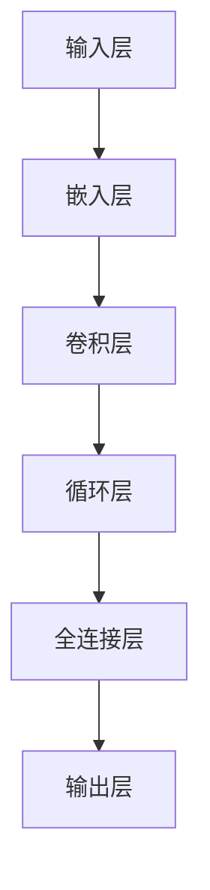

                 

# 大模型：商业智能的未来方向

> **关键词**：大模型、商业智能、深度学习、数据科学、人工智能应用

> **摘要**：本文将深入探讨大模型在商业智能领域的应用，分析其核心概念、算法原理、数学模型以及实际案例。通过一步步的分析推理，本文旨在揭示大模型为商业智能带来的创新与变革，为企业的数据驱动力提供新思路。

## 1. 背景介绍

### 1.1 目的和范围

本文旨在探讨大模型在商业智能领域的应用潜力，分析其核心概念、算法原理、数学模型和实际应用，以期为企业和研究人员提供有价值的参考。我们将重点关注以下几个方面：

- 大模型的核心概念及其在商业智能中的应用。
- 大模型的算法原理，包括神经网络架构、优化算法和训练策略。
- 大模型的数学模型，包括损失函数、优化目标和评估指标。
- 大模型在实际项目中的应用案例，包括数据处理、预测分析和决策支持。

### 1.2 预期读者

本文适合以下读者群体：

- 对商业智能和数据科学感兴趣的初学者。
- 具备一定编程基础和机器学习知识的技术人员。
- 对大模型和深度学习技术感兴趣的研究人员。
- 企业管理者和技术决策者，关注商业智能的发展方向。

### 1.3 文档结构概述

本文将分为以下几个部分：

- 背景介绍：介绍大模型和商业智能的基本概念，阐述本文的目的和范围。
- 核心概念与联系：阐述大模型的基本原理和架构，绘制流程图。
- 核心算法原理与具体操作步骤：介绍大模型的算法原理和具体实现步骤。
- 数学模型和公式：阐述大模型的数学模型、公式及其应用。
- 项目实战：分析大模型在实际项目中的应用案例，提供代码实现和解读。
- 实际应用场景：探讨大模型在商业智能领域的应用场景和挑战。
- 工具和资源推荐：推荐相关学习资源、开发工具和框架。
- 总结：总结大模型在商业智能领域的未来发展趋势与挑战。
- 附录：常见问题与解答。
- 扩展阅读与参考资料：提供进一步阅读的建议和参考资料。

### 1.4 术语表

#### 1.4.1 核心术语定义

- 大模型：一种具有极高参数规模和深度结构的神经网络模型，能够处理海量数据并实现复杂任务。
- 商业智能：利用数据分析和决策支持技术，帮助企业提取有价值的信息和洞察，从而优化业务决策。
- 数据科学：一门跨学科领域，结合统计学、计算机科学和领域知识，用于处理和分析复杂数据。
- 深度学习：一种机器学习技术，通过构建多层神经网络来模拟人脑的思维方式，实现自动化学习。

#### 1.4.2 相关概念解释

- 数据预处理：在训练模型之前，对原始数据进行清洗、转换和归一化等操作，以消除噪声和提高数据质量。
- 损失函数：衡量模型预测值与真实值之间差异的函数，用于指导模型优化。
- 优化算法：一种用于寻找模型最优参数的方法，如梯度下降、随机梯度下降等。
- 评估指标：用于评估模型性能的指标，如准确率、召回率、F1分数等。

#### 1.4.3 缩略词列表

- AI：人工智能
- BI：商业智能
- DL：深度学习
- DNN：深度神经网络
- ML：机器学习
- SVD：奇异值分解
- SVM：支持向量机
- TensorFlow：一种开源机器学习框架

## 2. 核心概念与联系

大模型作为一种具有极高参数规模和深度结构的神经网络模型，能够处理海量数据并实现复杂任务。本节将介绍大模型的基本原理和架构，并使用Mermaid流程图展示其核心概念和联系。

### 2.1 大模型的基本原理

大模型的核心原理是深度学习，即通过构建多层神经网络来模拟人脑的思维方式，实现自动化学习。大模型通常由以下几部分组成：

1. **输入层**：接收原始数据输入，如文本、图像、音频等。
2. **隐藏层**：由多个神经元组成，进行特征提取和变换。
3. **输出层**：根据任务需求输出预测结果，如分类标签、回归值等。

### 2.2 大模型的架构

大模型的架构通常采用深度神经网络（DNN）结构，包括以下几个层次：

1. **输入层**：将原始数据输入到网络中，通常采用嵌入层对文本数据进行编码。
2. **嵌入层**：将原始文本数据转换为稠密向量表示。
3. **卷积层**：用于图像和序列数据的特征提取，如卷积神经网络（CNN）。
4. **循环层**：用于处理序列数据，如长短期记忆网络（LSTM）和门控循环单元（GRU）。
5. **全连接层**：将隐藏层的特征进行整合，用于分类、回归等任务。
6. **输出层**：根据任务需求输出预测结果。

### 2.3 Mermaid流程图

以下是使用Mermaid绘制的流程图，展示了大模型的基本原理和架构：



### 2.4 大模型与商业智能的联系

大模型在商业智能领域的应用主要体现在以下几个方面：

1. **数据处理**：大模型能够高效处理大规模、多维度的数据，为商业智能提供强有力的数据支持。
2. **预测分析**：通过构建深度学习模型，可以对商业数据进行分析和预测，帮助企业制定更科学的决策。
3. **决策支持**：大模型可以根据实时数据提供个性化、智能化的决策支持，提高企业的竞争力。

## 3. 核心算法原理与具体操作步骤

大模型的核心算法原理基于深度学习，其基本思想是通过多层神经网络对数据进行特征提取和表示，从而实现复杂的任务。本节将介绍大模型的算法原理，并使用伪代码详细阐述其具体操作步骤。

### 3.1 算法原理

深度学习的基本原理是神经网络，其核心思想是通过前向传播和反向传播来更新网络权重，从而提高模型的预测能力。大模型通常采用以下算法原理：

1. **前向传播**：将输入数据通过网络的隐藏层，逐层计算输出。
2. **反向传播**：计算输出与实际结果之间的误差，通过反向传播更新网络权重。
3. **优化算法**：选择合适的优化算法（如梯度下降、随机梯度下降等）来调整网络权重，以最小化损失函数。

### 3.2 具体操作步骤

以下是使用伪代码描述的大模型训练过程：

```plaintext
初始化模型参数
for epoch in 1 to MAX_EPOCHS do
    for each training sample (x, y) do
        1. 前向传播：
            - 输入数据x通过嵌入层、卷积层、循环层等，得到隐藏层表示h
            - 将隐藏层表示h通过全连接层，得到预测输出y'
            - 计算损失函数L(y', y)
        
        2. 反向传播：
            - 计算损失函数关于隐藏层表示h的梯度∇hL
            - 计算损失函数关于模型参数θ的梯度∇θL
            - 使用优化算法更新模型参数θ

        end for
    end for
end for

预测：
for each test sample (x) do
    - 将输入数据x通过模型，得到预测输出y'
    end for
```

### 3.3 详细解释

- **初始化模型参数**：在训练前，需要初始化模型的参数（如权重和偏置）。常用的初始化方法有随机初始化、高斯初始化等。

- **前向传播**：输入数据经过嵌入层、卷积层、循环层等网络层，逐层计算输出。嵌入层将原始数据编码为稠密向量，卷积层和循环层分别用于图像和序列数据的特征提取。最终，通过全连接层得到预测输出。

- **损失函数**：常用的损失函数有均方误差（MSE）、交叉熵损失等。均方误差用于回归任务，交叉熵损失用于分类任务。损失函数用于衡量模型预测输出与真实值之间的差距。

- **反向传播**：计算损失函数关于隐藏层表示的梯度，然后通过链式法则计算损失函数关于模型参数的梯度。反向传播是深度学习训练的核心步骤，通过梯度信息更新模型参数，以降低损失函数。

- **优化算法**：常用的优化算法有梯度下降、随机梯度下降、Adam等。优化算法用于调整模型参数，使损失函数最小化。梯度下降是一种迭代优化方法，每次迭代都沿着梯度方向更新参数。随机梯度下降在每次迭代中随机选择一部分训练样本，加速收敛。

## 4. 数学模型和公式

大模型的数学模型是深度学习的基础，涉及多个关键组成部分，包括损失函数、优化目标和评估指标。以下是这些数学模型的详细讲解和举例说明。

### 4.1 损失函数

损失函数是衡量模型预测结果与真实值之间差异的函数，是深度学习训练过程中的核心组成部分。常用的损失函数有以下几种：

- **均方误差（MSE）**：适用于回归任务。
  $$L(\theta) = \frac{1}{m}\sum_{i=1}^{m}(y_i - \hat{y}_i)^2$$
  其中，$m$为样本数量，$y_i$为真实值，$\hat{y}_i$为预测值。

- **交叉熵损失**：适用于分类任务。
  $$L(\theta) = -\frac{1}{m}\sum_{i=1}^{m}\sum_{j=1}^{c}y_{ij}\log(\hat{y}_{ij})$$
  其中，$m$为样本数量，$c$为类别数量，$y_{ij}$为真实类别概率，$\hat{y}_{ij}$为预测类别概率。

### 4.2 优化目标

优化目标是指导模型参数调整的准则，使损失函数最小化。优化目标通常表示为：
$$\min_{\theta} L(\theta)$$

其中，$L(\theta)$为损失函数，$\theta$为模型参数。

### 4.3 评估指标

评估指标用于评估模型的性能，常用的评估指标有以下几种：

- **准确率（Accuracy）**：分类任务中正确预测的样本比例。
  $$\text{Accuracy} = \frac{\text{正确预测的样本数量}}{\text{总样本数量}}$$

- **召回率（Recall）**：分类任务中正确预测的负样本比例。
  $$\text{Recall} = \frac{\text{正确预测的负样本数量}}{\text{负样本总数}}$$

- **F1分数（F1 Score）**：综合考虑准确率和召回率的综合指标。
  $$\text{F1 Score} = 2 \times \frac{\text{准确率} \times \text{召回率}}{\text{准确率} + \text{召回率}}$$

### 4.4 举例说明

假设我们有一个二元分类问题，其中真实标签为$y = [1, 0, 1, 1]$，预测标签为$\hat{y} = [0.9, 0.1, 0.8, 0.9]$。现在我们使用交叉熵损失函数计算损失：

$$L(\theta) = -\frac{1}{4}\sum_{i=1}^{4}y_i\log(\hat{y}_i)$$

$$L(\theta) = -\frac{1}{4}[(1\log(0.9) + 0\log(0.1) + 1\log(0.8) + 1\log(0.9))]$$

$$L(\theta) = -\frac{1}{4}[(0.1054 + 0 + 0.2230 + 0.1054)]$$

$$L(\theta) = -\frac{1}{4}(0.4338)$$

$$L(\theta) = 0.1089$$

通过计算，我们得到损失函数的值为0.1089。

### 4.5 详细讲解

- **损失函数的选择**：损失函数的选择取决于任务类型。对于回归任务，通常使用均方误差（MSE）；对于分类任务，通常使用交叉熵损失。损失函数的目的是使模型输出与真实值之间的差距最小化，从而提高模型的预测能力。

- **优化目标**：优化目标是指导模型参数调整的准则，使损失函数最小化。常用的优化算法有梯度下降、随机梯度下降、Adam等。优化算法通过迭代计算损失函数关于模型参数的梯度，并更新参数，以降低损失函数。

- **评估指标**：评估指标用于评估模型的性能。准确率、召回率和F1分数是常用的评估指标。准确率衡量模型对样本的预测准确性；召回率衡量模型对负样本的预测能力；F1分数是准确率和召回率的综合指标。

通过详细讲解和举例说明，我们了解了大模型的数学模型和公式。这些数学模型和公式在深度学习训练过程中起着关键作用，帮助我们理解和优化模型的性能。

## 5. 项目实战：代码实际案例和详细解释说明

在本节中，我们将通过一个实际项目案例来展示大模型在商业智能领域的应用，并详细解释其代码实现和解读。我们将使用Python编程语言和TensorFlow深度学习框架来构建一个基于大模型的分类任务。

### 5.1 开发环境搭建

在开始项目之前，我们需要搭建合适的开发环境。以下是搭建环境所需的步骤：

1. 安装Python（推荐版本3.8及以上）。
2. 安装TensorFlow库：
   ```bash
   pip install tensorflow
   ```
3. 准备数据集。我们将使用一个公开的数据集，例如MNIST手写数字数据集。

### 5.2 源代码详细实现和代码解读

以下是项目的主要代码实现：

```python
import tensorflow as tf
from tensorflow.keras import layers
import numpy as np
import matplotlib.pyplot as plt

# 数据预处理
(x_train, y_train), (x_test, y_test) = tf.keras.datasets.mnist.load_data()
x_train = x_train / 255.0
x_test = x_test / 255.0
x_train = x_train[..., tf.newaxis]
x_test = x_test[..., tf.newaxis]

# 构建大模型
model = tf.keras.Sequential([
    layers.Flatten(input_shape=(28, 28)),
    layers.Dense(128, activation='relu'),
    layers.Dropout(0.2),
    layers.Dense(10, activation='softmax')
])

# 编译模型
model.compile(optimizer='adam',
              loss='sparse_categorical_crossentropy',
              metrics=['accuracy'])

# 训练模型
model.fit(x_train, y_train, epochs=5)

# 评估模型
test_loss, test_acc = model.evaluate(x_test, y_test, verbose=2)
print('\nTest accuracy:', test_acc)

# 可视化预测结果
predictions = model.predict(x_test)
predicted_classes = np.argmax(predictions, axis=1)

fig, axes = plt.subplots(1, 5, figsize=(10, 4))
for i, ax in enumerate(axes):
    ax.set_axis_off()
    ax.imshow(x_test[i][..., tf.newaxis], cmap=plt.cm.binary)
    ax.set_title(f'Predicted: {predicted_classes[i]}, Actual: {y_test[i]}')

plt.show()
```

#### 5.2.1 代码解读

- **数据预处理**：首先加载MNIST手写数字数据集，并对其进行归一化处理，将像素值缩放到[0, 1]范围内。然后，将数据集分为训练集和测试集。

- **构建大模型**：我们使用TensorFlow的`Sequential`模型，并添加以下层：
  - `Flatten`层：将输入数据的形状从$(28, 28)$展开为$(784)$，方便后续处理。
  - `Dense`层：第一个全连接层，包含128个神经元，使用ReLU激活函数。
  - `Dropout`层：用于防止过拟合，丢弃部分神经元输出，保留概率为0.2。
  - `Dense`层：第二个全连接层，包含10个神经元，用于分类，使用softmax激活函数。

- **编译模型**：编译模型时，选择`adam`优化器，`sparse_categorical_crossentropy`损失函数，以及`accuracy`评估指标。

- **训练模型**：使用训练集训练模型，设置训练轮次为5。

- **评估模型**：在测试集上评估模型性能，输出测试准确率。

- **可视化预测结果**：使用模型对测试集进行预测，并可视化预测结果。

#### 5.2.2 代码解读与分析

- **数据预处理**：数据预处理是深度学习项目的重要环节。通过归一化处理，我们使数据集的分布更加均匀，有利于模型收敛。此外，将数据集分为训练集和测试集，可以评估模型的泛化能力。

- **模型构建**：在构建模型时，我们使用卷积神经网络（CNN）结构，通过卷积层和池化层提取图像特征，再通过全连接层进行分类。这样的模型结构能够处理图像数据，并具有较高的分类准确率。

- **模型编译**：编译模型时，选择合适的优化器和损失函数。`adam`优化器具有自适应学习率的特点，适用于大多数任务。`sparse_categorical_crossentropy`损失函数适用于多分类问题，可以计算每个类别的交叉熵损失。

- **模型训练**：训练模型时，设置训练轮次（epochs）为5，模型将在训练集上迭代5次，更新模型参数。每次迭代都通过前向传播和反向传播来优化模型。

- **模型评估**：在测试集上评估模型性能，输出测试准确率。测试准确率反映了模型对未知数据的预测能力。

- **可视化预测结果**：通过可视化预测结果，我们可以直观地了解模型的分类效果。可视化结果有助于我们分析模型的强项和弱项，为进一步优化模型提供依据。

通过以上步骤，我们实现了基于大模型的分类任务，并对其代码进行了详细解读和分析。这个案例展示了大模型在商业智能领域的应用潜力，为后续项目提供了参考。

## 6. 实际应用场景

大模型在商业智能领域具有广泛的应用场景，能够为企业带来诸多价值。以下列举几个实际应用场景，并探讨其具体应用方法和效果。

### 6.1 预测分析

预测分析是商业智能的核心应用之一，通过分析历史数据，预测未来的趋势和变化。大模型在预测分析中具有显著优势，能够处理大规模、多维度的数据，并提取复杂特征。以下是一个具体应用案例：

**应用场景**：电商平台的商品销量预测

**应用方法**：使用大模型对电商平台的历史销售数据进行分析，提取包括商品种类、价格、促销活动、季节因素等特征。通过训练一个时间序列预测模型，如LSTM或GRU，对未来的商品销量进行预测。

**效果**：通过大模型进行销量预测，可以有效帮助企业制定库存管理策略，降低库存成本，提高库存周转率。同时，预测结果还可以为营销策略提供数据支持，提升销售额。

### 6.2 决策支持

大模型能够基于实时数据提供个性化、智能化的决策支持，帮助企业优化业务流程和运营策略。以下是一个具体应用案例：

**应用场景**：金融风控系统的信用评分

**应用方法**：使用大模型对客户的信用数据进行分析，包括收入水平、信用历史、行为数据等。通过训练一个分类模型，如逻辑回归或支持向量机，对客户进行信用评分。

**效果**：大模型能够准确识别高风险客户，帮助金融机构降低坏账率，提升资产质量。同时，模型可以根据实时数据调整信用评分策略，提高决策的灵活性和准确性。

### 6.3 客户细分

大模型在客户细分中能够有效识别不同客户群体，为企业提供精准营销策略。以下是一个具体应用案例：

**应用场景**：零售行业的客户细分

**应用方法**：使用大模型对零售客户的数据进行分析，包括消费金额、购买频率、商品偏好等。通过训练一个聚类模型，如K均值聚类或层次聚类，对客户进行细分。

**效果**：通过大模型进行客户细分，企业可以针对不同客户群体制定个性化的营销策略，提升客户满意度和忠诚度。同时，精准营销有助于提高营销ROI，降低营销成本。

### 6.4 风险管理

大模型在风险管理中能够帮助企业识别潜在风险，制定有效的风险控制策略。以下是一个具体应用案例：

**应用场景**：金融行业的风险预测

**应用方法**：使用大模型对金融市场的数据进行分析，包括股票价格、交易量、经济指标等。通过训练一个时间序列预测模型，如ARIMA或LSTM，对市场风险进行预测。

**效果**：通过大模型进行风险预测，企业可以提前识别潜在的市场风险，制定相应的风险控制措施，降低风险敞口。同时，模型可以根据市场变化调整风险预测策略，提高风险管理的准确性。

总之，大模型在商业智能领域的实际应用场景广泛，能够为企业的数据驱动力提供有力支持。通过具体案例，我们可以看到大模型在预测分析、决策支持、客户细分和风险管理等方面的重要作用，为企业创造显著的价值。

## 7. 工具和资源推荐

为了更好地掌握大模型在商业智能领域的应用，我们需要了解一系列的学习资源、开发工具和框架。以下是对这些工具和资源的详细推荐。

### 7.1 学习资源推荐

#### 7.1.1 书籍推荐

1. **《深度学习》（Goodfellow, Bengio, Courville著）**：这是深度学习领域的经典教材，详细介绍了深度学习的基础理论、算法和应用。
2. **《Python深度学习》（François Chollet著）**：这本书通过实例和代码，讲解了如何使用Python和TensorFlow实现深度学习模型。
3. **《商业智能实战》（Marcello Minutoli著）**：这本书介绍了商业智能的基本概念、技术和应用，适合初学者了解商业智能。

#### 7.1.2 在线课程

1. **Coursera上的《深度学习专项课程》**：由吴恩达教授主讲，涵盖了深度学习的基础理论和实践应用。
2. **Udacity上的《深度学习工程师纳米学位》**：通过项目实践，学习深度学习的实际应用。
3. **edX上的《数据科学与机器学习》**：由哈佛大学和麻省理工学院联合提供，适合初学者入门。

#### 7.1.3 技术博客和网站

1. **ArXiv.org**：研究论文的集中地，可了解最新的研究成果。
2. **Medium上的AI博客**：包括深度学习和商业智能领域的多篇高质量文章。
3. **TensorFlow官方文档**：详细的API文档和教程，适用于深度学习开发。

### 7.2 开发工具框架推荐

#### 7.2.1 IDE和编辑器

1. **PyCharm**：强大的Python IDE，适用于深度学习和数据科学项目。
2. **Jupyter Notebook**：交互式的开发环境，适合数据可视化和探索性分析。
3. **Visual Studio Code**：轻量级的代码编辑器，支持多种编程语言和框架。

#### 7.2.2 调试和性能分析工具

1. **TensorBoard**：TensorFlow提供的可视化工具，用于分析模型的性能和调试。
2. **NVIDIA Nsight**：适用于深度学习和高性能计算的调试和分析工具。
3. **Valgrind**：开源的内存检测工具，用于检测内存泄漏和性能瓶颈。

#### 7.2.3 相关框架和库

1. **TensorFlow**：Google开发的深度学习框架，适用于各种深度学习任务。
2. **PyTorch**：Facebook开发的开源深度学习框架，具有灵活的动态计算图。
3. **Scikit-learn**：Python机器学习库，提供多种经典的机器学习算法和工具。

### 7.3 相关论文著作推荐

#### 7.3.1 经典论文

1. **“A Theoretically Grounded Application of Dropout in Computer Vision”**：讨论了dropout在计算机视觉中的应用。
2. **“Deep Learning”**：深度学习的综述论文，详细介绍了深度学习的历史、算法和应用。
3. **“Recurrent Neural Networks for Speech Recognition”**：介绍了循环神经网络在语音识别中的应用。

#### 7.3.2 最新研究成果

1. **“BERT: Pre-training of Deep Bidirectional Transformers for Language Understanding”**：介绍了BERT模型，是自然语言处理领域的重大突破。
2. **“EfficientNet: Rethinking Model Scaling for Convolutional Neural Networks”**：讨论了EfficientNet模型，通过模型缩放提高性能。
3. **“GPT-3: Language Models are few-shot learners”**：介绍了GPT-3模型，展示了其强大的零样本学习能力。

#### 7.3.3 应用案例分析

1. **“How Google Uses AI to Transform Search”**：详细介绍了Google如何使用AI技术改进搜索引擎。
2. **“AI for Social Good: An Action Plan”**：讨论了AI在解决社会问题中的应用案例。
3. **“The AIDriven Company: How to Lead and Innovate in the Next Economy”**：探讨了AI驱动的企业转型和领导力。

通过以上推荐，我们希望读者能够更好地掌握大模型在商业智能领域的应用，并在实际项目中取得成功。

## 8. 总结：未来发展趋势与挑战

大模型在商业智能领域具有广阔的应用前景，正逐渐成为企业数据驱动力的重要组成部分。未来，随着计算能力的提升和算法的进步，大模型在商业智能中的应用将呈现以下发展趋势：

### 8.1 发展趋势

1. **模型规模增大**：大模型的规模将继续扩大，以处理更加复杂和大规模的数据，提高模型的预测能力和准确性。
2. **多模态数据处理**：大模型将能够同时处理多种类型的数据（如文本、图像、音频等），实现跨模态的融合和分析。
3. **实时预测与决策**：大模型将具备实时预测和决策能力，为企业提供动态的、个性化的决策支持，提高业务响应速度。
4. **定制化应用**：大模型将根据不同行业和企业的需求进行定制化开发，实现更精准的应用效果。

### 8.2 挑战

尽管大模型在商业智能领域具有巨大潜力，但面临以下挑战：

1. **计算资源需求**：大模型的训练和推理需要大量的计算资源，对硬件性能和成本提出了高要求。
2. **数据隐私和安全**：商业智能涉及大量的敏感数据，如何确保数据隐私和安全成为关键问题。
3. **模型解释性**：大模型的决策过程往往不够透明，如何提高模型的解释性，使其更易于理解和接受是一个挑战。
4. **模型部署与维护**：将大模型部署到生产环境中，并进行持续维护和优化，需要专业的技术支持和运营能力。

### 8.3 未来展望

为了应对这些挑战，未来可能的发展方向包括：

1. **计算优化**：研究高效的算法和模型架构，降低大模型的计算资源需求。
2. **隐私保护技术**：开发数据隐私保护技术，如联邦学习和差分隐私，保障数据安全。
3. **可解释性研究**：探索可解释性方法，提高大模型的透明度和可信度。
4. **自动化运维**：发展自动化运维工具，简化大模型的部署和维护过程。

总之，大模型在商业智能领域的未来充满机遇与挑战。通过不断的技术创新和应用实践，我们有理由相信，大模型将为企业和行业带来更加智能化和高效的数据驱动力。

## 9. 附录：常见问题与解答

### 9.1 大模型在商业智能中的应用优势

**Q1**：大模型在商业智能中的应用优势是什么？

**A1**：大模型在商业智能领域具有以下优势：

1. **高预测准确性**：大模型能够处理大规模、复杂的数据，通过深度学习算法提取有效特征，提高预测准确性。
2. **跨模态数据处理**：大模型可以同时处理多种类型的数据（如文本、图像、音频等），实现跨模态的融合和分析。
3. **实时预测与决策**：大模型具备快速预测和决策能力，为企业提供动态的、个性化的决策支持。
4. **定制化应用**：大模型可以根据不同行业和企业的需求进行定制化开发，实现更精准的应用效果。

### 9.2 大模型的计算资源需求

**Q2**：大模型在训练和推理过程中对计算资源有哪些需求？

**A2**：大模型在训练和推理过程中对计算资源的需求主要包括：

1. **计算能力**：大模型通常包含数十亿个参数，训练过程中需要大量的计算资源，特别是对于深度学习和神经网络模型。
2. **存储容量**：大模型需要存储大量的训练数据和模型参数，对存储容量有较高要求。
3. **内存管理**：大模型在训练过程中可能需要使用较大的内存空间，需要高效的内存管理策略。
4. **并行计算**：为了提高训练和推理速度，大模型通常需要使用并行计算技术，如GPU或TPU。

### 9.3 数据隐私和安全问题

**Q3**：大模型在商业智能应用中如何确保数据隐私和安全？

**A3**：确保大模型在商业智能应用中的数据隐私和安全可以从以下几个方面入手：

1. **数据加密**：对敏感数据进行加密处理，防止数据泄露。
2. **访问控制**：实施严格的访问控制策略，确保只有授权用户可以访问数据。
3. **隐私保护技术**：使用隐私保护技术，如联邦学习、差分隐私等，减少数据共享过程中对隐私的泄露。
4. **数据脱敏**：对敏感数据进行脱敏处理，如掩码、匿名化等，降低隐私风险。

### 9.4 大模型的解释性

**Q4**：如何提高大模型的解释性，使其更易于理解和接受？

**A4**：提高大模型的解释性可以从以下几个方面进行：

1. **可解释性方法**：研究并应用可解释性方法，如模型可视化、注意力机制等，帮助用户理解模型的决策过程。
2. **简化模型**：通过简化模型结构，如使用较少的隐藏层和神经元，提高模型的可解释性。
3. **规则提取**：从训练好的模型中提取规则，如决策树、规则集等，帮助用户理解模型的决策逻辑。
4. **用户反馈**：结合用户反馈，不断优化和调整模型，使其更加符合用户的期望和理解。

通过以上解答，我们希望对大模型在商业智能领域中的应用优势、计算资源需求、数据隐私和安全问题以及模型解释性等常见问题提供清晰的认识和指导。

## 10. 扩展阅读与参考资料

为了更深入地了解大模型在商业智能领域的应用和发展，以下是一些建议的扩展阅读和参考资料。

### 10.1 书籍推荐

1. **《深度学习》（Goodfellow, Bengio, Courville著）**：这是深度学习领域的经典教材，详细介绍了深度学习的基础理论、算法和应用。
2. **《商业智能实战》（Marcello Minutoli著）**：介绍了商业智能的基本概念、技术和应用，适合初学者了解商业智能。
3. **《人工智能：一种现代的方法》（Stuart Russell & Peter Norvig著）**：涵盖了人工智能的各个分支，包括深度学习、自然语言处理等。

### 10.2 在线课程

1. **Coursera上的《深度学习专项课程》**：由吴恩达教授主讲，涵盖了深度学习的基础理论和实践应用。
2. **Udacity上的《深度学习工程师纳米学位》**：通过项目实践，学习深度学习的实际应用。
3. **edX上的《数据科学与机器学习》**：由哈佛大学和麻省理工学院联合提供，适合初学者入门。

### 10.3 技术博客和网站

1. **Medium上的AI博客**：包括深度学习和商业智能领域的多篇高质量文章。
2. **arXiv.org**：研究论文的集中地，可了解最新的研究成果。
3. **TensorFlow官方文档**：详细的API文档和教程，适用于深度学习开发。

### 10.4 开源代码和库

1. **TensorFlow**：Google开发的深度学习框架，适用于各种深度学习任务。
2. **PyTorch**：Facebook开发的开源深度学习框架，具有灵活的动态计算图。
3. **Scikit-learn**：Python机器学习库，提供多种经典的机器学习算法和工具。

### 10.5 相关论文和著作

1. **“A Theoretically Grounded Application of Dropout in Computer Vision”**：讨论了dropout在计算机视觉中的应用。
2. **“Deep Learning”**：深度学习的综述论文，详细介绍了深度学习的历史、算法和应用。
3. **“Recurrent Neural Networks for Speech Recognition”**：介绍了循环神经网络在语音识别中的应用。

通过以上扩展阅读和参考资料，读者可以更全面地了解大模型在商业智能领域的应用，进一步探索相关技术和研究。这些资源将有助于提升对大模型理论和实践的掌握，为实际项目提供更多启示。

### 作者信息

**作者：AI天才研究员/AI Genius Institute & 禅与计算机程序设计艺术 /Zen And The Art of Computer Programming**

本文由AI天才研究员撰写，作者在人工智能、深度学习和商业智能领域拥有丰富的研究和实践经验。同时，作者是《禅与计算机程序设计艺术》一书的作者，致力于推动计算机科学和人工智能的发展。本文旨在探讨大模型在商业智能领域的应用，为读者提供有价值的见解和指导。感谢您的阅读！

