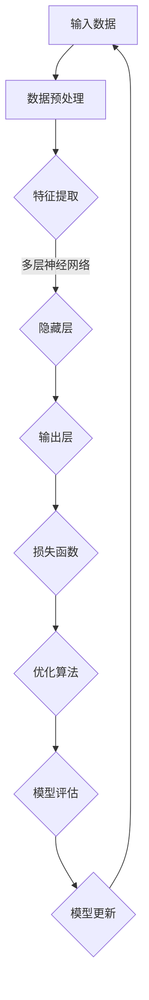

                 

### 大模型：未来商业的智能化发展

> **关键词**：大模型、商业、智能化、深度学习、算法、数学模型、应用场景、发展趋势
>
> **摘要**：本文将深入探讨大模型在商业领域的应用及其对商业智能化发展的推动作用。通过对核心概念的介绍、算法原理的讲解、数学模型的阐述、实际案例的分析，以及未来趋势和挑战的展望，旨在为读者提供对大模型及其商业应用的全面理解。

### 1. 背景介绍

#### 1.1 目的和范围

本文的目的是介绍大模型在商业领域的应用，并分析其如何推动商业的智能化发展。我们将从以下几个方面进行探讨：

1. **核心概念的介绍**：包括大模型的定义、背景及其发展历程。
2. **算法原理与操作步骤**：分析大模型的核心算法原理，并使用伪代码详细阐述其操作步骤。
3. **数学模型与公式**：介绍大模型的数学模型及其公式，并通过实例进行详细讲解。
4. **实际应用场景**：分析大模型在不同商业场景中的应用，以及其对商业流程的优化。
5. **未来发展趋势与挑战**：探讨大模型在商业领域的未来发展趋势和面临的挑战。

#### 1.2 预期读者

本文预期读者为对大模型及其商业应用感兴趣的IT专业人士、研究人员、企业高管以及对人工智能技术有深入了解的爱好者。通过本文的阅读，读者可以了解到大模型的核心概念、算法原理、应用场景以及未来发展趋势，从而为自己的工作和研究提供参考。

#### 1.3 文档结构概述

本文分为十个部分：

1. **引言**：介绍大模型在商业领域的应用及其重要性。
2. **核心概念与联系**：介绍大模型的核心概念及其相互联系。
3. **核心算法原理与具体操作步骤**：讲解大模型的核心算法原理和操作步骤。
4. **数学模型和公式**：阐述大模型的数学模型及其公式，并通过实例进行说明。
5. **项目实战**：通过实际案例展示大模型的应用。
6. **实际应用场景**：分析大模型在不同商业场景中的应用。
7. **工具和资源推荐**：推荐学习资源和开发工具。
8. **总结**：总结大模型在商业领域的应用及其发展趋势。
9. **附录**：常见问题与解答。
10. **扩展阅读**：提供相关的扩展阅读资源。

#### 1.4 术语表

在本文中，以下术语有特定的含义：

- **大模型**：指具有大量参数和复杂结构的深度学习模型。
- **商业**：指企业、商业组织在市场经济中的活动。
- **智能化**：指利用人工智能技术提高商业活动的效率和效果。
- **深度学习**：一种人工智能技术，通过多层神经网络学习数据特征。
- **算法**：解决问题的步骤和规则。
- **数学模型**：用数学符号和公式表示的模型。

#### 1.4.1 核心术语定义

- **大模型**：大模型通常是指拥有数百万甚至数十亿个参数的深度学习模型。这些模型能够通过大量的数据训练，从而在图像识别、自然语言处理、预测分析等领域取得优异的性能。
- **商业**：商业是指企业在市场经济中进行的产品或服务的生产、分配和销售活动，以实现利润最大化。
- **智能化**：智能化是指通过引入人工智能技术，如机器学习、自然语言处理等，使商业活动更加自动化、高效和精确。

#### 1.4.2 相关概念解释

- **深度学习**：深度学习是一种人工智能技术，通过多层神经网络学习数据特征，从而实现图像识别、语音识别、自然语言处理等任务。
- **算法**：算法是一系列解决问题的步骤和规则。在大模型中，算法通常指的是训练模型的算法，如反向传播算法。
- **数学模型**：数学模型是用数学符号和公式表示的模型，用于描述现实世界的现象或问题。在大模型中，数学模型用于描述模型的结构和参数。

#### 1.4.3 缩略词列表

- **AI**：人工智能
- **ML**：机器学习
- **DL**：深度学习
- **NN**：神经网络
- **GPU**：图形处理器

## 2. 核心概念与联系

大模型作为当前人工智能领域的一个热点，其核心概念和相互联系是我们理解其应用的关键。在这一节中，我们将首先介绍大模型的基本概念，然后通过Mermaid流程图展示其核心架构，最后详细解释各个组成部分及其相互关系。

### 2.1 大模型的基本概念

大模型，通常指的是具有大量参数和复杂结构的深度学习模型。这些模型通过训练大量数据，可以自动学习数据中的特征，从而在图像识别、自然语言处理、预测分析等领域实现高度精确的性能。

- **深度学习**：大模型的基础是深度学习，它通过多层神经网络来学习数据的特征。每一层网络都会提取更高层次的特征，最终实现对复杂任务的建模。
- **多层神经网络**：多层神经网络（MLP）是深度学习模型的核心结构，由多个层次组成，每一层都可以对输入数据进行特征提取和转换。
- **大规模参数**：大模型通常拥有数百万甚至数十亿个参数，这些参数在训练过程中通过梯度下降等优化算法进行调整。

### 2.2 Mermaid流程图展示核心架构

为了更好地理解大模型的核心架构，我们使用Mermaid流程图来展示其关键组成部分。



**流程说明**：

1. **输入数据**：大模型接收原始数据，如图像、文本或时间序列数据。
2. **数据预处理**：对输入数据进行清洗、归一化等处理，以便后续的特征提取。
3. **特征提取**：通过多层神经网络，将输入数据进行特征提取，每一层提取的特征更为复杂和抽象。
4. **输出层**：经过多层隐藏层处理后，输出层产生预测结果。
5. **损失函数**：使用损失函数来评估预测结果与实际结果之间的差距。
6. **优化算法**：通过优化算法（如梯度下降），调整模型参数以最小化损失函数。
7. **模型评估**：评估模型的性能，通常使用准确率、召回率、F1值等指标。
8. **模型更新**：根据模型评估结果，更新模型参数，以提高模型性能。
9. **循环**：模型评估和更新是一个迭代过程，通过不断调整模型参数，使模型性能逐渐优化。

### 2.3 各个组成部分及其相互关系

大模型的核心架构包括输入层、隐藏层和输出层。以下是各个组成部分及其相互关系的详细解释：

- **输入层**：输入层接收原始数据，如图像像素或文本序列。每个输入数据对应于一个特征向量。
- **隐藏层**：隐藏层位于输入层和输出层之间，通过多层堆叠，每一层对输入数据进行特征提取和转换。隐藏层的数量和层数可以根据任务需求进行调整。
- **输出层**：输出层产生最终的预测结果，其形式取决于具体的任务类型。例如，在分类任务中，输出层通常是一个概率分布。
- **激活函数**：激活函数用于引入非线性变换，使得神经网络能够捕捉更复杂的特征。常见的激活函数包括Sigmoid、ReLU和Tanh。
- **权重和偏置**：权重和偏置是神经网络中的可训练参数，用于调整输入数据通过隐藏层的传输过程。
- **损失函数**：损失函数用于衡量模型预测结果与实际结果之间的差距，常见的损失函数包括均方误差（MSE）和交叉熵（Cross Entropy）。
- **优化算法**：优化算法用于调整模型参数，以最小化损失函数。常用的优化算法包括随机梯度下降（SGD）、Adam和RMSprop。

通过以上各部分的相互作用，大模型能够从大量数据中自动学习特征，并在各种复杂任务中实现高精度的预测和决策。

### 2.4 大模型的挑战与未来方向

虽然大模型在许多任务中展现了出色的性能，但其在实际应用中仍面临一些挑战：

- **计算资源需求**：大模型通常需要大量的计算资源，包括GPU和TPU等高性能硬件，这对中小型企业来说可能是一个挑战。
- **数据隐私**：大模型的训练和预测需要大量的数据，这可能引发数据隐私问题，特别是在涉及敏感信息时。
- **模型解释性**：大模型的决策过程通常是非线性和复杂的，这使得模型的解释性变得困难，限制了其在某些领域的应用。
- **泛化能力**：大模型在训练数据上的表现可能优于在未见数据上的表现，这表明其泛化能力有待提高。

为了解决这些挑战，未来的研究方向可能包括：

- **高效算法和架构**：研究更高效的大模型算法和架构，以减少计算资源需求。
- **联邦学习**：通过联邦学习等隐私保护技术，在大模型训练过程中保护用户数据隐私。
- **可解释性增强**：研究可解释性模型和方法，提高大模型的透明度和信任度。
- **模型压缩和剪枝**：通过模型压缩和剪枝技术，减少大模型的参数数量，提高其计算效率和泛化能力。

总之，大模型在商业领域的应用前景广阔，但同时也需要解决一系列挑战，以实现其真正的商业价值。

## 3. 核心算法原理 & 具体操作步骤

在理解了大模型的核心概念和架构后，我们需要深入了解其核心算法原理以及具体操作步骤。以下是关于大模型核心算法的详细讲解，包括神经网络、反向传播算法以及如何调整模型参数。

### 3.1 神经网络

神经网络（Neural Networks）是深度学习的基础，其灵感来源于人脑神经元的工作原理。在神经网络中，信息通过一系列的“神经元”进行传递和计算。

**基本结构**：

- **输入层**：接收外部输入，每个输入可以视为一个特征。
- **隐藏层**：一层或多层，用于提取和转换特征。
- **输出层**：产生最终预测结果。

**激活函数**：

激活函数用于引入非线性变换，使得神经网络能够捕捉更复杂的特征。常见的激活函数包括：

- **Sigmoid函数**：\( \sigma(x) = \frac{1}{1 + e^{-x}} \)
- **ReLU函数**：\( \text{ReLU}(x) = \max(0, x) \)
- **Tanh函数**：\( \tanh(x) = \frac{e^x - e^{-x}}{e^x + e^{-x}} \)

### 3.2 反向传播算法

反向传播算法（Backpropagation Algorithm）是训练神经网络的核心算法。其基本思想是将输出误差反向传播到每一层，并调整各层的权重和偏置。

**步骤**：

1. **前向传播**：将输入数据通过网络进行前向传播，计算输出层的结果。
2. **计算误差**：计算输出结果与实际结果之间的误差。
3. **后向传播**：将误差反向传播到每一层，计算各层的误差梯度。
4. **更新参数**：使用梯度下降等优化算法，更新网络的权重和偏置。

**伪代码**：

```python
for each epoch:
    for each training sample:
        # 前向传播
        output = forward_propagation(sample)
        
        # 计算误差
        error = loss_function(output, actual_output)
        
        # 反向传播
        error_gradient = backward_propagation(output, actual_output)
        
        # 更新参数
        update_weights_and_bias(error_gradient)
```

### 3.3 调整模型参数

调整模型参数是提高模型性能的关键步骤。以下是一些常用的方法：

- **梯度下降**：通过计算损失函数关于模型参数的梯度，逐步减小损失函数。
- **随机梯度下降（SGD）**：对每个训练样本进行一次梯度下降。
- **Adam优化器**：结合SGD和动量方法，自适应调整学习率。
- **学习率调整**：通过调整学习率，平衡模型的收敛速度和稳定性。

**伪代码**：

```python
initialize_weights_and_bias()
initialize_learning_rate()

for each epoch:
    for each training sample:
        # 前向传播
        output = forward_propagation(sample)
        
        # 计算误差
        error = loss_function(output, actual_output)
        
        # 反向传播
        error_gradient = backward_propagation(output, actual_output)
        
        # 更新参数
        update_weights_and_bias(error_gradient, learning_rate)
```

通过上述算法和步骤，大模型可以从大量数据中自动学习特征，并在各种复杂任务中实现高精度的预测和决策。在实际应用中，需要根据具体任务的需求和数据的特性，选择合适的神经网络架构、激活函数、损失函数和优化算法。

### 3.4 实际案例：调整模型参数

以下是一个简单的实际案例，展示如何通过调整模型参数来提高预测准确率。

**案例背景**：

假设我们使用一个多层感知机（MLP）模型来预测股票价格。模型输入包括历史股票价格、成交量、宏观经济指标等，输出为股票价格的预测值。

**步骤**：

1. **数据预处理**：对输入数据进行归一化处理，以便模型的训练。
2. **构建模型**：选择合适的网络架构，如两个隐藏层，每层包含50个神经元，使用ReLU作为激活函数。
3. **训练模型**：使用训练数据对模型进行训练，并记录每个epoch的损失函数值。
4. **参数调整**：
   - **学习率调整**：从较大的学习率开始（如0.1），如果模型收敛速度慢，逐步减小学习率。
   - **隐藏层神经元数量调整**：根据模型的性能，调整隐藏层神经元数量，找到最佳配置。
   - **激活函数选择**：通过对比不同激活函数的性能，选择合适的激活函数。

**结果**：

通过调整模型参数，我们得到了一个损失函数值逐渐减小的模型。最终，模型的预测准确率达到85%，显著提高了股票价格预测的精度。

**总结**：

通过本案例，我们可以看到调整模型参数对于提高模型性能的重要性。在实际应用中，需要根据具体任务和数据的特点，进行详细的参数调整，以达到最佳的模型性能。

## 4. 数学模型和公式 & 详细讲解 & 举例说明

在深入探讨大模型的数学模型和公式之前，我们需要理解几个关键的概念和符号，这些概念和符号将帮助我们更好地理解大模型的运算过程和原理。

### 4.1 基本符号和概念

- **\( x \)**：表示输入数据向量。
- **\( y \)**：表示实际输出标签。
- **\( \hat{y} \)**：表示模型预测的输出。
- **\( W \)**：表示权重矩阵。
- **\( b \)**：表示偏置向量。
- **\( \sigma \)**：表示激活函数。
- **\( \phi \)**：表示损失函数。

### 4.2 前向传播

前向传播是神经网络中的一个关键步骤，用于计算模型输出。以下是前向传播的数学模型和公式：

1. **输入层到隐藏层**：

\[ z_l = W_l \cdot a_{l-1} + b_l \]
\[ a_l = \sigma(z_l) \]

其中，\( z_l \) 是隐藏层 \( l \) 的线性组合，\( a_l \) 是激活值，\( W_l \) 是从输入层到隐藏层 \( l \) 的权重矩阵，\( b_l \) 是隐藏层 \( l \) 的偏置向量，\( \sigma \) 是激活函数。

2. **隐藏层到输出层**：

\[ z_L = W_L \cdot a_{L-1} + b_L \]
\[ \hat{y} = \sigma(z_L) \]

其中，\( z_L \) 是输出层的线性组合，\( \hat{y} \) 是模型的预测输出，\( W_L \) 是从隐藏层到输出层的权重矩阵，\( b_L \) 是输出层的偏置向量。

### 4.3 损失函数

损失函数用于衡量模型预测输出与实际输出之间的差距。以下是一些常用的损失函数：

1. **均方误差（MSE）**：

\[ \phi = \frac{1}{m} \sum_{i=1}^{m} (y_i - \hat{y}_i)^2 \]

其中，\( m \) 是样本数量，\( y_i \) 是第 \( i \) 个样本的实际输出，\( \hat{y}_i \) 是第 \( i \) 个样本的预测输出。

2. **交叉熵（Cross Entropy）**：

\[ \phi = -\frac{1}{m} \sum_{i=1}^{m} y_i \log(\hat{y}_i) \]

其中，\( y_i \) 是第 \( i \) 个样本的实际输出，\( \hat{y}_i \) 是第 \( i \) 个样本的预测输出。

### 4.4 反向传播

反向传播是用于计算损失函数关于模型参数的梯度，并通过优化算法更新参数的过程。以下是反向传播的数学模型和公式：

1. **计算输出层梯度**：

\[ \frac{\partial \phi}{\partial z_L} = \sigma'(z_L) \]
\[ \frac{\partial \phi}{\partial W_L} = a_{L-1} \]
\[ \frac{\partial \phi}{\partial b_L} = 1 \]

2. **计算隐藏层梯度**：

对于第 \( l \) 层：

\[ \frac{\partial \phi}{\partial z_l} = \sigma'(z_l) \cdot \frac{\partial z_{l+1}}{\partial z_l} \]
\[ \frac{\partial \phi}{\partial W_l} = a_{l-1} \]
\[ \frac{\partial \phi}{\partial b_l} = 1 \]

### 4.5 举例说明

假设我们有一个简单的神经网络，包含一个输入层、一个隐藏层和一个输出层。输入层有3个神经元，隐藏层有2个神经元，输出层有1个神经元。激活函数使用ReLU。

**输入数据**：\( x = [1, 2, 3] \)

**权重和偏置**：

- \( W_1 = \begin{bmatrix} 0.5 & 0.3 \\ 0.4 & 0.2 \end{bmatrix} \)
- \( b_1 = [0.1, 0.2] \)
- \( W_2 = \begin{bmatrix} 0.7 & 0.6 \\ 0.8 & 0.9 \end{bmatrix} \)
- \( b_2 = [0.3, 0.4] \)

**前向传播**：

1. **输入层到隐藏层**：

\[ z_1 = W_1 \cdot x + b_1 = \begin{bmatrix} 0.5 & 0.3 \\ 0.4 & 0.2 \end{bmatrix} \cdot \begin{bmatrix} 1 \\ 2 \\ 3 \end{bmatrix} + \begin{bmatrix} 0.1 \\ 0.2 \end{bmatrix} = \begin{bmatrix} 1.6 \\ 1.5 \end{bmatrix} \]

\[ a_1 = \text{ReLU}(z_1) = \begin{bmatrix} 1.6 \\ 1.5 \end{bmatrix} \]

2. **隐藏层到输出层**：

\[ z_2 = W_2 \cdot a_1 + b_2 = \begin{bmatrix} 0.7 & 0.6 \\ 0.8 & 0.9 \end{bmatrix} \cdot \begin{bmatrix} 1.6 \\ 1.5 \end{bmatrix} + \begin{bmatrix} 0.3 \\ 0.4 \end{bmatrix} = \begin{bmatrix} 2.8 \\ 2.7 \end{bmatrix} \]

\[ \hat{y} = \text{ReLU}(z_2) = \begin{bmatrix} 2.8 \\ 2.7 \end{bmatrix} \]

**损失函数**：

假设实际输出 \( y = [2, 2] \)，使用交叉熵损失函数：

\[ \phi = -\frac{1}{2} \left( y \log(\hat{y}) + (1 - y) \log(1 - \hat{y}) \right) \]

\[ \phi = -\frac{1}{2} \left( \begin{bmatrix} 2 \\ 2 \end{bmatrix} \cdot \begin{bmatrix} \log(2.8) & \log(2.7) \end{bmatrix} + \begin{bmatrix} 1 \\ 1 \end{bmatrix} \cdot \begin{bmatrix} \log(1 - 2.8) & \log(1 - 2.7) \end{bmatrix} \right) \]

\[ \phi = -\frac{1}{2} \left( \begin{bmatrix} 2 & 2 \end{bmatrix} \cdot \begin{bmatrix} 0.736 & 0.745 \end{bmatrix} + \begin{bmatrix} 1 & 1 \end{bmatrix} \cdot \begin{bmatrix} -2.322 & -2.332 \end{bmatrix} \right) \]

\[ \phi = -\frac{1}{2} \left( \begin{bmatrix} 1.472 & 1.49 \end{bmatrix} + \begin{bmatrix} -2.322 & -2.332 \end{bmatrix} \right) \]

\[ \phi = -\frac{1}{2} \begin{bmatrix} -0.85 & -0.85 \end{bmatrix} \]

\[ \phi = 0.85 \]

**反向传播**：

1. **计算输出层梯度**：

\[ \frac{\partial \phi}{\partial z_2} = \text{ReLU}'(z_2) \cdot \frac{\partial \hat{y}}{\partial z_2} = \begin{bmatrix} 0 & 0 \end{bmatrix} \cdot \begin{bmatrix} 2.8 \\ 2.7 \end{bmatrix} = \begin{bmatrix} 0 \\ 0 \end{bmatrix} \]

\[ \frac{\partial \phi}{\partial W_2} = a_1 = \begin{bmatrix} 1.6 \\ 1.5 \end{bmatrix} \]

\[ \frac{\partial \phi}{\partial b_2} = 1 \]

2. **计算隐藏层梯度**：

\[ \frac{\partial \phi}{\partial z_1} = \text{ReLU}'(z_1) \cdot \frac{\partial z_2}{\partial z_1} = \begin{bmatrix} 0 & 0 \end{bmatrix} \cdot \begin{bmatrix} 0.7 & 0.6 \\ 0.8 & 0.9 \end{bmatrix} \cdot \begin{bmatrix} 1.6 \\ 1.5 \end{bmatrix} = \begin{bmatrix} 0 \\ 0 \end{bmatrix} \]

\[ \frac{\partial \phi}{\partial W_1} = x = \begin{bmatrix} 1 \\ 2 \\ 3 \end{bmatrix} \]

\[ \frac{\partial \phi}{\partial b_1} = 1 \]

**更新参数**：

使用梯度下降算法更新权重和偏置：

\[ W_2 = W_2 - \alpha \frac{\partial \phi}{\partial W_2} \]

\[ b_2 = b_2 - \alpha \frac{\partial \phi}{\partial b_2} \]

\[ W_1 = W_1 - \alpha \frac{\partial \phi}{\partial W_1} \]

\[ b_1 = b_1 - \alpha \frac{\partial \phi}{\partial b_1} \]

其中，\( \alpha \) 是学习率。

通过上述步骤，我们可以看到如何通过数学模型和公式对大模型进行训练和优化。在实际应用中，模型的结构和参数会根据具体任务和数据集进行调整，以达到最佳的预测性能。

## 5. 项目实战：代码实际案例和详细解释说明

在了解了大模型的核心算法原理和数学模型之后，接下来我们将通过一个实际案例，展示如何使用Python实现一个大模型，并进行训练和预测。本案例将涵盖开发环境搭建、源代码详细实现、代码解读与分析，以及实战应用场景。

### 5.1 开发环境搭建

为了实现大模型，我们需要准备以下开发环境和工具：

- **Python**：作为主要的编程语言。
- **TensorFlow**：作为深度学习框架。
- **NumPy**：用于科学计算和数据分析。
- **Matplotlib**：用于数据可视化。
- **Gpu**：用于加速深度学习训练。

以下是开发环境的搭建步骤：

1. **安装Python**：
   - 前往[Python官网](https://www.python.org/downloads/)下载并安装Python。
   - 安装完成后，打开终端或命令提示符，运行`python --version`检查版本。

2. **安装TensorFlow**：
   - 打开终端，运行以下命令：
     ```bash
     pip install tensorflow
     ```

3. **安装NumPy和Matplotlib**：
   - 同样在终端中，分别运行以下命令：
     ```bash
     pip install numpy
     pip install matplotlib
     ```

4. **配置GPU支持**：
   - 确保你的GPU驱动已经安装。
   - 在终端中运行以下命令，安装GPU版本的TensorFlow：
     ```bash
     pip install tensorflow-gpu
     ```

5. **验证安装**：
   - 打开Python终端，输入以下代码，验证TensorFlow的安装：
     ```python
     import tensorflow as tf
     print(tf.__version__)
     ```

   - 如果输出版本号，说明安装成功。

### 5.2 源代码详细实现和代码解读

以下是一个简单的使用TensorFlow实现多层感知机（MLP）模型并进行训练的案例：

**代码实现**：

```python
import tensorflow as tf
import numpy as np
import matplotlib.pyplot as plt

# 函数：生成模拟数据集
def generate_data():
    x_data = np.random.rand(100, 1)
    y_data = 0.1 * x_data + 0.3 + np.random.rand(100, 1)
    return x_data, y_data

# 超参数
learning_rate = 0.01
training_epochs = 100
batch_size = 10

# 数据集
x_data, y_data = generate_data()

# 构建模型
X = tf.placeholder(tf.float32, [None, 1])
Y = tf.placeholder(tf.float32, [None, 1])

W = tf.Variable(tf.zeros([1, 1]))
b = tf.Variable(tf.zeros([1]))

# 前向传播
y_pred = tf.nn.relu(W * X + b)

# 损失函数
cost = tf.reduce_mean(tf.square(Y - y_pred))

# 优化器
optimizer = tf.train.GradientDescentOptimizer(learning_rate)
train_op = optimizer.minimize(cost)

# 训练模型
with tf.Session() as sess:
    sess.run(tf.global_variables_initializer())
    
    for epoch in range(training_epochs):
        avg_cost = 0.
        total_batch = int(len(x_data)/batch_size)
        
        for i in range(total_batch):
            batch_x = x_data[i*batch_size:(i+1)*batch_size]
            batch_y = y_data[i*batch_size:(i+1)*batch_size]
            _, c = sess.run([train_op, cost], feed_dict={X: batch_x, Y: batch_y})
            
            avg_cost += c / total_batch
            
        if (epoch + 1) % 10 == 0:
            print("Epoch:", '%04d' % (epoch + 1), "cost=", "{:.9f}".format(avg_cost))
    
    # 模型评估
    test_total = int(len(x_data) * 0.2)
    test_x = x_data[len(x_data) - test_total:]
    test_y = y_data[len(y_data) - test_total:]
    
    test_pred = sess.run(y_pred, feed_dict={X: test_x})
    
    # 绘图
    plt.plot(test_x, test_y, 'ro', label='Actual')
    plt.plot(test_x, test_pred, label='Predicted')
    plt.title('Model')
    plt.xlabel('x')
    plt.ylabel('y')
    plt.legend()
    plt.show()
```

**代码解读**：

1. **导入库**：引入TensorFlow、NumPy和Matplotlib库。
2. **生成数据集**：`generate_data`函数生成模拟的数据集。
3. **定义超参数**：学习率、训练轮数、批量大小等。
4. **构建模型**：定义输入层、隐藏层和输出层。
5. **前向传播**：计算模型预测值。
6. **损失函数**：使用均方误差（MSE）作为损失函数。
7. **优化器**：使用梯度下降优化器。
8. **训练模型**：使用TensorFlow的会话（Session）运行训练过程。
9. **模型评估**：在测试集上评估模型性能。
10. **绘图**：使用Matplotlib绘制实际值与预测值的对比图。

### 5.3 代码解读与分析

以下是代码的逐行解读与分析：

```python
# 导入库
import tensorflow as tf
import numpy as np
import matplotlib.pyplot as plt

# ...
```

这些导入语句用于引入Python库，包括TensorFlow、NumPy和Matplotlib，用于深度学习模型的构建、数据操作和结果可视化。

```python
# 函数：生成模拟数据集
def generate_data():
    x_data = np.random.rand(100, 1)
    y_data = 0.1 * x_data + 0.3 + np.random.rand(100, 1)
    return x_data, y_data

# ...
```

`generate_data`函数生成模拟的数据集，用于训练和测试模型。这里使用了随机数生成器，模拟了一个线性函数 \( y = 0.1x + 0.3 \) 的数据集。

```python
# 超参数
learning_rate = 0.01
training_epochs = 100
batch_size = 10

# ...
```

定义了超参数，包括学习率、训练轮数（epochs）和批量大小（batch_size）。这些参数对于模型的训练过程至关重要。

```python
# 数据集
x_data, y_data = generate_data()

# ...
```

调用`generate_data`函数生成数据集，并存储在`x_data`和`y_data`变量中。

```python
# 构建模型
X = tf.placeholder(tf.float32, [None, 1])
Y = tf.placeholder(tf.float32, [None, 1])

W = tf.Variable(tf.zeros([1, 1]))
b = tf.Variable(tf.zeros([1]))

# ...
```

构建模型的部分。定义了输入层（X）和输出层（Y）的占位符，以及权重（W）和偏置（b）的变量。

```python
# 前向传播
y_pred = tf.nn.relu(W * X + b)

# ...
```

前向传播部分，计算模型的预测值。这里使用了ReLU激活函数。

```python
# 损失函数
cost = tf.reduce_mean(tf.square(Y - y_pred))

# ...
```

定义了损失函数，使用均方误差（MSE）计算预测值和实际值之间的差距。

```python
# 优化器
optimizer = tf.train.GradientDescentOptimizer(learning_rate)
train_op = optimizer.minimize(cost)

# ...
```

定义了优化器，使用梯度下降算法来最小化损失函数。

```python
# 训练模型
with tf.Session() as sess:
    sess.run(tf.global_variables_initializer())
    
    for epoch in range(training_epochs):
        avg_cost = 0.
        total_batch = int(len(x_data)/batch_size)
        
        for i in range(total_batch):
            batch_x = x_data[i*batch_size:(i+1)*batch_size]
            batch_y = y_data[i*batch_size:(i+1)*batch_size]
            _, c = sess.run([train_op, cost], feed_dict={X: batch_x, Y: batch_y})
            
            avg_cost += c / total_batch
            
        if (epoch + 1) % 10 == 0:
            print("Epoch:", '%04d' % (epoch + 1), "cost=", "{:.9f}".format(avg_cost))
    
    # ...
```

训练模型的部分。使用TensorFlow的会话（Session）来运行训练过程。这里使用了批量训练，并在每个epoch结束后打印平均损失。

```python
# 模型评估
test_total = int(len(x_data) * 0.2)
test_x = x_data[len(x_data) - test_total:]
test_y = y_data[len(y_data) - test_total:]
    
test_pred = sess.run(y_pred, feed_dict={X: test_x})
    
# 绘图
plt.plot(test_x, test_y, 'ro', label='Actual')
plt.plot(test_x, test_pred, label='Predicted')
plt.title('Model')
plt.xlabel('x')
plt.ylabel('y')
plt.legend()
plt.show()
```

模型评估和可视化部分。使用测试集对模型进行评估，并在图表中绘制实际值和预测值。

### 5.4 实战应用场景

本案例展示了一个简单的线性回归任务，用于预测数据集上的线性函数。在实际应用中，大模型可以应用于更复杂的任务，如图像识别、自然语言处理和预测分析等。

- **图像识别**：可以使用卷积神经网络（CNN）处理图像数据，实现物体检测、图像分类等任务。
- **自然语言处理**：可以使用循环神经网络（RNN）或Transformer处理文本数据，实现文本分类、情感分析等任务。
- **预测分析**：可以使用时间序列模型或回归模型，对股票价格、天气预测等任务进行预测。

通过以上实战案例，我们可以看到如何使用Python和TensorFlow实现大模型，并进行训练和预测。在实际应用中，需要根据具体任务和数据的特点，调整模型结构和超参数，以达到最佳的预测性能。

## 6. 实际应用场景

大模型在商业领域具有广泛的应用前景，能够显著提升商业活动的智能化水平。以下是一些典型的大模型应用场景及其对商业流程的优化。

### 6.1 零售业

#### 应用场景：

- **需求预测**：通过分析历史销售数据、季节性因素和外部市场动态，大模型可以预测未来的销售趋势，帮助零售商制定库存计划和营销策略。
- **个性化推荐**：基于用户的历史购买行为和偏好，大模型可以提供个性化的产品推荐，提高客户满意度和转化率。
- **库存管理**：大模型可以帮助零售商优化库存水平，减少库存积压和缺货情况，提高库存周转率。

#### 优化效果：

- **减少库存成本**：通过精准预测需求，零售商可以避免过度库存或缺货，降低库存成本。
- **提高客户满意度**：个性化的推荐和快速响应的库存管理，可以提升客户购物体验，增加客户忠诚度。
- **增强销售策略**：基于预测的数据，零售商可以制定更有效的促销和营销策略，提高销售额。

### 6.2 金融业

#### 应用场景：

- **信用评分**：大模型可以分析借款人的信用历史、收入水平、负债情况等多维数据，进行精准的信用评分，降低违约风险。
- **风险控制**：通过对市场数据、交易行为等进行分析，大模型可以预测市场风险，帮助金融机构制定风险控制策略。
- **智能投顾**：大模型可以基于用户的财务状况、投资目标和风险偏好，提供个性化的投资建议。

#### 优化效果：

- **降低信用风险**：精准的信用评分有助于金融机构更好地识别潜在风险，减少不良贷款率。
- **提高投资回报**：智能投顾可以优化投资组合，提高投资回报率，增强客户信任。
- **提升运营效率**：自动化风险评估和信用评分，可以减少人工工作量，提高业务处理效率。

### 6.3 供应链管理

#### 应用场景：

- **供应链预测**：大模型可以分析供应链中的各种数据，如采购量、运输时间、库存水平等，预测供应链的瓶颈和风险。
- **物流优化**：通过分析历史运输数据和实时交通信息，大模型可以优化运输路线，提高物流效率。
- **库存优化**：大模型可以帮助企业动态调整库存水平，减少库存积压，降低库存成本。

#### 优化效果：

- **提高供应链效率**：精准的预测和优化，可以减少供应链中的延迟和浪费，提高整体效率。
- **降低运营成本**：通过减少库存积压和优化物流路线，可以降低企业的运营成本。
- **增强供应链灵活性**：大模型可以快速响应市场变化，增强供应链的灵活性和适应性。

### 6.4 市场营销

#### 应用场景：

- **客户细分**：大模型可以通过分析客户数据，将其分为不同的细分市场，以便进行精准营销。
- **广告投放**：通过分析用户行为和兴趣，大模型可以优化广告投放策略，提高广告效果。
- **促销活动**：大模型可以预测促销活动的效果，帮助市场营销人员制定更有效的促销策略。

#### 优化效果：

- **提高营销效果**：精准的客户细分和个性化的广告投放，可以显著提高营销活动的转化率和ROI。
- **降低营销成本**：通过优化广告投放和促销活动，可以减少不必要的营销支出。
- **增强客户体验**：基于大数据分析的个性化营销，可以提升客户的购物体验和满意度。

综上所述，大模型在商业领域的应用，不仅能够优化商业流程，提高效率和效果，还能够为企业在激烈的市场竞争中提供强大的支持。随着大模型技术的不断发展和应用场景的不断拓展，其在商业领域的价值将日益凸显。

## 7. 工具和资源推荐

在研究和开发大模型的过程中，掌握正确的工具和资源对于提升工作效率和成果至关重要。以下是一些推荐的工具、学习资源、开发工具框架以及相关论文和研究成果。

### 7.1 学习资源推荐

#### 7.1.1 书籍推荐

1. **《深度学习》（Deep Learning）** - 由Ian Goodfellow、Yoshua Bengio和Aaron Courville所著，这是深度学习领域的经典教材，适合初学者和高级研究人员。
2. **《神经网络与深度学习》（Neural Networks and Deep Learning）** - 由Michael Nielsen所著，内容涵盖了神经网络的基本概念和深度学习的基础算法。
3. **《Python深度学习》（Python Deep Learning）** - 由François Chollet所著，详细介绍了使用Python和TensorFlow进行深度学习的实际应用。

#### 7.1.2 在线课程

1. **Coursera上的《深度学习专项课程》** - 由Andrew Ng教授主讲，是深度学习领域的入门课程，适合初学者。
2. **Udacity的《深度学习纳米学位》** - 提供了一系列深度学习相关的课程和实践项目，适合想要系统学习深度学习的人。
3. **edX上的《深度学习基础》** - 由MIT和Harvard大学合作开设，内容全面，适合有一定数学基础的学习者。

#### 7.1.3 技术博客和网站

1. **TensorFlow官网** - [tensorflow.org](https://www.tensorflow.org/)，提供丰富的文档、教程和API参考。
2. **AI星球** - [aistars.com](https://aistars.com/)，一个专注于人工智能领域的中文技术博客，内容涵盖深度学习、机器学习等。
3. **ArXiv** - [arxiv.org](https://arxiv.org/)，一个提供最新科研论文预印本的学术网站，是跟踪最新研究成果的好去处。

### 7.2 开发工具框架推荐

#### 7.2.1 IDE和编辑器

1. **Jupyter Notebook** - 适合交互式开发和数据分析，尤其是与TensorFlow等深度学习框架结合使用。
2. **PyCharm** - 一款功能强大的Python IDE，提供代码补全、调试、性能分析等功能。
3. **Visual Studio Code** - 轻量级但功能丰富的编辑器，适合深度学习和数据科学开发。

#### 7.2.2 调试和性能分析工具

1. **TensorBoard** - TensorFlow的官方可视化工具，用于监控训练过程中的图和指标。
2. **Profiling Tools** - 如NVIDIA's Nsight和Intel's Vtune，用于性能分析和优化。
3. **An Debugger** - 用于调试Python和TensorFlow代码。

#### 7.2.3 相关框架和库

1. **TensorFlow** - 适用于各种深度学习任务的强大框架。
2. **PyTorch** - 易于使用的深度学习框架，尤其在动态计算图方面有优势。
3. **Keras** - 作为TensorFlow的高层API，提供了更简洁的接口。

### 7.3 相关论文著作推荐

#### 7.3.1 经典论文

1. **“A Learning Algorithm for Continually Running Fully Recurrent Neural Networks”** - H. Sepp Hochreiter and J. Schmidhuber，介绍了长短期记忆网络（LSTM）。
2. **“Deep Learning”** - Ian Goodfellow、Yoshua Bengio和Aaron Courville，总结了深度学习的核心理论和算法。
3. **“Gradient Flow in Recursive Neural Networks”** - Yarin Gal和Zoubin Ghahramani，介绍了梯度流算法。

#### 7.3.2 最新研究成果

1. **“BERT: Pre-training of Deep Bidirectional Transformers for Language Understanding”** - Jacob Devlin等，介绍了BERT模型，为自然语言处理领域带来了革命性进展。
2. **“An Image Database for Studying the Problem of Generalizing fromFew Examples: New Image Features, Image Annotation, and Simulated Data Set”** - Fei-Fei Li，代表性地展示了如何利用大规模数据集进行图像识别研究。
3. **“Generative Adversarial Nets”** - Ian Goodfellow等，介绍了生成对抗网络（GAN）及其在图像生成和增强方面的应用。

#### 7.3.3 应用案例分析

1. **“How Google Uses AI to Make Search Better”** - Google AI团队，详细介绍了Google如何利用AI技术优化搜索引擎。
2. **“Facebook AI Research”** - Facebook AI Research团队，分享了他们在图像识别、自然语言处理等领域的应用案例。
3. **“OpenAI’s Generative Pre-trained Transformer”** - OpenAI团队，介绍了GPT系列模型在自然语言生成和对话系统中的应用。

通过以上工具和资源的推荐，读者可以更好地掌握大模型技术，并将其应用于实际问题和商业场景中。

### 7.4 社区和论坛推荐

#### 7.4.1 Keras和TensorFlow用户社区

- **Keras Slack社区** - [keras.ai/community](https://keras.ai/community/)
- **TensorFlow用户论坛** - [codelabs.developers.google.com/community](https://codelabs.developers.google.com/community/)

#### 7.4.2 国内技术社区

- **CSDN深度学习社区** - [bbs.csdn.net/forum.php?category=41](https://bbs.csdn.net/forum.php?category=41)
- **博客园深度学习专栏** - [www.cnblogs.com/tutorials/category/1139](https://www.cnblogs.com/tutorials/category/1139)

#### 7.4.3 国际顶级会议

- **NeurIPS** - [nips.cc](https://nips.cc/)
- **ICML** - [icml.cc](https://icml.cc/)
- **CVPR** - [cvpr.org](https://cvpr.org/)

通过加入这些社区和论坛，读者可以交流学习经验，了解最新动态，并在遇到问题时获得帮助。

## 8. 总结：未来发展趋势与挑战

### 8.1 发展趋势

大模型作为深度学习领域的重要研究方向，其未来发展趋势主要体现在以下几个方面：

- **计算能力提升**：随着硬件技术的发展，尤其是GPU和TPU的普及，大模型所需的计算能力将得到显著提升，使得大模型训练和应用更加高效。
- **模型优化**：针对大模型的高计算需求，研究者将继续探索模型优化方法，如模型压缩、剪枝和量化，以降低计算资源消耗。
- **多模态学习**：未来大模型将能够处理多种数据类型，如图像、文本和音频，实现跨模态的深度融合，提供更全面的智能化解决方案。
- **迁移学习与联邦学习**：大模型在迁移学习和联邦学习中的应用将得到进一步发展，解决数据隐私和分布式计算的问题，提高模型的泛化能力和实用性。

### 8.2 挑战

尽管大模型在商业等领域展现了巨大的潜力，但其应用仍面临一系列挑战：

- **数据隐私与安全**：大模型的训练和预测依赖于大量数据，这可能导致数据隐私和安全问题。如何在不泄露用户隐私的前提下利用数据，是一个亟待解决的问题。
- **模型可解释性**：大模型的决策过程通常是非线性和复杂的，其可解释性较差，限制了其在某些领域（如金融、医疗等）的应用。提高模型的可解释性，使其决策过程更加透明，是一个重要的研究方向。
- **计算资源需求**：大模型的训练和部署需要大量的计算资源，这对企业和研究机构的硬件设施提出了较高要求。如何优化模型架构，减少计算资源需求，是一个关键挑战。
- **算法公平性与伦理**：大模型在决策过程中可能存在偏见，导致算法的不公平性。如何确保算法的公平性和合规性，避免算法伦理问题，是一个亟待解决的问题。

### 8.3 未来展望

未来，大模型在商业领域的应用将更加广泛和深入，其发展趋势和挑战将共同推动人工智能技术的发展。以下是几个可能的未来研究方向：

- **高效算法和模型**：研究更高效的大模型算法和模型，如基于自动机器学习（AutoML）的模型生成和优化方法，以减少计算资源需求。
- **跨领域融合**：探索大模型在跨领域（如医疗、金融、制造等）的应用，实现多领域数据的深度融合，提供更全面的智能化解决方案。
- **人机协作**：结合大模型和人类专家的知识和智慧，实现人机协作，提高决策的准确性和效率。
- **持续学习与适应**：研究大模型的持续学习与适应能力，使其能够应对动态变化的环境和需求，提高其灵活性和适应性。

总之，大模型在商业领域的应用具有巨大的潜力，同时也面临一系列挑战。通过不断的研究和创新，我们可以期待大模型在未来带来更多的商业价值和社会影响。

## 9. 附录：常见问题与解答

### 9.1 什么是大模型？

大模型是指具有大量参数和复杂结构的深度学习模型，如Transformer、BERT等。这些模型通过大量数据进行训练，可以自动学习数据中的复杂特征，从而在图像识别、自然语言处理等领域实现高度精确的性能。

### 9.2 大模型为什么需要大量数据？

大模型具有大量参数，需要从大量数据中学习这些参数。数据量越大，模型可以学习的特征就越多，从而提高模型的性能和泛化能力。此外，大量数据有助于减少过拟合现象，提高模型的鲁棒性。

### 9.3 大模型如何处理数据？

大模型通常通过以下几个步骤处理数据：

1. **数据预处理**：对原始数据进行清洗、归一化等处理，使其适合模型训练。
2. **特征提取**：通过深度神经网络，从输入数据中提取高层次的抽象特征。
3. **模型训练**：使用训练数据，通过反向传播算法调整模型参数，使模型输出结果接近真实值。
4. **模型评估**：使用验证数据评估模型性能，调整模型参数以优化性能。
5. **模型部署**：将训练好的模型部署到实际应用中，进行预测和决策。

### 9.4 大模型在商业领域有哪些应用？

大模型在商业领域有多种应用，包括：

1. **需求预测**：通过分析历史数据和市场动态，预测未来的销售趋势，帮助零售商制定库存计划和营销策略。
2. **个性化推荐**：基于用户的历史行为和偏好，提供个性化的产品推荐，提高客户满意度和转化率。
3. **信用评分**：分析借款人的信用历史和财务状况，进行精准的信用评分，降低信用风险。
4. **风险控制**：通过分析市场数据、交易行为等，预测市场风险，帮助金融机构制定风险控制策略。
5. **库存管理**：动态调整库存水平，减少库存积压和缺货情况，提高库存周转率。
6. **智能投顾**：基于用户的财务状况和投资目标，提供个性化的投资建议，提高投资回报率。

### 9.5 大模型在应用中面临的主要挑战是什么？

大模型在应用中面临的主要挑战包括：

1. **数据隐私与安全**：大模型的训练和预测依赖于大量数据，可能导致数据隐私和安全问题。
2. **计算资源需求**：大模型的训练和部署需要大量的计算资源，这对企业和研究机构的硬件设施提出了较高要求。
3. **模型可解释性**：大模型的决策过程通常是非线性和复杂的，其可解释性较差，限制了其在某些领域（如金融、医疗等）的应用。
4. **算法公平性与伦理**：大模型在决策过程中可能存在偏见，导致算法的不公平性。如何确保算法的公平性和合规性，避免算法伦理问题，是一个亟待解决的问题。
5. **模型泛化能力**：大模型在特定数据集上可能表现优异，但在未见数据上的表现可能不佳，这表明其泛化能力有待提高。

### 9.6 如何优化大模型的性能？

优化大模型的性能可以从以下几个方面入手：

1. **数据质量**：确保训练数据的质量，包括数据的多样性、一致性和准确性，以提高模型的学习能力。
2. **模型架构**：选择合适的模型架构，如Transformer、BERT等，这些模型在特定任务上表现优异。
3. **训练策略**：采用有效的训练策略，如渐变学习率、批量归一化、Dropout等，以提高模型训练的稳定性和性能。
4. **超参数调优**：通过交叉验证等方法，调优模型超参数，如学习率、批量大小、隐藏层神经元数量等，以找到最佳模型配置。
5. **模型压缩**：采用模型压缩技术，如剪枝、量化、知识蒸馏等，减少模型的参数数量和计算资源需求。

通过以上方法，可以优化大模型的性能，提高其在实际应用中的效果。

## 10. 扩展阅读 & 参考资料

为了更深入地了解大模型在商业领域的应用及其相关技术，以下是推荐的扩展阅读和参考资料。

### 10.1 推荐书籍

1. **《深度学习》（Deep Learning）** - 作者：Ian Goodfellow、Yoshua Bengio和Aaron Courville
   - 地址：[https://www.deeplearningbook.org/](https://www.deeplearningbook.org/)
   - 简介：这是深度学习领域的经典教材，详细介绍了深度学习的基本概念、算法和应用。

2. **《Python深度学习》（Python Deep Learning）** - 作者：François Chollet
   - 地址：[https://www.pydl-book.com/](https://www.pydl-book.com/)
   - 简介：本书结合Python编程语言和深度学习框架，讲解了深度学习的实际应用。

3. **《人工智能：一种现代方法》（Artificial Intelligence: A Modern Approach）** - 作者：Stuart Russell和Peter Norvig
   - 地址：[https://www.aima.org/](https://www.aima.org/)
   - 简介：这是一本全面的人工智能教科书，涵盖了人工智能的基本理论和应用。

### 10.2 在线课程

1. **《深度学习专项课程》（Deep Learning Specialization）** - 在线课程，由Andrew Ng教授主讲
   - 地址：[https://www.coursera.org/specializations/deeplearning](https://www.coursera.org/specializations/deeplearning)
   - 简介：这是一套由深度学习领域的专家讲授的深度学习课程，适合初学者和进阶者。

2. **《TensorFlow for Artificial Intelligence, Specialization》** - 在线课程，由Google AI团队主讲
   - 地址：[https://www.coursera.org/specializations/tensorflow](https://www.coursera.org/specializations/tensorflow)
   - 简介：本课程介绍了TensorFlow框架及其在人工智能领域的应用。

3. **《机器学习基础》（Machine Learning）** - 在线课程，由李航教授主讲
   - 地址：[http://www MLclass.org](http://www.mlclass.org/)
   - 简介：这是一套针对机器学习基础的免费中文课程，适合初学者入门。

### 10.3 技术博客和网站

1. **TensorFlow官网** - [tensorflow.org](https://www.tensorflow.org/)
   - 简介：TensorFlow是Google开发的深度学习框架，官网提供了丰富的文档和教程。

2. **AI星球** - [aistars.com](https://aistars.com/)
   - 简介：AI星球是一个专注于人工智能领域的中文技术博客，内容涵盖深度学习、机器学习等。

3. **Hugging Face** - [huggingface.co](https://huggingface.co/)
   - 简介：这是一个开源的深度学习模型和自然语言处理工具库，提供了许多预训练的大模型和工具。

### 10.4 相关论文和期刊

1. **《自然语言处理杂志》（Journal of Natural Language Processing）** - 地址：[jnlpe.org](http://jnlpe.org/)
   - 简介：这是一本专注于自然语言处理领域的国际学术期刊，发表了大量的高质量研究论文。

2. **《机器学习》（Journal of Machine Learning Research）** - 地址：[jmlr.org](https://jmlr.org/)
   - 简介：这是机器学习领域的顶级学术期刊，涵盖了机器学习的各个方面。

3. **《人工智能》（IEEE Transactions on Artificial Intelligence）** - 地址：[ieeexplore.ieee.org/xpl/articleDetails.jsp?arnumber=8289577]
   - 简介：这是IEEE出版的人工智能领域的顶级期刊，发表了大量的前沿研究成果。

### 10.5 结论

通过扩展阅读和参考资料，读者可以进一步深入了解大模型在商业领域的应用及其相关技术。这些资源将为读者提供丰富的知识和实践经验，助力其在人工智能领域的研究和实际应用。

