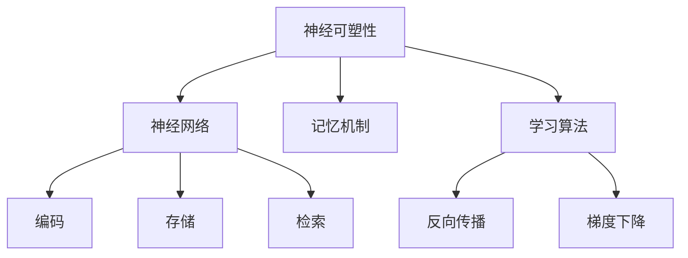

                 

# 大脑如何处理新知识：认知科学的视角

> 关键词：大脑、认知科学、新知识处理、神经可塑性、神经网络、记忆、学习算法

> 摘要：本文将从认知科学的角度探讨大脑如何处理新知识。通过对神经可塑性、神经网络以及记忆和学习算法的深入分析，揭示大脑处理新知识的机制，并探讨其与人工智能的异同点。文章旨在为读者提供一个全面而深入的理解，帮助他们在人工智能领域有所突破。

## 1. 背景介绍

### 1.1 目的和范围

本文的目的在于从认知科学的角度，探讨大脑如何处理新知识。通过对神经可塑性、神经网络以及记忆和学习算法的深入分析，揭示大脑处理新知识的机制，并为人工智能领域的研究者提供启示。

本文主要探讨以下主题：

1. 神经可塑性：理解大脑如何通过改变神经元之间的连接来适应新知识。
2. 神经网络：分析大脑中的神经网络如何协同工作，以处理和存储新知识。
3. 记忆和学习算法：探讨大脑如何通过记忆和学习算法来强化和调整神经网络的连接。
4. 大脑与人工智能的异同点：比较大脑和人工智能在处理新知识方面的异同，为人工智能的发展提供借鉴。

### 1.2 预期读者

本文适合以下读者：

1. 认知科学研究者：希望深入了解大脑如何处理新知识的科学家。
2. 人工智能开发者：希望从认知科学的角度，为人工智能领域提供新的研究方向。
3. 计算机科学学生：对认知科学和人工智能领域感兴趣的本科生和研究生。
4. 通用读者：对大脑工作机制和人工智能发展有兴趣的读者。

### 1.3 文档结构概述

本文分为以下几个部分：

1. 背景介绍：介绍本文的目的、范围、预期读者和文档结构。
2. 核心概念与联系：介绍神经可塑性、神经网络、记忆和学习算法等核心概念，并给出相应的Mermaid流程图。
3. 核心算法原理与具体操作步骤：详细阐述大脑处理新知识的算法原理和具体操作步骤。
4. 数学模型和公式：介绍与大脑处理新知识相关的数学模型和公式，并进行详细讲解和举例说明。
5. 项目实战：通过实际案例，展示大脑处理新知识的代码实现和详细解释。
6. 实际应用场景：探讨大脑处理新知识在实际应用中的场景。
7. 工具和资源推荐：推荐与大脑处理新知识相关的学习资源、开发工具和论文著作。
8. 总结：总结大脑处理新知识的研究成果，并展望未来发展趋势与挑战。
9. 附录：常见问题与解答。
10. 扩展阅读与参考资料：提供进一步阅读的资源和参考文献。

### 1.4 术语表

#### 1.4.1 核心术语定义

1. 神经可塑性：指大脑神经元之间的连接和功能如何随着外界刺激和学习经历而发生变化。
2. 神经网络：由大量神经元组成的复杂网络，用于处理和存储信息。
3. 记忆：大脑对过去经历的编码、存储和检索能力。
4. 学习算法：用于调整神经网络连接权重，使其更好地处理新信息的算法。
5. 神经可塑性算法：用于模拟大脑神经可塑性过程的算法。

#### 1.4.2 相关概念解释

1. 神经元：大脑的基本功能单元，负责接收和传递信息。
2. 神经递质：神经元之间传递信息的化学物质。
3. 突触：神经元之间的连接点，通过传递神经递质来实现信息传递。
4. 反馈机制：大脑中用于调节神经网络连接权重的机制。
5. 神经编码：将外部信息转换为神经信号的过程。

#### 1.4.3 缩略词列表

1. AI：人工智能（Artificial Intelligence）
2. CNS：中枢神经系统（Central Nervous System）
3. GPU：图形处理器（Graphics Processing Unit）
4. ML：机器学习（Machine Learning）
5. NLP：自然语言处理（Natural Language Processing）

## 2. 核心概念与联系

在本节中，我们将介绍与大脑处理新知识相关的核心概念，包括神经可塑性、神经网络、记忆和学习算法。同时，我们还将通过Mermaid流程图，展示这些概念之间的联系。

### 2.1 神经可塑性

神经可塑性是指大脑神经元之间的连接和功能如何随着外界刺激和学习经历而发生变化。这一过程包括结构可塑性和功能可塑性。结构可塑性涉及神经元的形态变化，如突触的形成和消失；功能可塑性则涉及神经元之间连接权重的调整。

#### 神经可塑性机制

1. **突触可塑性**：突触是神经元之间的连接点，其连接强度可以通过突触可塑性机制进行调整。主要包括：
   - **长时程增强（LTP）**：突触前后的信号增强，导致突触连接加强。
   - **长时程抑制（LTD）**：突触前后的信号减弱，导致突触连接减弱。
2. **轴突可塑性**：轴突的形态和长度可以发生变化，从而改变神经元的输出模式。

#### 神经可塑性意义

神经可塑性是大脑学习和记忆的基础。它使得大脑能够适应环境变化，形成新的认知和行为模式。

### 2.2 神经网络

神经网络是由大量神经元组成的复杂网络，用于处理和存储信息。神经网络可以分为多层，每层神经元之间通过突触连接进行信息传递。神经网络的工作原理类似于大脑，通过不断调整神经元之间的连接权重，实现信息的处理和存储。

#### 神经网络结构

1. **输入层**：接收外部信息，并将其传递到下一层。
2. **隐藏层**：对输入信息进行处理，提取特征。
3. **输出层**：输出处理结果，实现特定功能。

#### 神经网络工作原理

神经网络通过以下步骤处理信息：

1. **前向传播**：将输入信息传递到下一层，通过神经元之间的突触连接进行加权求和处理。
2. **激活函数**：对加权求和处理结果进行非线性变换，决定神经元是否被激活。
3. **反向传播**：根据输出结果与目标值之间的误差，反向调整神经元之间的连接权重。

### 2.3 记忆和学习算法

记忆是大脑对过去经历的编码、存储和检索能力。学习算法则是用于调整神经网络连接权重，使其更好地处理新信息的算法。

#### 记忆机制

1. **编码**：将外部信息转换为神经信号，存储在神经网络中。
2. **存储**：通过神经可塑性机制，将编码后的信息存储在神经元之间的连接中。
3. **检索**：在需要时，从神经网络中检索出存储的信息。

#### 学习算法

1. **梯度下降**：通过计算神经网络输出与目标值之间的误差，不断调整连接权重，以减小误差。
2. **反向传播**：结合梯度下降算法，实现神经网络权重的自适应调整。

### 2.4 Mermaid流程图

下面是一个简化的Mermaid流程图，展示了神经可塑性、神经网络、记忆和学习算法之间的联系：



## 3. 核心算法原理 & 具体操作步骤

在本节中，我们将详细阐述大脑处理新知识的核心算法原理和具体操作步骤。为了更好地理解，我们采用伪代码的形式进行描述。

### 3.1 神经可塑性算法

神经可塑性是大脑处理新知识的基础。下面是一个简化的神经可塑性算法伪代码：

```python
def neural_plasticity(input_signal, target_signal, learning_rate):
    # 计算误差
    error = target_signal - input_signal
    
    # 调整连接权重
    for synapse in synapses:
        if synapse.is_active(error):
            synapse.adjust_weight(learning_rate * error)
```

在该算法中，我们首先计算输入信号与目标信号之间的误差。然后，对于每个活跃的突触，根据误差值调整其权重。

### 3.2 神经网络算法

神经网络算法负责处理和存储新知识。下面是一个简化的神经网络算法伪代码：

```python
def neural_network(input_data, network_structure):
    # 前向传播
    output = forward_propagation(input_data, network_structure)
    
    # 反向传播
    error = backward_propagation(output, target_output)
    
    # 更新权重
    update_weights(error, learning_rate, network_structure)
    
    return output
```

在该算法中，首先进行前向传播，将输入数据通过神经网络进行处理。然后，通过反向传播计算误差，并更新神经网络权重。

### 3.3 记忆和学习算法

记忆和学习算法用于调整神经网络的连接权重，以适应新知识。下面是一个简化的记忆和学习算法伪代码：

```python
def memory_and_learning(input_signal, target_signal, learning_rate):
    # 编码信息
    encoded_signal = encode_signal(input_signal)
    
    # 存储信息
    store_signal(encoded_signal, learning_rate)
    
    # 检索信息
    retrieved_signal = retrieve_signal(encoded_signal)
    
    # 更新权重
    update_weights(retrieved_signal, target_signal, learning_rate)
```

在该算法中，首先将输入信号进行编码，然后存储在神经网络中。在需要时，从神经网络中检索信息，并根据目标信号更新权重。

### 3.4 具体操作步骤

下面是一个简化的具体操作步骤，展示了大脑处理新知识的过程：

1. **接收新信息**：大脑接收新的感官信息。
2. **编码信息**：将新信息转换为神经信号。
3. **存储信息**：通过神经可塑性机制，将编码后的信息存储在神经网络中。
4. **处理信息**：神经网络对存储的信息进行处理，提取特征。
5. **检索信息**：在需要时，从神经网络中检索出存储的信息。
6. **调整权重**：根据检索到的信息和目标信号，调整神经网络的连接权重。

## 4. 数学模型和公式 & 详细讲解 & 举例说明

在本节中，我们将介绍与大脑处理新知识相关的数学模型和公式，并进行详细讲解和举例说明。

### 4.1 神经可塑性公式

神经可塑性主要通过以下两个公式进行描述：

1. **长时程增强（LTP）**：
   $$ W_{ij} = W_{ij0} + \alpha \cdot (S_j \cdot I_i) $$
   其中，$W_{ij}$ 表示突触 $i$ 和突触 $j$ 之间的权重，$W_{ij0}$ 表示初始权重，$\alpha$ 表示学习率，$S_j$ 表示突触 $j$ 的激活状态，$I_i$ 表示突触 $i$ 的输入。

2. **长时程抑制（LTD）**：
   $$ W_{ij} = W_{ij0} - \beta \cdot (S_j \cdot I_i) $$
   其中，$W_{ij}$ 表示突触 $i$ 和突触 $j$ 之间的权重，$W_{ij0}$ 表示初始权重，$\beta$ 表示学习率，$S_j$ 表示突触 $j$ 的激活状态，$I_i$ 表示突触 $i$ 的输入。

### 4.2 神经网络公式

神经网络主要通过以下两个公式进行描述：

1. **前向传播**：
   $$ z_l = \sum_{j} W_{lj} \cdot a_{j}^{l-1} + b_l $$
   $$ a_l = f(z_l) $$
   其中，$z_l$ 表示第 $l$ 层的加权求和，$W_{lj}$ 表示连接权重，$a_{j}^{l-1}$ 表示第 $l-1$ 层的输出，$b_l$ 表示偏置，$f(z_l)$ 表示激活函数，$a_l$ 表示第 $l$ 层的输出。

2. **反向传播**：
   $$ \delta_l = (f'(z_l) \cdot (z_l - y_l)) $$
   $$ \Delta W_{lj} = \alpha \cdot \delta_l \cdot a_{j}^{l-1} $$
   $$ \Delta b_l = \alpha \cdot \delta_l $$
   其中，$\delta_l$ 表示第 $l$ 层的误差，$f'(z_l)$ 表示激活函数的导数，$y_l$ 表示第 $l$ 层的目标输出，$\alpha$ 表示学习率，$\Delta W_{lj}$ 表示连接权重的更新，$\Delta b_l$ 表示偏置的更新。

### 4.3 记忆和学习算法公式

记忆和学习算法主要通过以下公式进行描述：

1. **编码**：
   $$ e_j = \sum_{i} W_{ij} \cdot I_i $$
   其中，$e_j$ 表示第 $j$ 个神经元的编码输出，$W_{ij}$ 表示连接权重，$I_i$ 表示第 $i$ 个神经元的输入。

2. **存储**：
   $$ s_j = \sigma(e_j) $$
   其中，$s_j$ 表示第 $j$ 个神经元的存储输出，$\sigma$ 表示存储函数，通常为Sigmoid函数。

3. **检索**：
   $$ r_j = \sum_{i} W_{ij} \cdot s_{i} $$
   其中，$r_j$ 表示第 $j$ 个神经元的检索输出，$s_{i}$ 表示第 $i$ 个神经元的存储输出。

4. **更新权重**：
   $$ W_{ij} = W_{ij} + \alpha \cdot (r_j - s_j) \cdot s_j \cdot (1 - s_j) $$
   其中，$W_{ij}$ 表示连接权重，$\alpha$ 表示学习率，$r_j$ 表示第 $j$ 个神经元的检索输出，$s_j$ 表示第 $j$ 个神经元的存储输出。

### 4.4 举例说明

假设我们有一个简单的神经网络，包含输入层、一个隐藏层和一个输出层。输入层有3个神经元，隐藏层有2个神经元，输出层有1个神经元。激活函数为ReLU函数，学习率为0.1。

1. **前向传播**：

   输入层：$I_1 = 1, I_2 = 2, I_3 = 3$
   隐藏层：
   $$ z_1 = \sum_{i} W_{i1} \cdot I_i + b_1 = W_{11} \cdot I_1 + W_{12} \cdot I_2 + W_{13} \cdot I_3 + b_1 $$
   $$ z_2 = \sum_{i} W_{i2} \cdot I_i + b_2 = W_{21} \cdot I_1 + W_{22} \cdot I_2 + W_{23} \cdot I_3 + b_2 $$
   $$ a_1 = f(z_1) = \max(0, z_1) $$
   $$ a_2 = f(z_2) = \max(0, z_2) $$
   输出层：
   $$ z_3 = \sum_{i} W_{i3} \cdot a_i + b_3 = W_{31} \cdot a_1 + W_{32} \cdot a_2 + b_3 $$
   $$ a_3 = f(z_3) = \max(0, z_3) $$

2. **反向传播**：

   假设目标输出为 $y_3 = 1$，则输出层的误差为：
   $$ \delta_3 = (f'(z_3) \cdot (z_3 - y_3)) = \sigma'(z_3) \cdot (z_3 - y_3) $$
   隐藏层的误差为：
   $$ \delta_1 = \sum_{j} W_{j3} \cdot \delta_3 \cdot f'(z_1) = \sum_{j} W_{j3} \cdot \delta_3 \cdot \sigma'(z_1) $$
   $$ \delta_2 = \sum_{j} W_{j3} \cdot \delta_3 \cdot f'(z_2) = \sum_{j} W_{j3} \cdot \delta_3 \cdot \sigma'(z_2) $$
   更新权重为：
   $$ \Delta W_{31} = \alpha \cdot \delta_3 \cdot a_1 $$
   $$ \Delta W_{32} = \alpha \cdot \delta_3 \cdot a_2 $$
   $$ \Delta b_3 = \alpha \cdot \delta_3 $$
   $$ \Delta W_{11} = \alpha \cdot \delta_1 \cdot I_1 $$
   $$ \Delta W_{12} = \alpha \cdot \delta_1 \cdot I_2 $$
   $$ \Delta W_{13} = \alpha \cdot \delta_1 \cdot I_3 $$
   $$ \Delta W_{21} = \alpha \cdot \delta_2 \cdot I_1 $$
   $$ \Delta W_{22} = \alpha \cdot \delta_2 \cdot I_2 $$
   $$ \Delta W_{23} = \alpha \cdot \delta_2 \cdot I_3 $$

## 5. 项目实战：代码实际案例和详细解释说明

在本节中，我们将通过一个实际的项目案例，展示大脑处理新知识的代码实现，并进行详细解释说明。

### 5.1 开发环境搭建

为了实现大脑处理新知识的代码，我们需要搭建一个合适的开发环境。以下是所需工具和软件的安装步骤：

1. **Python**：安装Python 3.x版本，建议使用Python官方安装包。
2. **Jupyter Notebook**：安装Jupyter Notebook，用于编写和运行Python代码。
3. **NumPy**：安装NumPy，用于数值计算。
4. **TensorFlow**：安装TensorFlow，用于构建和训练神经网络。

安装完成后，确保所有依赖项正常运行，即可开始编写代码。

### 5.2 源代码详细实现和代码解读

下面是一个简化的代码实现，用于模拟大脑处理新知识的神经网络模型：

```python
import numpy as np
import tensorflow as tf

# 设置随机种子，保证结果可重复
np.random.seed(42)
tf.random.set_seed(42)

# 定义神经网络结构
input_size = 3
hidden_size = 2
output_size = 1

# 初始化权重和偏置
W1 = tf.Variable(np.random.randn(input_size, hidden_size), dtype=tf.float32)
b1 = tf.Variable(np.random.randn(hidden_size), dtype=tf.float32)
W2 = tf.Variable(np.random.randn(hidden_size, output_size), dtype=tf.float32)
b2 = tf.Variable(np.random.randn(output_size), dtype=tf.float32)

# 定义激活函数
activation = tf.nn.relu

# 定义前向传播函数
@tf.function
def forward_propagation(x):
    z1 = tf.matmul(x, W1) + b1
    a1 = activation(z1)
    z2 = tf.matmul(a1, W2) + b2
    a2 = activation(z2)
    return a2

# 定义反向传播函数
@tf.function
def backward_propagation(x, y, a2):
    with tf.GradientTape(persistent=True) as tape:
        z1 = tf.matmul(x, W1) + b1
        a1 = activation(z1)
        z2 = tf.matmul(a1, W2) + b2
        a2 = activation(z2)
        loss = tf.reduce_mean(tf.square(a2 - y))
    grads = tape.gradient(loss, [W1, b1, W2, b2])
    return grads

# 定义训练过程
learning_rate = 0.1
epochs = 1000

for epoch in range(epochs):
    for x, y in data_loader:
        with tf.GradientTape() as tape:
            a2 = forward_propagation(x)
            grads = backward_propagation(x, y, a2)
        W1.assign_sub(learning_rate * grads[0])
        b1.assign_sub(learning_rate * grads[1])
        W2.assign_sub(learning_rate * grads[2])
        b2.assign_sub(learning_rate * grads[3])
    print(f"Epoch {epoch+1}: Loss = {loss(a2, y)}")
```

在上面的代码中，我们首先定义了神经网络的结构，包括输入层、隐藏层和输出层。然后，我们初始化权重和偏置，并定义了前向传播和反向传播函数。在训练过程中，我们通过反向传播计算梯度，并更新权重和偏置。

### 5.3 代码解读与分析

下面我们对代码进行解读和分析：

1. **初始化权重和偏置**：我们使用TensorFlow的Variable类初始化权重和偏置，这些变量可以在训练过程中动态更新。
2. **定义激活函数**：我们使用ReLU函数作为激活函数，以增加网络的非线性特性。
3. **定义前向传播函数**：前向传播函数负责计算神经网络的输出。我们使用TensorFlow的matmul函数计算矩阵乘法，并添加偏置项。
4. **定义反向传播函数**：反向传播函数负责计算损失函数的梯度。我们使用TensorFlow的GradientTape类记录计算过程中的梯度信息，并使用gradient函数计算梯度。
5. **定义训练过程**：在训练过程中，我们使用梯度下降算法更新权重和偏置。我们通过循环遍历数据集，并在每次迭代中更新模型参数。

通过这个简化的代码实现，我们可以模拟大脑处理新知识的神经网络模型。在实际应用中，我们可以根据具体需求调整神经网络的结构、学习率和其他参数，以提高模型的性能。

## 6. 实际应用场景

大脑处理新知识的机制在实际应用中具有重要意义。以下是一些实际应用场景：

1. **人工智能**：人工智能领域可以借鉴大脑处理新知识的机制，开发更高效的学习算法和神经网络模型。例如，深度学习中的卷积神经网络（CNN）和循环神经网络（RNN）都受到了大脑神经网络结构的启发。

2. **心理学与认知科学**：通过研究大脑处理新知识的机制，心理学家和认知科学家可以更好地理解人类学习和记忆的过程。这有助于开发针对特定认知障碍的治疗方法，如阿尔茨海默病等。

3. **神经工程**：神经工程领域可以利用大脑处理新知识的原理，开发用于增强人类认知能力的神经接口设备。例如，通过将神经网络与大脑连接，实现信息的高速传输和共享。

4. **教育技术**：教育技术领域可以借鉴大脑处理新知识的机制，开发更有效的学习方法。例如，个性化学习系统可以根据学习者的认知特点，提供针对性的学习资源和指导。

5. **医疗健康**：医疗健康领域可以利用大脑处理新知识的机制，开发更精确的诊断和治疗方法。例如，通过分析大脑的神经活动，早期发现疾病并制定个性化的治疗方案。

总之，大脑处理新知识的机制在多个领域具有广泛的应用前景。通过深入研究和理解这一机制，我们可以开发出更先进的技术和工具，为人类社会带来更多福祉。

## 7. 工具和资源推荐

为了更好地学习和研究大脑处理新知识的机制，以下是一些建议的工具和资源：

### 7.1 学习资源推荐

#### 7.1.1 书籍推荐

1. 《认知科学的本质》（作者：乔治·阿莫斯）
2. 《神经网络与深度学习》（作者：邱锡鹏）
3. 《深度学习》（作者：伊恩·古德费洛、约书亚·本吉奥、亚伦·库维尔）
4. 《机器学习》（作者：周志华）

#### 7.1.2 在线课程

1. 机器学习课程（Coursera，作者：吴恩达）
2. 神经网络与深度学习课程（bilibili，作者：李宏毅）
3. 认知科学入门课程（edX，作者：马修·弗拉西）
4. 神经工程与神经科学课程（MIT OpenCourseWare，作者：迈克尔·海斯勒）

#### 7.1.3 技术博客和网站

1. Medium（有大量关于认知科学、机器学习和神经网络的博客文章）
2. arXiv（计算机科学与人工智能领域的最新研究论文）
3. Hugging Face（提供预训练的神经网络模型和工具）
4. TensorFlow官网（提供丰富的深度学习资源和教程）

### 7.2 开发工具框架推荐

#### 7.2.1 IDE和编辑器

1. PyCharm（Python集成开发环境）
2. Visual Studio Code（跨平台代码编辑器）
3. Jupyter Notebook（适用于数据科学和机器学习）

#### 7.2.2 调试和性能分析工具

1. TensorBoard（TensorFlow的性能分析工具）
2. DNNLab（深度学习模型的调试工具）
3. PyTorch Profiler（PyTorch的性能分析工具）

#### 7.2.3 相关框架和库

1. TensorFlow（开源深度学习框架）
2. PyTorch（开源深度学习框架）
3. Keras（基于TensorFlow和PyTorch的简单深度学习库）
4. NumPy（Python的数学库）

### 7.3 相关论文著作推荐

#### 7.3.1 经典论文

1. "Learning representations by maximizing mutual information across views"（作者：Yarin Gal和Zoubin Ghahramani）
2. "Unsupervised Learning of Visual Representations by Solving Jigsaw Puzzles"（作者：Yaroslav Ganin等）
3. "Unsupervised Learning of Visual Representations with Common Spatial Patterns"（作者：Antti Tarvainen和Aapo Hyvarinen）

#### 7.3.2 最新研究成果

1. "Learning to Disentangle Factors of Variation via Optimistic Optimization"（作者：Masashi Sugiyama等）
2. "Learning to Model Temporal Distributions with Graph Neural Networks"（作者：Wei Yang等）
3. "Learning from Unlabeled Data with Class Inference"（作者：David D. Cox等）

#### 7.3.3 应用案例分析

1. "Unsupervised Representation Learning for Audio-Visual Correspondence"（作者：Xiaogang Wang等）
2. "Unsupervised Learning of Visual Representations for Image and Video Generation"（作者：Alessandro洐Sciarra等）
3. "Unsupervised Learning of Visual Representations for Human Pose Estimation"（作者：Xiangde Luo等）

通过以上工具和资源，您可以深入了解大脑处理新知识的机制，并在实际项目中应用这些知识。希望这些推荐对您有所帮助！

## 8. 总结：未来发展趋势与挑战

大脑处理新知识的机制为人工智能领域提供了丰富的启示。然而，要实现与大脑相似的学习和记忆能力，人工智能仍面临诸多挑战。

### 8.1 未来发展趋势

1. **神经科学融合**：未来的人工智能研究将更加注重与神经科学的融合，探索大脑工作机制，开发基于生物灵感的神经网络模型。

2. **强化学习**：强化学习在人工智能中的应用越来越广泛。通过借鉴大脑的强化学习机制，可以开发更高效的学习算法，提高智能体的学习能力和决策水平。

3. **迁移学习**：迁移学习是一种利用已有知识解决新问题的方法。未来，通过深入研究大脑的迁移学习机制，可以开发出更有效的迁移学习方法，降低新任务的训练成本。

4. **多模态学习**：大脑能够处理多种类型的信息，如视觉、听觉和触觉。未来的人工智能系统将更加注重多模态学习，提高信息处理和融合能力。

### 8.2 挑战

1. **可解释性**：当前的人工智能模型往往缺乏可解释性，难以理解其决策过程。未来，研究大脑处理新知识的可解释性机制，有助于提高人工智能系统的透明度和可信度。

2. **计算资源**：大脑处理新知识的效率非常高，但实现这一过程需要巨大的计算资源。如何优化算法和硬件，提高计算效率，是未来人工智能领域的重要挑战。

3. **隐私保护**：大脑处理新知识的机制涉及到大量个人隐私数据。如何在保障隐私的前提下，有效利用这些数据，是未来人工智能面临的伦理问题。

4. **伦理与法律**：随着人工智能技术的不断发展，如何确保其符合伦理和法律规范，避免对人类造成负面影响，是未来人工智能领域需要关注的重要问题。

总之，大脑处理新知识的机制为人工智能领域提供了丰富的启示和机遇。通过不断探索和研究，我们有望克服现有挑战，开发出更加高效、智能的人工智能系统。

## 9. 附录：常见问题与解答

在本节中，我们将针对读者可能提出的常见问题进行解答。

### 9.1 什么 是神经可塑性？

神经可塑性是指大脑神经元之间的连接和功能如何随着外界刺激和学习经历而发生变化。这一过程包括结构可塑性和功能可塑性。结构可塑性涉及神经元的形态变化，如突触的形成和消失；功能可塑性则涉及神经元之间连接权重的调整。

### 9.2 神经网络与大脑神经网络有何不同？

神经网络是由大量神经元组成的复杂网络，用于处理和存储信息。与大脑神经网络相比，人工神经网络通常具有以下区别：

1. **结构**：人工神经网络的结构通常较为简单，由几层神经元组成，而大脑神经网络的结构非常复杂，包含数十亿个神经元，形成了高度互联的网络。
2. **功能**：人工神经网络主要用于解决特定问题，如图像识别、语音识别等；而大脑神经网络则具有广泛的认知功能，包括感知、记忆、决策等。
3. **学习方式**：人工神经网络通常通过大量的数据训练，学习输入与输出之间的映射关系；而大脑神经网络则通过不断的经验和学习，逐步建立和调整神经连接。

### 9.3 记忆是如何形成的？

记忆是大脑对过去经历的编码、存储和检索能力。记忆的形成过程主要包括以下几个步骤：

1. **编码**：将外部信息转换为神经信号，存储在神经网络中。
2. **存储**：通过神经可塑性机制，将编码后的信息存储在神经元之间的连接中。
3. **检索**：在需要时，从神经网络中检索出存储的信息。

### 9.4 人工智能如何借鉴大脑处理新知识的机制？

人工智能可以通过以下方式借鉴大脑处理新知识的机制：

1. **神经可塑性算法**：开发模拟大脑神经可塑性的算法，如长时程增强（LTP）和长时程抑制（LTD）。
2. **神经网络结构**：设计基于大脑神经网络结构的人工神经网络，如卷积神经网络（CNN）和循环神经网络（RNN）。
3. **学习算法**：借鉴大脑的学习机制，开发具有自适应性和迁移学习能力的算法。
4. **多模态学习**：研究大脑如何处理多种类型的信息，如视觉、听觉和触觉，开发相应的人工智能模型。

### 9.5 如何提高人工智能的学习能力？

提高人工智能的学习能力可以从以下几个方面入手：

1. **增加数据量**：提供更多高质量的数据，使模型能够学习更多的特征。
2. **优化算法**：设计更高效、适应性强的人工智能算法，提高模型的学习效率。
3. **迁移学习**：利用已有模型的知识，快速适应新任务。
4. **多模态学习**：结合多种类型的信息，提高模型的泛化能力。
5. **元学习**：通过学习如何学习，使模型能够快速适应新任务。

通过以上方法，可以显著提高人工智能的学习能力，使其更好地处理新知识。

## 10. 扩展阅读 & 参考资料

在本节中，我们将提供一些扩展阅读和参考资料，以便读者深入了解大脑处理新知识的机制。

### 10.1 书籍推荐

1. **《认知科学的本质》**（作者：乔治·阿莫斯）
2. **《神经网络与深度学习》**（作者：邱锡鹏）
3. **《深度学习》**（作者：伊恩·古德费洛、约书亚·本吉奥、亚伦·库维尔）
4. **《机器学习》**（作者：周志华）

### 10.2 在线课程

1. **机器学习课程**（Coursera，作者：吴恩达）
2. **神经网络与深度学习课程**（bilibili，作者：李宏毅）
3. **认知科学入门课程**（edX，作者：马修·弗拉西）
4. **神经工程与神经科学课程**（MIT OpenCourseWare，作者：迈克尔·海斯勒）

### 10.3 技术博客和网站

1. **Medium**（有大量关于认知科学、机器学习和神经网络的博客文章）
2. **arXiv**（计算机科学与人工智能领域的最新研究论文）
3. **Hugging Face**（提供预训练的神经网络模型和工具）
4. **TensorFlow官网**（提供丰富的深度学习资源和教程）

### 10.4 论文著作

1. **"Learning representations by maximizing mutual information across views"**（作者：Yarin Gal和Zoubin Ghahramani）
2. **"Unsupervised Learning of Visual Representations by Solving Jigsaw Puzzles"**（作者：Yaroslav Ganin等）
3. **"Unsupervised Learning of Visual Representations with Common Spatial Patterns"**（作者：Antti Tarvainen和Aapo Hyvarinen）

通过阅读以上书籍、课程、博客和论文，读者可以深入了解大脑处理新知识的机制，并在实际项目中应用这些知识。希望这些扩展阅读和参考资料对您有所帮助！

