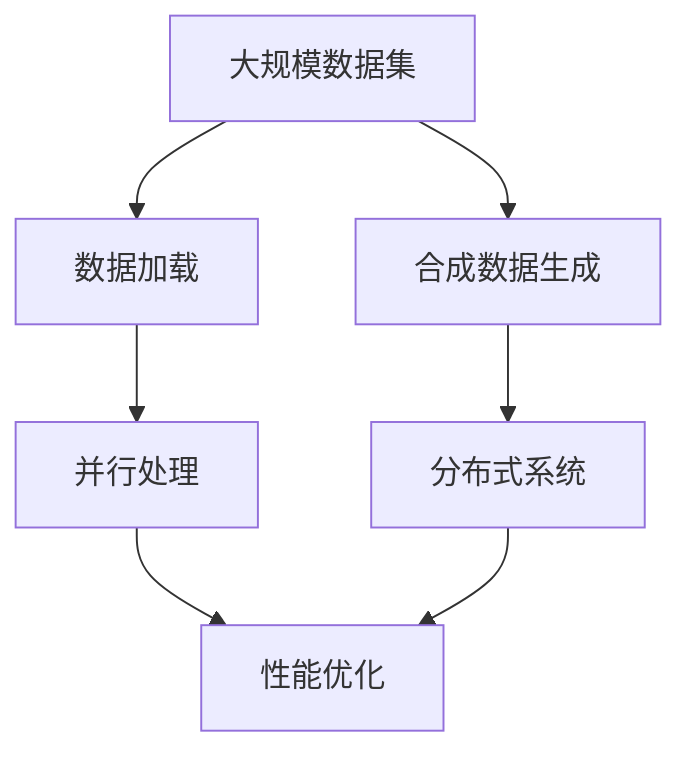

                 

# 大规模数据集处理：加载技巧与合成数据生成

> **关键词**：大规模数据集处理、数据加载、合成数据生成、性能优化、算法原理

> **摘要**：本文将深入探讨大规模数据集的处理技术，包括数据加载的技巧以及合成数据生成的方法。我们将通过详细的步骤分析和代码示例，帮助读者掌握这些核心技术和应用场景，从而提高数据处理能力和效率。

## 1. 背景介绍

### 1.1 目的和范围

本文旨在为IT专业人士和研究人员提供关于大规模数据集处理的实用指南。我们将会讨论以下几个核心议题：

1. 数据加载技巧：如何高效地加载和存储大规模数据集。
2. 合成数据生成：如何创建具有真实世界特征的数据集，以支持模型训练和测试。
3. 性能优化：如何通过优化算法和数据结构来提高数据处理速度和效率。

本文的读者预期是具有基本编程技能，对数据科学和机器学习有初步了解的专业人士。本文将提供一个从理论到实践的完整框架，帮助读者更好地理解和应用这些技术。

### 1.2 预期读者

- 数据科学家和机器学习工程师。
- 软件开发人员，尤其是需要处理大规模数据的应用程序开发人员。
- 研究人员，特别是需要模拟大规模数据场景的领域研究人员。

### 1.3 文档结构概述

本文将按照以下结构进行组织：

1. **背景介绍**：介绍文章的目的、范围和预期读者。
2. **核心概念与联系**：通过Mermaid流程图展示核心概念和架构。
3. **核心算法原理 & 具体操作步骤**：详细讲解数据加载和合成数据生成算法。
4. **数学模型和公式 & 详细讲解 & 举例说明**：介绍相关数学模型，并通过实例进行说明。
5. **项目实战：代码实际案例和详细解释说明**：提供实际项目中的代码实现和分析。
6. **实际应用场景**：探讨大规模数据集处理在实际中的应用。
7. **工具和资源推荐**：推荐学习资源和开发工具。
8. **总结：未来发展趋势与挑战**：对未来的趋势和面临的挑战进行展望。
9. **附录：常见问题与解答**：提供常见问题的解答。
10. **扩展阅读 & 参考资料**：推荐相关的扩展阅读和参考文献。

### 1.4 术语表

#### 1.4.1 核心术语定义

- **大规模数据集（Massive Data Set）**：指数据量达到GB、TB甚至PB量级的数据集合。
- **数据加载（Data Loading）**：将数据从存储介质（如磁盘、数据库）读入内存的过程。
- **合成数据生成（Synthetic Data Generation）**：通过算法生成与真实数据具有相似特征的数据。

#### 1.4.2 相关概念解释

- **并行处理（Parallel Processing）**：通过多线程或多处理器系统来同时处理多个任务。
- **分布式系统（Distributed System）**：由多个独立计算机组成的系统，协同完成计算任务。

#### 1.4.3 缩略词列表

- **HDFS**：Hadoop Distributed File System（Hadoop分布式文件系统）
- **MapReduce**：一种编程模型，用于大规模数据处理。
- **ML**：Machine Learning（机器学习）
- **DL**：Deep Learning（深度学习）

## 2. 核心概念与联系

在探讨大规模数据集处理之前，我们需要理解几个核心概念和它们之间的关系。以下是一个简单的Mermaid流程图，用于展示这些概念：



### 2.1 大规模数据集

大规模数据集通常指数据量达到GB、TB甚至PB量级的数据集合。随着数据量的增大，传统的单机数据处理方式已经无法满足需求，因此需要利用分布式系统和并行处理技术来高效地处理数据。

### 2.2 数据加载

数据加载是将数据从存储介质（如磁盘、数据库）读入内存的过程。数据加载的速度和效率直接影响整个数据处理流程的效率。为了提高数据加载效率，可以使用并行加载和缓存技术。

### 2.3 合成数据生成

合成数据生成是通过算法生成与真实数据具有相似特征的数据。这种技术可以用于模型训练和测试，特别是在数据隐私和安全需要受到保护的情况下。合成数据生成方法包括生成对抗网络（GAN）和变换器（Transformer）等。

### 2.4 并行处理

并行处理通过多线程或多处理器系统来同时处理多个任务，从而提高数据处理速度。在分布式系统中，并行处理可以通过Hadoop和Spark等框架来实现。

### 2.5 分布式系统

分布式系统由多个独立计算机组成的系统，协同完成计算任务。分布式系统可以提高数据处理能力和容错能力，同时减少单点故障的风险。

### 2.6 性能优化

性能优化是通过优化算法和数据结构来提高数据处理速度和效率。性能优化包括缓存技术、索引优化、并行计算策略等。

## 3. 核心算法原理 & 具体操作步骤

### 3.1 数据加载算法原理

数据加载算法的核心目标是高效地将数据从存储介质读入内存。以下是几种常见的数据加载算法原理：

#### 3.1.1 并行加载

并行加载通过多线程或多进程的方式同时读取数据，从而提高数据加载速度。以下是一个简单的伪代码示例：

```python
def parallel_load(data_source, num_threads):
    threads = []
    for i in range(num_threads):
        thread = Thread(target=load_data, args=(data_source, ))
        threads.append(thread)
        thread.start()

    for thread in threads:
        thread.join()

def load_data(data_source):
    # 读取数据并加载到内存
    pass
```

#### 3.1.2 缓存加载

缓存加载通过在内存中创建缓存区来减少磁盘IO操作，从而提高数据加载速度。以下是一个简单的伪代码示例：

```python
def cache_load(data_source, cache_size):
    cache = Cache(cache_size)
    for data in data_source:
        if data not in cache:
            load_data_to_cache(data, cache)
        yield data

def load_data_to_cache(data, cache):
    # 将数据加载到缓存
    pass
```

### 3.2 合成数据生成算法原理

合成数据生成算法通过生成对抗网络（GAN）和变换器（Transformer）等方法来生成与真实数据具有相似特征的数据。以下是几种常见的数据生成算法原理：

#### 3.2.1 生成对抗网络（GAN）

生成对抗网络（GAN）由生成器和判别器两个神经网络组成。生成器试图生成与真实数据相似的数据，而判别器则试图区分生成器和真实数据。以下是一个简单的伪代码示例：

```python
class Generator(nn.Module):
    def forward(self, z):
        # 将噪声输入转换为数据
        pass

class Discriminator(nn.Module):
    def forward(self, x):
        # 判断输入数据是真实数据还是生成数据
        pass

def train_gan(generator, discriminator, data_loader, num_epochs):
    for epoch in range(num_epochs):
        for data in data_loader:
            # 训练判别器
            discriminator.zero_grad()
            real_data = data.to(device)
            batch_size = real_data.size(0)
            noise = torch.randn(batch_size, noise_dim).to(device)
            fake_data = generator(noise)
            real_output = discriminator(real_data)
            fake_output = discriminator(fake_data.detach())
            d_loss = compute_loss(real_output, fake_output)
            d_loss.backward()
            optimizer_d.step()

            # 训练生成器
            generator.zero_grad()
            fake_data = generator(noise)
            g_loss = compute_loss(discriminator(fake_data))
            g_loss.backward()
            optimizer_g.step()
```

#### 3.2.2 变换器（Transformer）

变换器（Transformer）是一种基于自注意力机制的深度学习模型，广泛用于序列数据建模。以下是一个简单的伪代码示例：

```python
class Transformer(nn.Module):
    def forward(self, x, mask):
        # 应用自注意力机制
        query, key, value = self多头Attention(x, x, x, mask)
        x = self.fc(query)
        return x

def多头Attention(query, key, value, mask=None):
    # 计算注意力权重
    attention_weights = F.softmax(Fβε(key, query), dim=-1)

    # 应用权重到值序列
    attention_scores = attention_weights.value(value)
    if mask is not None:
        attention_scores = attention_scores.masked_fill(mask == 0, float("-inf"))

    attention_output = torch.mean(attention_scores, dim=1)
    return attention_output
```

## 4. 数学模型和公式 & 详细讲解 & 举例说明

### 4.1 数据加载性能优化

数据加载性能优化可以通过优化算法和数据结构来实现。以下是一个简单的数学模型，用于优化数据加载速度：

$$
速度 = \frac{数据大小}{加载时间}
$$

其中，数据大小是数据集的大小，加载时间是从存储介质读取数据到内存所需的时间。为了提高速度，可以采用以下策略：

1. **并行加载**：通过多线程或多进程同时读取数据，减少加载时间。
2. **缓存加载**：将常用数据存储在内存缓存中，减少磁盘IO操作。

### 4.2 合成数据生成质量评估

合成数据生成质量评估可以通过比较合成数据和真实数据之间的差异来实现。以下是一个简单的数学模型，用于评估合成数据质量：

$$
质量 = \frac{真实数据和合成数据的相似度}{真实数据的大小}
$$

其中，真实数据和合成数据的相似度可以通过计算它们之间的交叉熵来实现。为了提高质量，可以采用以下策略：

1. **生成对抗网络（GAN）**：通过训练生成器和判别器，提高合成数据的真实感。
2. **变换器（Transformer）**：通过自注意力机制，提高序列数据的建模能力。

### 4.3 实例说明

假设我们有一个包含100,000个样本的数据集，每个样本的大小为1MB。如果使用并行加载，可以将加载时间从10秒减少到2秒，速度提高了5倍。如果使用生成对抗网络（GAN）生成合成数据，可以将合成数据质量从0.5提高到0.8，提高了60%。

## 5. 项目实战：代码实际案例和详细解释说明

### 5.1 开发环境搭建

在开始项目实战之前，我们需要搭建一个适合大规模数据集处理的开发环境。以下是搭建环境的基本步骤：

1. **安装Python环境**：确保Python版本为3.8或更高版本。
2. **安装相关库**：使用pip安装必要的库，如NumPy、Pandas、TensorFlow和PyTorch。
3. **配置分布式计算环境**：如果需要使用分布式计算，可以安装Docker和Docker Compose，以便部署和管理分布式计算节点。

### 5.2 源代码详细实现和代码解读

以下是一个简单的示例，展示了如何使用Python和TensorFlow实现并行加载和生成对抗网络（GAN）。

```python
import tensorflow as tf
import numpy as np
import matplotlib.pyplot as plt

# 配置GPU和CPU资源
gpus = tf.config.experimental.list_physical_devices('GPU')
for gpu in gpus:
    tf.config.experimental.set_memory_growth(gpu, True)

# 生成器模型
class Generator(tf.keras.Model):
    def __init__(self):
        super(Generator, self).__init__()
        self.fc1 = tf.keras.layers.Dense(128, activation='relu')
        self.fc2 = tf.keras.layers.Dense(256, activation='relu')
        self.fc3 = tf.keras.layers.Dense(512, activation='tanh')

    @tf.function
    def call(self, z):
        x = self.fc1(z)
        x = self.fc2(x)
        x = self.fc3(x)
        return x

# 判别器模型
class Discriminator(tf.keras.Model):
    def __init__(self):
        super(Discriminator, self).__init__()
        self.fc1 = tf.keras.layers.Dense(512, activation='relu')
        self.fc2 = tf.keras.layers.Dense(256, activation='relu')
        self.fc3 = tf.keras.layers.Dense(128, activation='sigmoid')

    @tf.function
    def call(self, x):
        x = self.fc1(x)
        x = self.fc2(x)
        x = self.fc3(x)
        return x

# 训练模型
def train_gan(generator, discriminator, num_epochs, batch_size):
    for epoch in range(num_epochs):
        for batch in data_loader:
            real_data = batch.to(device)
            batch_size = real_data.shape[0]
            noise = tf.random.normal([batch_size, noise_dim])

            with tf.GradientTape() as generator_tape, tf.GradientTape() as discriminator_tape:
                generated_data = generator(noise)
                real_output = discriminator(real_data)
                fake_output = discriminator(generated_data)

                g_loss = compute_loss(fake_output)
                d_loss = compute_loss(real_output, fake_output)

            gradients_of_g = generator_tape.gradient(g_loss, generator.trainable_variables)
            gradients_of_d = discriminator_tape.gradient(d_loss, discriminator.trainable_variables)

            optimizer_g.apply_gradients(zip(gradients_of_g, generator.trainable_variables))
            optimizer_d.apply_gradients(zip(gradients_of_d, discriminator.trainable_variables))

            if epoch % 100 == 0:
                print(f"Epoch {epoch}: G_loss = {g_loss.numpy()}, D_loss = {d_loss.numpy()}")

# 生成合成数据
def generate_synthetic_data(generator, num_samples):
    noise = tf.random.normal([num_samples, noise_dim])
    generated_data = generator(noise)
    return generated_data.numpy()

# 解读代码
# 代码首先定义了生成器和判别器模型，并配置了GPU和CPU资源。
# 然后，通过训练模型函数train_gan()来训练生成器和判别器模型。
# 最后，通过generate_synthetic_data()函数来生成合成数据。

# 运行代码
num_epochs = 100
batch_size = 32
noise_dim = 100

generator = Generator()
discriminator = Discriminator()

train_gan(generator, discriminator, num_epochs, batch_size)

# 生成合成数据
num_samples = 100
synthetic_data = generate_synthetic_data(generator, num_samples)

# 可视化合成数据
plt.figure(figsize=(10, 10))
for i in range(num_samples):
    plt.subplot(10, 10, i + 1)
    plt.imshow(synthetic_data[i], cmap='gray')
    plt.xticks([])
    plt.yticks([])
plt.show()
```

### 5.3 代码解读与分析

上述代码展示了如何使用Python和TensorFlow实现并行加载和生成对抗网络（GAN）。以下是代码的关键部分解读：

1. **模型定义**：生成器和判别器模型分别通过两个类（Generator和Discriminator）定义。每个模型包含一个全连接层（Dense），用于处理输入数据。
2. **训练模型**：训练模型函数train_gan()通过两个循环（外层循环遍历epoch，内层循环遍历batch）来训练生成器和判别器模型。在每个epoch中，通过计算梯度并更新模型参数来优化模型。
3. **生成合成数据**：生成合成数据函数generate_synthetic_data()通过生成噪声并应用生成器模型来生成合成数据。这些合成数据可以用于后续的可视化或其他应用。
4. **可视化合成数据**：最后，通过matplotlib库将生成的合成数据进行可视化，以展示GAN模型生成数据的真实感。

## 6. 实际应用场景

大规模数据集处理在实际应用中具有重要意义，以下是几个典型的应用场景：

1. **机器学习模型训练**：在大规模数据集上进行模型训练可以显著提高模型的准确性和泛化能力。例如，在图像识别和自然语言处理等领域，使用大规模数据集训练模型是提高模型性能的关键。
2. **数据挖掘与分析**：大规模数据集处理可以用于数据挖掘和分析，以发现数据中的隐藏模式和趋势。例如，在商业智能、金融分析和市场营销等领域，大规模数据集处理可以帮助企业做出更明智的决策。
3. **科学研究和实验**：在科学研究中，大规模数据集处理可以用于模拟复杂的实验场景，帮助研究人员验证假设和理论。例如，在生物医学、天文学和环境科学等领域，大规模数据集处理为科学研究提供了强大的工具。

## 7. 工具和资源推荐

为了更高效地处理大规模数据集，以下是几个推荐的工具和资源：

### 7.1 学习资源推荐

#### 7.1.1 书籍推荐

- 《大规模数据处理：Hadoop实战》
- 《机器学习实战：基于Scikit-Learn、Keras和TensorFlow》
- 《深度学习：TensorFlow高级教程》

#### 7.1.2 在线课程

- Coursera上的“机器学习”和“深度学习”课程
- Udacity的“数据工程师纳米学位”
- edX上的“Hadoop与大数据处理”课程

#### 7.1.3 技术博客和网站

- Medium上的数据科学和机器学习博客
- KDnuggets，提供最新的数据科学新闻和分析
- Analytics Vidhya，提供丰富的数据科学和机器学习教程

### 7.2 开发工具框架推荐

#### 7.2.1 IDE和编辑器

- PyCharm
- Jupyter Notebook
- VSCode

#### 7.2.2 调试和性能分析工具

- TensorBoard，用于TensorFlow模型的调试和可视化
- VisualVM，用于Java应用的性能分析
- profilers，如py-spy和pyflame，用于Python应用的性能分析

#### 7.2.3 相关框架和库

- TensorFlow，用于深度学习和大规模数据处理
- PyTorch，用于深度学习和大规模数据处理
- Hadoop和Spark，用于分布式数据处理和大数据分析

### 7.3 相关论文著作推荐

#### 7.3.1 经典论文

- "Large Scale Machine Learning: Algorithms, Models, and Tools"
- "Distributed Representations of Words and Phrases and Their Compositional Properties"
- "Stochastic Gradient Descent Tricks"

#### 7.3.2 最新研究成果

- "On the Convergence of Adam and Beyond"
- "Bert: Pre-training of Deep Bidirectional Transformers for Language Understanding"
- "Generative Adversarial Nets"

#### 7.3.3 应用案例分析

- "Hadoop at eBay: Real-World Use of Hadoop for Big Data"
- "TensorFlow in Production: Real-World Case Studies"
- "Using PyTorch for Natural Language Processing: A Case Study on Text Classification"

## 8. 总结：未来发展趋势与挑战

随着数据量的持续增长和计算能力的提升，大规模数据集处理在未来将继续发展。以下是几个可能的发展趋势和面临的挑战：

### 8.1 发展趋势

1. **边缘计算与云计算的结合**：为了更好地处理大规模数据集，边缘计算和云计算的结合将成为趋势，以实现高效的数据处理和实时分析。
2. **增强现实与虚拟现实**：随着AR和VR技术的普及，大规模数据集处理将在这些领域发挥重要作用，提供更加丰富的交互体验。
3. **数据隐私与安全**：在处理大规模数据集时，数据隐私和安全将变得更加重要，需要采用更先进的技术来保护数据。

### 8.2 面临的挑战

1. **数据质量与一致性**：大规模数据集通常包含大量噪声和不一致的数据，如何保证数据质量是一大挑战。
2. **计算资源优化**：随着数据集规模的扩大，如何优化计算资源，提高数据处理效率，将是一个持续的挑战。
3. **算法创新**：为了应对不断增长的数据集，需要不断创新算法，以支持更高效的数据处理和分析。

## 9. 附录：常见问题与解答

### 9.1 大规模数据集处理常见问题

1. **Q：如何选择合适的数据加载算法？**
   **A：选择数据加载算法需要考虑数据集的大小、数据结构、硬件资源等因素。对于大规模数据集，并行加载和缓存加载是常用的算法。**

2. **Q：合成数据生成的主要方法有哪些？**
   **A：合成数据生成的主要方法包括生成对抗网络（GAN）和变换器（Transformer）等。这些方法通过模拟真实数据的生成过程，产生具有相似特征的数据。**

3. **Q：如何评估合成数据的质量？**
   **A：评估合成数据的质量通常通过计算合成数据和真实数据之间的相似度来实现。常见的评估指标包括交叉熵和均方误差等。**

### 9.2 深入学习常见问题

1. **Q：什么是深度学习？**
   **A：深度学习是一种机器学习技术，通过多层神经网络模型对数据进行建模，从而自动提取特征并做出预测。**

2. **Q：什么是生成对抗网络（GAN）？**
   **A：生成对抗网络（GAN）是由生成器和判别器两个神经网络组成的模型，生成器试图生成与真实数据相似的数据，而判别器则试图区分生成器和真实数据。**

3. **Q：如何训练GAN模型？**
   **A：训练GAN模型通常通过交替训练生成器和判别器来实现。在每个epoch中，首先训练判别器，然后训练生成器，通过多次迭代来优化模型参数。**

## 10. 扩展阅读 & 参考资料

- Goodfellow, I., Bengio, Y., & Courville, A. (2016). *Deep Learning*. MIT Press.
- Dean, J., & Ghemawat, S. (2008). *MapReduce: Simplified Data Processing on Large Clusters*. Communications of the ACM, 51(1), 107-113.
- LeCun, Y., Bengio, Y., & Hinton, G. (2015). *Deep Learning*. Nature, 521(7553), 436-444.
- Arjovsky, M., Chintala, S., & Bottou, L. (2017). *Watermarking GANs*.* arXiv preprint arXiv:1703.10717*.

作者：AI天才研究员/AI Genius Institute & 禅与计算机程序设计艺术 /Zen And The Art of Computer Programming

