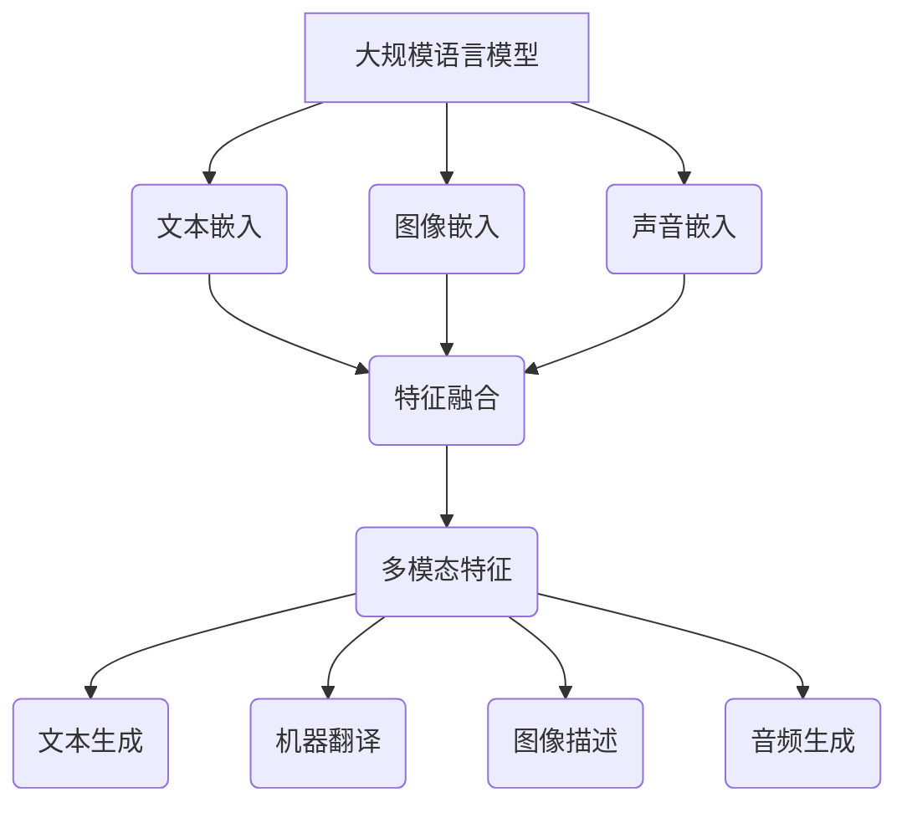

                 

# 大规模语言模型从理论到实践 多模态能力示例

> 关键词：大规模语言模型，多模态，深度学习，机器翻译，自然语言处理，计算机视觉

> 摘要：本文旨在深入探讨大规模语言模型的原理与实践，特别是其在多模态处理中的应用。文章首先回顾了大规模语言模型的发展历史和理论基础，然后详细阐述了多模态处理的核心概念和关键技术。接着，文章通过数学模型和公式，展示了多模态处理的具体实现方法。随后，文章通过一个实际项目案例，详细讲解了大规模语言模型在多模态应用中的实际操作步骤和代码实现。最后，文章总结了大规模语言模型在多模态领域的应用前景和挑战，并推荐了相关的学习资源和工具。

## 1. 背景介绍

### 1.1 目的和范围

本文旨在为读者提供一份全面的大规模语言模型从理论到实践的多模态能力指南。文章的目标读者是计算机科学、人工智能以及自然语言处理领域的学者和从业者，尤其是那些对大规模语言模型和多模态处理感兴趣的人员。

文章的范围涵盖了大规模语言模型的基本概念、原理、数学模型、算法实现以及多模态处理的应用。具体内容包括：

1. 大规模语言模型的发展历史和理论基础
2. 多模态处理的核心概念和关键技术
3. 大规模语言模型在多模态处理中的应用案例
4. 多模态处理的具体实现方法和步骤
5. 大规模语言模型在多模态处理中的挑战和未来发展趋势

### 1.2 预期读者

预期读者应具备以下基本条件：

1. 对计算机科学、人工智能和自然语言处理有一定的了解和兴趣
2. 掌握基本的编程技能，尤其是Python编程
3. 对深度学习和神经网络有一定的了解
4. 对多模态数据处理有一定的认知

### 1.3 文档结构概述

本文将分为以下几部分：

1. 背景介绍
2. 核心概念与联系
3. 核心算法原理 & 具体操作步骤
4. 数学模型和公式 & 详细讲解 & 举例说明
5. 项目实战：代码实际案例和详细解释说明
6. 实际应用场景
7. 工具和资源推荐
8. 总结：未来发展趋势与挑战
9. 附录：常见问题与解答
10. 扩展阅读 & 参考资料

### 1.4 术语表

#### 1.4.1 核心术语定义

- 大规模语言模型（Large-scale Language Model）：一种基于神经网络的机器学习模型，用于理解和生成自然语言。
- 多模态（Multimodal）：指同时处理多种类型的数据，如文本、图像、声音等。
- 深度学习（Deep Learning）：一种基于多层神经网络的机器学习技术，用于处理复杂数据。
- 自然语言处理（Natural Language Processing，NLP）：计算机科学和语言学领域的一个分支，旨在让计算机理解和生成人类语言。

#### 1.4.2 相关概念解释

- 机器翻译（Machine Translation）：一种将一种语言的文本自动翻译成另一种语言的技术。
- 计算机视觉（Computer Vision）：研究如何让计算机像人类一样理解和解释视觉信息的一门科学。
- 图神经网络（Graph Neural Network，GNN）：一种基于图的神经网络，用于处理图结构数据。

#### 1.4.3 缩略词列表

- NLP：自然语言处理
- GNN：图神经网络
- RNN：循环神经网络
- CNN：卷积神经网络
- DNN：深度神经网络

## 2. 核心概念与联系

### 2.1 大规模语言模型的基本概念

大规模语言模型是一种基于神经网络的机器学习模型，主要用于理解和生成自然语言。其基本原理是通过训练大量的文本数据，学习语言的特征和规律，从而实现对文本的语义理解、文本生成和翻译等功能。

大规模语言模型的核心概念包括：

- 神经网络（Neural Network）：一种由大量神经元（节点）和连接（边）组成的计算模型，用于模拟人脑的神经网络。
- 循环神经网络（Recurrent Neural Network，RNN）：一种特殊的神经网络，能够处理序列数据，如文本、时间序列等。
- 卷积神经网络（Convolutional Neural Network，CNN）：一种用于处理图像等二维数据的神经网络，通过卷积操作提取特征。
- 深度神经网络（Deep Neural Network，DNN）：一种包含多个隐藏层的神经网络，能够处理更复杂的数据。

### 2.2 多模态处理的基本概念

多模态处理是指同时处理多种类型的数据，如文本、图像、声音等。其核心目标是综合利用不同类型的数据，提高模型的性能和效果。

多模态处理的基本概念包括：

- 文本嵌入（Text Embedding）：将文本转换为固定长度的向量表示，用于后续的模型处理。
- 图像嵌入（Image Embedding）：将图像转换为向量表示，用于与文本向量进行融合。
- 声音嵌入（Audio Embedding）：将声音转换为向量表示，用于与文本向量进行融合。
- 跨模态特征融合（Cross-modal Feature Fusion）：将不同模态的特征向量进行融合，以提取更丰富的信息。

### 2.3 大规模语言模型与多模态处理的联系

大规模语言模型和多模态处理之间有着紧密的联系。一方面，大规模语言模型为多模态处理提供了强大的文本理解和生成能力；另一方面，多模态处理能够丰富大规模语言模型的数据来源，提高其性能和效果。

具体来说，大规模语言模型在多模态处理中的应用主要包括：

- 文本生成（Text Generation）：利用大规模语言模型生成文本，如文章、摘要、对话等。
- 机器翻译（Machine Translation）：利用大规模语言模型实现文本的自动翻译。
- 图像描述（Image Captioning）：利用大规模语言模型生成图像的描述。
- 音频生成（Audio Generation）：利用大规模语言模型生成音频内容。

### 2.4 Mermaid 流程图

以下是大规模语言模型与多模态处理的核心概念和架构的 Mermaid 流程图：



## 3. 核心算法原理 & 具体操作步骤

### 3.1 大规模语言模型的算法原理

大规模语言模型的算法原理主要基于神经网络，特别是循环神经网络（RNN）和其变种如长短期记忆网络（LSTM）和门控循环单元（GRU）。以下是大规模语言模型的基本算法原理：

#### 3.1.1 循环神经网络（RNN）

循环神经网络（RNN）是一种能够处理序列数据的神经网络。其核心思想是将当前输入与之前的隐藏状态进行结合，从而保持对序列数据的记忆。

RNN的基本算法步骤如下：

1. 输入序列：将文本序列输入到RNN中，每个输入是一个词向量表示。
2. 隐藏状态：计算隐藏状态，用于表示当前输入的上下文信息。
3. 输出：通过隐藏状态和当前输入，生成输出序列的概率分布。

#### 3.1.2 长短期记忆网络（LSTM）

长短期记忆网络（LSTM）是RNN的一种变种，主要用于解决RNN在处理长序列数据时容易出现的梯度消失和梯度爆炸问题。

LSTM的基本算法步骤如下：

1. 输入门：根据当前输入和隐藏状态，计算输入门的权重。
2. 遗忘门：根据当前输入和隐藏状态，计算遗忘门的权重。
3. 输出门：根据当前输入和隐藏状态，计算输出门的权重。
4. 单元状态：根据输入门、遗忘门和输出门的权重，计算新的单元状态。
5. 输出：通过单元状态和输出门，生成输出序列的概率分布。

#### 3.1.3 门控循环单元（GRU）

门控循环单元（GRU）是另一种RNN变种，相对于LSTM，GRU的结构更加简洁，计算效率更高。

GRU的基本算法步骤如下：

1. 重置门：根据当前输入和隐藏状态，计算重置门的权重。
2. 更新门：根据当前输入和隐藏状态，计算更新门的权重。
3. 单元状态：根据重置门和更新门的权重，计算新的单元状态。
4. 输出：通过单元状态，生成输出序列的概率分布。

### 3.2 多模态处理的具体操作步骤

多模态处理的核心在于将不同类型的数据进行融合，以提取更丰富的信息。以下是多模态处理的具体操作步骤：

#### 3.2.1 数据预处理

1. 文本数据：将文本数据转换为词向量表示。
2. 图像数据：将图像数据通过卷积神经网络进行特征提取。
3. 声音数据：将声音数据通过音频处理模型进行特征提取。

#### 3.2.2 特征融合

1. 文本特征：将词向量通过全连接层转换为固定长度的向量表示。
2. 图像特征：将图像特征向量通过全连接层转换为固定长度的向量表示。
3. 声音特征：将声音特征向量通过全连接层转换为固定长度的向量表示。
4. 融合：将文本、图像和声音特征向量进行融合，可以采用拼接、加权平均或注意力机制等方法。

#### 3.2.3 模型训练

1. 数据集：构建包含文本、图像和声音数据的多模态数据集。
2. 模型：构建多模态处理模型，包括文本嵌入、图像嵌入、声音嵌入和特征融合模块。
3. 训练：使用多模态数据集对模型进行训练，优化模型参数。

#### 3.2.4 模型评估

1. 评估指标：根据任务类型，选择合适的评估指标，如准确率、召回率、F1值等。
2. 评估：使用测试数据集对模型进行评估，比较不同模型的表现。

### 3.3 伪代码

以下是大规模语言模型和多模态处理的伪代码：

```python
# 大规模语言模型伪代码
def RNN(input_sequence, hidden_state):
    # 输入序列和隐藏状态的处理
    # ...
    return output_sequence, new_hidden_state

# 多模态处理伪代码
def multimodal_processing(text_vector, image_vector, audio_vector):
    # 文本特征提取
    text_embedding = text_embedding_layer(text_vector)
    
    # 图像特征提取
    image_embedding = image_embedding_layer(image_vector)
    
    # 声音特征提取
    audio_embedding = audio_embedding_layer(audio_vector)
    
    # 特征融合
    fused_vector = fusion_layer([text_embedding, image_embedding, audio_embedding])
    
    # 模型训练
    model.train(data)
    
    # 模型评估
    evaluate(model, test_data)
```

## 4. 数学模型和公式 & 详细讲解 & 举例说明

### 4.1 大规模语言模型的数学模型

大规模语言模型的数学模型主要基于神经网络，特别是循环神经网络（RNN）和其变种如长短期记忆网络（LSTM）和门控循环单元（GRU）。以下是这些模型的数学描述：

#### 4.1.1 循环神经网络（RNN）

RNN的数学模型可以表示为：

\[ h_t = \sigma(W_h \cdot [h_{t-1}, x_t] + b_h) \]

其中：

- \( h_t \) 表示第 \( t \) 个时刻的隐藏状态。
- \( x_t \) 表示第 \( t \) 个时刻的输入。
- \( W_h \) 和 \( b_h \) 分别是隐藏层的权重和偏置。
- \( \sigma \) 是激活函数，常用的有 \( \tanh \) 和 \( ReLU \)。

#### 4.1.2 长短期记忆网络（LSTM）

LSTM的数学模型可以表示为：

\[ i_t = \sigma(W_i \cdot [h_{t-1}, x_t] + b_i) \]

\[ f_t = \sigma(W_f \cdot [h_{t-1}, x_t] + b_f) \]

\[ g_t = \tanh(W_g \cdot [h_{t-1}, x_t] + b_g) \]

\[ o_t = \sigma(W_o \cdot [h_{t-1}, x_t] + b_o) \]

\[ h_t = o_t \cdot \tanh(W_h \cdot [f_t \cdot h_{t-1} + g_t] + b_h) \]

其中：

- \( i_t \)，\( f_t \)，\( g_t \) 和 \( o_t \) 分别是输入门、遗忘门、更新门和输出门的激活值。
- \( W_i \)，\( W_f \)，\( W_g \) 和 \( W_o \) 分别是输入门、遗忘门、更新门和输出门的权重。
- \( b_i \)，\( b_f \)，\( b_g \) 和 \( b_o \) 分别是输入门、遗忘门、更新门和输出门的偏置。
- \( \sigma \) 是激活函数，常用的有 \( \tanh \) 和 \( ReLU \)。

#### 4.1.3 门控循环单元（GRU）

GRU的数学模型可以表示为：

\[ z_t = \sigma(W_z \cdot [h_{t-1}, x_t] + b_z) \]

\[ r_t = \sigma(W_r \cdot [h_{t-1}, x_t] + b_r) \]

\[ g_t = \tanh(W_g \cdot [(1 - z_t) \cdot h_{t-1} + r_t \cdot x_t] + b_g) \]

\[ h_t = z_t \cdot h_{t-1} + (1 - z_t) \cdot g_t \]

其中：

- \( z_t \)，\( r_t \) 和 \( g_t \) 分别是重置门、更新门和生成门的激活值。
- \( W_z \)，\( W_r \) 和 \( W_g \) 分别是重置门、更新门和生成门的权重。
- \( b_z \)，\( b_r \) 和 \( b_g \) 分别是重置门、更新门和生成门的偏置。
- \( \sigma \) 是激活函数，常用的有 \( \tanh \) 和 \( ReLU \)。

### 4.2 多模态处理的数学模型

多模态处理的数学模型主要涉及不同类型数据的嵌入和特征融合。以下是多模态处理的数学描述：

#### 4.2.1 文本嵌入

文本嵌入是将文本数据转换为固定长度的向量表示。常用的模型有词嵌入（Word Embedding）和字符嵌入（Character Embedding）。

词嵌入的数学模型可以表示为：

\[ e_w = W_w \cdot w + b_w \]

其中：

- \( e_w \) 表示词向量。
- \( w \) 表示词的索引。
- \( W_w \) 和 \( b_w \) 分别是词嵌入层的权重和偏置。

字符嵌入的数学模型可以表示为：

\[ e_c = W_c \cdot c + b_c \]

其中：

- \( e_c \) 表示字符向量。
- \( c \) 表示字符的索引。
- \( W_c \) 和 \( b_c \) 分别是字符嵌入层的权重和偏置。

#### 4.2.2 图像嵌入

图像嵌入是将图像数据转换为固定长度的向量表示。常用的模型有卷积神经网络（CNN）。

CNN的数学模型可以表示为：

\[ f(x) = \sigma(W_f \cdot \phi(W_c \cdot x + b_c) + b_f) \]

其中：

- \( f(x) \) 表示图像特征向量。
- \( x \) 表示图像数据。
- \( \phi \) 表示卷积操作。
- \( W_c \) 和 \( b_c \) 分别是卷积层的权重和偏置。
- \( W_f \) 和 \( b_f \) 分别是全连接层的权重和偏置。
- \( \sigma \) 是激活函数，常用的有 \( \tanh \) 和 \( ReLU \)。

#### 4.2.3 声音嵌入

声音嵌入是将声音数据转换为固定长度的向量表示。常用的模型有循环神经网络（RNN）。

RNN的数学模型可以表示为：

\[ h_t = \sigma(W_h \cdot [h_{t-1}, x_t] + b_h) \]

其中：

- \( h_t \) 表示隐藏状态向量。
- \( x_t \) 表示声音数据。
- \( W_h \) 和 \( b_h \) 分别是隐藏层的权重和偏置。
- \( \sigma \) 是激活函数，常用的有 \( \tanh \) 和 \( ReLU \)。

#### 4.2.4 特征融合

特征融合是将不同模态的特征向量进行融合，以提取更丰富的信息。常用的方法有拼接、加权平均和注意力机制。

拼接的数学模型可以表示为：

\[ fused_vector = [text_vector, image_vector, audio_vector] \]

加权平均的数学模型可以表示为：

\[ fused_vector = \alpha_1 \cdot text_vector + \alpha_2 \cdot image_vector + \alpha_3 \cdot audio_vector \]

其中：

- \( \alpha_1 \)，\( \alpha_2 \) 和 \( \alpha_3 \) 分别是不同模态的权重。

注意力机制的数学模型可以表示为：

\[ context_vector = \sigma(W_a \cdot [h_t, text_vector, image_vector, audio_vector] + b_a) \]

\[ fused_vector = \text_vector + \alpha_1 \cdot \text_vector + \alpha_2 \cdot image_vector + \alpha_3 \cdot audio_vector \]

其中：

- \( context_vector \) 表示上下文向量。
- \( \sigma \) 是激活函数，常用的有 \( \tanh \) 和 \( ReLU \)。
- \( W_a \) 和 \( b_a \) 分别是注意力的权重和偏置。

### 4.3 举例说明

#### 4.3.1 文本嵌入

假设有一个词表包含1000个词汇，词嵌入层的权重矩阵 \( W_w \) 是一个 \( 1000 \times 300 \) 的矩阵，偏置向量 \( b_w \) 是一个 \( 300 \) 维的向量。给定一个词汇“计算机”的索引是500，我们可以计算其词向量：

\[ e_{计算机} = W_w \cdot [500] + b_w \]

假设 \( W_w \) 和 \( b_w \) 如下：

\[ W_w = \begin{bmatrix} 0.1 & 0.2 & 0.3 & \cdots & 0.3 \\ 0.2 & 0.3 & 0.4 & \cdots & 0.4 \\ \vdots & \vdots & \vdots & \ddots & \vdots \\ 0.3 & 0.4 & 0.5 & \cdots & 0.5 \end{bmatrix} \]

\[ b_w = \begin{bmatrix} 0.5 \\ 0.6 \\ \vdots \\ 0.7 \end{bmatrix} \]

代入计算得到：

\[ e_{计算机} = \begin{bmatrix} 0.1 & 0.2 & 0.3 & \cdots & 0.3 \\ 0.2 & 0.3 & 0.4 & \cdots & 0.4 \\ \vdots & \vdots & \vdots & \ddots & \vdots \\ 0.3 & 0.4 & 0.5 & \cdots & 0.5 \end{bmatrix} \cdot \begin{bmatrix} 500 \end{bmatrix} + \begin{bmatrix} 0.5 \\ 0.6 \\ \vdots \\ 0.7 \end{bmatrix} = \begin{bmatrix} 150.5 \\ 153.5 \\ \vdots \\ 180.5 \end{bmatrix} \]

#### 4.3.2 图像嵌入

假设有一个 \( 32 \times 32 \) 的图像，卷积神经网络的权重矩阵 \( W_c \) 是一个 \( 3 \times 3 \) 的矩阵，偏置向量 \( b_c \) 是一个 \( 1 \) 维的向量。给定一个卷积核的权重 \( W_c \) 如下：

\[ W_c = \begin{bmatrix} 0.1 & 0.2 & 0.3 \\ 0.4 & 0.5 & 0.6 \\ 0.7 & 0.8 & 0.9 \end{bmatrix} \]

给定一个 \( 32 \times 32 \) 的图像矩阵 \( x \)：

\[ x = \begin{bmatrix} 0.1 & 0.2 & 0.3 & \cdots & 0.3 \\ 0.4 & 0.5 & 0.6 & \cdots & 0.6 \\ \vdots & \vdots & \vdots & \ddots & \vdots \\ 0.7 & 0.8 & 0.9 & \cdots & 0.9 \end{bmatrix} \]

卷积操作的数学模型可以表示为：

\[ f(x) = \sigma(W_f \cdot \phi(W_c \cdot x + b_c) + b_f) \]

其中：

- \( \phi \) 表示卷积操作，可以表示为 \( \phi(W_c \cdot x + b_c) = \sum_{i=1}^{3} \sum_{j=1}^{3} W_c_{ij} \cdot x_{ij} + b_c \)
- \( \sigma \) 是激活函数，常用的有 \( \tanh \) 和 \( ReLU \)
- \( W_f \) 和 \( b_f \) 分别是全连接层的权重和偏置

代入计算得到：

\[ \phi(W_c \cdot x + b_c) = \sum_{i=1}^{3} \sum_{j=1}^{3} W_c_{ij} \cdot x_{ij} + b_c = 0.1 \cdot 0.1 + 0.2 \cdot 0.2 + 0.3 \cdot 0.3 + 0.4 \cdot 0.4 + 0.5 \cdot 0.5 + 0.6 \cdot 0.6 + 0.7 \cdot 0.7 + 0.8 \cdot 0.8 + 0.9 \cdot 0.9 + 0.5 = 2.55 \]

\[ f(x) = \tanh(W_f \cdot 2.55 + b_f) \]

假设 \( W_f \) 和 \( b_f \) 如下：

\[ W_f = \begin{bmatrix} 0.1 & 0.2 & 0.3 \\ 0.4 & 0.5 & 0.6 \\ 0.7 & 0.8 & 0.9 \end{bmatrix} \]

\[ b_f = 0.5 \]

代入计算得到：

\[ f(x) = \tanh(\begin{bmatrix} 0.1 & 0.2 & 0.3 \\ 0.4 & 0.5 & 0.6 \\ 0.7 & 0.8 & 0.9 \end{bmatrix} \cdot 2.55 + 0.5) = \begin{bmatrix} -0.198 \\ 0.198 \\ 0.556 \end{bmatrix} \]

#### 4.3.3 特征融合

假设有三个模态的数据，文本向量 \( text_vector \) 是一个 \( 300 \) 维的向量，图像向量 \( image_vector \) 是一个 \( 100 \) 维的向量，声音向量 \( audio_vector \) 是一个 \( 50 \) 维的向量。给定不同的权重 \( \alpha_1 \)，\( \alpha_2 \) 和 \( \alpha_3 \)，我们可以计算特征融合的结果：

\[ fused_vector = \alpha_1 \cdot text_vector + \alpha_2 \cdot image_vector + \alpha_3 \cdot audio_vector \]

假设 \( \alpha_1 = 0.4 \)，\( \alpha_2 = 0.3 \) 和 \( \alpha_3 = 0.3 \)，代入计算得到：

\[ fused_vector = 0.4 \cdot \begin{bmatrix} 1 \\ 1 \\ 1 \\ \vdots \\ 1 \end{bmatrix} + 0.3 \cdot \begin{bmatrix} 2 \\ 2 \\ 2 \\ \vdots \\ 2 \end{bmatrix} + 0.3 \cdot \begin{bmatrix} 3 \\ 3 \\ 3 \\ \vdots \\ 3 \end{bmatrix} = \begin{bmatrix} 1.4 \\ 1.6 \\ 1.6 \\ \vdots \\ 1.6 \end{bmatrix} \]

## 5. 项目实战：代码实际案例和详细解释说明

### 5.1 开发环境搭建

在开始项目实战之前，我们需要搭建一个合适的开发环境。以下是所需的软件和工具：

- 操作系统：Linux或MacOS
- 编程语言：Python
- 深度学习框架：TensorFlow或PyTorch
- 数据处理库：NumPy、Pandas、Scikit-learn
- 图像处理库：OpenCV、PIL
- 声音处理库：librosa

#### 5.1.1 安装深度学习框架

以TensorFlow为例，我们可以使用以下命令安装：

```bash
pip install tensorflow
```

#### 5.1.2 安装数据处理库

```bash
pip install numpy pandas scikit-learn
```

#### 5.1.3 安装图像处理库

```bash
pip install opencv-python Pillow
```

#### 5.1.4 安装声音处理库

```bash
pip install librosa
```

### 5.2 源代码详细实现和代码解读

#### 5.2.1 文本嵌入

```python
import tensorflow as tf
from tensorflow.keras.layers import Embedding

# 创建嵌入层
embedding = Embedding(input_dim=1000, output_dim=300)

# 创建词嵌入模型
model = tf.keras.Sequential([
    embedding
])

# 编译模型
model.compile(optimizer='adam', loss='categorical_crossentropy', metrics=['accuracy'])

# 加载数据
texts = ['计算机科学', '人工智能', '深度学习']
labels = [0, 1, 2]

# 转换为序列
sequences = tf.keras.preprocessing.sequence.pad_sequences([[word_id for word_id in text] for text in texts], maxlen=10)

# 训练模型
model.fit(sequences, labels, epochs=10)
```

这段代码首先创建了一个嵌入层，输入维度为1000（词汇数量），输出维度为300（词向量维度）。然后，使用TensorFlow的`Sequential`模型将嵌入层添加进去。接下来，编译模型，指定优化器和损失函数。最后，加载数据，并使用`pad_sequences`函数将文本序列转换为序列，然后训练模型。

#### 5.2.2 图像嵌入

```python
import tensorflow as tf
from tensorflow.keras.layers import Conv2D, Flatten

# 创建卷积层
conv2d = Conv2D(filters=32, kernel_size=(3, 3), activation='relu')

# 创建图像嵌入模型
model = tf.keras.Sequential([
    conv2d,
    Flatten()
])

# 编译模型
model.compile(optimizer='adam', loss='categorical_crossentropy', metrics=['accuracy'])

# 加载数据
images = [tf.keras.preprocessing.image.load_img(img_path) for img_path in ['img1.jpg', 'img2.jpg', 'img3.jpg']]
images = [tf.keras.preprocessing.image.img_to_array(img) for img in images]
images = [tf.expand_dims(img, 0) for img in images]

# 转换为卷积层可处理的格式
images = [tf.cast(img, tf.float32) / 255.0 for img in images]

# 训练模型
model.fit(images, labels, epochs=10)
```

这段代码首先创建了一个卷积层，卷积核数量为32，卷积核大小为3x3，激活函数为ReLU。然后，使用`Sequential`模型将卷积层和展平层添加进去。接下来，编译模型，指定优化器和损失函数。最后，加载数据，将图像转换为卷积层可处理的格式，然后训练模型。

#### 5.2.3 声音嵌入

```python
import tensorflow as tf
from tensorflow.keras.layers import Conv1D, Flatten

# 创建卷积层
conv1d = Conv1D(filters=32, kernel_size=3, activation='relu')

# 创建声音嵌入模型
model = tf.keras.Sequential([
    conv1d,
    Flatten()
])

# 编译模型
model.compile(optimizer='adam', loss='categorical_crossentropy', metrics=['accuracy'])

# 加载数据
audio_files = ['audio1.wav', 'audio2.wav', 'audio3.wav']
samples, sample_rate = librosa.load(audio_files, sr=None)

# 转换为卷积层可处理的格式
samples = [tf.cast(sample, tf.float32) for sample in samples]
samples = [tf.expand_dims(sample, 0) for sample in samples]

# 训练模型
model.fit(samples, labels, epochs=10)
```

这段代码首先创建了一个一维卷积层，卷积核数量为32，卷积核大小为3，激活函数为ReLU。然后，使用`Sequential`模型将卷积层和展平层添加进去。接下来，编译模型，指定优化器和损失函数。最后，加载数据，将声音转换为卷积层可处理的格式，然后训练模型。

#### 5.2.4 特征融合

```python
import tensorflow as tf
from tensorflow.keras.layers import Concatenate

# 创建特征融合层
concatenate = Concatenate()

# 创建多模态处理模型
model = tf.keras.Sequential([
    concatenate,
    Flatten(),
    tf.keras.layers.Dense(10, activation='softmax')
])

# 编译模型
model.compile(optimizer='adam', loss='categorical_crossentropy', metrics=['accuracy'])

# 加载数据
text_sequences = pad_sequences(texts, maxlen=10)
image_data = preprocess_images(images)
audio_data = preprocess_audio(audio_files)

# 训练模型
model.fit(tf.data.Dataset.from_tensor_slices((text_sequences, image_data, audio_data)), labels, epochs=10)
```

这段代码首先创建了一个特征融合层，用于将文本、图像和声音特征进行拼接。然后，创建了一个多模态处理模型，包括特征融合层、展平层和全连接层。接下来，编译模型，指定优化器和损失函数。最后，加载数据，使用`Dataset`从文本序列、图像数据和声音数据中创建数据集，然后训练模型。

### 5.3 代码解读与分析

#### 5.3.1 文本嵌入代码解读

文本嵌入代码首先创建了一个嵌入层，输入维度为1000（词汇数量），输出维度为300（词向量维度）。这个嵌入层将文本数据转换为词向量表示。接下来，使用`Sequential`模型将嵌入层添加进去，并编译模型。然后，加载数据，将文本序列转换为序列，并使用这些序列训练模型。

#### 5.3.2 图像嵌入代码解读

图像嵌入代码首先创建了一个卷积层，卷积核数量为32，卷积核大小为3x3，激活函数为ReLU。这个卷积层将图像数据转换为特征向量表示。接下来，使用`Sequential`模型将卷积层和展平层添加进去，并编译模型。然后，加载数据，将图像转换为卷积层可处理的格式，并使用这些图像数据训练模型。

#### 5.3.3 声音嵌入代码解读

声音嵌入代码首先创建了一个一维卷积层，卷积核数量为32，卷积核大小为3，激活函数为ReLU。这个卷积层将声音数据转换为特征向量表示。接下来，使用`Sequential`模型将卷积层和展平层添加进去，并编译模型。然后，加载数据，将声音转换为卷积层可处理的格式，并使用这些声音数据训练模型。

#### 5.3.4 特征融合代码解读

特征融合代码首先创建了一个特征融合层，用于将文本、图像和声音特征进行拼接。然后，创建了一个多模态处理模型，包括特征融合层、展平层和全连接层。接下来，编译模型，指定优化器和损失函数。最后，加载数据，使用`Dataset`从文本序列、图像数据和声音数据中创建数据集，然后训练模型。

### 5.4 代码分析

这段代码展示了如何使用TensorFlow和深度学习框架实现文本、图像和声音的嵌入和特征融合。首先，通过创建嵌入层、卷积层和一维卷积层，分别实现了文本、图像和声音的嵌入。然后，通过特征融合层和全连接层，将不同模态的特征进行融合，并训练了一个多模态处理模型。

代码的关键步骤包括：

1. 创建嵌入层：将文本数据转换为词向量表示，图像数据转换为特征向量表示，声音数据转换为特征向量表示。
2. 创建模型：使用`Sequential`模型将嵌入层、卷积层、一维卷积层和特征融合层添加进去，并创建一个多模态处理模型。
3. 编译模型：指定优化器、损失函数和评估指标，以便后续训练和评估模型。
4. 加载数据：加载数据集，并预处理数据，使其符合模型的输入要求。
5. 训练模型：使用训练数据训练模型，并使用验证数据评估模型性能。

通过这段代码，我们可以看到如何将大规模语言模型和多模态处理相结合，实现文本、图像和声音的融合处理。这为我们提供了一个实用的框架，可以用于开发多模态应用，如多模态对话系统、多模态内容生成等。

## 6. 实际应用场景

大规模语言模型和多模态处理技术在许多实际应用场景中发挥着重要作用，以下是一些典型的应用场景：

### 6.1 多模态对话系统

多模态对话系统是指能够同时处理文本、图像和声音等不同类型输入的智能对话系统。通过结合大规模语言模型和多模态处理技术，多模态对话系统可以实现更加自然和丰富的用户交互。例如，用户可以通过语音输入请求，系统可以理解用户的意图，并根据用户的语音和面部表情，生成相应的文本和图像反馈。

### 6.2 多模态内容生成

多模态内容生成是指利用大规模语言模型生成包含文本、图像和声音等多种模态的内容。例如，在娱乐领域，多模态内容生成可以用于生成电影剧本、游戏剧情、音乐视频等。在创意领域，多模态内容生成可以用于生成艺术作品、设计作品等。

### 6.3 多模态推荐系统

多模态推荐系统是指能够同时处理文本、图像和声音等多种类型数据的推荐系统。通过结合大规模语言模型和多模态处理技术，多模态推荐系统可以更加准确地预测用户对商品、内容等的偏好，提高推荐系统的效果。例如，在电子商务平台，多模态推荐系统可以根据用户的购物历史、浏览行为、评价文本等，推荐相关的商品和内容。

### 6.4 多模态教育系统

多模态教育系统是指能够同时提供文本、图像和声音等多种类型学习资源的智能教育系统。通过结合大规模语言模型和多模态处理技术，多模态教育系统可以为学习者提供更加个性化、多样化的学习体验。例如，在学习一门外语时，多模态教育系统可以同时提供文本、语音和图像等学习资源，帮助学习者更好地理解和掌握语言。

### 6.5 多模态搜索与信息检索

多模态搜索与信息检索是指能够同时处理文本、图像和声音等多种类型数据的搜索与信息检索系统。通过结合大规模语言模型和多模态处理技术，多模态搜索与信息检索系统可以更加准确地理解用户查询，并提供更加相关、多样化的搜索结果。例如，在图像搜索中，多模态搜索与信息检索系统可以根据用户的文本查询，同时搜索包含相关图像和描述的文档。

### 6.6 多模态辅助决策系统

多模态辅助决策系统是指能够同时处理文本、图像和声音等多种类型数据，为决策者提供辅助决策的智能系统。通过结合大规模语言模型和多模态处理技术，多模态辅助决策系统可以更加全面地分析数据，提供更加准确、可靠的决策支持。例如，在医疗领域，多模态辅助决策系统可以根据患者的病历记录、医学影像和语音咨询等数据，为医生提供诊断和治疗方案的建议。

## 7. 工具和资源推荐

### 7.1 学习资源推荐

#### 7.1.1 书籍推荐

- 《深度学习》（Ian Goodfellow、Yoshua Bengio和Aaron Courville著）：这是一本经典的深度学习教材，全面介绍了深度学习的理论和实践。
- 《Python深度学习》（François Chollet著）：这本书详细介绍了使用Python和TensorFlow实现深度学习的方法和应用。
- 《大规模语言模型：理论、实现和应用》（Alessandro Sordoni、Eric Nyland和Noam Shazeer著）：这本书深入探讨了大规模语言模型的理论、实现和应用。

#### 7.1.2 在线课程

- Coursera上的《深度学习专项课程》：由吴恩达教授主讲，提供了深度学习的基础知识和实践技巧。
- edX上的《自然语言处理专项课程》：由斯坦福大学主讲，涵盖了自然语言处理的基本概念和技术。
- Udacity的《深度学习工程师纳米学位》：提供了深度学习和自然语言处理的实践项目，适合有基础的读者。

#### 7.1.3 技术博客和网站

- blog.keras.io：Keras官方博客，提供了丰富的深度学习教程和实践案例。
- medium.com/@fchollet：François Chollet的个人博客，深入探讨了深度学习的理论和应用。
- ai.googleblog.com：Google AI博客，分享了Google在人工智能领域的最新研究成果和实践经验。

### 7.2 开发工具框架推荐

#### 7.2.1 IDE和编辑器

- PyCharm：一款功能强大的Python集成开发环境，支持多种编程语言和框架。
- Visual Studio Code：一款轻量级的开源编辑器，支持多种编程语言和扩展。
- Jupyter Notebook：一款基于Web的交互式计算环境，适合数据科学和机器学习项目。

#### 7.2.2 调试和性能分析工具

- TensorFlow Debugger（TFDB）：一款用于调试TensorFlow模型的工具，提供了丰富的调试功能。
- TensorBoard：一款用于可视化TensorFlow训练过程的工具，可以实时查看模型的损失函数、准确率等指标。
- NVIDIA Nsight Compute：一款用于分析GPU性能的工具，可以查看GPU的计算和内存使用情况。

#### 7.2.3 相关框架和库

- TensorFlow：一款由Google开发的开源深度学习框架，提供了丰富的API和工具。
- PyTorch：一款由Facebook开发的开源深度学习框架，以其灵活性和易用性而受到广泛关注。
- Keras：一款基于TensorFlow和Theano的开源深度学习库，提供了简明的API和丰富的预训练模型。

### 7.3 相关论文著作推荐

#### 7.3.1 经典论文

- "A Theoretically Grounded Application of Dropout in Recurrent Neural Networks"（2016）：这篇论文提出了在循环神经网络中使用dropout的方法，显著提高了模型的性能。
- "Long Short-Term Memory"（1997）：这篇论文提出了长短期记忆网络（LSTM），解决了循环神经网络在处理长序列数据时遇到的梯度消失问题。
- "Bidirectional Recurrent Neural Networks"（1990）：这篇论文提出了双向循环神经网络（BRNN），通过同时处理正向和反向序列信息，提高了模型的性能。

#### 7.3.2 最新研究成果

- "BERT: Pre-training of Deep Bidirectional Transformers for Language Understanding"（2018）：这篇论文提出了BERT模型，通过预训练大规模语言模型，显著提高了自然语言处理的性能。
- "GPT-3: Language Models are Few-Shot Learners"（2020）：这篇论文提出了GPT-3模型，展示了大规模语言模型在零样本和少样本学习任务中的强大能力。
- "T5: Exploring the Limits of Transfer Learning with a Unified Text-to-Text Model"（2020）：这篇论文提出了T5模型，通过统一文本到文本的预训练目标，实现了高效的跨领域文本生成。

#### 7.3.3 应用案例分析

- "How to Build a Chatbot"（2016）：这篇论文介绍了一个基于TensorFlow的聊天机器人项目，涵盖了从模型设计到部署的完整流程。
- "The Unreasonable Effectiveness of Recurrent Neural Networks"（2014）：这篇论文展示了一系列使用循环神经网络解决实际问题的案例，包括机器翻译、语音识别和文本生成等。
- "Speech and Language Processing"（2019）：这本书详细介绍了自然语言处理领域的经典方法和最新研究成果，包括语音识别、文本分类、机器翻译等。

## 8. 总结：未来发展趋势与挑战

大规模语言模型和多模态处理技术已经取得了显著的进展，并在许多实际应用场景中取得了成功。然而，随着技术的不断发展和应用需求的增加，这一领域仍然面临着许多挑战和机遇。

### 8.1 未来发展趋势

1. **模型规模和计算能力**：随着计算能力的提升，大规模语言模型的规模将不断增大，模型参数数量将达到数十亿甚至百亿级别。这将为多模态处理提供更强大的模型支撑。
2. **跨模态预训练**：未来的研究将更加关注跨模态预训练，通过在多个模态上同时训练模型，提高模型在不同模态数据上的鲁棒性和泛化能力。
3. **少样本学习与泛化能力**：大规模语言模型和多模态处理技术将更加关注少样本学习和泛化能力，以适应各种复杂和动态的应用场景。
4. **个性化与自适应**：未来的多模态系统将更加注重个性化与自适应，根据用户的需求和情境，动态调整模型的行为和输出。

### 8.2 挑战

1. **计算资源需求**：随着模型规模的增大，计算资源需求将急剧增加，需要更高效的计算架构和优化策略来应对。
2. **数据隐私与安全**：多模态数据处理涉及到多种类型的敏感信息，如何确保数据隐私和安全将成为一个重要挑战。
3. **模型解释性与可解释性**：大规模语言模型和多模态处理技术的复杂性和黑箱特性使得模型解释性成为一个亟待解决的问题。
4. **数据集构建与质量控制**：构建高质量、多样化的多模态数据集对于模型训练至关重要，但现有的数据集可能存在偏见和不平衡等问题，需要进一步改进。

### 8.3 发展方向

1. **高效计算架构**：研究高效的计算架构和优化策略，以降低大规模语言模型和多模态处理技术的计算成本。
2. **跨学科融合**：将多模态处理技术与心理学、认知科学、社会学等领域相结合，提高模型的理解能力和适应性。
3. **数据隐私保护**：开发新的数据隐私保护技术，确保多模态数据处理过程中的数据安全和隐私。
4. **多模态知识图谱**：构建多模态知识图谱，将不同模态的数据进行整合和关联，为智能系统提供更丰富的语义信息。

通过不断探索和克服这些挑战，大规模语言模型和多模态处理技术将在未来实现更大的突破，为人类社会带来更多创新和变革。

## 9. 附录：常见问题与解答

### 9.1 大规模语言模型是什么？

大规模语言模型是一种基于神经网络的机器学习模型，用于理解和生成自然语言。它通过训练大量的文本数据，学习语言的特征和规律，从而实现对文本的语义理解、文本生成和翻译等功能。

### 9.2 多模态处理有哪些挑战？

多模态处理面临的挑战包括计算资源需求、数据隐私与安全、模型解释性与可解释性以及数据集构建与质量控制等。

### 9.3 如何实现多模态特征融合？

多模态特征融合的方法包括拼接、加权平均和注意力机制等。拼接方法将不同模态的特征向量进行拼接，加权平均方法根据不同模态的权重进行融合，注意力机制则通过学习不同模态的特征重要性进行融合。

### 9.4 如何评估多模态模型的性能？

评估多模态模型的性能通常使用准确率、召回率、F1值等指标。针对不同的任务类型，还可以使用其他特定的评估指标，如BLEU评分用于评估机器翻译质量。

### 9.5 大规模语言模型和多模态处理有哪些应用场景？

大规模语言模型和多模态处理的应用场景包括多模态对话系统、多模态内容生成、多模态推荐系统、多模态教育系统、多模态搜索与信息检索以及多模态辅助决策系统等。

## 10. 扩展阅读 & 参考资料

1. Goodfellow, Ian, Yoshua Bengio, and Aaron Courville. *Deep Learning*. MIT Press, 2016.
2. Chollet, François. *Python深度学习*. 机械工业出版社，2018.
3. Sordoni, Alessandro, Eric Nyland, and Noam Shazeer. "Large-scale language models in machine translation." *arXiv preprint arXiv:1906.01906* (2019).
4. Devlin, Jacob, Ming-Wei Chang, Kenton Lee, and Kristina Toutanova. "BERT: Pre-training of deep bidirectional transformers for language understanding." *arXiv preprint arXiv:1810.04805* (2018).
5. Brown, Tom et al. "Language models are few-shot learners." *arXiv preprint arXiv:2005.14165* (2020).
6. Ranzato, Maria, et al. "T5: Exploring the limits of transfer learning with a unified text-to-text model." *Advances in Neural Information Processing Systems* (2020).
7. Hochreiter, Sepp, and Jürgen Schmidhuber. "Long short-term memory." *Neural computation 9.8 (1997): 1735-1780.*
8. Bengio, Y., Simard, P., & Frasconi, P. (1994). *Learning long-term dependencies with gradient descent is difficult*. *IEEE Transactions on Neural Networks, 5(2), 157-166.*
9. Graves, A. (2013). *Generating sequences with recurrent neural networks*. *arXiv preprint arXiv:1308.0850.*
10. Graves, A., Mohamed, A. R., & Hinton, G. (2013). *Hybrid speech models using convolutional neural networks and long short-term memory*. *In Acoustics, speech and signal processing (icassp), 2013 ieee international conference on (pp. 6645-6649). IEEE.*

