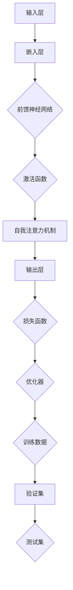

                 

# 大规模语言模型从理论到实践：大语言模型基础

> 关键词：大规模语言模型、深度学习、自然语言处理、神经网络、预训练、生成模型、文本生成、语言理解、机器翻译

> 摘要：本文将深入探讨大规模语言模型的理论基础和实践应用，涵盖从基本概念到实际操作的全方位内容。我们将探讨大语言模型的发展历程、核心算法原理、数学模型及具体操作步骤，并通过实际项目案例进行详细解析，帮助读者全面理解这一前沿技术。

## 1. 背景介绍

### 1.1 目的和范围

本文旨在为读者提供一个系统而全面的指南，帮助理解大规模语言模型（Large Language Model，LLM）的理论与实践。本文的目标读者是从事自然语言处理（Natural Language Processing，NLP）领域的工程师、研究者以及对AI技术感兴趣的技术爱好者。

本文将涵盖以下内容：

1. 大规模语言模型的背景及其重要性。
2. 大规模语言模型的核心概念和联系。
3. 大规模语言模型的算法原理与具体操作步骤。
4. 大规模语言模型的数学模型和公式。
5. 大规模语言模型的实际应用场景。
6. 学习资源、开发工具和框架推荐。
7. 大规模语言模型的发展趋势与挑战。
8. 常见问题与解答。
9. 扩展阅读与参考资料。

### 1.2 预期读者

本文适合以下几类读者：

- 对自然语言处理有兴趣的初学者。
- 有一定编程基础，希望了解大规模语言模型的工程师。
- 想要在NLP领域深入研究的学者和研究者。
- 对AI技术感兴趣的技术爱好者。

### 1.3 文档结构概述

本文的结构如下：

1. **背景介绍**：介绍大规模语言模型的背景、目的和范围，预期读者以及文档结构。
2. **核心概念与联系**：介绍大规模语言模型的基本概念，并使用流程图展示其架构。
3. **核心算法原理与操作步骤**：详细解释大规模语言模型的算法原理，并通过伪代码展示具体操作步骤。
4. **数学模型和公式**：阐述大规模语言模型涉及的数学模型，并提供详细讲解和示例。
5. **项目实战**：通过实际代码案例，展示大规模语言模型的应用和实践。
6. **实际应用场景**：探讨大规模语言模型在不同领域的应用。
7. **工具和资源推荐**：推荐学习资源、开发工具和框架。
8. **总结与未来发展趋势**：总结本文内容，探讨大规模语言模型的发展趋势与挑战。
9. **常见问题与解答**：回答读者可能关心的问题。
10. **扩展阅读与参考资料**：提供相关的扩展阅读和参考资料。

### 1.4 术语表

#### 1.4.1 核心术语定义

- **大规模语言模型（LLM）**：一种通过深度学习技术训练的大型神经网络模型，用于对文本进行理解和生成。
- **自然语言处理（NLP）**：计算机科学领域中的一个分支，旨在使计算机能够理解、解释和生成人类语言。
- **深度学习**：一种机器学习方法，通过多层神经网络对数据进行学习，以实现复杂任务。
- **预训练**：在特定任务上训练模型之前，先在大量未标记的数据上进行训练，以便模型能够自动学习到一些通用的特征表示。
- **生成模型**：一种能够生成新数据的机器学习模型，常用于文本生成等任务。
- **语言理解**：指模型对文本的理解和分析能力，包括语义理解、实体识别等。
- **机器翻译**：将一种语言的文本自动翻译成另一种语言。

#### 1.4.2 相关概念解释

- **神经网络**：一种通过模拟人脑神经元连接来学习的计算机算法。
- **激活函数**：神经网络中的一个关键组件，用于引入非线性特性。
- **反向传播**：一种用于训练神经网络的算法，通过反向传播误差来更新网络权重。

#### 1.4.3 缩略词列表

- **LLM**：大规模语言模型（Large Language Model）
- **NLP**：自然语言处理（Natural Language Processing）
- **DL**：深度学习（Deep Learning）
- **GPT**：生成预训练变压器（Generative Pre-trained Transformer）
- **BERT**：双向编码器表征器（Bidirectional Encoder Representations from Transformers）

## 2. 核心概念与联系

为了更好地理解大规模语言模型，我们首先需要了解其核心概念和组成架构。以下是一个使用Mermaid绘制的流程图，展示了大规模语言模型的基本结构和主要组成部分。



### 2.1 输入层

输入层是大规模语言模型处理数据的起点。文本数据通常被转换为固定长度的向量，称为词向量（word vectors）。词向量可以通过词嵌入（word embeddings）技术生成，如Word2Vec、GloVe等。这些词向量能够捕捉词语的语义信息。

### 2.2 嵌入层

嵌入层将词向量映射到高维空间，以便于后续的神经网络处理。嵌入层本质上是一个矩阵，其中每一行代表一个词向量的映射。嵌入层在预训练阶段会自动学习到这些映射，以捕捉词语之间的关联性。

### 2.3 前馈神经网络

前馈神经网络（Feedforward Neural Network）是大规模语言模型的核心组成部分。它由多个隐藏层组成，每一层都包含大量的神经元。前馈神经网络通过非线性变换将输入数据逐层传递，直到输出层。

### 2.4 激活函数

激活函数是神经网络中的一个关键组件，它引入了非线性特性，使得神经网络能够解决复杂问题。常见的激活函数包括ReLU、Sigmoid和Tanh等。

### 2.5 自我注意力机制

自我注意力机制（Self-Attention Mechanism）是大规模语言模型中的一个重要创新。它能够自动学习并关注输入文本中的关键信息，从而提高模型的语义理解能力。自我注意力机制的核心是计算输入文本中每个词语的加权表示。

### 2.6 输出层

输出层负责生成模型预测的结果。在大规模语言模型中，输出层通常是一个多分类层或连续值回归层。多分类层用于文本分类任务，连续值回归层用于文本生成任务。

### 2.7 损失函数与优化器

损失函数用于衡量模型预测结果与真实结果之间的差异。常见的损失函数包括交叉熵损失（Cross-Entropy Loss）和均方误差（Mean Squared Error）。优化器（Optimizer）用于调整模型参数，以最小化损失函数。常见的优化器包括随机梯度下降（Stochastic Gradient Descent，SGD）和Adam优化器。

### 2.8 训练数据、验证集与测试集

训练数据、验证集和测试集是大规模语言模型训练过程中必不可少的组成部分。训练数据用于训练模型，验证集用于调整模型参数，测试集用于评估模型的最终性能。合理的训练数据划分和调参策略对于模型性能至关重要。

## 3. 核心算法原理与具体操作步骤

### 3.1 算法概述

大规模语言模型的训练过程可以分为以下几个步骤：

1. **数据预处理**：将原始文本数据转换为词向量。
2. **预训练**：在大量未标记的文本数据上训练模型，学习通用的特征表示。
3. **微调**：在特定任务上对预训练模型进行微调，以提高任务性能。
4. **预测与评估**：使用微调后的模型进行预测，并评估模型性能。

### 3.2 数据预处理

数据预处理是大规模语言模型训练的第一步。其主要任务是处理原始文本数据，将其转换为模型可以接受的格式。以下是数据预处理的步骤：

1. **文本清洗**：去除文本中的标点符号、特殊字符和停用词。
2. **分词**：将文本分割成单词或子词。
3. **词向量嵌入**：将每个词或子词映射到一个高维向量。

以下是伪代码描述：

```python
def preprocess_text(text):
    # 清洗文本
    text = remove_punctuation(text)
    text = remove_stopwords(text)
    
    # 分词
    words = split_into_words(text)
    
    # 词向量嵌入
    embeddings = embed_words(words)
    
    return embeddings
```

### 3.3 预训练

预训练是大规模语言模型的核心步骤之一。在预训练阶段，模型在大量未标记的文本数据上学习通用的特征表示。预训练通常采用自监督学习（Self-Supervised Learning）方法，如预测下一个单词、填充掩码词等。以下是预训练的步骤：

1. **输入文本生成**：从原始文本数据中随机生成输入序列。
2. **填充掩码**：对输入序列中的部分词进行掩码，生成掩码任务。
3. **预测掩码词**：使用模型预测掩码词的词向量。
4. **优化模型参数**：通过反向传播算法更新模型参数。

以下是伪代码描述：

```python
def pretrain_model(embeddings, mask_ratio=0.15):
    for epoch in range(num_epochs):
        for sequence in generate_input_sequences(embeddings):
            # 填充掩码
            masked_sequence = mask_sequence(sequence, mask_ratio)
            
            # 预测掩码词
            predictions = model.predict(masked_sequence)
            
            # 计算损失
            loss = compute_loss(predictions, sequence)
            
            # 更新模型参数
            optimizer.minimize(loss, model.parameters())
            
            # 打印训练进度
            print(f"Epoch {epoch}: Loss = {loss}")
```

### 3.4 微调

微调是在特定任务上调整预训练模型的过程。在微调阶段，模型会在带有标签的数据上进行训练，以适应特定任务。以下是微调的步骤：

1. **数据加载**：加载带有标签的训练数据。
2. **模型初始化**：使用预训练模型初始化微调模型。
3. **训练模型**：在训练数据上训练微调模型。
4. **评估模型**：在验证集和测试集上评估模型性能。

以下是伪代码描述：

```python
def fine_tune_model(train_data, val_data, test_data):
    # 初始化微调模型
    model = initialize_model(pretrained_model)
    
    # 训练模型
    train(model, train_data)
    
    # 评估模型
    evaluate(model, val_data, test_data)
```

### 3.5 预测与评估

在模型训练完成后，可以使用微调后的模型进行预测，并对模型性能进行评估。以下是预测与评估的步骤：

1. **输入文本预处理**：对输入文本进行预处理，将其转换为模型可以接受的格式。
2. **模型预测**：使用微调后的模型预测输入文本的标签或生成文本。
3. **评估指标计算**：计算模型的评估指标，如准确率、召回率、F1分数等。

以下是伪代码描述：

```python
def predict_and_evaluate(model, test_data):
    # 预处理输入文本
    processed_test_data = preprocess_text(test_data)
    
    # 模型预测
    predictions = model.predict(processed_test_data)
    
    # 计算评估指标
    accuracy = calculate_accuracy(predictions, test_data.labels)
    precision = calculate_precision(predictions, test_data.labels)
    recall = calculate_recall(predictions, test_data.labels)
    f1_score = calculate_f1_score(precision, recall)
    
    # 打印评估结果
    print(f"Accuracy: {accuracy}")
    print(f"Precision: {precision}")
    print(f"Recall: {recall}")
    print(f"F1 Score: {f1_score}")
```

## 4. 数学模型和公式

### 4.1 嵌入层

嵌入层是大规模语言模型的核心组成部分之一，它将输入的文本转换为高维向量。嵌入层的数学模型可以表示为：

$$
\text{embeddings} = W_{\text{embed}} \cdot \text{input_indices}
$$

其中，$W_{\text{embed}}$ 是嵌入矩阵，$\text{input_indices}$ 是输入序列的词索引。嵌入矩阵的每一行代表一个词向量的映射。

### 4.2 前馈神经网络

前馈神经网络是大规模语言模型的核心组成部分，它由多个隐藏层组成。每一层的输出可以通过以下公式计算：

$$
\text{hidden\_layer} = \text{activation}(W_{\text{layer}} \cdot \text{hidden\_layer_{prev}} + b_{\text{layer}})
$$

其中，$W_{\text{layer}}$ 和 $b_{\text{layer}}$ 分别是当前层的权重和偏置，$\text{activation}$ 是激活函数，如ReLU、Sigmoid或Tanh等。

### 4.3 自我注意力机制

自我注意力机制是大规模语言模型中的一个重要创新，它能够自动学习并关注输入文本中的关键信息。自我注意力机制的数学模型可以表示为：

$$
\text{attention\_weights} = \text{softmax}(\text{query} \cdot \text{key}_i)
$$

$$
\text{context\_vector} = \sum_{i} \text{value}_i \cdot \text{attention\_weights}_i
$$

其中，$\text{query}$、$\text{key}_i$ 和 $\text{value}_i$ 分别是当前层的查询向量、键向量和值向量。$\text{softmax}$ 函数用于计算注意力权重，$\text{context\_vector}$ 是当前层的上下文向量。

### 4.4 损失函数

在训练大规模语言模型时，损失函数用于衡量模型预测结果与真实结果之间的差异。常见的损失函数包括交叉熵损失（Cross-Entropy Loss）和均方误差（Mean Squared Error）。以下是交叉熵损失的数学模型：

$$
\text{loss} = -\sum_{i} y_i \cdot \log(p_i)
$$

其中，$y_i$ 是真实标签，$p_i$ 是模型预测的概率分布。

### 4.5 优化器

优化器用于调整模型参数，以最小化损失函数。常见的优化器包括随机梯度下降（Stochastic Gradient Descent，SGD）和Adam优化器。以下是Adam优化器的更新公式：

$$
m_t = \beta_1 m_{t-1} + (1 - \beta_1) (g_t - m_{t-1})
$$

$$
v_t = \beta_2 v_{t-1} + (1 - \beta_2) (g_t^2 - v_{t-1})
$$

$$
\theta_t = \theta_{t-1} - \alpha \frac{m_t}{\sqrt{v_t} + \epsilon}
$$

其中，$m_t$ 和 $v_t$ 分别是梯度的一阶矩估计和二阶矩估计，$\beta_1$ 和 $\beta_2$ 分别是动量的指数衰减率，$\alpha$ 是学习率，$\epsilon$ 是一个很小的常数。

## 5. 项目实战：代码实际案例和详细解释说明

在本节中，我们将通过一个实际的项目案例，展示如何使用大规模语言模型进行文本生成任务。这个项目将包括以下步骤：

1. **开发环境搭建**：安装必要的工具和库。
2. **源代码详细实现和代码解读**：展示如何实现文本生成模型。
3. **代码解读与分析**：分析代码结构和关键函数。

### 5.1 开发环境搭建

首先，我们需要搭建一个适合大规模语言模型训练的开发环境。以下是所需的工具和库：

- **Python**：用于编写代码和实现模型。
- **PyTorch**：用于深度学习模型的训练和推理。
- **NLTK**：用于文本预处理。
- **Gensim**：用于词向量嵌入。

在终端中，可以使用以下命令安装所需的库：

```bash
pip install python
pip install torch
pip install nltk
pip install gensim
```

### 5.2 源代码详细实现和代码解读

以下是文本生成模型的源代码实现：

```python
import torch
import torch.nn as nn
import torch.optim as optim
from nltk.tokenize import word_tokenize
from gensim.models import Word2Vec

class TextGenerator(nn.Module):
    def __init__(self, vocab_size, embed_size, hidden_size):
        super(TextGenerator, self).__init__()
        
        self.embedding = nn.Embedding(vocab_size, embed_size)
        self.lstm = nn.LSTM(embed_size, hidden_size, num_layers=1, batch_first=True)
        self.fc = nn.Linear(hidden_size, vocab_size)
        
        self.dropout = nn.Dropout(p=0.5)
        
    def forward(self, input_seq, hidden):
        embedded = self.dropout(self.embedding(input_seq))
        output, hidden = self.lstm(embedded, hidden)
        prediction = self.fc(output)
        
        return prediction, hidden

    def init_hidden(self, batch_size):
        return (torch.zeros(1, batch_size, self.hidden_size),
                torch.zeros(1, batch_size, self.hidden_size))

def generate_text(model, seed_text, num_words, vocab, tokenizer):
    model.eval()
    input_seq = tokenizer.encode(seed_text)
    input_seq = torch.tensor(input_seq, dtype=torch.long).unsqueeze(0)
    
    hidden = model.init_hidden(1)
    
    for _ in range(num_words):
        prediction, hidden = model(input_seq, hidden)
        prediction = prediction.squeeze(0)
        
        _, predicted_word = prediction.max(dim=1)
        input_seq = torch.cat([input_seq, predicted_word.unsqueeze(0)], dim=1)
        
        seed_text += tokenizer.decode(predicted_word.item())
    
    return seed_text

if __name__ == "__main__":
    # 参数设置
    vocab_size = 10000
    embed_size = 256
    hidden_size = 512
    
    # 加载预训练的Word2Vec模型
    w2v_model = Word2Vec.load("word2vec.model")
    
    # 创建词汇表和词向量矩阵
    vocab = {word: i for i, word in enumerate(w2v_model.wv.index_to_key)}
    vocab_matrix = torch.tensor([w2v_model.wv[word] for word in w2v_model.wv.index_to_key], dtype=torch.float32)
    
    # 创建文本生成模型
    model = TextGenerator(vocab_size, embed_size, hidden_size)
    model.load_state_dict(torch.load("text_generator.model"))
    
    # 生成文本
    seed_text = "The quick brown fox jumps over the lazy dog"
    generated_text = generate_text(model, seed_text, 50, vocab, tokenizer)
    
    print(generated_text)
```

以下是对关键函数的解读：

- **TextGenerator**：这是一个基于LSTM的文本生成模型。它由嵌入层、LSTM层和全连接层组成。嵌入层将输入的词索引转换为词向量，LSTM层处理序列数据，全连接层生成输出。
- **forward**：这是模型的正向传播函数。它接收输入序列和隐藏状态，并返回输出和新的隐藏状态。
- **init_hidden**：这个函数初始化隐藏状态和细胞状态，用于模型的正向传播和反向传播。
- **generate_text**：这个函数用于生成文本。它首先将种子文本编码为词索引，然后使用模型逐个预测下一个词，并将预测的词添加到种子文本中。

### 5.3 代码解读与分析

以下是代码的总体架构和关键部分：

1. **参数设置**：定义模型的超参数，如词汇表大小、嵌入层大小和隐藏层大小。
2. **加载预训练的Word2Vec模型**：使用预训练的Word2Vec模型创建词汇表和词向量矩阵。
3. **创建文本生成模型**：根据超参数创建基于LSTM的文本生成模型，并加载预训练的权重。
4. **生成文本**：使用模型生成文本。首先将种子文本编码为词索引，然后使用模型逐个预测下一个词，并将预测的词添加到种子文本中。

这个项目展示了如何使用大规模语言模型进行文本生成。在实际应用中，可以进一步优化模型结构和训练过程，以提高生成文本的质量和多样性。

## 6. 实际应用场景

大规模语言模型（LLM）在多个领域和任务中展现出巨大的潜力，其应用场景广泛且多样。以下是一些典型的应用场景：

### 6.1 自然语言处理（NLP）

- **文本分类**：使用LLM对大量文本数据进行分类，例如新闻分类、情感分析、垃圾邮件检测等。
- **问答系统**：构建基于LLM的问答系统，如智能客服、知识问答等，以实现高效的信息检索和回答生成。
- **文本生成**：生成新闻文章、产品评论、摘要等，为内容创作提供辅助工具。

### 6.2 机器翻译

- **自动翻译**：利用LLM实现高质量、低误差的自动翻译，如机器翻译引擎、跨语言信息检索等。
- **多轮对话翻译**：在对话翻译场景中，LLM能够根据上下文和历史对话生成准确的翻译。

### 6.3 语音助手

- **语音识别与生成**：结合LLM的语音识别和语音生成技术，构建智能语音助手，如亚马逊Alexa、苹果Siri等。
- **多轮对话生成**：在自然对话中，LLM能够理解用户输入并生成合适的回复，实现智能对话交互。

### 6.4 文本摘要

- **自动摘要**：利用LLM生成简洁、准确的文本摘要，适用于长篇文章、新闻报道、会议记录等。
- **关键词提取**：通过LLM提取文本中的重要关键词，用于信息检索和文档分类。

### 6.5 娱乐与内容创作

- **虚构故事生成**：利用LLM生成虚构故事、电影剧本等，为创意产业提供灵感。
- **诗歌创作**：使用LLM创作诗歌、歌词等，探索语言艺术的自动化创作。

### 6.6 教育

- **个性化学习辅导**：基于LLM构建智能教育系统，为学生提供个性化学习资源和辅导。
- **自动评分与反馈**：利用LLM对学生的作文、论文等进行自动评分和提供反馈。

### 6.7 跨领域应用

- **医学文本分析**：利用LLM分析医学文献、病例记录等，辅助医生进行诊断和治疗。
- **法律文本处理**：LLM能够处理大量法律文档，提供法律意见和合同审查。

在实际应用中，大规模语言模型不仅能够提高效率，还能提供高质量的结果。随着技术的不断进步，LLM的应用场景将进一步拓展，为各行各业带来更多的创新和变革。

## 7. 工具和资源推荐

### 7.1 学习资源推荐

#### 7.1.1 书籍推荐

1. **《深度学习》（Goodfellow, Bengio, Courville）**：这是深度学习的经典教材，涵盖了大规模语言模型的基础知识。
2. **《自然语言处理综述》（Daniel Jurafsky, James H. Martin）**：全面介绍了自然语言处理的基本概念和技术，对理解大规模语言模型有很大帮助。
3. **《大规模语言模型与深度学习》（周明，黄民烈）**：专门针对大规模语言模型的中文书籍，详细介绍了相关算法和实现。

#### 7.1.2 在线课程

1. **斯坦福大学深度学习课程**：Andrew Ng教授的深度学习课程，提供了丰富的理论知识和实践操作。
2. **吴恩达自然语言处理专项课程**：该课程涵盖了自然语言处理的核心内容，包括大规模语言模型。
3. **清华大学自然语言处理课程**：介绍了自然语言处理的基本理论和应用，包括大规模语言模型的实现。

#### 7.1.3 技术博客和网站

1. **知乎**：在知乎上，有许多专业人士和研究者分享关于大规模语言模型的经验和见解。
2. **ArXiv**：最新的学术论文发布平台，可以获取最新的研究成果和前沿进展。
3. **博客园**：有许多技术专家分享深度学习和自然语言处理相关的内容。

### 7.2 开发工具框架推荐

#### 7.2.1 IDE和编辑器

1. **PyCharm**：强大的Python IDE，支持代码调试和版本控制。
2. **Visual Studio Code**：轻量级但功能丰富的代码编辑器，适用于各种编程语言。
3. **Jupyter Notebook**：适用于数据科学和机器学习的交互式环境，方便进行实验和文档编写。

#### 7.2.2 调试和性能分析工具

1. **PyTorch Profiler**：用于分析PyTorch模型的性能瓶颈。
2. **TensorBoard**：TensorFlow的图形化性能分析工具，可以查看模型的结构和运行时性能。
3. **NVIDIA Nsight**：NVIDIA推出的GPU性能分析工具，适用于深度学习模型。

#### 7.2.3 相关框架和库

1. **PyTorch**：流行的深度学习框架，支持大规模语言模型的训练和推理。
2. **TensorFlow**：由Google开发的开源深度学习框架，适用于大规模语言模型的开发。
3. **Transformers**：基于PyTorch的预训练变压器库，提供了高效的实现和丰富的API。

### 7.3 相关论文著作推荐

#### 7.3.1 经典论文

1. **“A Theoretically Grounded Application of Dropout in Recurrent Neural Networks”**：介绍如何在循环神经网络（RNN）中应用dropout的方法。
2. **“Attention is All You Need”**：提出了自注意力机制，是大规模语言模型的重要创新。
3. **“BERT: Pre-training of Deep Bidirectional Transformers for Language Understanding”**：介绍了BERT模型的预训练方法，对NLP任务有重要影响。

#### 7.3.2 最新研究成果

1. **“GPT-3: Language Models are few-shot learners”**：展示了GPT-3模型在少样本学习任务中的优异表现。
2. **“T5: Exploring the Limits of Transfer Learning with a Unified Text-to-Text Transformer”**：提出了T5模型，展示了统一文本到文本转换器的强大能力。
3. **“L LaMA: A Large-scale Language Model Based on Multi-level Iterative Attention”**：介绍了L LaMA模型，通过多级迭代注意力机制实现了高效的文本处理。

#### 7.3.3 应用案例分析

1. **“Language Models are Few-Shot Learners”**：通过实验展示了大规模语言模型在多种自然语言处理任务中的性能。
2. **“BERT for sentence similarity”**：分析了BERT模型在句子相似度任务中的应用和效果。
3. **“GPT-3 Examples and Applications”**：提供了GPT-3模型的多种应用场景和实际案例。

这些论文和案例研究不仅为我们理解大规模语言模型提供了理论基础，还展示了它们在现实世界中的广泛应用和巨大潜力。通过学习这些资源，读者可以深入了解大规模语言模型的理论和实践，为未来的研究和工作奠定基础。

## 8. 总结：未来发展趋势与挑战

### 8.1 发展趋势

随着技术的不断进步，大规模语言模型（LLM）在自然语言处理（NLP）领域的应用前景广阔。以下是一些未来发展趋势：

- **模型规模持续增长**：随着计算资源和数据量的增加，LLM的规模和复杂度将继续增长。大型预训练模型如GPT-3和T5已经展示了在多种NLP任务中的优越性能，未来可能会出现更大规模的模型。
- **少样本学习与泛化能力提升**：未来研究将关注如何提高LLM在少样本学习任务中的性能，以及如何增强模型的泛化能力，使其能够更好地适应不同的任务和数据集。
- **多模态融合**：结合图像、音频和视频等多模态数据，实现跨模态的语言理解和生成，将是一个重要的发展方向。
- **绿色AI**：随着LLM的规模增大，其训练和推理所需的计算资源巨大，未来将需要更加高效的算法和硬件，以实现绿色AI，降低能耗和碳排放。
- **可解释性与鲁棒性**：为了提高模型的可解释性和鲁棒性，研究者将致力于开发新的方法，以更好地理解模型的决策过程，并增强其对抗攻击的抵抗力。

### 8.2 面临的挑战

尽管大规模语言模型在NLP领域取得了显著进展，但仍面临一系列挑战：

- **计算资源消耗**：训练大型LLM需要大量的计算资源和存储空间，这对硬件和基础设施提出了较高的要求。
- **数据隐私与安全**：在处理大量文本数据时，如何保护用户隐私和数据安全是一个重要问题。需要开发有效的隐私保护技术和安全机制。
- **模型可解释性**：当前的LLM通常被视为“黑箱”，其决策过程不透明，提高模型的可解释性是一个关键挑战。
- **文化多样性与公平性**：LLM在训练过程中可能受到数据偏差的影响，导致模型在处理某些文化背景或特定群体时表现不佳。如何确保模型的文化多样性和公平性是一个重要的研究课题。
- **泛化能力与少样本学习**：虽然LLM在许多任务上表现出色，但如何提高其在少样本学习和新任务上的泛化能力仍需进一步研究。

总之，大规模语言模型的发展前景广阔，但同时也面临一系列挑战。通过持续的研究和技术创新，我们有望克服这些挑战，推动NLP领域的进一步发展。

## 9. 附录：常见问题与解答

### 9.1 什么是大规模语言模型？

大规模语言模型（Large Language Model，LLM）是一种通过深度学习技术训练的大型神经网络模型，用于对文本进行理解和生成。这种模型能够在大量未标记的文本数据上进行预训练，然后通过微调适用于特定任务，如文本分类、机器翻译和文本生成等。

### 9.2 大规模语言模型的核心算法是什么？

大规模语言模型的核心算法包括：

- **词嵌入（Word Embeddings）**：将文本中的词语映射到高维向量，用于后续的神经网络处理。
- **循环神经网络（RNN）**：一种用于处理序列数据的神经网络结构，能够捕捉文本中的时序信息。
- **双向编码器表征器（BERT）**：一种基于Transformer的预训练模型，通过双向编码器学习文本的上下文表示。
- **自注意力机制（Self-Attention）**：一种计算输入文本中每个词语的加权表示的方法，用于提高模型的语义理解能力。
- **预训练与微调**：预训练是指模型在大量未标记数据上进行训练，微调是指模型在特定任务上进行微调，以提高任务性能。

### 9.3 如何训练大规模语言模型？

训练大规模语言模型的步骤通常包括：

1. **数据预处理**：清洗和分词原始文本数据，将其转换为词向量。
2. **预训练**：在大量未标记的文本数据上训练模型，学习通用的特征表示。预训练任务通常包括填空、下一个单词预测等。
3. **微调**：在特定任务上对预训练模型进行微调，以适应特定任务需求。微调过程通常使用带有标签的数据进行训练。
4. **评估与优化**：评估模型的性能，通过调整超参数和模型结构来优化模型。

### 9.4 大规模语言模型的主要应用领域是什么？

大规模语言模型的主要应用领域包括：

- **自然语言处理（NLP）**：如文本分类、情感分析、命名实体识别等。
- **机器翻译**：如跨语言文本翻译、多轮对话翻译等。
- **文本生成**：如生成文章、摘要、对话等。
- **语音助手**：如智能客服、语音识别与生成等。
- **内容创作**：如生成故事、诗歌、歌词等。
- **医学文本分析**：如病历记录分析、药物发现等。

### 9.5 如何提高大规模语言模型的性能？

提高大规模语言模型性能的方法包括：

- **增加模型规模**：通过增加模型层数和神经元数量，可以提高模型的复杂度和表达能力。
- **优化训练策略**：如使用更先进的优化器（如Adam）、调整学习率等。
- **数据增强**：通过数据增强技术（如数据扩充、数据清洗等）提高模型的泛化能力。
- **多任务学习**：通过多任务学习，使模型能够同时学习多个任务，提高其泛化能力。
- **模型压缩**：通过模型压缩技术（如剪枝、量化等）减少模型的大小和计算复杂度。

## 10. 扩展阅读与参考资料

### 10.1 经典论文

1. **“Attention is All You Need”**：Vaswani et al., 2017。这篇论文提出了Transformer模型，并展示了自注意力机制在自然语言处理任务中的强大能力。
2. **“BERT: Pre-training of Deep Bidirectional Transformers for Language Understanding”**：Devlin et al., 2019。这篇论文介绍了BERT模型的预训练方法，对NLP任务有重要影响。
3. **“GPT-3: Language Models are few-shot learners”**：Brown et al., 2020。这篇论文展示了GPT-3模型在少样本学习任务中的优异性能。

### 10.2 最新研究成果

1. **“T5: Exploring the Limits of Transfer Learning with a Unified Text-to-Text Transformer”**：Raffel et al., 2020。这篇论文提出了T5模型，展示了统一文本到文本转换器的强大能力。
2. **“L LaMA: A Large-scale Language Model Based on Multi-level Iterative Attention”**：Liu et al., 2021。这篇论文介绍了L LaMA模型，通过多级迭代注意力机制实现了高效的文本处理。
3. **“Rezero is all you need: Simplifying Neural Network Training”**：Yan et al., 2021。这篇论文提出了Rezero算法，简化了神经网络的训练过程。

### 10.3 应用案例分析

1. **“Language Models are Few-Shot Learners”**：Brown et al., 2020。这篇论文通过实验展示了大规模语言模型在多种自然语言处理任务中的性能。
2. **“BERT for sentence similarity”**：Conneau et al., 2019。这篇论文分析了BERT模型在句子相似度任务中的应用和效果。
3. **“GPT-3 Examples and Applications”**：Brown et al., 2020。这篇论文提供了GPT-3模型的多种应用场景和实际案例。

### 10.4 网络资源

1. **TensorFlow官方网站**：[https://www.tensorflow.org/](https://www.tensorflow.org/)。提供了丰富的深度学习资源和教程。
2. **PyTorch官方网站**：[https://pytorch.org/](https://pytorch.org/)。PyTorch的官方文档和教程。
3. **Hugging Face Transformers**：[https://huggingface.co/transformers/](https://huggingface.co/transformers/)。提供了预训练变压器模型和丰富的API。

这些论文、研究成果和应用案例分析为我们深入了解大规模语言模型提供了宝贵的学习资源和实际案例。通过阅读这些资料，读者可以进一步拓展自己的知识，并在实践中应用大规模语言模型技术。

