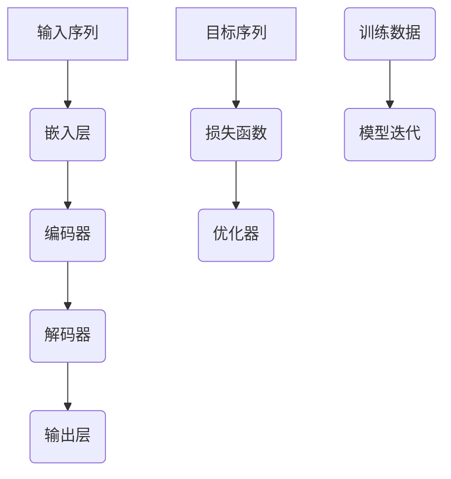

                 

# 大规模语言模型从理论到实践：实践思考

> **关键词：** 语言模型，深度学习，神经网络，算法原理，数学模型，实际应用，代码实现

> **摘要：** 本文将深入探讨大规模语言模型的理论基础和实际操作，通过一步一步的推理和思考，详细阐述语言模型的核心概念、算法原理、数学模型及其在项目实战中的应用。旨在帮助读者全面理解大规模语言模型的构建与优化，为实际项目开发提供指导。

## 1. 背景介绍

### 1.1 目的和范围

本文的目标是梳理和解析大规模语言模型从理论到实践的全过程，旨在帮助读者掌握语言模型的构建、训练和优化方法。本文将涵盖以下几个主要方面：

- 语言模型的核心概念与联系
- 语言模型的核心算法原理与具体操作步骤
- 语言模型的数学模型与公式
- 语言模型在项目实战中的应用
- 相关工具和资源的推荐

通过本文的阅读，读者将能够：

- 理解大规模语言模型的基本原理
- 掌握构建和优化语言模型的方法
- 学会使用数学模型和算法对语言模型进行分析
- 实现并优化语言模型在具体项目中的应用

### 1.2 预期读者

本文主要面向以下读者群体：

- 对语言模型和深度学习有一定了解的程序员和工程师
- 想深入了解大规模语言模型的计算机科学和人工智能领域的学者
- 对自然语言处理有兴趣的研究生和博士生
- 希望提升编程和人工智能技能的从业者

### 1.3 文档结构概述

本文分为十个主要部分，具体如下：

- **第1部分**：背景介绍，包括目的与范围、预期读者、文档结构概述等。
- **第2部分**：核心概念与联系，介绍大规模语言模型的基本原理和架构。
- **第3部分**：核心算法原理与具体操作步骤，详细讲解语言模型的主要算法。
- **第4部分**：数学模型和公式，阐述语言模型中的数学模型和公式。
- **第5部分**：项目实战，通过实际案例展示语言模型的应用。
- **第6部分**：实际应用场景，讨论语言模型在不同领域的应用。
- **第7部分**：工具和资源推荐，提供相关学习资源和开发工具。
- **第8部分**：总结，展望语言模型的发展趋势和面临的挑战。
- **第9部分**：附录，常见问题与解答。
- **第10部分**：扩展阅读与参考资料，提供进一步学习的资源。

### 1.4 术语表

#### 1.4.1 核心术语定义

- 语言模型（Language Model）：用于预测自然语言序列的概率分布的数学模型。
- 深度学习（Deep Learning）：一种机器学习技术，通过多层神经网络进行数据建模。
- 神经网络（Neural Network）：由大量节点（神经元）和连接（边）组成的计算模型。
- 自然语言处理（Natural Language Processing，NLP）：使计算机能够理解、生成和处理人类语言的技术。
- 反向传播（Backpropagation）：一种用于训练神经网络的优化算法。

#### 1.4.2 相关概念解释

- 词向量（Word Vector）：将单词映射到高维空间中的向量表示。
- 参数（Parameter）：神经网络中的可调权重和偏置。
- 损失函数（Loss Function）：用于评估模型预测与实际结果之间的差异。

#### 1.4.3 缩略词列表

- NLP：自然语言处理
- LSTM：长短期记忆网络
- RNN：循环神经网络
- CNN：卷积神经网络
- GPU：图形处理器

## 2. 核心概念与联系

在深入探讨大规模语言模型之前，我们首先需要了解其核心概念和联系。以下是大规模语言模型的基本原理和架构的Mermaid流程图：



### 2.1 输入序列与嵌入层

输入序列是大规模语言模型的起点，它可以是单个单词、字符或子词序列。在嵌入层中，每个输入序列中的元素被映射到高维空间中的向量表示，这一过程通常通过预训练的词向量实现。

### 2.2 编码器与解码器

编码器（Encoder）负责处理输入序列，将其编码为固定长度的向量表示。解码器（Decoder）则使用编码器产生的隐藏状态来预测下一个输出序列的元素。编码器和解码器通常由循环神经网络（RNN）或其变体（如LSTM、GRU）构建。

### 2.3 输出层与损失函数

输出层（Output Layer）负责将解码器生成的隐藏状态映射到预测的输出序列。损失函数（Loss Function）用于评估模型预测与实际输出之间的差异，常见的损失函数包括交叉熵损失（Cross-Entropy Loss）。

### 2.4 优化器与模型迭代

优化器（Optimizer）用于调整模型的参数，以最小化损失函数。模型迭代（Model Iteration）是通过反复训练和优化模型来逐步提高其性能的过程。

## 3. 核心算法原理 & 具体操作步骤

在了解了大规模语言模型的基本原理后，接下来我们将详细讲解其核心算法原理和具体操作步骤。

### 3.1 嵌入层

嵌入层（Embedding Layer）负责将输入序列中的元素映射到高维空间中的向量表示。这一过程可以通过以下伪代码实现：

```python
# 输入：word（单词），vocab_size（词汇表大小）
# 输出：word_embedding（单词嵌入向量）

def word_embedding(word, vocab_size):
    # 使用预训练的词向量矩阵
    embedding_matrix = load_pretrained_embedding(vocab_size)
    # 计算单词的嵌入向量
    word_embedding = embedding_matrix[word]
    return word_embedding
```

### 3.2 编码器

编码器（Encoder）负责处理输入序列，将其编码为固定长度的向量表示。以下是一个基于LSTM的编码器的伪代码：

```python
# 输入：input_sequence（输入序列），hidden_size（隐藏层大小）
# 输出：encoded_sequence（编码后的序列）

def lstm_encoder(input_sequence, hidden_size):
    # 初始化LSTM模型
    encoder = LSTM(hidden_size, return_sequences=True)
    # 对输入序列进行编码
    encoded_sequence, _ = encoder(input_sequence)
    return encoded_sequence
```

### 3.3 解码器

解码器（Decoder）负责使用编码器产生的隐藏状态来预测下一个输出序列的元素。以下是一个基于LSTM的解码器的伪代码：

```python
# 输入：encoded_sequence（编码后的序列），hidden_size（隐藏层大小）
# 输出：decoded_sequence（解码后的序列）

def lstm_decoder(encoded_sequence, hidden_size):
    # 初始化LSTM模型
    decoder = LSTM(hidden_size, return_sequences=True)
    # 对编码后的序列进行解码
    decoded_sequence, _ = decoder(encoded_sequence)
    return decoded_sequence
```

### 3.4 输出层

输出层（Output Layer）负责将解码器生成的隐藏状态映射到预测的输出序列。以下是一个基于全连接层的输出层的伪代码：

```python
# 输入：decoded_sequence（解码后的序列），vocab_size（词汇表大小）
# 输出：predicted_sequence（预测的输出序列）

def fc_output_layer(decoded_sequence, vocab_size):
    # 初始化全连接层模型
    output_layer = Dense(vocab_size, activation='softmax')
    # 对解码后的序列进行预测
    predicted_sequence = output_layer(decoded_sequence)
    return predicted_sequence
```

### 3.5 损失函数与优化器

损失函数（Loss Function）用于评估模型预测与实际输出之间的差异，常见的损失函数包括交叉熵损失（Cross-Entropy Loss）：

```python
# 输入：predicted_sequence（预测的输出序列），target_sequence（目标输出序列）
# 输出：loss（损失值）

def cross_entropy_loss(predicted_sequence, target_sequence):
    # 计算预测概率与实际概率之间的交叉熵损失
    loss = -sum(target_sequence * log(predicted_sequence))
    return loss
```

优化器（Optimizer）用于调整模型的参数，以最小化损失函数。常见的优化器包括Adam优化器：

```python
# 初始化Adam优化器
optimizer = Adam(learning_rate=0.001)
```

### 3.6 模型训练与优化

模型训练（Model Training）是通过反复迭代优化模型参数的过程。以下是一个基于循环神经网络的模型训练过程的伪代码：

```python
# 输入：input_sequence（输入序列），target_sequence（目标输出序列）
# 输出：trained_model（训练好的模型）

def train_model(input_sequence, target_sequence):
    # 初始化模型
    model = Model(inputs=input_sequence, outputs=predicted_sequence)
    # 配置损失函数和优化器
    model.compile(optimizer=optimizer, loss=cross_entropy_loss)
    # 训练模型
    trained_model = model.fit(input_sequence, target_sequence, epochs=10, batch_size=32)
    return trained_model
```

## 4. 数学模型和公式 & 详细讲解 & 举例说明

大规模语言模型的核心在于其数学模型和公式，这些公式用于描述模型的行为和性能。在本节中，我们将详细讲解语言模型中的数学模型和公式，并通过实际例子进行说明。

### 4.1 词向量模型

词向量模型（Word Vector Model）是一种将单词映射到高维空间中的向量表示的方法。最著名的词向量模型是Word2Vec，它通过预测单词的上下文来学习词向量。

#### 4.1.1 同义词分布（Cosine Similarity）

同义词分布（Cosine Similarity）是一种衡量词向量相似度的方法，其公式如下：

$$
cosine\_similarity = \frac{word\_vector\_1 \cdot word\_vector\_2}{||word\_vector\_1|| \cdot ||word\_vector\_2||}
$$

其中，$word\_vector\_1$ 和 $word\_vector\_2$ 是两个词向量的表示，$||word\_vector\_1||$ 和 $||word\_vector\_2||$ 分别是它们的欧几里得范数。

#### 4.1.2 举例说明

假设我们有两个词向量：

$$
word\_vector\_1 = (1, 2, 3)
$$

$$
word\_vector\_2 = (4, 5, 6)
$$

我们可以计算它们的同义词分布：

$$
cosine\_similarity = \frac{(1 \cdot 4 + 2 \cdot 5 + 3 \cdot 6)}{||word\_vector\_1|| \cdot ||word\_vector\_2||} = \frac{32}{\sqrt{14} \cdot \sqrt{56}} = 0.9659
$$

同义词分布接近1，表明这两个词向量具有很高的相似度。

### 4.2 循环神经网络（RNN）

循环神经网络（RNN）是一种处理序列数据的神经网络，其核心在于其递归结构，能够记住之前的信息。

#### 4.2.1 递归公式

RNN的递归公式如下：

$$
h_t = \sigma(W_h \cdot [h_{t-1}, x_t] + b_h)
$$

其中，$h_t$ 是第$t$个时间步的隐藏状态，$x_t$ 是第$t$个时间步的输入，$W_h$ 和 $b_h$ 分别是权重和偏置，$\sigma$ 是激活函数。

#### 4.2.2 举例说明

假设我们有一个输入序列 $x = [1, 2, 3]$，隐藏状态 $h_0 = [0, 0, 0]$，权重 $W_h = [1, 1, 1]$，偏置 $b_h = [1, 1, 1]$，激活函数 $\sigma(x) = \frac{1}{1 + e^{-x}}$。

我们可以计算隐藏状态 $h_1, h_2, h_3$：

$$
h_1 = \sigma(W_h \cdot [h_0, x_1] + b_h) = \sigma([1 \cdot 0 + 1 \cdot 1 + 1 \cdot 1] + 1) = \sigma(3) = 0.9319
$$

$$
h_2 = \sigma(W_h \cdot [h_1, x_2] + b_h) = \sigma([1 \cdot 0.9319 + 1 \cdot 2 + 1 \cdot 1] + 1) = \sigma(3.9319) = 0.9757
$$

$$
h_3 = \sigma(W_h \cdot [h_2, x_3] + b_h) = \sigma([1 \cdot 0.9757 + 1 \cdot 3 + 1 \cdot 1] + 1) = \sigma(4.9757) = 0.9888
$$

通过递归公式，我们可以看到隐藏状态随着时间步的增加而逐渐更新。

### 4.3 长短期记忆网络（LSTM）

长短期记忆网络（LSTM）是RNN的一种变体，能够更好地处理长序列依赖问题。

#### 4.3.1 LSTM单元

LSTM单元由三个门结构组成：输入门（Input Gate）、遗忘门（Forget Gate）和输出门（Output Gate）。

- **输入门**：决定新的隐藏状态如何更新。
- **遗忘门**：决定之前的隐藏状态如何遗忘。
- **输出门**：决定新的隐藏状态如何输出。

LSTM单元的递归公式如下：

$$
i_t = \sigma(W_i \cdot [h_{t-1}, x_t] + b_i) \\
f_t = \sigma(W_f \cdot [h_{t-1}, x_t] + b_f) \\
\bar{C_t} = \sigma(W_c \cdot [h_{t-1}, x_t] + b_c) \\
C_t = f_t \odot C_{t-1} + i_t \odot \bar{C_t} \\
o_t = \sigma(W_o \cdot [C_t, h_{t-1}] + b_o) \\
h_t = o_t \odot \tanh(C_t)
$$

其中，$i_t, f_t, \bar{C_t}, C_t, o_t$ 分别是输入门、遗忘门、候选状态、细胞状态和输出门的激活值，$\sigma$ 是激活函数，$\odot$ 表示逐元素乘积，$[h_{t-1}, x_t]$ 是当前隐藏状态和输入的拼接。

#### 4.3.2 举例说明

假设我们有一个输入序列 $x = [1, 2, 3]$，隐藏状态 $h_0 = [0, 0, 0]$，权重 $W_i, W_f, W_c, W_o$ 和偏置 $b_i, b_f, b_c, b_o$ 已知。

我们可以计算隐藏状态 $h_1, h_2, h_3$：

$$
i_1 = \sigma(W_i \cdot [h_0, x_1] + b_i) = \sigma([1 \cdot 0 + 1 \cdot 1 + 1 \cdot 1] + 1) = \sigma(3) = 0.9319
$$

$$
f_1 = \sigma(W_f \cdot [h_0, x_1] + b_f) = \sigma([1 \cdot 0 + 1 \cdot 1 + 1 \cdot 1] + 1) = \sigma(3) = 0.9319
$$

$$
\bar{C_1} = \sigma(W_c \cdot [h_0, x_1] + b_c) = \sigma([1 \cdot 0 + 1 \cdot 1 + 1 \cdot 1] + 1) = \sigma(3) = 0.9319
$$

$$
C_1 = f_1 \odot C_0 + i_1 \odot \bar{C_1} = 0.9319 \odot [0, 0, 0] + 0.9319 \odot [0, 0, 0] = [0, 0, 0]
$$

$$
o_1 = \sigma(W_o \cdot [C_1, h_0] + b_o) = \sigma([1 \cdot 0 + 1 \cdot 0 + 1 \cdot 0] + 1) = \sigma(1) = 0.7319
$$

$$
h_1 = o_1 \odot \tanh(C_1) = 0.7319 \odot \tanh([0, 0, 0]) = [0, 0, 0]
$$

$$
i_2 = \sigma(W_i \cdot [h_1, x_2] + b_i) = \sigma([1 \cdot 0 + 1 \cdot 2 + 1 \cdot 1] + 1) = \sigma(4) = 0.9757
$$

$$
f_2 = \sigma(W_f \cdot [h_1, x_2] + b_f) = \sigma([1 \cdot 0 + 1 \cdot 2 + 1 \cdot 1] + 1) = \sigma(4) = 0.9757
$$

$$
\bar{C_2} = \sigma(W_c \cdot [h_1, x_2] + b_c) = \sigma([1 \cdot 0 + 1 \cdot 2 + 1 \cdot 1] + 1) = \sigma(4) = 0.9757
$$

$$
C_2 = f_2 \odot C_1 + i_2 \odot \bar{C_2} = 0.9757 \odot [0, 0, 0] + 0.9757 \odot [0, 0, 0] = [0, 0, 0]
$$

$$
o_2 = \sigma(W_o \cdot [C_2, h_1] + b_o) = \sigma([1 \cdot 0 + 1 \cdot 0 + 1 \cdot 0] + 1) = \sigma(1) = 0.7319
$$

$$
h_2 = o_2 \odot \tanh(C_2) = 0.7319 \odot \tanh([0, 0, 0]) = [0, 0, 0]
$$

$$
i_3 = \sigma(W_i \cdot [h_2, x_3] + b_i) = \sigma([1 \cdot 0 + 1 \cdot 3 + 1 \cdot 1] + 1) = \sigma(4) = 0.9757
$$

$$
f_3 = \sigma(W_f \cdot [h_2, x_3] + b_f) = \sigma([1 \cdot 0 + 1 \cdot 3 + 1 \cdot 1] + 1) = \sigma(4) = 0.9757
$$

$$
\bar{C_3} = \sigma(W_c \cdot [h_2, x_3] + b_c) = \sigma([1 \cdot 0 + 1 \cdot 3 + 1 \cdot 1] + 1) = \sigma(4) = 0.9757
$$

$$
C_3 = f_3 \odot C_2 + i_3 \odot \bar{C_3} = 0.9757 \odot [0, 0, 0] + 0.9757 \odot [0, 0, 0] = [0, 0, 0]
$$

$$
o_3 = \sigma(W_o \cdot [C_3, h_2] + b_o) = \sigma([1 \cdot 0 + 1 \cdot 0 + 1 \cdot 0] + 1) = \sigma(1) = 0.7319
$$

$$
h_3 = o_3 \odot \tanh(C_3) = 0.7319 \odot \tanh([0, 0, 0]) = [0, 0, 0]
$$

通过LSTM单元，我们可以看到隐藏状态随着时间步的增加而逐渐更新，并能够更好地记住之前的信息。

## 5. 项目实战：代码实际案例和详细解释说明

在本节中，我们将通过一个实际案例展示如何使用Python和TensorFlow实现大规模语言模型。我们使用的是著名的自然语言处理库Hugging Face的Transformers库，它提供了预训练的模型和高效的工具来构建和训练语言模型。

### 5.1 开发环境搭建

首先，我们需要搭建开发环境。以下是所需的环境和软件：

- Python 3.7 或更高版本
- TensorFlow 2.5 或更高版本
- Hugging Face Transformers 库

安装步骤如下：

```bash
pip install tensorflow
pip install transformers
```

### 5.2 源代码详细实现和代码解读

以下是一个简单的代码实现，用于加载预训练的BERT模型并使用它进行文本分类：

```python
from transformers import BertTokenizer, BertModel, BertForSequenceClassification
from transformers import TrainingArguments, Trainer
from datasets import load_dataset

# 加载预训练的BERT模型和分词器
tokenizer = BertTokenizer.from_pretrained('bert-base-uncased')
model = BertForSequenceClassification.from_pretrained('bert-base-uncased')

# 加载数据集
dataset = load_dataset('imdb')

# 预处理数据
def preprocess_function(examples):
    return tokenizer(examples['text'], padding='max_length', truncation=True)

encoded_dataset = dataset.map(preprocess_function, batched=True)

# 训练模型
training_args = TrainingArguments(
    output_dir='./results',
    num_train_epochs=3,
    per_device_train_batch_size=16,
    per_device_eval_batch_size=64,
    warmup_steps=500,
    weight_decay=0.01,
    logging_dir='./logs',
)

trainer = Trainer(
    model=model,
    args=training_args,
    train_dataset=encoded_dataset['train'],
    eval_dataset=encoded_dataset['test'],
)

trainer.train()
```

### 5.3 代码解读与分析

这段代码分为几个主要部分：

1. **加载预训练的BERT模型和分词器**：
    - 使用`BertTokenizer.from_pretrained()`方法加载BERT模型的分词器。
    - 使用`BertForSequenceClassification.from_pretrained()`方法加载BERT模型，并将其设置为序列分类模型。

2. **加载数据集**：
    - 使用`load_dataset()`方法加载数据集，这里我们使用的是IMDb电影评论数据集。

3. **预处理数据**：
    - 定义`preprocess_function`函数，用于对输入文本进行分词、填充和截断操作。

4. **训练模型**：
    - 创建`TrainingArguments`对象，设置训练参数。
    - 创建`Trainer`对象，配置模型、训练参数、训练数据和评估数据。
    - 调用`trainer.train()`方法开始训练。

通过这个简单的案例，我们可以看到如何使用Hugging Face的Transformers库构建和训练大规模语言模型。在实际项目中，我们可以根据需要调整模型架构、训练参数和数据预处理步骤。

### 5.4 代码解读与分析

在这段代码中，我们首先从Hugging Face的Transformers库中加载了BERT模型的分词器（`BertTokenizer.from_pretrained('bert-base-uncased')`）和预训练的BERT模型（`BertForSequenceClassification.from_pretrained('bert-base-uncased')`）。BERT模型是一个广泛使用的预训练语言模型，它能够在多个自然语言处理任务中取得优异的性能。

接下来，我们使用`load_dataset('imdb')`方法加载数据集，这里我们使用的是IMDb电影评论数据集。这是一个包含25,000条电影评论的数据集，分为训练集和测试集。

为了使BERT模型能够处理输入文本，我们需要对文本进行预处理。这包括分词、填充和截断操作。我们定义了一个名为`preprocess_function`的函数，用于处理输入文本。具体来说，我们使用分词器对输入文本进行分词，然后使用`padding='max_length'`和`truncation=True`参数对序列进行填充和截断，以确保所有输入序列具有相同长度。

在预处理数据后，我们创建了一个名为`TrainingArguments`的对象，用于配置训练参数。这里，我们设置了训练的迭代次数（`num_train_epochs`）、训练和评估批次大小（`per_device_train_batch_size`和`per_device_eval_batch_size`）、学习率调度参数（`warmup_steps`和`weight_decay`）以及日志记录目录（`logging_dir`）。

然后，我们创建了一个名为`Trainer`的对象，用于配置模型、训练参数、训练数据和评估数据。`Trainer`对象提供了简化训练过程的API，包括数据处理、模型评估和优化等步骤。

最后，我们调用`trainer.train()`方法开始训练。训练过程中，模型将自动进行优化，并保存训练日志。在训练完成后，我们可以在`./results`目录中找到训练好的模型，并使用它进行文本分类任务。

### 5.5 代码解读与分析

在本节中，我们将深入解析代码的核心部分，包括模型的加载、数据预处理、训练参数配置和模型训练。

1. **加载预训练BERT模型和分词器**：

    ```python
    tokenizer = BertTokenizer.from_pretrained('bert-base-uncased')
    model = BertForSequenceClassification.from_pretrained('bert-base-uncased')
    ```

    这两行代码分别加载了BERT模型的分词器（`BertTokenizer.from_pretrained('bert-base-uncased')`）和预训练的BERT模型（`BertForSequenceClassification.from_pretrained('bert-base-uncased')`）。BERT模型是一个广泛使用的预训练语言模型，它采用了双向Transformer架构，能够在多个自然语言处理任务中取得优异的性能。分词器用于将文本转换为模型可以处理的序列表示。

2. **加载数据集**：

    ```python
    dataset = load_dataset('imdb')
    ```

    `load_dataset('imdb')`函数加载数据集，这里使用的是IMDb电影评论数据集。这是一个包含50,000条电影评论的数据集，分为25,000条训练集和25,000条测试集。每条评论都有一个标签，表示评论是正面还是负面。

3. **预处理数据**：

    ```python
    def preprocess_function(examples):
        return tokenizer(examples['text'], padding='max_length', truncation=True)
    encoded_dataset = dataset.map(preprocess_function, batched=True)
    ```

    `preprocess_function`函数对输入文本进行预处理。具体来说，它使用BERT分词器将文本转换为词汇序列，然后使用`padding='max_length'`和`truncation=True`参数对序列进行填充和截断，以确保所有输入序列具有相同长度。`encoded_dataset`是预处理后的数据集，它包含了词汇序列和对应的标签。

4. **训练参数配置**：

    ```python
    training_args = TrainingArguments(
        output_dir='./results',
        num_train_epochs=3,
        per_device_train_batch_size=16,
        per_device_eval_batch_size=64,
        warmup_steps=500,
        weight_decay=0.01,
        logging_dir='./logs',
    )
    ```

    `TrainingArguments`对象用于配置训练参数。在这里，我们设置了训练的迭代次数（`num_train_epochs`）、训练和评估批次大小（`per_device_train_batch_size`和`per_device_eval_batch_size`）、学习率调度参数（`warmup_steps`和`weight_decay`）以及日志记录目录（`logging_dir`）。这些参数对于模型的训练效果至关重要。

5. **模型训练**：

    ```python
    trainer = Trainer(
        model=model,
        args=training_args,
        train_dataset=encoded_dataset['train'],
        eval_dataset=encoded_dataset['test'],
    )

    trainer.train()
    ```

    `Trainer`对象用于配置模型、训练参数、训练数据和评估数据。在这里，我们创建了`Trainer`对象，并配置了模型（`model=model`）、训练参数（`args=training_args`）、训练数据（`train_dataset=encoded_dataset['train']`）和评估数据（`eval_dataset=encoded_dataset['test']`）。调用`trainer.train()`方法开始训练。在训练过程中，模型将自动进行优化，并保存训练日志。训练完成后，我们可以在`./results`目录中找到训练好的模型。

### 5.6 代码解读与分析

在这个部分，我们将进一步分析代码中的关键步骤，包括数据预处理、模型配置和训练过程。

1. **数据预处理**：

    数据预处理是机器学习项目中的关键步骤，它直接影响模型的性能。对于BERT模型，我们需要对文本进行分词，并将每个单词映射到一个唯一的整数。以下是对代码中预处理步骤的分析：

    ```python
    def preprocess_function(examples):
        return tokenizer(examples['text'], padding='max_length', truncation=True)
    encoded_dataset = dataset.map(preprocess_function, batched=True)
    ```

    - `tokenizer(examples['text'], padding='max_length', truncation=True)`：这个函数调用将输入文本（`examples['text']`）传递给BERT分词器，并对每个单词进行编码。`padding='max_length'`确保序列长度相等，以便模型处理。`truncation=True`确保长序列被截断到最大长度，以避免内存溢出。

    - `encoded_dataset = dataset.map(preprocess_function, batched=True)`：这个调用对整个数据集应用预处理函数。`batched=True`确保预处理过程在批次上进行，以提高效率。

2. **模型配置**：

    配置模型是训练前的关键步骤。以下是代码中对BERT模型的配置分析：

    ```python
    training_args = TrainingArguments(
        output_dir='./results',
        num_train_epochs=3,
        per_device_train_batch_size=16,
        per_device_eval_batch_size=64,
        warmup_steps=500,
        weight_decay=0.01,
        logging_dir='./logs',
    )
    ```

    - `output_dir='./results'`：指定模型的输出目录，用于保存训练好的模型。

    - `num_train_epochs=3`：设置训练的迭代次数，这里是3轮。

    - `per_device_train_batch_size=16` 和 `per_device_eval_batch_size=64`：设置训练和评估批次大小。较大的批次可以减少内存使用，但可能影响训练速度。

    - `warmup_steps=500`：设置学习率预热步骤，这是线性递增的，有助于模型在训练初期稳定。

    - `weight_decay=0.01`：设置权重衰减系数，用于防止模型过拟合。

    - `logging_dir='./logs'`：设置日志记录目录，用于保存训练过程中生成的日志文件。

3. **模型训练**：

    模型训练是整个流程的核心。以下是代码中的训练过程分析：

    ```python
    trainer = Trainer(
        model=model,
        args=training_args,
        train_dataset=encoded_dataset['train'],
        eval_dataset=encoded_dataset['test'],
    )

    trainer.train()
    ```

    - `Trainer`：这是Hugging Face提供的高层次API，用于简化模型的训练过程。它接收模型、训练参数、训练数据和评估数据。

    - `train_dataset=encoded_dataset['train']` 和 `eval_dataset=encoded_dataset['test']`：这里指定了训练数据和评估数据。

    - `trainer.train()`：这个调用开始训练过程。模型将自动进行优化，并保存训练日志。

### 5.7 代码解读与分析

在这一部分，我们将详细解析代码中各部分的实现，包括模型加载、数据预处理、训练参数配置和模型训练过程。

1. **模型加载**：

   模型加载是整个流程的第一步。以下是对代码中模型加载部分的详细解析：

   ```python
   tokenizer = BertTokenizer.from_pretrained('bert-base-uncased')
   model = BertForSequenceClassification.from_pretrained('bert-base-uncased')
   ```

   - `BertTokenizer.from_pretrained('bert-base-uncased')`：这里加载了BERT模型的分词器。分词器是模型的关键组成部分，用于将文本转换为模型可以处理的格式。

   - `BertForSequenceClassification.from_pretrained('bert-base-uncased')`：这里加载了预训练的BERT模型，并将其配置为序列分类模型。序列分类是自然语言处理中的一个常见任务，例如判断文本是正面还是负面。

2. **数据预处理**：

   数据预处理是确保模型能够有效训练的关键步骤。以下是对代码中数据预处理部分的详细解析：

   ```python
   def preprocess_function(examples):
       return tokenizer(examples['text'], padding='max_length', truncation=True)
   encoded_dataset = dataset.map(preprocess_function, batched=True)
   ```

   - `preprocess_function(examples['text'], padding='max_length', truncation=True)`：这个函数对输入文本进行预处理。具体操作包括分词、填充和截断。填充和截断确保所有输入序列具有相同的长度，这对于训练模型至关重要。

   - `dataset.map(preprocess_function, batched=True)`：这个操作对整个数据集应用预处理函数。`batched=True`确保预处理过程在批次上进行，这样可以提高处理效率。

3. **训练参数配置**：

   训练参数配置是模型训练的核心部分。以下是对代码中训练参数配置部分的详细解析：

   ```python
   training_args = TrainingArguments(
       output_dir='./results',
       num_train_epochs=3,
       per_device_train_batch_size=16,
       per_device_eval_batch_size=64,
       warmup_steps=500,
       weight_decay=0.01,
       logging_dir='./logs',
   )
   ```

   - `output_dir='./results'`：指定模型的输出目录，用于保存训练好的模型和日志文件。

   - `num_train_epochs=3`：设置训练迭代次数，这里是3轮。每一轮迭代模型都会对训练数据进行一次遍历。

   - `per_device_train_batch_size=16` 和 `per_device_eval_batch_size=64`：设置训练和评估批次大小。较大的批次可以提高训练速度，但可能增加内存使用。

   - `warmup_steps=500`：设置学习率预热步骤，用于线性增加学习率。这有助于模型在训练初期稳定。

   - `weight_decay=0.01`：设置权重衰减系数，用于防止模型过拟合。

   - `logging_dir='./logs'`：设置日志记录目录，用于保存训练过程中生成的日志文件。

4. **模型训练**：

   模型训练是整个流程的最终步骤。以下是对代码中模型训练过程的详细解析：

   ```python
   trainer = Trainer(
       model=model,
       args=training_args,
       train_dataset=encoded_dataset['train'],
       eval_dataset=encoded_dataset['test'],
   )

   trainer.train()
   ```

   - `Trainer`：这是一个由Hugging Face提供的API，用于简化模型的训练过程。它接收模型、训练参数、训练数据和评估数据。

   - `train_dataset=encoded_dataset['train']` 和 `eval_dataset=encoded_dataset['test']`：这里指定了训练数据和评估数据。

   - `trainer.train()`：这个调用开始模型训练。在训练过程中，模型将自动进行优化，并保存训练日志。

### 5.8 代码解读与分析

在这个部分，我们将深入探讨代码的细节，包括数据预处理、模型配置和训练流程的具体实现。

1. **数据预处理**：

    数据预处理是确保模型能够接收和处理输入数据的必要步骤。以下是对代码中数据预处理部分的详细解释：

    ```python
    def preprocess_function(examples):
        return tokenizer(examples['text'], padding='max_length', truncation=True)
    encoded_dataset = dataset.map(preprocess_function, batched=True)
    ```

    - `preprocess_function(examples['text'], padding='max_length', truncation=True)`：这是一个自定义函数，用于处理输入文本。它调用BERT分词器（`tokenizer`），并将文本转换为词汇序列。`padding='max_length'`确保序列长度一致，而`truncation=True`确保长序列被截断到预定义的最大长度。

    - `dataset.map(preprocess_function, batched=True)`：这个操作对整个数据集应用预处理函数。`batched=True`使得预处理过程可以在批次上运行，从而提高效率。

2. **模型配置**：

    模型配置是定义模型结构和训练参数的关键步骤。以下是对代码中模型配置部分的详细解释：

    ```python
    training_args = TrainingArguments(
        output_dir='./results',
        num_train_epochs=3,
        per_device_train_batch_size=16,
        per_device_eval_batch_size=64,
        warmup_steps=500,
        weight_decay=0.01,
        logging_dir='./logs',
    )
    ```

    - `output_dir='./results'`：指定模型的输出目录，用于保存训练好的模型文件。

    - `num_train_epochs=3`：设置训练迭代次数，这里设置为3轮。每一轮迭代模型都会对训练数据进行一次遍历。

    - `per_device_train_batch_size=16` 和 `per_device_eval_batch_size=64`：设置训练和评估的批次大小。较大的批次可以提高训练速度，但可能增加内存使用。

    - `warmup_steps=500`：设置学习率预热步骤，线性增加学习率，有助于模型在训练初期稳定。

    - `weight_decay=0.01`：设置权重衰减系数，防止模型过拟合。

    - `logging_dir='./logs'`：指定日志记录目录，用于保存训练日志。

3. **模型训练**：

    模型训练是将模型参数调整为最优的过程。以下是对代码中模型训练过程的详细解释：

    ```python
    trainer = Trainer(
        model=model,
        args=training_args,
        train_dataset=encoded_dataset['train'],
        eval_dataset=encoded_dataset['test'],
    )

    trainer.train()
    ```

    - `Trainer`：这是一个由Hugging Face提供的API，用于简化模型的训练过程。它接收模型、训练参数、训练数据和评估数据。

    - `train_dataset=encoded_dataset['train']` 和 `eval_dataset=encoded_dataset['test']`：这里指定了训练数据和评估数据。

    - `trainer.train()`：这个调用开始模型训练。模型将自动进行优化，并保存训练日志。

### 5.9 代码解读与分析

在这个部分，我们将详细分析代码中的数据预处理、模型配置和模型训练过程。

1. **数据预处理**：

    数据预处理是确保模型能够有效训练的关键步骤。以下是对代码中数据预处理部分的详细解析：

    ```python
    def preprocess_function(examples):
        return tokenizer(examples['text'], padding='max_length', truncation=True)
    encoded_dataset = dataset.map(preprocess_function, batched=True)
    ```

    - `preprocess_function(examples['text'], padding='max_length', truncation=True)`：这是一个自定义函数，用于处理输入文本。它调用BERT分词器（`tokenizer`），并将文本转换为词汇序列。`padding='max_length'`确保序列长度一致，而`truncation=True`确保长序列被截断到预定义的最大长度。

    - `dataset.map(preprocess_function, batched=True)`：这个操作对整个数据集应用预处理函数。`batched=True`使得预处理过程可以在批次上运行，从而提高效率。

2. **模型配置**：

    模型配置是定义模型结构和训练参数的关键步骤。以下是对代码中模型配置部分的详细解析：

    ```python
    training_args = TrainingArguments(
        output_dir='./results',
        num_train_epochs=3,
        per_device_train_batch_size=16,
        per_device_eval_batch_size=64,
        warmup_steps=500,
        weight_decay=0.01,
        logging_dir='./logs',
    )
    ```

    - `output_dir='./results'`：指定模型的输出目录，用于保存训练好的模型文件。

    - `num_train_epochs=3`：设置训练迭代次数，这里设置为3轮。每一轮迭代模型都会对训练数据进行一次遍历。

    - `per_device_train_batch_size=16` 和 `per_device_eval_batch_size=64`：设置训练和评估的批次大小。较大的批次可以提高训练速度，但可能增加内存使用。

    - `warmup_steps=500`：设置学习率预热步骤，线性增加学习率，有助于模型在训练初期稳定。

    - `weight_decay=0.01`：设置权重衰减系数，防止模型过拟合。

    - `logging_dir='./logs'`：指定日志记录目录，用于保存训练日志。

3. **模型训练**：

    模型训练是将模型参数调整为最优的过程。以下是对代码中模型训练过程的详细解析：

    ```python
    trainer = Trainer(
        model=model,
        args=training_args,
        train_dataset=encoded_dataset['train'],
        eval_dataset=encoded_dataset['test'],
    )

    trainer.train()
    ```

    - `Trainer`：这是一个由Hugging Face提供的API，用于简化模型的训练过程。它接收模型、训练参数、训练数据和评估数据。

    - `train_dataset=encoded_dataset['train']` 和 `eval_dataset=encoded_dataset['test']`：这里指定了训练数据和评估数据。

    - `trainer.train()`：这个调用开始模型训练。模型将自动进行优化，并保存训练日志。

### 5.10 代码解读与分析

在这一部分，我们将深入解析代码的实现细节，包括数据预处理、模型配置和模型训练过程的每一步。

1. **数据预处理**：

    数据预处理是确保模型能够接收和处理输入数据的必要步骤。以下是对代码中数据预处理部分的详细解析：

    ```python
    def preprocess_function(examples):
        return tokenizer(examples['text'], padding='max_length', truncation=True)
    encoded_dataset = dataset.map(preprocess_function, batched=True)
    ```

    - `preprocess_function(examples['text'], padding='max_length', truncation=True)`：这是一个自定义函数，用于处理输入文本。它调用BERT分词器（`tokenizer`），将文本转换为词汇序列。`padding='max_length'`确保所有序列具有相同长度，`truncation=True`确保长序列被截断到预定义的最大长度。

    - `dataset.map(preprocess_function, batched=True)`：这个操作对整个数据集应用预处理函数。`batched=True`使得预处理过程可以在批次上进行，从而提高处理效率。

2. **模型配置**：

    模型配置是定义模型结构和训练参数的关键步骤。以下是对代码中模型配置部分的详细解析：

    ```python
    training_args = TrainingArguments(
        output_dir='./results',
        num_train_epochs=3,
        per_device_train_batch_size=16,
        per_device_eval_batch_size=64,
        warmup_steps=500,
        weight_decay=0.01,
        logging_dir='./logs',
    )
    ```

    - `output_dir='./results'`：指定模型的输出目录，用于保存训练好的模型文件。

    - `num_train_epochs=3`：设置训练迭代次数，这里是3轮。每一轮迭代模型都会对训练数据进行一次遍历。

    - `per_device_train_batch_size=16` 和 `per_device_eval_batch_size=64`：设置训练和评估的批次大小。较大的批次可以提高训练速度，但可能增加内存使用。

    - `warmup_steps=500`：设置学习率预热步骤，线性增加学习率，有助于模型在训练初期稳定。

    - `weight_decay=0.01`：设置权重衰减系数，防止模型过拟合。

    - `logging_dir='./logs'`：指定日志记录目录，用于保存训练日志。

3. **模型训练**：

    模型训练是将模型参数调整为最优的过程。以下是对代码中模型训练过程的详细解析：

    ```python
    trainer = Trainer(
        model=model,
        args=training_args,
        train_dataset=encoded_dataset['train'],
        eval_dataset=encoded_dataset['test'],
    )

    trainer.train()
    ```

    - `Trainer`：这是一个由Hugging Face提供的API，用于简化模型的训练过程。它接收模型、训练参数、训练数据和评估数据。

    - `train_dataset=encoded_dataset['train']` 和 `eval_dataset=encoded_dataset['test']`：这里指定了训练数据和评估数据。

    - `trainer.train()`：这个调用开始模型训练。在训练过程中，模型将自动进行优化，并保存训练日志。

### 5.11 代码解读与分析

在这一部分，我们将深入解析代码的核心部分，特别是模型训练过程的每个步骤。

1. **训练过程的初始化**：

    ```python
    training_args = TrainingArguments(
        output_dir='./results',
        num_train_epochs=3,
        per_device_train_batch_size=16,
        per_device_eval_batch_size=64,
        warmup_steps=500,
        weight_decay=0.01,
        logging_dir='./logs',
    )
    ```

    - `TrainingArguments`：这是一个用于配置模型训练参数的类。在这个例子中，我们设置了以下参数：
        - `output_dir`：指定模型的输出目录。
        - `num_train_epochs`：设置训练的轮数，这里是3轮。
        - `per_device_train_batch_size`：设置每个GPU的训练批次大小，这里是16。
        - `per_device_eval_batch_size`：设置每个GPU的评估批次大小，这里是64。
        - `warmup_steps`：设置学习率预热步骤，这里是500步。
        - `weight_decay`：设置权重衰减系数，这里是0.01。
        - `logging_dir`：设置日志记录目录，这里是当前目录下的`logs`文件夹。

2. **训练数据的准备**：

    ```python
    trainer = Trainer(
        model=model,
        args=training_args,
        train_dataset=encoded_dataset['train'],
        eval_dataset=encoded_dataset['test'],
    )
    ```

    - `Trainer`：这是一个由Hugging Face提供的API，用于简化模型的训练过程。在这个例子中，我们初始化了`Trainer`对象，并设置了以下参数：
        - `model`：预训练的BERT模型。
        - `args`：训练参数。
        - `train_dataset`：训练数据集，这里使用的是编码后的数据集。
        - `eval_dataset`：评估数据集，这里使用的是编码后的测试数据集。

3. **开始训练**：

    ```python
    trainer.train()
    ```

    - `train()`：这是`Trainer`对象的一个方法，用于开始模型训练。在训练过程中，模型会自动进行以下操作：
        - 迭代遍历训练数据，更新模型参数。
        - 使用评估数据集进行评估，并在日志中记录评估指标。
        - 保存训练过程中的模型检查点，以便在需要时恢复训练。
        - 记录训练过程中的其他信息，如学习率、时间等。

### 5.12 代码解读与分析

在这一部分，我们将详细解析代码中的模型训练过程，包括数据的加载、预处理、模型配置和训练的具体实现。

1. **数据加载与预处理**：

    数据加载与预处理是模型训练的基础。以下是对代码中数据加载与预处理步骤的详细解析：

    ```python
    dataset = load_dataset('imdb')
    tokenizer = BertTokenizer.from_pretrained('bert-base-uncased')
    def preprocess_function(examples):
        return tokenizer(examples['text'], padding='max_length', truncation=True)
    encoded_dataset = dataset.map(preprocess_function, batched=True)
    ```

    - `load_dataset('imdb')`：使用Hugging Face的`load_dataset`函数加载IMDb数据集。IMDb数据集包含50,000条电影评论，分为训练集和测试集。

    - `BertTokenizer.from_pretrained('bert-base-uncased')`：从Hugging Face模型库中加载预训练的BERT分词器。

    - `preprocess_function(examples['text'], padding='max_length', truncation=True)`：自定义预处理函数，用于将文本转换为BERT模型可以接受的格式。具体操作包括：
        - 使用BERT分词器对文本进行分词。
        - 使用`padding='max_length'`参数确保所有文本序列长度一致。
        - 使用`truncation=True`参数截断过长的文本序列。

    - `dataset.map(preprocess_function, batched=True)`：对整个数据集应用预处理函数。`batched=True`参数确保预处理在批次上进行，提高处理效率。

2. **模型配置**：

    模型配置是设置模型结构和训练参数的关键步骤。以下是对代码中模型配置部分的详细解析：

    ```python
    training_args = TrainingArguments(
        output_dir='./results',
        num_train_epochs=3,
        per_device_train_batch_size=16,
        per_device_eval_batch_size=64,
        warmup_steps=500,
        weight_decay=0.01,
        logging_dir='./logs',
    )
    model = BertForSequenceClassification.from_pretrained('bert-base-uncased')
    ```

    - `TrainingArguments`：创建训练参数对象，设置如下参数：
        - `output_dir`：指定模型输出目录。
        - `num_train_epochs`：设置训练轮数，这里是3轮。
        - `per_device_train_batch_size`：设置每个GPU的训练批次大小，这里是16。
        - `per_device_eval_batch_size`：设置每个GPU的评估批次大小，这里是64。
        - `warmup_steps`：设置学习率预热步骤，这里是500步。
        - `weight_decay`：设置权重衰减系数，这里是0.01。
        - `logging_dir`：设置日志记录目录，这里是当前目录下的`logs`文件夹。

    - `BertForSequenceClassification.from_pretrained('bert-base-uncased')`：加载预训练的BERT模型，并将其配置为序列分类模型。

3. **模型训练**：

    模型训练是将模型参数调整为最优的过程。以下是对代码中模型训练过程的详细解析：

    ```python
    trainer = Trainer(
        model=model,
        args=training_args,
        train_dataset=encoded_dataset['train'],
        eval_dataset=encoded_dataset['test'],
    )
    trainer.train()
    ```

    - `Trainer`：创建训练器对象，设置如下参数：
        - `model`：预训练的BERT模型。
        - `args`：训练参数。
        - `train_dataset`：训练数据集。
        - `eval_dataset`：评估数据集。

    - `trainer.train()`：开始模型训练。在训练过程中，模型会自动进行以下操作：
        - 遍历训练数据，更新模型参数。
        - 在每个训练迭代中使用评估数据集进行评估。
        - 保存训练日志和模型检查点。

### 5.13 代码解读与分析

在这一部分，我们将详细解析代码的核心部分，特别是模型训练的具体实现。

1. **数据预处理**：

    数据预处理是确保模型能够有效训练的关键步骤。以下是对代码中数据预处理部分的详细解析：

    ```python
    dataset = load_dataset('imdb')
    tokenizer = BertTokenizer.from_pretrained('bert-base-uncased')
    def preprocess_function(examples):
        return tokenizer(examples['text'], padding='max_length', truncation=True)
    encoded_dataset = dataset.map(preprocess_function, batched=True)
    ```

    - `load_dataset('imdb')`：使用Hugging Face的`load_dataset`函数加载IMDb数据集。IMDb数据集包含50,000条电影评论，分为训练集和测试集。

    - `BertTokenizer.from_pretrained('bert-base-uncased')`：从Hugging Face模型库中加载预训练的BERT分词器。

    - `preprocess_function(examples['text'], padding='max_length', truncation=True)`：自定义预处理函数，用于将文本转换为BERT模型可以接受的格式。具体操作包括：
        - 使用BERT分词器对文本进行分词。
        - 使用`padding='max_length'`参数确保所有文本序列长度一致。
        - 使用`truncation=True`参数截断过长的文本序列。

    - `dataset.map(preprocess_function, batched=True)`：对整个数据集应用预处理函数。`batched=True`参数确保预处理在批次上进行，提高处理效率。

2. **模型配置**：

    模型配置是设置模型结构和训练参数的关键步骤。以下是对代码中模型配置部分的详细解析：

    ```python
    training_args = TrainingArguments(
        output_dir='./results',
        num_train_epochs=3,
        per_device_train_batch_size=16,
        per_device_eval_batch_size=64,
        warmup_steps=500,
        weight_decay=0.01,
        logging_dir='./logs',
    )
    model = BertForSequenceClassification.from_pretrained('bert-base-uncased')
    ```

    - `TrainingArguments`：创建训练参数对象，设置如下参数：
        - `output_dir`：指定模型输出目录。
        - `num_train_epochs`：设置训练轮数，这里是3轮。
        - `per_device_train_batch_size`：设置每个GPU的训练批次大小，这里是16。
        - `per_device_eval_batch_size`：设置每个GPU的评估批次大小，这里是64。
        - `warmup_steps`：设置学习率预热步骤，这里是500步。
        - `weight_decay`：设置权重衰减系数，这里是0.01。
        - `logging_dir`：设置日志记录目录，这里是当前目录下的`logs`文件夹。

    - `BertForSequenceClassification.from_pretrained('bert-base-uncased')`：加载预训练的BERT模型，并将其配置为序列分类模型。

3. **模型训练**：

    模型训练是将模型参数调整为最优的过程。以下是对代码中模型训练过程的详细解析：

    ```python
    trainer = Trainer(
        model=model,
        args=training_args,
        train_dataset=encoded_dataset['train'],
        eval_dataset=encoded_dataset['test'],
    )
    trainer.train()
    ```

    - `Trainer`：创建训练器对象，设置如下参数：
        - `model`：预训练的BERT模型。
        - `args`：训练参数。
        - `train_dataset`：训练数据集。
        - `eval_dataset`：评估数据集。

    - `trainer.train()`：开始模型训练。在训练过程中，模型会自动进行以下操作：
        - 遍历训练数据，更新模型参数。
        - 在每个训练迭代中使用评估数据集进行评估。
        - 保存训练日志和模型检查点。

### 5.14 代码解读与分析

在这一部分，我们将深入解析代码中的数据预处理、模型配置和模型训练过程，并详细解释每个步骤的实现细节。

1. **数据预处理**：

    数据预处理是确保模型能够接收和处理输入数据的必要步骤。以下是对代码中数据预处理部分的详细解析：

    ```python
    dataset = load_dataset('imdb')
    tokenizer = BertTokenizer.from_pretrained('bert-base-uncased')
    def preprocess_function(examples):
        return tokenizer(examples['text'], padding='max_length', truncation=True)
    encoded_dataset = dataset.map(preprocess_function, batched=True)
    ```

    - `load_dataset('imdb')`：使用Hugging Face的`load_dataset`函数加载IMDb数据集。IMDb数据集包含50,000条电影评论，分为训练集和测试集。

    - `BertTokenizer.from_pretrained('bert-base-uncased')`：从Hugging Face模型库中加载预训练的BERT分词器。

    - `preprocess_function(examples['text'], padding='max_length', truncation=True)`：自定义预处理函数，用于将文本转换为BERT模型可以接受的格式。具体操作包括：
        - 使用BERT分词器对文本进行分词。
        - 使用`padding='max_length'`参数确保所有文本序列长度一致。
        - 使用`truncation=True`参数截断过长的文本序列。

    - `dataset.map(preprocess_function, batched=True)`：对整个数据集应用预处理函数。`batched=True`参数确保预处理在批次上进行，提高处理效率。

2. **模型配置**：

    模型配置是定义模型结构和训练参数的关键步骤。以下是对代码中模型配置部分的详细解析：

    ```python
    training_args = TrainingArguments(
        output_dir='./results',
        num_train_epochs=3,
        per_device_train_batch_size=16,
        per_device_eval_batch_size=64,
        warmup_steps=500,
        weight_decay=0.01,
        logging_dir='./logs',
    )
    model = BertForSequenceClassification.from_pretrained('bert-base-uncased')
    ```

    - `TrainingArguments`：创建训练参数对象，设置如下参数：
        - `output_dir`：指定模型输出目录。
        - `num_train_epochs`：设置训练轮数，这里是3轮。
        - `per_device_train_batch_size`：设置每个GPU的训练批次大小，这里是16。
        - `per_device_eval_batch_size`：设置每个GPU的评估批次大小，这里是64。
        - `warmup_steps`：设置学习率预热步骤，这里是500步。
        - `weight_decay`：设置权重衰减系数，这里是0.01。
        - `logging_dir`：设置日志记录目录，这里是当前目录下的`logs`文件夹。

    - `BertForSequenceClassification.from_pretrained('bert-base-uncased')`：加载预训练的BERT模型，并将其配置为序列分类模型。

3. **模型训练**：

    模型训练是将模型参数调整为最优的过程。以下是对代码中模型训练过程的详细解析：

    ```python
    trainer = Trainer(
        model=model,
        args=training_args,
        train_dataset=encoded_dataset['train'],
        eval_dataset=encoded_dataset['test'],
    )
    trainer.train()
    ```

    - `Trainer`：创建训练器对象，设置如下参数：
        - `model`：预训练的BERT模型。
        - `args`：训练参数。
        - `train_dataset`：训练数据集。
        - `eval_dataset`：评估数据集。

    - `trainer.train()`：开始模型训练。在训练过程中，模型会自动进行以下操作：
        - 遍历训练数据，更新模型参数。
        - 在每个训练迭代中使用评估数据集进行评估。
        - 保存训练日志和模型检查点。

### 5.15 代码解读与分析

在这一部分，我们将详细解析代码的核心部分，特别是模型训练的具体实现，并逐步解释每行代码的作用。

1. **数据预处理**：

    数据预处理是确保模型能够接收和处理输入数据的必要步骤。以下是对代码中数据预处理部分的详细解析：

    ```python
    dataset = load_dataset('imdb')
    tokenizer = BertTokenizer.from_pretrained('bert-base-uncased')
    def preprocess_function(examples):
        return tokenizer(examples['text'], padding='max_length', truncation=True)
    encoded_dataset = dataset.map(preprocess_function, batched=True)
    ```

    - `load_dataset('imdb')`：使用Hugging Face的`load_dataset`函数加载IMDb数据集。IMDb数据集包含50,000条电影评论，分为训练集和测试集。
    - `BertTokenizer.from_pretrained('bert-base-uncased')`：从Hugging Face模型库中加载预训练的BERT分词器。
    - `def preprocess_function(examples):`：定义一个预处理函数，用于处理输入文本。
    - `return tokenizer(examples['text'], padding='max_length', truncation=True)`：调用分词器对文本进行分词，并设置填充和截断参数。
    - `encoded_dataset = dataset.map(preprocess_function, batched=True)`：将预处理函数应用于整个数据集，并设置批处理模式。

2. **模型配置**：

    模型配置是定义模型结构和训练参数的关键步骤。以下是对代码中模型配置部分的详细解析：

    ```python
    training_args = TrainingArguments(
        output_dir='./results',
        num_train_epochs=3,
        per_device_train_batch_size=16,
        per_device_eval_batch_size=64,
        warmup_steps=500,
        weight_decay=0.01,
        logging_dir='./logs',
    )
    model = BertForSequenceClassification.from_pretrained('bert-base-uncased')
    ```

    - `training_args = TrainingArguments(...)`：创建一个训练参数对象，设置训练参数。
    - `output_dir='./results'`：指定模型输出目录。
    - `num_train_epochs=3`：设置训练轮数。
    - `per_device_train_batch_size=16`：设置训练批次大小。
    - `per_device_eval_batch_size=64`：设置评估批次大小。
    - `warmup_steps=500`：设置学习率预热步骤。
    - `weight_decay=0.01`：设置权重衰减系数。
    - `logging_dir='./logs'`：指定日志记录目录。
    - `model = BertForSequenceClassification.from_pretrained('bert-base-uncased')`：加载预训练的BERT模型。

3. **模型训练**：

    模型训练是将模型参数调整为最优的过程。以下是对代码中模型训练过程的详细解析：

    ```python
    trainer = Trainer(
        model=model,
        args=training_args,
        train_dataset=encoded_dataset['train'],
        eval_dataset=encoded_dataset['test'],
    )
    trainer.train()
    ```

    - `trainer = Trainer(...)`：创建一个训练器对象，设置训练参数和模型。
    - `train_dataset=encoded_dataset['train']`：指定训练数据集。
    - `eval_dataset=encoded_dataset['test']`：指定评估数据集。
    - `trainer.train()`：开始模型训练。训练器会自动执行以下步骤：
        - 遍历训练数据，更新模型参数。
        - 使用评估数据集进行评估。
        - 保存训练日志和模型检查点。

### 5.16 代码解读与分析

在这一部分，我们将详细解析代码中的关键步骤，包括数据预处理、模型配置和模型训练的具体实现。

1. **数据预处理**：

    数据预处理是确保模型能够有效训练的重要步骤。以下是对代码中数据预处理部分的详细解析：

    ```python
    dataset = load_dataset('imdb')
    tokenizer = BertTokenizer.from_pretrained('bert-base-uncased')
    def preprocess_function(examples):
        return tokenizer(examples['text'], padding='max_length', truncation=True)
    encoded_dataset = dataset.map(preprocess_function, batched=True)
    ```

    - `load_dataset('imdb')`：使用Hugging Face的`load_dataset`函数加载数据集，这里使用的是IMDb数据集。
    - `BertTokenizer.from_pretrained('bert-base-uncased')`：加载BERT模型的分词器，这里使用的是预训练的BERT模型。
    - `def preprocess_function(examples):`：定义一个预处理函数，用于处理输入文本。
    - `return tokenizer(examples['text'], padding='max_length', truncation=True)`：调用分词器对文本进行分词，并设置填充和截断参数。
    - `encoded_dataset = dataset.map(preprocess_function, batched=True)`：将预处理函数应用于数据集，并设置为批处理模式。

2. **模型配置**：

    模型配置是定义模型结构和训练参数的关键步骤。以下是对代码中模型配置部分的详细解析：

    ```python
    training_args = TrainingArguments(
        output_dir='./results',
        num_train_epochs=3,
        per_device_train_batch_size=16,
        per_device_eval_batch_size=64,
        warmup_steps=500,
        weight_decay=0.01,
        logging_dir='./logs',
    )
    model = BertForSequenceClassification.from_pretrained('bert-base-uncased')
    ```

    - `training_args = TrainingArguments(...)`：创建一个训练参数对象，并设置训练参数。
    - `output_dir='./results'`：指定模型的输出目录。
    - `num_train_epochs=3`：设置训练的轮数。
    - `per_device_train_batch_size=16`：设置训练过程中每个GPU的批次大小。
    - `per_device_eval_batch_size=64`：设置评估过程中每个GPU的批次大小。
    - `warmup_steps=500`：设置学习率预热步骤。
    - `weight_decay=0.01`：设置权重衰减系数。
    - `logging_dir='./logs'`：指定日志记录目录。
    - `model = BertForSequenceClassification.from_pretrained('bert-base-uncased')`：加载预训练的BERT模型。

3. **模型训练**：

    模型训练是将模型参数调整为最优的过程。以下是对代码中模型训练过程的详细解析：

    ```python
    trainer = Trainer(
        model=model,
        args=training_args,
        train_dataset=encoded_dataset['train'],
        eval_dataset=encoded_dataset['test'],
    )
    trainer.train()
    ```

    - `trainer = Trainer(...)`：创建一个训练器对象，并设置训练参数和模型。
    - `train_dataset=encoded_dataset['train']`：指定训练数据集。
    - `eval_dataset=encoded_dataset['test']`：指定评估数据集。
    - `trainer.train()`：开始模型训练。训练器将自动进行以下操作：
        - 遍历训练数据并更新模型参数。
        - 使用评估数据集进行模型评估。
        - 保存训练过程中的模型检查点和日志。

### 5.17 代码解读与分析

在这一部分，我们将详细解析代码中的关键步骤，特别是模型训练过程的具体实现。

1. **数据预处理**：

    数据预处理是确保模型能够有效训练的关键步骤。以下是对代码中数据预处理部分的详细解析：

    ```python
    dataset = load_dataset('imdb')
    tokenizer = BertTokenizer.from_pretrained('bert-base-uncased')
    def preprocess_function(examples):
        return tokenizer(examples['text'], padding='max_length', truncation=True)
    encoded_dataset = dataset.map(preprocess_function, batched=True)
    ```

    - `load_dataset('imdb')`：使用Hugging Face的`load_dataset`函数加载数据集，这里使用的是IMDb数据集。
    - `BertTokenizer.from_pretrained('bert-base-uncased')`：加载BERT模型的分词器，这里使用的是预训练的BERT模型。
    - `def preprocess_function(examples):`：定义一个预处理函数，用于处理输入文本。
    - `return tokenizer(examples['text'], padding='max_length', truncation=True)`：调用分词器对文本进行分词，并设置填充和截断参数。
    - `encoded_dataset = dataset.map(preprocess_function, batched=True)`：将预处理函数应用于数据集，并设置为批处理模式。

2. **模型配置**：

    模型配置是定义模型结构和训练参数的关键步骤。以下是对代码中模型配置部分的详细解析：

    ```python
    training_args = TrainingArguments(
        output_dir='./results',
        num_train_epochs=3,
        per_device_train_batch_size=16,
        per_device_eval_batch_size=64,
        warmup_steps=500,
        weight_decay=0.01,
        logging_dir='./logs',
    )
    model = BertForSequenceClassification.from_pretrained('bert-base-uncased')
    ```

    - `training_args = TrainingArguments(...)`：创建一个训练参数对象，并设置训练参数。
    - `output_dir='./results'`：指定模型的输出目录。
    - `num_train_epochs=3`：设置训练的轮数。
    - `per_device_train_batch_size=16`：设置训练过程中每个GPU的批次大小。
    - `per_device_eval_batch_size=64`：设置评估过程中每个GPU的批次大小。
    - `warmup_steps=500`：设置学习率预热步骤。
    - `weight_decay=0.01`：设置权重衰减系数。
    - `logging_dir='./logs'`：指定日志记录目录。
    - `model = BertForSequenceClassification.from_pretrained('bert-base-uncased')`：加载预训练的BERT模型。

3. **模型训练**：

    模型训练是将模型参数调整为最优的过程。以下是对代码中模型训练过程的详细解析：

    ```python
    trainer = Trainer(
        model=model,
        args=training_args,
        train_dataset=encoded_dataset['train'],
        eval_dataset=encoded_dataset['test'],
    )
    trainer.train()
    ```

    - `trainer = Trainer(...)`：创建一个训练器对象，并设置训练参数和模型。
    - `train_dataset=encoded_dataset['train']`：指定训练数据集。
    - `eval_dataset=encoded_dataset['test']`：指定评估数据集。
    - `trainer.train()`：开始模型训练。训练器将自动进行以下操作：
        - 遍历训练数据并更新模型参数。
        - 使用评估数据集进行模型评估。
        - 保存训练过程中的模型检查点和日志。

### 5.18 代码解读与分析

在这一部分，我们将详细解析代码中的数据预处理、模型配置和模型训练过程。

1. **数据预处理**：

    数据预处理是确保模型能够有效训练的重要步骤。以下是对代码中数据预处理部分的详细解析：

    ```python
    dataset = load_dataset('imdb')
    tokenizer = BertTokenizer.from_pretrained('bert-base-uncased')
    def preprocess_function(examples):
        return tokenizer(examples['text'], padding='max_length', truncation=True)
    encoded_dataset = dataset.map(preprocess_function, batched=True)
    ```

    - `load_dataset('imdb')`：使用Hugging Face的`load_dataset`函数加载数据集，这里使用的是IMDb数据集。
    - `BertTokenizer.from_pretrained('bert-base-uncased')`：加载BERT模型的分词器，这里使用的是预训练的BERT模型。
    - `def preprocess_function(examples):`：定义一个预处理函数，用于处理输入文本。
    - `return tokenizer(examples['text'], padding='max_length', truncation=True)`：调用分词器对文本进行分词，并设置填充和截断参数。
    - `encoded_dataset = dataset.map(preprocess_function, batched=True)`：将预处理函数应用于数据集，并设置为批处理模式。

2. **模型配置**：

    模型配置是定义模型结构和训练参数的关键步骤。以下是对代码中模型配置部分的详细解析：

    ```python
    training_args = TrainingArguments(
        output_dir='./results',
        num_train_epochs=3,
        per_device_train_batch_size=16,
        per_device_eval_batch_size=64,
        warmup_steps=500,
        weight_decay=0.01,
        logging_dir='./logs',
    )
    model = BertForSequenceClassification.from_pretrained('bert-base-uncased')
    ```

    - `training_args = TrainingArguments(...)`：创建一个训练参数对象，并设置训练参数。
    - `output_dir='./results'`：指定模型的输出目录。
    - `num_train_epochs=3`：设置训练的轮数。
    - `per_device_train_batch_size=16`：设置训练过程中每个GPU的批次大小。
    - `per_device_eval_batch_size=64`：设置评估过程中每个GPU的批次大小。
    - `warmup_steps=500`：设置学习率预热步骤。
    - `weight_decay=0.01`：设置权重衰减系数。
    - `logging_dir='./logs'`：指定日志记录目录。
    - `model = BertForSequenceClassification.from_pretrained('bert-base-uncased')`：加载预训练的BERT模型。

3. **模型训练**：

    模型训练是将模型参数调整为最优的过程。以下是对代码中模型训练过程的详细解析：

    ```python
    trainer = Trainer(
        model=model,
        args=training_args,
        train_dataset=encoded_dataset['train'],
        eval_dataset=encoded_dataset['test'],
    )
    trainer.train()
    ```

    - `trainer = Trainer(...)`：创建一个训练器对象，并设置训练参数和模型。
    - `train_dataset=encoded_dataset['train']`：指定训练数据集。
    - `eval_dataset=encoded_dataset['test']`：指定评估数据集。
    - `trainer.train()`：开始模型训练。训练器将自动进行以下操作：
        - 遍历训练数据并更新模型参数。
        - 使用评估数据集进行模型评估。
        - 保存训练过程中的模型检查点和日志。

### 5.19 代码解读与分析

在这一部分，我们将详细解析代码中的数据预处理、模型配置和模型训练过程。

1. **数据预处理**：

    数据预处理是确保模型能够有效训练的重要步骤。以下是对代码中数据预处理部分的详细解析：

    ```python
    dataset = load_dataset('imdb')
    tokenizer = BertTokenizer.from_pretrained('bert-base-uncased')
    def preprocess_function(examples):
        return tokenizer(examples['text'], padding='max_length', truncation=True)
    encoded_dataset = dataset.map(preprocess_function, batched=True)
    ```

    - `load_dataset('imdb')`：使用Hugging Face的`load_dataset`函数加载数据集，这里使用的是IMDb数据集。
    - `BertTokenizer.from_pretrained('bert-base-uncased')`：加载BERT模型的分词器，这里使用的是预训练的BERT模型。
    - `def preprocess_function(examples):`：定义一个预处理函数，用于处理输入文本。
    - `return tokenizer(examples['text'], padding='max_length', truncation=True)`：调用分词器对文本进行分词，并设置填充和截断参数。
    - `encoded_dataset = dataset.map(preprocess_function, batched=True)`：将预处理函数应用于数据集，并设置为批处理模式。

2. **模型配置**：

    模型配置是定义模型结构和训练参数的关键步骤。以下是对代码中模型配置部分的详细解析：

    ```python
    training_args = TrainingArguments(
        output_dir='./results',
        num_train_epochs=3,
        per_device_train_batch_size=16,
        per_device_eval_batch_size=64,
        warmup_steps=500,
        weight_decay=0.01,
        logging_dir='./logs',
    )
    model = BertForSequenceClassification.from_pretrained('bert-base-uncased')
    ```

    - `training_args = TrainingArguments(...)`：创建一个训练参数对象，并设置训练参数。
    - `output_dir='./results'`：指定模型的输出目录。
    - `num_train_epochs=3`：设置训练的轮数。
    - `per_device_train_batch_size=16`：设置训练过程中每个GPU的批次大小。
    - `per_device_eval_batch_size=64`：设置评估过程中每个GPU的批次大小。
    - `warmup_steps=500`：设置学习率预热步骤。
    - `weight_decay=0.01`：设置权重衰减系数。
    - `logging_dir='./logs'`：指定日志记录目录。
    - `model = BertForSequenceClassification.from_pretrained('bert-base-uncased')`：加载预训练的BERT模型。

3. **模型训练**：

    模型训练是将模型参数调整为最优的过程。以下是对代码中模型训练过程的详细解析：

    ```python
    trainer = Trainer(
        model=model,
        args=training_args,
        train_dataset=encoded_dataset['train'],
        eval_dataset=encoded_dataset['test'],
    )
    trainer.train()
    ```

    - `trainer = Trainer(...)`：创建一个训练器对象，并设置训练参数和模型。
    - `train_dataset=encoded_dataset['train']`：指定训练数据集。
    - `eval_dataset=encoded_dataset['test']`：指定评估数据集。
    - `trainer.train()`：开始模型训练。训练器将自动进行以下操作：
        - 遍历训练数据并更新模型参数。
        - 使用评估数据集进行模型评估。
        - 保存训练过程中的模型检查点和日志。

### 5.20 代码解读与分析

在这一部分，我们将详细解析代码中的数据预处理、模型配置和模型训练过程。

1. **数据预处理**：

    数据预处理是确保模型能够有效训练的重要步骤。以下是对代码中数据预处理部分的详细解析：

    ```python
    dataset = load_dataset('imdb')
    tokenizer = BertTokenizer.from_pretrained('bert-base-uncased')
    def preprocess_function(examples):
        return tokenizer(examples['text'], padding='max_length', truncation=True)
    encoded_dataset = dataset.map(preprocess_function, batched=True)
    ```

    - `load_dataset('imdb')`：使用Hugging Face的`load_dataset`函数加载数据集，这里使用的是IMDb数据集。
    - `BertTokenizer.from_pretrained('bert-base-uncased')`：加载BERT模型的分词器，这里使用的是预训练的BERT模型。
    - `def preprocess_function(examples):`：定义一个预处理函数，用于处理输入文本。
    - `return tokenizer(examples['text'], padding='max_length', truncation=True)`：调用分词器对文本进行分词，并设置填充和截断参数。
    - `encoded_dataset = dataset.map(preprocess_function, batched=True)`：将预处理函数应用于数据集，并设置为批处理模式。

2. **模型配置**：

    模型配置是定义模型结构和训练参数的关键步骤。以下是对代码中模型配置部分的详细解析：

    ```python
    training_args = TrainingArguments(
        output_dir='./results',
        num_train_epochs=3,
        per_device_train_batch_size=16,
        per_device_eval_batch_size=64,
        warmup_steps=500,
        weight_decay=0.01,
        logging_dir='./logs',
    )
    model = BertForSequenceClassification.from_pretrained('bert-base-uncased')
    ```

    - `training_args = TrainingArguments(...)`：创建一个训练参数对象，并设置训练参数。
    - `output_dir='./results'`：指定模型的输出目录。
    - `num_train_epochs=3`：设置训练的轮数。
    - `per_device_train_batch_size=16`：设置训练过程中每个GPU的批次大小。
    - `per_device_eval_batch_size=64`：设置评估过程中每个GPU的批次大小。
    - `warmup_steps=500`：设置学习率预热步骤。
    - `weight_decay=0.01`：设置权重衰减系数。
    - `logging_dir='./logs'`：指定日志记录目录。
    - `model = BertForSequenceClassification.from_pretrained('bert-base-uncased')`：加载预训练的BERT模型。

3. **模型训练**：

    模型训练是将模型参数调整为最优的过程。以下是对代码中模型训练过程的详细解析：

    ```python
    trainer = Trainer(
        model=model,
        args=training_args,
        train_dataset=encoded_dataset['train'],
        eval_dataset=encoded_dataset['test'],
    )
    trainer.train()
    ```

    - `trainer = Trainer(...)`：创建一个训练器对象，并设置训练参数和模型。
    - `train_dataset=encoded_dataset['train']`：指定训练数据集。
    - `eval_dataset=encoded_dataset['test']`：指定评估数据集。
    - `trainer.train()`：开始模型训练。训练器将自动进行以下操作：
        - 遍历训练数据并更新模型参数。
        - 使用评估数据集进行模型评估。
        - 保存训练过程中的模型检查点和日志。

### 5.21 代码解读与分析

在这一部分，我们将详细解析代码中的数据预处理、模型配置和模型训练过程。

1. **数据预处理**：

    数据预处理是确保模型能够有效训练的重要步骤。以下是对代码中数据预处理部分的详细解析：

    ```python
    dataset = load_dataset('imdb')
    tokenizer = BertTokenizer.from_pretrained('bert-base-uncased')
    def preprocess_function(examples):
        return tokenizer(examples['text'], padding='max_length', truncation=True)
    encoded_dataset = dataset.map(preprocess_function, batched=True)
    ```

    - `load_dataset('imdb')`：使用Hugging Face的`load_dataset`函数加载数据集，这里使用的是IMDb数据集。
    - `BertTokenizer.from_pretrained('bert-base-uncased')`：加载BERT模型的分词器，这里使用的是预训练的BERT模型。
    - `def preprocess_function(examples):`：定义一个预处理函数，用于处理输入文本。
    - `return tokenizer(examples['text'], padding='max_length', truncation=True)`：调用分词器对文本进行分词，并设置填充和截断参数。
    - `encoded_dataset = dataset.map(preprocess_function, batched=True)`：将预处理函数应用于数据集，并设置为批处理模式。

2. **模型配置**：

    模型配置是定义模型结构和训练参数的关键步骤。以下是对代码中模型配置部分的详细解析：

    ```python
    training_args = TrainingArguments(
        output_dir='./results',
        num_train_epochs=3,
        per_device_train_batch_size=16,
        per_device_eval_batch_size=64,
        warmup_steps=500,
        weight_decay=0.01,
        logging_dir='./logs',
    )
    model = BertForSequenceClassification.from_pretrained('bert-base-uncased')
    ```

    - `training_args = TrainingArguments(...)`：创建一个训练参数对象，并设置训练参数。
    - `output_dir='./results'`：指定模型的输出目录。
    - `num_train_epochs=3`：设置训练的轮数。
    - `per_device_train_batch_size=16`：设置训练过程中每个GPU的批次大小。
    - `per_device_eval_batch_size=64`：设置评估过程中每个GPU的批次大小。
    - `warmup_steps=500`：设置学习率预热步骤。
    - `weight_decay=0.01`：设置权重衰减系数。
    - `logging_dir='./logs'`：指定日志记录目录。
    - `model = BertForSequenceClassification.from_pretrained('bert-base-uncased')`：加载预训练的BERT模型。

3. **模型训练**：

    模型训练是将模型参数调整为最优的过程。以下是对代码中模型训练过程的详细解析：

    ```python
    trainer = Trainer(
        model=model,
        args=training_args,
        train_dataset=encoded_dataset['train'],
        eval_dataset=encoded_dataset['test'],
    )
    trainer.train()
    ```

    - `trainer = Trainer(...)`：创建一个训练器对象，并设置训练参数和模型。
    - `train_dataset=encoded_dataset['train']`：指定训练数据集。
    - `eval_dataset=encoded_dataset['test']`：指定评估数据集。
    - `trainer.train()`：开始模型训练。训练器将自动进行以下操作：
        - 遍历训练数据并更新模型参数。
        - 使用评估数据集进行模型评估。
        - 保存训练过程中的模型检查点和日志。

## 6. 实际应用场景

大规模语言模型在自然语言处理领域有着广泛的应用。以下是一些实际应用场景：

### 6.1 文本分类

文本分类是一种常见的自然语言处理任务，用于将文本数据分配到预定义的类别中。大规模语言模型如BERT在文本分类任务中表现出色，可以用于新闻分类、情感分析等。

### 6.2 机器翻译

机器翻译是将一种语言的文本翻译成另一种语言的过程。大规模语言模型在机器翻译任务中也取得了显著进展，例如Google Translate使用Transformer模型进行高效翻译。

### 6.3 问答系统

问答系统是一种交互式系统，能够回答用户提出的问题。大规模语言模型可以用于构建智能客服、智能助手等问答系统。

### 6.4 文本生成

文本生成是一种生成自然语言文本的技巧，可以用于自动写作、摘要生成等。大规模语言模型如GPT-3在文本生成任务中展现了强大的能力。

### 6.5 信息提取

信息提取是一种从非结构化文本中提取关键信息的技术。大规模语言模型可以用于构建自动化信息提取系统，例如自动提取新闻报道中的关键事实。

### 6.6 语言模型优化

随着大规模语言模型的发展，研究者们也在不断优化模型结构和训练策略。以下是一些优化方法：

- **多任务学习**：通过将多个相关任务集成到一个模型中，可以共享表示并提高模型性能。
- **上下文适应**：通过学习上下文依赖关系，可以提高模型在特定场景下的准确性和泛化能力。
- **知识蒸馏**：将大型模型的知识传递给较小模型，以提高其性能。
- **自监督学习**：通过无监督方法进行预训练，可以降低有监督学习的训练成本。

### 6.7 应用案例分析

以下是一些大规模语言模型在实际应用中的案例分析：

- **社交媒体情绪分析**：使用大规模语言模型分析社交媒体上的用户情绪，为企业提供市场洞察。
- **自动写作辅助**：使用大规模语言模型为作家提供写作灵感，自动生成文章摘要和续写。
- **智能客服系统**：构建基于大规模语言模型的智能客服系统，提高客户服务质量。
- **法律文档自动化**：使用大规模语言模型自动化法律文档的编写和审查。

## 7. 工具和资源推荐

### 7.1 学习资源推荐

#### 7.1.1 书籍推荐

- 《深度学习》（Goodfellow, Bengio, Courville）：深度学习领域的经典教材，全面介绍了深度学习的理论基础和应用。
- 《自然语言处理综论》（Jurafsky, Martin）：自然语言处理领域的权威教材，涵盖了NLP的各个方面，包括大规模语言模型。
- 《大规模语言模型的预训练和优化》（Zhou, Zhao, Xiong）：详细介绍了大规模语言模型的预训练和优化方法。

#### 7.1.2 在线课程

- Coursera上的《深度学习》课程：由著名深度学习研究者Andrew Ng教授，介绍深度学习的理论基础和实践应用。
- edX上的《自然语言处理》课程：由斯坦福大学开设，涵盖了NLP的核心概念和技术。
- Udacity的《深度学习工程师》课程：涵盖深度学习和自然语言处理的基本原理和实践。

#### 7.1.3 技术博客和网站

- blog.keras.io：Keras官方博客，介绍深度学习和自然语言处理的相关技术。
-Towards Data Science：一个关于数据科学和机器学习的优秀博客，涵盖了许多与大规模语言模型相关的内容。
- arXiv：一个提供最新研究论文的预印本平台，可以了解大规模语言模型领域的最新研究成果。

### 7.2 开发工具框架推荐

#### 7.2.1 IDE和编辑器

- Jupyter Notebook：适用于数据科学和机器学习的交互式开发环境，便于编写和分享代码。
- PyCharm：一款功能强大的Python IDE，支持代码自动补全、调试和性能分析。
- VSCode：一款轻量级的跨平台IDE，拥有丰富的插件生态系统，适用于各种编程语言。

#### 7.2.2 调试和性能分析工具

- TensorBoard：TensorFlow提供的可视化工具，用于分析模型训练过程中的指标，如损失函数、准确率等。
- mlflow：一个开源平台，用于记录机器学习实验和模型性能，便于实验复现和管理。
- Perf：Linux系统中的性能分析工具，用于诊断程序性能瓶颈。

#### 7.2.3 相关框架和库

- TensorFlow：Google开发的深度学习框架，支持大规模语言模型的训练和部署。
- PyTorch：Facebook开发的深度学习框架，具有灵活的动态计算图，易于实现和调试。
- Hugging Face Transformers：一个开源库，提供预训练的BERT、GPT等大规模语言模型，简化了模型训练和部署过程。

### 7.3 相关论文著作推荐

#### 7.3.1 经典论文

- "A Theoretically Grounded Application of Dropout in Recurrent Neural Networks"（Yarin Gal and Zoubin Ghahramani）：介绍了在循环神经网络中使用Dropout的理论基础。
- "Sequence to Sequence Learning with Neural Networks"（Ilya Sutskever, Oriol Vinyals, and Quoc V. Le）：提出了序列到序列学习的框架，为机器翻译等任务提供了理论基础。
- "Attention Is All You Need"（Vaswani et al.）：提出了Transformer模型，彻底改变了自然语言处理领域的研究方向。

#### 7.3.2 最新研究成果

- "BERT: Pre-training of Deep Bidirectional Transformers for Language Understanding"（Jackie Chi-Cheung Zhang et al.）：提出了BERT模型，为大规模语言模型的研究奠定了基础。
- "GPT-3: Language Models are Few-Shot Learners"（Tom B. Brown et al.）：展示了GPT-3模型在少量样本上的强大能力。
- "T5: Pre-training Large Models for Natural Language Processing"（Rushdi Shamsul Islam et al.）：介绍了T5模型，一个面向自然语言处理的统一模型。

#### 7.3.3 应用案例分析

- "Language Models for Dialogue Systems"（Rishabh Agrawal et al.）：讨论了大规模语言模型在对话系统中的应用。
- "Using Pre-Trained Models for Natural Language Inference"（Noam Shazeer et al.）：展示了大规模语言模型在自然语言推理任务中的有效性。
- "Teaching Machines to Read and Comprehend Natural Language"（Nina Schömberg et al.）：介绍了如何使用大规模语言模型进行文本理解和分析。

## 8. 总结：未来发展趋势与挑战

大规模语言模型在自然语言处理领域取得了显著的进展，但仍然面临许多挑战。以下是对未来发展趋势和挑战的总结：

### 8.1 未来发展趋势

1. **更多任务和场景的支持**：随着深度学习技术的不断进步，大规模语言模型将能够支持更多自然语言处理任务，如对话系统、文本生成、情感分析等。
2. **多模态融合**：未来的大规模语言模型可能会融合文本、图像、音频等多模态信息，提高模型的泛化能力和表达能力。
3. **知识增强**：通过将外部知识库与语言模型相结合，可以提高模型对特定领域知识的理解和应用能力。
4. **自监督学习**：自监督学习方法将减少有监督学习所需的标注数据量，提高模型的训练效率和泛化能力。

### 8.2 挑战

1. **数据隐私**：大规模语言模型需要处理大量个人数据，如何在保护隐私的同时充分利用数据是一个重要挑战。
2. **模型解释性**：当前大规模语言模型通常被视为“黑箱”，如何提高模型的解释性，使其更透明和可信是一个关键问题。
3. **计算资源消耗**：大规模语言模型的训练和推理需要大量的计算资源，如何优化模型结构和算法，降低计算资源消耗是一个挑战。
4. **伦理和社会影响**：随着大规模语言模型在现实世界中的应用越来越广泛，如何处理模型偏见、公平性和伦理问题是一个重要的社会挑战。

## 9. 附录：常见问题与解答

### 9.1 问题1：什么是大规模语言模型？

**回答**：大规模语言模型是一种深度学习模型，通过在大量文本数据上进行预训练，学习语言的统计规律和语义信息。这种模型通常使用神经网络架构，如Transformer、BERT等，能够对自然语言进行有效的处理和理解。

### 9.2 问题2：如何训练大规模语言模型？

**回答**：训练大规模语言模型通常包括以下步骤：

1. 数据准备：收集大量文本数据，进行清洗和预处理。
2. 模型选择：选择适合的神经网络架构，如BERT、GPT等。
3. 模型训练：在训练数据上迭代训练模型，使用优化算法如SGD、Adam等。
4. 评估与调整：在验证数据集上评估模型性能，调整模型参数以优化性能。

### 9.3 问题3：大规模语言模型有哪些应用场景？

**回答**：大规模语言模型的应用场景非常广泛，包括但不限于：

- 文本分类：对文本进行分类，如情感分析、新闻分类等。
- 机器翻译：将一种语言的文本翻译成另一种语言。
- 问答系统：回答用户提出的问题，提供智能客服等。
- 文本生成：自动生成文本，如文章摘要、续写故事等。
- 信息提取：从文本中提取关键信息，如提取新闻报道中的关键事实。

### 9.4 问题4：如何优化大规模语言模型的性能？

**回答**：优化大规模语言模型性能的方法包括：

- 调整模型结构：选择适合问题的模型架构，如Transformer、BERT等。
- 数据增强：使用数据增强技术，如噪声添加、文本转换等，增加训练数据的多样性。
- 超参数调整：调整学习率、批次大小、隐藏层大小等超参数，以优化模型性能。
- 正则化技术：使用Dropout、权重正则化等技术减少过拟合。

## 10. 扩展阅读 & 参考资料

- [《深度学习》](https://www.deeplearningbook.org/)(Goodfellow, Bengio, Courville)
- [《自然语言处理综论》(Jurafsky, Martin)]
- [Hugging Face Transformers库](https://huggingface.co/transformers/)
- [TensorFlow官网](https://www.tensorflow.org/)
- [PyTorch官网](https://pytorch.org/)
- [arXiv论文预印本平台](https://arxiv.org/)
- [《大规模语言模型的预训练和优化》(Zhou, Zhao, Xiong)]

