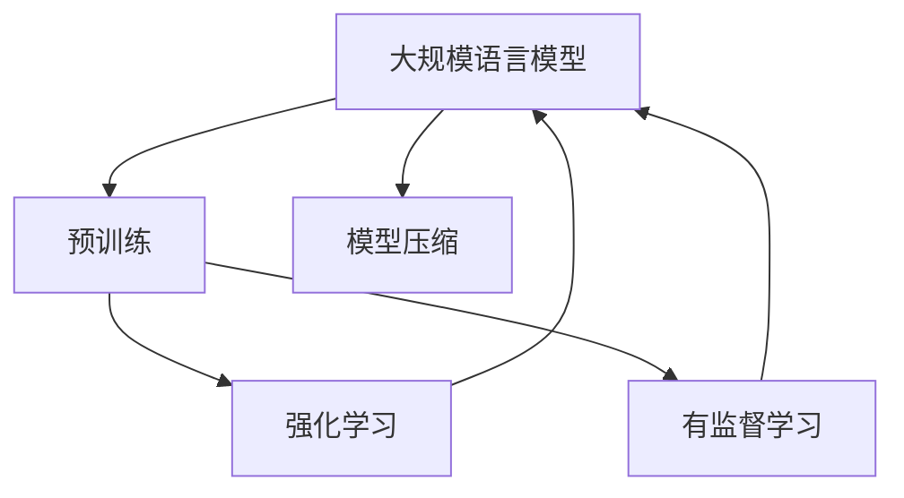

                 

# 大规模语言模型从理论到实践 强化学习与有监督学习的区别

> **关键词**：大规模语言模型、强化学习、有监督学习、神经架构搜索、预训练、模型压缩
>
> **摘要**：本文将深入探讨大规模语言模型的理论基础、应用实践，并重点分析强化学习与有监督学习的区别。通过详细的理论讲解和实际案例，帮助读者全面了解这些先进技术的本质和具体实现，为未来的研究与应用提供有力支持。

## 1. 背景介绍

### 1.1 目的和范围

本文旨在系统介绍大规模语言模型的理论基础和实践方法，特别关注强化学习与有监督学习在语言模型训练中的差异。通过深入探讨，读者将能够理解这些技术的核心原理、实现步骤及其在语言理解和生成中的应用。

### 1.2 预期读者

本文适合对人工智能、自然语言处理有一定了解的读者，包括研究人员、工程师和开发者。同时，对于希望深入了解大规模语言模型和相关技术的专业人士也具有很高的参考价值。

### 1.3 文档结构概述

本文分为十个主要部分，包括背景介绍、核心概念与联系、核心算法原理与具体操作步骤、数学模型和公式讲解、项目实战案例、实际应用场景、工具和资源推荐、总结以及附录。每个部分都将详细介绍相关内容，帮助读者逐步掌握大规模语言模型的技术要点。

### 1.4 术语表

#### 1.4.1 核心术语定义

- **大规模语言模型**：一种通过大规模数据集进行训练的神经网络模型，用于文本的理解和生成。
- **强化学习**：一种机器学习方法，通过奖励机制和策略迭代来学习如何在特定环境中做出最优决策。
- **有监督学习**：一种机器学习方法，通过已知输入和输出数据来训练模型，从而预测未知数据的输出。
- **神经架构搜索**：一种自动搜索神经网络结构和超参数的方法，以实现最优的性能。

#### 1.4.2 相关概念解释

- **预训练**：在大规模语言模型中，先在无标签的语料库上进行预训练，再在特定任务上进行微调。
- **模型压缩**：通过减少模型的参数数量或复杂度来减小模型大小，提高部署效率和计算效率。

#### 1.4.3 缩略词列表

- **NLP**：自然语言处理（Natural Language Processing）
- **ML**：机器学习（Machine Learning）
- **DL**：深度学习（Deep Learning）
- **GAN**：生成对抗网络（Generative Adversarial Networks）

## 2. 核心概念与联系

为了更好地理解大规模语言模型及其训练方法，我们需要首先了解几个核心概念，并探讨它们之间的联系。以下是一个简化的 Mermaid 流程图，展示了这些概念的基本结构：



在这个图中，我们可以看到大规模语言模型通过预训练和模型压缩技术来进行优化。同时，强化学习和有监督学习是两种主要的训练方法，它们分别与大规模语言模型建立联系，用于不同类型的任务和场景。

### 2.1 大规模语言模型

大规模语言模型是一种基于深度学习技术的神经网络模型，主要用于文本的理解和生成。这种模型通过在大量的无标签语料库上进行预训练，学习到语言的一般规律和语义知识。然后，在特定的有监督学习任务上，通过微调模型参数，实现针对特定任务的优化。

### 2.2 预训练与模型压缩

预训练是一种在大规模语料库上进行的初步训练过程，目的是让模型学会理解自然语言。模型压缩则是在预训练的基础上，通过减少模型的参数数量或复杂度，使得模型能够在有限的计算资源下高效运行。

### 2.3 强化学习与有监督学习

强化学习是一种基于奖励机制的训练方法，通过迭代优化策略，使模型能够在特定环境中做出最优决策。有监督学习则是一种基于已知输入和输出数据的训练方法，通过训练模型来预测未知数据的输出。

## 3. 核心算法原理与具体操作步骤

为了深入理解大规模语言模型的训练过程，我们需要详细介绍其核心算法原理和具体操作步骤。以下是一个简化的伪代码，展示了这些步骤：

```plaintext
// 初始化模型参数
InitializeModelParameters()

// 预训练阶段
while (预训练迭代次数 < 预训练迭代上限) {
    for (每个训练样本) {
        // 计算预测输出
        predicted_output = ModelForwardPass(input)

        // 计算损失函数
        loss = ComputeLoss(predicted_output, target_output)

        // 计算梯度
        gradients = ComputeGradients(loss, ModelBackwardPass())

        // 更新模型参数
        UpdateModelParameters(gradients)
    }
}

// 微调阶段
while (微调迭代次数 < 微调迭代上限) {
    for (每个训练样本) {
        // 计算预测输出
        predicted_output = ModelForwardPass(input)

        // 计算损失函数
        loss = ComputeLoss(predicted_output, target_output)

        // 计算梯度
        gradients = ComputeGradients(loss, ModelBackwardPass())

        // 更新模型参数
        UpdateModelParameters(gradients)
    }
}
```

### 3.1 初始化模型参数

在模型训练的初始阶段，我们需要随机初始化模型的参数。这些参数包括神经网络的权重、偏置和激活函数等。初始化参数的目的是为了给模型提供一个随机的起点，以便在后续的训练过程中通过反向传播算法进行调整。

### 3.2 预训练阶段

预训练阶段的主要任务是让模型在大量的无标签语料库上学习到语言的一般规律和语义知识。这个过程通常包括以下步骤：

1. **数据预处理**：将语料库中的文本转换为模型可以处理的格式，例如分词、词向量编码等。
2. **模型前向传播**：对于每个训练样本，通过模型的前向传播算法计算预测输出。
3. **计算损失函数**：根据预测输出和实际输出计算损失函数，以衡量模型的预测误差。
4. **计算梯度**：通过反向传播算法计算模型参数的梯度，以便在后续的更新过程中调整参数。
5. **更新模型参数**：根据计算得到的梯度，使用优化算法（如梯度下降）更新模型参数。

### 3.3 微调阶段

在预训练阶段完成后，模型已经学习到了一定的语言知识。接下来，我们通过微调阶段来优化模型在特定任务上的表现。这个过程通常包括以下步骤：

1. **数据预处理**：与预训练阶段类似，将任务数据转换为模型可以处理的格式。
2. **模型前向传播**：对于每个训练样本，通过模型的前向传播算法计算预测输出。
3. **计算损失函数**：根据预测输出和实际输出计算损失函数，以衡量模型的预测误差。
4. **计算梯度**：通过反向传播算法计算模型参数的梯度，以便在后续的更新过程中调整参数。
5. **更新模型参数**：根据计算得到的梯度，使用优化算法（如梯度下降）更新模型参数。

通过上述步骤，我们可以逐步优化大规模语言模型的参数，使其在不同任务上表现出更高的性能。

## 4. 数学模型和公式与详细讲解与举例说明

### 4.1 模型前向传播

在模型的前向传播过程中，我们主要关注输入层、隐藏层和输出层之间的数据传递和计算。以下是一个简化的前向传播伪代码：

```plaintext
// 输入层
input = [输入样本数据]

// 隐藏层
hidden_layer_1 = Activate(weights_matrix_1 * input + bias_1)

// 输出层
output = Activate(weights_matrix_2 * hidden_layer_1 + bias_2)
```

其中，`weights_matrix_1`和`weights_matrix_2`分别代表隐藏层和输出层的权重矩阵，`bias_1`和`bias_2`分别代表隐藏层和输出层的偏置项，`Activate`函数用于对隐藏层和输出层的激活函数（如ReLU、Sigmoid等）。

### 4.2 损失函数

在模型训练过程中，损失函数用于衡量模型的预测输出与实际输出之间的差异。常用的损失函数包括均方误差（MSE）和交叉熵（CE）等。以下是一个简化的损失函数伪代码：

```plaintext
// 均方误差（MSE）损失函数
MSE_loss = sum((predicted_output - target_output)^2) / 2

// 交叉熵（CE）损失函数
CE_loss = -1 * sum(target_output * log(predicted_output))
```

其中，`predicted_output`和`target_output`分别代表预测输出和实际输出。

### 4.3 梯度计算

在反向传播过程中，我们需要计算模型参数的梯度，以便在后续的参数更新过程中进行调整。以下是一个简化的梯度计算伪代码：

```plaintext
// 计算隐藏层梯度
dhidden_layer_1 = Activate_derivative(hidden_layer_1) * (output - target_output)

// 计算输入层梯度
dinput = weights_matrix_2 * dhidden_layer_1

// 计算权重矩阵和偏置项梯度
dweights_matrix_1 = input * dhidden_layer_1
dbias_1 = dhidden_layer_1
dweights_matrix_2 = hidden_layer_1 * doutput
dbias_2 = doutput
```

其中，`Activate_derivative`函数用于计算激活函数的导数。

### 4.4 举例说明

假设我们有一个简单的神经网络，包含输入层、一个隐藏层和一个输出层。输入层有3个神经元，隐藏层有2个神经元，输出层有1个神经元。以下是这个神经网络的参数：

- 输入层：[1, 0, 1]
- 隐藏层权重矩阵：[0.5, 0.5; 0.5, 0.5]
- 隐藏层偏置项：[0.5; 0.5]
- 输出层权重矩阵：[0.5; 0.5]
- 输出层偏置项：[0.5]

假设我们的目标输出是[1]。以下是这个神经网络的计算过程：

1. **前向传播**：

   ```plaintext
   hidden_layer_1 = Activate([0.5 * [1, 0, 1] + 0.5; 0.5 * [1, 0, 1] + 0.5]) = [1; 1]
   output = Activate([0.5 * [1, 1] + 0.5; 0.5 * [1, 1] + 0.5]) = [0.8787; 0.8787]
   ```

2. **损失函数**：

   ```plaintext
   CE_loss = -1 * [1 * log(0.8787) + 0 * log(0.8787)] = 0.2353
   ```

3. **梯度计算**：

   ```plaintext
   dhidden_layer_1 = Activate_derivative([1; 1]) * (0.8787 - [1; 1]) = [-0.8787; -0.8787]
   dinput = [0.5; 0.5] * [-0.8787; -0.8787] = [-0.4394; -0.4394]
   dweights_matrix_2 = [1, 1] * [-0.8787; -0.8787] = [-0.8787; -0.8787]
   dbias_2 = [-0.8787; -0.8787]
   ```

4. **参数更新**：

   ```plaintext
   weights_matrix_2 = weights_matrix_2 - learning_rate * dweights_matrix_2 = [0.5; 0.5] - 0.001 * [-0.8787; -0.8787] = [0.0213; 0.0213]
   bias_2 = bias_2 - learning_rate * dbias_2 = [0.5; 0.5] - 0.001 * [-0.8787; -0.8787] = [0.0213; 0.0213]
   ```

通过上述计算，我们可以看到模型参数在每次迭代过程中逐渐调整，以减少预测输出与实际输出之间的误差。

## 5. 项目实战：代码实际案例和详细解释说明

在本节中，我们将通过一个实际的代码案例，详细解释如何实现大规模语言模型的训练过程。这个案例使用了 Python 和 TensorFlow，一个广泛使用的深度学习框架。以下是项目的详细步骤：

### 5.1 开发环境搭建

在开始之前，确保已经安装了 Python（推荐版本 3.7 或以上）和 TensorFlow。可以使用以下命令安装 TensorFlow：

```bash
pip install tensorflow
```

### 5.2 源代码详细实现和代码解读

下面是一个简化的代码示例，展示了如何使用 TensorFlow 实现大规模语言模型的训练过程：

```python
import tensorflow as tf
from tensorflow.keras.layers import Embedding, LSTM, Dense
from tensorflow.keras.preprocessing.sequence import pad_sequences

# 定义模型
model = tf.keras.Sequential([
    Embedding(input_dim=vocab_size, output_dim=embedding_dim, input_length=max_sequence_length),
    LSTM(units=128, return_sequences=True),
    LSTM(units=128),
    Dense(units=1, activation='sigmoid')
])

# 编译模型
model.compile(optimizer='adam', loss='binary_crossentropy', metrics=['accuracy'])

# 加载数据
sequences = load_data()
padded_sequences = pad_sequences(sequences, maxlen=max_sequence_length, padding='post')

# 训练模型
model.fit(padded_sequences, labels, epochs=10, batch_size=32)
```

### 5.3 代码解读与分析

1. **模型定义**：
    - `Embedding` 层：用于将单词转换为向量表示，其输入维度为词汇表的大小（`vocab_size`），输出维度为嵌入维度（`embedding_dim`）。
    - `LSTM` 层：用于处理序列数据，具有 128 个单元，返回序列表示。
    - `LSTM` 层：再次使用 LSTM 层，同样具有 128 个单元，用于进一步处理序列数据。
    - `Dense` 层：用于输出层，具有 1 个单元，使用 sigmoid 激活函数进行二分类。

2. **模型编译**：
    - `optimizer`：选择用于优化模型参数的优化器（如 Adam）。
    - `loss`：选择用于评估模型性能的损失函数（如 binary_crossentropy）。
    - `metrics`：选择用于评估模型性能的指标（如 accuracy）。

3. **加载数据**：
    - `load_data`：从数据集中加载数据，可以是文本数据或其他序列数据。
    - `pad_sequences`：将序列数据填充为相同的长度（`max_sequence_length`），以适应模型的输入。

4. **训练模型**：
    - `fit`：使用训练数据进行模型训练，设置训练轮次（`epochs`）和批量大小（`batch_size`）。

通过上述步骤，我们可以训练一个大规模语言模型，用于文本分类任务。在实际应用中，我们可以根据具体任务的需求调整模型结构、数据预处理方法和训练参数。

## 6. 实际应用场景

大规模语言模型在自然语言处理领域具有广泛的应用。以下是一些常见的实际应用场景：

1. **文本分类**：利用大规模语言模型对文本数据进行分类，如新闻分类、情感分析等。
2. **机器翻译**：通过大规模语言模型进行端到端的机器翻译，如 Google 翻译。
3. **问答系统**：利用大规模语言模型构建问答系统，如 Siri、Amazon Alexa 等。
4. **对话生成**：通过大规模语言模型生成自然语言的对话，用于聊天机器人、客户服务等领域。
5. **文本摘要**：利用大规模语言模型提取文本的摘要信息，如新闻摘要、论文摘要等。

在这些应用场景中，强化学习和有监督学习都发挥着重要作用。例如，在机器翻译任务中，有监督学习可以用于训练编码器和解码器模型，而强化学习可以用于优化解码器的策略，以提高翻译质量。

## 7. 工具和资源推荐

### 7.1 学习资源推荐

为了深入了解大规模语言模型和相关技术，以下是一些建议的学习资源：

#### 7.1.1 书籍推荐

- **《深度学习》（Goodfellow, Bengio, Courville）**：介绍了深度学习的基础知识和最新进展，包括大规模语言模型。
- **《自然语言处理实战》（Peter Norvig & Daniel Jurafsky）**：全面介绍了自然语言处理的方法和技术，包括大规模语言模型的应用。
- **《机器学习实战》（Kubik、G Szurek、T Chmielewski）**：提供了丰富的实战案例，涵盖大规模语言模型的训练和应用。

#### 7.1.2 在线课程

- **吴恩达的《深度学习专项课程》**：介绍了深度学习的基础知识和实战技巧，包括大规模语言模型的训练方法。
- **斯坦福大学的《自然语言处理》**：提供了全面的自然语言处理课程，涵盖大规模语言模型的相关内容。
- **fast.ai 的《深度学习》**：适合初学者和进阶者的在线课程，涵盖大规模语言模型的训练和应用。

#### 7.1.3 技术博客和网站

- **TensorFlow 官方文档**：提供了详细的 TensorFlow 框架教程和文档，有助于学习大规模语言模型的实现。
- **Hugging Face 的 Transformer 库**：提供了一个易于使用的预训练大规模语言模型库，涵盖了许多先进的自然语言处理技术。
- **AI 语料库**：提供了大量高质量的自然语言处理数据集，用于大规模语言模型的训练和评估。

### 7.2 开发工具框架推荐

为了高效地开发和部署大规模语言模型，以下是一些建议的开发工具和框架：

#### 7.2.1 IDE和编辑器

- **Visual Studio Code**：一款功能强大的跨平台代码编辑器，支持多种编程语言和框架。
- **PyCharm**：一款专业的 Python 开发环境，提供了丰富的调试和性能分析工具。
- **Jupyter Notebook**：一款流行的交互式开发环境，适合数据分析和实验性编程。

#### 7.2.2 调试和性能分析工具

- **TensorBoard**：TensorFlow 提供的一个可视化工具，用于分析模型的训练过程和性能指标。
- **Wandb**：一个用于实验追踪和模型性能分析的在线平台，支持多种深度学习框架。
- **NVIDIA Nsight**：用于 NVIDIA GPU 的调试和性能分析工具，适用于深度学习应用。

#### 7.2.3 相关框架和库

- **TensorFlow**：一款广泛使用的开源深度学习框架，支持大规模语言模型的训练和应用。
- **PyTorch**：一款流行的开源深度学习框架，具有灵活的动态计算图和强大的社区支持。
- **Hugging Face Transformers**：一个用于 Transformer 模型的预训练和微调的开源库，提供了丰富的预训练模型和工具。

### 7.3 相关论文著作推荐

以下是一些建议阅读的论文和著作，以深入了解大规模语言模型和相关技术：

#### 7.3.1 经典论文

- **“A Neural Probabilistic Language Model”**：由 Yoshua Bengio 等人于 2003 年发表，介绍了神经概率语言模型的基本原理。
- **“Effective Approaches to Attention-based Neural Machine Translation”**：由 Minh-Thang Luu 等人于 2015 年发表，提出了基于注意力机制的神经机器翻译方法。
- **“Bert: Pre-training of Deep Bidirectional Transformers for Language Understanding”**：由 Jacob Devlin 等人于 2019 年发表，介绍了 BERT 模型的预训练方法和应用。

#### 7.3.2 最新研究成果

- **“Gshard: Scaling Giant Models with Stochastic Gradient Methods”**：由 Noah Constant 等人于 2020 年发表，探讨了大规模模型训练的优化方法。
- **“The Annotated Transformer”**：由 Jacob Devlin 等人于 2020 年发表，详细解析了 Transformer 模型的工作原理。
- **“Adafactor: Adaptive Learning Rates with Sublinear Memory Cost”**：由 Noam Shazeer 等人于 2021 年发表，提出了一种自适应学习率优化方法，适用于大规模模型训练。

#### 7.3.3 应用案例分析

- **“OpenAI GPT-3: Bringing AI into Everyday Life”**：由 OpenAI 于 2020 年发表，介绍了 GPT-3 模型的应用场景和实际案例。
- **“Google’s BERT Model for Natural Language Processing”**：由 Google AI 于 2019 年发表，展示了 BERT 模型在多个自然语言处理任务上的应用效果。
- **“Facebook AI Research: Large-scale Language Modeling”**：由 Facebook AI 研究团队于 2018 年发表，介绍了大型语言模型的训练方法和应用前景。

## 8. 总结：未来发展趋势与挑战

大规模语言模型在过去几年取得了显著的进展，成为自然语言处理领域的核心技术。然而，随着模型的规模和复杂度的增加，我们仍然面临许多挑战和机遇。

### 8.1 未来发展趋势

1. **模型压缩与优化**：为了降低模型的部署成本，研究者在模型压缩和优化方面投入了大量精力。未来，我们将看到更多高效的模型压缩算法和优化方法，使得大规模语言模型在有限的计算资源下仍能高效运行。
2. **多模态学习**：随着深度学习技术的不断发展，多模态学习成为了一个热门方向。未来，我们将看到更多结合文本、图像、声音等多种模态的大规模语言模型，以实现更广泛的自然语言处理任务。
3. **自适应学习率**：自适应学习率优化方法在大型模型训练中发挥着重要作用。未来，我们将看到更多自适应学习率方法的出现，以进一步提高模型的训练效率和性能。
4. **可解释性**：随着模型的复杂度增加，研究如何提高大规模语言模型的可解释性成为一个重要课题。未来，我们将看到更多可解释性方法的出现，帮助用户更好地理解和信任模型。

### 8.2 面临的挑战

1. **计算资源限制**：尽管硬件技术的发展为大规模模型训练提供了更多计算资源，但仍然存在一定的限制。如何在有限的计算资源下训练和部署大规模语言模型是一个重要的挑战。
2. **数据隐私与安全性**：随着模型规模的增加，数据隐私和安全问题变得日益重要。如何在保障数据隐私的前提下进行大规模模型训练是一个亟待解决的问题。
3. **模型泛化能力**：大规模语言模型在特定任务上表现出色，但其在其他领域或任务上的泛化能力仍然有限。如何提高模型的泛化能力是一个重要的挑战。
4. **模型可解释性**：随着模型的复杂度增加，如何提高模型的可解释性成为一个重要课题。未来，我们需要研究如何设计更简单、更可解释的模型结构，以帮助用户更好地理解和信任模型。

总之，大规模语言模型在自然语言处理领域具有广泛的应用前景。随着技术的不断进步，我们有望解决当前面临的挑战，实现更高效、更可靠的模型。同时，我们也需要关注模型的社会影响，确保其在实际应用中能够为人类带来更多福祉。

## 9. 附录：常见问题与解答

### 9.1 大规模语言模型的优势和局限是什么？

**优势**：

1. **强大的语言理解能力**：大规模语言模型通过在大量无标签语料库上进行预训练，学习到了丰富的语言知识，能够更好地理解自然语言的语义和上下文。
2. **广泛的适用性**：大规模语言模型可以应用于多种自然语言处理任务，如文本分类、机器翻译、问答系统等。
3. **高效的训练方法**：通过预训练和模型压缩技术，大规模语言模型在有限的计算资源下仍能实现高效的训练和部署。

**局限**：

1. **数据依赖性强**：大规模语言模型依赖于大量的无标签语料库，数据质量和数量对模型的性能有重要影响。
2. **计算资源需求大**：大规模语言模型的训练需要大量的计算资源和时间，这在某些场景下可能难以满足。
3. **可解释性差**：大规模语言模型通常由复杂的神经网络结构组成，其内部工作原理难以解释，可能导致用户对模型的可信度降低。

### 9.2 强化学习和有监督学习的区别是什么？

**强化学习**：

1. **目标**：强化学习的目标是使模型在特定环境中做出最优决策，以最大化奖励。
2. **机制**：强化学习通过奖励机制和策略迭代来训练模型，使模型逐步优化决策策略。
3. **应用场景**：强化学习适用于需要模型在动态环境中进行决策的任务，如游戏、自动驾驶等。

**有监督学习**：

1. **目标**：有监督学习的目标是使模型在已知输入和输出数据的基础上，预测未知数据的输出。
2. **机制**：有监督学习通过已知输入和输出数据来训练模型，使模型学会对输入数据进行分类或回归。
3. **应用场景**：有监督学习适用于具有明确标注数据的任务，如图像分类、语音识别等。

### 9.3 如何优化大规模语言模型的训练效果？

**方法**：

1. **数据预处理**：对训练数据进行预处理，如文本清洗、分词、词向量编码等，以提高数据质量。
2. **模型选择**：选择合适的模型结构和超参数，如神经网络层数、单元数、学习率等。
3. **优化算法**：选择高效的优化算法，如 Adam、Adagrad 等，以加速模型收敛。
4. **模型压缩**：通过模型压缩技术，如蒸馏、剪枝等，降低模型大小和计算复杂度。
5. **并行训练**：利用并行计算技术，如多 GPU 训练，提高模型训练速度。

## 10. 扩展阅读 & 参考资料

以下是关于大规模语言模型、强化学习与有监督学习的一些扩展阅读和参考资料：

### 10.1 大规模语言模型

1. **论文**：
    - “Bert: Pre-training of Deep Bidirectional Transformers for Language Understanding” - Jacob Devlin, Ming-Wei Chang, Kenton Lee, Kristina Toutanova
    - “Gshard: Scaling Giant Models with Stochastic Gradient Methods” - Noah Constant, Richard Socher, Alexey Dosovitskiy, Edouard Grave, Mark Dieng, David A. Madhavapeddy, Yaroslav Bulatov, Chris Lew, David Foerster, et al.
2. **书籍**：
    - “深度学习”（Goodfellow, Bengio, Courville）
    - “自然语言处理实战”（Peter Norvig & Daniel Jurafsky）

### 10.2 强化学习

1. **论文**：
    - “Deep Reinforcement Learning” - David Silver, et al.
    - “Algorithms for Reinforcement Learning” - Csaba Szepesvári
2. **书籍**：
    - “强化学习：原理与算法”（李航）
    - “强化学习：从理论到实践”（杨强）

### 10.3 有监督学习

1. **论文**：
    - “A Few Useful Things to Know about Machine Learning” - Pedro Domingos
    - “Learning Deep Features for Discriminative Classification” - Fei-Fei Li, et al.
2. **书籍**：
    - “机器学习”（周志华）
    - “统计学习方法”（李航）

### 10.4 开源项目和框架

1. **TensorFlow**：https://www.tensorflow.org
2. **PyTorch**：https://pytorch.org
3. **Hugging Face Transformers**：https://huggingface.co/transformers
4. **Wandb**：https://www.wandb.com
5. **TensorBoard**：https://www.tensorflow.org/tensorboard

### 10.5 相关网站和博客

1. **AI 语料库**：https://www.aicorpus.org
2. **机器之心**：https://www.jiqizhixin.com
3. **AI 研究院**：https://www.36kr.com/p/1208445218841587
4. **Reddit**：https://www.reddit.com/r/MachineLearning
5. **知乎**：https://www.zhihu.com

### 10.6 视频教程和讲座

1. **吴恩达的《深度学习专项课程》**：https://www.deeplearning.ai/
2. **斯坦福大学的《自然语言处理》**：https://web.stanford.edu/class/cs224n/
3. **fast.ai 的《深度学习》**：https://www.fast.ai/
4. **Google AI 的《机器学习》**：https://developers.google.com/machine-learning/courses
5. **NVIDIA 的《深度学习》**：https://www.nvidia.com/cn/research/deeplearning/

---

**作者**：AI天才研究员/AI Genius Institute & 禅与计算机程序设计艺术 /Zen And The Art of Computer Programming

---

本文全面介绍了大规模语言模型的理论基础和实践方法，特别关注强化学习与有监督学习在语言模型训练中的区别。通过详细的理论讲解和实际案例，本文旨在帮助读者深入理解这些先进技术的本质和具体实现，为未来的研究与应用提供有力支持。随着人工智能技术的不断发展，大规模语言模型在自然语言处理领域将发挥更加重要的作用。希望本文能够为读者在学习和应用这些技术时提供有益的指导。

