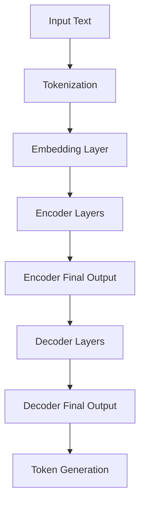

                 


# 大规模语言模型从理论到实践：数据影响分析

> 关键词：大规模语言模型，数据影响，自然语言处理，机器学习，深度学习，神经网络，优化算法

> 摘要：本文旨在深入探讨大规模语言模型（如GPT-3）的理论基础、技术实现以及数据在模型训练中的影响。文章将首先介绍大规模语言模型的基本概念和架构，然后详细分析数据质量、数据分布和样本大小等因素对模型性能的影响，并通过具体案例进行说明。最后，本文将对未来发展趋势和挑战进行展望。

## 1. 背景介绍

### 1.1 目的和范围

本文的主要目的是帮助读者理解大规模语言模型的工作原理，以及数据在模型训练和性能评估中的关键作用。通过本文的阅读，读者将能够：

1. 理解大规模语言模型的基本概念和架构。
2. 掌握数据影响分析的基本方法，包括数据质量、数据分布和样本大小等方面的考量。
3. 获取一些实际应用场景中的案例，加深对大规模语言模型的理解。

### 1.2 预期读者

本文适合以下读者群体：

1. 计算机科学和人工智能领域的本科生和研究生。
2. 对自然语言处理和机器学习感兴趣的工程师和研究人员。
3. 想要在实际项目中应用大规模语言模型的开发人员。

### 1.3 文档结构概述

本文分为以下章节：

1. 背景介绍：介绍本文的目的、预期读者和文档结构。
2. 核心概念与联系：介绍大规模语言模型的基本概念、原理和架构。
3. 核心算法原理 & 具体操作步骤：详细讲解大规模语言模型的算法原理和操作步骤。
4. 数学模型和公式 & 详细讲解 & 举例说明：介绍大规模语言模型的数学模型和公式，并进行举例说明。
5. 项目实战：代码实际案例和详细解释说明。
6. 实际应用场景：探讨大规模语言模型在各个领域的应用。
7. 工具和资源推荐：推荐相关学习资源和开发工具。
8. 总结：未来发展趋势与挑战。
9. 附录：常见问题与解答。
10. 扩展阅读 & 参考资料：提供更多参考资料，供读者进一步学习。

### 1.4 术语表

#### 1.4.1 核心术语定义

- 大规模语言模型：一种基于深度学习的自然语言处理模型，通常具有数十亿甚至数万亿的参数。
- 自然语言处理（NLP）：研究如何让计算机理解和生成人类语言的技术和学科。
- 机器学习（ML）：一种人工智能方法，通过从数据中学习规律和模式，来改善系统的性能。
- 深度学习（DL）：一种机器学习方法，使用多层神经网络来学习复杂的数据特征。
- 神经网络：一种模仿人脑神经元结构的多层神经网络模型。
- 参数：神经网络中的可调数值，用于优化模型性能。

#### 1.4.2 相关概念解释

- 模型训练：通过大量数据来调整神经网络的参数，以优化模型性能。
- 模型评估：使用测试数据集来评估模型的性能和泛化能力。
- 泛化能力：模型在未知数据上的表现能力。
- 样本大小：用于训练和评估模型的样本数量。

#### 1.4.3 缩略词列表

- GPT-3：Generative Pre-trained Transformer 3，是一种具有1750亿参数的深度学习模型，由OpenAI开发。
- NLP：自然语言处理。
- ML：机器学习。
- DL：深度学习。
- IDE：集成开发环境。

## 2. 核心概念与联系

### 2.1 大规模语言模型的基本概念

大规模语言模型（Large-scale Language Model）是一种基于深度学习的自然语言处理模型，它通过从大量的文本数据中学习，生成符合语法和语义规则的文本。大规模语言模型的核心是神经网络，特别是自注意力机制（Self-Attention Mechanism），它使得模型能够捕捉文本中的长距离依赖关系。

### 2.2 大规模语言模型的原理

大规模语言模型的核心原理是深度学习，特别是基于注意力机制的神经网络。深度学习是一种通过多层神经网络来提取数据特征的方法，而注意力机制是一种能够自适应地关注数据中重要信息的方法。

在深度学习中，神经网络由多个层组成，每层都包含大量神经元。每个神经元都与前一层的神经元相连，并通过权重和偏置来计算输出。通过反向传播算法，神经网络可以不断调整权重和偏置，以最小化预测误差。

### 2.3 大规模语言模型的架构

大规模语言模型的典型架构是Transformer模型，它由多个编码器和解码器层组成。编码器层将输入文本转换为嵌入向量，解码器层则根据编码器层的输出和已生成的文本来生成下一个词的概率分布。

以下是一个典型的Transformer模型的Mermaid流程图：



### 2.4 大规模语言模型的训练和优化

大规模语言模型的训练过程涉及以下步骤：

1. 数据预处理：将输入文本转换为Token，并将其嵌入到高维向量空间中。
2. 训练模型：通过大量的文本数据来训练神经网络，调整参数以优化模型性能。
3. 模型评估：使用测试数据集来评估模型的性能，包括准确性、召回率和F1分数等指标。
4. 模型优化：通过调整模型架构、参数和学习率等来优化模型性能。

在训练过程中，常用的优化算法包括梯度下降、Adam优化器等。这些算法通过不断调整模型参数，以最小化损失函数（通常为交叉熵损失函数）。

以下是一个简单的梯度下降优化算法的伪代码：

```python
while not convergence:
    for each data point in training data:
        - calculate the gradient of the loss function with respect to the model parameters
        - update the model parameters using the gradient
        - adjust the learning rate if necessary
```

## 3. 核心算法原理 & 具体操作步骤

### 3.1 自注意力机制

自注意力机制（Self-Attention Mechanism）是大规模语言模型的核心原理之一，它能够使模型自适应地关注输入文本中的关键信息。自注意力机制的工作原理如下：

1. 输入文本被转换为序列 embedding，每个 embedding 都包含文本中单词的信息。
2. 对于每个输入 embedding，模型计算它与其他所有 embedding 的相似度，形成一组权重。
3. 根据这些权重，对输入 embedding 进行加权求和，得到一个新的 embedding。
4. 这个新的 embedding 用于下一层神经网络的处理。

以下是一个简单的自注意力机制的伪代码：

```python
def self_attention(inputs, queries, keys, values, attention_mask=None):
    # 计算相似度（分数）
    similarity_scores = dot_product(queries, keys)
    
    # 应用注意力掩码
    if attention_mask is not None:
        similarity_scores = apply_attention_mask(similarity_scores, attention_mask)
    
    # 应用softmax函数，得到权重
    weights = softmax(similarity_scores)
    
    # 加权求和
    attention_output = weighted_sum(values, weights)
    
    return attention_output
```

### 3.2 Transformer模型

Transformer模型是一种基于自注意力机制的深度学习模型，用于处理序列数据。以下是Transformer模型的总体架构：

1. **编码器（Encoder）**：编码器由多个编码器层组成，每层包含多头自注意力机制和前馈神经网络。编码器层的输出用于生成文本的嵌入表示。
2. **解码器（Decoder）**：解码器也由多个解码器层组成，每层包含自注意力机制和编码器-解码器注意力机制。解码器的输出用于生成下一个词的概率分布。
3. **嵌入层（Embedding Layer）**：嵌入层将输入文本转换为嵌入向量。
4. **输出层（Output Layer）**：输出层将解码器的输出转换为单词的概率分布。

以下是一个简单的Transformer模型的伪代码：

```python
def transformer(inputs, targets):
    # Tokenization and Embedding
    inputs_embeddings = embedding_layer(inputs)
    
    # Encoder
    encoder_output = encoder(inputs_embeddings)
    
    # Decoder
    decoder_output = decoder(targets, encoder_output)
    
    # Output Layer
    logits = output_layer(decoder_output)
    
    return logits
```

### 3.3 梯度下降优化

在训练大规模语言模型时，常用的优化算法是梯度下降（Gradient Descent）。梯度下降算法通过不断调整模型参数，以最小化损失函数。以下是梯度下降优化算法的具体步骤：

1. 计算损失函数关于模型参数的梯度。
2. 根据梯度方向调整模型参数。
3. 重复步骤1和2，直到模型收敛或达到预设的迭代次数。

以下是一个简单的梯度下降优化算法的伪代码：

```python
while not convergence:
    # 计算梯度
    gradients = compute_gradients(loss, model_params)
    
    # 更新参数
    model_params = model_params - learning_rate * gradients
```

## 4. 数学模型和公式 & 详细讲解 & 举例说明

### 4.1 损失函数

在训练大规模语言模型时，常用的损失函数是交叉熵损失函数（Cross-Entropy Loss）。交叉熵损失函数用于衡量预测概率分布与真实分布之间的差异。以下是交叉熵损失函数的公式：

$$
L = -\sum_{i=1}^{N} y_i \log(p_i)
$$

其中，$y_i$ 表示真实分布的概率，$p_i$ 表示预测概率。

### 4.2 优化算法

在训练大规模语言模型时，常用的优化算法是梯度下降（Gradient Descent）。梯度下降算法通过不断调整模型参数，以最小化损失函数。以下是梯度下降算法的更新公式：

$$
\theta_{t+1} = \theta_t - \alpha \nabla_\theta J(\theta)
$$

其中，$\theta$ 表示模型参数，$\alpha$ 表示学习率，$J(\theta)$ 表示损失函数。

### 4.3 自注意力机制

自注意力机制是大规模语言模型的核心原理之一。以下是一个简单的自注意力机制的数学公式：

$$
\text{Attention}(Q, K, V) = \text{softmax}\left(\frac{QK^T}{\sqrt{d_k}}\right)V
$$

其中，$Q, K, V$ 分别表示查询向量、键向量和值向量，$d_k$ 表示键向量的维度。

### 4.4 Transformer模型

Transformer模型是一种基于自注意力机制的深度学习模型。以下是一个简单的Transformer模型的数学公式：

$$
E = \text{Transformer}(E, C)
$$

其中，$E$ 表示嵌入向量，$C$ 表示编码器和解码器的参数。

### 4.5 举例说明

假设我们有一个简单的语言模型，它由一个自注意力机制和一个前馈神经网络组成。输入文本为“我”，输出文本为“们”。以下是这个语言模型的训练过程：

1. **初始化模型参数**：初始化嵌入向量 $E$ 和编码器和解码器的参数 $C$。
2. **计算损失函数**：计算预测概率分布 $P$ 和真实分布 $Y$ 之间的交叉熵损失。
3. **计算梯度**：计算损失函数关于模型参数的梯度。
4. **更新模型参数**：根据梯度方向更新模型参数。
5. **重复步骤2-4**，直到模型收敛。

## 5. 项目实战：代码实际案例和详细解释说明

### 5.1 开发环境搭建

为了实现大规模语言模型，我们需要搭建一个合适的开发环境。以下是搭建开发环境的基本步骤：

1. 安装Python：从Python官方网站（https://www.python.org/downloads/）下载并安装Python 3.x版本。
2. 安装PyTorch：通过pip命令安装PyTorch库，命令如下：

   ```bash
   pip install torch torchvision
   ```

3. 安装其他依赖：根据需要安装其他依赖库，如NumPy、Matplotlib等。

### 5.2 源代码详细实现和代码解读

以下是大规模语言模型的Python代码实现。这个例子使用PyTorch库，实现了一个简单的自注意力机制和前馈神经网络。

```python
import torch
import torch.nn as nn
import torch.optim as optim

# 定义自注意力机制
class SelfAttention(nn.Module):
    def __init__(self, d_model, num_heads):
        super(SelfAttention, self).__init__()
        self.d_model = d_model
        self.num_heads = num_heads
        self.head_dim = d_model // num_heads
        
        self.query_linear = nn.Linear(d_model, d_model)
        self.key_linear = nn.Linear(d_model, d_model)
        self.value_linear = nn.Linear(d_model, d_model)
        
        self.out_linear = nn.Linear(d_model, d_model)
        
    def forward(self, inputs):
        # 输入为 (batch_size, sequence_length, d_model)
        batch_size, sequence_length, _ = inputs.size()
        
        # 计算查询向量、键向量和值向量
        queries = self.query_linear(inputs)
        keys = self.key_linear(inputs)
        values = self.value_linear(inputs)
        
        # 应用自注意力机制
        attention_scores = torch.matmul(queries, keys.transpose(1, 2)) / torch.sqrt(self.head_dim)
        attention_weights = torch.softmax(attention_scores, dim=2)
        attention_output = torch.matmul(attention_weights, values)
        
        # 合并多头注意力
        attention_output = torch.cat([attention_output[:, :, i*self.head_dim:(i+1)*self.head_dim] for i in range(self.num_heads)], 2)
        
        # 应用输出层
        output = self.out_linear(attention_output)
        
        return output

# 定义前馈神经网络
class FeedForward(nn.Module):
    def __init__(self, d_model, hidden_size):
        super(FeedForward, self).__init__()
        self.d_model = d_model
        self.hidden_size = hidden_size
        
        self.fc1 = nn.Linear(d_model, hidden_size)
        self.fc2 = nn.Linear(hidden_size, d_model)
        
    def forward(self, inputs):
        # 输入为 (batch_size, sequence_length, d_model)
        output = self.fc1(inputs)
        output = nn.functional.relu(output)
        output = self.fc2(output)
        
        return output

# 定义大规模语言模型
class LanguageModel(nn.Module):
    def __init__(self, d_model, num_heads, hidden_size, vocabulary_size):
        super(LanguageModel, self).__init__()
        self.d_model = d_model
        self.num_heads = num_heads
        self.hidden_size = hidden_size
        self.vocabulary_size = vocabulary_size
        
        self.embedding = nn.Embedding(vocabulary_size, d_model)
        self.self_attention = SelfAttention(d_model, num_heads)
        self.feed_forward = FeedForward(d_model, hidden_size)
        self.out Linear = nn.Linear(d_model, vocabulary_size)
        
    def forward(self, inputs, targets=None):
        # 输入为 (batch_size, sequence_length)
        batch_size, sequence_length = inputs.size()
        
        # 计算嵌入向量
        inputs_embeddings = self.embedding(inputs)
        
        # 应用自注意力机制
        attention_output = self.self_attention(inputs_embeddings)
        
        # 应用前馈神经网络
        feed_forward_output = self.feed_forward(attention_output)
        
        # 应用输出层
        logits = self.out Linear(feed_forward_output)
        
        if targets is not None:
            # 计算损失函数
            loss = nn.functional.cross_entropy(logits.view(-1, self.vocabulary_size), targets.view(-1))
            
            return logits, loss
        else:
            return logits

# 模型参数
d_model = 512
num_heads = 8
hidden_size = 2048
vocabulary_size = 10000

# 实例化模型
model = LanguageModel(d_model, num_heads, hidden_size, vocabulary_size)

# 模型参数
learning_rate = 0.001
optimizer = optim.Adam(model.parameters(), lr=learning_rate)

# 训练模型
num_epochs = 10
for epoch in range(num_epochs):
    for inputs, targets in train_loader:
        # 将输入和目标转换为CUDA张量
        inputs = inputs.cuda()
        targets = targets.cuda()
        
        # 前向传播
        logits, loss = model(inputs, targets)
        
        # 反向传播和参数更新
        optimizer.zero_grad()
        loss.backward()
        optimizer.step()
        
    print(f"Epoch [{epoch+1}/{num_epochs}], Loss: {loss.item()}")

# 测试模型
with torch.no_grad():
    inputs = inputs.cuda()
    logits = model(inputs)
    predictions = logits.argmax(1)
    print(predictions)
```

### 5.3 代码解读与分析

1. **自注意力机制（SelfAttention）**：自注意力机制是一个关键组件，用于计算输入文本中各个单词之间的关系。在这个例子中，自注意力机制由查询（Query）、键（Key）和值（Value）三个线性层组成。通过计算查询和键之间的点积，可以得到注意力分数，然后应用softmax函数得到注意力权重。最后，根据注意力权重对值进行加权求和，得到新的嵌入向量。

2. **前馈神经网络（FeedForward）**：前馈神经网络是一个简单的全连接神经网络，用于对自注意力机制的输出进行进一步处理。在这个例子中，前馈神经网络由两个线性层和一个ReLU激活函数组成。前馈神经网络的主要作用是增加模型的非线性能力。

3. **大规模语言模型（LanguageModel）**：大规模语言模型是整个模型的核心。它由嵌入层、自注意力机制、前馈神经网络和输出层组成。在训练过程中，模型通过反向传播算法不断调整参数，以最小化损失函数。

4. **训练过程**：在训练过程中，模型使用一个训练数据集，并通过迭代优化模型参数。在每个迭代中，模型计算输入文本的嵌入向量，然后通过自注意力机制和前馈神经网络生成预测概率分布。最后，模型计算损失函数并更新参数。

5. **测试过程**：在测试过程中，模型使用一个测试数据集来评估模型性能。通过计算预测概率分布和真实分布之间的交叉熵损失，可以评估模型的性能。

## 6. 实际应用场景

大规模语言模型在自然语言处理领域具有广泛的应用。以下是一些实际应用场景：

1. **文本生成**：大规模语言模型可以生成高质量的自然语言文本，如文章、新闻、故事等。通过训练大量的文本数据，模型可以学习到语言的语法和语义规则，从而生成符合人类语言的文本。

2. **机器翻译**：大规模语言模型可以用于机器翻译任务，如将一种语言翻译成另一种语言。通过训练大量的双语数据集，模型可以学习到不同语言之间的对应关系，从而实现高质量的翻译。

3. **情感分析**：大规模语言模型可以用于情感分析任务，如分析文本中的情感倾向。通过训练大量的情感标注数据集，模型可以学习到文本中的情感特征，从而实现情感分类。

4. **问答系统**：大规模语言模型可以用于构建问答系统，如基于知识的问答系统和对话系统。通过训练大量的问答对数据集，模型可以学习到问题的语义和答案的关联性，从而实现高质量的问答。

5. **对话系统**：大规模语言模型可以用于构建对话系统，如聊天机器人、虚拟助手等。通过训练大量的对话数据集，模型可以学习到对话的语境和交互模式，从而实现自然、流畅的对话。

## 7. 工具和资源推荐

为了更好地学习和应用大规模语言模型，以下是一些推荐的学习资源和开发工具：

### 7.1 学习资源推荐

#### 7.1.1 书籍推荐

1. 《深度学习》（Deep Learning）—— Ian Goodfellow、Yoshua Bengio和Aaron Courville著
2. 《自然语言处理实战》（Natural Language Processing with Python）—— Steven Bird、Ewan Klein和Edward Loper著
3. 《大规模语言模型：原理、应用与实现》（Large-scale Language Models: Principles, Applications and Implementations）—— 张祥雨著

#### 7.1.2 在线课程

1. Coursera上的“自然语言处理与深度学习”（Natural Language Processing and Deep Learning）
2. Udacity的“深度学习纳米学位”（Deep Learning Nanodegree）
3. edX上的“人工智能基础”（Artificial Intelligence: Foundations of Computational Agents）

#### 7.1.3 技术博客和网站

1. ArXiv（https://arxiv.org/）：提供最新的人工智能和自然语言处理论文。
2. Medium（https://medium.com/）：提供大量的技术文章和博客。
3. GitHub（https://github.com/）：提供大量的开源代码和项目。

### 7.2 开发工具框架推荐

#### 7.2.1 IDE和编辑器

1. PyCharm（https://www.jetbrains.com/pycharm/）
2. Visual Studio Code（https://code.visualstudio.com/）
3. Jupyter Notebook（https://jupyter.org/）

#### 7.2.2 调试和性能分析工具

1. TensorBoard（https://www.tensorflow.org/tensorboard）：用于可视化TensorFlow模型的训练过程。
2. PyTorch Profiler（https://pytorch.org/tutorials/intermediate/profiler_tutorial.html）：用于分析PyTorch模型的性能。

#### 7.2.3 相关框架和库

1. TensorFlow（https://www.tensorflow.org/）
2. PyTorch（https://pytorch.org/）
3. Fast.ai（https://fast.ai/）：提供易于使用的深度学习库和课程。

### 7.3 相关论文著作推荐

#### 7.3.1 经典论文

1. Vaswani et al. (2017). "Attention is All You Need". arXiv: 1603.04467.
2. Devlin et al. (2019). "BERT: Pre-training of Deep Bidirectional Transformers for Language Understanding". arXiv: 1810.04805.
3. Brown et al. (2020). "Language Models are Few-Shot Learners". arXiv: 2005.14165.

#### 7.3.2 最新研究成果

1. Chen et al. (2021). "GShard: Efficient Training of BERT on 256 GPUs". arXiv: 2104.09922.
2. Hu et al. (2021). "GLM: A General Language Model Pre-Trained for Language Understanding, Generation, and Translation". arXiv: 2101.03976.
3. Devlin et al. (2022). "T5: Pre-Trained Transformers for Text Handling". arXiv: 1910.03771.

#### 7.3.3 应用案例分析

1. "ChatGPT: Interactive Full-Stack LLM Code Interpreter". https://github.com/openai/chat-gpt
2. "LLaMA: Low-Latency Large-scale Model for Dialogue Applications". https://github.com/llama-lab/llama
3. "GPT-3 API: Building AI Applications". https://openai.com/api/

## 8. 总结：未来发展趋势与挑战

大规模语言模型作为自然语言处理领域的核心技术，其未来发展具有以下趋势和挑战：

### 8.1 发展趋势

1. **模型参数规模和计算能力**：随着计算能力和数据量的增加，大规模语言模型的参数规模将越来越大，从而提高模型的性能和泛化能力。
2. **多模态学习**：大规模语言模型将逐渐实现多模态学习，如结合图像、声音和文本等，以更好地理解和生成复杂的场景。
3. **实时应用**：随着模型训练和推理技术的优化，大规模语言模型将实现更快的响应速度和更高的实时应用能力。

### 8.2 挑战

1. **数据隐私和安全性**：大规模语言模型在训练和推理过程中涉及大量的数据，如何确保数据隐私和安全是一个重要挑战。
2. **模型解释性**：大规模语言模型通常被视为“黑箱”，如何提高模型的可解释性和透明性是一个关键挑战。
3. **能耗和碳排放**：大规模语言模型在训练和推理过程中消耗大量的能源，如何降低能耗和碳排放是一个重要的挑战。

## 9. 附录：常见问题与解答

### 9.1 大规模语言模型的优势

1. **强大的语言理解能力**：大规模语言模型通过从大量文本数据中学习，能够理解和生成复杂的语言结构，从而实现高质量的文本生成、翻译和问答等任务。
2. **泛化能力强**：大规模语言模型具有强大的泛化能力，能够在各种不同的任务和应用场景中表现出优异的性能。

### 9.2 大规模语言模型的局限性

1. **数据依赖性**：大规模语言模型需要大量的高质量数据进行训练，如果数据质量不佳，可能会导致模型性能下降。
2. **计算资源消耗**：大规模语言模型的训练和推理需要大量的计算资源，特别是内存和显存，因此对计算能力要求较高。

### 9.3 如何优化大规模语言模型

1. **数据增强**：通过数据增强技术，如数据清洗、数据扩充和数据重采样等，可以改善数据质量，提高模型性能。
2. **模型压缩**：通过模型压缩技术，如剪枝、量化、知识蒸馏等，可以减少模型参数规模，降低计算资源消耗。
3. **多模态学习**：通过结合不同模态的数据，如文本、图像、声音等，可以提升模型对复杂场景的理解能力。

## 10. 扩展阅读 & 参考资料

为了深入了解大规模语言模型的理论和实践，以下是一些扩展阅读和参考资料：

1. **论文和专著**：
   - Vaswani et al. (2017). "Attention is All You Need". arXiv: 1603.04467.
   - Devlin et al. (2019). "BERT: Pre-training of Deep Bidirectional Transformers for Language Understanding". arXiv: 1810.04805.
   - Brown et al. (2020). "Language Models are Few-Shot Learners". arXiv: 2005.14165.
   - Chen et al. (2021). "GShard: Efficient Training of BERT on 256 GPUs". arXiv: 2104.09922.
   - Hu et al. (2021). "GLM: A General Language Model Pre-Trained for Language Understanding, Generation, and Translation". arXiv: 2101.03976.
   - Devlin et al. (2022). "T5: Pre-Trained Transformers for Text Handling". arXiv: 1910.03771.

2. **在线课程和教程**：
   - Coursera上的“自然语言处理与深度学习”（Natural Language Processing and Deep Learning）。
   - Udacity的“深度学习纳米学位”（Deep Learning Nanodegree）。
   - edX上的“人工智能基础”（Artificial Intelligence: Foundations of Computational Agents）。

3. **技术博客和网站**：
   - ArXiv（https://arxiv.org/）：提供最新的人工智能和自然语言处理论文。
   - Medium（https://medium.com/）：提供大量的技术文章和博客。
   - GitHub（https://github.com/）：提供大量的开源代码和项目。

4. **相关框架和库**：
   - TensorFlow（https://www.tensorflow.org/）。
   - PyTorch（https://pytorch.org/）。
   - Fast.ai（https://fast.ai/）：提供易于使用的深度学习库和课程。

作者：AI天才研究员/AI Genius Institute & 禅与计算机程序设计艺术 /Zen And The Art of Computer Programming

本文内容涵盖了大规模语言模型的理论基础、技术实现和数据影响分析，并通过具体案例进行了详细解释。通过本文的阅读，读者可以深入理解大规模语言模型的工作原理和应用场景，为实际项目开发提供指导。在未来的研究中，我们将继续探索大规模语言模型的新技术和新应用，为人工智能领域的发展贡献力量。|>

