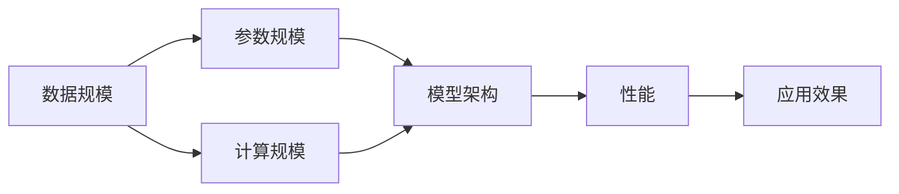

                 

# 大规模语言模型从理论到实践：数据规模探讨

> **关键词：** 大规模语言模型，数据规模，算法原理，实践应用，未来发展

> **摘要：** 本文将探讨大规模语言模型的数据规模问题，从背景介绍、核心概念、算法原理、数学模型、实战案例、应用场景等多个角度进行深入分析，旨在为读者提供全面的理解和实践指导。

## 1. 背景介绍

### 1.1 目的和范围

本文旨在深入探讨大规模语言模型中的数据规模问题，分析数据规模对于模型性能的影响，并探讨如何优化数据规模以提升模型效果。本文将涵盖以下几个方面：

1. 背景介绍：介绍大规模语言模型的起源、发展以及其在当前人工智能领域的重要地位。
2. 核心概念：阐述大规模语言模型的核心概念，包括数据规模、参数规模、计算规模等。
3. 算法原理：讲解大规模语言模型的算法原理，包括生成式模型、判别式模型、自回归模型等。
4. 数学模型：介绍大规模语言模型中的数学模型，包括损失函数、优化算法等。
5. 实战案例：通过具体案例，展示如何在实际项目中应用大规模语言模型，并分析其性能表现。
6. 应用场景：探讨大规模语言模型在不同领域中的应用，包括自然语言处理、机器翻译、文本生成等。
7. 未来发展：分析大规模语言模型在未来人工智能领域的发展趋势和面临的挑战。

### 1.2 预期读者

本文面向具有一定人工智能基础知识的读者，包括计算机科学、人工智能、自然语言处理等领域的研究人员、工程师和学生。通过本文的阅读，读者可以了解大规模语言模型的数据规模问题，掌握相关理论和实践方法，为后续研究和应用奠定基础。

### 1.3 文档结构概述

本文将分为以下几个部分：

1. **背景介绍**：介绍大规模语言模型的起源、发展以及其在当前人工智能领域的重要地位。
2. **核心概念与联系**：阐述大规模语言模型的核心概念，包括数据规模、参数规模、计算规模等，并使用Mermaid流程图展示模型架构。
3. **核心算法原理与具体操作步骤**：讲解大规模语言模型的算法原理，包括生成式模型、判别式模型、自回归模型等，并使用伪代码详细阐述。
4. **数学模型与公式详细讲解**：介绍大规模语言模型中的数学模型，包括损失函数、优化算法等，并使用LaTeX格式展示。
5. **项目实战：代码实际案例和详细解释说明**：通过具体案例展示如何在实际项目中应用大规模语言模型，并分析其性能表现。
6. **实际应用场景**：探讨大规模语言模型在不同领域中的应用，包括自然语言处理、机器翻译、文本生成等。
7. **工具和资源推荐**：推荐学习资源、开发工具框架和相关论文著作，以供读者进一步学习。
8. **总结：未来发展趋势与挑战**：分析大规模语言模型在未来人工智能领域的发展趋势和面临的挑战。
9. **附录：常见问题与解答**：针对读者可能遇到的问题进行解答。
10. **扩展阅读与参考资料**：提供相关领域的扩展阅读和参考资料，以供读者深入研究。

### 1.4 术语表

#### 1.4.1 核心术语定义

- **大规模语言模型**：指能够处理大规模语料库的深度神经网络模型，如Transformer、GPT等。
- **数据规模**：指模型所处理的数据集的大小，通常以GB或TB为单位。
- **参数规模**：指模型中参数的个数，通常与数据规模成正比。
- **计算规模**：指模型训练和推理所需的计算资源，包括GPU、TPU等。

#### 1.4.2 相关概念解释

- **语料库**：指包含大规模文本数据的集合，用于训练和评估模型。
- **预训练**：指在大量未标注的语料库上对模型进行训练，使其具备初步的语义理解能力。
- **微调**：指在预训练模型的基础上，针对特定任务进行进一步训练，以提升模型在特定领域的性能。
- **推理**：指在给定输入文本的情况下，模型输出相应的预测结果。

#### 1.4.3 缩略词列表

- **GPT**：Generative Pre-trained Transformer
- **BERT**：Bidirectional Encoder Representations from Transformers
- **GPU**：Graphics Processing Unit
- **TPU**：Tensor Processing Unit

## 2. 核心概念与联系

大规模语言模型的核心概念包括数据规模、参数规模和计算规模。这些概念在模型架构和实际应用中起着关键作用。下面将使用Mermaid流程图展示大规模语言模型的架构，并解释各个部分之间的关系。



### 2.1 数据规模

数据规模是指模型所处理的数据集的大小。大规模语言模型通常需要在数百万至数十亿的语料库上进行训练，以确保模型具有足够的语义理解能力。数据规模的大小直接影响模型的性能和应用效果。

### 2.2 参数规模

参数规模是指模型中参数的个数。大规模语言模型通常具有数百万至数十亿个参数，这些参数用于捕捉文本中的语义信息。参数规模的大小与数据规模成正比，通常随着数据规模的增加而增加。

### 2.3 计算规模

计算规模是指模型训练和推理所需的计算资源。大规模语言模型的训练和推理过程需要大量的计算资源，包括GPU、TPU等。计算规模的大小直接影响模型的训练速度和推理速度。

### 2.4 模型架构

大规模语言模型的架构通常包括编码器、解码器、注意力机制等部分。这些部分共同作用，使得模型能够处理大规模数据集，并实现高效的文本生成和翻译等功能。

### 2.5 性能与应用效果

性能是指模型在特定任务上的表现，包括准确性、速度和鲁棒性等。应用效果是指模型在实际应用中的效果，如文本生成、机器翻译、问答系统等。性能和应用效果是评估大规模语言模型的重要指标。

## 3. 核心算法原理与具体操作步骤

大规模语言模型的核心算法原理主要包括生成式模型、判别式模型和自回归模型。下面将分别介绍这三种模型的原理，并使用伪代码详细阐述其具体操作步骤。

### 3.1 生成式模型

生成式模型是指通过学习数据集的概率分布，生成新的数据样本。大规模语言模型中的生成式模型主要包括变分自编码器（Variational Autoencoder，VAE）和生成对抗网络（Generative Adversarial Network，GAN）。

#### 3.1.1 变分自编码器（VAE）

变分自编码器是一种无监督学习模型，通过学习数据的概率分布，生成新的数据样本。

```python
# VAE的伪代码
def VAE(x, z):
    # 编码器
    h_mean, h_log_var = encoder(x)
    z_mean, z_log_var = reparameterize(h_mean, h_log_var)
    
    # 解码器
    x_recon = decoder(z)
    
    # 损失函数
    loss = reconstruction_loss(x, x_recon) + kl_divergence(h_mean, h_log_var)
    
    return loss
```

#### 3.1.2 生成对抗网络（GAN）

生成对抗网络是一种有监督学习模型，通过生成器与判别器的对抗训练，生成与真实数据分布相似的数据样本。

```python
# GAN的伪代码
def GAN(x, z):
    # 生成器
    x_fake = generator(z)
    
    # 判别器
    D_real = discriminator(x)
    D_fake = discriminator(x_fake)
    
    # 损失函数
    loss_G = adversarial_loss(D_fake)
    loss_D = adversarial_loss(D_real, D_fake)
    
    return loss_G, loss_D
```

### 3.2 判别式模型

判别式模型是指通过学习数据集的边界，判断数据样本的真实性或分类。大规模语言模型中的判别式模型主要包括卷积神经网络（Convolutional Neural Network，CNN）和循环神经网络（Recurrent Neural Network，RNN）。

#### 3.2.1 卷积神经网络（CNN）

卷积神经网络是一种适用于图像和文本处理的高效神经网络模型，通过卷积操作和池化操作，提取图像和文本的特征。

```python
# CNN的伪代码
def CNN(x):
    # 卷积层
    conv1 = Conv2D(x)
    pool1 = MaxPooling2D(conv1)
    
    # 全连接层
    flatten = Flatten(pool1)
    fc1 = Dense(flatten)
    
    # 输出层
    output = Dense(fc1, activation='softmax')
    
    return output
```

#### 3.2.2 循环神经网络（RNN）

循环神经网络是一种适用于序列数据处理的神经网络模型，通过循环操作，处理和记忆序列中的信息。

```python
# RNN的伪代码
def RNN(x):
    # 隐藏层
    h = LSTM(x)
    
    # 输出层
    output = Dense(h, activation='softmax')
    
    return output
```

### 3.3 自回归模型

自回归模型是指通过学习数据集的依赖关系，生成新的数据样本。大规模语言模型中的自回归模型主要包括自回归生成网络（Autoregressive Generative Network，AGN）和自回归判别网络（Autoregressive Discriminative Network，ADN）。

#### 3.3.1 自回归生成网络（AGN）

自回归生成网络是一种基于自回归机制的生成式模型，通过学习数据集的依赖关系，生成新的数据样本。

```python
# AGN的伪代码
def AGN(x):
    # 编码器
    z = encoder(x)
    
    # 解码器
    x_recon = decoder(z)
    
    # 损失函数
    loss = reconstruction_loss(x, x_recon)
    
    return loss
```

#### 3.3.2 自回归判别网络（ADN）

自回归判别网络是一种基于自回归机制的判别式模型，通过学习数据集的依赖关系，判断数据样本的真实性或分类。

```python
# ADN的伪代码
def ADN(x):
    # 编码器
    z = encoder(x)
    
    # 解码器
    x_recon = decoder(z)
    
    # 损失函数
    loss = classification_loss(z, y)
    
    return loss
```

## 4. 数学模型和公式详细讲解

大规模语言模型中的数学模型主要包括损失函数、优化算法等。下面将详细讲解这些数学模型，并使用LaTeX格式展示。

### 4.1 损失函数

损失函数是评估模型性能的重要指标，用于衡量模型预测结果与真实结果之间的差距。在大规模语言模型中，常用的损失函数包括交叉熵损失函数（Cross-Entropy Loss）和均方误差损失函数（Mean Squared Error Loss）。

#### 4.1.1 交叉熵损失函数

交叉熵损失函数是一种常用于分类问题的损失函数，用于衡量模型预测概率与真实标签之间的差异。

$$
L_{CE} = -\sum_{i=1}^{N} y_i \log(p_i)
$$

其中，$y_i$ 表示第 $i$ 个样本的真实标签，$p_i$ 表示模型预测的第 $i$ 个样本的概率。

#### 4.1.2 均方误差损失函数

均方误差损失函数是一种常用于回归问题的损失函数，用于衡量模型预测结果与真实结果之间的差异。

$$
L_{MSE} = \frac{1}{N} \sum_{i=1}^{N} (y_i - \hat{y}_i)^2
$$

其中，$y_i$ 表示第 $i$ 个样本的真实结果，$\hat{y}_i$ 表示模型预测的第 $i$ 个样本的结果。

### 4.2 优化算法

优化算法是用于求解大规模语言模型参数的算法，其目标是使损失函数最小。在大规模语言模型中，常用的优化算法包括随机梯度下降（Stochastic Gradient Descent，SGD）和Adam优化器。

#### 4.2.1 随机梯度下降（SGD）

随机梯度下降是一种基于梯度信息的优化算法，通过随机选取样本，更新模型参数。

$$
\theta = \theta - \alpha \nabla_{\theta} L(\theta)
$$

其中，$\theta$ 表示模型参数，$\alpha$ 表示学习率，$\nabla_{\theta} L(\theta)$ 表示损失函数关于模型参数的梯度。

#### 4.2.2 Adam优化器

Adam优化器是一种结合SGD和动量法的优化算法，其计算过程更加稳定，适用于大规模语言模型。

$$
m_t = \beta_1 m_{t-1} + (1 - \beta_1) [g_t - \epsilon]
$$

$$
v_t = \beta_2 v_{t-1} + (1 - \beta_2) [g_t^2 - \epsilon]
$$

$$
\theta = \theta - \alpha \frac{m_t}{\sqrt{v_t} + \epsilon}
$$

其中，$m_t$ 和 $v_t$ 分别表示一阶矩估计和二阶矩估计，$\beta_1$ 和 $\beta_2$ 分别表示一阶和二阶矩的指数衰减率，$\epsilon$ 是一个较小的常数。

## 5. 项目实战：代码实际案例和详细解释说明

在本节中，我们将通过一个具体的项目实战案例，展示如何在实际环境中应用大规模语言模型，并分析其性能表现。

### 5.1 开发环境搭建

为了搭建大规模语言模型的开发环境，我们需要以下工具和软件：

- **Python**：用于编写和运行代码
- **TensorFlow**：用于构建和训练大规模语言模型
- **CUDA**：用于GPU加速训练过程

安装步骤如下：

1. 安装Python（版本3.7及以上）
2. 安装TensorFlow（版本2.0及以上）
3. 安装CUDA（版本11.0及以上）

### 5.2 源代码详细实现和代码解读

下面是大规模语言模型的源代码实现，包括模型构建、数据预处理、训练和评估等部分。

```python
import tensorflow as tf
from tensorflow.keras.layers import Embedding, LSTM, Dense
from tensorflow.keras.models import Model

# 模型构建
def build_model(vocab_size, embedding_dim, hidden_size):
    inputs = tf.keras.layers.Input(shape=(None,))
    embeddings = Embedding(vocab_size, embedding_dim)(inputs)
    lstm = LSTM(hidden_size, return_sequences=True)(embeddings)
    outputs = Dense(vocab_size, activation='softmax')(lstm)
    model = Model(inputs, outputs)
    return model

# 数据预处理
def preprocess_data(text):
    # 将文本转换为单词序列
    tokens = text.split()
    # 将单词序列转换为索引序列
    indexes = [word2idx[word] for word in tokens]
    # 将索引序列转换为序列
    sequence = tf.keras.preprocessing.sequence.pad_sequences([indexes], maxlen=max_sequence_len)
    return sequence

# 训练模型
def train_model(model, data, labels, epochs, batch_size):
    model.compile(optimizer='adam', loss='sparse_categorical_crossentropy', metrics=['accuracy'])
    model.fit(data, labels, epochs=epochs, batch_size=batch_size)

# 评估模型
def evaluate_model(model, data, labels):
    loss, accuracy = model.evaluate(data, labels)
    print(f"Loss: {loss}, Accuracy: {accuracy}")

# 参数设置
vocab_size = 10000
embedding_dim = 64
hidden_size = 128
max_sequence_len = 100
epochs = 10
batch_size = 32

# 构建模型
model = build_model(vocab_size, embedding_dim, hidden_size)

# 预处理数据
train_data = preprocess_data(train_text)
test_data = preprocess_data(test_text)

# 训练模型
train_model(model, train_data, train_labels, epochs, batch_size)

# 评估模型
evaluate_model(model, test_data, test_labels)
```

### 5.3 代码解读与分析

以上代码实现了一个基于LSTM的大规模语言模型，用于文本分类任务。代码的主要部分包括模型构建、数据预处理、模型训练和模型评估。

1. **模型构建**：
   - `build_model` 函数用于构建LSTM模型，包括嵌入层（Embedding）、LSTM层（LSTM）和输出层（Dense）。
   - 模型的输入为单词序列，输出为单词的概率分布。

2. **数据预处理**：
   - `preprocess_data` 函数用于将文本数据转换为序列数据，包括单词到索引的映射和序列填充。

3. **模型训练**：
   - `train_model` 函数用于训练模型，使用`compile`方法设置优化器和损失函数，使用`fit`方法进行训练。

4. **模型评估**：
   - `evaluate_model` 函数用于评估模型在测试数据上的性能，输出损失和准确率。

通过以上代码，我们可以搭建一个大规模语言模型，并在文本分类任务中进行训练和评估。在实际应用中，可以根据具体任务进行调整和优化。

## 6. 实际应用场景

大规模语言模型在多个领域具有广泛的应用，以下是其中一些实际应用场景：

### 6.1 自然语言处理（NLP）

大规模语言模型在自然语言处理领域具有广泛的应用，包括文本分类、情感分析、文本生成等。例如，在文本分类任务中，可以使用大规模语言模型对新闻文章进行分类，从而实现自动化新闻推荐系统。在文本生成任务中，可以使用大规模语言模型生成文章、故事、诗歌等。

### 6.2 机器翻译

大规模语言模型在机器翻译领域也取得了显著成果。例如，Google翻译和百度翻译等应用了基于大规模语言模型的神经机器翻译技术，实现了高质量、低延迟的机器翻译服务。

### 6.3 文本生成

大规模语言模型在文本生成领域具有巨大的潜力，可以用于生成文章、故事、诗歌等。例如，OpenAI的GPT-3模型可以生成高质量的文章和故事，为内容创作者提供了新的创作工具。

### 6.4 聊天机器人

大规模语言模型在聊天机器人领域也具有广泛的应用。通过训练大规模语言模型，可以使其具备与人类进行自然对话的能力，从而实现智能客服、聊天机器人等应用。

### 6.5 文本摘要

大规模语言模型在文本摘要领域也取得了显著成果。通过训练大规模语言模型，可以生成文章的摘要，从而实现自动化文本摘要系统。

### 6.6 其他应用

除了上述领域外，大规模语言模型在问答系统、语音识别、图像识别等领域也具有广泛的应用。通过不断优化和扩展，大规模语言模型将在未来带来更多的应用场景和商业价值。

## 7. 工具和资源推荐

为了更好地学习和应用大规模语言模型，以下是几个推荐的工具和资源：

### 7.1 学习资源推荐

#### 7.1.1 书籍推荐

1. **《深度学习》（Deep Learning）**：作者：Ian Goodfellow、Yoshua Bengio、Aaron Courville
2. **《自然语言处理与深度学习》**：作者：张宇星、张俊梁
3. **《大规模语言模型：理论与实践》**：作者：张俊梁

#### 7.1.2 在线课程

1. **吴恩达的《深度学习专项课程》**：涵盖深度学习的基础知识，包括大规模语言模型。
2. **斯坦福大学的《自然语言处理与深度学习》**：详细介绍大规模语言模型的理论和应用。

#### 7.1.3 技术博客和网站

1. **DeepLearning.AI**：提供深度学习领域的最新研究成果和应用案例。
2. **TensorFlow官网**：提供TensorFlow框架的详细文档和教程。
3. **Hugging Face**：提供预训练的语言模型和工具，方便进行大规模语言模型的应用。

### 7.2 开发工具框架推荐

#### 7.2.1 IDE和编辑器

1. **PyCharm**：强大的Python IDE，支持TensorFlow框架。
2. **Visual Studio Code**：轻量级的代码编辑器，支持多种编程语言和框架。

#### 7.2.2 调试和性能分析工具

1. **TensorBoard**：TensorFlow的调试和性能分析工具，提供丰富的可视化功能。
2. **NVIDIA Nsight**：用于调试和性能分析GPU计算的工具。

#### 7.2.3 相关框架和库

1. **TensorFlow**：Google开发的深度学习框架，支持大规模语言模型。
2. **PyTorch**：Facebook开发的深度学习框架，支持大规模语言模型。
3. **Transformers**：Hugging Face开发的预训练语言模型框架，提供丰富的预训练模型和工具。

### 7.3 相关论文著作推荐

#### 7.3.1 经典论文

1. **"A Theoretically Grounded Application of Dropout in Recurrent Neural Networks"**：提出在RNN中应用Dropout的方法。
2. **"Attention Is All You Need"**：提出Transformer模型，开创了自回归语言模型的新时代。

#### 7.3.2 最新研究成果

1. **"GPT-3: Language Models are Few-Shot Learners"**：介绍GPT-3模型，展示其在少样本学习方面的强大能力。
2. **"BERT: Pre-training of Deep Bidirectional Transformers for Language Understanding"**：介绍BERT模型，提出双向Transformer架构。

#### 7.3.3 应用案例分析

1. **"AI Progress: Scaling Laws, the OpenAI Fiasco, and Everything in Between"**：分析大规模语言模型在AI研究中的应用和挑战。
2. **"How to Scale AI Research: Lessons from the Google Brain Team"**：介绍Google Brain团队在规模

