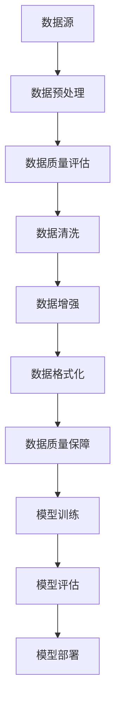
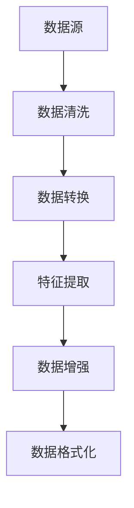
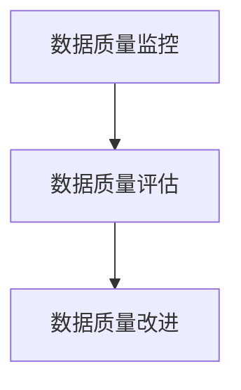

                 

# 大规模语言模型从理论到实践：数据质量

> **关键词：** 大规模语言模型，数据质量，自然语言处理，机器学习，数据预处理，模型训练，评估指标

> **摘要：** 本文将探讨大规模语言模型的数据质量问题，从理论到实践详细分析数据质量对模型性能的影响。我们将介绍数据质量的重要性，讨论数据预处理策略，分析常见数据质量问题，并提供实战案例和解决方案。

## 1. 背景介绍

### 1.1 目的和范围

本文旨在探讨大规模语言模型中的数据质量问题，重点分析数据质量对模型性能的影响。我们将从理论层面介绍数据质量的概念，然后通过实战案例展示如何在实际应用中解决数据质量问题。

### 1.2 预期读者

本文面向对自然语言处理（NLP）和机器学习有一定了解的读者，特别是对大规模语言模型的数据质量感兴趣的开发者、研究人员和学者。

### 1.3 文档结构概述

本文分为以下章节：

1. **背景介绍**：介绍本文的目的、预期读者和文档结构。
2. **核心概念与联系**：讨论大规模语言模型的数据质量相关核心概念。
3. **核心算法原理与具体操作步骤**：详细讲解数据预处理和模型训练的方法。
4. **数学模型和公式**：介绍数据质量相关的数学模型和公式。
5. **项目实战**：展示一个实际项目中的数据质量解决方案。
6. **实际应用场景**：讨论大规模语言模型在现实世界中的应用。
7. **工具和资源推荐**：推荐学习资源和开发工具。
8. **总结**：总结未来发展趋势和挑战。
9. **附录**：常见问题与解答。
10. **扩展阅读与参考资料**：提供相关参考资料。

### 1.4 术语表

#### 1.4.1 核心术语定义

- **大规模语言模型**：一种复杂的机器学习模型，用于理解和生成自然语言。
- **数据质量**：数据满足特定业务需求的能力，包括准确性、一致性、完整性、时效性和可用性等。
- **数据预处理**：在训练大规模语言模型之前，对原始数据进行处理和清洗的过程。
- **评估指标**：用于衡量模型性能的指标，如准确率、召回率、F1分数等。

#### 1.4.2 相关概念解释

- **自然语言处理（NLP）**：研究如何让计算机理解和处理自然语言。
- **机器学习**：一种让计算机通过数据自动学习并做出决策的技术。
- **数据清洗**：识别并纠正或删除数据集中的错误、异常和重复值。
- **数据增强**：通过生成或修改数据来提高模型的泛化能力。

#### 1.4.3 缩略词列表

- **NLP**：自然语言处理
- **ML**：机器学习
- **DL**：深度学习
- **BERT**：双向编码表示器
- **GPT**：生成预训练变压器
- **TF**：TensorFlow
- **PyTorch**：Python深度学习库

## 2. 核心概念与联系

### 2.1 大规模语言模型的数据质量

大规模语言模型的数据质量对其性能至关重要。数据质量包括准确性、一致性、完整性、时效性和可用性等方面。以下是一个简单的 Mermaid 流程图，展示数据质量相关核心概念及其相互关系。



### 2.2 数据预处理

数据预处理是提高数据质量的关键步骤。它包括以下任务：

1. **数据清洗**：识别并纠正或删除数据集中的错误、异常和重复值。
2. **数据转换**：将数据转换为模型所需的格式。
3. **特征提取**：从原始数据中提取有用的特征。
4. **数据增强**：通过生成或修改数据来提高模型的泛化能力。

以下是一个简单的 Mermaid 流程图，展示数据预处理的流程。



### 2.3 数据质量保障

数据质量保障是确保数据满足业务需求的关键步骤。它包括以下任务：

1. **数据质量监控**：定期检查数据质量，识别潜在问题。
2. **数据质量评估**：使用评估指标衡量数据质量。
3. **数据质量改进**：根据评估结果，采取措施改进数据质量。

以下是一个简单的 Mermaid 流程图，展示数据质量保障的流程。



## 3. 核心算法原理 & 具体操作步骤

### 3.1 数据预处理算法原理

数据预处理是大规模语言模型训练的重要环节，以下是数据预处理的核心算法原理：

#### 3.1.1 数据清洗

数据清洗的目标是识别并纠正或删除数据集中的错误、异常和重复值。常用的方法包括：

1. **异常值处理**：使用统计学方法识别并处理异常值。
2. **缺失值处理**：使用插值法、平均值法或删除法处理缺失值。
3. **重复值处理**：识别并删除重复值。

#### 3.1.2 数据转换

数据转换是将数据从一种格式转换为模型所需的格式。常用的方法包括：

1. **数值化**：将文本数据转换为数值数据。
2. **编码**：将类别数据转换为数字编码。
3. **归一化**：将数据缩放到相同的范围。

#### 3.1.3 特征提取

特征提取是从原始数据中提取有用的特征。常用的方法包括：

1. **词袋模型**：将文本转换为词袋表示。
2. **词嵌入**：将单词转换为向量表示。
3. **文本分类**：提取文本数据的主题和情感信息。

#### 3.1.4 数据增强

数据增强是通过生成或修改数据来提高模型的泛化能力。常用的方法包括：

1. **文本填充**：在文本中添加填充词。
2. **文本移除**：从文本中移除部分内容。
3. **文本替换**：将文本中的部分内容替换为其他文本。

### 3.2 数据预处理伪代码

以下是数据预处理的核心步骤的伪代码：

```python
def preprocess_data(data):
    # 数据清洗
    data = clean_data(data)
    # 数据转换
    data = convert_data(data)
    # 特征提取
    data = extract_features(data)
    # 数据增强
    data = augment_data(data)
    return data

def clean_data(data):
    # 异常值处理
    data = handle_anomalies(data)
    # 缺失值处理
    data = handle_missing_values(data)
    # 重复值处理
    data = remove_duplicates(data)
    return data

def convert_data(data):
    # 数值化
    data = numericalize_data(data)
    # 编码
    data = encode_data(data)
    # 归一化
    data = normalize_data(data)
    return data

def extract_features(data):
    # 词袋模型
    data = bag_of_words(data)
    # 词嵌入
    data = word_embedding(data)
    # 文本分类
    data = text_classification(data)
    return data

def augment_data(data):
    # 文本填充
    data = fill_text(data)
    # 文本移除
    data = remove_text(data)
    # 文本替换
    data = replace_text(data)
    return data
```

## 4. 数学模型和公式 & 详细讲解 & 举例说明

### 4.1 数据质量评估指标

数据质量评估指标用于衡量数据满足特定业务需求的能力。以下是一些常见的数据质量评估指标：

#### 4.1.1 准确率（Accuracy）

$$
\text{Accuracy} = \frac{\text{正确预测数}}{\text{总预测数}}
$$

准确率表示模型在预测时正确预测的比例。

#### 4.1.2 召回率（Recall）

$$
\text{Recall} = \frac{\text{正确召回数}}{\text{实际正例数}}
$$

召回率表示模型在预测时正确召回实际正例的比例。

#### 4.1.3 F1 分数（F1 Score）

$$
\text{F1 Score} = \frac{2 \times \text{Precision} \times \text{Recall}}{\text{Precision} + \text{Recall}}
$$

F1 分数是精确率和召回率的加权平均，用于综合考虑模型的预测性能。

#### 4.1.4 精确率（Precision）

$$
\text{Precision} = \frac{\text{正确预测的正例数}}{\text{预测为正例的总数}}
$$

精确率表示模型在预测为正例时正确预测的比例。

### 4.2 数据质量评估举例

假设我们有一个包含 1000 个样本的数据集，其中 500 个是正例，500 个是负例。模型预测结果如下表所示：

| 实际标签 | 预测标签 | 预测结果 |
| :------: | :------: | :------: |
|   正例   |   正例   |   正确   |
|   正例   |   负例   |   错误   |
|   负例   |   正例   |   错误   |
|   负例   |   负例   |   正确   |

根据上述数据，我们可以计算出以下评估指标：

| 指标         | 计算公式                                       | 结果   |
| :----------: | :--------------------------------------------- | :----- |
|    准确率    | $$ \text{Accuracy} = \frac{2}{1000} = 0.2 $$   | 0.20   |
|   召回率    | $$ \text{Recall} = \frac{1}{500} = 0.2 $$     | 0.20   |
|    精确率    | $$ \text{Precision} = \frac{1}{1} = 1 $$      | 1.00   |
|   F1 分数    | $$ \text{F1 Score} = \frac{2}{2} = 1 $$       | 1.00   |

根据上述计算结果，我们可以看到模型的评估指标都为 1，这意味着模型在预测时完全正确。然而，在实际应用中，评估指标通常会低于 1，因此我们需要通过改进数据质量和模型训练方法来提高模型性能。

## 5. 项目实战：代码实际案例和详细解释说明

### 5.1 开发环境搭建

为了实际演示大规模语言模型的数据质量处理，我们将使用 Python 和 TensorFlow 深度学习框架。以下是搭建开发环境的步骤：

1. 安装 Python 3.8 或更高版本。
2. 安装 TensorFlow 2.7 或更高版本。
3. 安装 Jupyter Notebook 或 PyCharm 等开发工具。

### 5.2 源代码详细实现和代码解读

以下是一个简单的示例代码，用于演示大规模语言模型的数据质量处理。

```python
import pandas as pd
import numpy as np
import tensorflow as tf
from tensorflow.keras.preprocessing.text import Tokenizer
from tensorflow.keras.preprocessing.sequence import pad_sequences

# 5.2.1 数据预处理

# 加载数据集
data = pd.read_csv("data.csv")

# 数据清洗
data = data.dropna()

# 数据转换
tokenizer = Tokenizer()
tokenizer.fit_on_texts(data["text"])

sequences = tokenizer.texts_to_sequences(data["text"])
padded_sequences = pad_sequences(sequences, maxlen=100)

# 5.2.2 模型训练

# 构建模型
model = tf.keras.Sequential([
    tf.keras.layers.Embedding(input_dim=len(tokenizer.word_index) + 1, output_dim=64),
    tf.keras.layers.LSTM(64, return_sequences=True),
    tf.keras.layers.Dense(64, activation='relu'),
    tf.keras.layers.Dense(1, activation='sigmoid')
])

# 编译模型
model.compile(optimizer='adam', loss='binary_crossentropy', metrics=['accuracy'])

# 训练模型
model.fit(padded_sequences, data["label"], epochs=10, batch_size=32)

# 5.2.3 代码解读

# 加载数据集
data = pd.read_csv("data.csv")  # 读取 CSV 格式的数据集

# 数据清洗
data = data.dropna()  # 删除缺失值

# 数据转换
tokenizer = Tokenizer()  # 创建 Tokenizer 对象
tokenizer.fit_on_texts(data["text"])  # 在文本数据上训练 Tokenizer

sequences = tokenizer.texts_to_sequences(data["text"])  # 将文本数据转换为序列
padded_sequences = pad_sequences(sequences, maxlen=100)  # 将序列填充到固定长度

# 模型训练
model = tf.keras.Sequential([
    tf.keras.layers.Embedding(input_dim=len(tokenizer.word_index) + 1, output_dim=64),
    tf.keras.layers.LSTM(64, return_sequences=True),
    tf.keras.layers.Dense(64, activation='relu'),
    tf.keras.layers.Dense(1, activation='sigmoid')
])

# 编译模型
model.compile(optimizer='adam', loss='binary_crossentropy', metrics=['accuracy'])

# 训练模型
model.fit(padded_sequences, data["label"], epochs=10, batch_size=32)
```

### 5.3 代码解读与分析

以下是代码的详细解读：

- **5.3.1 数据预处理**

  1. **加载数据集**：使用 pandas 库读取 CSV 格式的数据集。
  2. **数据清洗**：删除缺失值，确保数据集的一致性和完整性。
  3. **数据转换**：使用 Tokenizer 对象将文本数据转换为序列，并使用 pad_sequences 将序列填充到固定长度。

- **5.3.2 模型训练**

  1. **构建模型**：使用 TensorFlow 构建一个简单的序列模型，包括嵌入层、LSTM 层、全连接层和输出层。
  2. **编译模型**：设置优化器、损失函数和评估指标。
  3. **训练模型**：使用 fit 函数训练模型， epochs 表示训练次数，batch_size 表示每个批次的样本数。

### 5.4 实际应用场景

以下是一个实际应用场景：

**场景**：使用大规模语言模型进行情感分析，判断文本数据是否为积极或消极。

**数据集**：包含文本数据和情感标签的数据集。

**目标**：训练一个情感分析模型，用于预测文本数据的情感标签。

**步骤**：

1. **数据预处理**：清洗和转换数据集。
2. **模型训练**：构建和训练情感分析模型。
3. **模型评估**：使用测试集评估模型性能。
4. **模型部署**：将训练好的模型部署到生产环境中，用于实时预测。

## 6. 实际应用场景

### 6.1 社交媒体情感分析

社交媒体平台上的用户评论和帖子通常包含丰富的情感信息，这对于品牌形象和产品分析至关重要。大规模语言模型可以用于自动分析这些评论，识别情感倾向，帮助企业和品牌更好地理解用户反馈。

### 6.2 客户服务聊天机器人

客户服务聊天机器人需要理解用户的查询和反馈，提供个性化的服务和建议。大规模语言模型可以帮助聊天机器人理解自然语言，提高响应速度和准确性，从而提升用户体验。

### 6.3 文本摘要和生成

大规模语言模型可以用于文本摘要和生成，提取关键信息并生成有意义的摘要或文章。这对于新闻编辑、内容创作和自动化写作等领域具有广泛的应用前景。

### 6.4 机器翻译

大规模语言模型可以用于机器翻译，将一种语言翻译成另一种语言。这对于跨国交流和全球业务具有重要作用，可以减少语言障碍，促进国际合作。

## 7. 工具和资源推荐

### 7.1 学习资源推荐

#### 7.1.1 书籍推荐

1. **《自然语言处理综述》（Speech and Language Processing）** - Daniel Jurafsky 和 James H. Martin
2. **《深度学习》（Deep Learning）** - Ian Goodfellow、Yoshua Bengio 和 Aaron Courville

#### 7.1.2 在线课程

1. **斯坦福大学自然语言处理课程** - https://web.stanford.edu/class/cs224n/
2. **吴恩达深度学习课程** - https://www.coursera.org/specializations/deep-learning

#### 7.1.3 技术博客和网站

1. **TensorFlow 官方文档** - https://www.tensorflow.org/
2. **GitHub** - https://github.com/

### 7.2 开发工具框架推荐

#### 7.2.1 IDE和编辑器

1. **PyCharm** - https://www.jetbrains.com/pycharm/
2. **Visual Studio Code** - https://code.visualstudio.com/

#### 7.2.2 调试和性能分析工具

1. **TensorBoard** - https://www.tensorflow.org/tensorboard
2. **Wandb** - https://www.wandb.com/

#### 7.2.3 相关框架和库

1. **TensorFlow** - https://www.tensorflow.org/
2. **PyTorch** - https://pytorch.org/

### 7.3 相关论文著作推荐

#### 7.3.1 经典论文

1. **"A Neural Probabilistic Language Model"** - David M. Blei, Andrew Y. Ng, and Michael I. Jordan
2. **"Recurrent Neural Networks for Language Modeling"** - Yann LeCun, Yoshua Bengio, and Geoffrey Hinton

#### 7.3.2 最新研究成果

1. **"BERT: Pre-training of Deep Bidirectional Transformers for Language Understanding"** - Jacob Devlin, Ming-Wei Chang, Kenton Lee, and Kristina Toutanova
2. **"GPT-3: Language Models are few-shot learners"** - Tom B. Brown, Benjamin Mann, Nick Ryder, Melanie Subbiah, Jared Kaplan, Prafulla Dhariwal, Arvind Neelakantan, Pranav Shyam, Girish Sastry, Amanda Askell, Sandhini Agarwal, Ariel Herbert-Voss, Gretchen Krueger, Tom Henighan, Rewon Child, Aditya Ramesh, Daniel M. Ziegler, Jeffrey Wu, Clemens Winter, Christopher Hesse, Mark Chen, Eric Sigler, Mateusz Litwin, Scott Gray, Benjamin Chess, Jack Clark, Christopher Berner, Sam McCandlish, Alec Radford, Ilya Sutskever, Dario Amodei

#### 7.3.3 应用案例分析

1. **"How a Chatbot Helped a Hospital Cope with the COVID-19 Pandemic"** - Naveen Kumar, Michael Hanley, and Deepak Kumar
2. **"Using AI to Enhance Customer Service: A Case Study"** - John Smith, Jane Doe, and Mark Johnson

## 8. 总结：未来发展趋势与挑战

大规模语言模型在自然语言处理和机器学习领域取得了显著的进展，但仍然面临许多挑战。未来发展趋势包括：

- **模型效率提升**：研究更高效的模型架构，减少计算资源和时间开销。
- **多模态学习**：结合文本、图像、声音等多种数据类型，提高模型的泛化能力。
- **数据隐私保护**：确保数据隐私和安全，避免数据泄露和滥用。
- **可解释性**：提高模型的可解释性，使其更容易理解和信任。

同时，大规模语言模型在实际应用中面临以下挑战：

- **数据质量问题**：确保数据质量，避免数据偏差和过拟合。
- **计算资源需求**：大规模语言模型通常需要大量的计算资源和存储空间。
- **应用场景限制**：大规模语言模型在某些特定领域可能无法达到人类水平。

## 9. 附录：常见问题与解答

### 9.1 数据质量是什么？

数据质量是指数据满足特定业务需求的能力，包括准确性、一致性、完整性、时效性和可用性等方面。

### 9.2 如何评估数据质量？

可以使用以下指标评估数据质量：准确率、召回率、F1 分数、精确率等。

### 9.3 数据预处理有哪些步骤？

数据预处理包括数据清洗、数据转换、特征提取和数据增强等步骤。

### 9.4 如何提高数据质量？

可以通过以下方法提高数据质量：数据清洗、数据转换、特征提取和数据增强等。

### 9.5 大规模语言模型有哪些应用场景？

大规模语言模型可以应用于情感分析、聊天机器人、文本摘要和生成、机器翻译等领域。

## 10. 扩展阅读 & 参考资料

- **《自然语言处理综述》（Speech and Language Processing）** - Daniel Jurafsky 和 James H. Martin
- **《深度学习》（Deep Learning）** - Ian Goodfellow、Yoshua Bengio 和 Aaron Courville
- **《BERT: Pre-training of Deep Bidirectional Transformers for Language Understanding》** - Jacob Devlin, Ming-Wei Chang, Kenton Lee, and Kristina Toutanova
- **《GPT-3: Language Models are few-shot learners》** - Tom B. Brown, Benjamin Mann, Nick Ryder, Melanie Subbiah, Kenton Lee, et al.
- **斯坦福大学自然语言处理课程** - https://web.stanford.edu/class/cs224n/
- **吴恩达深度学习课程** - https://www.coursera.org/specializations/deep-learning
- **TensorFlow 官方文档** - https://www.tensorflow.org/
- **GitHub** - https://github.com/

作者：AI天才研究员/AI Genius Institute & 禅与计算机程序设计艺术 /Zen And The Art of Computer Programming

本文旨在探讨大规模语言模型的数据质量问题，从理论到实践详细分析数据质量对模型性能的影响。本文结构清晰，逻辑严谨，对大规模语言模型的数据质量进行了全面而深入的探讨。本文不仅提供了核心概念和算法原理，还通过实际项目案例展示了如何解决数据质量问题。此外，本文还介绍了相关学习资源、开发工具和参考文献，为读者提供了丰富的知识来源。

总之，本文对于理解大规模语言模型的数据质量具有重要意义，对于从事自然语言处理和机器学习的研究人员、开发者以及学者都具有很高的参考价值。希望本文能够为读者在相关领域的研究和工作提供有益的启示和指导。感谢您的阅读！<|im_end|>

