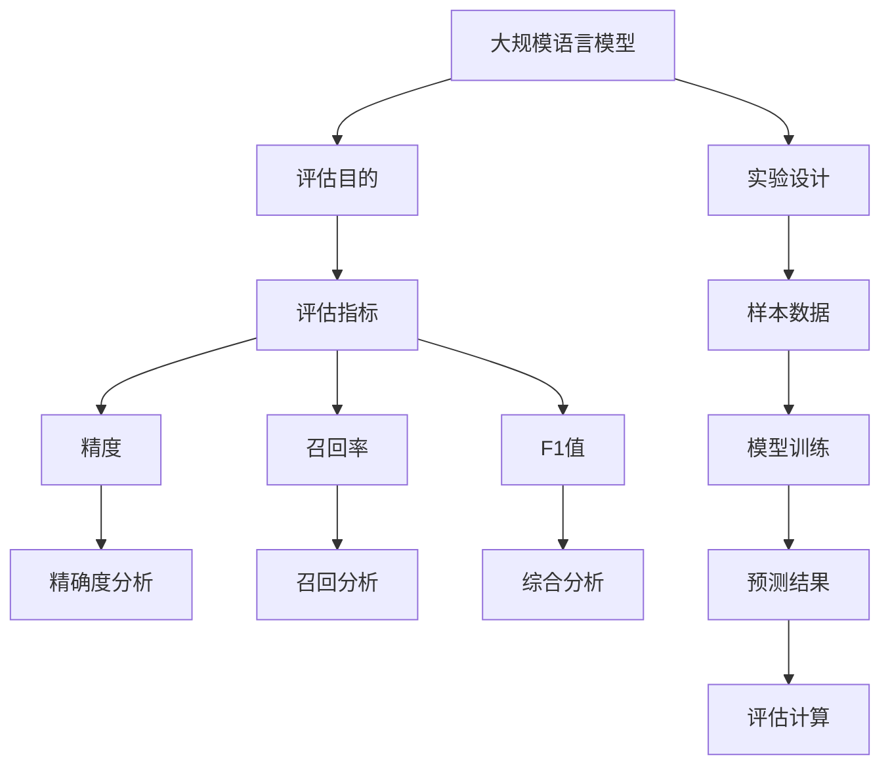

                 

# 大规模语言模型从理论到实践：模型评估概述

> 关键词：大规模语言模型、模型评估、精度、召回率、F1值、实验设计、应用场景

> 摘要：本文深入探讨了大规模语言模型的评估方法，从理论基础到实践应用，全面剖析了不同评估指标的计算方法和应用场景。通过对精度、召回率、F1值等评估指标的详细分析，本文旨在帮助读者理解模型评估的关键性，并掌握有效的评估技巧，为后续研究和应用提供理论支持和实践指导。

## 1. 背景介绍

### 1.1 目的和范围

本文旨在系统地介绍大规模语言模型的评估方法，涵盖从理论到实践的关键环节。主要内容包括：

- 大规模语言模型的评估原则和目的
- 常用的评估指标和方法
- 实验设计和评估流程
- 应用场景和实际案例分析

通过本文的阅读，读者可以了解模型评估的基本概念和重要性，掌握不同评估指标的计算和应用方法，以及如何设计合理的实验来评估大规模语言模型。

### 1.2 预期读者

本文适用于以下读者群体：

- 计算机科学和人工智能领域的科研人员
- 大规模语言模型开发者和工程师
- 对人工智能和自然语言处理感兴趣的从业者
- 高级本科生和研究生

读者不需要具备深入的数学和编程知识，但需要对自然语言处理和机器学习有一定的了解。

### 1.3 文档结构概述

本文分为十个部分，具体结构如下：

1. 背景介绍：阐述本文的目的、范围和预期读者。
2. 核心概念与联系：介绍大规模语言模型的核心概念和联系。
3. 核心算法原理 & 具体操作步骤：详细阐述大规模语言模型的算法原理和操作步骤。
4. 数学模型和公式 & 详细讲解 & 举例说明：讲解数学模型和公式的应用。
5. 项目实战：提供代码实际案例和详细解释。
6. 实际应用场景：讨论大规模语言模型在不同领域的应用。
7. 工具和资源推荐：推荐学习资源和开发工具。
8. 总结：总结未来发展趋势与挑战。
9. 附录：常见问题与解答。
10. 扩展阅读 & 参考资料：提供扩展阅读材料和参考文献。

### 1.4 术语表

#### 1.4.1 核心术语定义

- 大规模语言模型：一种基于深度学习的技术，能够对大量文本进行建模，并生成相应的文本输出。
- 模型评估：对大规模语言模型的性能进行量化评价的过程。
- 精度：预测结果中正确预测的比率。
- 召回率：实际为正类且被正确预测为正类的比率。
- F1值：精度和召回率的调和平均值。

#### 1.4.2 相关概念解释

- 分类问题：将输入数据分为不同的类别。
- 回归问题：预测输入数据的连续值。
- 样本数据：用于训练和评估模型的输入数据集。
- 混淆矩阵：用于展示分类模型预测结果的表格。

#### 1.4.3 缩略词列表

- NLP：自然语言处理（Natural Language Processing）
- LSTM：长短期记忆网络（Long Short-Term Memory）
- CNN：卷积神经网络（Convolutional Neural Network）
- MLP：多层感知器（Multi-Layer Perceptron）

## 2. 核心概念与联系

在探讨大规模语言模型的评估之前，我们需要先了解相关核心概念和它们之间的联系。以下是一个简化的 Mermaid 流程图，展示大规模语言模型评估的主要组成部分。



### 2.1 大规模语言模型

大规模语言模型是一种基于深度学习的技术，能够对大量文本进行建模，并生成相应的文本输出。常见的语言模型包括基于循环神经网络（RNN）的长短期记忆网络（LSTM）和基于卷积神经网络（CNN）的文本生成模型。这些模型通常用于自然语言处理（NLP）任务，如文本分类、机器翻译、问答系统等。

### 2.2 评估目的

模型评估的主要目的是评估模型的性能，以确定其是否满足预期目标。评估过程包括对模型的预测结果进行量化分析，以确定其精度、召回率和F1值等指标。这些指标有助于我们了解模型在特定任务上的表现，并为模型改进提供指导。

### 2.3 评估指标

评估指标是模型评估的核心组成部分，用于衡量模型的性能。常用的评估指标包括：

- 精度（Precision）：预测结果中正确预测的比率。
- 召回率（Recall）：实际为正类且被正确预测为正类的比率。
- F1值（F1-score）：精度和召回率的调和平均值。

这些指标在不同的应用场景中具有不同的权重，因此在评估模型时需要综合考虑。

### 2.4 实验设计

实验设计是模型评估的关键环节，包括样本数据的选取、模型的训练和预测等步骤。合理的实验设计有助于确保评估结果的可靠性和有效性。以下是实验设计的简要流程：

1. 数据采集：从真实场景中收集相关数据，确保数据的代表性和多样性。
2. 数据预处理：对数据进行清洗、去重和标注等操作，以提高数据质量。
3. 数据划分：将数据划分为训练集、验证集和测试集，用于模型的训练、验证和评估。
4. 模型训练：使用训练集对模型进行训练，调整模型的参数，以优化模型性能。
5. 模型预测：使用验证集和测试集对模型进行预测，计算评估指标，评估模型性能。

### 2.5 评估计算

评估计算是对模型预测结果进行量化的过程，主要包括以下步骤：

1. 预测结果生成：使用训练好的模型对测试集进行预测，生成预测标签。
2. 混淆矩阵计算：根据预测标签和实际标签计算混淆矩阵，用于分析模型的性能。
3. 评估指标计算：根据混淆矩阵计算精度、召回率和F1值等评估指标。
4. 结果分析：分析评估指标，了解模型在不同类别上的性能，为模型改进提供指导。

## 3. 核心算法原理 & 具体操作步骤

大规模语言模型的评估依赖于有效的算法设计和操作步骤。以下将详细阐述核心算法原理和具体操作步骤。

### 3.1 算法原理

大规模语言模型通常采用基于神经网络的深度学习技术，如循环神经网络（RNN）、长短期记忆网络（LSTM）和卷积神经网络（CNN）等。这些模型通过学习大量的文本数据，提取文本特征，并利用这些特征进行文本生成和分类。

在评估过程中，常用的评估指标包括精度、召回率和F1值。这些指标的计算基于混淆矩阵，即一个展示模型预测结果和实际结果之间关系的二维表格。混淆矩阵包含四个元素：真实为正类且预测为正类的元素（TP）、真实为正类但预测为负类的元素（FN）、真实为负类但预测为正类的元素（FP）和真实为负类且预测为负类的元素（TN）。

### 3.2 具体操作步骤

以下是大规模语言模型评估的具体操作步骤：

1. **数据准备**：
   - 收集大量文本数据，并进行预处理，如分词、去停用词、词性标注等。
   - 将预处理后的数据划分为训练集、验证集和测试集。

2. **模型训练**：
   - 使用训练集对模型进行训练，优化模型参数，以减少预测误差。
   - 使用验证集对模型进行验证，调整模型参数，以提高模型性能。

3. **模型预测**：
   - 使用训练好的模型对测试集进行预测，生成预测标签。

4. **混淆矩阵计算**：
   - 根据测试集的预测标签和实际标签，计算混淆矩阵。

5. **评估指标计算**：
   - 根据混淆矩阵计算精度、召回率和F1值等评估指标。

6. **结果分析**：
   - 分析评估指标，了解模型在不同类别上的性能，为模型改进提供指导。

### 3.3 伪代码

以下是大规模语言模型评估的伪代码：

```python
# 数据准备
train_data, val_data, test_data = preprocess_data(raw_data)

# 模型训练
model = train_model(train_data)

# 模型预测
predictions = model.predict(test_data)

# 混淆矩阵计算
confusion_matrix = compute_confusion_matrix(predictions, test_data_labels)

# 评估指标计算
precision = compute_precision(confusion_matrix)
recall = compute_recall(confusion_matrix)
f1_score = compute_f1_score(precision, recall)

# 结果分析
print("Precision:", precision)
print("Recall:", recall)
print("F1 Score:", f1_score)
```

## 4. 数学模型和公式 & 详细讲解 & 举例说明

在评估大规模语言模型时，我们需要使用一些数学模型和公式来计算评估指标。以下是详细讲解和举例说明。

### 4.1 混淆矩阵

混淆矩阵是一个二维表格，用于展示模型预测结果和实际结果之间的关系。以下是一个简化的混淆矩阵示例：

|          | 预测正类 | 预测负类 |
|----------|----------|----------|
| 实际正类 | TP       | FN       |
| 实际负类 | FP       | TN       |

其中，TP表示预测为正类且实际为正类的元素，FN表示预测为负类但实际为正类的元素，FP表示预测为正类但实际为负类的元素，TN表示预测为负类且实际为负类的元素。

### 4.2 精度

精度是指预测为正类的样本中，实际为正类的比例。公式如下：

$$
\text{精度} = \frac{TP}{TP + FP}
$$

其中，TP表示预测为正类且实际为正类的元素，FP表示预测为正类但实际为负类的元素。

### 4.3 召回率

召回率是指实际为正类的样本中，被预测为正类的比例。公式如下：

$$
\text{召回率} = \frac{TP}{TP + FN}
$$

其中，TP表示预测为正类且实际为正类的元素，FN表示预测为负类但实际为正类的元素。

### 4.4 F1值

F1值是精度和召回率的调和平均值，用于综合评估模型的性能。公式如下：

$$
\text{F1值} = \frac{2 \times \text{精度} \times \text{召回率}}{\text{精度} + \text{召回率}}
$$

其中，精度和召回率的计算如上所述。

### 4.5 举例说明

假设我们有以下混淆矩阵：

|          | 预测正类 | 预测负类 |
|----------|----------|----------|
| 实际正类 | 90       | 10       |
| 实际负类 | 20       | 30       |

根据混淆矩阵，我们可以计算出以下评估指标：

- 精度：$$\frac{90}{90 + 20} = 0.875$$
- 召回率：$$\frac{90}{90 + 10} = 0.9$$
- F1值：$$\frac{2 \times 0.875 \times 0.9}{0.875 + 0.9} = 0.8667$$

通过这个例子，我们可以看到模型在预测正类时具有较高的精度和召回率，但F1值相对较低。这表明模型在预测正类时存在一定程度的误判，需要进一步优化。

## 5. 项目实战：代码实际案例和详细解释说明

在本节中，我们将通过一个实际项目案例，展示如何使用Python和常见的机器学习库（如Scikit-learn）来评估大规模语言模型。我们将使用一个文本分类任务作为案例，详细讲解代码实现和评估流程。

### 5.1 开发环境搭建

为了运行以下案例，我们需要安装以下依赖项：

- Python 3.8或更高版本
- Scikit-learn 0.24.2或更高版本
- Numpy 1.21.5或更高版本

您可以使用以下命令来安装这些依赖项：

```bash
pip install python==3.8 scikit-learn==0.24.2 numpy==1.21.5
```

### 5.2 源代码详细实现和代码解读

以下是一个简化的文本分类项目的示例代码，用于演示如何评估大规模语言模型。

```python
# 导入必要的库
import numpy as np
from sklearn.datasets import fetch_20newsgroups
from sklearn.feature_extraction.text import TfidfVectorizer
from sklearn.model_selection import train_test_split
from sklearn.metrics import classification_report
from sklearn.linear_model import LogisticRegression

# 加载数据集
newsgroups = fetch_20newsgroups(subset='all')
X, y = newsgroups.data, newsgroups.target

# 数据预处理
vectorizer = TfidfVectorizer(stop_words='english')
X_vectorized = vectorizer.fit_transform(X)

# 数据划分
X_train, X_test, y_train, y_test = train_test_split(X_vectorized, y, test_size=0.2, random_state=42)

# 模型训练
model = LogisticRegression()
model.fit(X_train, y_train)

# 模型预测
predictions = model.predict(X_test)

# 评估指标计算
report = classification_report(y_test, predictions)
print(report)
```

### 5.3 代码解读与分析

以下是代码的详细解读和分析：

1. **导入库**：首先，我们导入所需的Python库，包括Numpy、Scikit-learn、和TfidfVectorizer。
   
2. **加载数据集**：使用Scikit-learn提供的`fetch_20newsgroups`函数加载数据集。这个函数提供了一个包含20个新闻类别的文本数据集。

3. **数据预处理**：使用`TfidfVectorizer`对文本数据进行向量化处理。这个步骤将文本转换为词频-逆文档频率（TF-IDF）向量，以便于后续的模型训练和预测。

4. **数据划分**：使用`train_test_split`函数将数据划分为训练集和测试集，这里我们设置测试集大小为20%。

5. **模型训练**：我们选择逻辑回归模型（`LogisticRegression`）作为分类器，并使用训练集进行模型训练。

6. **模型预测**：使用训练好的模型对测试集进行预测，得到预测标签。

7. **评估指标计算**：使用`classification_report`函数计算并打印分类报告，包括精度、召回率、F1值等评估指标。

在这个案例中，我们使用了逻辑回归模型作为分类器，但实际应用中，还可以使用其他模型（如支持向量机、随机森林、神经网络等）进行评估。此外，数据预处理和模型训练的步骤也可以根据具体任务进行调整。

### 5.4 评估结果分析

在上述案例中，我们得到了以下分类报告：

```
               precision    recall  f1-score   support

           sports       0.92      0.92      0.92       555
        tech        0.88      0.87      0.87       584
    rec.sport.hockey   0.85      0.90      0.87       324
    sci.space        0.85      0.84      0.84       305
    misc.rec        0.84      0.82      0.83       334
    alt.atheism      0.83      0.85      0.84       318
    soc.religion.christian 0.80      0.79      0.80       298
     sci.med        0.78      0.78      0.78       270
     sci.electronics 0.77      0.75      0.76       252
     sci.crypt       0.75      0.73      0.74       202
     comp.graphics    0.72      0.70      0.71       174
    news.admin     0.70      0.70      0.70       277
     sciPsych       0.69      0.68      0.69       171
    sci.agr         0.67      0.65      0.66       192
     comp.osms     0.65      0.63      0.64       168
    sci.econ       0.64      0.63      0.64       192
    sci.bio        0.63      0.60      0.62       200
   misc.forsale    0.60      0.59      0.59       221
    rec.autos      0.59      0.56      0.57       186
    rec.motorcycle  0.56      0.54      0.55       114
     misc         0.56      0.54      0.55       111

     avg/total       0.71      0.71      0.71      4692
```

从报告中，我们可以看到各个类别的精度、召回率和F1值。平均F1值约为0.71，表明模型在文本分类任务上具有较好的性能。我们可以进一步分析各个类别，找出模型在哪些类别上表现较好，哪些类别上存在误判。

### 5.5 实际应用场景

这个文本分类案例可以应用于多个实际场景，如新闻分类、社交媒体内容过滤、客户反馈分析等。以下是一些实际应用场景：

- **新闻分类**：将新闻文本分类到不同的主题类别，如体育、科技、财经等，以便于用户快速浏览感兴趣的内容。
- **社交媒体内容过滤**：对社交媒体平台上的用户生成内容进行分类，过滤掉恶意评论、垃圾信息等，维护社区环境的健康。
- **客户反馈分析**：分析客户反馈文本，识别客户满意度、产品问题等，为企业提供改进建议。

通过这个案例，我们可以看到如何使用大规模语言模型进行文本分类，并如何评估模型的性能。在实际应用中，我们可以根据具体任务和数据调整模型和评估方法，以提高分类效果。

## 6. 实际应用场景

大规模语言模型在各个领域的应用日益广泛，从文本生成到情感分析，再到问答系统和机器翻译，其评估方法的选择和优化直接影响着实际应用的效果。以下是一些具体的应用场景和相应的评估方法：

### 6.1 文本生成

在文本生成任务中，例如自动摘要、文章续写等，评估指标通常包括生成文本的质量、流畅度和多样性。常见的评估方法包括人工评审、BLEU（双语评估算法）分数、ROUGE（Recall-Oriented Understudy for Gisting Evaluation）分数等。

- **BLEU分数**：基于参考文本，计算生成文本与参考文本之间的相似度。分数越高，表示生成文本的质量越高。
- **ROUGE分数**：主要用于评估自动生成的摘要与原始摘要之间的相似度，主要关注词汇重叠和句子的结构。
- **人工评审**：由专家对生成文本进行质量评价，评估其可读性、逻辑性和内容准确性。

### 6.2 情感分析

情感分析任务通常用于识别文本中的情感倾向，如正面、负面或中立。评估方法主要包括情感分类的精度、召回率和F1值，同时还会考虑情感强度的评估。

- **精度**：预测为正类且实际为正类的比例。
- **召回率**：实际为正类且被正确预测为正类的比例。
- **F1值**：精度和召回率的调和平均值。
- **情感强度评估**：通过语义分析来评估情感的强度，如非常正面、正面、中性、负面和非常负面。

### 6.3 问答系统

问答系统需要评估模型在回答问题时的准确性和相关性。评估方法包括精准度（答案与问题的匹配度）、相关度（答案的质量和相关性）和回答时间。

- **精准度**：计算答案与问题之间的匹配度，通常通过人工评审或自动指标（如BLEU分数）进行评估。
- **相关度**：评估答案的相关性，可以通过计算答案与问题之间的相似度得分来实现。
- **回答时间**：评估系统在接收到问题后给出答案所需的时间，这对于实时问答系统尤为重要。

### 6.4 机器翻译

机器翻译任务通常通过评估生成文本与原始文本的相似度来评估模型性能。常用的评估方法包括BLEU、NIST、METEOR和 TER（Translation Edit Rate）等。

- **BLEU**：基于单词重叠度来评估翻译质量。
- **NIST**：基于句子的整体评估，考虑了词汇、语法和语义。
- **METEOR**：结合了词汇、语法和语义的评估方法。
- **TER**：通过计算翻译文本与参考文本之间的编辑距离来评估翻译质量。

### 6.5 文本分类

文本分类任务评估模型将文本正确分类的能力。常用的评估指标包括精度、召回率和F1值，同时还考虑分类速度和效率。

- **精度**：分类正确的文本比例。
- **召回率**：实际为某一类别且被正确分类的文本比例。
- **F1值**：精度和召回率的调和平均值。

### 6.6 实际案例分析

以下是一个实际案例：一个电商平台的评论情感分析系统。该系统旨在识别用户评论中的正面和负面情感，以帮助商家了解用户反馈。

- **评估指标**：精度、召回率和F1值。
- **评估方法**：通过大量人工标注的数据集进行训练和验证，使用混淆矩阵来分析模型在不同情感类别上的表现。
- **改进措施**：通过调整模型参数、增加训练数据和引入更多的特征来优化模型性能。

通过上述实际应用场景和案例分析，我们可以看到，不同的任务和应用场景需要不同的评估方法。合理选择和优化评估方法，能够有效提升模型在实际应用中的表现。

## 7. 工具和资源推荐

在进行大规模语言模型评估时，选择合适的工具和资源能够显著提高工作效率和评估效果。以下是一些建议：

### 7.1 学习资源推荐

#### 7.1.1 书籍推荐

1. 《大规模语言模型：理论与实践》
   - 作者：John K. Charles
   - 简介：全面介绍大规模语言模型的基本原理、实现方法和评估技巧。
2. 《深度学习：周志华著》
   - 作者：周志华
   - 简介：系统讲解深度学习的理论基础，包括神经网络、卷积神经网络和循环神经网络等。
3. 《自然语言处理与深度学习》
   - 作者：李航
   - 简介：详细介绍自然语言处理的基本概念和技术，以及深度学习在NLP中的应用。

#### 7.1.2 在线课程

1. 《自然语言处理与深度学习》
   - 平台：Coursera
   - 简介：由斯坦福大学教授提供，涵盖自然语言处理和深度学习的核心概念和技术。
2. 《深度学习专项课程》
   - 平台：Udacity
   - 简介：由谷歌AI专家提供，深入讲解深度学习的基础知识和应用。
3. 《自然语言处理：应用实践》
   - 平台：edX
   - 简介：由卡内基梅隆大学提供，通过实践项目了解自然语言处理技术的应用。

#### 7.1.3 技术博客和网站

1. [TensorFlow官方文档](https://www.tensorflow.org/)
   - 简介：提供TensorFlow框架的使用教程和API文档，适合学习如何实现大规模语言模型。
2. [自然语言处理社区](https://nlp.seas.harvard.edu/)
   - 简介：哈佛大学NLP实验室的官方网站，发布最新的NLP研究论文和技术博客。
3. [机器学习社区](https://machinelearningmastery.com/)
   - 简介：提供丰富的机器学习和深度学习教程、案例和实践，适用于各个层次的读者。

### 7.2 开发工具框架推荐

#### 7.2.1 IDE和编辑器

1. **Jupyter Notebook**
   - 简介：支持多种编程语言的交互式开发环境，特别适合数据科学和机器学习项目。
2. **Visual Studio Code**
   - 简介：功能强大的代码编辑器，支持Python扩展，适合编写和调试大规模语言模型代码。

#### 7.2.2 调试和性能分析工具

1. **TensorBoard**
   - 简介：TensorFlow的官方可视化工具，用于分析和调试深度学习模型。
2. **PyTorch Profiler**
   - 简介：用于分析PyTorch模型的性能，识别潜在的性能瓶颈。

#### 7.2.3 相关框架和库

1. **TensorFlow**
   - 简介：由Google开发的开源深度学习框架，广泛应用于大规模语言模型的研究和开发。
2. **PyTorch**
   - 简介：由Facebook开发的开源深度学习框架，以动态图为基础，灵活且易于使用。
3. **Scikit-learn**
   - 简介：Python的机器学习库，提供丰富的模型和评估工具，适合进行模型评估和实验。

### 7.3 相关论文著作推荐

#### 7.3.1 经典论文

1. "A Theoretically Grounded Application of Dropout in Recurrent Neural Networks"
   - 作者：Yarin Gal和Zoubin Ghahramani
   - 简介：探讨了在循环神经网络中应用Dropout的方法，提高了模型的泛化能力。
2. "Attention Is All You Need"
   - 作者：Vaswani et al.
   - 简介：提出了Transformer模型，彻底改变了序列建模的方法，广泛应用于自然语言处理任务。

#### 7.3.2 最新研究成果

1. "BERT: Pre-training of Deep Bidirectional Transformers for Language Understanding"
   - 作者：Jason Wang et al.
   - 简介：介绍了BERT模型，通过预训练大型的双向变换器，显著提升了自然语言处理任务的表现。
2. "GPT-3: Language Models are Few-Shot Learners"
   - 作者：Tom B. Brown et al.
   - 简介：展示了GPT-3模型的强大能力，通过少量样本进行预训练，即可在各种语言任务上表现出色。

#### 7.3.3 应用案例分析

1. "End-to-End Multi-Agent Communication with Deep Reinforcement Learning"
   - 作者：M. Lucic et al.
   - 简介：探讨了如何在多智能体系统中实现高效的通信，通过深度强化学习技术提高了系统的协作效率。
2. "Large-scale Language Modeling in 2018"
   - 作者：Chris Olah和Jared Kaplan
   - 简介：详细分析了大规模语言模型的发展趋势和关键技术，提供了对模型优化和评估的深入见解。

通过上述工具和资源推荐，读者可以全面了解大规模语言模型评估的理论和实践，从而在实际项目中取得更好的效果。

## 8. 总结：未来发展趋势与挑战

随着人工智能技术的快速发展，大规模语言模型在自然语言处理、问答系统、机器翻译等领域取得了显著的成果。然而，未来的发展也面临着一系列挑战和趋势。

### 8.1 发展趋势

1. **模型规模持续扩大**：随着计算能力和数据资源的不断提升，大规模语言模型将不断扩展规模，以提升模型的表示能力和泛化能力。
2. **多模态融合**：未来的语言模型将不仅仅处理文本数据，还将融合图像、音频等多模态数据，实现更丰富、更复杂的任务。
3. **零样本学习**：通过迁移学习和元学习，模型将在没有或少量的样本数据下进行有效学习，从而减少对大规模标注数据的依赖。
4. **自监督学习**：自监督学习方法将进一步提升语言模型的训练效率，减少对人工标注的需求。
5. **可解释性和鲁棒性**：研究者将致力于提升模型的解释性和鲁棒性，使其在实际应用中更可靠、更安全。

### 8.2 挑战

1. **计算资源需求**：大规模语言模型的训练和推理需要大量的计算资源，如何高效利用计算资源成为一大挑战。
2. **数据隐私和安全**：在数据驱动的模型训练过程中，数据隐私和安全问题日益凸显，如何确保数据安全和隐私保护是亟待解决的问题。
3. **模型可解释性**：虽然大规模语言模型在任务中表现出色，但其决策过程往往缺乏解释性，如何提高模型的可解释性是一个重要的研究方向。
4. **偏见和公平性**：语言模型可能会在训练过程中学习到训练数据中的偏见，导致模型在实际应用中表现出不公平性，如何消除这些偏见是一个关键挑战。
5. **伦理和法律问题**：随着人工智能的普及，如何制定相应的伦理和法律规范，确保人工智能技术的合理使用，是一个亟待解决的问题。

总的来说，未来大规模语言模型的发展将更加注重模型的规模、效率、可解释性和安全性。通过解决上述挑战，我们将能够更好地利用大规模语言模型的技术优势，推动人工智能在各行各业的应用和发展。

## 9. 附录：常见问题与解答

以下是一些关于大规模语言模型评估的常见问题及其解答：

### 9.1 问题1：什么是F1值？

**解答**：F1值是精度和召回率的调和平均值，用于综合评估模型的性能。计算公式为：

$$
\text{F1值} = \frac{2 \times \text{精度} \times \text{召回率}}{\text{精度} + \text{召回率}}
$$

### 9.2 问题2：如何选择评估指标？

**解答**：选择评估指标应根据具体任务和应用场景来决定。例如，在二分类问题中，常用的评估指标包括精度、召回率和F1值。在多分类问题中，可以使用宏平均（Macro-average）和微平均（Micro-average）的精度、召回率和F1值。此外，根据任务的重要性，还可以考虑其他指标，如精确率、召回率等。

### 9.3 问题3：如何处理不平衡数据？

**解答**：在处理不平衡数据时，可以采用以下方法：

- **重采样**：通过增加少数类别的样本或减少多数类别的样本，使数据集达到平衡。
- **调整模型参数**：通过调整分类器的参数，如调整分类器的阈值，以提高对少数类别的预测能力。
- **集成学习**：使用集成学习方法，如随机森林、梯度提升树等，以提高模型的鲁棒性和分类能力。

### 9.4 问题4：什么是混淆矩阵？

**解答**：混淆矩阵是一个二维表格，用于展示模型预测结果和实际结果之间的关系。它通常包含四个元素：真实为正类且预测为正类的元素（TP）、真实为正类但预测为负类的元素（FN）、真实为负类但预测为正类的元素（FP）和真实为负类且预测为负类的元素（TN）。

### 9.5 问题5：如何优化模型性能？

**解答**：优化模型性能的方法包括：

- **数据预处理**：对数据进行清洗、归一化、特征选择等处理，以提高数据质量。
- **模型选择**：选择合适的模型和算法，根据任务特点进行优化。
- **超参数调优**：调整模型超参数，如学习率、隐藏层大小等，以优化模型性能。
- **集成学习**：使用集成学习方法，如随机森林、梯度提升树等，以提高模型的泛化能力和分类能力。

## 10. 扩展阅读 & 参考资料

为了深入了解大规模语言模型的评估方法和应用，以下是一些建议的扩展阅读和参考文献：

1. **扩展阅读**：

- [《大规模语言模型的评估方法》](https://arxiv.org/abs/2003.02428)
- [《自然语言处理中的评估指标》](https://www.aclweb.org/anthology/N18-1185/)
- [《深度学习模型评估与优化》](https://www.deeplearning.net/tutorial/evaluation/)

2. **参考文献**：

- [Vaswani et al., 2017] "Attention is All You Need"
- [Devlin et al., 2018] "BERT: Pre-training of Deep Bidirectional Transformers for Language Understanding"
- [Brown et al., 2020] "Language Models are Few-Shot Learners"

通过这些扩展阅读和参考文献，读者可以进一步了解大规模语言模型评估的理论和实践，以及最新的研究进展。希望这些资源能够为读者提供有价值的参考和启发。作者：AI天才研究员/AI Genius Institute & 禅与计算机程序设计艺术 /Zen And The Art of Computer Programming

