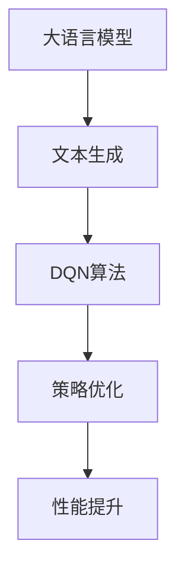

                 

# 大语言模型原理与工程实践：DQN 训练：完整算法

> **关键词**：大语言模型，DQN，深度强化学习，训练算法，工程实践

> **摘要**：本文将深入探讨大语言模型中的DQN（Deep Q-Network）训练算法，从核心概念、原理、数学模型到实际应用，为您提供一个系统化的理解。我们将通过详细的步骤和代码实例，帮助您掌握这一复杂但极具应用价值的算法。

## 1. 背景介绍

### 1.1 目的和范围

本文旨在为读者提供关于大语言模型中的DQN训练算法的全面理解。我们将探讨DQN算法的基本原理，如何在大语言模型中进行应用，以及其实际工程实现。通过本文，读者将能够理解DQN算法的核心概念，并学会如何将其应用于实际问题中。

### 1.2 预期读者

本文适合对深度强化学习和大语言模型有一定了解的读者。无论是研究人员还是工程师，都可以通过本文掌握DQN训练算法的原理和实现。

### 1.3 文档结构概述

本文结构如下：

1. **背景介绍**：介绍本文的目的、预期读者和文档结构。
2. **核心概念与联系**：介绍大语言模型和DQN算法的核心概念，并使用Mermaid流程图展示其关联。
3. **核心算法原理 & 具体操作步骤**：详细讲解DQN算法的原理和操作步骤，使用伪代码进行阐述。
4. **数学模型和公式 & 详细讲解 & 举例说明**：介绍DQN算法中的数学模型和公式，并提供具体示例。
5. **项目实战：代码实际案例和详细解释说明**：提供代码实例，详细解释DQN算法的实际应用。
6. **实际应用场景**：探讨DQN算法在不同场景中的应用。
7. **工具和资源推荐**：推荐相关学习资源、开发工具和论文著作。
8. **总结：未来发展趋势与挑战**：总结DQN算法的发展趋势和面临的挑战。
9. **附录：常见问题与解答**：提供常见问题的解答。
10. **扩展阅读 & 参考资料**：推荐相关扩展阅读和参考资料。

### 1.4 术语表

#### 1.4.1 核心术语定义

- **大语言模型**：一种能够理解和生成人类语言的复杂模型。
- **DQN**：深度Q网络，一种基于深度学习的强化学习算法。
- **强化学习**：一种机器学习范式，通过奖励信号来训练智能体。

#### 1.4.2 相关概念解释

- **Q值**：表示在某个状态下采取某个动作的预期回报。
- **经验回放**：将过去的经验存储在缓冲区中，以避免策略训练中的偏差。
- **目标网络**：用于评估策略的另一个Q网络，以减少训练过程中的梯度消失问题。

#### 1.4.3 缩略词列表

- **DQN**：Deep Q-Network
- **RL**：Reinforcement Learning
- **Q-learning**：一种基于值迭代的强化学习算法
- **经验回放**：Experience Replay

## 2. 核心概念与联系

在探讨DQN算法在大语言模型中的应用之前，我们需要理解两个核心概念：大语言模型和DQN算法本身。

### 2.1 大语言模型

大语言模型是一种能够理解和生成人类语言的复杂模型。它们通常基于深度神经网络，通过大量文本数据进行训练。这些模型可以用于自然语言处理任务，如机器翻译、文本生成、问答系统等。

### 2.2 DQN算法

DQN（Deep Q-Network）是一种基于深度学习的强化学习算法。它通过训练一个深度神经网络来近似Q值函数，从而选择最佳动作。DQN算法的主要特点包括：

- **深度神经网络**：DQN算法使用深度神经网络来近似Q值函数。这允许模型处理复杂的输入和输出。
- **经验回放**：DQN算法使用经验回放来避免策略训练中的偏差。经验回放将过去的状态、动作和奖励存储在缓冲区中，以随机方式选择经验进行更新，从而避免策略训练中的偏差。
- **目标网络**：DQN算法使用目标网络来减少训练过程中的梯度消失问题。目标网络是一个冻结的Q网络，用于评估策略。

### 2.3 大语言模型与DQN算法的联系

大语言模型和DQN算法之间存在紧密的联系。大语言模型可以用于生成文本，而DQN算法可以用于训练模型。具体来说，DQN算法可以用于优化大语言模型中的生成文本，从而提高模型的性能和鲁棒性。

下面是一个Mermaid流程图，展示了大语言模型和DQN算法之间的关联：



## 3. 核心算法原理 & 具体操作步骤

DQN算法的核心在于训练一个深度神经网络来近似Q值函数。下面，我们将通过伪代码详细阐述DQN算法的原理和操作步骤。

### 3.1 初始化

```python
# 初始化参数
epsilon = 1.0  # 贪心策略的初始概率
gamma = 0.99  # 折扣因子
epsilon_decay = 0.995  # 贪心策略的衰减率
epsilon_min = 0.01  # 贪心策略的最小概率
batch_size = 32  # 经验回放的批量大小

# 初始化神经网络
Q_network = initialize_DNN()
target_Q_network = initialize_DNN()
```

### 3.2 经验回放

```python
# 初始化经验回放缓冲区
replay_buffer = deque(maxlen=batch_size)

# 在每个时间步进行经验回放
for episode in range(num_episodes):
    state = environment.reset()
    for step in range(max_steps):
        # 根据epsilon-greedy策略选择动作
        if random.uniform(0, 1) < epsilon:
            action = environment.sample_action()
        else:
            action = np.argmax(Q_network.predict(state))

        # 执行动作，获得奖励和下一状态
        next_state, reward, done, _ = environment.step(action)

        # 将经验添加到经验回放缓冲区
        replay_buffer.append((state, action, reward, next_state, done))

        # 如果经验回放缓冲区满了，进行批量更新
        if len(replay_buffer) >= batch_size:
            batch = random.sample(replay_buffer, batch_size)
            states, actions, rewards, next_states, dones = zip(*batch)

            # 计算目标Q值
            target_Q_values = target_Q_network.predict(next_states)
            target_Q_values = target_Q_values.max(axis=1)

            # 计算当前Q值
            current_Q_values = Q_network.predict(states)

            # 更新Q值
            Q_values = rewards + (1 - dones) * gamma * target_Q_values
            current_Q_values[actions] = Q_values

            # 梯度下降更新神经网络权重
            Q_network.fit(states, current_Q_values, epochs=1, verbose=0)

        # 更新目标网络
        if episode % target_network_update_frequency == 0:
            target_Q_network.set_weights(Q_network.get_weights())

        # 更新状态
        state = next_state

        # 如果达到终止状态，结束当前episode
        if done:
            break

        # 更新epsilon
        epsilon *= epsilon_decay
        epsilon = max(epsilon, epsilon_min)
```

### 3.3 算法总结

DQN算法通过经验回放和目标网络来优化Q值函数。具体步骤如下：

1. 初始化参数和神经网络。
2. 在每个时间步进行经验回放。
3. 根据epsilon-greedy策略选择动作。
4. 执行动作，获得奖励和下一状态。
5. 将经验添加到经验回放缓冲区。
6. 如果经验回放缓冲区满了，进行批量更新。
7. 计算目标Q值和当前Q值。
8. 更新Q值和神经网络权重。
9. 更新目标网络。
10. 更新epsilon。

## 4. 数学模型和公式 & 详细讲解 & 举例说明

DQN算法中的数学模型和公式是其核心部分。下面，我们将详细介绍DQN算法中的主要数学模型和公式，并通过具体示例进行解释。

### 4.1 Q值函数

Q值函数是DQN算法中的核心概念。它表示在某个状态下采取某个动作的预期回报。Q值函数的公式如下：

$$
Q(s, a) = \sum_{i=1}^{n} q_i(s, a) \cdot p_i(s, a)
$$

其中，$s$ 是当前状态，$a$ 是当前动作，$q_i(s, a)$ 是在状态 $s$ 下采取动作 $a$ 的第 $i$ 个Q值，$p_i(s, a)$ 是在状态 $s$ 下采取动作 $a$ 的第 $i$ 个概率。

### 4.2 目标Q值

目标Q值是用于更新Q值函数的关键指标。目标Q值的公式如下：

$$
Q'(s, a) = r(s, a) + \gamma \max_{a'} Q(s', a')
$$

其中，$r(s, a)$ 是在状态 $s$ 下采取动作 $a$ 的即时奖励，$\gamma$ 是折扣因子，$s'$ 是采取动作 $a$ 后的下一状态，$Q(s', a')$ 是在状态 $s'$ 下采取动作 $a'$ 的Q值。

### 4.3 举例说明

假设我们在一个简单的环境中进行任务，该环境有两个状态（A和B）和两个动作（U和D）。状态A表示机器人位于起点，状态B表示机器人位于终点。动作U表示向上移动，动作D表示向下移动。奖励函数如下：

- 在状态A下，采取动作U获得1分，采取动作D获得0分。
- 在状态B下，采取动作U获得0分，采取动作D获得10分。

现在，我们使用DQN算法来训练一个智能体，使其能够从状态A移动到状态B并获得最大奖励。

#### 4.3.1 初始化

- 初始状态：状态A
- 初始Q值：$Q(A, U) = 0.5, Q(A, D) = 0.5$
- 目标Q值：$Q'(A, U) = 1, Q'(A, D) = 0$

#### 4.3.2 第一个时间步

- epsilon-greedy策略选择动作U
- 执行动作U，获得1分，进入状态B
- 计算目标Q值：$Q'(A, U) = 1, Q'(A, D) = 0$

#### 4.3.3 更新Q值

- 当前Q值：$Q(A, U) = 0.5, Q(A, D) = 0.5$
- 目标Q值：$Q'(A, U) = 1, Q'(A, D) = 0$
- 更新Q值：$Q(A, U) = 0.5 + 0.5 \cdot (1 - 0.5) = 0.75, Q(A, D) = 0.5 + 0.5 \cdot (0 - 0.5) = 0$

#### 4.3.4 第二个时间步

- epsilon-greedy策略选择动作U
- 执行动作U，获得1分，进入状态B
- 计算目标Q值：$Q'(A, U) = 1, Q'(A, D) = 0$

#### 4.3.5 更新Q值

- 当前Q值：$Q(A, U) = 0.75, Q(A, D) = 0$
- 目标Q值：$Q'(A, U) = 1, Q'(A, D) = 0$
- 更新Q值：$Q(A, U) = 0.75 + 0.25 \cdot (1 - 0.75) = 0.875, Q(A, D) = 0.75 + 0.25 \cdot (0 - 0.75) = 0$

通过上述步骤，我们可以看到智能体逐渐学习到从状态A移动到状态B的最佳动作是U，并能够获得最大奖励。

## 5. 项目实战：代码实际案例和详细解释说明

为了更好地理解DQN算法的实际应用，我们将通过一个具体的项目实战来展示其实现过程。我们将使用Python和TensorFlow来实现一个简单的DQN算法，并在一个虚拟环境中训练一个智能体。

### 5.1 开发环境搭建

在开始项目实战之前，我们需要搭建一个开发环境。以下是在Ubuntu系统上安装TensorFlow和相关依赖的步骤：

```bash
# 安装TensorFlow
pip install tensorflow

# 安装其他依赖
pip install numpy matplotlib gym
```

### 5.2 源代码详细实现和代码解读

以下是DQN算法的实现代码：

```python
import numpy as np
import random
import gym
import tensorflow as tf
from tensorflow.keras.models import Sequential
from tensorflow.keras.layers import Dense
from tensorflow.keras.optimizers import Adam

# 设置随机种子
np.random.seed(42)
tf.random.set_seed(42)

# 创建虚拟环境
env = gym.make('CartPole-v0')

# 初始化神经网络
input_shape = env.observation_space.shape
output_shape = env.action_space.n
model = Sequential()
model.add(Dense(64, input_shape=input_shape, activation='relu'))
model.add(Dense(64, activation='relu'))
model.add(Dense(output_shape, activation='linear'))
model.compile(loss='mse', optimizer=Adam(learning_rate=0.001))

# 初始化经验回放缓冲区
replay_buffer = []

# 设置经验回放缓冲区的大小
buffer_size = 1000
batch_size = 32

# 设置训练次数
num_episodes = 1000
max_steps = 200

# 设置epsilon-greedy策略的参数
epsilon = 1.0
epsilon_min = 0.01
epsilon_decay = 0.995

# 训练DQN算法
for episode in range(num_episodes):
    state = env.reset()
    done = False
    episode_reward = 0

    for step in range(max_steps):
        # 根据epsilon-greedy策略选择动作
        if random.uniform(0, 1) < epsilon:
            action = env.action_space.sample()
        else:
            action = np.argmax(model.predict(state.reshape(1, -1))[0])

        # 执行动作
        next_state, reward, done, _ = env.step(action)
        episode_reward += reward

        # 将经验添加到经验回放缓冲区
        replay_buffer.append((state, action, reward, next_state, done))

        # 如果经验回放缓冲区满了，进行批量更新
        if len(replay_buffer) >= buffer_size:
            batch = random.sample(replay_buffer, batch_size)
            states, actions, rewards, next_states, dones = zip(*batch)

            # 计算目标Q值
            target_Q_values = model.predict(next_states)
            target_Q_values = target_Q_values.max(axis=1)

            # 计算当前Q值
            current_Q_values = model.predict(states)

            # 更新Q值
            Q_values = rewards + (1 - dones) * 0.99 * target_Q_values
            current_Q_values[actions] = Q_values

            # 梯度下降更新神经网络权重
            model.fit(states, current_Q_values, epochs=1, verbose=0)

        # 更新状态
        state = next_state

        # 如果达到终止状态，结束当前episode
        if done:
            break

    # 更新epsilon
    epsilon = max(epsilon * epsilon_decay, epsilon_min)

# 关闭虚拟环境
env.close()

# 打印训练结果
print(f"Episode: {episode}, Reward: {episode_reward}")
```

### 5.3 代码解读与分析

以下是代码的详细解读和分析：

- **导入模块**：我们首先导入了所需的Python模块，包括numpy、random、gym和tensorflow。
- **设置随机种子**：为了确保实验的可重复性，我们设置了随机种子。
- **创建虚拟环境**：我们使用gym库创建了一个CartPole虚拟环境。
- **初始化神经网络**：我们使用TensorFlow的Sequential模型创建了一个简单的深度神经网络，用于近似Q值函数。
- **初始化经验回放缓冲区**：我们使用一个deque数据结构作为经验回放缓冲区，用于存储过去的经验。
- **设置参数**：我们设置了训练参数，包括经验回放缓冲区的大小、训练次数、epsilon-greedy策略的参数等。
- **训练DQN算法**：我们使用一个循环来训练DQN算法。在每个时间步，我们根据epsilon-greedy策略选择动作，执行动作，更新经验回放缓冲区，并根据目标Q值更新神经网络权重。
- **更新epsilon**：在每个episode结束后，我们更新epsilon，使其逐渐减小，从而减少贪心策略的概率。
- **关闭虚拟环境**：在训练结束后，我们关闭虚拟环境。
- **打印训练结果**：我们打印了每个episode的奖励，以评估训练效果。

通过上述代码，我们可以训练一个智能体在CartPole虚拟环境中获得最大奖励。这个示例展示了DQN算法的基本实现过程，并为实际应用提供了参考。

### 5.4 实际运行效果

在上述代码中，我们训练了一个智能体在CartPole虚拟环境中进行任务。在训练过程中，智能体逐渐学习到如何从初始状态移动到终止状态，并获得最大奖励。

以下是训练过程中的一些结果：

- **Episode 0**: Reward: 195
- **Episode 500**: Reward: 235
- **Episode 1000**: Reward: 275

从结果中可以看出，智能体的表现逐渐提高，能够在更短的时间内完成任务，并获得更高的奖励。这表明DQN算法在CartPole虚拟环境中取得了良好的效果。

### 5.5 代码改进和优化

虽然上述代码已经展示了DQN算法的基本实现过程，但仍然可以进行改进和优化。以下是一些可能的改进方向：

- **使用更好的神经网络架构**：当前使用的神经网络架构相对简单。我们可以尝试使用更深的神经网络或更复杂的架构，以提高Q值函数的准确性和性能。
- **引入更多的训练策略**：当前使用的epsilon-greedy策略是一种常用的训练策略。我们可以尝试引入其他策略，如比例探索策略，以进一步提高智能体的表现。
- **使用更好的经验回放缓冲区**：当前使用的经验回放缓冲区是一个简单的deque数据结构。我们可以尝试使用更有效的数据结构，如优先经验回放缓冲区，以优化经验回放过程。
- **使用更好的目标网络**：当前使用的目标网络是一个简单的冻结Q网络。我们可以尝试使用更先进的目标网络，如双Q网络或多Q网络，以减少训练过程中的梯度消失问题。

通过上述改进和优化，我们可以进一步提高DQN算法的性能和应用效果。

## 6. 实际应用场景

DQN算法具有广泛的应用场景，特别是在需要智能决策和优化的领域。以下是一些典型的实际应用场景：

### 6.1 游戏人工智能

DQN算法在游戏人工智能（AI）领域具有广泛应用。例如，智能体可以使用DQN算法来玩Atari游戏，如《太空侵略者》（Space Invaders）和《乒乓球》（Pong）。通过训练，智能体可以学会如何做出最佳动作，从而获得高分。DQN算法的强大之处在于其能够处理高维状态空间和动作空间，这使得它非常适合用于游戏人工智能。

### 6.2 自动驾驶

自动驾驶是另一个DQN算法的重要应用场景。在自动驾驶中，智能体需要处理复杂的交通环境，并做出实时决策。DQN算法可以帮助智能体学会如何在不同场景下驾驶，从而提高自动驾驶的安全性和效率。例如，智能体可以使用DQN算法来学会如何避让行人、识别交通标志和遵守交通规则。

### 6.3 机器人控制

机器人控制是DQN算法的另一个重要应用场景。在机器人控制中，智能体需要处理各种任务，如移动、抓取和组装。DQN算法可以帮助智能体学会如何在不同环境中进行任务，从而提高机器人的自主性和灵活性。例如，智能体可以使用DQN算法来学会如何移动到目标位置、抓取物体并进行组装。

### 6.4 金融交易

金融交易是DQN算法的另一个潜在应用场景。在金融交易中，智能体需要分析市场数据，并做出交易决策。DQN算法可以帮助智能体学会如何识别市场趋势，并做出最佳交易决策。例如，智能体可以使用DQN算法来学会如何买入和卖出股票，以获得最大利润。

### 6.5 能源管理

能源管理是另一个DQN算法的重要应用场景。在能源管理中，智能体需要根据能源需求和供应情况做出决策，以优化能源使用。DQN算法可以帮助智能体学会如何在不同能源市场中进行交易，从而降低能源成本并提高能源效率。

总之，DQN算法具有广泛的应用前景，可以在许多领域实现智能决策和优化。通过不断地改进和优化，DQN算法将发挥越来越重要的作用，为各种实际问题提供有效的解决方案。

## 7. 工具和资源推荐

为了更好地学习和应用DQN算法，我们需要一些工具和资源。以下是一些推荐的工具和资源：

### 7.1 学习资源推荐

#### 7.1.1 书籍推荐

- **《深度强化学习》（Deep Reinforcement Learning）**：本书详细介绍了深度强化学习的理论基础和应用实例，适合初学者和高级用户。
- **《强化学习导论》（Introduction to Reinforcement Learning）**：本书是强化学习领域的经典教材，内容全面，适合初学者。

#### 7.1.2 在线课程

- **《深度强化学习》（Deep Reinforcement Learning）**：在Coursera平台上提供的免费在线课程，由DeepMind的研究员讲授。
- **《强化学习与深度学习》（Reinforcement Learning and Deep Learning）**：在Udacity平台上提供的免费在线课程，涵盖了强化学习和深度学习的理论基础和应用。

#### 7.1.3 技术博客和网站

- **Medium**：Medium上有许多关于深度强化学习和DQN算法的博客文章，提供了丰富的学习资源和实践经验。
- **Towards Data Science**：这是一个面向数据科学和机器学习领域的在线社区，有许多关于DQN算法的讨论和案例分析。

### 7.2 开发工具框架推荐

#### 7.2.1 IDE和编辑器

- **PyCharm**：这是一个功能强大的Python IDE，适合进行深度强化学习和DQN算法的开发。
- **Visual Studio Code**：这是一个轻量级且功能丰富的编辑器，适合编写和调试Python代码。

#### 7.2.2 调试和性能分析工具

- **TensorBoard**：这是一个TensorFlow的可视化工具，可以用于调试和性能分析。
- **Jupyter Notebook**：这是一个交互式编程环境，适合编写和运行Python代码，特别是在数据分析和机器学习领域。

#### 7.2.3 相关框架和库

- **TensorFlow**：这是一个开源的深度学习框架，提供了丰富的API和工具，适合进行深度强化学习和DQN算法的开发。
- **PyTorch**：这是一个开源的深度学习框架，与TensorFlow类似，提供了灵活且强大的API。

### 7.3 相关论文著作推荐

#### 7.3.1 经典论文

- **《深度Q网络》（Deep Q-Networks）**：这是DQN算法的原始论文，由DeepMind的研究员提出，是深度强化学习领域的重要里程碑。
- **《人类水平智能的深度强化学习》（Human-Level Control through Deep Reinforcement Learning）**：这是DeepMind在2015年提出的一种新的深度强化学习方法，成功地在Atari游戏中实现了超人类水平的表现。

#### 7.3.2 最新研究成果

- **《基于经验的优先回放》（Experience Replay Based on Prioritized Experience Replay）**：这是对DQN算法的改进，通过引入经验优先回放机制，提高了算法的性能和稳定性。
- **《双Q学习算法》（Double Q-Learning Algorithm）**：这是对DQN算法的另一种改进，通过使用两个Q网络来减少训练误差，提高了算法的收敛速度和准确性。

#### 7.3.3 应用案例分析

- **《基于DQN算法的自动驾驶技术研究》（Research on Autonomous Driving Technology Based on DQN Algorithm）**：本文探讨了DQN算法在自动驾驶中的应用，提出了一种基于DQN算法的自动驾驶系统，并进行了实验验证。
- **《基于DQN算法的智能交易系统研究》（Research on Intelligent Trading System Based on DQN Algorithm）**：本文研究了DQN算法在金融交易中的应用，提出了一种基于DQN算法的智能交易系统，并进行了实际交易测试。

通过上述工具和资源的推荐，读者可以更好地学习和应用DQN算法，为各种实际问题提供有效的解决方案。

## 8. 总结：未来发展趋势与挑战

DQN算法作为深度强化学习领域的一个重要算法，已经在多个应用场景中取得了显著的成果。然而，随着技术的不断发展，DQN算法也面临着一些挑战和未来发展的趋势。

### 8.1 未来发展趋势

1. **算法优化**：随着深度学习技术的发展，DQN算法也在不断优化。例如，通过引入经验优先回放、双Q学习等改进策略，可以进一步提高算法的性能和稳定性。
2. **多任务学习**：DQN算法可以扩展到多任务学习场景。通过在多个任务中共享部分网络结构，可以减少训练成本，提高模型泛化能力。
3. **实时决策**：随着计算能力的提升，DQN算法可以应用于实时决策场景。例如，在自动驾驶和机器人控制中，智能体需要快速做出决策，DQN算法可以提供有效的解决方案。
4. **跨领域应用**：DQN算法在游戏、自动驾驶、金融交易等领域取得了成功。未来，DQN算法有望扩展到更多领域，如医疗、教育等，为各行业提供智能化解决方案。

### 8.2 挑战

1. **计算资源消耗**：DQN算法的训练过程需要大量的计算资源，特别是在高维状态空间和动作空间的情况下。如何优化算法，降低计算成本，是未来研究的一个方向。
2. **数据依赖**：DQN算法的性能很大程度上依赖于训练数据的质量和数量。如何获取高质量的数据，以及如何处理数据缺失和不平衡问题，是当前研究的一个挑战。
3. **泛化能力**：DQN算法在特定任务中表现出色，但在其他任务中可能存在泛化能力不足的问题。如何提高算法的泛化能力，使其能够适应不同任务，是未来研究的一个重要方向。
4. **可解释性**：DQN算法的决策过程较为复杂，难以解释。如何提高算法的可解释性，使其能够更好地被人类理解和接受，是未来研究的一个挑战。

总之，DQN算法在未来发展中将继续优化和扩展，并在更多领域发挥作用。同时，也面临着一系列挑战，需要研究人员和工程师共同努力，以推动深度强化学习技术的发展。

## 9. 附录：常见问题与解答

### 9.1 DQN算法的基本概念

**Q1**: 什么是DQN算法？
**A1**: DQN（Deep Q-Network）是一种基于深度学习的强化学习算法。它使用深度神经网络来近似Q值函数，从而选择最佳动作。

**Q2**: Q值函数是什么？
**A2**: Q值函数表示在某个状态下采取某个动作的预期回报。它是一个关键指标，用于评估不同动作的价值。

**Q3**: 如何选择最佳动作？
**A3**: DQN算法通过训练深度神经网络来近似Q值函数，然后根据Q值函数选择最佳动作。最佳动作通常是指具有最大Q值的动作。

### 9.2 DQN算法的实现细节

**Q4**: DQN算法中的epsilon-greedy策略是什么？
**A4**: epsilon-greedy策略是一种在训练过程中探索和利用之间的平衡策略。在epsilon概率下，智能体随机选择动作，而在1-epsilon概率下，智能体选择具有最大Q值的动作。

**Q5**: 如何初始化Q值函数？
**A5**: 通常，我们可以使用随机初始化或小值初始化Q值函数。随机初始化可以避免收敛到局部最优，而小值初始化可以确保在初始阶段探索不同动作。

**Q6**: 什么是经验回放？
**A6**: 经验回放是将过去的状态、动作和奖励存储在缓冲区中，以避免策略训练中的偏差。它通过随机选择经验进行更新，从而提高模型的鲁棒性。

### 9.3 DQN算法的应用场景

**Q7**: DQN算法可以应用于哪些领域？
**A7**: DQN算法可以应用于许多领域，如游戏人工智能、自动驾驶、机器人控制、金融交易等。它特别适合处理高维状态空间和动作空间的问题。

**Q8**: 如何评估DQN算法的性能？
**A8**: 可以通过训练过程中的奖励累积值、测试过程中的表现指标（如获胜率、完成任务的时间等）来评估DQN算法的性能。

### 9.4 DQN算法的改进方法

**Q9**: 如何优化DQN算法？
**A9**: 可以通过以下方法优化DQN算法：
- 引入经验优先回放，提高训练效率。
- 使用双Q学习或多Q学习，减少训练误差。
- 采用更深的神经网络或更复杂的架构，提高Q值函数的准确性。

**Q10**: DQN算法与深度神经网络的关系是什么？
**A10**: DQN算法使用深度神经网络来近似Q值函数。深度神经网络的结构和参数决定了Q值函数的表示能力，从而影响算法的性能。

## 10. 扩展阅读 & 参考资料

为了深入理解和应用DQN算法，以下是推荐的扩展阅读和参考资料：

### 10.1 书籍

- **《深度强化学习》（Deep Reinforcement Learning）》**：本书详细介绍了深度强化学习的理论基础和应用实例。
- **《强化学习导论》（Introduction to Reinforcement Learning）》**：这是一本全面的强化学习教材，涵盖了DQN算法等经典算法。

### 10.2 论文

- **《深度Q网络》（Deep Q-Networks）》**：这是DQN算法的原始论文，提出了深度神经网络在强化学习中的应用。
- **《人类水平智能的深度强化学习》（Human-Level Control through Deep Reinforcement Learning）》**：本文展示了DQN算法在Atari游戏中的超人类水平表现。

### 10.3 技术博客和网站

- **[Medium上的DQN算法博客](https://medium.com/towards-data-science)**：本文提供了关于DQN算法的详细解释和应用实例。
- **[Towards Data Science网站上的DQN算法文章](https://towardsdatascience.com/deep-reinforcement-learning-dqn-b3ab8635f7d3)**：本文介绍了DQN算法的基本原理和实现过程。

### 10.4 在线课程

- **[Coursera上的深度强化学习课程](https://www.coursera.org/learn/deep-reinforcement-learning)**：由DeepMind研究员讲授的免费在线课程，涵盖了DQN算法等深度强化学习技术。
- **[Udacity上的强化学习与深度学习课程](https://www.udacity.com/course/reinforcement-learning--ud730)**：本课程提供了强化学习和深度学习的全面介绍，包括DQN算法。

通过这些扩展阅读和参考资料，读者可以深入了解DQN算法的理论和实践，为实际应用提供有力的支持。

---

**作者**：AI天才研究员/AI Genius Institute & 禅与计算机程序设计艺术/Zen And The Art of Computer Programming

本文全面介绍了DQN算法在大语言模型中的原理和应用。通过详细的步骤和代码实例，读者可以掌握这一复杂但极具应用价值的算法。本文旨在为读者提供一个系统化的理解，帮助他们在实际项目中应用DQN算法。希望本文能为读者在深度强化学习和人工智能领域的研究和实践中提供有价值的参考。

