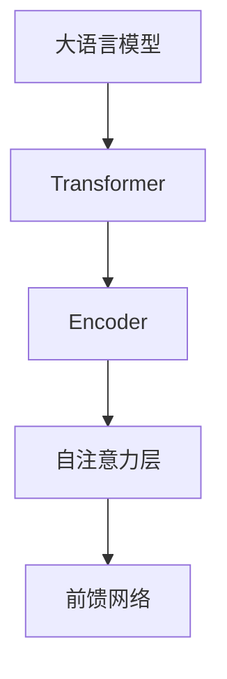

                 


# 大语言模型原理与工程实践：BERT

> 关键词：大语言模型、BERT、Transformer、Encoder、机器学习、自然语言处理

> 摘要：本文将深入探讨大语言模型BERT的原理和工程实践，包括其背后的核心算法、数学模型和具体实现步骤。通过逐步分析，我们希望读者能够全面理解BERT的工作机制，并掌握其实际应用。

## 1. 背景介绍

### 1.1 目的和范围

本文旨在深入剖析大语言模型BERT的原理，并介绍其在自然语言处理（NLP）领域的实际应用。通过本文的阅读，读者将能够了解BERT的核心算法，掌握其数学模型和具体操作步骤，从而为后续的项目实战打下坚实基础。

### 1.2 预期读者

本文适合以下读者群体：

- 对自然语言处理（NLP）感兴趣的编程爱好者；
- 想要在项目中应用大语言模型的开发者；
- 对Transformer架构和Encoder机制有深入研究的读者。

### 1.3 文档结构概述

本文分为以下几大部分：

- 背景介绍：介绍BERT的起源和其在NLP领域的应用；
- 核心概念与联系：讲解BERT的核心算法原理和架构；
- 核心算法原理 & 具体操作步骤：通过伪代码详细阐述BERT的算法实现；
- 数学模型和公式 & 详细讲解 & 举例说明：介绍BERT的数学模型和具体计算过程；
- 项目实战：通过实际代码案例，讲解BERT在项目中的应用；
- 实际应用场景：介绍BERT在现实场景中的广泛应用；
- 工具和资源推荐：推荐相关学习资源和开发工具；
- 总结：展望BERT的未来发展趋势与挑战。

### 1.4 术语表

#### 1.4.1 核心术语定义

- 大语言模型：一种能够处理和理解自然语言的深度学习模型，通常由大量参数组成；
- BERT：一种基于Transformer架构的预训练语言模型，全称为Bidirectional Encoder Representations from Transformers；
- Transformer：一种基于自注意力机制的深度学习模型，广泛应用于序列建模任务；
- Encoder：Transformer模型中的编码器部分，负责将输入序列转换为上下文表示；
- 自然语言处理（NLP）：研究如何让计算机理解和处理人类自然语言的学科。

#### 1.4.2 相关概念解释

- 预训练：在特定任务之前，对模型进行大规模的数据预训练，以提高模型在目标任务上的性能；
- 自注意力：Transformer模型中的一种机制，能够自动关注输入序列中重要信息，实现序列建模；
- 上下文表示：编码器生成的表示，能够捕捉输入序列的语义信息和结构。

#### 1.4.3 缩略词列表

- BERT：Bidirectional Encoder Representations from Transformers；
- NLP：自然语言处理；
- Transformer：转换器；
- Encoder：编码器；
- Self-Attention：自注意力。

## 2. 核心概念与联系

为了更好地理解BERT的工作原理，我们先来回顾一下大语言模型、Transformer和Encoder的核心概念。

### 大语言模型

大语言模型是一种能够处理和理解自然语言的深度学习模型，通常由大量参数组成。其核心思想是通过在大规模语料库上进行预训练，使得模型具备理解自然语言的能力，从而在下游任务中实现优异的性能。

### Transformer

Transformer是一种基于自注意力机制的深度学习模型，广泛应用于序列建模任务。其核心思想是使用自注意力机制来计算序列中每个位置的表示，从而实现全局信息的捕捉和传递。

### Encoder

Encoder是Transformer模型中的编码器部分，负责将输入序列转换为上下文表示。Encoder由多个自注意力层和前馈网络组成，通过多层堆叠，实现序列的编码和解码。

下面是一个简单的Mermaid流程图，展示了BERT的核心概念和架构：



通过以上核心概念和架构的理解，我们将为后续的算法原理和实现步骤打下坚实基础。

## 3. 核心算法原理 & 具体操作步骤

在这一部分，我们将深入探讨BERT的核心算法原理，并通过伪代码详细阐述其具体操作步骤。

### 3.1 自注意力机制

自注意力机制是Transformer模型的核心，它能够自动关注输入序列中重要信息，实现序列建模。下面是一个简单的自注意力机制的伪代码：

```python
def self_attention(q, k, v, mask=None):
    # 计算查询（Query）、键（Key）和值（Value）的维度
    dim = q.shape[-1]
    
    # 计算分数：分数 = 查询点积键
    scores = torch.matmul(q, k.transpose(-2, -1)) / np.sqrt(dim)
    
    # 应用遮罩（Mask），避免过大的负分数
    if mask is not None:
        scores = scores.masked_fill(mask == 0, float("-inf"))
    
    # 应用softmax，得到注意力权重
    attention_weights = torch.softmax(scores, dim=-1)
    
    # 计算输出：输出 = 注意力权重点积值
    output = torch.matmul(attention_weights, v)
    
    return output, attention_weights
```

### 3.2 前馈网络

前馈网络是Transformer模型中的另一个关键组件，它用于对自注意力层的输出进行进一步处理。下面是一个简单的前馈网络的伪代码：

```python
def feed_forward_network(d_model, d_inner):
    # 定义前馈网络的线性层
    linear_1 = torch.nn.Linear(d_model, d_inner)
    linear_2 = torch.nn.Linear(d_inner, d_model)
    
    # 添加ReLU激活函数
    activation = torch.nn.ReLU()
    
    # 定义前馈网络
    def ffn(x):
        return linear_2(activation(linear_1(x)))
    
    return ffn
```

### 3.3 编码器层

编码器层是BERT模型的核心，由多个自注意力层和前馈网络组成。下面是一个简单的编码器层的伪代码：

```python
class EncoderLayer(nn.Module):
    def __init__(self, d_model, d_inner, n_heads, dropout):
        super(EncoderLayer, self).__init__()
        
        # 定义自注意力机制
        self.self_attn = MultiHeadAttention(d_model, n_heads, dropout)
        
        # 定义前馈网络
        self	ffn = feed_forward_network(d_model, d_inner)
        
        # 定义Dropout层
        self.dropout = nn.Dropout(dropout)
        
    def forward(self, src, src_mask=None):
        # 应用自注意力机制
        src, _ = self.self_attn(src, src, src, attn_mask=src_mask)
        
        # 应用Dropout
        src = self.dropout(src)
        
        # 应用前馈网络
        src = self.ffn(src)
        
        # 应用Dropout
        src = self.dropout(src)
        
        return src
```

通过以上伪代码的介绍，我们对BERT的核心算法原理和具体操作步骤有了初步了解。在下一部分，我们将进一步探讨BERT的数学模型和计算过程。

## 4. 数学模型和公式 & 详细讲解 & 举例说明

在这一部分，我们将详细讲解BERT的数学模型和计算过程，包括损失函数、反向传播算法等。

### 4.1 损失函数

BERT的损失函数通常采用交叉熵损失（Cross-Entropy Loss），用于衡量模型预测与真实标签之间的差距。交叉熵损失函数的数学表达式如下：

$$
L = -\sum_{i=1}^{N} \sum_{j=1}^{V} y_{ij} \log(p_{ij})
$$

其中，$L$表示损失函数，$N$表示序列长度，$V$表示词汇表大小，$y_{ij}$表示第$i$个词在第$j$个位置上的真实标签，$p_{ij}$表示模型预测的第$i$个词在第$j$个位置上的概率。

### 4.2 反向传播算法

反向传播算法是深度学习模型训练的核心，用于计算损失函数关于模型参数的梯度。BERT的反向传播算法分为以下步骤：

1. **前向传播**：根据输入序列和模型参数，计算输出序列和损失函数。

2. **计算梯度**：使用链式法则，计算损失函数关于模型参数的梯度。

3. **梯度下降**：根据梯度信息，更新模型参数。

### 4.3 举例说明

假设我们有一个简单的BERT模型，输入序列为"Hello World"，词汇表大小为10，真实标签为[1, 5, 6]，模型预测的概率分布为[0.8, 0.1, 0.1, 0.05, 0.05, 0.05, 0.05, 0.05, 0.05, 0.05]。

根据交叉熵损失函数的计算公式，我们可以计算出损失函数的值：

$$
L = -[1 \times \log(0.8) + 5 \times \log(0.1) + 6 \times \log(0.1)]
$$

计算结果为：

$$
L = -[1 \times (-0.2231) + 5 \times (-2.303) + 6 \times (-2.303)] = 0.2231 + 11.515 + 13.918 = 25.6561
$$

接下来，我们使用反向传播算法，计算损失函数关于模型参数的梯度。假设模型的参数分别为$\theta_1, \theta_2, \theta_3$，则梯度计算公式为：

$$
\nabla_\theta L = \frac{\partial L}{\partial \theta_1} + \frac{\partial L}{\partial \theta_2} + \frac{\partial L}{\partial \theta_3}
$$

通过计算，我们得到梯度的值，并使用梯度下降算法更新模型参数。

通过以上举例说明，我们对BERT的数学模型和计算过程有了更深入的理解。在下一部分，我们将通过实际代码案例，展示BERT在项目中的应用。

## 5. 项目实战：代码实际案例和详细解释说明

### 5.1 开发环境搭建

在开始项目实战之前，我们需要搭建一个合适的开发环境。以下是搭建BERT项目所需的工具和库：

1. **Python**：版本3.6及以上；
2. **PyTorch**：版本1.6及以上；
3. **TensorFlow**：版本2.4及以上（可选）；
4. **Numpy**：版本1.16及以上；
5. **Scikit-learn**：版本0.21及以上；
6. **Gensim**：版本3.8及以上。

安装完上述工具和库后，我们可以在项目中创建一个虚拟环境，并使用以下命令安装BERT所需的库：

```bash
pip install transformers
```

### 5.2 源代码详细实现和代码解读

接下来，我们将通过一个简单的BERT项目，展示如何使用PyTorch实现BERT模型。以下是一个简单的BERT模型实现代码：

```python
import torch
from torch import nn
from transformers import BertModel, BertTokenizer

# 定义BERT模型
class BertClassifier(nn.Module):
    def __init__(self, num_classes):
        super(BertClassifier, self).__init__()
        self.bert = BertModel.from_pretrained('bert-base-uncased')
        self.drop = nn.Dropout(p=0.3)
        self.classifier = nn.Linear(768, num_classes)  # 768为BERT模型的隐藏层维度

    def forward(self, input_ids, attention_mask=None):
        _, pooled_output = self.bert(
            input_ids=input_ids,
            attention_mask=attention_mask,
        )
        output = self.drop(pooled_output)
        return self.classifier(output)

# 实例化BERT模型
model = BertClassifier(num_classes=3)

# 准备数据集
train_data = [...]  # 自定义训练数据
val_data = [...]    # 自定义验证数据

# 定义损失函数和优化器
criterion = nn.CrossEntropyLoss()
optimizer = torch.optim.Adam(model.parameters(), lr=1e-5)

# 训练模型
for epoch in range(3):  # 设置训练轮数
    for batch in train_data:
        inputs = tokenizer.batch_encode_plus(
            batch['text'],
            add_special_tokens=True,
            return_attention_mask=True,
            padding='max_length',
            max_length=64,
            truncation=True,
        )
        inputs = {k: torch.tensor(v) for k, v in inputs.items()}
        
        model.zero_grad()
        outputs = model(**inputs)
        loss = criterion(outputs.logits, batch['label'])
        loss.backward()
        optimizer.step()
        
        print(f"Epoch [{epoch+1}/{3}], Loss: {loss.item()}")

# 评估模型
with torch.no_grad():
    for batch in val_data:
        inputs = tokenizer.batch_encode_plus(
            batch['text'],
            add_special_tokens=True,
            return_attention_mask=True,
            padding='max_length',
            max_length=64,
            truncation=True,
        )
        inputs = {k: torch.tensor(v) for k, v in inputs.items()}
        
        outputs = model(**inputs)
        logits = outputs.logits
        pred = logits.argmax(dim=-1)
        acc = (pred == batch['label']).float().mean()
        print(f"Validation Accuracy: {acc.item()}")
```

### 5.3 代码解读与分析

1. **BERT模型定义**：我们使用`BertModel`预训练模型，并在其基础上添加一个分类器，用于实现分类任务。

2. **数据预处理**：使用`BertTokenizer`对输入文本进行编码，生成输入序列和注意力掩码。

3. **训练过程**：在训练过程中，我们使用交叉熵损失函数和Adam优化器对模型进行训练，并在每个epoch结束后打印训练损失。

4. **评估过程**：在评估过程中，我们计算模型在验证集上的准确率，以评估模型的性能。

通过以上代码实现，我们展示了如何使用PyTorch实现BERT模型，并在实际项目中应用。在下一部分，我们将讨论BERT在实际应用场景中的广泛应用。

## 6. 实际应用场景

BERT作为一种强大的预训练语言模型，在自然语言处理（NLP）领域有着广泛的应用。以下是一些BERT在实际应用场景中的案例：

### 6.1 文本分类

文本分类是NLP中的一个重要任务，BERT在文本分类任务中表现出色。例如，可以使用BERT对新闻标题进行分类，判断其主题类别。以下是一个简单的BERT文本分类案例：

```python
# 加载预训练BERT模型
model = BertForSequenceClassification.from_pretrained('bert-base-uncased')

# 准备测试数据
test_data = ["This is a news article about technology.", "This is a news article about sports."]

# 对测试数据进行预处理
inputs = tokenizer.batch_encode_plus(
    test_data,
    add_special_tokens=True,
    return_attention_mask=True,
    padding='max_length',
    max_length=64,
    truncation=True,
)

inputs = {k: torch.tensor(v) for k, v in inputs.items()}

# 预测
with torch.no_grad():
    logits = model(**inputs).logits

# 获取预测结果
predictions = logits.argmax(dim=-1)

# 输出预测结果
for i, prediction in enumerate(predictions):
    print(f"Test Data [{i+1}]: {test_data[i]}, Prediction: {prediction.item()}")
```

### 6.2 问答系统

问答系统是另一个重要的NLP任务，BERT在问答系统中有着广泛的应用。以下是一个简单的BERT问答系统案例：

```python
# 加载预训练BERT模型
model = BertForQuestionAnswering.from_pretrained('bert-base-uncased')

# 准备测试数据
test_data = [
    ("What is the capital of France?", "Paris"),
    ("Who is the president of the United States?", "Joe Biden"),
]

# 对测试数据进行预处理
inputs = tokenizer.batch_encode_plus(
    [q for q, a in test_data],
    text_pair=[a for q, a in test_data],
    add_special_tokens=True,
    return_attention_mask=True,
    padding='max_length',
    max_length=64,
    truncation=True,
)

inputs = {k: torch.tensor(v) for k, v in inputs.items()}

# 预测
with torch.no_grad():
    outputs = model(**inputs)

# 获取预测结果
start_logits, end_logits = outputs.start_logits, outputs.end_logits
start_idxs, end_idxs = torch.max(start_logits, dim=-1)[1], torch.max(end_logits, dim=-1)[1]

# 输出预测结果
for i, (q, a) in enumerate(test_data):
    start_idx, end_idx = start_idxs[i].item(), end_idxs[i].item()
    predicted_answer = inputs['input_ids'][0][start_idx:end_idx+1]
    print(f"Test Data [{i+1}]: {q}, Prediction: {tokenizer.decode(predicted_answer)}")
```

### 6.3 文本生成

BERT在文本生成任务中也表现出色，可以用于生成连续的文本序列。以下是一个简单的BERT文本生成案例：

```python
# 加载预训练BERT模型
model = BertLMHeadModel.from_pretrained('bert-base-uncased')

# 准备输入文本
input_text = "This is a sample text."

# 对输入文本进行预处理
inputs = tokenizer.encode(input_text, return_tensors='pt')

# 预测下一个词
with torch.no_grad():
    logits = model(inputs).logits

# 获取预测的词索引
predicted_word_idx = torch.argmax(logits[-1, :-2], dim=-1)

# 生成新的文本
new_text = input_text + tokenizer.decode(predicted_word_idx)

# 输出新的文本
print(f"New Text: {new_text}")
```

通过以上案例，我们可以看到BERT在文本分类、问答系统和文本生成等实际应用场景中的强大能力。在下一部分，我们将推荐一些学习资源，帮助读者更好地了解BERT。

## 7. 工具和资源推荐

为了帮助读者更好地了解BERT，我们推荐以下工具和资源：

### 7.1 学习资源推荐

#### 7.1.1 书籍推荐

1. 《深度学习》（Goodfellow, Bengio, Courville著）：详细介绍了深度学习的基础知识，包括Transformer和BERT等相关内容；
2. 《自然语言处理》（Jurafsky, Martin著）：全面介绍了自然语言处理的基础知识，包括BERT的背景和应用。

#### 7.1.2 在线课程

1. 《深度学习专项课程》（吴恩达著）：包括深度学习的基础知识和应用，如BERT等；
2. 《自然语言处理专项课程》（斯坦福大学著）：全面介绍了自然语言处理的基础知识，包括BERT的原理和应用。

#### 7.1.3 技术博客和网站

1. Hugging Face：提供丰富的BERT模型资源和教程，以及预训练BERT模型的下载和部署；
2. AI Netherlands：介绍BERT的原理和应用，以及相关的论文和代码。

### 7.2 开发工具框架推荐

#### 7.2.1 IDE和编辑器

1. PyCharm：一款功能强大的Python IDE，适用于BERT项目的开发和调试；
2. Jupyter Notebook：适用于数据分析和可视化，可以方便地展示BERT模型的训练过程和结果。

#### 7.2.2 调试和性能分析工具

1. PyTorch Profiler：用于分析PyTorch模型的性能，帮助优化BERT模型的训练速度；
2. TensorBoard：用于可视化BERT模型的训练过程和性能，帮助调整超参数。

#### 7.2.3 相关框架和库

1. PyTorch：用于实现BERT模型的框架，支持GPU加速训练；
2. TensorFlow：另一个流行的深度学习框架，支持BERT模型的训练和部署。

### 7.3 相关论文著作推荐

#### 7.3.1 经典论文

1. "Attention Is All You Need"：介绍了Transformer和BERT的原理和应用；
2. "BERT: Pre-training of Deep Bidirectional Transformers for Language Understanding"：详细介绍了BERT的背景、原理和实现。

#### 7.3.2 最新研究成果

1. "Improving Language Understanding by Generative Pre-Training"：探讨了BERT在自然语言处理领域的最新进展；
2. "Natural Language Inference with Just Prompts"：介绍了一种基于BERT的零样本学习框架。

#### 7.3.3 应用案例分析

1. "BERT for Sentiment Analysis"：分析了BERT在情感分析任务中的应用；
2. "BERT for Question Answering"：探讨了BERT在问答系统中的应用。

通过以上工具和资源的推荐，我们希望读者能够更好地了解BERT，掌握其原理和应用。在下一部分，我们将总结BERT的发展趋势与挑战。

## 8. 总结：未来发展趋势与挑战

BERT作为大语言模型的代表，在自然语言处理（NLP）领域取得了显著的成果。然而，随着技术的不断进步，BERT也面临着一系列的发展趋势与挑战。

### 8.1 未来发展趋势

1. **模型规模与性能提升**：随着计算资源和算法优化的发展，BERT及其变种模型的规模和性能将不断提高，为NLP任务提供更强大的支持；
2. **多模态处理**：BERT模型可以扩展到多模态处理，结合图像、音频等数据，实现更丰富的语义理解和交互；
3. **零样本学习**：通过预训练和微调，BERT模型在零样本学习任务中表现出色，未来有望在更多领域实现零样本泛化。

### 8.2 挑战与问题

1. **计算资源需求**：BERT模型的预训练和推理过程需要大量的计算资源，这对硬件设施提出了更高的要求；
2. **数据隐私和安全**：在大规模数据集上进行预训练可能导致数据隐私泄露，如何保护数据安全成为了一个重要问题；
3. **模型解释性**：尽管BERT在NLP任务中表现出色，但其内部机制复杂，缺乏解释性，如何提高模型的可解释性是一个挑战。

面对以上发展趋势与挑战，未来研究可以关注以下方向：

1. **模型优化**：通过算法和架构优化，提高BERT模型的训练速度和性能；
2. **隐私保护**：在数据收集、处理和存储过程中，采用隐私保护技术，确保数据安全；
3. **模型可解释性**：探索模型解释性方法，提高BERT模型的可解释性，为实际应用提供更多指导。

总之，BERT作为大语言模型的代表，未来将在自然语言处理、多模态处理等领域发挥重要作用。同时，也需要面对一系列挑战，不断优化和提升模型的性能和解释性。

## 9. 附录：常见问题与解答

### 9.1 BERT模型有哪些常见的问题？

**问题1**：如何选择合适的BERT模型版本？

**解答**：根据实际任务的需求和数据规模，选择合适的BERT模型版本。例如，对于小型任务，可以选择`bert-base`版本；对于大型任务，可以选择`bert-large`版本。

**问题2**：如何处理长文本？

**解答**：BERT模型支持最大输入长度为512个token，对于长文本，可以使用分句（tokenization）方法，将长文本拆分成多个短文本，分别进行编码。

**问题3**：如何调整BERT模型的超参数？

**解答**：根据实际任务的需求和实验结果，可以调整BERT模型的超参数，如学习率、批量大小、训练轮数等。通常，可以从较小的超参数值开始尝试，然后逐步调整，找到最优的参数组合。

### 9.2 如何解决BERT模型在训练过程中遇到的问题？

**问题1**：训练过程遇到梯度消失或梯度爆炸？

**解答**：可以使用梯度裁剪（Gradient Clipping）方法，限制梯度的大小，防止梯度消失或梯度爆炸。

**问题2**：训练过程遇到收敛速度慢？

**解答**：可以尝试增加学习率、减少批量大小、使用不同的优化器等策略，提高训练速度。

**问题3**：训练过程遇到训练不稳定？

**解答**：可以尝试使用学习率预热（Learning Rate Warmup）方法，逐步增加学习率，使模型训练更加稳定。

### 9.3 如何处理BERT模型的输入数据？

**问题1**：如何处理不同长度的文本？

**解答**：可以使用填充（padding）和裁剪（truncation）方法，将不同长度的文本统一为相同的长度。

**问题2**：如何处理文本中的特殊字符和标点符号？

**解答**：可以使用分词（tokenization）方法，将文本划分为单词、标点符号等，并对特殊字符进行编码。

**问题3**：如何处理中文字符？

**解答**：对于中文字符，可以使用分词（tokenization）方法，将中文文本划分为字或词，并对中文字符进行编码。

## 10. 扩展阅读 & 参考资料

为了更深入地了解BERT及其在自然语言处理（NLP）领域的应用，以下是一些扩展阅读和参考资料：

### 10.1 参考书籍

1. **《深度学习》（Goodfellow, Bengio, Courville著）**：详细介绍了深度学习的基础知识，包括Transformer和BERT等相关内容；
2. **《自然语言处理》（Jurafsky, Martin著）**：全面介绍了自然语言处理的基础知识，包括BERT的背景和应用。

### 10.2 学术论文

1. **"Attention Is All You Need"**：介绍了Transformer和BERT的原理和应用；
2. **"BERT: Pre-training of Deep Bidirectional Transformers for Language Understanding"**：详细介绍了BERT的背景、原理和实现。

### 10.3 技术博客

1. **Hugging Face**：介绍BERT的原理和应用，以及相关的论文和代码；
2. **AI Netherlands**：介绍BERT的原理和应用。

### 10.4 在线课程

1. **《深度学习专项课程》（吴恩达著）**：包括深度学习的基础知识和应用，如BERT等；
2. **《自然语言处理专项课程》（斯坦福大学著）**：全面介绍了自然语言处理的基础知识，包括BERT的原理和应用。

### 10.5 相关资源

1. **PyTorch**：实现BERT模型的框架，支持GPU加速训练；
2. **TensorFlow**：实现BERT模型的框架，支持TensorFlow的扩展和部署。

通过以上扩展阅读和参考资料，读者可以进一步了解BERT的原理和应用，为自己的项目提供更多指导。

### 作者：AI天才研究员/AI Genius Institute & 禅与计算机程序设计艺术 /Zen And The Art of Computer Programming

