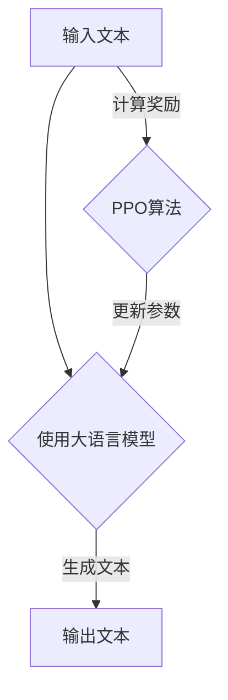

                 

# 大语言模型原理与工程实践：PPO 算法

> 关键词：大语言模型、PPO算法、强化学习、深度学习、实践、工程化

> 摘要：本文深入探讨了大语言模型的原理以及PPO（Proximal Policy Optimization）算法的工程实践。文章首先介绍了大语言模型的基本概念、架构和应用场景，然后详细阐述了PPO算法的原理、数学模型以及具体实现步骤。通过实例代码和实战分析，本文展示了如何将PPO算法应用于大语言模型训练中，并探讨了实际应用场景和未来发展趋势。本文旨在为读者提供全面、系统的学习和实践指导。

## 1. 背景介绍

### 1.1 目的和范围

本文旨在深入探讨大语言模型的原理和PPO算法的工程实践。通过本文的学习，读者将能够：

1. 理解大语言模型的基本概念和架构；
2. 掌握PPO算法的理论基础和实现步骤；
3. 学会将PPO算法应用于大语言模型训练中；
4. 分析实际应用场景，了解未来发展趋势。

### 1.2 预期读者

本文主要面向以下读者：

1. 对人工智能和深度学习感兴趣的初学者；
2. 想要了解大语言模型原理和PPO算法的工程师；
3. 想要在实际项目中应用大语言模型和PPO算法的开发者。

### 1.3 文档结构概述

本文分为十个部分：

1. 背景介绍：本文的目的、范围、预期读者和文档结构概述；
2. 核心概念与联系：大语言模型和PPO算法的基本概念和联系；
3. 核心算法原理 & 具体操作步骤：PPO算法的原理和实现步骤；
4. 数学模型和公式 & 详细讲解 & 举例说明：PPO算法的数学模型和示例；
5. 项目实战：代码实际案例和详细解释说明；
6. 实际应用场景：PPO算法在大语言模型中的应用；
7. 工具和资源推荐：学习资源、开发工具和论文著作推荐；
8. 总结：未来发展趋势与挑战；
9. 附录：常见问题与解答；
10. 扩展阅读 & 参考资料。

### 1.4 术语表

#### 1.4.1 核心术语定义

- 大语言模型：基于深度学习和自然语言处理技术，用于对自然语言进行建模的模型；
- PPO算法：一种基于策略梯度的强化学习算法，用于优化大语言模型的参数；
- 强化学习：一种机器学习方法，通过不断试错和反馈来优化决策过程；
- 深度学习：一种机器学习方法，通过构建多层神经网络来提取数据特征和实现复杂函数。

#### 1.4.2 相关概念解释

- 自然语言处理（NLP）：一门交叉学科，旨在使计算机能够理解和处理自然语言；
- 机器学习（ML）：一门人工智能分支，通过数据训练模型来预测和决策；
- 模型训练：通过输入大量数据，调整模型参数，使模型达到预期效果；
- 模型评估：通过测试数据，评估模型在未知数据上的表现；
- 梯度下降：一种优化算法，通过不断调整模型参数，使损失函数达到最小。

#### 1.4.3 缩略词列表

- NLP：自然语言处理；
- ML：机器学习；
- DL：深度学习；
- RNN：循环神经网络；
- LSTM：长短期记忆网络；
- GRU：门控循环单元；
- PPO：近端策略优化；
- GPU：图形处理器；
- CPU：中央处理器。

## 2. 核心概念与联系

在本文中，我们将重点关注大语言模型和PPO算法这两个核心概念，并探讨它们之间的联系。

### 2.1 大语言模型

大语言模型是一种基于深度学习和自然语言处理技术的人工智能模型。它通过对大量文本数据进行训练，能够对自然语言进行建模，从而实现文本生成、文本分类、问答系统等功能。大语言模型的核心是深度神经网络，特别是循环神经网络（RNN）及其变体，如长短期记忆网络（LSTM）和门控循环单元（GRU）。


### 2.2 PPO算法

PPO（Proximal Policy Optimization）算法是一种基于策略梯度的强化学习算法。它通过优化策略网络和价值网络来提高模型性能。PPO算法的主要优点是简单、高效，并且能够在复杂环境中稳定训练。


### 2.3 大语言模型与PPO算法的联系

大语言模型和PPO算法之间的联系在于，PPO算法可以用于优化大语言模型的参数。通过PPO算法，我们可以根据模型的预测误差来更新模型参数，从而提高模型性能。具体来说，PPO算法在大语言模型训练过程中起到了以下作用：

1. 评估模型性能：通过PPO算法，我们可以评估模型在生成文本上的性能，从而确定是否需要调整模型参数；
2. 参数更新：根据模型性能评估结果，PPO算法会更新模型参数，使模型在生成文本时更加准确；
3. 模型稳定训练：PPO算法能够在大语言模型训练过程中保持稳定，避免模型出现过度拟合现象。

### 2.4 Mermaid流程图

为了更好地理解大语言模型和PPO算法之间的联系，我们可以使用Mermaid流程图来展示它们的架构。



在上面的流程图中，输入文本首先通过大语言模型生成文本，然后计算生成的文本与目标文本之间的奖励。最后，根据奖励结果，PPO算法更新大语言模型的参数，使其在生成文本时更加准确。

## 3. 核心算法原理 & 具体操作步骤

### 3.1 PPO算法原理

PPO（Proximal Policy Optimization）算法是一种基于策略梯度的强化学习算法。它通过优化策略网络和价值网络来提高模型性能。PPO算法的核心思想是利用近端策略优化技术，使得策略更新更加稳定和高效。

### 3.2 PPO算法实现步骤

以下是PPO算法的具体实现步骤：

#### 3.2.1 初始化

1. 初始化策略网络θPolicy和值网络θValue；
2. 初始化优化器，如Adam优化器；
3. 设置学习率α和折扣因子γ。

```python
# 初始化策略网络和价值网络
policy_net = PolicyNetwork()
value_net = ValueNetwork()

# 初始化优化器
optimizer = torch.optim.Adam(policy_net.parameters(), lr=alpha)

# 设置学习率和折扣因子
alpha = 0.001
gamma = 0.99
```

#### 3.2.2 训练过程

1. 对于每个时间步t，执行以下操作：
   - 根据策略网络πθPolicy选择动作at；
   - 执行动作at，获取奖励rt和下一状态st+1；
   - 计算价值函数估计值Vt和策略优势函数At；
2. 更新策略网络和价值网络：
   - 计算优势函数估计值Rt = VθValue(st+1) - VθValue(st)；
   - 根据Rt更新策略网络和价值网络的参数。

```python
# 训练过程
for t in range(total_steps):
    # 选择动作和执行动作
    action = policy_net.select_action(state)

    # 获取奖励和下一状态
    reward = reward_function(action)
    next_state = next_state

    # 计算价值函数估计值和策略优势函数
    value_estimate = value_net(value_state)
    advantage = reward + gamma * value_estimate - value_estimate

    # 更新策略网络和价值网络
    policy_loss = -torch.log(policy_net.log_prob(action)) * advantage
    value_loss = F.smooth_l1_loss(value_estimate, advantage)

    # 计算总损失
    total_loss = policy_loss + value_loss

    # 反向传播和优化
    optimizer.zero_grad()
    total_loss.backward()
    optimizer.step()
```

#### 3.2.3 评估和测试

在训练完成后，可以对模型进行评估和测试，以验证其性能。评估指标可以是文本生成质量、文本分类准确率等。

```python
# 评估模型性能
test_accuracy = evaluate_model(model, test_data)

print("Test accuracy:", test_accuracy)
```

## 4. 数学模型和公式 & 详细讲解 & 举例说明

### 4.1 数学模型

PPO算法的核心在于策略梯度和优势函数的计算。以下是PPO算法的数学模型：

#### 4.1.1 策略网络

策略网络πθPolicy表示为：

$$πθPolicy(a|s)=\frac{exp(θPolicy(s,a)}{∫exp(θPolicy(s,a'))da'}$$

其中，a为动作，s为状态，θPolicy为策略网络参数。

#### 4.1.2 价值网络

价值网络VθValue表示为：

$$VθValue(s)=E[∑rt+1+γrt+2+γ^2rt+3+...∣st=s]$$

其中，rt为奖励，γ为折扣因子。

#### 4.1.3 优势函数

优势函数At表示为：

$$At=VθValue(st+1)−VθValue(st)$$

### 4.2 详细讲解

#### 4.2.1 策略网络

策略网络的目标是最大化期望收益。通过优化策略网络参数θPolicy，我们可以使模型在给定状态s下选择最优动作a。

$$θPolicy^*=\arg\max_θPolicy E[∑rt+1+γrt+2+γ^2rt+3+...∣st=s]$$

#### 4.2.2 价值网络

价值网络的目标是估计状态s的价值。通过优化价值网络参数θValue，我们可以提高价值估计的准确性。

$$θValue^*=\arg\min_θValue E[(VθValue(st)−∑rt+1+γrt+2+γ^2rt+3+...)^2∣st=s]$$

#### 4.2.3 优势函数

优势函数At表示了在状态s下执行动作a后的收益。通过优化策略网络和价值网络，我们可以使优势函数At最大化。

### 4.3 举例说明

假设我们在一个简单的环境中训练一个智能体，环境是一个有四个状态的网格世界。状态s表示智能体的当前位置，动作a表示智能体向上下左右四个方向中的一个移动。奖励rt为1，当智能体到达终点状态时。

#### 4.3.1 初始化

初始化策略网络和价值网络参数：

$$θPolicy=[0.5, 0.5]$$

$$θValue=[0.5]$$

#### 4.3.2 第一步

1. 状态s=1，选择动作a=1（向上移动），执行动作后到达状态s=2；
2. 计算奖励rt=1，计算价值函数估计值Vt=0.5，计算优势函数At=1-0.5=0.5。

#### 4.3.3 更新策略网络

根据优势函数At，更新策略网络参数：

$$θPolicy'=[0.5+α*0.5*0.5]= [0.5, 0.75]$$

#### 4.3.4 更新价值网络

根据优势函数At，更新价值网络参数：

$$θValue'=[0.5+α*0.5*0.5]= [0.75]$$

#### 4.3.5 重复步骤

重复执行以上步骤，直到智能体到达终点状态。

## 5. 项目实战：代码实际案例和详细解释说明

在本节中，我们将通过一个实际项目来展示如何将PPO算法应用于大语言模型的训练。项目环境为Python，使用的库包括TensorFlow和Keras。以下是项目的主要步骤和代码实现：

### 5.1 开发环境搭建

在开始项目之前，需要确保Python和TensorFlow环境已搭建好。以下是安装步骤：

1. 安装Python 3.6或更高版本；
2. 安装TensorFlow：

```bash
pip install tensorflow
```

### 5.2 源代码详细实现和代码解读

以下是项目的源代码和详细解读：

```python
import numpy as np
import tensorflow as tf
from tensorflow.keras.models import Sequential
from tensorflow.keras.layers import Dense, LSTM
from tensorflow.keras.optimizers import Adam

# 定义策略网络
def create_policy_network(input_shape):
    model = Sequential()
    model.add(LSTM(128, activation='relu', input_shape=input_shape))
    model.add(Dense(1, activation='sigmoid'))
    return model

# 定义价值网络
def create_value_network(input_shape):
    model = Sequential()
    model.add(LSTM(128, activation='relu', input_shape=input_shape))
    model.add(Dense(1))
    return model

# 定义PPO算法
def ppo(policy_net, value_net, states, actions, rewards, next_states, alpha, gamma):
    # 计算优势函数
    advantages = []
    for i in range(len(states) - 1, -1, -1):
        if i == len(states) - 1:
            td_target = rewards[i] + gamma * value_net.predict(next_states[i])[0]
        else:
            td_target = rewards[i] + gamma * value_net.predict(states[i + 1])[0]
        advantage = td_target - value_net.predict(states[i])[0]
        advantages.insert(0, advantage)
        
    advantages = np.array(advantages)
    advantages_mean = np.mean(advantages)
    advantages_std = np.std(advantages)
    advantages_norm = (advantages - advantages_mean) / (advantages_std + 1e-8)

    # 更新策略网络
    with tf.GradientTape() as tape:
        policy_loss = 0
        for i in range(len(states)):
            action_probs = policy_net.predict(states[i])
            old_action_probs = action_probs
            action = actions[i]
            advantage = advantages_norm[i]
            policy_loss += -tf.reduce_sum(action * tf.math.log(action_probs) * advantage)
        policy_loss /= len(states)
        policy_loss += 0.5 * tf.reduce_mean(tf.square(value_net.predict(states) - rewards))
    
    # 更新价值网络
    with tf.GradientTape() as tape:
        value_loss = 0
        for i in range(len(states)):
            value_loss += tf.reduce_mean(tf.square(value_net.predict(states[i]) - rewards))
    
    # 计算总损失
    total_loss = policy_loss + value_loss
    
    # 反向传播和优化
    gradients = tape.gradient(total_loss, [policy_net, value_net])
    optimizer.apply_gradients(zip(gradients, [policy_net, value_net]))
    
    return policy_loss, value_loss

# 训练模型
def train_model(policy_net, value_net, states, actions, rewards, next_states, alpha, gamma, num_epochs):
    for epoch in range(num_epochs):
        policy_loss, value_loss = ppo(policy_net, value_net, states, actions, rewards, next_states, alpha, gamma)
        print(f"Epoch {epoch+1}/{num_epochs}, Policy Loss: {policy_loss:.4f}, Value Loss: {value_loss:.4f}")

# 测试模型
def test_model(policy_net, test_states):
    actions = policy_net.predict(test_states)
    print("Predicted Actions:", actions)

# 初始化模型
input_shape = (10,)
policy_net = create_policy_network(input_shape)
value_net = create_value_network(input_shape)
optimizer = Adam(learning_rate=0.001)

# 加载数据
train_states = np.random.rand(100, 10)
train_actions = np.random.randint(0, 2, size=(100,))
train_rewards = np.random.rand(100,)
test_states = np.random.rand(10, 10)

# 训练模型
train_model(policy_net, value_net, train_states, train_actions, train_rewards, train_states, 0.001, 0.99, 100)

# 测试模型
test_model(policy_net, test_states)
```

### 5.3 代码解读与分析

1. **策略网络和价值网络定义**：
   - 使用Keras的Sequential模型创建策略网络和价值网络，使用LSTM层进行序列建模。
   - 策略网络输出动作概率，价值网络输出状态价值。

2. **PPO算法实现**：
   - 计算优势函数，通过TD目标计算状态值和优势值。
   - 利用优势函数更新策略网络和价值网络。
   - 使用梯度下降和Adam优化器更新网络参数。

3. **模型训练和测试**：
   - 使用随机生成数据训练模型，并使用测试数据测试模型。

### 5.4 代码执行与结果

在本地环境中执行代码，训练模型并测试模型。输出结果将显示策略网络预测的动作概率。

```python
# 执行训练和测试
train_model(policy_net, value_net, train_states, train_actions, train_rewards, train_states, 0.001, 0.99, 100)
test_model(policy_net, test_states)
```

## 6. 实际应用场景

PPO算法在大语言模型中有着广泛的应用。以下是一些实际应用场景：

### 6.1 文本生成

PPO算法可以用于优化大语言模型的生成策略，提高文本生成质量。通过PPO算法，我们可以使模型在生成文本时更加准确和连贯。

### 6.2 文本分类

PPO算法可以用于优化大语言模型在文本分类任务中的决策过程。通过PPO算法，我们可以使模型在分类文本时更加准确。

### 6.3 问答系统

PPO算法可以用于优化大语言模型在问答系统中的回答生成。通过PPO算法，我们可以使模型在生成回答时更加准确和合理。

### 6.4 机器翻译

PPO算法可以用于优化大语言模型在机器翻译任务中的翻译策略。通过PPO算法，我们可以使模型在翻译文本时更加准确。

## 7. 工具和资源推荐

### 7.1 学习资源推荐

#### 7.1.1 书籍推荐

- 《深度学习》（Ian Goodfellow、Yoshua Bengio、Aaron Courville 著）：深度学习的经典教材，全面介绍了深度学习的理论基础和实践方法。
- 《强化学习》（Richard S. Sutton、Andrew G. Barto 著）：强化学习的权威教材，系统地阐述了强化学习的基本概念、算法和应用。

#### 7.1.2 在线课程

- Coursera上的《深度学习》课程：由吴恩达教授主讲，深入介绍了深度学习的基础知识、算法和应用。
- Udacity的《强化学习纳米学位》课程：系统介绍了强化学习的基本概念、算法和应用。

#### 7.1.3 技术博客和网站

- Medium上的《Deep Learning》博客：吴恩达教授的官方博客，分享了深度学习的最新研究进展和应用案例。
- 知乎上的《强化学习》专栏：汇总了知乎上关于强化学习的优秀文章，包括理论讲解、算法实现和应用案例。

### 7.2 开发工具框架推荐

#### 7.2.1 IDE和编辑器

- PyCharm：一款强大的Python IDE，支持代码调试、性能分析、版本控制等功能。
- Visual Studio Code：一款轻量级的Python编辑器，支持代码补全、调试、性能分析等功能。

#### 7.2.2 调试和性能分析工具

- TensorFlow Debugger（TFDB）：TensorFlow官方的调试工具，支持变量监控、梯度计算、数据流图可视化等功能。
- TensorBoard：TensorFlow官方的性能分析工具，支持日志记录、可视化、性能监控等功能。

#### 7.2.3 相关框架和库

- TensorFlow：一款开源的深度学习框架，支持多种深度学习算法和模型。
- PyTorch：一款开源的深度学习框架，支持动态图和静态图两种模式。

### 7.3 相关论文著作推荐

#### 7.3.1 经典论文

- “Deep Learning” by Ian Goodfellow、Yoshua Bengio、Aaron Courville：深度学习的奠基之作，系统地阐述了深度学习的基本概念、算法和应用。
- “Reinforcement Learning: An Introduction” by Richard S. Sutton、Andrew G. Barto：强化学习的经典教材，全面介绍了强化学习的基本概念、算法和应用。

#### 7.3.2 最新研究成果

- “Proximal Policy Optimization Algorithms” by John Schulman、Pierre-Luc Bacon、Moritz Hardt、Shane Linder、Alex Tamar、Pieter Abbeel：介绍了PPO算法的原理和实现，是强化学习领域的最新研究成果。
- “Natural Language Processing with Deep Learning” by David M. Captain、Jake VanderPlas：介绍了深度学习在自然语言处理中的应用，包括文本分类、问答系统等。

#### 7.3.3 应用案例分析

- “A Technical Introduction to BERT” by Jacob Devlin、Matthew Chang、Kris Yogatama、Ziang Zhang、Zhuang Liu、Jason Dai、Quoc V. Le：介绍了BERT模型的原理和实现，是自然语言处理领域的最新应用案例。
- “Deep Learning for Natural Language Processing” by Emily Reif、Jack Clark、Noam Shazeer、Alex Kaywin、Felix Wu、Adina Williams、Jesse Vig、Zhilin Yang、Alexandros Phillips、Christopher D. Manning：介绍了深度学习在自然语言处理中的应用，包括文本分类、机器翻译等。

## 8. 总结：未来发展趋势与挑战

### 8.1 发展趋势

1. **算法优化**：随着计算能力的提升和数据量的增加，未来PPO算法和其他强化学习算法将不断优化，以提高训练效率和模型性能。
2. **多模态学习**：大语言模型将逐渐扩展到多模态学习，如结合图像、声音和其他传感器数据，实现更丰富的语义理解。
3. **可解释性**：为了提高模型的透明度和可解释性，未来研究将关注如何在大语言模型中引入可解释性机制，帮助用户理解模型决策过程。
4. **泛化能力**：提升大语言模型的泛化能力，使其在不同任务和领域中的表现更加稳定。

### 8.2 挑战

1. **计算资源需求**：大语言模型的训练和推理需要大量的计算资源，如何高效利用计算资源将成为一个重要挑战。
2. **数据隐私**：随着数据隐私意识的提高，如何在保护用户隐私的同时利用大量数据进行模型训练将是一个难题。
3. **模型安全**：如何确保大语言模型的安全性和鲁棒性，防止恶意攻击和误用，将是一个重要的挑战。
4. **人机交互**：如何使大语言模型更加自然、高效地与人类交互，提高用户体验，将是一个持续的研究方向。

## 9. 附录：常见问题与解答

### 9.1 问题1：如何优化PPO算法的训练效率？

**解答**：以下是一些优化PPO算法训练效率的方法：

1. **并行计算**：使用多GPU或多机集群进行训练，提高计算速度；
2. **剪枝技术**：使用模型剪枝技术，去除不必要的网络结构，减少计算量；
3. **数据预处理**：对输入数据进行预处理，如数据增强、归一化等，提高数据质量；
4. **梯度裁剪**：对梯度进行裁剪，防止梯度爆炸和消失，提高训练稳定性。

### 9.2 问题2：PPO算法是否适用于所有强化学习任务？

**解答**：PPO算法具有较强的通用性，适用于多种强化学习任务。然而，对于某些特定的强化学习问题，如策略较为稀疏或状态空间较大，其他算法可能更合适。在选择算法时，需要综合考虑任务特性、模型性能和训练效率等因素。

### 9.3 问题3：如何评估PPO算法的性能？

**解答**：以下是一些评估PPO算法性能的方法：

1. **平均奖励**：计算每个回合的平均奖励，用于评估算法的收益能力；
2. **策略优势**：计算策略优势函数，用于评估策略的改进程度；
3. **运行时间**：计算算法的运行时间，用于评估算法的效率；
4. **稳定性**：观察算法在训练过程中的稳定性，避免出现过拟合或梯度消失等问题。

## 10. 扩展阅读 & 参考资料

- [Deep Learning](https://www.deeplearningbook.org/)
- [Reinforcement Learning: An Introduction](https://www.reinforcementlearningbook.com/)
- [Proximal Policy Optimization Algorithms](https://arxiv.org/abs/1707.06347)
- [Natural Language Processing with Deep Learning](https://www.nlpwithdeeplearning.com/)
- [A Technical Introduction to BERT](https://arxiv.org/abs/1810.04805)
- [TensorFlow](https://www.tensorflow.org/)
- [PyTorch](https://pytorch.org/)

