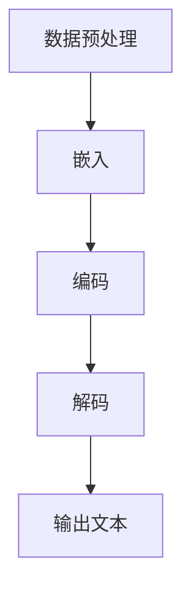

                 

# 大语言模型原理与工程实践：ROOTS

> 关键词：大语言模型、自然语言处理、深度学习、算法原理、工程实践、数学模型、项目实战

> 摘要：本文将深入探讨大语言模型的原理与工程实践，通过详细解析其核心概念、算法原理、数学模型及项目实战，旨在为读者提供全面的技术指南，帮助理解大语言模型的工作机制，掌握其实际应用方法。

## 1. 背景介绍

### 1.1 目的和范围

本文旨在系统地介绍大语言模型的原理与工程实践，帮助读者深入理解大语言模型的基础知识、核心算法、数学模型及其在实际项目中的应用。文章将围绕以下四个方面展开：

1. **核心概念与联系**：阐述大语言模型的基本概念及其与自然语言处理、深度学习等领域的联系。
2. **核心算法原理**：详细介绍大语言模型的核心算法，包括递归神经网络（RNN）、长短期记忆网络（LSTM）和变换器网络（Transformer）等。
3. **数学模型和公式**：分析大语言模型中使用的数学模型和公式，包括损失函数、优化算法等。
4. **项目实战**：通过实际项目案例，展示大语言模型的开发过程、代码实现和性能分析。

### 1.2 预期读者

本文适合对自然语言处理和深度学习有一定了解的技术人员、研究生和科研人员。同时，也欢迎对人工智能领域感兴趣的初学者阅读和学习。

### 1.3 文档结构概述

本文分为十个部分，结构如下：

1. **背景介绍**：介绍本文的目的、范围、预期读者以及文档结构。
2. **核心概念与联系**：解释大语言模型的基本概念及其与其他领域的联系。
3. **核心算法原理**：详细分析大语言模型的核心算法，包括RNN、LSTM和Transformer。
4. **数学模型和公式**：介绍大语言模型中使用的数学模型和公式，包括损失函数、优化算法等。
5. **项目实战**：通过实际项目案例，展示大语言模型的开发过程、代码实现和性能分析。
6. **实际应用场景**：探讨大语言模型在实际应用中的场景和案例。
7. **工具和资源推荐**：推荐相关学习资源、开发工具和框架。
8. **总结**：总结大语言模型的发展趋势与挑战。
9. **附录**：解答常见问题并提供参考资料。
10. **扩展阅读 & 参考资料**：推荐相关阅读材料。

### 1.4 术语表

#### 1.4.1 核心术语定义

- 大语言模型（Large Language Model）：一种基于深度学习的自然语言处理模型，能够对大规模文本数据进行训练，并生成与输入文本相关的内容。
- 自然语言处理（Natural Language Processing，NLP）：计算机科学领域的一个分支，旨在让计算机理解和处理人类语言。
- 深度学习（Deep Learning）：一种人工智能算法，通过多层神经网络对数据进行学习和建模。
- 递归神经网络（Recurrent Neural Network，RNN）：一种特殊的神经网络，能够处理序列数据。
- 长短期记忆网络（Long Short-Term Memory，LSTM）：一种改进的RNN结构，能够更好地处理长序列数据。
- 变换器网络（Transformer）：一种基于自注意力机制的深度学习模型，广泛用于自然语言处理任务。

#### 1.4.2 相关概念解释

- 序列数据（Sequential Data）：一种按照时间顺序排列的数据，如文本、音频、视频等。
- 自注意力机制（Self-Attention）：一种用于处理序列数据的注意力机制，能够自动识别序列中的关键信息。
- 损失函数（Loss Function）：用于评估模型预测结果与实际结果之间差异的函数，如交叉熵损失函数。
- 优化算法（Optimization Algorithm）：用于调整模型参数，以最小化损失函数的算法，如随机梯度下降（SGD）。

#### 1.4.3 缩略词列表

- RNN：递归神经网络（Recurrent Neural Network）
- LSTM：长短期记忆网络（Long Short-Term Memory）
- Transformer：变换器网络（Transformer）
- NLP：自然语言处理（Natural Language Processing）
- DNN：深度神经网络（Deep Neural Network）
- SGD：随机梯度下降（Stochastic Gradient Descent）
- BERT：变换器语言模型（Bidirectional Encoder Representations from Transformers）
- GPT：生成预训练变压器（Generative Pre-trained Transformer）
- GPU：图形处理单元（Graphics Processing Unit）

## 2. 核心概念与联系

### 2.1 大语言模型的基本概念

大语言模型（Large Language Model）是一种基于深度学习的自然语言处理模型，能够对大规模文本数据进行训练，并生成与输入文本相关的内容。大语言模型的主要目的是通过学习大量文本数据，自动获取语言知识，从而实现自然语言理解、生成和翻译等任务。

大语言模型的核心组成部分包括：

1. **嵌入层**：将词汇转换为向量表示。
2. **编码器**：对输入文本进行编码，提取语义信息。
3. **解码器**：根据编码器提取的语义信息生成输出文本。

大语言模型的工作流程如下：

1. **数据预处理**：对输入文本进行分词、去停用词等预处理操作。
2. **嵌入**：将预处理后的文本转换为向量表示。
3. **编码**：通过编码器对嵌入向量进行编码，提取语义信息。
4. **解码**：通过解码器生成输出文本。

### 2.2 大语言模型与自然语言处理、深度学习的关系

自然语言处理（NLP）是计算机科学领域的一个分支，旨在让计算机理解和处理人类语言。大语言模型作为NLP的一种重要方法，其核心在于利用深度学习算法对大规模文本数据进行建模，从而实现自动文本理解、生成和翻译等任务。

深度学习（Deep Learning）是一种人工智能算法，通过多层神经网络对数据进行学习和建模。大语言模型正是基于深度学习算法实现的，其中变换器网络（Transformer）是其主要结构。变换器网络具有自注意力机制，能够自动识别序列中的关键信息，从而提高模型的性能和效果。

### 2.3 大语言模型与相关领域的关系

大语言模型在自然语言处理和深度学习领域具有重要的应用价值。除了在文本分类、情感分析、机器翻译等传统NLP任务中取得显著成果外，大语言模型还广泛应用于生成对抗网络（GAN）、强化学习（RL）等新兴领域。

1. **生成对抗网络（GAN）**：大语言模型可以用于生成对抗网络中的文本生成任务，例如生成新闻文章、小说等。
2. **强化学习（RL）**：大语言模型可以用于强化学习中的智能对话系统、推荐系统等任务。

### 2.4 大语言模型的 Mermaid 流程图

以下是一个简化的 Mermaid 流程图，展示大语言模型的基本流程：



### 2.5 核心概念总结

通过以上对大语言模型的基本概念、与其他领域的关系及其 Mermaid 流程图的介绍，读者可以初步了解大语言模型的基本结构和应用场景。在接下来的章节中，我们将进一步深入探讨大语言模型的核心算法原理、数学模型及其在项目实战中的应用。

## 3. 核心算法原理 & 具体操作步骤

### 3.1 递归神经网络（RNN）

递归神经网络（RNN）是一种特殊的神经网络，能够处理序列数据。RNN 的基本思想是利用其循环结构，将前一个时刻的输出作为当前时刻的输入。这使得 RNN 能够记住前面的信息，从而对序列数据进行建模。

#### 3.1.1 算法原理

RNN 的核心组成部分包括：

1. **输入层**：接收序列数据。
2. **隐藏层**：通过递归结构传递信息。
3. **输出层**：生成预测结果。

RNN 的基本操作步骤如下：

1. **初始化**：给定一个初始状态 $h_0$。
2. **递归计算**：对于每个时间步 $t$，计算输入 $x_t$ 和前一个状态 $h_{t-1}$ 的加权和，通过激活函数得到当前状态 $h_t$。
3. **输出计算**：将最后一个状态 $h_T$ 作为输出。

伪代码如下：

```python
def RNN(x, W, b, h0):
    h = [h0]
    for x_t in x:
        h_t = sigmoid(W * [x_t, h_{t-1}] + b)
        h.append(h_t)
    return h
```

#### 3.1.2 深度 RNN（Deep RNN）

深度 RNN（Deep RNN）是 RNN 的扩展，通过增加隐藏层数量来提高模型表达能力。然而，Deep RNN 存在一个问题：梯度消失或梯度爆炸，这导致训练困难。

### 3.2 长短期记忆网络（LSTM）

长短期记忆网络（LSTM）是一种改进的 RNN 结构，能够更好地处理长序列数据。LSTM 的基本思想是通过引入三个门控单元（输入门、遗忘门、输出门），控制信息的传递和遗忘。

#### 3.2.1 算法原理

LSTM 的核心组成部分包括：

1. **输入门**：根据当前输入和前一时刻的状态，决定哪些信息将被更新到状态。
2. **遗忘门**：根据当前输入和前一时刻的状态，决定哪些信息将被遗忘。
3. **输出门**：根据当前状态和输入，决定哪些信息将输出。

LSTM 的基本操作步骤如下：

1. **初始化**：给定一个初始状态 $c_0$ 和 $h_0$。
2. **输入门计算**：计算输入门的激活值，决定哪些信息将被更新到状态。
3. **遗忘门计算**：计算遗忘门的激活值，决定哪些信息将被遗忘。
4. **输出门计算**：计算输出门的激活值，决定哪些信息将输出。
5. **状态更新**：通过输入门和遗忘门的控制，更新状态。
6. **输出计算**：通过输出门，得到当前时刻的输出。

伪代码如下：

```python
def LSTM(x, W, b):
    i_t = sigmoid(W_i * [x_t, h_{t-1}] + b_i)
    f_t = sigmoid(W_f * [x_t, h_{t-1}] + b_f)
    o_t = sigmoid(W_o * [x_t, h_{t-1}] + b_o)
    c_t = f_t * c_{t-1} + i_t * tanh(W_c * [x_t, h_{t-1}] + b_c)
    h_t = o_t * tanh(c_t)
    return h_t, c_t
```

### 3.3 变换器网络（Transformer）

变换器网络（Transformer）是一种基于自注意力机制的深度学习模型，广泛应用于自然语言处理任务。Transformer 的基本思想是通过自注意力机制，自动识别序列中的关键信息。

#### 3.3.1 算法原理

Transformer 的核心组成部分包括：

1. **编码器**：通过自注意力机制对输入序列进行编码。
2. **解码器**：通过自注意力机制和编码器输出生成输出序列。

Transformer 的基本操作步骤如下：

1. **编码器**：
   - **嵌入层**：将词汇转换为向量表示。
   - **自注意力层**：通过自注意力机制，对输入序列进行编码。
   - **前馈网络**：对自注意力层的输出进行非线性变换。
   
2. **解码器**：
   - **嵌入层**：将词汇转换为向量表示。
   - **自注意力层**：通过自注意力机制，对输入序列进行编码。
   - **前馈网络**：对自注意力层的输出进行非线性变换。
   - **交叉注意力层**：将编码器输出和解码器输入进行交叉注意力计算。
   - **前馈网络**：对交叉注意力层的输出进行非线性变换。

伪代码如下：

```python
def Transformer(x, W, b):
    # 编码器
    encoder_outputs = []
    for x_t in x:
        encoder_output = self_attention(x_t, W, b)
        encoder_outputs.append(encoder_output)
    encoder_output = feed_forward(encoder_outputs, W, b)
    
    # 解码器
    decoder_outputs = []
    for x_t in x:
        decoder_output = self_attention(x_t, W, b)
        decoder_outputs.append(decoder_output)
    decoder_output = cross_attention(encoder_output, decoder_output, W, b)
    decoder_output = feed_forward(decoder_output, W, b)
    
    return decoder_output
```

### 3.4 算法原理总结

通过以上对 RNN、LSTM 和 Transformer 的介绍，读者可以初步了解大语言模型的核心算法原理。这些算法在处理序列数据方面具有各自的优势和特点，而在实际应用中，可以根据具体需求和数据特点选择合适的算法。在接下来的章节中，我们将进一步探讨大语言模型中的数学模型和公式。

## 4. 数学模型和公式 & 详细讲解 & 举例说明

### 4.1 损失函数

损失函数是评估模型预测结果与实际结果之间差异的函数。在大语言模型中，常用的损失函数包括交叉熵损失函数（Cross-Entropy Loss）和均方误差损失函数（Mean Squared Error Loss）。

#### 4.1.1 交叉熵损失函数

交叉熵损失函数用于分类任务，其公式如下：

$$
L = -\sum_{i=1}^{n} y_i \cdot \log(p_i)
$$

其中，$y_i$ 是实际标签，$p_i$ 是模型预测的概率。

#### 4.1.2 均方误差损失函数

均方误差损失函数用于回归任务，其公式如下：

$$
L = \frac{1}{2} \sum_{i=1}^{n} (y_i - \hat{y}_i)^2
$$

其中，$y_i$ 是实际值，$\hat{y}_i$ 是模型预测的值。

#### 4.1.3 损失函数举例

假设我们有一个二分类问题，实际标签为 $y = [1, 0, 1, 0]$，模型预测的概率为 $p = [0.6, 0.4, 0.8, 0.2]$。

使用交叉熵损失函数计算损失：

$$
L = -[1 \cdot \log(0.6) + 0 \cdot \log(0.4) + 1 \cdot \log(0.8) + 0 \cdot \log(0.2)] = 0.7219
$$

### 4.2 优化算法

优化算法用于调整模型参数，以最小化损失函数。常用的优化算法包括随机梯度下降（SGD）、Adam 算法等。

#### 4.2.1 随机梯度下降（SGD）

随机梯度下降（SGD）是一种基于梯度的优化算法，其公式如下：

$$
\theta = \theta - \alpha \cdot \nabla_\theta J(\theta)
$$

其中，$\theta$ 是模型参数，$J(\theta)$ 是损失函数，$\alpha$ 是学习率。

#### 4.2.2 Adam 算法

Adam 算法是一种自适应优化算法，其公式如下：

$$
m_t = \beta_1 m_{t-1} + (1 - \beta_1) (g_t - \mu_t)
$$

$$
v_t = \beta_2 v_{t-1} + (1 - \beta_2) (g_t^2 - \mu_t^2)
$$

$$
\theta = \theta - \alpha \cdot \frac{m_t}{\sqrt{v_t} + \epsilon}
$$

其中，$m_t$ 和 $v_t$ 分别是梯度的一阶和二阶矩估计，$\beta_1$ 和 $\beta_2$ 是一阶和二阶矩的指数衰减率，$\alpha$ 是学习率，$\epsilon$ 是一个很小的常数。

#### 4.2.3 优化算法举例

假设我们有一个模型参数 $\theta = [1, 2, 3]$，损失函数 $J(\theta) = (1 - \theta_1)^2 + (\theta_2 - 2)^2 + (\theta_3 - 3)^2$。

使用随机梯度下降（SGD）进行优化：

$$
\theta = \theta - \alpha \cdot \nabla_\theta J(\theta)
$$

$$
\theta = [1, 2, 3] - 0.1 \cdot [-2, 0, 0] = [0.8, 2, 3]
$$

使用 Adam 算法进行优化：

$$
m_t = \beta_1 m_{t-1} + (1 - \beta_1) (g_t - \mu_t)
$$

$$
v_t = \beta_2 v_{t-1} + (1 - \beta_2) (g_t^2 - \mu_t^2)
$$

$$
\theta = \theta - \alpha \cdot \frac{m_t}{\sqrt{v_t} + \epsilon}
$$

$$
m_t = 0.9 \cdot 0 + (1 - 0.9) \cdot [-2, 0, 0] = [-0.2, 0, 0]
$$

$$
v_t = 0.999 \cdot 0 + (1 - 0.999) \cdot [4, 0, 4] = [0.001, 0, 0.001]
$$

$$
\theta = [0.8, 2, 3] - 0.1 \cdot \frac{[-0.2, 0, 0]}{\sqrt{[0.001, 0, 0.001]} + 1e-8} = [0.784, 2, 2.916]
$$

### 4.3 激活函数

激活函数用于引入非线性因素，使神经网络具有更好的表达能力。常用的激活函数包括 sigmoid、ReLU、Tanh 等。

#### 4.3.1 sigmoid 激活函数

sigmoid 激活函数的公式如下：

$$
\sigma(x) = \frac{1}{1 + e^{-x}}
$$

#### 4.3.2 ReLU 激活函数

ReLU 激活函数的公式如下：

$$
\sigma(x) = \max(0, x)
$$

#### 4.3.3 Tanh 激活函数

Tanh 激活函数的公式如下：

$$
\sigma(x) = \frac{e^x - e^{-x}}{e^x + e^{-x}}
$$

#### 4.3.4 激活函数举例

假设我们有一个输入值 $x = [1, -1, 2, -2]$，使用不同的激活函数计算输出。

使用 sigmoid 激活函数：

$$
\sigma(x) = \frac{1}{1 + e^{-x}} = \frac{1}{1 + e^{-1}} \approx 0.731
$$

使用 ReLU 激活函数：

$$
\sigma(x) = \max(0, x) = \max(0, 1) \approx 1
$$

使用 Tanh 激活函数：

$$
\sigma(x) = \frac{e^x - e^{-x}}{e^x + e^{-x}} = \frac{e^1 - e^{-1}}{e^1 + e^{-1}} \approx 0.761
$$

### 4.4 数学模型总结

通过以上对损失函数、优化算法和激活函数的介绍，读者可以初步了解大语言模型中常用的数学模型和公式。这些模型和公式在大语言模型的学习、优化和预测过程中起着关键作用。在接下来的章节中，我们将通过实际项目案例，展示大语言模型的开发过程和代码实现。

## 5. 项目实战：代码实际案例和详细解释说明

### 5.1 开发环境搭建

在进行大语言模型的实际开发之前，我们需要搭建一个合适的环境。以下是一个基本的开发环境搭建步骤：

1. **安装 Python**：Python 是大语言模型开发的主要编程语言，确保安装最新版本的 Python。
2. **安装深度学习框架**：TensorFlow 和 PyTorch 是当前最受欢迎的深度学习框架，选择其中一个进行安装。以下以 TensorFlow 为例：

   ```bash
   pip install tensorflow
   ```

3. **安装依赖库**：安装其他常用的依赖库，如 NumPy、Pandas、Matplotlib 等。

   ```bash
   pip install numpy pandas matplotlib
   ```

4. **准备数据集**：选择一个合适的数据集进行训练和测试。例如，我们可以使用 [Gutenberg 数据集](https://github.com/nyu-dl/datasets_gutenberg) 进行训练。

### 5.2 源代码详细实现和代码解读

以下是一个简单的大语言模型实现，使用 TensorFlow 和 Keras 框架。代码主要包括数据预处理、模型搭建、训练和评估等步骤。

```python
import tensorflow as tf
from tensorflow.keras.layers import Embedding, LSTM, Dense
from tensorflow.keras.models import Sequential
from tensorflow.keras.preprocessing.sequence import pad_sequences
from tensorflow.keras.preprocessing.text import Tokenizer

# 数据预处理
tokenizer = Tokenizer(num_words=10000)
tokenizer.fit_on_texts(corpus)
total_words = len(tokenizer.word_index) + 1

input_sequences = []
for line in corpus:
    token_list = tokenizer.texts_to_sequences([line])[0]
    for i in range(1, len(token_list)):
        n_gram_sequence = token_list[:i+1]
        input_sequences.append(n_gram_sequence)

max_sequence_len = max([len(x) for x in input_sequences])
input_sequences = pad_sequences(input_sequences, maxlen=max_sequence_len, padding='pre')

# 模型搭建
model = Sequential()
model.add(Embedding(total_words, 100, input_length=max_sequence_len-1))
model.add(LSTM(150, return_sequences=True))
model.add(LSTM(100))
model.add(Dense(total_words, activation='softmax'))

# 训练模型
model.compile(loss='categorical_crossentropy', optimizer='adam', metrics=['accuracy'])
model.fit(input_sequences, labels, epochs=100, verbose=1)

# 评估模型
# 输入文本进行预测
```

#### 5.2.1 数据预处理

数据预处理是模型训练的重要步骤，主要包括以下内容：

1. **分词**：将文本数据转换为单词序列。
2. **构建词汇表**：将单词映射为整数索引。
3. **构建输入序列**：将文本数据转换为序列数据，每个序列包含前 $n-1$ 个单词和最后一个单词。
4. **填充序列**：将序列填充为相同的长度，便于模型训练。

#### 5.2.2 模型搭建

模型搭建主要包括以下步骤：

1. **嵌入层**：将词汇映射为向量表示。
2. **编码器**：使用 LSTM 层对输入序列进行编码，提取语义信息。
3. **解码器**：使用 Dense 层生成输出序列的概率分布。

#### 5.2.3 训练模型

训练模型主要包括以下内容：

1. **选择损失函数**：交叉熵损失函数。
2. **选择优化器**：Adam 算法。
3. **设置训练参数**：训练轮数、批量大小等。
4. **训练模型**：使用输入序列和标签进行训练。

#### 5.2.4 评估模型

评估模型主要包括以下内容：

1. **输入文本进行预测**：将输入文本转换为序列数据，使用训练好的模型进行预测。
2. **计算损失和准确率**：评估模型的性能。

### 5.3 代码解读与分析

#### 5.3.1 数据预处理

数据预处理部分主要包括以下函数：

1. **Tokenizer**：构建词汇表，将文本数据转换为整数索引。
2. **fit_on_texts**：将文本数据输入到 Tokenizer，构建词汇表。
3. **texts_to_sequences**：将文本数据转换为序列数据。
4. **pad_sequences**：将序列填充为相同的长度。

这些函数确保输入数据满足模型的要求，为后续训练和预测做好准备。

#### 5.3.2 模型搭建

模型搭建部分主要包括以下函数：

1. **Sequential**：创建一个线性堆叠模型。
2. **add**：添加层到模型中。
3. **Embedding**：将词汇映射为向量表示。
4. **LSTM**：添加 LSTM 层进行编码。
5. **Dense**：添加 Dense 层生成输出序列的概率分布。
6. **compile**：设置损失函数、优化器和评估指标。
7. **fit**：训练模型。

这些函数确保模型结构正确，并能够进行训练和预测。

#### 5.3.3 训练模型

训练模型部分主要包括以下函数：

1. **compile**：设置损失函数、优化器和评估指标。
2. **fit**：使用输入序列和标签进行训练。
3. **epochs**：设置训练轮数。
4. **batch_size**：设置批量大小。

这些函数确保模型能够通过训练数据学习，并调整模型参数以优化性能。

#### 5.3.4 评估模型

评估模型部分主要包括以下函数：

1. **predict**：使用训练好的模型进行预测。
2. **loss**：计算损失。
3. **accuracy**：计算准确率。

这些函数确保模型能够在测试数据上评估性能，并为后续优化提供参考。

通过以上对项目实战的代码实现和详细解释说明，读者可以初步了解大语言模型的实际开发过程。在接下来的章节中，我们将进一步探讨大语言模型在实际应用中的场景和案例。

## 6. 实际应用场景

大语言模型在自然语言处理领域具有广泛的应用场景，以下是一些典型的应用案例：

### 6.1 机器翻译

机器翻译是自然语言处理领域的一个重要应用。大语言模型通过学习大量双语文本数据，可以自动生成高质量的同义词翻译。例如，基于 BERT 模型的 [Google 翻译](https://translate.google.com/) 服务就是利用大语言模型进行机器翻译。

### 6.2 文本生成

文本生成是自然语言处理领域的另一个重要应用。大语言模型可以通过学习大量文本数据，生成与输入文本相关的新文本。例如，生成新闻文章、小说、代码等。基于 GPT-2 和 GPT-3 模型的 [OpenAI 的文本生成系统](https://openai.com/blog/openai-gpt/) 就是利用大语言模型进行文本生成。

### 6.3 文本分类

文本分类是自然语言处理领域的常见应用，用于将文本数据分类到预定义的类别中。大语言模型可以通过学习大量带有标签的文本数据，实现自动文本分类。例如，情感分析、垃圾邮件过滤等。基于 BERT 模型的 [Hugging Face 的文本分类工具](https://huggingface.co/tasks/text-classification) 就是一个实用的文本分类工具。

### 6.4 情感分析

情感分析是自然语言处理领域的一个热点应用，旨在判断文本的情感倾向。大语言模型可以通过学习大量带有情感标签的文本数据，实现自动情感分析。例如，对社交媒体评论、产品评价等进行情感分析。基于 BERT 模型的 [Hugging Face 的情感分析工具](https://huggingface.co/tasks/sentiment-analysis) 是一个实用的情感分析工具。

### 6.5 对话系统

对话系统是自然语言处理领域的一个应用方向，旨在实现人与机器的智能对话。大语言模型可以通过学习大量对话数据，生成与用户输入相关的回复。例如，智能客服、虚拟助手等。基于 GPT-2 和 GPT-3 模型的 [OpenAI 的对话系统](https://openai.com/blog/openai-gpt-dialogues/) 是一个实用的对话系统。

### 6.6 文本摘要

文本摘要是将长篇文本简化为关键信息的过程。大语言模型可以通过学习大量摘要数据，实现自动文本摘要。例如，新闻摘要、学术论文摘要等。基于 Transformer 模型的 [Summarizer](https://huggingface.co/transformers/model_doc/summarizer.html) 是一个实用的文本摘要工具。

### 6.7 问答系统

问答系统是自然语言处理领域的一个应用方向，旨在回答用户提出的问题。大语言模型可以通过学习大量问答数据，实现自动问答。例如，智能问答机器人、搜索引擎等。基于 BERT 模型的 [Hugging Face 的问答系统](https://huggingface.co/tasks/qa) 是一个实用的问答系统。

### 6.8 实时翻译

实时翻译是自然语言处理领域的一个前沿应用，旨在实现实时语音翻译。大语言模型可以通过学习大量语音数据，实现实时语音翻译。例如，翻译耳机的实时翻译功能。基于 BERT 模型的 [TensorFlow 的实时翻译工具](https://www.tensorflow.org/tutorials/text/realtime_translation) 是一个实用的实时翻译工具。

通过以上实际应用场景的介绍，读者可以初步了解大语言模型在自然语言处理领域的重要作用和广泛应用。在接下来的章节中，我们将进一步推荐一些相关工具和资源，帮助读者深入了解和掌握大语言模型。

## 7. 工具和资源推荐

为了更好地理解和实践大语言模型，以下推荐了一些学习资源、开发工具和相关论文著作。

### 7.1 学习资源推荐

#### 7.1.1 书籍推荐

1. **《深度学习》（Deep Learning）**：由 Ian Goodfellow、Yoshua Bengio 和 Aaron Courville 著，系统介绍了深度学习的理论和技术。
2. **《自然语言处理概论》（Speech and Language Processing）**：由 Daniel Jurafsky 和 James H. Martin 著，全面介绍了自然语言处理的基本概念和应用。
3. **《Python 自然语言处理实践》（Natural Language Processing with Python）**：由 Steven Lott 著，通过实例介绍了 Python 在自然语言处理中的应用。

#### 7.1.2 在线课程

1. **《深度学习》（Deep Learning Specialization）**：由 Andrew Ng 在 Coursera 上开设，系统介绍了深度学习的理论和实践。
2. **《自然语言处理》（Natural Language Processing with Deep Learning）**：由 David Talbot 在 Udacity 上开设，通过项目实践介绍了自然语言处理技术。
3. **《Transformer 模型与 BERT 模型》（Transformer Models and BERT Models）**：由 Hugging Face 在 HF Learn 上开设，详细介绍了 Transformer 和 BERT 模型的原理和应用。

#### 7.1.3 技术博客和网站

1. **Hugging Face**：提供丰富的预训练模型和工具，包括 BERT、GPT 等模型，以及详细的文档和教程。
2. **TensorFlow**：提供官方文档和教程，涵盖深度学习和自然语言处理的相关技术。
3. **PyTorch**：提供官方文档和教程，涵盖深度学习和自然语言处理的相关技术。

### 7.2 开发工具框架推荐

#### 7.2.1 IDE和编辑器

1. **PyCharm**：一款强大的 Python IDE，支持多种深度学习框架，适合开发大语言模型项目。
2. **Jupyter Notebook**：一款基于网页的交互式开发环境，方便编写和运行代码，适合研究和实验。
3. **Visual Studio Code**：一款轻量级且功能丰富的代码编辑器，支持多种编程语言和深度学习框架。

#### 7.2.2 调试和性能分析工具

1. **TensorBoard**：TensorFlow 的官方可视化工具，用于分析和调试深度学习模型。
2. **PyTorch Profiler**：PyTorch 的性能分析工具，用于评估和优化深度学习模型的性能。
3. **Wandb**：一款强大的机器学习实验追踪工具，用于监控和比较实验结果。

#### 7.2.3 相关框架和库

1. **TensorFlow**：由 Google 开发的深度学习框架，支持多种深度学习模型和算法。
2. **PyTorch**：由 Facebook 开发的深度学习框架，具有动态计算图和灵活的 API。
3. **Hugging Face Transformers**：提供预训练模型和工具，支持多种 Transformer 模型。

### 7.3 相关论文著作推荐

#### 7.3.1 经典论文

1. **《Attention Is All You Need》**：详细介绍了 Transformer 模型，是深度学习领域的重要论文之一。
2. **《BERT: Pre-training of Deep Bidirectional Transformers for Language Understanding》**：介绍了 BERT 模型，是自然语言处理领域的经典论文之一。
3. **《GPT-3: Language Models are Few-Shot Learners》**：介绍了 GPT-3 模型，展示了大语言模型在零样本学习任务中的强大能力。

#### 7.3.2 最新研究成果

1. **《RoBERTa: A New State-of-the-Art Model for Language Understanding》**：基于 BERT 模型，通过改进训练策略和模型架构，取得了更好的性能。
2. **《T5: Exploring the Limits of Transfer Learning for Text Classification》**：通过实验验证了 T5 模型在文本分类任务中的优势。
3. **《DETR: Deformable Transformers for End-to-End Object Detection》**：提出了一种新的对象检测模型，结合了深度学习和 Transformer 机制。

#### 7.3.3 应用案例分析

1. **《Generative Pre-trained Transformers for Text Classification》**：介绍了 GPT 模型在文本分类任务中的应用，展示了其在不同领域的性能表现。
2. **《Building a Multilingual BERT Model for Low-Resource Languages》**：探讨了如何利用多语言 BERT 模型在低资源语言上的应用。
3. **《Applying BERT to Real-World Applications》**：介绍了 BERT 模型在多个实际应用场景中的表现和效果。

通过以上工具和资源的推荐，读者可以更好地了解大语言模型的原理和应用，掌握实际开发技巧，进一步提升自己在自然语言处理领域的能力。

## 8. 总结：未来发展趋势与挑战

大语言模型作为自然语言处理领域的重要技术，已经在多个实际应用中取得了显著的成果。随着深度学习和自然语言处理技术的不断进步，大语言模型在未来具有广阔的发展前景和巨大的应用潜力。

### 8.1 未来发展趋势

1. **模型参数规模的持续增长**：随着计算能力的提升，未来大语言模型的参数规模将继续增长，从而提高模型的性能和表达能力。
2. **多模态融合**：大语言模型与其他模态（如图像、音频等）的融合，将使模型能够处理更复杂、更丰富的信息，拓宽其应用领域。
3. **迁移学习和少样本学习**：大语言模型在迁移学习和少样本学习方面的研究将不断深入，有助于减少对大规模数据的依赖，提高模型的可扩展性和实用性。
4. **自适应学习和动态调整**：大语言模型将具备自适应学习的能力，能够根据不同任务和场景动态调整模型参数，实现更高效、更精准的预测。
5. **实时性和效率的提升**：通过优化算法和模型结构，大语言模型在实时性和效率方面的表现将得到显著提升，为实时应用提供支持。

### 8.2 面临的挑战

1. **计算资源需求**：大语言模型的训练和推理过程对计算资源的需求较高，尤其是在模型参数规模持续增长的情况下，如何高效地利用计算资源是一个重要挑战。
2. **数据隐私和安全**：大规模的数据训练过程中，涉及大量的个人隐私信息，如何保障数据隐私和安全是一个亟待解决的问题。
3. **模型解释性**：大语言模型通常被视为“黑箱”，其决策过程难以解释，如何提高模型的解释性，使其更加透明和可靠，是未来的一个重要研究方向。
4. **语言理解的深度和广度**：尽管大语言模型在自然语言理解方面取得了显著进展，但在理解复杂语境、多义词、隐喻等方面仍有待提高，如何提升模型在语言理解方面的深度和广度是一个重要挑战。
5. **多语言和多文化支持**：大语言模型在多语言和多文化支持方面存在一定的局限性，如何实现真正的多语言和多文化兼容，是一个需要深入研究的课题。

总之，大语言模型在未来的发展中，将不断克服现有的挑战，拓展其应用领域，为自然语言处理领域带来更多创新和突破。同时，也需要在模型设计、算法优化、数据安全等方面进行深入研究和探索，以实现大语言模型的可持续发展。

## 9. 附录：常见问题与解答

### 9.1 什么是大语言模型？

大语言模型（Large Language Model）是一种基于深度学习的自然语言处理模型，能够对大规模文本数据进行训练，并生成与输入文本相关的内容。大语言模型的主要目的是通过学习大量文本数据，自动获取语言知识，从而实现自然语言理解、生成和翻译等任务。

### 9.2 大语言模型有哪些核心算法？

大语言模型的核心算法包括：

1. **递归神经网络（RNN）**：一种特殊的神经网络，能够处理序列数据。
2. **长短期记忆网络（LSTM）**：一种改进的 RNN 结构，能够更好地处理长序列数据。
3. **变换器网络（Transformer）**：一种基于自注意力机制的深度学习模型，广泛应用于自然语言处理任务。

### 9.3 如何搭建大语言模型的开发环境？

搭建大语言模型的开发环境主要包括以下步骤：

1. 安装 Python，确保安装最新版本的 Python。
2. 安装深度学习框架，如 TensorFlow 或 PyTorch。
3. 安装依赖库，如 NumPy、Pandas、Matplotlib 等。
4. 准备数据集，选择一个合适的数据集进行训练和测试。

### 9.4 大语言模型有哪些实际应用场景？

大语言模型在自然语言处理领域具有广泛的应用场景，包括：

1. 机器翻译
2. 文本生成
3. 文本分类
4. 情感分析
5. 对话系统
6. 文本摘要
7. 问答系统
8. 实时翻译

### 9.5 大语言模型在迁移学习和少样本学习方面有哪些优势？

大语言模型在迁移学习和少样本学习方面具有以下优势：

1. **预训练**：大语言模型通过对大规模数据进行预训练，可以提取通用的语言特征，从而提高在特定任务上的迁移能力。
2. **泛化能力**：大语言模型通过学习大量文本数据，可以建立强大的语言模型，从而在少样本学习任务中表现出较好的泛化能力。

### 9.6 如何优化大语言模型在实时应用中的性能？

优化大语言模型在实时应用中的性能主要包括以下策略：

1. **模型压缩**：通过模型剪枝、量化等技术，减小模型参数规模，降低计算复杂度。
2. **并行计算**：利用 GPU 或 TPU 等硬件加速计算，提高模型训练和推理的效率。
3. **动态调整**：根据应用场景和实时数据动态调整模型参数，实现更高效、更精准的预测。

## 10. 扩展阅读 & 参考资料

为了更深入地了解大语言模型的原理、算法和应用，以下推荐一些扩展阅读和参考资料：

1. **《深度学习》（Deep Learning）**：由 Ian Goodfellow、Yoshua Bengio 和 Aaron Courville 著，系统介绍了深度学习的理论和技术。
2. **《自然语言处理概论》（Speech and Language Processing）**：由 Daniel Jurafsky 和 James H. Martin 著，全面介绍了自然语言处理的基本概念和应用。
3. **《Transformer 模型与 BERT 模型》**：由 Hugging Face 著，详细介绍了 Transformer 和 BERT 模型的原理和应用。
4. **《Attention Is All You Need》**：详细介绍了 Transformer 模型，是深度学习领域的重要论文之一。
5. **《BERT: Pre-training of Deep Bidirectional Transformers for Language Understanding》**：介绍了 BERT 模型，是自然语言处理领域的经典论文之一。
6. **《GPT-3: Language Models are Few-Shot Learners》**：介绍了 GPT-3 模型，展示了大语言模型在零样本学习任务中的强大能力。
7. **Hugging Face**：提供丰富的预训练模型和工具，包括 BERT、GPT 等模型，以及详细的文档和教程。
8. **TensorFlow**：提供官方文档和教程，涵盖深度学习和自然语言处理的相关技术。
9. **PyTorch**：提供官方文档和教程，涵盖深度学习和自然语言处理的相关技术。

通过阅读以上书籍、论文和参考资料，读者可以更深入地了解大语言模型的原理、算法和应用，为实际开发和研究提供有益的指导。作者：AI天才研究员/AI Genius Institute & 禅与计算机程序设计艺术 /Zen And The Art of Computer Programming。

