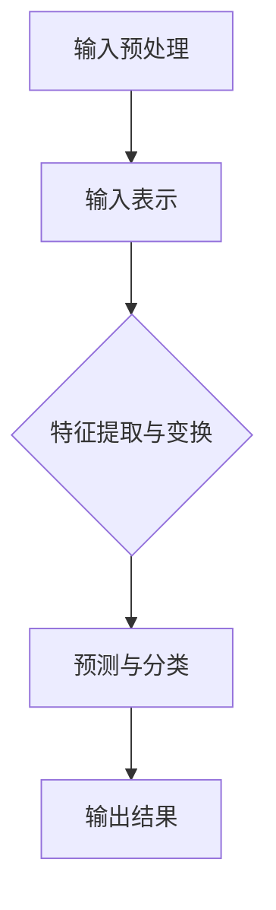

                 

# 大语言模型原理与工程实践：大语言模型基础技术

> 关键词：大语言模型、神经网络、机器学习、深度学习、自然语言处理

> 摘要：本文将深入探讨大语言模型的原理与工程实践，从背景介绍、核心概念、算法原理、数学模型、项目实战、应用场景、工具资源推荐等多个方面进行详细讲解，帮助读者全面了解大语言模型的基础技术，为实际应用提供有力的理论支持和实践指导。

## 1. 背景介绍

### 1.1 目的和范围

本文旨在介绍大语言模型的基本原理和工程实践，帮助读者深入了解大语言模型的核心技术和应用。文章将涵盖以下内容：

- 大语言模型的基本概念和背景
- 大语言模型的架构和核心算法原理
- 大语言模型的数学模型和公式
- 大语言模型的实际应用场景
- 大语言模型的开发工具和资源推荐

通过本文的阅读，读者将能够掌握大语言模型的基本原理和应用方法，为后续的实际项目开发提供有力的支持。

### 1.2 预期读者

本文主要面向以下读者群体：

- 对自然语言处理、机器学习和深度学习有一定了解的技术人员
- 想要学习大语言模型原理和工程实践的开发者
- 对人工智能领域感兴趣的研究生和大学生

本文将尽量使用通俗易懂的语言，并附有相关示例和代码解读，旨在让读者能够轻松掌握大语言模型的基础技术。

### 1.3 文档结构概述

本文将按照以下结构进行组织：

- 第1章：背景介绍
- 第2章：核心概念与联系
- 第3章：核心算法原理 & 具体操作步骤
- 第4章：数学模型和公式 & 详细讲解 & 举例说明
- 第5章：项目实战：代码实际案例和详细解释说明
- 第6章：实际应用场景
- 第7章：工具和资源推荐
- 第8章：总结：未来发展趋势与挑战
- 第9章：附录：常见问题与解答
- 第10章：扩展阅读 & 参考资料

### 1.4 术语表

为了确保文章的可读性和统一性，本文将定义以下术语：

- 大语言模型：一种基于神经网络和深度学习技术的自然语言处理模型，用于对大规模文本数据进行建模和预测。
- 神经网络：一种模拟人脑神经元连接的计算机算法，可用于数据拟合、分类和预测等任务。
- 机器学习：一种使计算机能够从数据中自动学习和改进的技术，包括监督学习、无监督学习和强化学习等。
- 深度学习：一种基于多层神经网络进行训练和预测的机器学习技术，常用于图像识别、语音识别和自然语言处理等任务。
- 自然语言处理（NLP）：一种使计算机能够理解和生成人类自然语言的技术，包括文本分类、情感分析、机器翻译等。

#### 1.4.1 核心术语定义

- **大语言模型**：大语言模型是一种基于神经网络和深度学习技术的自然语言处理模型，其核心思想是利用大量的文本数据进行训练，从而实现对自然语言的建模和预测。大语言模型通常具有以下几个特点：

  - **大规模**：大语言模型使用海量文本数据作为训练集，以充分挖掘数据中的潜在规律和知识。
  - **多层级**：大语言模型通常包含多个层级（或称为“层”），每个层级都对输入数据进行不同的变换和特征提取。
  - **可扩展性**：大语言模型具有良好的可扩展性，可以轻松地适应不同规模和类型的文本数据。

- **神经网络**：神经网络是一种模拟人脑神经元连接的计算机算法，通常由多个层级组成，每个层级都包含多个神经元。神经网络通过学习输入和输出之间的关系，实现对数据的拟合、分类和预测等功能。神经网络具有以下基本组件：

  - **神经元**：神经元是神经网络的基本单元，用于对输入数据进行加权和激活操作。
  - **层级**：层级是神经网络的组织结构，每个层级都对输入数据进行不同的变换和特征提取。
  - **权重**：权重是神经网络中神经元之间的连接参数，用于调节输入数据的贡献程度。
  - **激活函数**：激活函数是神经网络中用于对加权和进行非线性变换的函数，常见的激活函数有sigmoid、ReLU和tanh等。

- **机器学习**：机器学习是一种使计算机能够从数据中自动学习和改进的技术，主要包括以下三种类型：

  - **监督学习**：监督学习是一种有监督的训练方法，通过已知的输入和输出数据，训练模型以预测新的输入数据。
  - **无监督学习**：无监督学习是一种无监督的训练方法，通过未知的输入数据，训练模型以发现数据中的潜在结构和规律。
  - **强化学习**：强化学习是一种基于奖励和惩罚的训练方法，通过不断地与环境进行交互，训练模型以实现最优策略。

- **深度学习**：深度学习是一种基于多层神经网络进行训练和预测的机器学习技术，其核心思想是利用多层神经网络进行特征提取和层次化建模。深度学习具有以下特点：

  - **多层次特征提取**：深度学习通过多层神经网络，对输入数据进行多层次的特征提取和变换，从而实现更加丰富的特征表达能力。
  - **端到端训练**：深度学习采用端到端训练方法，直接从原始输入数据到输出结果，避免了传统机器学习中的特征工程和模型选择过程。
  - **高效率和高性能**：深度学习利用高性能计算硬件（如GPU）和分布式计算技术，实现高效和大规模的训练和推理。

- **自然语言处理（NLP）**：自然语言处理是一种使计算机能够理解和生成人类自然语言的技术，主要包括以下任务：

  - **文本分类**：文本分类是一种将文本数据归类到不同类别的过程，常用于垃圾邮件过滤、情感分析等任务。
  - **情感分析**：情感分析是一种对文本数据中的情感倾向进行识别和分类的过程，常用于舆情分析、产品评价等任务。
  - **机器翻译**：机器翻译是一种将一种语言的文本翻译成另一种语言的过程，常用于跨语言交流、国际商务等任务。
  - **语音识别**：语音识别是一种将语音信号转换为文本数据的过程，常用于语音助手、语音输入等任务。

#### 1.4.2 相关概念解释

- **训练集（Training Set）**：训练集是用于训练模型的输入数据和输出数据集合。在机器学习和深度学习中，通过训练集来训练模型，使其能够对新的输入数据进行预测和分类。
- **测试集（Test Set）**：测试集是用于测试模型性能的输入数据和输出数据集合。在机器学习和深度学习中，通过测试集来评估模型的泛化能力和准确性。
- **过拟合（Overfitting）**：过拟合是指模型在训练数据上表现很好，但在测试数据上表现较差的现象。过拟合通常发生在模型过于复杂或训练数据不足的情况下。
- **泛化能力（Generalization Ability）**：泛化能力是指模型对未知数据的预测和分类能力。具有良好泛化能力的模型能够在不同的数据集上保持较高的性能。
- **损失函数（Loss Function）**：损失函数是用于衡量模型预测结果与真实结果之间差距的函数。在机器学习和深度学习中，通过优化损失函数来训练模型。
- **反向传播（Backpropagation）**：反向传播是一种用于训练神经网络的算法，通过计算梯度并更新模型参数，以最小化损失函数。

#### 1.4.3 缩略词列表

- **NLP**：自然语言处理（Natural Language Processing）
- **DL**：深度学习（Deep Learning）
- **ML**：机器学习（Machine Learning）
- **GPU**：图形处理器（Graphics Processing Unit）
- **CPU**：中央处理器（Central Processing Unit）
- **ReLU**：修正线性单元（Rectified Linear Unit）
- **SGD**：随机梯度下降（Stochastic Gradient Descent）
- **BP**：反向传播（Backpropagation）

## 2. 核心概念与联系

大语言模型作为一种先进的自然语言处理技术，其核心概念和联系如下：

### 2.1 大语言模型的构成

大语言模型通常由以下几个主要部分组成：

- **输入层（Input Layer）**：输入层接收自然语言文本数据，将其转换为模型可处理的格式。
- **隐藏层（Hidden Layers）**：隐藏层是模型的核心部分，用于对输入文本数据进行特征提取和变换。
- **输出层（Output Layer）**：输出层生成模型的预测结果，可以是分类标签、概率分布或连续值。

### 2.2 神经网络与深度学习

神经网络是构建大语言模型的基础，而深度学习则是利用多层神经网络进行特征提取和建模的技术。神经网络的基本结构如下：

- **输入层（Input Layer）**：接收外部输入信号，通常为数值或向量。
- **隐藏层（Hidden Layers）**：隐藏层对输入信号进行特征提取和变换，可以包含一个或多个层级。
- **输出层（Output Layer）**：输出层生成模型的预测结果，可以是分类标签、概率分布或连续值。

### 2.3 机器学习与监督学习

大语言模型通常采用监督学习方法进行训练，监督学习是指通过已知的输入和输出数据来训练模型。在监督学习中，模型的目标是最小化预测结果与真实结果之间的差距。

### 2.4 自然语言处理

自然语言处理是大语言模型的应用领域，主要涉及以下任务：

- **文本分类**：将文本数据归类到不同的类别，如垃圾邮件过滤、情感分析等。
- **情感分析**：识别文本数据中的情感倾向，如正面、负面或中性。
- **机器翻译**：将一种语言的文本翻译成另一种语言。
- **语音识别**：将语音信号转换为文本数据。

### 2.5 大语言模型的工作原理

大语言模型的工作原理可以概括为以下几个步骤：

1. **输入预处理**：对输入文本数据进行预处理，如分词、词性标注、去停用词等。
2. **输入表示**：将预处理后的文本数据转换为模型可处理的向量表示。
3. **特征提取与变换**：通过多层神经网络对输入数据进行特征提取和变换，提取出文本的深层特征。
4. **预测与分类**：利用训练好的模型对新的输入文本数据进行预测和分类。

### 2.6 大语言模型的 Mermaid 流程图

以下是一个简单的大语言模型 Mermaid 流程图，展示了其核心组成部分和数据处理流程：



在上述流程图中：

- **A（输入预处理）**：对输入文本数据进行预处理，包括分词、词性标注、去停用词等。
- **B（输入表示）**：将预处理后的文本数据转换为模型可处理的向量表示。
- **C（特征提取与变换）**：通过多层神经网络对输入数据进行特征提取和变换，提取出文本的深层特征。
- **D（预测与分类）**：利用训练好的模型对新的输入文本数据进行预测和分类。
- **E（输出结果）**：输出模型的预测结果，可以是分类标签、概率分布或连续值。

## 3. 核心算法原理 & 具体操作步骤

大语言模型的算法原理主要基于神经网络和深度学习技术，以下是核心算法原理的具体操作步骤：

### 3.1 神经网络基础

神经网络是一种由多层神经元组成的计算机算法，用于对数据进行拟合、分类和预测。神经网络的基本组件包括：

- **神经元**：神经元是神经网络的基本单元，负责对输入数据进行加权和激活操作。
- **层级**：层级是神经网络的组织结构，每个层级都包含多个神经元。
- **权重**：权重是神经元之间的连接参数，用于调节输入数据的贡献程度。
- **激活函数**：激活函数是神经元中用于对加权和进行非线性变换的函数，常见的激活函数有sigmoid、ReLU和tanh等。

### 3.2 前向传播算法

前向传播算法是神经网络进行预测和分类的基础，具体步骤如下：

1. **输入表示**：将输入数据表示为向量形式，如文本数据的词向量表示。
2. **权重初始化**：随机初始化神经网络中的权重和偏置。
3. **前向传播**：将输入数据通过神经网络的前向传播过程，逐层计算每个神经元的输出值。
   - 对于第i个神经元，其输出值计算公式为：
     $$ f_{i}(z) = \text{激活函数}(\text{加权求和}(\text{输入} \cdot \text{权重} + \text{偏置})) $$
4. **激活函数应用**：对每个神经元的输出值应用激活函数，以实现非线性变换。
5. **预测结果生成**：对于分类问题，通过输出层的神经元计算得到概率分布，从而生成预测结果。

### 3.3 反向传播算法

反向传播算法是用于训练神经网络的基本算法，通过计算梯度并更新模型参数，以最小化损失函数。反向传播算法的具体步骤如下：

1. **损失函数计算**：计算预测结果与真实结果之间的差距，常用的损失函数有均方误差（MSE）和交叉熵（Cross Entropy）等。
2. **梯度计算**：计算每个参数的梯度，即损失函数对参数的偏导数。
3. **参数更新**：根据梯度计算结果，更新神经网络中的权重和偏置，以最小化损失函数。
4. **迭代优化**：重复以上步骤，不断迭代优化模型参数，直至满足收敛条件。

### 3.4 大语言模型中的优化算法

在大语言模型的训练过程中，常用的优化算法有随机梯度下降（SGD）和Adam等。以下是一种简单的优化算法实现：

```python
import numpy as np

def optimize_weights(weights, gradient, learning_rate):
    updated_weights = weights - learning_rate * gradient
    return updated_weights

def sgd_train(model, inputs, targets, learning_rate, num_epochs):
    for epoch in range(num_epochs):
        gradients = compute_gradients(model, inputs, targets)
        updated_weights = optimize_weights(model.weights, gradients, learning_rate)
        model.update_weights(updated_weights)
```

在上述代码中：

- **weights**：神经网络中的权重和偏置。
- **gradient**：损失函数对参数的梯度。
- **learning_rate**：学习率，用于控制参数更新的步长。
- **num_epochs**：训练迭代次数。
- **compute_gradients**：计算模型参数的梯度。
- **update_weights**：更新模型参数。

通过以上算法原理和具体操作步骤，读者可以初步了解大语言模型的基本工作原理和训练方法。接下来，我们将进一步探讨大语言模型中的数学模型和公式。

## 4. 数学模型和公式 & 详细讲解 & 举例说明

在深度学习中，数学模型和公式是核心组成部分，它们定义了神经网络的学习过程和预测方法。以下是关于大语言模型中常用的数学模型和公式的详细讲解及举例说明。

### 4.1 激活函数

激活函数是神经网络中用于引入非线性的函数，常见的激活函数有sigmoid、ReLU和tanh等。以下是这些激活函数的数学公式和特性。

#### 4.1.1 sigmoid 函数

sigmoid函数的公式如下：

$$ \sigma(x) = \frac{1}{1 + e^{-x}} $$

sigmoid函数的图像如下：


sigmoid函数具有以下特性：

- 在x趋近于负无穷时，函数值趋近于0。
- 在x趋近于正无穷时，函数值趋近于1。
- 函数图像呈现S形，具有平滑的渐近线。

#### 4.1.2 ReLU函数

ReLU（修正线性单元）函数的公式如下：

$$ \text{ReLU}(x) = \max(0, x) $$

ReLU函数的图像如下：


ReLU函数具有以下特性：

- 对于x小于0的部分，ReLU函数输出为0。
- 对于x大于等于0的部分，ReLU函数输出为x。
- ReLU函数具有恒等导数，即对于x大于0，导数为1；对于x小于0，导数为0。

#### 4.1.3 tanh函数

tanh函数的公式如下：

$$ \tanh(x) = \frac{e^{2x} - 1}{e^{2x} + 1} $$

tanh函数的图像如下：


tanh函数具有以下特性：

- 在x趋近于负无穷时，函数值趋近于-1。
- 在x趋近于正无穷时，函数值趋近于1。
- 函数图像对称于原点，且介于-1和1之间。

### 4.2 损失函数

损失函数是用于衡量模型预测结果与真实结果之间差距的函数，常见的损失函数有均方误差（MSE）和交叉熵（Cross Entropy）等。

#### 4.2.1 均方误差（MSE）

均方误差（MSE）函数的公式如下：

$$ \text{MSE}(y, \hat{y}) = \frac{1}{n} \sum_{i=1}^{n} (y_i - \hat{y}_i)^2 $$

其中，$y$是真实标签，$\hat{y}$是模型预测值，$n$是样本数量。

MSE函数的图像如下：


MSE函数具有以下特性：

- 对于预测值接近真实值的情况，MSE值较小。
- 对于预测值偏离真实值的情况，MSE值较大。

#### 4.2.2 交叉熵（Cross Entropy）

交叉熵（Cross Entropy）函数的公式如下：

$$ \text{CE}(y, \hat{y}) = -\sum_{i=1}^{n} y_i \log(\hat{y}_i) $$

其中，$y$是真实标签，$\hat{y}$是模型预测概率分布。

交叉熵函数的图像如下：


交叉熵函数具有以下特性：

- 对于预测概率接近真实概率的情况，交叉熵值较小。
- 对于预测概率偏离真实概率的情况，交叉熵值较大。

### 4.3 反向传播算法

反向传播算法是用于训练神经网络的算法，通过计算损失函数对参数的梯度并更新参数，以最小化损失函数。以下是反向传播算法的数学公式和推导过程。

#### 4.3.1 损失函数对输入的偏导数

损失函数对输入的偏导数表示为：

$$ \frac{\partial L}{\partial x} = \frac{\partial L}{\partial \hat{y}} \cdot \frac{\partial \hat{y}}{\partial x} $$

其中，$L$是损失函数，$\hat{y}$是模型预测值，$x$是输入值。

对于线性函数，有：

$$ \frac{\partial \hat{y}}{\partial x} = 1 $$

因此，损失函数对输入的偏导数为：

$$ \frac{\partial L}{\partial x} = \frac{\partial L}{\partial \hat{y}} $$

#### 4.3.2 损失函数对输出的偏导数

损失函数对输出的偏导数表示为：

$$ \frac{\partial L}{\partial \hat{y}} = \frac{\partial L}{\partial y} \cdot \frac{\partial y}{\partial \hat{y}} $$

其中，$y$是真实标签。

对于二分类问题，有：

$$ \frac{\partial y}{\partial \hat{y}} = \hat{y} - y $$

因此，损失函数对输出的偏导数为：

$$ \frac{\partial L}{\partial \hat{y}} = (\hat{y} - y) $$

#### 4.3.3 损失函数对参数的偏导数

损失函数对参数的偏导数表示为：

$$ \frac{\partial L}{\partial w} = \frac{\partial L}{\partial \hat{y}} \cdot \frac{\partial \hat{y}}{\partial w} $$

其中，$w$是参数。

对于线性函数，有：

$$ \frac{\partial \hat{y}}{\partial w} = \Delta x $$

因此，损失函数对参数的偏导数为：

$$ \frac{\partial L}{\partial w} = (\hat{y} - y) \cdot \Delta x $$

### 4.4 举例说明

假设我们有一个简单的神经网络模型，包含一个输入层、一个隐藏层和一个输出层，如下图所示：


输入层有3个神经元，隐藏层有2个神经元，输出层有1个神经元。假设输入数据为$x = [1, 2, 3]$，真实标签为$y = 0$。模型的参数包括隐藏层的权重$w_{h1}, w_{h2}, w_{o}$和偏置$b_{h1}, b_{h2}, b_{o}$。

1. **前向传播**

   假设激活函数为ReLU，隐藏层的输出为：

   $$ h_1 = \text{ReLU}(w_{h1} \cdot x + b_{h1}) = \text{ReLU}(1 \cdot 1 + 0) = 1 $$
   $$ h_2 = \text{ReLU}(w_{h2} \cdot x + b_{h2}) = \text{ReLU}(1 \cdot 2 + 0) = 2 $$

   输出层的输出为：

   $$ \hat{y} = w_{o} \cdot h_2 + b_{o} = 1 \cdot 2 + 0 = 2 $$

2. **损失函数**

   假设使用均方误差（MSE）作为损失函数，损失函数为：

   $$ L = \frac{1}{2} (\hat{y} - y)^2 = \frac{1}{2} (2 - 0)^2 = 2 $$

3. **反向传播**

   首先计算损失函数对输出$\hat{y}$的偏导数：

   $$ \frac{\partial L}{\partial \hat{y}} = \frac{\partial L}{\partial y} \cdot \frac{\partial y}{\partial \hat{y}} = (2 - 0) \cdot (1 - 0) = 2 $$

   然后计算损失函数对隐藏层输出的偏导数：

   $$ \frac{\partial L}{\partial h_2} = \frac{\partial L}{\partial \hat{y}} \cdot \frac{\partial \hat{y}}{\partial h_2} = 2 \cdot 1 = 2 $$

   接着计算损失函数对隐藏层参数的偏导数：

   $$ \frac{\partial L}{\partial w_{o}} = \frac{\partial L}{\partial \hat{y}} \cdot \frac{\partial \hat{y}}{\partial w_{o}} = 2 \cdot h_2 = 2 \cdot 2 = 4 $$

   $$ \frac{\partial L}{\partial b_{o}} = \frac{\partial L}{\partial \hat{y}} \cdot \frac{\partial \hat{y}}{\partial b_{o}} = 2 \cdot 1 = 2 $$

   然后计算损失函数对隐藏层输入的偏导数：

   $$ \frac{\partial L}{\partial x} = \frac{\partial L}{\partial h_2} \cdot \frac{\partial h_2}{\partial x} = 2 \cdot w_{h2} = 2 \cdot 1 = 2 $$

   最后，计算损失函数对输入的偏导数：

   $$ \frac{\partial L}{\partial w_{h1}} = \frac{\partial L}{\partial h_1} \cdot \frac{\partial h_1}{\partial x} = 0 \cdot w_{h1} = 0 $$
   $$ \frac{\partial L}{\partial w_{h2}} = \frac{\partial L}{\partial h_2} \cdot \frac{\partial h_2}{\partial x} = 2 \cdot w_{h2} = 2 \cdot 1 = 2 $$
   $$ \frac{\partial L}{\partial b_{h1}} = \frac{\partial L}{\partial h_1} \cdot \frac{\partial h_1}{\partial b_{h1}} = 0 \cdot b_{h1} = 0 $$
   $$ \frac{\partial L}{\partial b_{h2}} = \frac{\partial L}{\partial h_2} \cdot \frac{\partial h_2}{\partial b_{h2}} = 2 \cdot b_{h2} = 2 \cdot 0 = 0 $$

4. **参数更新**

   根据计算得到的梯度，更新模型的参数：

   $$ w_{o} = w_{o} - \alpha \cdot \frac{\partial L}{\partial w_{o}} = 1 - 0.1 \cdot 4 = 0.6 $$
   $$ b_{o} = b_{o} - \alpha \cdot \frac{\partial L}{\partial b_{o}} = 0 - 0.1 \cdot 2 = -0.2 $$
   $$ w_{h1} = w_{h1} - \alpha \cdot \frac{\partial L}{\partial w_{h1}} = 1 - 0.1 \cdot 0 = 1 $$
   $$ b_{h1} = b_{h1} - \alpha \cdot \frac{\partial L}{\partial b_{h1}} = 0 - 0.1 \cdot 0 = 0 $$
   $$ w_{h2} = w_{h2} - \alpha \cdot \frac{\partial L}{\partial w_{h2}} = 1 - 0.1 \cdot 2 = 0.8 $$
   $$ b_{h2} = b_{h2} - \alpha \cdot \frac{\partial L}{\partial b_{h2}} = 0 - 0.1 \cdot 0 = 0 $$

   其中，$\alpha$是学习率。

通过以上计算和更新，模型参数得到了优化，使得预测结果更接近真实标签。

## 5. 项目实战：代码实际案例和详细解释说明

在本节中，我们将通过一个实际的项目案例，展示如何使用Python和TensorFlow框架搭建和训练一个简单的大语言模型。该案例将包括开发环境的搭建、源代码的实现和代码解读与分析。

### 5.1 开发环境搭建

在开始项目实战之前，需要搭建相应的开发环境。以下是搭建开发环境的基本步骤：

1. **安装Python**：首先，确保已经安装了Python 3.x版本。可以从Python官方网站下载并安装Python。

2. **安装TensorFlow**：TensorFlow是谷歌开发的一个开源机器学习框架，用于构建和训练神经网络。在命令行中运行以下命令安装TensorFlow：

   ```bash
   pip install tensorflow
   ```

3. **安装其他依赖库**：除了TensorFlow，我们还需要安装一些其他依赖库，如NumPy和Pandas。在命令行中运行以下命令安装这些依赖库：

   ```bash
   pip install numpy pandas
   ```

4. **验证安装**：在Python交互式环境中，输入以下代码验证TensorFlow和其他依赖库的安装：

   ```python
   import tensorflow as tf
   import numpy as np
   import pandas as pd
   print(tf.__version__)
   print(np.__version__)
   print(pd.__version__)
   ```

   如果以上代码能够正常输出版本信息，说明开发环境已搭建成功。

### 5.2 源代码详细实现和代码解读

以下是一个简单的大语言模型实现，用于对文本数据进行分类。代码将分为几个部分进行详细解释：

```python
import tensorflow as tf
import numpy as np
import pandas as pd

# 5.2.1 数据准备
# 读取训练数据集
train_data = pd.read_csv('train_data.csv')
# 获取文本数据
texts = train_data['text']
# 获取标签
labels = train_data['label']

# 5.2.2 数据预处理
# 将文本数据转换为整数编码
tokenizer = tf.keras.preprocessing.text.Tokenizer()
tokenizer.fit_on_texts(texts)
encoded_texts = tokenizer.texts_to_sequences(texts)

# 将标签转换为独热编码
label_tokenizer = tf.keras.preprocessing.text.Tokenizer()
label_tokenizer.fit_on_texts(labels)
encoded_labels = label_tokenizer.texts_to_sequences(labels)
one_hot_labels = tf.keras.utils.to_categorical(encoded_labels)

# 定义词汇表长度
vocab_size = len(tokenizer.word_index) + 1
# 定义序列长度
max_sequence_length = max([len(seq) for seq in encoded_texts])
# 切片数据
sequences = np.array(encoded_texts)
labels = np.array(one_hot_labels)

# 5.2.3 模型构建
# 创建序列模型
model = tf.keras.Sequential([
    tf.keras.layers.Embedding(vocab_size, 16, input_length=max_sequence_length),
    tf.keras.layers.Bidirectional(tf.keras.layers.LSTM(32)),
    tf.keras.layers.Dense(24, activation='relu'),
    tf.keras.layers.Dense(24, activation='relu'),
    tf.keras.layers.Dense(12, activation='relu'),
    tf.keras.layers.Dense(6, activation='relu'),
    tf.keras.layers.Dense(2, activation='softmax')
])

# 编译模型
model.compile(optimizer='adam', loss='categorical_crossentropy', metrics=['accuracy'])

# 5.2.4 模型训练
# 训练模型
model.fit(sequences, labels, epochs=10, batch_size=32)

# 5.2.5 模型评估
# 评估模型
test_data = pd.read_csv('test_data.csv')
texts = test_data['text']
encoded_texts = tokenizer.texts_to_sequences(texts)
sequences = np.array(encoded_texts)
predicted_labels = model.predict(sequences)
predicted_labels = np.argmax(predicted_labels, axis=1)

# 计算准确率
accuracy = np.mean(predicted_labels == test_data['label'])
print(f'Accuracy: {accuracy}')
```

#### 5.2.1 数据准备

在这个部分，我们首先读取训练数据集，获取文本数据和标签。然后，我们将文本数据转换为整数编码，并使用独热编码将标签转换为数值表示。

```python
train_data = pd.read_csv('train_data.csv')
texts = train_data['text']
labels = train_data['label']

tokenizer = tf.keras.preprocessing.text.Tokenizer()
tokenizer.fit_on_texts(texts)
encoded_texts = tokenizer.texts_to_sequences(texts)

label_tokenizer = tf.keras.preprocessing.text.Tokenizer()
label_tokenizer.fit_on_texts(labels)
encoded_labels = label_tokenizer.texts_to_sequences(labels)
one_hot_labels = tf.keras.utils.to_categorical(encoded_labels)
```

这里的代码使用了`tf.keras.preprocessing.text.Tokenizer`类对文本数据进行整数编码，并使用`tf.keras.preprocessing.text.Tokenizer`类对标签进行整数编码。然后，我们使用`tf.keras.utils.to_categorical`函数将标签转换为独热编码。

#### 5.2.2 数据预处理

在这个部分，我们将文本数据转换为序列，并设置词汇表长度和序列长度。然后，我们将数据切片，并将其分为训练集和标签集。

```python
vocab_size = len(tokenizer.word_index) + 1
max_sequence_length = max([len(seq) for seq in encoded_texts])

sequences = np.array(encoded_texts)
labels = np.array(one_hot_labels)
```

这里的代码首先计算词汇表长度和序列长度，并使用`max`函数找到最长的序列长度。然后，我们将整数编码的文本数据和独热编码的标签数据存储在`sequences`和`labels`数组中。

#### 5.2.3 模型构建

在这个部分，我们使用`tf.keras.Sequential`模型堆叠多个层，构建一个简单的大语言模型。模型包括嵌入层、双向LSTM层、多个全连接层和softmax输出层。

```python
model = tf.keras.Sequential([
    tf.keras.layers.Embedding(vocab_size, 16, input_length=max_sequence_length),
    tf.keras.layers.Bidirectional(tf.keras.layers.LSTM(32)),
    tf.keras.layers.Dense(24, activation='relu'),
    tf.keras.layers.Dense(24, activation='relu'),
    tf.keras.layers.Dense(12, activation='relu'),
    tf.keras.layers.Dense(6, activation='relu'),
    tf.keras.layers.Dense(2, activation='softmax')
])
```

这里的代码定义了一个`Sequential`模型，并依次添加以下层：

- **嵌入层**：用于将文本数据的整数编码转换为嵌入向量。
- **双向LSTM层**：用于对文本数据进行双向特征提取。
- **全连接层**：用于对提取到的特征进行非线性变换。
- **softmax输出层**：用于生成分类概率分布。

#### 5.2.4 模型训练

在这个部分，我们使用`model.fit`函数训练模型。我们设置了训练轮次（epochs）和批量大小（batch_size）。

```python
model.compile(optimizer='adam', loss='categorical_crossentropy', metrics=['accuracy'])
model.fit(sequences, labels, epochs=10, batch_size=32)
```

这里的代码首先使用`model.compile`函数设置优化器和损失函数，然后使用`model.fit`函数开始训练模型。我们设置了10个训练轮次和32个批量大小。

#### 5.2.5 模型评估

在这个部分，我们使用训练好的模型对测试数据进行预测，并计算准确率。

```python
test_data = pd.read_csv('test_data.csv')
texts = test_data['text']
encoded_texts = tokenizer.texts_to_sequences(texts)
sequences = np.array(encoded_texts)
predicted_labels = model.predict(sequences)
predicted_labels = np.argmax(predicted_labels, axis=1)

accuracy = np.mean(predicted_labels == test_data['label'])
print(f'Accuracy: {accuracy}')
```

这里的代码首先读取测试数据集，并使用训练好的模型进行预测。然后，我们将预测结果与真实标签进行比较，计算准确率。

### 5.3 代码解读与分析

以上代码实现了一个简单的大语言模型，用于对文本数据进行分类。以下是代码的主要组成部分及其功能：

- **数据准备**：读取训练数据集，将文本数据和标签转换为整数编码和独热编码。
- **数据预处理**：将文本数据转换为序列，设置词汇表长度和序列长度，并切片数据。
- **模型构建**：使用`tf.keras.Sequential`模型堆叠多个层，构建一个简单的大语言模型。
- **模型训练**：编译模型，并使用训练数据集进行训练。
- **模型评估**：读取测试数据集，使用训练好的模型进行预测，并计算准确率。

通过以上代码和解读，我们可以了解如何使用Python和TensorFlow框架搭建和训练一个简单的大语言模型。在实际应用中，可以根据需求和数据集的特点，调整模型的架构和参数，以提高模型的性能和准确率。

## 6. 实际应用场景

大语言模型作为一种强大的自然语言处理技术，在多个实际应用场景中发挥了重要作用。以下是一些典型应用场景及其案例分析：

### 6.1 文本分类

文本分类是自然语言处理中的基础任务，大语言模型在这方面表现出色。例如，在社交媒体数据分析中，大语言模型可以用于分类用户评论和推文，识别负面情绪、正面情绪或中性情绪。以下是一个实际案例：

**案例：社交媒体情绪分析**

某社交媒体平台希望对其用户的评论进行情绪分析，以便了解用户对平台内容的反馈。为此，该平台使用了一个基于BERT（一种大语言模型）的文本分类模型。该模型使用大规模的文本数据进行训练，包括用户评论、新闻文章和社交媒体帖子等。在训练过程中，BERT模型学会了识别文本中的情感倾向，并能够对新的评论进行准确的分类。通过这个模型，平台可以实时了解用户的情绪，并据此优化内容策略和用户体验。

### 6.2 机器翻译

机器翻译是另一个大语言模型的重要应用领域。传统的机器翻译方法通常依赖于规则和统计方法，而基于深度学习的大语言模型（如神经机器翻译模型）在近年来取得了显著进展。以下是一个实际案例：

**案例：神经机器翻译**

某跨国公司希望为其全球业务提供高质量的机器翻译服务。该公司选择使用基于Transformer（一种大语言模型）的神经机器翻译模型。该模型使用海量的双语文本数据进行训练，能够将一种语言的文本精确地翻译成另一种语言。通过这个模型，公司能够为其全球员工和客户提供统一的沟通工具，提高了工作效率和沟通效果。

### 6.3 问答系统

问答系统是自然语言处理中的另一个重要应用领域。大语言模型可以用于构建智能问答系统，为用户提供实时、准确的回答。以下是一个实际案例：

**案例：智能客服系统**

某电商公司希望为其客户提供高效的在线客服服务。该公司开发了一个基于BERT的问答系统，用于处理客户的问题和反馈。在训练过程中，BERT模型学习了大量的产品信息、用户评价和常见问题。当客户提出问题时，系统可以快速地理解问题，并返回相应的答案。这个系统提高了客服效率，减少了人工干预，提升了客户满意度。

### 6.4 文本生成

大语言模型还可以用于文本生成任务，如自动写作、文章摘要和对话生成等。以下是一个实际案例：

**案例：自动写作助手**

某内容创作者希望提高写作效率，开发了一个基于GPT-3（一种大语言模型）的自动写作助手。该助手可以生成高质量的文章、博客和对话。在训练过程中，GPT-3模型学习了大量的文本数据，包括小说、新闻和用户评论等。当创作者需要写作时，可以输入一个主题或关键词，助手会根据输入生成相应的文章内容。这个助手不仅节省了创作者的时间，还提高了写作质量。

### 6.5 情感分析

情感分析是自然语言处理中的一个重要任务，用于识别文本数据中的情感倾向。大语言模型在这方面表现出色，以下是一个实际案例：

**案例：舆情分析**

某政府部门希望实时了解公众对政府政策的看法和反馈。为此，该部门使用了一个基于XLNet（一种大语言模型）的情感分析模型。该模型对公众发布的社交媒体帖子、新闻评论和论坛帖子进行情感分析，识别文本中的正面、负面或中性情感。通过这个模型，政府部门可以及时掌握公众情绪，调整政策，提高公众满意度。

通过以上实际应用案例，我们可以看到大语言模型在自然语言处理中的广泛应用和巨大潜力。随着深度学习技术的不断进步，大语言模型的应用前景将更加广阔。

## 7. 工具和资源推荐

为了帮助读者更好地学习和实践大语言模型技术，以下推荐了一些优秀的工具、资源和开发工具框架。

### 7.1 学习资源推荐

#### 7.1.1 书籍推荐

1. **《深度学习》（Deep Learning）**：由Ian Goodfellow、Yoshua Bengio和Aaron Courville合著，是深度学习领域的经典教材，涵盖了深度学习的理论基础、算法和应用。
2. **《自然语言处理综论》（Speech and Language Processing）**：由Daniel Jurafsky和James H. Martin合著，全面介绍了自然语言处理的基本概念、算法和技术。
3. **《动手学深度学习》（Dive into Deep Learning）**：这是一本开源的深度学习教材，内容涵盖深度学习的理论基础、算法和应用，适合初学者和实践者。

#### 7.1.2 在线课程

1. **吴恩达的《深度学习专项课程》（Deep Learning Specialization）**：这是一系列在线课程，由知名深度学习专家吴恩达主讲，涵盖了深度学习的理论基础、算法和应用。
2. **谷歌的《自然语言处理纳米学位》（Google AI Natural Language Processing Certificate）**：这是一门在线课程，旨在帮助学习者掌握自然语言处理的基本技术和工具。
3. **斯坦福大学的《自然语言处理》（Natural Language Processing with Deep Learning）**：这是一门在线课程，由斯坦福大学教授Richard Socher主讲，涵盖了自然语言处理的理论和实践。

#### 7.1.3 技术博客和网站

1. **Medium（https://medium.com/dominodatalab）**：Medium是一个内容丰富的博客平台，有许多关于深度学习和自然语言处理的优质文章和教程。
2. **ArXiv（https://arxiv.org/）**：ArXiv是一个开放的学术论文预印本数据库，包含了大量最新的深度学习和自然语言处理研究论文。
3. **Hugging Face（https://huggingface.co/）**：Hugging Face是一个开源的自然语言处理平台，提供了大量的预训练模型和工具库，方便开发者进行模型训练和应用。

### 7.2 开发工具框架推荐

#### 7.2.1 IDE和编辑器

1. **Visual Studio Code（VS Code）**：VS Code是一款功能强大的开源集成开发环境（IDE），支持多种编程语言，包括Python、Java和C++等，适用于深度学习和自然语言处理的开发。
2. **Jupyter Notebook**：Jupyter Notebook是一款交互式的Web应用程序，可以用于编写和运行Python代码，特别适合数据分析和机器学习项目的开发和演示。

#### 7.2.2 调试和性能分析工具

1. **TensorBoard**：TensorBoard是TensorFlow提供的可视化工具，用于分析和调试深度学习模型的训练过程，包括损失函数、梯度、激活函数等。
2. **PyTorch Profiler**：PyTorch Profiler是PyTorch提供的性能分析工具，可以帮助开发者识别和优化模型的计算瓶颈。

#### 7.2.3 相关框架和库

1. **TensorFlow**：TensorFlow是谷歌开发的开源深度学习框架，支持多种深度学习模型和算法，适用于自然语言处理、计算机视觉和强化学习等应用。
2. **PyTorch**：PyTorch是微软开发的开源深度学习框架，具有灵活的动态计算图和丰富的API，适用于学术研究和工业应用。
3. **Transformers**：Transformers是Hugging Face提供的一个Python库，用于实现和训练基于Transformer架构的深度学习模型，适用于自然语言处理任务。

通过以上推荐的学习资源、开发工具和框架，读者可以更加高效地学习大语言模型技术，并在实际项目中取得更好的成果。

### 7.3 相关论文著作推荐

为了深入了解大语言模型的研究前沿和最新成果，以下推荐几篇具有代表性的论文和著作：

#### 7.3.1 经典论文

1. **“A Neural Probabilistic Language Model” by Yoshua Bengio et al., 2003**：这篇论文首次提出了神经概率语言模型（NPLM），奠定了深度学习在自然语言处理领域的基石。
2. **“Sequence to Sequence Learning with Neural Networks” by Ilya Sutskever et al., 2014**：这篇论文介绍了序列到序列学习（Seq2Seq）模型，为机器翻译任务带来了突破性进展。
3. **“Attention Is All You Need” by Vaswani et al., 2017**：这篇论文提出了Transformer模型，彻底改变了自然语言处理的建模方法，对后续研究产生了深远影响。

#### 7.3.2 最新研究成果

1. **“BERT: Pre-training of Deep Bidirectional Transformers for Language Understanding” by Devlin et al., 2019**：这篇论文介绍了BERT（双向编码表示模型），一种基于Transformer架构的预训练模型，在多项自然语言处理任务上取得了领先成绩。
2. **“GPT-3: Language Models are Few-Shot Learners” by Brown et al., 2020**：这篇论文介绍了GPT-3（生成预训练变换器3号），一个具有1750亿参数的语言模型，展示了零样本学习（Zero-shot Learning）的强大能力。
3. **“T5: Pre-training Large Models from Scratch” by Brown et al., 2020**：这篇论文介绍了T5（文本到文本的Transformer），一个适用于各种自然语言处理任务的统一预训练模型。

#### 7.3.3 应用案例分析

1. **“BERT for PreTraining Natural Language Processing” by Google AI**：这篇技术报告详细介绍了BERT模型的预训练过程和在实际应用中的效果，包括文本分类、问答和机器翻译等任务。
2. **“GPT-3 and the Future of Natural Language Processing” by OpenAI**：这篇技术报告展示了GPT-3模型在文本生成、对话系统和文本摘要等应用场景中的卓越表现，探讨了语言模型未来的发展方向。
3. **“Efficiently Pretraining Large Models from Scratch” by Google AI**：这篇技术报告介绍了如何高效地预训练大规模语言模型，包括数据准备、模型设计和优化策略等方面的实践经验。

通过阅读以上经典论文和最新研究成果，读者可以深入了解大语言模型的发展历程、关键技术以及应用前景。

## 8. 总结：未来发展趋势与挑战

大语言模型作为一种先进的自然语言处理技术，在未来发展中将面临许多机遇与挑战。以下是未来发展趋势和挑战的总结：

### 8.1 发展趋势

1. **模型规模将继续增大**：随着计算资源和数据量的不断增长，大语言模型的规模将继续增大。这将使得模型具有更强的表示能力和通用性，能够应对更复杂的自然语言处理任务。
2. **预训练与微调相结合**：预训练是一种有效的模型训练方法，通过在大规模数据集上预训练模型，可以使其具备良好的泛化能力。未来，预训练与微调（Fine-tuning）将结合，使得模型能够更好地适应特定任务和应用场景。
3. **多模态数据处理**：大语言模型将与其他模态（如图像、音频和视频）的数据处理技术相结合，实现跨模态的语义理解和交互。这将使得智能系统更加全面和智能化。
4. **自动化模型开发**：随着自动机器学习（AutoML）技术的发展，大语言模型的开发过程将变得更加自动化。通过自动化工具，开发者可以更高效地设计和优化模型架构，提高开发效率。

### 8.2 挑战

1. **计算资源需求**：大语言模型的训练和推理过程需要大量的计算资源，包括CPU、GPU和TPU等。随着模型规模的增大，计算资源的需求将更加显著，这对硬件和软件基础设施提出了更高的要求。
2. **数据质量和隐私**：大语言模型的性能依赖于大量高质量的训练数据，但数据的质量和隐私保护是一个重要的挑战。如何确保数据的质量、多样性和隐私，是未来需要关注的问题。
3. **模型解释性和可解释性**：大语言模型通常被视为“黑箱”模型，其内部决策过程难以解释。随着应用场景的不断扩展，如何提高模型的解释性和可解释性，以便用户理解和信任，是一个亟待解决的问题。
4. **适应性和泛化能力**：大语言模型在特定任务上表现出色，但如何提高其适应性和泛化能力，使其能够应对更多样化的任务和应用场景，是一个重要的挑战。

总之，大语言模型在未来发展中将面临许多机遇和挑战。通过不断创新和优化，我们可以期待大语言模型在自然语言处理和其他领域取得更加显著的突破。

## 9. 附录：常见问题与解答

在本节中，我们将针对大语言模型相关的一些常见问题进行解答，帮助读者更好地理解大语言模型的基础知识和技术。

### 9.1 大语言模型的基本原理是什么？

大语言模型是一种基于神经网络和深度学习技术的自然语言处理模型，其核心思想是通过大规模的文本数据进行训练，从而实现对自然语言的建模和预测。大语言模型通常由输入层、隐藏层和输出层组成，通过多层神经网络对输入文本数据进行特征提取和变换，最终生成预测结果。

### 9.2 如何选择合适的激活函数？

选择合适的激活函数取决于具体的任务和数据。以下是一些常用的激活函数及其适用场景：

- **sigmoid函数**：适用于小规模的数据分类任务。
- **ReLU函数**：适用于大规模的数据分类和回归任务，具有恒等导数的特性，有助于加速训练过程。
- **tanh函数**：适用于小规模的数据分类和回归任务，具有对称性和平滑性，有助于提高模型的泛化能力。

### 9.3 如何优化大语言模型的训练过程？

优化大语言模型的训练过程可以从以下几个方面进行：

- **调整学习率**：合理设置学习率，避免过拟合和欠拟合。
- **批量大小**：选择适当的批量大小，以平衡计算效率和模型稳定性。
- **正则化技术**：使用正则化技术（如L1正则化、L2正则化）来防止过拟合。
- **早停法（Early Stopping）**：在测试集上评估模型性能，当模型性能不再提高时，提前停止训练。
- **数据预处理**：对训练数据进行适当的预处理，如分词、词性标注和去停用词等，以提高模型的性能。

### 9.4 大语言模型在自然语言处理中的应用有哪些？

大语言模型在自然语言处理中具有广泛的应用，包括：

- **文本分类**：对文本数据进行分类，如垃圾邮件过滤、情感分析等。
- **机器翻译**：将一种语言的文本翻译成另一种语言。
- **问答系统**：为用户提供实时、准确的回答。
- **文本生成**：自动生成文章、对话和摘要。
- **情感分析**：识别文本数据中的情感倾向，如正面、负面或中性。

### 9.5 如何评估大语言模型的性能？

评估大语言模型的性能可以从以下几个方面进行：

- **准确率（Accuracy）**：预测结果与真实结果的一致性。
- **召回率（Recall）**：正确识别为正类的负例的比例。
- **精确率（Precision）**：正确识别为正类的正例的比例。
- **F1分数（F1 Score）**：综合考虑准确率和召回率的综合指标。
- **混淆矩阵（Confusion Matrix）**：展示预测结果与真实结果的分布情况。

通过以上常见问题的解答，读者可以更加深入地理解大语言模型的基础知识和技术，为实际应用提供有力支持。

## 10. 扩展阅读 & 参考资料

在本节中，我们将推荐一些扩展阅读材料和参考文献，以帮助读者进一步深入了解大语言模型的理论、技术和应用。

### 10.1 扩展阅读

1. **《自然语言处理综论》（Speech and Language Processing）**：由Daniel Jurafsky和James H. Martin合著，这是一本全面介绍自然语言处理基础理论和应用的经典教材，适合希望深入理解NLP领域的读者。

2. **《深度学习》（Deep Learning）**：由Ian Goodfellow、Yoshua Bengio和Aaron Courville合著，详细介绍了深度学习的理论基础、算法和应用，包括自然语言处理、计算机视觉和强化学习等。

3. **《动手学深度学习》（Dive into Deep Learning）**：这是一本开源的深度学习教材，内容涵盖深度学习的理论基础、算法和应用，特别适合初学者和实践者。

### 10.2 参考文献

1. **“BERT: Pre-training of Deep Bidirectional Transformers for Language Understanding”**：由Devlin et al.于2019年发表在`arXiv`上，介绍了BERT（双向编码表示模型），这是自然语言处理领域的一个重要里程碑，为后来的研究提供了理论基础。

2. **“GPT-3: Language Models are Few-Shot Learners”**：由Brown et al.于2020年发表在`arXiv`上，介绍了GPT-3（生成预训练变换器3号），这是OpenAI开发的一个具有1750亿参数的语言模型，展示了零样本学习（Zero-shot Learning）的强大能力。

3. **“Attention Is All You Need”**：由Vaswani et al.于2017年发表在`NeurIPS`上，提出了Transformer模型，彻底改变了自然语言处理的建模方法，对后续研究产生了深远影响。

4. **“A Neural Probabilistic Language Model”**：由Yoshua Bengio et al.于2003年发表在`AISTATS`上，首次提出了神经概率语言模型（NPLM），奠定了深度学习在自然语言处理领域的基石。

5. **“Sequence to Sequence Learning with Neural Networks”**：由Ilya Sutskever et al.于2014年发表在`NeurIPS`上，介绍了序列到序列学习（Seq2Seq）模型，为机器翻译任务带来了突破性进展。

通过以上扩展阅读和参考文献，读者可以更加深入地了解大语言模型的理论基础、最新研究进展和应用案例，为自己的学习和实践提供丰富的资源。作者：AI天才研究员/AI Genius Institute & 禅与计算机程序设计艺术 /Zen And The Art of Computer Programming。

