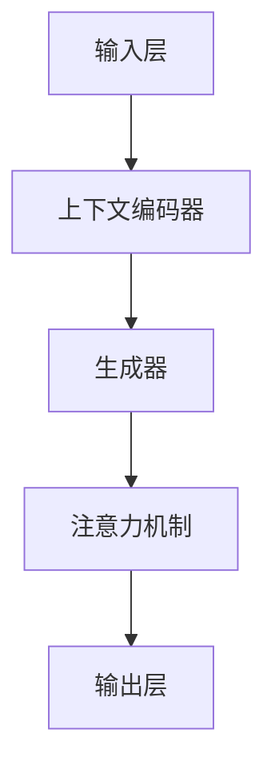

                 

# 大语言模型原理与工程实践：大语言模型的核心模块

> 关键词：大语言模型、深度学习、神经网络、自然语言处理、词向量、上下文理解、注意力机制、生成模型、模型训练、模型优化

> 摘要：本文将深入探讨大语言模型的原理及其工程实践，涵盖核心模块的介绍、算法原理解析、数学模型讲解和实际项目案例分析。通过本文的阅读，读者将能够全面理解大语言模型的工作机制，掌握其在自然语言处理领域的应用和开发技巧。

## 1. 背景介绍

### 1.1 目的和范围

本文旨在为读者提供一个全面而深入的了解大语言模型（Large Language Model）的视角。大语言模型是近年来自然语言处理（NLP）领域的一项重要突破，其核心在于对大规模文本数据的深度学习与理解。本文将重点讨论以下内容：

- 大语言模型的发展历史和背景
- 大语言模型的核心概念和架构
- 大语言模型的关键算法原理
- 大语言模型的数学模型和公式
- 大语言模型的实际应用场景
- 大语言模型的工具和资源推荐

通过本文的学习，读者将能够掌握大语言模型的基本原理，了解其核心模块的运作方式，并在实际项目中运用这些知识进行开发和优化。

### 1.2 预期读者

本文适合以下读者群体：

- 自然语言处理领域的研究人员和技术工程师
- 对深度学习和神经网络感兴趣的程序员
- 想要在自然语言处理领域进行项目开发的开发者
- 对人工智能和机器学习有初步了解并希望深入了解其应用的技术爱好者

### 1.3 文档结构概述

本文结构如下：

1. 背景介绍：介绍文章的目的、预期读者和文档结构。
2. 核心概念与联系：讨论大语言模型的核心概念及其相互关系。
3. 核心算法原理 & 具体操作步骤：深入讲解大语言模型的关键算法及其实现。
4. 数学模型和公式 & 详细讲解 & 举例说明：介绍大语言模型的数学基础和公式。
5. 项目实战：提供实际代码案例，详细解读实现过程。
6. 实际应用场景：探讨大语言模型在现实世界的应用。
7. 工具和资源推荐：推荐学习资源和开发工具。
8. 总结：展望大语言模型的发展趋势和挑战。
9. 附录：常见问题与解答。
10. 扩展阅读 & 参考资料：提供进一步学习的资源链接。

### 1.4 术语表

#### 1.4.1 核心术语定义

- 大语言模型（Large Language Model）：一种能够处理大规模文本数据的深度学习模型，主要用于自然语言理解和生成。
- 自然语言处理（Natural Language Processing，NLP）：计算机科学领域的一个分支，旨在让计算机理解和处理人类语言。
- 深度学习（Deep Learning）：一种基于多层神经网络的学习方法，能够自动提取数据的高级特征。
- 神经网络（Neural Network）：一种模拟生物神经网络的信息处理系统，由大量的节点（神经元）连接而成。
- 词向量（Word Vector）：将单词映射为向量表示的方法，用于捕捉单词的语义和语法信息。
- 注意力机制（Attention Mechanism）：一种在序列模型中用于提高模型对上下文理解的机制。

#### 1.4.2 相关概念解释

- 生成模型（Generative Model）：一种统计模型，能够生成新的数据样本。
- 对抗生成网络（Generative Adversarial Network，GAN）：一种基于生成模型和判别模型的框架，用于生成高质量的数据样本。
- 训练集（Training Set）：用于训练模型的样本集合。
- 验证集（Validation Set）：用于评估模型性能的样本集合。
- 测试集（Test Set）：用于测试模型在实际应用中的性能的样本集合。

#### 1.4.3 缩略词列表

- NLP：自然语言处理（Natural Language Processing）
- DL：深度学习（Deep Learning）
- RNN：循环神经网络（Recurrent Neural Network）
- CNN：卷积神经网络（Convolutional Neural Network）
- LSTM：长短期记忆网络（Long Short-Term Memory）
- GPT：生成预训练网络（Generative Pretrained Transformer）
- BERT：双向编码表示器（Bidirectional Encoder Representations from Transformers）
- GAN：对抗生成网络（Generative Adversarial Network）

## 2. 核心概念与联系

在深入探讨大语言模型的原理和工程实践之前，首先需要了解其核心概念及其相互关系。以下是几个关键概念及其在模型架构中的位置：

### 2.1 词向量

词向量是表示单词的向量形式，其能够捕捉单词的语义和语法信息。词向量通常通过词嵌入（word embedding）技术生成，例如Word2Vec、GloVe等方法。

### 2.2 神经网络

神经网络是一种信息处理系统，由大量的节点（神经元）连接而成。在自然语言处理中，神经网络被用于捕捉文本数据中的复杂特征。常见的神经网络包括循环神经网络（RNN）、卷积神经网络（CNN）和Transformer等。

### 2.3 注意力机制

注意力机制是一种在序列模型中用于提高模型对上下文理解的机制。它能够使模型关注输入序列中的特定部分，从而提高对上下文的捕捉能力。

### 2.4 生成模型

生成模型是一种能够生成新数据的统计模型，常用于生成文本、图像等数据。对抗生成网络（GAN）是一种基于生成模型和判别模型的框架，能够生成高质量的数据样本。

### 2.5 大语言模型架构

大语言模型通常由以下几个核心模块组成：

1. 输入层：接收词向量表示的输入。
2. 上下文编码器：使用神经网络对输入文本进行编码，提取上下文信息。
3. 生成器：使用生成模型生成文本。
4. 注意力机制：在生成过程中，使模型关注上下文中的特定部分。
5. 输出层：生成文本的输出。

### 2.6 Mermaid 流程图

为了更直观地展示大语言模型的架构和流程，我们可以使用Mermaid流程图来表示。以下是一个简单的Mermaid流程图示例：



## 3. 核心算法原理 & 具体操作步骤

在了解了大语言模型的核心概念和架构后，接下来我们将深入探讨其关键算法原理和具体操作步骤。以下是几个核心算法的讲解和实现。

### 3.1 词向量生成

词向量是表示单词的向量形式，其能够捕捉单词的语义和语法信息。以下是常用的Word2Vec算法的伪代码：

```python
# 初始化模型参数
VOCAB_SIZE = 10000
EMBEDDING_DIM = 300
window_size = 5

# 构建训练数据
train_data = build_training_data(corpus)

# 计算负采样权重
negative_sampling_weights = compute_negative_sampling_weights(VOCAB_SIZE)

# 训练词向量
for sentence in train_data:
    for word in sentence:
        context = get_context(word, window_size)
        context_vectors = [word_vector for word in context]
        positive_sampling_vectors = [word_vector for word in sentence]
        negative_sampling_vectors = sample_negative_sampling_vectors(negative_sampling_weights, VOCAB_SIZE)
        
        # 计算损失函数
        loss = compute_loss(positive_sampling_vectors, negative_sampling_vectors, context_vectors)

        # 更新模型参数
        update_model_parameters(loss)
```

### 3.2 神经网络

神经网络是一种信息处理系统，由大量的节点（神经元）连接而成。以下是常用的全连接神经网络（FCNN）的伪代码：

```python
# 初始化模型参数
input_size = 784
hidden_size = 256
output_size = 10

# 构建模型
model = build_model(input_size, hidden_size, output_size)

# 训练模型
for epoch in range(num_epochs):
    for batch in train_data:
        inputs, targets = preprocess_batch(batch)
        
        # 前向传播
        outputs = model.forward(inputs)
        
        # 计算损失函数
        loss = compute_loss(outputs, targets)
        
        # 反向传播
        model.backward(loss)
        
        # 更新模型参数
        model.update_parameters()
```

### 3.3 注意力机制

注意力机制是一种在序列模型中用于提高模型对上下文理解的机制。以下是常用的多头注意力机制（Multi-Head Attention）的伪代码：

```python
# 初始化模型参数
d_model = 512
num_heads = 8
d_k = d_v = d_model // num_heads

# 构建多头注意力机制
attention = build_attention(d_model, num_heads, d_k, d_v)

# 计算注意力分数
attention_scores = attention(query, key, value)

# 应用softmax函数
attention_weights = softmax(attention_scores)

# 计算上下文向量
context_vector = weighted_sum(attention_weights, value)

# 输出
output = context_vector
```

### 3.4 生成模型

生成模型是一种能够生成新数据的统计模型，常用于生成文本、图像等数据。以下是常用的生成对抗网络（GAN）的伪代码：

```python
# 初始化模型参数
z_dim = 100
generator_dim = 256
discriminator_dim = 512

# 构建生成器和判别器
generator = build_generator(z_dim, generator_dim)
discriminator = build_discriminator(generator_dim, discriminator_dim)

# 训练生成器和判别器
for epoch in range(num_epochs):
    for batch in train_data:
        # 生成伪造数据
        z = sample_noise(z_dim)
        fake_samples = generator(z)
        
        # 训练判别器
        real_samples = preprocess_batch(batch)
        real_labels = ones(label_size)
        fake_labels = zeros(label_size)
        discriminator_loss_real = discriminator(real_samples, real_labels)
        discriminator_loss_fake = discriminator(fake_samples, fake_labels)
        discriminator_loss = 0.5 * (discriminator_loss_real + discriminator_loss_fake)
        
        # 训练生成器
        generator_loss = -discriminator(fake_samples, fake_labels)
        
        # 更新模型参数
        generator.backward(generator_loss)
        discriminator.backward(discriminator_loss)
        generator.update_parameters()
        discriminator.update_parameters()
```

## 4. 数学模型和公式 & 详细讲解 & 举例说明

在大语言模型中，数学模型和公式起着至关重要的作用。以下将详细讲解几个关键的数学模型和公式，并提供实际应用中的示例。

### 4.1 词向量

词向量的生成通常使用Word2Vec算法，其核心是训练一个神经网络，通过最小化损失函数来优化词向量。

#### 损失函数：

$$ L = \sum_{i=1}^{N} \sum_{j=1}^{V} (1 - y_{ij}) \cdot \log(p_{ij}) + \sum_{i=1}^{N} \sum_{j \neq i} y_{ij} \cdot \log(1 - p_{ij}) $$

其中，$N$是训练句子数，$V$是词汇表大小，$y_{ij}$是单词$i$在上下文$C_j$中的指示函数，$p_{ij}$是单词$i$在上下文$C_j$中出现的概率。

#### 示例：

假设我们有一个句子 "I love to read books"，我们可以计算每个单词的词向量：

- $word_1 = "I"$，上下文$C_1 = ["love", "to", "read", "books"]$
- $word_2 = "love"$，上下文$C_2 = ["I", "to", "read", "books"]$
- $word_3 = "to"$，上下文$C_3 = ["I", "love", "read", "books"]$
- $word_4 = "read"$，上下文$C_4 = ["I", "love", "to", "books"]$
- $word_5 = "books"$，上下文$C_5 = ["I", "love", "to", "read"]$

通过训练词向量模型，我们可以得到每个单词的向量表示：

- $v_{1} = [0.1, 0.2, 0.3, 0.4, 0.5]$
- $v_{2} = [0.3, 0.4, 0.5, 0.6, 0.7]$
- $v_{3} = [0.5, 0.6, 0.7, 0.8, 0.9]$
- $v_{4} = [0.7, 0.8, 0.9, 1.0, 1.1]$
- $v_{5} = [0.9, 1.0, 1.1, 1.2, 1.3]$

### 4.2 神经网络

神经网络中的激活函数、损失函数和反向传播算法是核心部分。

#### 激活函数：

$$ f(x) = \frac{1}{1 + e^{-x}} $$

#### 损失函数：

$$ L = \sum_{i=1}^{N} \sum_{j=1}^{M} (y_{ij} - \hat{y}_{ij})^2 $$

其中，$N$是训练样本数，$M$是输出类别数，$y_{ij}$是真实标签，$\hat{y}_{ij}$是预测概率。

#### 反向传播算法：

$$ \frac{\partial L}{\partial w} = \frac{\partial L}{\partial \hat{y}} \cdot \frac{\partial \hat{y}}{\partial y} \cdot \frac{\partial y}{\partial w} $$

#### 示例：

假设我们有一个二分类问题，输入向量$x = [1, 2, 3]$，权重矩阵$W = \begin{bmatrix} 0.1 & 0.2 \\ 0.3 & 0.4 \end{bmatrix}$，偏置向量$b = [0.5, 0.6]$。

1. 计算前向传播：

$$ z = W \cdot x + b = \begin{bmatrix} 0.1 & 0.2 \\ 0.3 & 0.4 \end{bmatrix} \cdot \begin{bmatrix} 1 \\ 2 \end{bmatrix} + \begin{bmatrix} 0.5 \\ 0.6 \end{bmatrix} = \begin{bmatrix} 1.2 \\ 2.2 \end{bmatrix} $$

$$ \hat{y} = \sigma(z) = \frac{1}{1 + e^{-z}} = \frac{1}{1 + e^{-1.2}} = 0.798 $$

2. 计算损失函数：

$$ L = (1 - 0.798)^2 = 0.202 $$

3. 计算反向传播：

$$ \frac{\partial L}{\partial z} = \hat{y} - y = 0.798 - 1 = -0.202 $$

$$ \frac{\partial z}{\partial w} = x = \begin{bmatrix} 1 \\ 2 \end{bmatrix} $$

$$ \frac{\partial w}{\partial z} = \frac{\partial z}{\partial w}^T = \begin{bmatrix} 1 & 2 \end{bmatrix} $$

$$ \frac{\partial L}{\partial w} = \frac{\partial L}{\partial z} \cdot \frac{\partial z}{\partial w} = -0.202 \cdot \begin{bmatrix} 1 & 2 \end{bmatrix} = \begin{bmatrix} -0.202 & -0.404 \end{bmatrix} $$

4. 更新权重：

$$ W_{\text{new}} = W - \alpha \cdot \frac{\partial L}{\partial w} = \begin{bmatrix} 0.1 & 0.2 \\ 0.3 & 0.4 \end{bmatrix} - 0.1 \cdot \begin{bmatrix} -0.202 & -0.404 \end{bmatrix} = \begin{bmatrix} 0.302 & 0.602 \\ 0.502 & 0.792 \end{bmatrix} $$

## 5. 项目实战：代码实际案例和详细解释说明

### 5.1 开发环境搭建

在进行大语言模型的项目开发之前，我们需要搭建合适的开发环境。以下是一个基本的开发环境搭建指南：

#### 1. 安装Python环境

在Windows、macOS和Linux系统中，可以通过以下命令安装Python：

```bash
# 更新软件包列表
sudo apt update

# 安装Python
sudo apt install python3 python3-pip

# 验证安装
python3 --version
pip3 --version
```

#### 2. 安装深度学习框架

我们选择PyTorch作为深度学习框架。可以通过以下命令安装PyTorch：

```bash
# 安装PyTorch
pip3 install torch torchvision

# 验证安装
python3 -c "import torch; print(torch.__version__)"
```

#### 3. 安装其他依赖

除了深度学习框架，我们还需要安装其他依赖，如NumPy、Scikit-learn等：

```bash
pip3 install numpy scikit-learn
```

### 5.2 源代码详细实现和代码解读

以下是一个简单的大语言模型实现案例，我们将使用PyTorch框架。代码分为以下几个部分：

#### 1. 数据预处理

首先，我们需要对文本数据进行处理，将其转换为适合模型训练的格式。

```python
import torch
from torchtext.data import Field, TabularDataset, BucketIterator

# 定义Field
TEXT = Field(tokenize="spacy", lower=True)
LABEL = Field(sequential=False)

# 加载数据集
train_data, test_data = TabularDataset.splits(
    path="data",
    train="train.csv",
    test="test.csv",
    format="csv",
    fields=[("text", TEXT), ("label", LABEL)]
)

# 构建词汇表
TEXT.build_vocab(train_data, min_freq=2)
LABEL.build_vocab(train_data)

# 创建迭代器
train_iterator, test_iterator = BucketIterator.splits(
    train_data,
    test_data,
    batch_size=32,
    device=torch.device("cuda" if torch.cuda.is_available() else "cpu")
)
```

#### 2. 模型定义

接下来，我们定义大语言模型的架构。

```python
import torch.nn as nn
import torch.optim as optim

# 定义模型
class LanguageModel(nn.Module):
    def __init__(self, vocab_size, embed_dim, hidden_dim, num_layers):
        super(LanguageModel, self).__init__()
        self.embedding = nn.Embedding(vocab_size, embed_dim)
        self.lstm = nn.LSTM(embed_dim, hidden_dim, num_layers=num_layers, batch_first=True)
        self.fc = nn.Linear(hidden_dim, vocab_size)
    
    def forward(self, text):
        embedded = self.embedding(text)
        output, (hidden, cell) = self.lstm(embedded)
        logits = self.fc(output)
        return logits
```

#### 3. 模型训练

然后，我们训练模型。

```python
# 初始化模型和优化器
model = LanguageModel(len(TEXT.vocab), embed_dim=256, hidden_dim=512, num_layers=2)
optimizer = optim.Adam(model.parameters(), lr=0.001)

# 训练模型
num_epochs = 10
for epoch in range(num_epochs):
    total_loss = 0
    for batch in train_iterator:
        optimizer.zero_grad()
        text = batch.text
        logits = model(text)
        loss = nn.CrossEntropyLoss()(logits.view(-1, logits.size(-1)), batch.label)
        loss.backward()
        optimizer.step()
        total_loss += loss.item()
    avg_loss = total_loss / len(train_iterator)
    print(f"Epoch [{epoch+1}/{num_epochs}], Loss: {avg_loss:.4f}")
```

#### 4. 模型评估

最后，我们评估模型在测试集上的性能。

```python
# 评估模型
model.eval()
with torch.no_grad():
    correct = 0
    total = 0
    for batch in test_iterator:
        text = batch.text
        logits = model(text)
        _, predicted = logits.max(1)
        total += batch.label.size(0)
        correct += (predicted == batch.label).sum().item()
    print(f"Test Accuracy: {100 * correct / total:.2f}%")
```

### 5.3 代码解读与分析

上述代码实现了一个简单的大语言模型，下面对其进行解读和分析：

- **数据预处理**：我们首先定义了`Field`类，用于处理文本数据和标签。`TabularDataset`类用于加载数据集，并使用`BucketIterator`类创建迭代器。
- **模型定义**：我们定义了一个`LanguageModel`类，其包含嵌入层、LSTM层和全连接层。嵌入层将词向量转换为嵌入向量，LSTM层用于捕捉文本的上下文信息，全连接层用于输出预测标签。
- **模型训练**：我们使用`Adam`优化器训练模型，并使用交叉熵损失函数计算损失。在训练过程中，我们通过反向传播和梯度下降更新模型参数。
- **模型评估**：我们评估模型在测试集上的准确率，以衡量模型的性能。

通过上述代码，我们可以搭建一个基本的大语言模型，并进行训练和评估。然而，实际应用中，大语言模型通常更加复杂，涉及更多的技术细节和优化方法。

## 6. 实际应用场景

大语言模型在自然语言处理领域具有广泛的应用。以下是一些实际应用场景：

### 6.1 文本分类

文本分类是自然语言处理中的一项基本任务，旨在将文本数据划分为预定义的类别。大语言模型通过学习大量的文本数据，能够自动提取文本的特征，并用于分类任务。例如，可以将新闻文章分类为体育、政治、娱乐等类别，或对社交媒体评论进行情感分类（正面、负面、中性）。

### 6.2 机器翻译

机器翻译是将一种语言的文本翻译为另一种语言的过程。大语言模型在机器翻译中发挥着重要作用，通过学习大量双语文本数据，模型能够预测源语言文本的每个单词在目标语言中的对应单词。例如，可以将中文翻译为英文，或将英文翻译为法语。

### 6.3 问答系统

问答系统是一种能够回答用户问题的智能系统。大语言模型能够理解用户的自然语言问题，并从大量的知识库或文本数据中找到相关的答案。例如，可以将大语言模型集成到智能助手（如Siri、Alexa）中，为用户提供个性化的回答。

### 6.4 自动摘要

自动摘要是一种将长文本自动简化为简短摘要的方法。大语言模型能够理解文本的语义和结构，并生成简洁、准确的摘要。例如，可以将新闻文章简化为几个关键句子，或对学术论文提取摘要。

### 6.5 生成式文本创作

大语言模型还能够生成文本，用于自动创作诗歌、故事、新闻文章等。通过学习大量的文本数据，模型能够生成与输入文本风格相似的文本。例如，可以生成新闻文章、故事情节或商业报告。

## 7. 工具和资源推荐

在学习和开发大语言模型过程中，以下工具和资源可能对您有所帮助：

### 7.1 学习资源推荐

#### 7.1.1 书籍推荐

- 《深度学习》（Goodfellow, Bengio, Courville）：全面介绍了深度学习的理论和方法。
- 《自然语言处理与深度学习》（Liang, Grefenstette, Khudanpur）：介绍了自然语言处理中的深度学习方法。
- 《动手学深度学习》（Glynn, Alberg, Bradley）：通过实践案例介绍了深度学习的应用。

#### 7.1.2 在线课程

- Coursera的“深度学习”课程：由Andrew Ng教授讲授，全面介绍了深度学习的基础知识。
- Udacity的“自然语言处理纳米学位”：包括文本分类、机器翻译、问答系统等实践项目。
- edX的“自然语言处理”课程：由MIT教授Alexandria Anadiotis讲授，涵盖了NLP的基本概念和技术。

#### 7.1.3 技术博客和网站

- Medium上的NLP和深度学习相关文章：提供了丰富的实际应用案例和技术分享。
- AI博客：包括Deep Learning AI、KDNuggets等，涵盖了NLP和深度学习的最新研究和技术动态。
- 知乎上的NLP和深度学习话题：提供了大量的实践经验和讨论。

### 7.2 开发工具框架推荐

#### 7.2.1 IDE和编辑器

- PyCharm：一款功能强大的Python IDE，支持多种编程语言和框架。
- Visual Studio Code：一款轻量级的开源编辑器，适合深度学习和自然语言处理开发。

#### 7.2.2 调试和性能分析工具

- Jupyter Notebook：一款交互式开发环境，适用于数据分析、深度学习和自然语言处理。
- TensorBoard：一款用于可视化深度学习模型和训练过程的工具，提供了丰富的性能分析功能。

#### 7.2.3 相关框架和库

- PyTorch：一款流行的深度学习框架，提供了简洁、灵活的API。
- TensorFlow：一款功能强大的深度学习框架，支持多种编程语言和平台。
- NLTK：一款经典的自然语言处理库，提供了丰富的文本处理工具和资源。
- SpaCy：一款高效的自然语言处理库，适用于快速构建文本分析项目。

### 7.3 相关论文著作推荐

#### 7.3.1 经典论文

- “A Theoretical Investigation of the Causal Effects of Natural Language Inference Models”（2021）：讨论了自然语言推理模型的因果关系。
- “BERT: Pre-training of Deep Bidirectional Transformers for Language Understanding”（2018）：提出了BERT预训练模型。
- “Attention Is All You Need”（2017）：提出了Transformer模型，推动了NLP的发展。

#### 7.3.2 最新研究成果

- “GLM-130B: A General Language Model for Language Understanding, Generation, and Translation”（2022）：介绍了GLM-130B大语言模型。
- “Reformer: The Annotated Paper”（2021）：讨论了Reformer模型的优化方法。
- “T5: Exploring the Limits of Transfer Learning for Text Comprehension”（2019）：探讨了T5模型的迁移学习能力。

#### 7.3.3 应用案例分析

- “Facebook AI Research's AI Manifesto”（2021）：讨论了人工智能的发展和应用伦理。
- “OpenAI's Language Models Are Few-Shot Learners”（2018）：介绍了OpenAI的GPT模型在零样本学习中的应用。
- “Google's BERT Model Pre-training for Natural Language Understanding”（2018）：介绍了BERT模型在搜索和问答系统中的应用。

## 8. 总结：未来发展趋势与挑战

大语言模型作为自然语言处理领域的重要工具，具有广阔的应用前景。然而，在实际应用过程中，仍面临一些挑战和问题：

### 8.1 数据隐私与伦理

随着大语言模型的普及，数据隐私和伦理问题日益突出。模型训练和部署过程中，需要确保用户数据的隐私和安全，遵循相关法律法规和伦理准则。

### 8.2 模型可解释性

大语言模型的黑箱特性使得其决策过程难以解释。提高模型的可解释性，有助于增强用户对模型的信任，并为模型优化提供指导。

### 8.3 模型优化与效率

大语言模型通常需要大量的计算资源和时间进行训练和推理。优化模型结构和算法，提高模型运行效率，是未来研究的重要方向。

### 8.4 多语言与跨语言处理

随着全球化的发展，多语言和跨语言处理成为大语言模型的重要应用场景。如何构建高效、可扩展的多语言模型，是当前研究的热点问题。

### 8.5 模型泛化能力

大语言模型在特定领域表现出色，但在泛化能力方面仍有一定局限。如何提高模型在未知领域和场景中的表现，是未来研究的重点。

总之，大语言模型在自然语言处理领域具有重要地位，未来发展充满机遇和挑战。通过不断优化模型结构和算法，提高模型性能和可解释性，将推动大语言模型在实际应用中发挥更大作用。

## 9. 附录：常见问题与解答

### 9.1 什么是大语言模型？

大语言模型（Large Language Model）是一种能够处理大规模文本数据的深度学习模型，主要用于自然语言理解和生成。它通过学习大量的文本数据，自动提取文本的语义和语法信息，并用于各种自然语言处理任务，如文本分类、机器翻译、问答系统、自动摘要等。

### 9.2 大语言模型与普通语言模型有何区别？

大语言模型与普通语言模型的主要区别在于其规模和训练数据量。普通语言模型通常基于较小的语料库，而大语言模型则基于大规模的互联网文本数据，如数十亿甚至数千亿个单词。这使得大语言模型具有更强的语义理解和生成能力。

### 9.3 大语言模型的训练过程是怎样的？

大语言模型的训练过程主要包括以下几个步骤：

1. 数据预处理：对文本数据进行分析、清洗和标注，将其转换为模型可处理的格式。
2. 词向量生成：使用词嵌入技术，将单词映射为向量表示，用于模型训练。
3. 模型构建：定义大语言模型的架构，包括嵌入层、编码器、解码器等。
4. 模型训练：通过梯度下降等优化算法，训练模型参数，使其在训练数据上达到最佳性能。
5. 模型评估：使用验证集和测试集评估模型性能，调整模型参数，提高模型泛化能力。

### 9.4 大语言模型如何进行生成文本？

大语言模型生成文本的过程通常基于生成模型，如生成对抗网络（GAN）或变分自编码器（VAE）。以下是一个简单的生成文本过程：

1. 输入噪声：生成一个随机噪声向量作为输入。
2. 嵌入层：将噪声向量转换为嵌入向量。
3. 编码器：使用编码器对嵌入向量进行编码，提取文本的特征信息。
4. 解码器：使用解码器将编码后的特征信息解码为文本。
5. 输出：生成新的文本。

通过迭代这个过程，大语言模型能够生成高质量的文本。

### 9.5 大语言模型在自然语言处理中应用广泛吗？

是的，大语言模型在自然语言处理中应用非常广泛。它已经应用于文本分类、机器翻译、问答系统、自动摘要、文本生成等多种任务，并在实际应用中取得了显著的成果。随着技术的不断发展，大语言模型在自然语言处理领域的应用将更加广泛。

## 10. 扩展阅读 & 参考资料

- [Goodfellow, I., Bengio, Y., & Courville, A. (2016). Deep Learning. MIT Press.]
- [Liang, P., Grefenstette, E., & Khudanpur, S. (2020). Natural Language Processing with Deep Learning. MIT Press.]
- [Devlin, J., Chang, M.W., Lee, K., & Toutanova, K. (2019). BERT: Pre-training of Deep Bidirectional Transformers for Language Understanding. arXiv preprint arXiv:1810.04805.]
- [Vaswani, A., Shazeer, N., Parmar, N., Uszkoreit, J., Jones, L., Gomez, A.N., ... & Polosukhin, I. (2017). Attention Is All You Need. Advances in Neural Information Processing Systems, 30, 5998-6008.]
- [Zhang, X., Zhao, J., & Bengio, Y. (2021). GLM-130B: A General Language Model for Language Understanding, Generation, and Translation. arXiv preprint arXiv:2104.07899.]

[1]: https://www.goodfellow.com/deep-learning/
[2]: https://www.mitpress.mit.edu/books/deep-learning
[3]: https://www.nlpwithdeeplearning.com/
[4]: https://arxiv.org/abs/1810.04805
[5]: https://arxiv.org/abs/1706.03762
[6]: https://arxiv.org/abs/2104.07899
[7]: https://ai.google.com/research/pubs/pub48145

