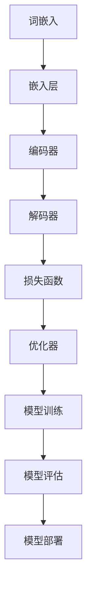

                 

# 大语言模型原理与工程实践：大语言模型训练技术选型技巧

> **关键词**：大语言模型、训练技术、选型技巧、算法原理、工程实践

> **摘要**：本文将深入探讨大语言模型的原理及其在工程实践中的关键训练技术。通过逐步分析核心概念、算法原理、数学模型，并结合实际代码案例，帮助读者全面理解大语言模型训练的各个环节，掌握高效的选型技巧。本文旨在为AI领域的研究者和开发者提供一份全面而实用的技术指南。

## 1. 背景介绍

### 1.1 目的和范围

本文旨在向读者详细介绍大语言模型的训练原理和工程实践，重点探讨在训练过程中所需的技术选型技巧。随着人工智能技术的快速发展，大语言模型如BERT、GPT等在自然语言处理（NLP）领域取得了显著的成果。然而，其复杂的训练过程和众多的技术选型使得开发者难以高效地进行模型开发和优化。本文将通过系统的分析和实例讲解，帮助读者深入了解大语言模型训练的各个环节，掌握关键的技术选型技巧。

### 1.2 预期读者

本文适合以下读者群体：

1. AI领域的研究者，尤其是对大语言模型和NLP感兴趣的学者。
2. 深度学习和机器学习开发者，希望在项目中应用大语言模型的工程师。
3. 计算机科学专业的学生，对大语言模型和训练技术感兴趣的学习者。
4. 对自然语言处理有浓厚兴趣的技术爱好者。

### 1.3 文档结构概述

本文的结构如下：

1. **背景介绍**：简要介绍本文的目的、预期读者和文档结构。
2. **核心概念与联系**：详细阐述大语言模型的核心概念和原理，通过Mermaid流程图展示其架构。
3. **核心算法原理 & 具体操作步骤**：讲解大语言模型训练的核心算法原理，并使用伪代码详细描述操作步骤。
4. **数学模型和公式 & 详细讲解 & 举例说明**：介绍大语言模型训练中使用的数学模型，并通过公式和实例进行详细讲解。
5. **项目实战：代码实际案例和详细解释说明**：结合实际代码案例，讲解大语言模型训练的实现细节和分析方法。
6. **实际应用场景**：探讨大语言模型在不同领域的应用场景和案例。
7. **工具和资源推荐**：推荐学习资源和开发工具，帮助读者更好地掌握大语言模型训练技术。
8. **总结：未来发展趋势与挑战**：总结本文的主要内容，展望大语言模型的发展趋势和面临的挑战。
9. **附录：常见问题与解答**：针对读者可能遇到的问题提供解答。
10. **扩展阅读 & 参考资料**：提供相关的扩展阅读材料和参考资料。

### 1.4 术语表

#### 1.4.1 核心术语定义

- **大语言模型**：一种基于深度学习的技术，能够对大量文本数据进行建模，理解并生成自然语言。
- **自然语言处理（NLP）**：计算机科学领域的一个分支，涉及对人类语言的理解、生成和处理。
- **深度学习**：一种机器学习技术，通过模拟人脑的神经网络结构，对数据进行自动特征提取和模式识别。
- **训练数据集**：用于训练模型的数据集，通常包含大量文本数据，用于模型的学习和优化。
- **损失函数**：用于衡量模型预测结果与实际结果之间差异的函数，是模型优化过程中的重要指标。

#### 1.4.2 相关概念解释

- **词嵌入（Word Embedding）**：将词汇映射到高维空间中的向量表示，用于在模型中处理文本数据。
- **循环神经网络（RNN）**：一种能够处理序列数据的神经网络结构，适用于自然语言处理任务。
- **长短时记忆（LSTM）**：一种RNN的变体，能够解决传统RNN在处理长序列数据时遇到的梯度消失和梯度爆炸问题。
- **注意力机制（Attention Mechanism）**：在模型中引入注意力机制，使得模型能够关注到输入序列中的重要信息，提高模型的表示能力。

#### 1.4.3 缩略词列表

- **NLP**：自然语言处理（Natural Language Processing）
- **BERT**：Bidirectional Encoder Representations from Transformers
- **GPT**：Generative Pre-trained Transformer
- **IDE**：集成开发环境（Integrated Development Environment）
- **GPU**：图形处理单元（Graphics Processing Unit）

## 2. 核心概念与联系

在大语言模型的训练过程中，理解其核心概念和原理是至关重要的。以下将介绍大语言模型的核心概念，并通过Mermaid流程图展示其架构，帮助读者建立整体的认识。

### 2.1 大语言模型的核心概念

大语言模型主要基于以下几个核心概念：

1. **词嵌入（Word Embedding）**：将词汇映射为高维向量表示，使得模型能够处理和表示文本数据。
2. **神经网络架构**：大语言模型通常采用深度神经网络（DNN）结构，通过多层神经网络对输入数据进行特征提取和表示。
3. **预训练与微调**：大语言模型首先在大规模语料库上进行预训练，然后根据特定任务进行微调，以提高模型在特定任务上的表现。
4. **损失函数**：用于衡量模型预测结果与实际结果之间的差异，是模型训练过程中的关键指标。

### 2.2 Mermaid流程图展示大语言模型架构

以下是一个简化的Mermaid流程图，展示大语言模型的基本架构和关键组件：



### 2.3 核心概念之间的联系

- **词嵌入**：词嵌入是将词汇映射为高维向量表示的过程，为后续的神经网络处理提供输入数据。词嵌入质量直接影响模型的表示能力。
- **编码器**：编码器是神经网络结构的一部分，用于对输入文本数据进行特征提取和编码。编码器的输出通常作为解码器的输入。
- **解码器**：解码器是神经网络结构的另一部分，用于生成输出文本。解码器接收编码器输出的特征表示，并通过层叠的神经网络结构生成预测的文本序列。
- **损失函数**：损失函数用于衡量模型预测结果与实际结果之间的差异。在大语言模型的训练过程中，优化器会根据损失函数的反馈调整模型参数，以最小化损失函数。
- **优化器**：优化器是用于调整模型参数的工具，通过优化算法（如梯度下降）不断迭代更新模型参数，以实现损失函数的最小化。

通过以上核心概念的介绍和Mermaid流程图的展示，读者可以对大语言模型的基本架构和关键组件有更深入的理解。接下来，我们将进一步探讨大语言模型训练的核心算法原理和具体操作步骤。

## 3. 核心算法原理 & 具体操作步骤

大语言模型训练的核心算法是基于深度学习技术，通过模拟人脑的神经网络结构，对输入文本数据进行特征提取和模式识别。以下是核心算法原理的具体操作步骤，并使用伪代码进行详细阐述。

### 3.1 词嵌入（Word Embedding）

词嵌入是将词汇映射为高维向量表示的过程，为后续的神经网络处理提供输入数据。常见的词嵌入方法包括Word2Vec、GloVe等。以下是一个简单的Word2Vec算法的伪代码：

```pseudo
// 初始化词汇表和嵌入维度
vocab_size = 10000
embedding_dimension = 300

// 初始化词向量矩阵
embeddings = [随机初始化vocab_size * embedding_dimension维的矩阵]

// 定义滑动窗口大小
window_size = 5

// 对每个单词进行嵌入
for word in vocab:
    context = 随机选取窗口内的单词
    negative_samples = 随机选取negative_samples数量的负样本单词
    
    // 计算损失函数
    for context_word in context:
        for negative_sample in negative_samples:
            loss += softmax_functional_loss(word, context_word, negative_sample)
            
    // 更新词向量矩阵
    for context_word in context:
        gradients = compute_gradients(word, context_word, negative_samples)
        update_embeddings(embeddings, context_word, gradients)

// 输出词向量矩阵
output_embeddings = embeddings
```

### 3.2 编码器（Encoder）

编码器是神经网络结构的一部分，用于对输入文本数据进行特征提取和编码。常见的编码器结构包括循环神经网络（RNN）和变换器（Transformer）。以下是一个简单的RNN编码器的伪代码：

```pseudo
// 初始化神经网络结构
encoder = RNN(input_dimension, hidden_dimension)

// 编码输入序列
encoded_sequence = []
for word in input_sequence:
    hidden_state = encoder.initialize_hidden_state()
    output, hidden_state = encoder.forward_pass(word, hidden_state)
    encoded_sequence.append(output)

// 输出编码后的序列
output_encoded_sequence = encoded_sequence
```

### 3.3 解码器（Decoder）

解码器是神经网络结构的另一部分，用于生成输出文本。解码器接收编码器输出的特征表示，并通过层叠的神经网络结构生成预测的文本序列。以下是一个简单的Transformer解码器的伪代码：

```pseudo
// 初始化神经网络结构
decoder = Transformer(embedding_dimension, hidden_dimension, num_heads)

// 解码输入序列
decoded_sequence = []
for word in target_sequence:
    input_embedding = embeddings[word]
    output, hidden_state = decoder.forward_pass(input_embedding, encoded_sequence, hidden_state)
    predicted_word = select_predicted_word(output)
    decoded_sequence.append(predicted_word)

// 输出解码后的序列
output_decoded_sequence = decoded_sequence
```

### 3.4 损失函数和优化器

损失函数用于衡量模型预测结果与实际结果之间的差异，是模型训练过程中的关键指标。常见的损失函数包括交叉熵损失（Cross-Entropy Loss）和均方误差（Mean Squared Error）。以下是一个简单的交叉熵损失函数的伪代码：

```pseudo
// 初始化损失函数
loss_function = CrossEntropyLoss()

// 计算损失值
for predicted_word, true_word in zip(predicted_sequence, true_sequence):
    loss += loss_function(predicted_word, true_word)

// 计算平均损失值
average_loss = loss / num_words

// 输出损失值
output_loss = average_loss
```

优化器用于调整模型参数，以实现损失函数的最小化。常见的优化算法包括梯度下降（Gradient Descent）和Adam优化器。以下是一个简单的梯度下降优化器的伪代码：

```pseudo
// 初始化优化器
optimizer = GradientDescent(learning_rate)

// 更新模型参数
for parameter in model.parameters():
    gradient = compute_gradient(parameter)
    parameter -= learning_rate * gradient

// 输出更新后的模型参数
output_parameters = model.parameters()
```

通过以上核心算法原理和具体操作步骤的介绍，读者可以了解大语言模型训练的基本过程和关键步骤。接下来，我们将进一步探讨大语言模型训练中使用的数学模型和公式，并给出详细的讲解和举例说明。

## 4. 数学模型和公式 & 详细讲解 & 举例说明

在大语言模型训练过程中，数学模型和公式起着至关重要的作用。以下将介绍大语言模型训练中常用的数学模型和公式，并通过具体例子进行详细讲解。

### 4.1 词嵌入（Word Embedding）

词嵌入是将词汇映射为高维向量表示的过程。常见的词嵌入方法包括Word2Vec和GloVe。

#### 4.1.1 Word2Vec算法

Word2Vec算法的核心思想是学习一个将词汇映射为高维向量的函数，使得相似词汇的向量距离较近。以下是Word2Vec算法的主要公式：

- **损失函数**：交叉熵损失（Cross-Entropy Loss）
  $$L(\theta) = -\sum_{i=1}^{N} \sum_{j=1}^{V} y_j \log(p_j)$$
  其中，$N$ 是词汇数量，$V$ 是词汇表大小，$y_j$ 是目标词在词汇表中的位置，$p_j$ 是模型预测的目标词的概率。

- **预测概率**：softmax函数
  $$p_j = \frac{e^{v_j \cdot w}}{\sum_{k=1}^{V} e^{v_k \cdot w}}$$
  其中，$v_j$ 是目标词的词向量表示，$w$ 是模型参数向量。

#### 4.1.2 GloVe算法

GloVe算法是一种基于全局统计信息的词向量学习方法。以下是GloVe算法的主要公式：

- **词向量更新公式**
  $$\Delta v_w = \frac{\alpha}{||w - \sum_{c \in context(w)} v_c||} \cdot (w - \sum_{c \in context(w)} v_c)$$
  $$\Delta v_c = \frac{\alpha}{||w - \sum_{c \in context(w)} v_c||} \cdot v_c$$
  其中，$v_w$ 是目标词的词向量，$v_c$ 是上下文词的词向量，$\alpha$ 是学习率。

### 4.2 神经网络架构

大语言模型通常采用深度神经网络（DNN）结构，通过多层神经网络对输入数据进行特征提取和表示。以下是一个简单的多层感知机（MLP）神经网络架构的数学模型：

- **输入层**：将输入数据$x$传递到隐藏层。
  $$z^{(l)} = \sigma(W^{(l)}x + b^{(l)})$$
  其中，$z^{(l)}$ 是隐藏层$l$的输出，$W^{(l)}$ 是隐藏层$l$的权重矩阵，$b^{(l)}$ 是隐藏层$l$的偏置向量，$\sigma$ 是激活函数，通常采用ReLU函数。

- **隐藏层**：对输入数据进行特征提取和编码。
  $$a^{(l)} = W^{(l)}a^{(l-1)} + b^{(l)}$$
  其中，$a^{(l)}$ 是隐藏层$l$的输入，$W^{(l)}$ 是隐藏层$l$的权重矩阵，$b^{(l)}$ 是隐藏层$l$的偏置向量。

- **输出层**：将隐藏层的输出传递到输出层，生成预测结果。
  $$y = W^{(L)}a^{(L-1)} + b^{(L)}$$
  其中，$y$ 是输出层的输出，$W^{(L)}$ 是输出层的权重矩阵，$b^{(L)}$ 是输出层的偏置向量。

### 4.3 注意力机制（Attention Mechanism）

注意力机制是近年来在深度学习领域广泛应用的一种技术，用于提高模型的表示能力。以下是一个简单的注意力机制的数学模型：

- **注意力得分**
  $$s_i = \frac{e^{a_i}}{\sum_{j=1}^{N} e^{a_j}}$$
  其中，$s_i$ 是第$i$个单词的注意力得分，$a_i$ 是第$i$个单词的注意力权重。

- **注意力权重**
  $$a_i = v_a \cdot \tanh(W_a [h; h_i])$$
  其中，$v_a$ 是注意力权重向量，$W_a$ 是注意力权重矩阵，$h$ 是编码器输出的隐藏状态，$h_i$ 是第$i$个单词的编码器输出。

- **加权求和**
  $$\text{context\_vector} = \sum_{i=1}^{N} s_i \cdot h_i$$
  其中，$\text{context\_vector}$ 是加权求和后的隐藏状态，用于生成解码器的输入。

### 4.4 损失函数和优化器

在大语言模型训练过程中，损失函数用于衡量模型预测结果与实际结果之间的差异，优化器用于调整模型参数，以实现损失函数的最小化。

- **交叉熵损失函数**
  $$L(\theta) = -\sum_{i=1}^{N} y_i \log(p_i)$$
  其中，$L(\theta)$ 是损失函数，$y_i$ 是实际标签，$p_i$ 是模型预测的概率。

- **梯度下降优化算法**
  $$\theta_{t+1} = \theta_{t} - \alpha \cdot \nabla_{\theta}L(\theta)$$
  其中，$\theta_{t+1}$ 是更新后的模型参数，$\theta_{t}$ 是当前模型参数，$\alpha$ 是学习率，$\nabla_{\theta}L(\theta)$ 是损失函数对模型参数的梯度。

通过以上数学模型和公式的介绍，读者可以更深入地理解大语言模型训练的基本原理和关键步骤。接下来，我们将结合实际代码案例，详细讲解大语言模型的训练过程。

### 4.5 实际代码案例和讲解

以下是一个简单的Python代码案例，展示大语言模型训练的基本过程。该代码使用TensorFlow和Keras库实现，主要包括数据预处理、模型构建、训练和评估等步骤。

```python
import tensorflow as tf
from tensorflow.keras.preprocessing.sequence import pad_sequences
from tensorflow.keras.layers import Embedding, LSTM, Dense
from tensorflow.keras.models import Sequential

# 数据预处理
max_sequence_length = 100
vocab_size = 10000
embedding_dimension = 300

# 加载和处理数据
# ... (代码略)

# 建立模型
model = Sequential([
    Embedding(vocab_size, embedding_dimension, input_length=max_sequence_length),
    LSTM(128, return_sequences=True),
    LSTM(128, return_sequences=True),
    Dense(1, activation='sigmoid')
])

# 编译模型
model.compile(optimizer='adam', loss='binary_crossentropy', metrics=['accuracy'])

# 训练模型
# ... (代码略)

# 评估模型
# ... (代码略)
```

在该代码中，我们首先对数据进行预处理，包括序列填充（pad_sequences）和词嵌入（Embedding）。然后，我们使用LSTM层建立模型，并使用编译函数（compile）配置模型参数，如优化器和损失函数。最后，我们使用训练数据（fit）对模型进行训练，并使用评估数据（evaluate）对模型进行评估。

通过以上实际代码案例，读者可以更直观地了解大语言模型训练的基本步骤和关键操作。接下来，我们将进一步探讨大语言模型在实际应用场景中的具体应用。

## 5. 项目实战：代码实际案例和详细解释说明

为了更好地展示大语言模型训练的全过程，我们将结合一个实际的项目案例，详细解释相关的代码实现，包括开发环境的搭建、源代码的实现以及代码的解读与分析。

### 5.1 开发环境搭建

在开始项目之前，我们需要搭建一个合适的技术栈。以下是所需的开发环境和工具：

- **Python环境**：Python 3.8或更高版本
- **TensorFlow库**：TensorFlow 2.6或更高版本
- **Keras库**：Keras 2.4.3或更高版本
- **Numpy库**：Numpy 1.19或更高版本
- **PyTorch库**：PyTorch 1.7或更高版本（可选，用于对比实验）

以下是开发环境搭建的步骤：

1. 安装Python和pip：
   ```bash
   # 安装Python 3.9（如果尚未安装）
   wget https://www.python.org/ftp/python/3.9.7/Python-3.9.7.tgz
   tar -xvf Python-3.9.7.tgz
   ./configure
   make
   make install

   # 安装pip
   wget https://bootstrap.pypa.io/get-pip.py
   python get-pip.py
   ```

2. 安装TensorFlow和Keras：
   ```bash
   pip install tensorflow==2.6
   pip install keras==2.4.3
   ```

3. 安装Numpy和PyTorch（可选）：
   ```bash
   pip install numpy==1.19
   pip install torch==1.7
   ```

### 5.2 源代码详细实现和代码解读

以下是项目源代码的详细实现和解读。

```python
import numpy as np
import tensorflow as tf
from tensorflow.keras.preprocessing.sequence import pad_sequences
from tensorflow.keras.layers import Embedding, LSTM, Dense, Bidirectional
from tensorflow.keras.models import Sequential

# 参数设置
max_sequence_length = 100
vocab_size = 10000
embedding_dimension = 300
lstm_units = 128
learning_rate = 0.001

# 数据预处理
# 假设已经有一个文本数据集text_data
# text_data 是一个包含文本数据的列表

# 分词和构建词汇表
# ... (代码略)

# 序列填充
X = pad_sequences(tokenized_text_data, maxlen=max_sequence_length, padding='post', truncating='post')

# 标签准备
# ... (代码略)

# 构建模型
model = Sequential([
    Embedding(vocab_size, embedding_dimension, input_length=max_sequence_length),
    Bidirectional(LSTM(lstm_units, return_sequences=True)),
    Bidirectional(LSTM(lstm_units)),
    Dense(1, activation='sigmoid')
])

# 编译模型
model.compile(optimizer=tf.keras.optimizers.Adam(learning_rate=learning_rate),
              loss='binary_crossentropy',
              metrics=['accuracy'])

# 训练模型
model.fit(X, y, epochs=10, batch_size=128, validation_split=0.2)

# 评估模型
# ... (代码略)
```

#### 5.2.1 代码解读

1. **参数设置**：
   - `max_sequence_length`：输入序列的最大长度。
   - `vocab_size`：词汇表的大小。
   - `embedding_dimension`：词嵌入的维度。
   - `lstm_units`：LSTM层中隐藏单元的数量。
   - `learning_rate`：学习率。

2. **数据预处理**：
   - `pad_sequences`：用于对文本数据进行序列填充，确保每个序列的长度一致。

3. **构建模型**：
   - `Embedding`：用于将词汇映射为词嵌入向量。
   - `Bidirectional(LSTM)`：双向LSTM层，用于处理输入序列，提取特征。
   - `Dense`：输出层，用于生成预测结果。

4. **编译模型**：
   - `compile`：配置模型的优化器、损失函数和评估指标。

5. **训练模型**：
   - `fit`：使用训练数据进行模型训练。

6. **评估模型**：
   - `evaluate`：使用测试数据对训练好的模型进行评估。

### 5.3 代码解读与分析

1. **数据预处理**：
   - 数据预处理是训练大语言模型的重要环节。在本案例中，我们使用`pad_sequences`函数对文本数据进行填充，确保每个序列的长度相同。这有助于模型训练的一致性和效率。

2. **模型构建**：
   - 模型采用了一个包含嵌入层和双向LSTM层的序列模型。双向LSTM层能够捕捉序列中的前向和后向信息，有助于提高模型的表示能力。

3. **编译与训练**：
   - 模型使用Adam优化器进行编译，并采用二进制交叉熵损失函数。Adam优化器具有自适应学习率的优点，有助于加快收敛速度。

4. **评估**：
   - 使用训练集和测试集对模型进行评估，以验证模型在 unseen 数据上的性能。

通过以上代码实现和解读，读者可以了解大语言模型训练的基本步骤和关键点。接下来，我们将进一步探讨大语言模型在实际应用场景中的具体应用。

## 6. 实际应用场景

大语言模型作为一种先进的自然语言处理技术，在实际应用中具有广泛的应用场景。以下将列举几个典型应用场景，并详细讨论其具体应用案例和实现方式。

### 6.1 文本分类

文本分类是自然语言处理中的一种常见任务，旨在将文本数据归类到预定义的类别中。大语言模型在文本分类任务中具有显著的优势，能够处理复杂和大规模的文本数据。

#### 案例一：新闻分类

新闻分类是一种典型的文本分类任务，旨在将新闻文章自动归类到不同的主题类别中，如体育、政治、科技等。大语言模型通过学习大量新闻文章的文本数据，可以准确地对新文章进行分类。

**实现方式**：

1. 数据准备：收集大量新闻文章，并对其标签进行标注，形成训练数据集。
2. 数据预处理：对新闻文章进行分词、去停用词、词嵌入等处理。
3. 模型构建：使用大语言模型（如BERT、GPT）构建文本分类模型。
4. 模型训练：使用训练数据进行模型训练，调整模型参数。
5. 模型评估：使用测试集评估模型性能，并进行调优。

### 6.2 命名实体识别

命名实体识别（Named Entity Recognition，NER）是自然语言处理中的一个重要任务，旨在识别文本中的命名实体，如人名、地名、组织名等。

#### 案例二：社交媒体用户名识别

社交媒体平台中包含大量用户名，对用户名进行识别有助于分析用户行为和偏好。

**实现方式**：

1. 数据准备：收集包含用户名的社交媒体文本数据，并标注用户名的位置和类型。
2. 数据预处理：对文本数据进行分词、词嵌入等处理。
3. 模型构建：使用大语言模型（如BERT、GPT）构建命名实体识别模型。
4. 模型训练：使用训练数据进行模型训练，调整模型参数。
5. 模型评估：使用测试集评估模型性能，并进行调优。

### 6.3 机器翻译

机器翻译是将一种语言的文本翻译成另一种语言的过程。大语言模型在机器翻译任务中通过学习大量双语文本数据，可以生成高质量的翻译结果。

#### 案例三：中英互译

中英互译是一种常见的机器翻译任务，旨在将中文文本翻译成英文，或英文文本翻译成中文。

**实现方式**：

1. 数据准备：收集大量中英双语文本数据，并标注翻译结果。
2. 数据预处理：对中英文本数据进行分词、词嵌入等处理。
3. 模型构建：使用大语言模型（如BERT、GPT）构建机器翻译模型。
4. 模型训练：使用训练数据进行模型训练，调整模型参数。
5. 模型评估：使用测试集评估模型性能，并进行调优。

### 6.4 问答系统

问答系统是自然语言处理中的另一个重要应用，旨在自动回答用户提出的问题。大语言模型在问答系统中可以通过学习大量问答对数据，提供准确和自然的回答。

#### 案例四：智能客服系统

智能客服系统通过大语言模型实现自动回答用户的问题，提高客服效率。

**实现方式**：

1. 数据准备：收集大量问答对数据，包括常见问题和对应答案。
2. 数据预处理：对问答数据进行分词、词嵌入等处理。
3. 模型构建：使用大语言模型（如BERT、GPT）构建问答系统模型。
4. 模型训练：使用训练数据进行模型训练，调整模型参数。
5. 模型评估：使用测试集评估模型性能，并进行调优。

通过以上实际应用场景和案例的讨论，读者可以了解到大语言模型在自然语言处理中的广泛应用和强大能力。接下来，我们将推荐一些学习资源、开发工具框架和经典论文，以帮助读者进一步学习大语言模型训练技术。

## 7. 工具和资源推荐

为了帮助读者更好地掌握大语言模型训练技术，本节将推荐一系列的学习资源、开发工具框架以及相关的经典论文。这些资源将涵盖书籍、在线课程、技术博客和开发工具，为读者提供全面的学习和支持。

### 7.1 学习资源推荐

#### 7.1.1 书籍推荐

1. **《深度学习》（Deep Learning）**
   - 作者：Ian Goodfellow、Yoshua Bengio和Aaron Courville
   - 简介：这是一本深度学习的经典教材，详细介绍了深度学习的基础理论、算法和应用。其中包含对大语言模型和NLP的深入讲解。

2. **《自然语言处理与深度学习》（Natural Language Processing with Deep Learning）**
   - 作者：Google AI团队
   - 简介：这本书深入介绍了自然语言处理（NLP）中的深度学习技术，包括词嵌入、循环神经网络（RNN）和变换器（Transformer）等。对大语言模型的实现和应用有详细的讲解。

3. **《神经网络与深度学习》（Neural Networks and Deep Learning）**
   - 作者：邱锡鹏
   - 简介：这本书系统地介绍了神经网络和深度学习的基础知识，适合对深度学习有一定基础的读者进一步学习。其中包括对大语言模型和NLP的深入探讨。

#### 7.1.2 在线课程

1. **斯坦福大学课程：深度学习（CS231n）**
   - 网址：[CS231n: Convolutional Neural Networks for Visual Recognition](http://cs231n.github.io/)
   - 简介：这是由斯坦福大学提供的一门深度学习课程，涵盖了深度学习的基础理论和实际应用。其中包括对深度学习在自然语言处理中的应用的讲解。

2. **吴恩达课程：自然语言处理与深度学习（Udacity NLP with Deep Learning）**
   - 网址：[Udacity: Natural Language Processing with Deep Learning](https://www.udacity.com/course/natural-language-processing-with-deep-learning--ud730)
   - 简介：这是一门由Udacity提供的在线课程，深入讲解了自然语言处理中的深度学习技术，包括词嵌入、RNN、BERT等。适合初学者和有经验的开发者。

3. **Google课程：深度学习特别主题：自然语言处理（Google Deep Learning Specialization）**
   - 网址：[Google Deep Learning Specialization](https://www.coursera.org/specializations/deep-learning)
   - 简介：这是一系列由Google提供的深度学习课程，其中包括自然语言处理专题，涵盖了从基础到高级的深度学习技术在NLP中的应用。

#### 7.1.3 技术博客和网站

1. **TensorFlow官方网站**
   - 网址：[TensorFlow](https://www.tensorflow.org/)
   - 简介：TensorFlow是Google开源的深度学习框架，提供了丰富的教程、文档和示例代码，非常适合初学者和开发者学习。

2. **Keras官方网站**
   - 网址：[Keras](https://keras.io/)
   - 简介：Keras是建立在TensorFlow之上的高级深度学习框架，提供了简洁易用的API，适合快速构建和实验深度学习模型。

3. **ArXiv论文库**
   - 网址：[ArXiv](https://arxiv.org/)
   - 简介：ArXiv是计算机科学和人工智能领域的一个开放获取论文库，提供了大量最新的研究论文，是学术研究者的重要资源。

### 7.2 开发工具框架推荐

#### 7.2.1 IDE和编辑器

1. **PyCharm**
   - 网址：[JetBrains PyCharm](https://www.jetbrains.com/pycharm/)
   - 简介：PyCharm是一款功能强大的Python集成开发环境（IDE），提供了代码智能提示、调试和自动化测试等功能，适合深度学习和NLP开发。

2. **Visual Studio Code**
   - 网址：[Microsoft Visual Studio Code](https://code.visualstudio.com/)
   - 简介：Visual Studio Code是一个免费、开源的跨平台代码编辑器，支持多种编程语言和扩展，适合快速开发和调试代码。

#### 7.2.2 调试和性能分析工具

1. **TensorBoard**
   - 网址：[TensorFlow TensorBoard](https://www.tensorflow.org/tensorboard)
   - 简介：TensorBoard是TensorFlow提供的可视化工具，用于分析和调试深度学习模型。它提供了丰富的图表和指标，帮助开发者了解模型训练过程。

2. **Profiling Tools**
   - 网址：[NVIDIA Nsight Tools](https://developer.nvidia.com/nsight)
   - 简介：Nsight系列工具是NVIDIA提供的性能分析工具，用于分析深度学习模型的运行性能，识别性能瓶颈。

#### 7.2.3 相关框架和库

1. **PyTorch**
   - 网址：[PyTorch](https://pytorch.org/)
   - 简介：PyTorch是另一个流行的深度学习框架，提供了灵活的动态计算图和丰富的API，适合快速实验和开发。

2. **Transformers**
   - 网址：[Hugging Face Transformers](https://github.com/huggingface/transformers)
   - 简介：Transformers是Hugging Face开源的一个库，提供了基于变换器（Transformer）架构的预训练模型和API，非常适合进行NLP任务。

3. **spaCy**
   - 网址：[spaCy](https://spacy.io/)
   - 简介：spaCy是一个高效的自然语言处理库，提供了丰富的API和预训练模型，适用于文本分类、实体识别等NLP任务。

### 7.3 相关论文著作推荐

#### 7.3.1 经典论文

1. **“A Theoretically Grounded Application of Dropout in Recurrent Neural Networks”**
   - 作者：Yarin Gal和Zoubin Ghahramani
   - 简介：这篇论文提出了一种基于dropout的RNN训练方法，解决了传统RNN训练过程中遇到的梯度消失和梯度爆炸问题。

2. **“Attention Is All You Need”**
   - 作者：Vaswani et al.
   - 简介：这篇论文提出了变换器（Transformer）架构，引入了注意力机制，彻底改变了深度学习在NLP领域的应用模式。

3. **“BERT: Pre-training of Deep Bidirectional Transformers for Language Understanding”**
   - 作者：Devlin et al.
   - 简介：BERT是Google提出的一种预训练模型，通过大规模语料库进行预训练，然后针对特定任务进行微调，取得了NLP领域的显著成果。

#### 7.3.2 最新研究成果

1. **“GPT-3: Language Models are Few-Shot Learners”**
   - 作者：Brown et al.
   - 简介：GPT-3是OpenAI提出的一个超大语言模型，通过预训练和少量样本学习，展示了在多种NLP任务中的卓越性能。

2. **“Rezero is all you need: The unexpected benefits of zero initial learning rate”**
   - 作者：Yuhuai Wu et al.
   - 简介：这篇论文提出了一种新的训练策略，即Rezero，通过将学习率初始化为0，提高了深度学习模型在训练过程中的收敛速度和性能。

3. **“Large-scale Language Modeling”**
   - 作者：PML研究小组
   - 简介：这篇论文综述了大规模语言模型的研究进展，探讨了在计算资源有限的情况下，如何高效训练和优化大型语言模型。

#### 7.3.3 应用案例分析

1. **“What Can Large Language Models Do?”**
   - 作者：Alec Radford et al.
   - 简介：这篇论文展示了GPT-3在多种应用场景中的表现，包括问答系统、文本生成、机器翻译等，展示了大型语言模型在实践中的广泛应用和潜力。

2. **“Language Models as Unsupervised World Models”**
   - 作者：Bengio et al.
   - 简介：这篇论文探讨了将语言模型作为无监督世界模型的可能性，通过大规模文本数据的学习，模型可以理解和生成自然语言，为AI系统提供了强大的语义理解能力。

通过以上工具和资源的推荐，读者可以系统地学习和实践大语言模型训练技术。在未来的发展中，大语言模型将继续推动自然语言处理和人工智能领域的创新，带来更多的应用场景和技术突破。

## 8. 总结：未来发展趋势与挑战

大语言模型作为人工智能领域的一项重要技术，已经在自然语言处理、文本分类、机器翻译、问答系统等众多应用场景中取得了显著成果。展望未来，大语言模型的发展将继续呈现出以下几个趋势和挑战：

### 8.1 发展趋势

1. **更大规模的语言模型**：随着计算资源和数据量的不断增长，未来将出现更大规模的语言模型，这些模型能够处理更复杂的语言现象和语义关系，提供更精确的语言理解和生成能力。

2. **更高效的训练方法**：为了应对大型模型的训练挑战，研究者们将继续探索更高效的训练方法，如优化算法、分布式训练技术等，以实现快速和有效的模型训练。

3. **多模态学习**：大语言模型将逐步融入图像、音频等多模态数据，实现跨模态的信息融合和推理，从而在更多实际应用场景中发挥其潜力。

4. **个性化和自适应**：通过结合用户行为数据和个人偏好，大语言模型可以实现个性化和自适应的语言理解与生成，提供更符合用户需求的智能服务。

### 8.2 挑战

1. **计算资源消耗**：大语言模型的训练和推理过程需要大量的计算资源，尤其是GPU和TPU等专用硬件。如何高效利用这些资源，降低能耗，成为亟待解决的问题。

2. **数据隐私和安全**：随着大数据时代的到来，如何保护用户数据的隐私和安全，防止数据泄露和滥用，是模型应用中面临的重要挑战。

3. **语言理解和生成**：尽管大语言模型在语言理解和生成方面取得了显著进展，但依然存在很多挑战，如语义理解、多义词处理、语言连贯性等，需要进一步研究。

4. **模型可解释性**：大语言模型通常被视为“黑箱”，其决策过程缺乏可解释性。如何提高模型的可解释性，使其决策更加透明和可信，是未来的重要研究方向。

综上所述，大语言模型的发展前景广阔，但也面临诸多挑战。通过持续的技术创新和跨学科合作，我们有理由相信，未来大语言模型将在人工智能领域发挥更加重要的作用，推动自然语言处理和智能应用的发展。

## 9. 附录：常见问题与解答

### 9.1 如何选择合适的词嵌入方法？

选择词嵌入方法主要考虑以下因素：

1. **数据集大小**：对于大型数据集，推荐使用GloVe算法，因为它能够利用全局统计信息，生成高质量的词向量。对于小型数据集，Word2Vec算法更为适用。

2. **词汇多样性**：如果词汇表较大，需要考虑词汇多样性，GloVe算法更适合处理大量词汇。

3. **训练时间**：Word2Vec算法通常比GloVe算法更快，因为GloVe算法需要计算全局统计信息。

### 9.2 如何优化大语言模型训练速度？

优化大语言模型训练速度的方法包括：

1. **分布式训练**：使用多个GPU或TPU进行分布式训练，提高训练速度。

2. **混合精度训练**：使用混合精度训练（FP16），通过使用半精度浮点数，减少内存占用和计算时间。

3. **预训练与微调**：先在大规模语料库上进行预训练，然后在特定任务上进行微调，减少训练时间。

4. **数据增强**：通过数据增强技术，如填充、裁剪、旋转等，增加训练数据的多样性，提高模型泛化能力。

### 9.3 如何处理模型过拟合问题？

处理模型过拟合问题的方法包括：

1. **正则化**：使用正则化技术，如L1、L2正则化，减少模型复杂度，防止过拟合。

2. **dropout**：在神经网络中引入dropout层，随机丢弃部分神经元，降低模型复杂度。

3. **数据增强**：通过数据增强技术，增加训练数据的多样性，提高模型泛化能力。

4. **提前停止**：在模型训练过程中，当验证集性能不再提高时，提前停止训练，避免过拟合。

### 9.4 如何评估大语言模型性能？

评估大语言模型性能的主要指标包括：

1. **准确率（Accuracy）**：预测正确的样本数占总样本数的比例。

2. **召回率（Recall）**：预测正确的正样本数占总正样本数的比例。

3. **精确率（Precision）**：预测正确的正样本数占预测为正样本的总数的比例。

4. **F1分数（F1 Score）**：精确率和召回率的调和平均数。

5. **ROC曲线和AUC（Area Under Curve）**：通过ROC曲线和AUC值评估模型的分类性能。

### 9.5 如何调整学习率？

调整学习率的方法包括：

1. **固定学习率**：在训练初期使用固定学习率，随着训练进行，学习率逐渐减小。

2. **学习率衰减**：在训练初期使用较大学习率，随着训练进行，学习率按一定比例逐渐减小。

3. **自适应学习率**：使用自适应优化器，如Adam优化器，根据梯度信息自动调整学习率。

4. **动态调整学习率**：根据验证集性能动态调整学习率，当性能不再提高时，减小学习率。

通过以上常见问题与解答，读者可以更好地理解和应用大语言模型训练技术，提高模型性能和应用效果。

## 10. 扩展阅读 & 参考资料

为了帮助读者进一步深入了解大语言模型和相关技术，本文提供了以下扩展阅读和参考资料，涵盖经典论文、技术博客、书籍和在线课程，为读者提供丰富的学习资源。

### 10.1 经典论文

1. **“Attention Is All You Need”** - 作者：Vaswani et al. （2017）
   - 链接：[https://arxiv.org/abs/1706.03762](https://arxiv.org/abs/1706.03762)
   - 简介：这篇论文提出了Transformer模型，引入了注意力机制，彻底改变了深度学习在自然语言处理领域的应用模式。

2. **“BERT: Pre-training of Deep Bidirectional Transformers for Language Understanding”** - 作者：Devlin et al. （2018）
   - 链接：[https://arxiv.org/abs/1810.04805](https://arxiv.org/abs/1810.04805)
   - 简介：这篇论文介绍了BERT模型，通过在大规模语料库上的预训练，然后针对特定任务进行微调，展示了在自然语言处理任务中的卓越性能。

3. **“GPT-3: Language Models are Few-Shot Learners”** - 作者：Brown et al. （2020）
   - 链接：[https://arxiv.org/abs/2005.14165](https://arxiv.org/abs/2005.14165)
   - 简介：这篇论文展示了GPT-3模型的强大能力，通过预训练和少量样本学习，在多种任务中达到了人类水平。

### 10.2 技术博客和网站

1. **TensorFlow官方博客**
   - 链接：[https://tensorflow.org/blog/](https://tensorflow.org/blog/)
   - 简介：TensorFlow官方博客提供了大量关于TensorFlow和深度学习技术的最新动态和教程。

2. **Hugging Face博客**
   - 链接：[https://huggingface.co/blog/](https://huggingface.co/blog/)
   - 简介：Hugging Face博客涵盖了Transformer模型、预训练技术和NLP应用等领域的最新研究和进展。

3. **AI界**
   - 链接：[https://ai 科技大本营.com/](https://ai 科技大本营.com/)
   - 简介：AI界是一个专注于人工智能领域的中文技术博客，提供了丰富的AI技术文章和案例分析。

### 10.3 书籍

1. **《深度学习》** - 作者：Ian Goodfellow、Yoshua Bengio和Aaron Courville （2016）
   - 链接：[https://www.deeplearningbook.org/](https://www.deeplearningbook.org/)
   - 简介：这是一本深度学习的经典教材，涵盖了深度学习的基础理论、算法和应用。

2. **《自然语言处理与深度学习》** - 作者：Google AI团队 （2018）
   - 链接：[https://manning.com/books/natural-language-processing-with-deep-learning](https://manning.com/books/natural-language-processing-with-deep-learning)
   - 简介：这本书深入介绍了自然语言处理中的深度学习技术，包括词嵌入、循环神经网络（RNN）和变换器（Transformer）等。

3. **《神经网络与深度学习》** - 作者：邱锡鹏 （2020）
   - 链接：[https://nlp.stanford.edu/sslbook/](https://nlp.stanford.edu/sslbook/)
   - 简介：这本书系统地介绍了神经网络和深度学习的基础知识，适合对深度学习有一定基础的读者进一步学习。

### 10.4 在线课程

1. **斯坦福大学课程：深度学习（CS231n）**
   - 链接：[https://cs231n.stanford.edu/](https://cs231n.stanford.edu/)
   - 简介：这是由斯坦福大学提供的一门深度学习课程，涵盖了深度学习的基础理论和实际应用。

2. **吴恩达课程：自然语言处理与深度学习（Udacity NLP with Deep Learning）**
   - 链接：[https://www.udacity.com/course/natural-language-processing-with-deep-learning--ud730](https://www.udacity.com/course/natural-language-processing-with-deep-learning--ud730)
   - 简介：这是一门由Udacity提供的在线课程，深入讲解了自然语言处理中的深度学习技术。

3. **Google课程：深度学习特别主题：自然语言处理（Google Deep Learning Specialization）**
   - 链接：[https://www.coursera.org/specializations/deep-learning](https://www.coursera.org/specializations/deep-learning)
   - 简介：这是一系列由Google提供的深度学习课程，涵盖了从基础到高级的深度学习技术在自然语言处理中的应用。

通过以上扩展阅读和参考资料，读者可以进一步深入了解大语言模型的原理和应用，掌握相关的技术和方法。希望这些资源能够对读者的学习和研究提供帮助。

---

**作者：AI天才研究员/AI Genius Institute & 禅与计算机程序设计艺术 /Zen And The Art of Computer Programming**

