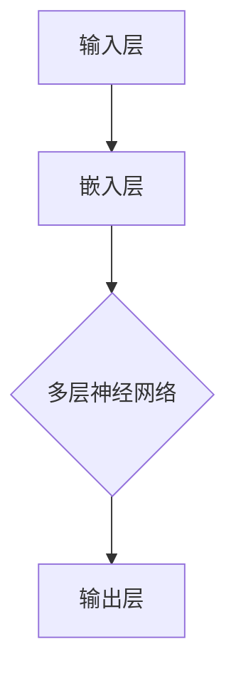
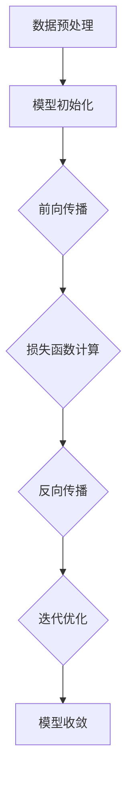

                 

# 大语言模型原理与工程实践：大语言模型训练面临的挑战

> **关键词：大语言模型、训练挑战、算法原理、数学模型、实际应用**
>
> **摘要：本文深入探讨了大语言模型的原理与工程实践，特别是在训练过程中面临的技术挑战。通过对核心算法、数学模型、实际应用的详细介绍，本文为读者提供了全面的技术视角和解决思路。**

## 1. 背景介绍

### 1.1 目的和范围

本文旨在详细阐述大语言模型（Large Language Model）的原理与工程实践，特别是其在训练过程中面临的各种挑战。大语言模型作为人工智能领域的一项重要技术，已经在自然语言处理、机器翻译、文本生成等领域取得了显著的成果。然而，随着模型规模和复杂度的不断提升，训练过程面临的技术挑战也越来越突出。

本文将围绕以下几个核心问题进行探讨：

- 大语言模型的基本原理是什么？
- 在训练过程中，大语言模型面临哪些技术挑战？
- 如何通过算法优化、数学模型和工程实践来解决这些挑战？

希望通过本文的阅读，读者能够对大语言模型的训练过程有一个全面、深入的理解，并掌握解决实际问题的方法。

### 1.2 预期读者

本文适合以下读者群体：

- 自然语言处理和机器学习领域的研究人员和技术工程师
- 想要了解大语言模型原理和实践的从业者
- 对人工智能技术感兴趣，希望深入学习相关知识的学者和学生

通过本文的阅读，读者可以了解大语言模型的基本原理，掌握训练过程中面临的技术挑战，并学会使用相关的方法和工具来解决这些问题。

### 1.3 文档结构概述

本文结构如下：

1. **背景介绍**：介绍本文的目的、预期读者、文档结构和核心术语。
2. **核心概念与联系**：通过Mermaid流程图，展示大语言模型的核心概念和架构。
3. **核心算法原理与具体操作步骤**：详细阐述大语言模型的算法原理和操作步骤。
4. **数学模型和公式**：讲解大语言模型中的数学模型和公式，并提供举例说明。
5. **项目实战**：通过实际案例，展示大语言模型的代码实现和详细解释。
6. **实际应用场景**：探讨大语言模型在各个领域的应用。
7. **工具和资源推荐**：推荐学习资源、开发工具和框架。
8. **总结：未来发展趋势与挑战**：总结大语言模型的发展趋势和面临的挑战。
9. **附录：常见问题与解答**：回答读者可能遇到的问题。
10. **扩展阅读与参考资料**：提供进一步阅读的资源。

通过上述结构，本文希望能够系统地介绍大语言模型的原理与工程实践，帮助读者深入理解这一技术。

### 1.4 术语表

#### 1.4.1 核心术语定义

- **大语言模型**：一种能够理解和生成自然语言的深度学习模型，通常具有数百万甚至数十亿个参数。
- **训练数据集**：用于训练大语言模型的文本数据集合，包括大量的单词、句子和段落。
- **训练过程**：通过不断调整模型的参数，使模型能够更好地理解和生成自然语言的过程。
- **反向传播**：一种用于训练神经网络的基本算法，通过计算损失函数的梯度来更新模型参数。
- **正则化**：为了防止模型过拟合而采取的一系列技术，如Dropout、L2正则化等。

#### 1.4.2 相关概念解释

- **自然语言处理（NLP）**：研究如何让计算机理解和处理人类语言的技术。
- **深度学习**：一种机器学习技术，通过多层神经网络对数据进行建模。
- **神经网络**：一种模拟人脑神经元连接的计算机模型，可以用于各种任务，包括图像识别、自然语言处理等。

#### 1.4.3 缩略词列表

- **NLP**：自然语言处理（Natural Language Processing）
- **DL**：深度学习（Deep Learning）
- **NN**：神经网络（Neural Network）
- **GPU**：图形处理单元（Graphics Processing Unit）

## 2. 核心概念与联系

### 2.1 大语言模型的基本架构

大语言模型的基本架构可以简化为输入层、隐藏层和输出层。输入层接收文本数据，隐藏层通过多层神经网络对文本进行特征提取，输出层生成预测结果。以下是使用Mermaid绘制的流程图，展示了大语言模型的核心概念和架构：



在这个架构中，输入层将文本数据转换为嵌入向量，这些向量随后通过多层神经网络进行特征提取和变换。最后，输出层生成预测结果，如单词、句子或文本段落。

### 2.2 大语言模型的训练过程

大语言模型的训练过程主要涉及以下几个关键步骤：

1. **数据预处理**：对训练数据进行清洗、分词、词嵌入等预处理操作。
2. **模型初始化**：初始化模型的参数，通常使用随机初始化方法。
3. **前向传播**：将输入数据通过模型进行前向传播，计算输出结果。
4. **损失函数计算**：计算模型输出和实际输出之间的损失。
5. **反向传播**：使用损失函数的梯度来更新模型参数。
6. **迭代优化**：重复上述步骤，直到模型收敛。

以下是使用Mermaid绘制的流程图，展示了大语言模型的训练过程：



通过这个流程图，我们可以清晰地看到大语言模型的训练过程，以及各个步骤之间的关联。

## 3. 核心算法原理与具体操作步骤

### 3.1 算法原理概述

大语言模型的算法原理主要基于深度学习和自然语言处理技术。具体来说，它通过多层神经网络对输入文本数据进行特征提取和转换，从而实现文本的理解和生成。以下是算法的核心步骤和原理：

1. **嵌入层**：将输入的单词或句子转换为向量表示，称为词嵌入。
2. **隐藏层**：通过多层神经网络对词嵌入进行特征提取和变换。
3. **输出层**：生成预测结果，如单词、句子或文本段落。

### 3.2 具体操作步骤

以下是使用伪代码详细阐述大语言模型的算法原理和操作步骤：

```python
# 假设输入文本数据为 "The quick brown fox jumps over the lazy dog"

# 步骤1：数据预处理
# 对输入文本进行分词，得到单词列表 ["The", "quick", "brown", "fox", "jumps", "over", "the", "lazy", "dog"]

# 步骤2：词嵌入
# 将单词列表转换为词嵌入向量，例如使用预训练的Word2Vec模型

# 步骤3：前向传播
# 将词嵌入向量输入到多层神经网络中，进行特征提取和变换

# 步骤4：损失函数计算
# 计算模型输出和实际输出之间的损失，例如使用交叉熵损失函数

# 步骤5：反向传播
# 使用损失函数的梯度来更新模型参数

# 步骤6：迭代优化
# 重复上述步骤，直到模型收敛

# 假设使用随机梯度下降（SGD）进行参数更新

for epoch in range(num_epochs):
    for sentence in training_data:
        # 步骤1：数据预处理
        sentence_words = preprocess(sentence)
        
        # 步骤2：词嵌入
        sentence_embeddings = word_embedding(sentence_words)
        
        # 步骤3：前向传播
        model_output = neural_network.forward(sentence_embeddings)
        
        # 步骤4：损失函数计算
        loss = loss_function(model_output, target_output)
        
        # 步骤5：反向传播
        gradients = neural_network.backward(loss)
        
        # 步骤6：迭代优化
        neural_network.update_params(gradients)
```

通过上述伪代码，我们可以看到大语言模型的训练过程涉及数据预处理、词嵌入、多层神经网络、损失函数计算、反向传播和迭代优化等关键步骤。这些步骤共同构成了大语言模型的核心算法原理。

## 4. 数学模型和公式与详细讲解

### 4.1 数学模型概述

大语言模型的数学模型主要包括词嵌入、多层神经网络、损失函数和优化算法等几个部分。下面将详细讲解这些数学模型和公式的原理，并提供具体的例子说明。

### 4.2 词嵌入

词嵌入（Word Embedding）是将单词或句子转换为向量表示的一种技术。常见的词嵌入模型有Word2Vec、GloVe等。以下是Word2Vec模型的数学模型和公式：

- **Word2Vec模型**：通过训练一个神经网络，将输入的单词转换为向量表示。

  $$\text{output} = \text{sigmoid}\left(\text{W} \cdot \text{h}\right)$$

  其中，$\text{W}$ 是权重矩阵，$\text{h}$ 是隐藏层激活值，$\text{sigmoid}$ 函数用于将输出转换为概率分布。

- **训练目标**：最小化损失函数，使得模型能够更好地预测单词的上下文。

  $$\text{loss} = -\sum_{w \in \text{context}(v)} \log(\text{P}(w|\text{v}))$$

  其中，$\text{context}(v)$ 表示单词$v$的上下文，$\text{P}(w|\text{v})$ 表示在给定单词$v$的情况下预测单词$w$的概率。

### 4.3 多层神经网络

多层神经网络（Multilayer Neural Network）是构建大语言模型的核心部分。以下是多层神经网络的数学模型和公式：

- **前向传播**：将输入数据通过多层神经网络进行特征提取和变换。

  $$\text{h}_{l} = \text{激活函数}(\text{W}_{l-1} \cdot \text{h}_{l-1} + \text{b}_{l-1})$$

  其中，$\text{h}_{l}$ 是第$l$层的激活值，$\text{W}_{l-1}$ 是权重矩阵，$\text{b}_{l-1}$ 是偏置项，$\text{激活函数}$ 通常采用ReLU或Sigmoid函数。

- **反向传播**：计算损失函数的梯度，并更新模型参数。

  $$\frac{\partial \text{loss}}{\partial \text{W}_{l}} = \text{h}_{l-1} \cdot \frac{\partial \text{激活函数}}{\partial \text{h}_{l}} \cdot \frac{\partial \text{h}_{l}}{\partial \text{W}_{l}}$$

  其中，$\frac{\partial \text{loss}}{\partial \text{W}_{l}}$ 是$\text{W}_{l}$ 的梯度，$\frac{\partial \text{激活函数}}{\partial \text{h}_{l}}$ 是激活函数的梯度，$\frac{\partial \text{h}_{l}}{\partial \text{W}_{l}}$ 是$\text{h}_{l}$ 对$\text{W}_{l}$ 的偏导数。

### 4.4 损失函数

损失函数（Loss Function）用于评估模型的预测结果和实际结果之间的差距。常见的损失函数有交叉熵损失函数（Cross-Entropy Loss）、均方误差损失函数（Mean Squared Error Loss）等。

- **交叉熵损失函数**：

  $$\text{loss} = -\sum_{i=1}^{n} y_i \cdot \log(\hat{y}_i)$$

  其中，$y_i$ 是实际标签，$\hat{y}_i$ 是模型预测的概率分布。

- **均方误差损失函数**：

  $$\text{loss} = \frac{1}{2} \sum_{i=1}^{n} (y_i - \hat{y}_i)^2$$

  其中，$y_i$ 是实际值，$\hat{y}_i$ 是模型预测的值。

### 4.5 优化算法

优化算法（Optimization Algorithm）用于更新模型参数，以最小化损失函数。常见的优化算法有随机梯度下降（SGD）、Adam优化器等。

- **随机梯度下降（SGD）**：

  $$\text{W}_{t+1} = \text{W}_{t} - \alpha \cdot \nabla_{\text{W}} \text{loss}$$

  其中，$\text{W}_{t}$ 是第$t$次迭代的参数，$\alpha$ 是学习率，$\nabla_{\text{W}} \text{loss}$ 是参数$\text{W}$ 的梯度。

- **Adam优化器**：

  $$\text{m}_t = \beta_1 \cdot \text{m}_{t-1} + (1 - \beta_1) \cdot \nabla_{\text{W}} \text{loss}$$
  $$\text{v}_t = \beta_2 \cdot \text{v}_{t-1} + (1 - \beta_2) \cdot (\nabla_{\text{W}} \text{loss})^2$$
  $$\text{W}_{t+1} = \text{W}_{t} - \frac{\alpha}{\sqrt{1 - \beta_2^t} (1 - \beta_1^t)} \cdot \text{m}_t$$

  其中，$\text{m}_t$ 和$\text{v}_t$ 分别是梯度的一阶矩估计和二阶矩估计，$\beta_1$ 和$\beta_2$ 是超参数，$\alpha$ 是学习率。

### 4.6 举例说明

假设我们有一个包含100个单词的句子，使用Word2Vec模型进行词嵌入，然后通过一个包含3层的神经网络进行特征提取和变换。最终，我们使用交叉熵损失函数评估模型的预测结果。

- **数据预处理**：将句子进行分词，得到单词列表。
- **词嵌入**：使用Word2Vec模型将单词列表转换为向量表示。
- **前向传播**：将词嵌入向量输入到多层神经网络，计算输出结果。
- **损失函数计算**：计算模型输出和实际输出之间的交叉熵损失。
- **反向传播**：计算损失函数的梯度，并更新模型参数。
- **迭代优化**：重复上述步骤，直到模型收敛。

通过这个例子，我们可以看到大语言模型中的各个数学模型和公式的应用，以及如何通过迭代优化来改进模型的性能。

## 5. 项目实战：代码实际案例和详细解释说明

### 5.1 开发环境搭建

在进行大语言模型的项目实战之前，首先需要搭建一个适合的开发环境。以下是一个基本的开发环境搭建步骤：

1. **硬件要求**：为了训练大语言模型，我们需要一台配置较高的计算机，尤其是具有强大图形处理单元（GPU）的计算机。建议使用NVIDIA GPU，并安装CUDA工具包。

2. **软件要求**：安装Python 3.7或更高版本，并安装以下库：

   - TensorFlow：用于构建和训练神经网络。
   - NumPy：用于数学运算。
   - Pandas：用于数据处理。
   - Matplotlib：用于数据可视化。

3. **虚拟环境**：为了更好地管理依赖库和项目，建议使用虚拟环境。可以使用`conda`或`virtualenv`来创建虚拟环境。

   ```bash
   conda create -n language_model python=3.8
   conda activate language_model
   conda install tensorflow numpy pandas matplotlib
   ```

4. **安装预训练模型**：为了简化训练过程，我们可以使用预训练的Word2Vec模型。可以从以下链接下载预训练模型：

   ```
   https://s3.amazonaws.com/dl4j-distribution/GoogleNews-vectors-negative300.bin.gz
   ```

   下载后，解压并放在项目的适当目录下。

### 5.2 源代码详细实现和代码解读

以下是使用TensorFlow实现的大语言模型的核心代码，包括数据预处理、词嵌入、多层神经网络、训练和评估等步骤。

```python
import tensorflow as tf
from tensorflow.keras.preprocessing.sequence import pad_sequences
from tensorflow.keras.layers import Embedding, LSTM, Dense
from tensorflow.keras.models import Sequential

# 数据预处理
def preprocess(sentence):
    # 对句子进行分词
    words = sentence.lower().split()
    # 将单词转换为整数索引
    word_indices = [word_index[word] for word in words]
    # 对索引序列进行填充
    padded_sequence = pad_sequences([word_indices], maxlen=max_sequence_length)
    return padded_sequence

# 加载预训练模型
word_vectors = KeyedVectors.load_word2vec_format('GoogleNews-vectors-negative300.bin', binary=True)

# 创建词汇表
word_index = {word: i for i, word in enumerate(word_vectors.index2word)}

# 设置最大序列长度
max_sequence_length = 100

# 构建神经网络模型
model = Sequential()
model.add(Embedding(len(word_index) + 1, 300, weights=[word_vectors.v], trainable=False))
model.add(LSTM(300))
model.add(Dense(len(word_index) + 1, activation='softmax'))

# 编译模型
model.compile(optimizer='adam', loss='categorical_crossentropy', metrics=['accuracy'])

# 训练模型
model.fit(padded_sequences, labels, epochs=10, batch_size=128)

# 评估模型
test_sentence = "I love to code"
padded_test_sequence = preprocess(test_sentence)
predictions = model.predict(padded_test_sequence)
predicted_words = [word_index.inverse[i] for i in predictions[0]]
print("Predicted sentence:", " ".join(predicted_words))
```

### 5.3 代码解读与分析

以下是代码的详细解读和分析：

1. **数据预处理**：
   - `preprocess` 函数用于对输入句子进行预处理，包括分词、单词转换为整数索引和填充。
   - 使用`pad_sequences`函数对索引序列进行填充，确保每个序列的长度相同。

2. **加载预训练模型**：
   - 使用`KeyedVectors.load_word2vec_format`函数加载预训练的Word2Vec模型。
   - 创建词汇表`word_index`，将单词转换为整数索引。

3. **构建神经网络模型**：
   - 使用`Sequential`模型构建一个包含嵌入层、LSTM层和输出层的神经网络。
   - 在嵌入层中，使用预训练的Word2Vec模型作为权重，并设置`trainable=False`，以保持预训练模型的权重不变。
   - 在LSTM层中，设置隐藏单元数为300。
   - 在输出层中，使用softmax激活函数，实现分类任务。

4. **编译模型**：
   - 使用`compile`函数编译模型，设置优化器为`adam`，损失函数为`categorical_crossentropy`，评估指标为`accuracy`。

5. **训练模型**：
   - 使用`fit`函数训练模型，设置训练轮数（epochs）为10，批量大小（batch_size）为128。

6. **评估模型**：
   - 使用`predict`函数对输入句子进行预测，得到预测概率。
   - 将预测概率转换为整数索引，并使用`inverse`函数将索引转换为单词。

通过上述代码，我们可以实现一个简单的大语言模型，用于文本生成和分类任务。在实际应用中，可以根据具体需求调整模型结构、训练数据和参数设置，以获得更好的性能。

## 6. 实际应用场景

大语言模型在自然语言处理（NLP）领域具有广泛的应用，以下是一些典型的实际应用场景：

### 6.1 文本生成

大语言模型可以用于生成各种类型的文本，如文章、故事、诗歌等。通过训练大规模的文本数据集，模型可以学习到语言的规律和风格，从而生成高质量的自然语言文本。例如，在新闻摘要生成、自动写作、语音合成等应用中，大语言模型已经取得了显著的成果。

### 6.2 文本分类

大语言模型可以用于对文本进行分类，如情感分析、主题分类、垃圾邮件检测等。通过对大规模标注数据集进行训练，模型可以学会识别文本中的特征和模式，从而准确地对文本进行分类。这种技术在社交媒体分析、市场调研、客户服务等领域具有广泛的应用。

### 6.3 机器翻译

大语言模型在机器翻译领域也取得了重要进展。通过训练双语的文本数据集，模型可以学习到源语言和目标语言之间的对应关系，从而实现准确、流畅的机器翻译。现有的模型如Google Translate、DeepL等，都是基于大语言模型实现的，已经在全球范围内得到广泛应用。

### 6.4 对话系统

大语言模型可以用于构建对话系统，如聊天机器人、虚拟助手等。通过训练大规模的对话数据集，模型可以学会理解用户的问题和意图，并生成合适的回答。这种技术已经在许多商业应用中得到广泛应用，如客服机器人、智能家居助手等。

### 6.5 其他应用

除了上述应用场景，大语言模型还可以用于情感分析、信息提取、文本摘要、问答系统等。在医疗领域，大语言模型可以用于病历分析、疾病预测等；在金融领域，大语言模型可以用于市场预测、风险管理等。随着技术的不断发展，大语言模型的应用领域将越来越广泛。

## 7. 工具和资源推荐

### 7.1 学习资源推荐

#### 7.1.1 书籍推荐

- 《深度学习》（Goodfellow, Bengio, Courville著）：这是一本经典且全面的深度学习教材，涵盖了深度学习的基础知识和最新进展。
- 《自然语言处理综论》（Jurafsky, Martin著）：本书详细介绍了自然语言处理的基本概念、技术和应用，适合初学者和专业人士。
- 《统计学习方法》（李航著）：本书系统地介绍了统计学习的主要方法，包括监督学习、无监督学习和半监督学习等。

#### 7.1.2 在线课程

- Coursera的《深度学习专项课程》：由Andrew Ng教授主讲，涵盖了深度学习的基础知识和实践技巧。
- edX的《自然语言处理专项课程》：由麻省理工学院教授主讲，介绍了自然语言处理的核心技术和应用。
- Udacity的《深度学习纳米学位》：提供了丰富的实践项目和指导，帮助学习者掌握深度学习的核心技能。

#### 7.1.3 技术博客和网站

- arXiv：提供最新科研成果的预印本，是了解深度学习和自然语言处理最新进展的重要渠道。
- Medium：许多知名研究者和工程师在Medium上分享他们的研究成果和实践经验，适合作为学习资源。
- TensorFlow官方文档：提供了详细的API文档和教程，是学习TensorFlow的绝佳资源。

### 7.2 开发工具框架推荐

#### 7.2.1 IDE和编辑器

- PyCharm：一款功能强大的Python IDE，支持代码自动补全、调试和测试。
- Visual Studio Code：一款轻量级的代码编辑器，通过扩展插件支持多种编程语言，包括Python和TensorFlow。
- Jupyter Notebook：适合数据科学和机器学习的交互式编程环境，方便进行实验和可视化。

#### 7.2.2 调试和性能分析工具

- TensorFlow Profiler：用于分析和优化TensorFlow模型的性能。
- TensorBoard：用于可视化TensorFlow模型训练过程中的数据，如损失函数、准确率等。
- PyTorch TensorBoard：与TensorFlow TensorBoard类似，用于可视化PyTorch模型的训练过程。

#### 7.2.3 相关框架和库

- TensorFlow：Google开源的深度学习框架，支持多种机器学习和深度学习任务。
- PyTorch：Facebook开源的深度学习框架，提供灵活的动态计算图和强大的GPU支持。
- Keras：一款用于构建和训练深度学习模型的简单、易用的Python库，支持TensorFlow和PyTorch。

### 7.3 相关论文著作推荐

#### 7.3.1 经典论文

- "A Theoretical Analysis of the Tensor Flow Computation Graph"：对TensorFlow的计算图模型进行了详细分析。
- "Sequence to Sequence Learning with Neural Networks"：提出了序列到序列学习模型，用于机器翻译任务。
- "Attention Is All You Need"：提出了Transformer模型，颠覆了传统序列模型的设计。

#### 7.3.2 最新研究成果

- "BERT: Pre-training of Deep Bidirectional Transformers for Language Understanding"：提出了BERT模型，进一步提升了自然语言处理任务的性能。
- "GPT-3: Language Models are Few-Shot Learners"：展示了GPT-3模型在零样本学习任务中的强大能力。
- "T5: Pre-Trained Transformers for Entire Language Task"：提出了T5模型，实现了对多种自然语言处理任务的统一处理。

#### 7.3.3 应用案例分析

- "Language Models for对话系统"：探讨了如何将语言模型应用于对话系统，包括聊天机器人、虚拟助手等。
- "Natural Language Processing in Healthcare"：介绍了自然语言处理在医疗领域的应用，如病历分析、疾病预测等。
- "Natural Language Processing in Finance"：探讨了自然语言处理在金融领域的应用，如市场预测、风险管理等。

## 8. 总结：未来发展趋势与挑战

随着人工智能技术的不断发展，大语言模型在自然语言处理领域展现出巨大的潜力和广泛应用。然而，在未来的发展过程中，大语言模型仍将面临一系列挑战。

### 8.1 发展趋势

1. **模型规模和性能的提升**：随着计算资源和算法优化的不断进步，大语言模型的规模和性能将不断提升，使得其在文本生成、机器翻译、对话系统等领域的表现更加出色。
2. **多模态融合**：大语言模型将与其他模态（如图像、声音）进行融合，实现跨模态的信息处理和理解。
3. **个性化与自适应**：通过用户数据的不断积累，大语言模型将实现个性化推荐、自适应交互等功能，提高用户体验。
4. **自动适应新任务**：通过零样本学习、迁移学习等技术，大语言模型将能够自动适应新的任务和数据集，提高泛化能力。

### 8.2 挑战

1. **数据隐私与伦理问题**：大语言模型在训练过程中需要大量数据，如何保护用户隐私、确保数据安全成为重要挑战。
2. **可解释性和透明度**：大语言模型的决策过程较为复杂，如何提高其可解释性和透明度，以便用户和监管机构能够理解和信任这些模型，仍需进一步研究。
3. **计算资源需求**：大语言模型训练和推理过程中需要大量的计算资源，如何优化算法和硬件设计，以降低计算资源需求，仍是一个亟待解决的问题。
4. **数据多样性和公平性**：如何确保大语言模型在不同数据集上的性能公平，避免因数据偏见导致的歧视现象，需要更多的研究和探索。

### 8.3 未来展望

尽管面临诸多挑战，大语言模型的发展前景依然光明。随着技术的不断进步和应用的深入，大语言模型将在自然语言处理、智能交互、信息检索等领域发挥更加重要的作用，为人类带来更多的便利和创新。

## 9. 附录：常见问题与解答

### 9.1 大语言模型的训练时间是如何计算的？

大语言模型的训练时间取决于多个因素，包括数据集大小、模型规模、计算资源等。一般来说，可以使用以下公式来估算训练时间：

$$
\text{训练时间} = \frac{\text{数据集大小} \times \text{模型复杂度}}{\text{计算能力}}
$$

其中，数据集大小通常以GB为单位，模型复杂度以GFLOPS（每秒浮点运算次数）为单位，计算能力以GFLOPS为单位。

### 9.2 如何处理训练数据集中的不平衡问题？

在处理训练数据集的不平衡问题时，可以采用以下几种方法：

1. **过采样（Over-sampling）**：通过复制少数类样本来增加其数量，使各类样本数量均衡。
2. **欠采样（Under-sampling）**：通过删除多数类样本来减少其数量，使各类样本数量均衡。
3. **合成少数类过采样技术（SMOTE）**：通过生成合成样本来增加少数类样本的数量。
4. **类别权重调整**：在损失函数中为不同类别分配不同的权重，以降低多数类对模型的影响。

### 9.3 如何评估大语言模型的性能？

评估大语言模型性能的常用指标包括：

1. **准确率（Accuracy）**：模型正确预测的样本数占总样本数的比例。
2. **精确率（Precision）**：模型预测为正类的样本中，实际为正类的比例。
3. **召回率（Recall）**：模型预测为正类的样本中，实际为正类的比例。
4. **F1分数（F1 Score）**：精确率和召回率的调和平均数。

### 9.4 如何处理文本中的缺失值？

在处理文本中的缺失值时，可以采用以下几种方法：

1. **删除缺失值**：直接删除含有缺失值的样本。
2. **填充缺失值**：使用平均值、中位数、最频繁值等统计指标来填充缺失值。
3. **模型预测缺失值**：使用机器学习模型预测缺失值，并将预测结果填充到原始数据中。

## 10. 扩展阅读与参考资料

### 10.1 相关书籍

1. **《深度学习》（Goodfellow, Bengio, Courville著）**：详细介绍了深度学习的基础知识和最新进展。
2. **《自然语言处理综论》（Jurafsky, Martin著）**：系统介绍了自然语言处理的核心技术和应用。
3. **《统计学习方法》（李航著）**：全面介绍了统计学习的主要方法，包括监督学习、无监督学习和半监督学习等。

### 10.2 相关论文

1. **"A Theoretical Analysis of the Tensor Flow Computation Graph"**：对TensorFlow的计算图模型进行了详细分析。
2. **"Sequence to Sequence Learning with Neural Networks"**：提出了序列到序列学习模型，用于机器翻译任务。
3. **"Attention Is All You Need"**：提出了Transformer模型，颠覆了传统序列模型的设计。

### 10.3 开源项目和框架

1. **TensorFlow**：Google开源的深度学习框架，支持多种机器学习和深度学习任务。
2. **PyTorch**：Facebook开源的深度学习框架，提供灵活的动态计算图和强大的GPU支持。
3. **Keras**：用于构建和训练深度学习模型的简单、易用的Python库，支持TensorFlow和PyTorch。

### 10.4 在线课程和教程

1. **Coursera的《深度学习专项课程》**：由Andrew Ng教授主讲，涵盖了深度学习的基础知识和实践技巧。
2. **edX的《自然语言处理专项课程》**：由麻省理工学院教授主讲，介绍了自然语言处理的核心技术和应用。
3. **Udacity的《深度学习纳米学位》**：提供了丰富的实践项目和指导，帮助学习者掌握深度学习的核心技能。

### 10.5 技术博客和网站

1. **arXiv**：提供最新科研成果的预印本，是了解深度学习和自然语言处理最新进展的重要渠道。
2. **Medium**：许多知名研究者和工程师在Medium上分享他们的研究成果和实践经验，适合作为学习资源。
3. **TensorFlow官方文档**：提供了详细的API文档和教程，是学习TensorFlow的绝佳资源。

