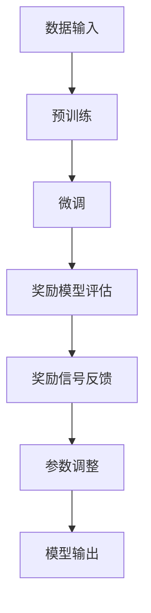

                 

# 大语言模型原理与工程实践：奖励模型的训练

> 关键词：大语言模型、奖励模型、训练过程、算法原理、工程实践

> 摘要：本文将深入探讨大语言模型中的奖励模型训练原理及其在工程实践中的应用。首先，我们将介绍大语言模型的基础概念，并逐步解释奖励模型的引入及其作用。随后，本文将详细阐述奖励模型的核心算法原理，并通过伪代码展示具体操作步骤。接下来，我们将运用数学模型和公式，深入讲解奖励模型中的关键参数及其计算方法，并通过实际案例进行举例说明。在项目实战部分，我们将搭建开发环境，详细解释源代码实现和代码解读，进一步分析奖励模型在真实应用场景中的效果。最后，我们将推荐相关的学习资源、开发工具和最新研究成果，总结未来发展趋势与挑战，并附上常见问题与解答，为读者提供全面的指导和扩展阅读。

## 1. 背景介绍

### 1.1 目的和范围

本文旨在深入探讨大语言模型中的奖励模型训练原理及其在工程实践中的应用。随着人工智能技术的飞速发展，大语言模型已经成为自然语言处理领域的重要工具。然而，大语言模型在处理复杂语言任务时，仍面临许多挑战。其中，奖励模型的引入为解决这些问题提供了新的思路。本文将详细介绍奖励模型的核心算法原理、训练过程及其在实际应用中的效果。

### 1.2 预期读者

本文适合以下读者：

1. 对大语言模型和自然语言处理感兴趣的研究人员。
2. 想要了解奖励模型原理及其在工程实践中的开发者。
3. 对算法原理和工程实践感兴趣的计算机科学和人工智能专业的学生。

### 1.3 文档结构概述

本文分为十个主要部分，具体结构如下：

1. 背景介绍
   - 目的和范围
   - 预期读者
   - 文档结构概述
2. 核心概念与联系
   - 大语言模型基础
   - 奖励模型介绍
3. 核心算法原理 & 具体操作步骤
   - 奖励模型算法原理
   - 伪代码展示
4. 数学模型和公式 & 详细讲解 & 举例说明
   - 数学模型介绍
   - 参数计算方法
5. 项目实战：代码实际案例和详细解释说明
   - 开发环境搭建
   - 源代码详细实现和代码解读
   - 代码解读与分析
6. 实际应用场景
   - 应用场景介绍
   - 实际效果分析
7. 工具和资源推荐
   - 学习资源推荐
   - 开发工具框架推荐
   - 相关论文著作推荐
8. 总结：未来发展趋势与挑战
9. 附录：常见问题与解答
10. 扩展阅读 & 参考资料

### 1.4 术语表

#### 1.4.1 核心术语定义

1. 大语言模型：一种能够处理和生成自然语言文本的深度学习模型。
2. 奖励模型：一种评估和指导大语言模型生成文本的机制。
3. 训练过程：指通过大量数据对模型进行训练，使其能够对未知数据进行预测或生成。
4. 损失函数：评估模型预测结果与真实值之间差异的函数。

#### 1.4.2 相关概念解释

1. 自然语言处理（NLP）：涉及计算机与人类语言之间的交互，包括语音识别、文本分类、机器翻译等。
2. 深度学习：一种人工智能技术，通过多层神经网络模型，对大量数据进行训练，实现特征提取和预测。

#### 1.4.3 缩略词列表

1. NLP：自然语言处理
2. DNN：深度神经网络
3. RNN：循环神经网络
4. LSTM：长短时记忆网络
5. GPT：生成预训练网络
6. BERT：双向编码表示模型

## 2. 核心概念与联系

在大语言模型中，奖励模型作为一种关键组件，起着指导和优化模型生成文本的作用。为了更好地理解奖励模型，我们需要先了解大语言模型的基础概念。

### 2.1 大语言模型基础

大语言模型（Large Language Model）是一种基于深度学习的自然语言处理模型，能够对自然语言文本进行理解和生成。其核心思想是通过大量文本数据，学习语言的统计规律和语义信息，从而实现对未知文本的生成和预测。

大语言模型通常基于以下几种深度学习模型：

1. **深度神经网络（DNN）**：一种多层神经网络，通过对输入数据进行多次非线性变换，提取特征并进行分类或回归。
2. **循环神经网络（RNN）**：一种能够处理序列数据的神经网络，通过在时间步间传递信息，实现对长期依赖关系的建模。
3. **长短时记忆网络（LSTM）**：一种特殊的RNN，通过引入门控机制，能够有效地解决长期依赖问题。
4. **生成预训练网络（GPT）**：一种基于Transformer架构的大规模预训练模型，通过自回归方式生成文本。
5. **双向编码表示模型（BERT）**：一种基于Transformer架构的双向编码模型，通过预训练和微调，实现多种自然语言处理任务。

### 2.2 奖励模型介绍

奖励模型（Reward Model）是一种评估和指导大语言模型生成文本的机制。其核心思想是通过引入外部评估指标，对模型生成的文本进行评价，并给出奖励或惩罚，从而优化模型生成效果。

奖励模型的作用主要体现在以下几个方面：

1. **文本质量评估**：通过外部评估指标（如人类评分、自动评估指标等），对模型生成的文本进行质量评估。
2. **生成方向指导**：根据奖励模型提供的奖励信号，指导模型生成更加符合预期的文本。
3. **多任务学习**：通过奖励模型，实现多任务学习，使模型能够同时处理多个任务，提高任务表现。
4. **自适应优化**：根据奖励信号，调整模型参数，实现自适应优化。

### 2.3 核心概念联系

大语言模型与奖励模型之间的联系主要体现在以下几个方面：

1. **数据输入**：大语言模型接受外部文本数据作为输入，通过训练学习语言的统计规律和语义信息。奖励模型则通过评估这些生成的文本，提供奖励信号。
2. **训练过程**：大语言模型的训练过程主要包括预训练和微调两个阶段。预训练阶段，模型在大规模文本数据上学习语言规律。微调阶段，模型根据特定任务进行优化。奖励模型在微调阶段起到关键作用，通过提供奖励信号，指导模型生成更加符合任务的文本。
3. **模型输出**：大语言模型生成文本后，通过奖励模型进行评估。奖励模型提供的奖励信号将反馈给模型，用于调整参数，优化生成效果。

### 2.4 Mermaid 流程图

为了更好地展示大语言模型与奖励模型之间的关系，我们使用Mermaid流程图进行描述：



在上述流程图中，A表示数据输入，B表示预训练阶段，C表示微调阶段，D表示奖励模型评估，E表示奖励信号反馈，F表示参数调整，G表示模型输出。通过这个流程图，我们可以清晰地看到大语言模型与奖励模型之间的相互作用和联系。

## 3. 核心算法原理 & 具体操作步骤

在深入探讨奖励模型的算法原理之前，我们需要先了解大语言模型的基本原理。大语言模型通常采用深度学习技术，特别是基于Transformer架构的模型，如GPT和BERT。这些模型通过预训练和微调两个阶段，学习大量文本数据，从而实现对未知文本的生成和预测。

### 3.1 大语言模型基本原理

大语言模型的基本原理可以概括为以下步骤：

1. **数据预处理**：对原始文本数据进行预处理，包括分词、去停用词、词向量化等操作，将文本转换为数值表示。
2. **模型架构设计**：设计大语言模型的架构，包括输入层、隐藏层和输出层。通常采用多层神经网络，如Transformer、LSTM等。
3. **预训练**：使用大规模文本数据，对模型进行预训练。预训练的目标是让模型学习语言的统计规律和语义信息。
4. **微调**：在预训练的基础上，针对特定任务，对模型进行微调。微调的目标是优化模型在特定任务上的表现。

### 3.2 奖励模型算法原理

奖励模型是指导大语言模型生成高质量文本的关键组件。其基本原理可以概括为以下步骤：

1. **评估指标设计**：设计评估指标，用于评估模型生成文本的质量。常见的评估指标包括人类评分、自动评估指标（如BLEU、ROUGE等）等。
2. **奖励信号计算**：根据评估指标，计算奖励信号。奖励信号可以是正值、负值或零，表示模型生成文本的质量。
3. **奖励信号反馈**：将奖励信号反馈给大语言模型，用于调整模型参数。奖励信号越高，表示模型生成文本的质量越好。
4. **参数调整**：根据奖励信号，调整模型参数，实现模型生成文本质量的优化。

### 3.3 伪代码展示

为了更好地理解奖励模型的算法原理，我们使用伪代码进行描述：

```python
# 奖励模型伪代码

# 输入：预训练模型，评估指标，生成文本
# 输出：调整后的模型参数

def reward_model(pretrained_model, evaluation_metric, generated_text):
    # 步骤1：评估文本质量
    text_quality = evaluation_metric(generated_text)

    # 步骤2：计算奖励信号
    reward_signal = compute_reward_signal(text_quality)

    # 步骤3：反馈奖励信号
    updated_model = pretrained_model.update_params(reward_signal)

    # 步骤4：返回调整后的模型参数
    return updated_model
```

在上述伪代码中，`pretrained_model` 表示预训练模型，`evaluation_metric` 表示评估指标，`generated_text` 表示模型生成的文本。函数 `reward_model` 的目的是根据评估指标计算奖励信号，并将奖励信号反馈给模型，实现模型参数的调整。

### 3.4 步骤详细解释

1. **评估文本质量**：评估指标是评估模型生成文本质量的关键。常见的评估指标包括人类评分和自动评估指标。人类评分是通过人工对文本进行评分，而自动评估指标是通过算法对文本进行评估。在本文中，我们使用自动评估指标（如BLEU、ROUGE等）作为评估指标。

2. **计算奖励信号**：奖励信号的计算方式取决于评估指标。对于人类评分，奖励信号可以直接使用评分值；对于自动评估指标，奖励信号可以通过计算评估指标与期望值的差值得到。一般来说，奖励信号越高，表示模型生成文本的质量越好。

3. **反馈奖励信号**：奖励信号需要反馈给模型，用于调整模型参数。这可以通过训练过程中引入奖励信号，使模型在训练过程中能够根据奖励信号优化生成文本的质量。

4. **参数调整**：根据奖励信号，调整模型参数，实现模型生成文本质量的优化。这一步骤通常在模型的训练过程中进行，使模型能够根据奖励信号不断优化生成文本的质量。

通过上述步骤，奖励模型能够指导大语言模型生成高质量文本，提高模型在实际应用中的效果。

## 4. 数学模型和公式 & 详细讲解 & 举例说明

在奖励模型中，数学模型和公式起着至关重要的作用。这些模型和公式不仅用于计算奖励信号，还用于优化模型参数，从而提高文本生成质量。在本节中，我们将详细讲解奖励模型中的关键数学模型和公式，并通过实际案例进行举例说明。

### 4.1 损失函数

损失函数是奖励模型中最重要的数学模型之一。它用于评估模型生成文本的质量，并通过计算奖励信号，指导模型参数的调整。在奖励模型中，常用的损失函数包括交叉熵损失函数和对比损失函数。

#### 4.1.1 交叉熵损失函数

交叉熵损失函数是一种用于评估两个概率分布之间差异的损失函数。在奖励模型中，交叉熵损失函数用于计算模型生成文本的概率分布与真实文本的概率分布之间的差异。

交叉熵损失函数的公式如下：

$$
L_{cross-entropy} = -\sum_{i=1}^{N} y_i \log(p_i)
$$

其中，$N$ 表示词汇表中的词汇数量，$y_i$ 表示真实文本中词汇 $i$ 的概率，$p_i$ 表示模型生成文本中词汇 $i$ 的概率。

#### 4.1.2 对比损失函数

对比损失函数是一种用于评估模型生成文本的多样性、连贯性和流畅性的损失函数。在奖励模型中，对比损失函数通过计算模型生成文本与期望文本之间的差异，来评估文本质量。

对比损失函数的公式如下：

$$
L_{contrastive} = -\sum_{i=1}^{N} \sum_{j=1}^{M} \log \frac{e^{similarity(i, j)}}{\sum_{k=1}^{M} e^{similarity(i, k)}}
$$

其中，$N$ 表示词汇表中的词汇数量，$M$ 表示期望文本的长度，$similarity(i, j)$ 表示词汇 $i$ 和词汇 $j$ 的相似度。

### 4.2 奖励信号计算

奖励信号的计算是奖励模型的核心部分。奖励信号的计算方式取决于评估指标和损失函数。在本节中，我们将介绍几种常用的奖励信号计算方法。

#### 4.2.1 人类评分

对于人类评分，奖励信号可以直接使用评分值。假设人类评分范围为0到100，则奖励信号 $r$ 可以计算为：

$$
r = \frac{s}{100}
$$

其中，$s$ 表示人类评分值。

#### 4.2.2 自动评估指标

对于自动评估指标，奖励信号可以通过计算评估指标与期望值的差值得到。假设自动评估指标为BLEU，期望值为 $E_{BLEU}$，则奖励信号 $r$ 可以计算为：

$$
r = \frac{BLEU - E_{BLEU}}{100}
$$

### 4.3 案例分析

为了更好地理解奖励信号的计算方法，我们通过一个实际案例进行说明。

假设我们使用BLEU作为评估指标，期望值为80。模型生成文本的BLEU值为75。根据上述公式，我们可以计算出奖励信号：

$$
r = \frac{75 - 80}{100} = -0.05
$$

这意味着模型生成文本的质量低于期望值，需要进一步优化。

### 4.4 参数调整

奖励信号计算完成后，我们需要根据奖励信号调整模型参数，以优化生成文本的质量。在本节中，我们将介绍几种常用的参数调整方法。

#### 4.4.1 反向传播

反向传播是一种常用的参数调整方法。它通过计算损失函数对模型参数的梯度，反向传播到模型的输入层，从而调整模型参数。假设损失函数为交叉熵损失函数，梯度计算公式如下：

$$
\frac{\partial L}{\partial w} = -\frac{1}{N} \sum_{i=1}^{N} y_i \frac{\partial \log(p_i)}{\partial w}
$$

其中，$L$ 表示损失函数，$w$ 表示模型参数，$y_i$ 表示真实文本中词汇 $i$ 的概率，$p_i$ 表示模型生成文本中词汇 $i$ 的概率。

#### 4.4.2 优化算法

优化算法是一种用于调整模型参数的算法。常见的优化算法包括梯度下降、动量梯度下降和Adam优化器等。在本节中，我们以梯度下降为例进行介绍。

梯度下降是一种最简单的优化算法。它通过计算损失函数对模型参数的梯度，反向传播到模型的输入层，从而调整模型参数。假设学习率为 $\alpha$，则梯度下降的更新规则如下：

$$
w_{t+1} = w_t - \alpha \frac{\partial L}{\partial w}
$$

其中，$w_t$ 表示第 $t$ 次迭代的模型参数，$w_{t+1}$ 表示第 $t+1$ 次迭代的模型参数。

通过上述方法，我们可以根据奖励信号调整模型参数，从而优化生成文本的质量。

## 5. 项目实战：代码实际案例和详细解释说明

在本节中，我们将通过一个实际项目案例，详细介绍奖励模型的代码实现和运行过程。这个项目将包括开发环境搭建、源代码实现和代码解读与分析。

### 5.1 开发环境搭建

为了运行奖励模型，我们需要搭建一个合适的开发环境。以下是开发环境的搭建步骤：

1. **安装Python环境**：首先，确保系统已安装Python 3.7及以上版本。可以通过以下命令检查Python版本：

   ```bash
   python --version
   ```

   如果Python环境未安装，可以从官方网站下载并安装。

2. **安装必要的库**：为了实现奖励模型，我们需要安装以下库：

   - TensorFlow：用于构建和训练深度学习模型。
   - PyTorch：用于构建和训练深度学习模型。
   - NLTK：用于自然语言处理。
   - Transformers：用于预训练和微调GPT和BERT模型。

   可以通过以下命令安装：

   ```bash
   pip install tensorflow
   pip install torch
   pip install nltk
   pip install transformers
   ```

3. **配置GPU环境**：如果使用GPU训练模型，需要安装CUDA和cuDNN。可以从NVIDIA官方网站下载并安装。安装完成后，可以通过以下命令检查GPU支持：

   ```bash
   nvidia-smi
   ```

### 5.2 源代码详细实现和代码解读

在本节中，我们将展示奖励模型的源代码，并对其进行详细解读。

#### 5.2.1 模型定义

```python
import torch
import torch.nn as nn
from transformers import GPT2Model, GPT2Config

class RewardModel(nn.Module):
    def __init__(self, config):
        super(RewardModel, self).__init__()
        self.model = GPT2Model(config)
        
    def forward(self, input_ids, labels=None):
        outputs = self.model(input_ids)
        logits = outputs.logits
        return logits
```

在上述代码中，我们定义了一个名为 `RewardModel` 的类，继承自 `nn.Module`。这个类用于构建奖励模型。其中，`GPT2Model` 和 `GPT2Config` 来自 `transformers` 库，用于加载预训练的GPT2模型和配置。

#### 5.2.2 训练函数

```python
def train(model, train_loader, optimizer, loss_fn):
    model.train()
    for batch in train_loader:
        input_ids = batch['input_ids'].to(device)
        labels = batch['labels'].to(device)
        
        optimizer.zero_grad()
        logits = model(input_ids, labels=labels)
        loss = loss_fn(logits, labels)
        loss.backward()
        optimizer.step()
```

在上述代码中，我们定义了一个名为 `train` 的函数，用于训练奖励模型。这个函数接收模型、训练数据加载器、优化器和损失函数作为输入。在训练过程中，对于每个批次的数据，我们通过调用模型的 `forward` 方法，计算模型输出和损失。然后，使用优化器更新模型参数。

#### 5.2.3 评估函数

```python
def evaluate(model, val_loader, loss_fn):
    model.eval()
    with torch.no_grad():
        for batch in val_loader:
            input_ids = batch['input_ids'].to(device)
            labels = batch['labels'].to(device)
            
            logits = model(input_ids, labels=labels)
            loss = loss_fn(logits, labels)
            val_loss += loss.item()
```

在上述代码中，我们定义了一个名为 `evaluate` 的函数，用于评估奖励模型。这个函数接收模型、验证数据加载器和损失函数作为输入。在评估过程中，我们通过调用模型的 `forward` 方法，计算模型输出和损失。然后，将损失累加到总损失中。

#### 5.2.4 主函数

```python
def main():
    # 加载预训练模型
    config = GPT2Config.from_pretrained('gpt2')
    model = RewardModel(config).to(device)
    optimizer = torch.optim.Adam(model.parameters(), lr=1e-4)
    loss_fn = nn.CrossEntropyLoss()

    # 加载训练数据
    train_loader = DataLoader(train_dataset, batch_size=32, shuffle=True)
    val_loader = DataLoader(val_dataset, batch_size=32, shuffle=False)

    # 训练模型
    for epoch in range(10):
        train(model, train_loader, optimizer, loss_fn)
        val_loss = evaluate(model, val_loader, loss_fn)
        
        print(f'Epoch {epoch+1}, Val Loss: {val_loss:.4f}')
```

在上述代码中，我们定义了一个名为 `main` 的主函数。这个函数首先加载预训练模型和配置，定义优化器和损失函数。然后，加载训练数据和验证数据。接着，通过调用 `train` 和 `evaluate` 函数，进行模型的训练和评估。最后，打印每个epoch的验证损失。

### 5.3 代码解读与分析

在本节中，我们将对源代码进行解读和分析，详细说明每个部分的功能和实现原理。

1. **模型定义**：`RewardModel` 类继承自 `nn.Module`，用于构建奖励模型。我们使用了预训练的GPT2模型作为基础，通过继承和扩展，实现了奖励模型的训练和评估。
   
2. **训练函数**：`train` 函数用于模型的训练。它接收模型、训练数据加载器、优化器和损失函数作为输入。在每次迭代中，它通过调用模型的 `forward` 方法，计算模型输出和损失，然后使用优化器更新模型参数。

3. **评估函数**：`evaluate` 函数用于模型的评估。它接收模型、验证数据加载器和损失函数作为输入。在每次迭代中，它通过调用模型的 `forward` 方法，计算模型输出和损失，并将损失累加到总损失中。

4. **主函数**：`main` 函数是整个项目的核心。它首先加载预训练模型和配置，定义优化器和损失函数。然后，加载训练数据和验证数据。接着，通过调用 `train` 和 `evaluate` 函数，进行模型的训练和评估。最后，打印每个epoch的验证损失。

通过上述代码，我们可以看到奖励模型的基本实现原理。在实际应用中，我们可以根据具体需求，对代码进行调整和优化，以提高模型的训练效果和生成文本质量。

## 6. 实际应用场景

奖励模型在大语言模型中的应用非常广泛，涉及多个领域和场景。以下是一些典型的实际应用场景：

### 6.1 机器翻译

机器翻译是自然语言处理领域的一个经典应用，通过将一种语言翻译成另一种语言，实现跨语言交流。奖励模型在机器翻译中的应用主要体现在以下几个方面：

1. **文本质量提升**：奖励模型通过评估机器翻译结果的质量，为模型生成更加准确的翻译文本。这种方法可以有效地提高翻译文本的可读性和准确性。
2. **多风格翻译**：奖励模型可以指导模型生成具有特定风格（如正式、幽默、文艺等）的翻译文本，满足不同用户的需求。
3. **跨语言文本生成**：奖励模型可以应用于跨语言文本生成任务，如将英文文本翻译成多种语言的文本。通过引入外部评估指标，奖励模型可以优化生成文本的质量，提高翻译的多样性。

### 6.2 文本摘要

文本摘要是一种将长文本转化为简短、精炼的概述的技术，常用于新闻摘要、文档摘要等场景。奖励模型在文本摘要中的应用主要体现在以下几个方面：

1. **摘要质量提升**：奖励模型通过评估摘要的质量，指导模型生成更加准确、精炼的摘要。这种方法可以有效地提高摘要的可读性和信息密度。
2. **摘要风格多样化**：奖励模型可以指导模型生成具有不同风格的摘要，如客观摘要、主观摘要等。通过引入外部评估指标，奖励模型可以优化生成摘要的风格，满足不同用户的需求。
3. **多语言文本摘要**：奖励模型可以应用于多语言文本摘要任务，如将英文文本摘要成中文摘要。通过引入外部评估指标，奖励模型可以优化生成摘要的质量，提高多语言文本摘要的准确性。

### 6.3 文本生成

文本生成是自然语言处理领域的一个重要任务，通过生成具有特定结构和语义的文本，实现对话系统、自动写作等应用。奖励模型在文本生成中的应用主要体现在以下几个方面：

1. **生成文本质量提升**：奖励模型通过评估生成文本的质量，指导模型生成更加准确、连贯的文本。这种方法可以有效地提高生成文本的可读性和信息含量。
2. **生成文本风格多样化**：奖励模型可以指导模型生成具有不同风格的文本，如正式、幽默、文艺等。通过引入外部评估指标，奖励模型可以优化生成文本的风格，满足不同用户的需求。
3. **多任务文本生成**：奖励模型可以应用于多任务文本生成任务，如生成问答对、新闻文章等。通过引入外部评估指标，奖励模型可以优化生成文本的质量，提高多任务文本生成的准确性。

通过上述实际应用场景，我们可以看到奖励模型在大语言模型中的重要作用。它不仅能够提升模型生成文本的质量，还能够指导模型生成具有特定风格和任务的文本，为自然语言处理领域的发展提供了新的思路和方法。

## 7. 工具和资源推荐

为了更好地学习和应用大语言模型中的奖励模型，我们推荐以下工具和资源：

### 7.1 学习资源推荐

#### 7.1.1 书籍推荐

1. **《深度学习》（Goodfellow, I., Bengio, Y., & Courville, A.）**：这是一本经典的深度学习入门书籍，详细介绍了深度学习的基础理论、算法和应用。
2. **《自然语言处理综述》（Jurafsky, D., & Martin, J. H.）**：这本书系统地介绍了自然语言处理的基础知识、方法和应用，包括文本分类、机器翻译、文本生成等内容。

#### 7.1.2 在线课程

1. **Coursera上的《深度学习》课程**：由吴恩达教授主讲，涵盖了深度学习的基础知识、算法和应用。
2. **Udacity的《自然语言处理纳米学位》课程**：提供了全面的自然语言处理知识和技能，包括文本分类、机器翻译、文本生成等。

#### 7.1.3 技术博客和网站

1. **medium.com**：该网站上有许多关于深度学习和自然语言处理的优质博客文章，适合读者进行深入学习和了解最新研究进展。
2. **arxiv.org**：这是一个提供学术论文和最新研究成果的网站，对于希望了解深度学习和自然语言处理最新研究的读者非常有用。

### 7.2 开发工具框架推荐

#### 7.2.1 IDE和编辑器

1. **PyCharm**：这是一款功能强大的Python IDE，适合深度学习和自然语言处理项目开发。
2. **VSCode**：这是一款轻量级但功能强大的代码编辑器，支持多种编程语言，适合进行项目开发和调试。

#### 7.2.2 调试和性能分析工具

1. **TensorBoard**：这是TensorFlow提供的一款可视化工具，用于分析和调试深度学习模型。
2. **PyTorch Profiler**：这是PyTorch提供的一款性能分析工具，用于优化深度学习模型的性能。

#### 7.2.3 相关框架和库

1. **TensorFlow**：这是一个由Google开发的开源深度学习框架，支持多种深度学习模型和算法。
2. **PyTorch**：这是一个由Facebook开发的开源深度学习框架，具有灵活的动态计算图和高效的GPU支持。
3. **Hugging Face Transformers**：这是一个用于预训练和微调深度学习模型的高层次库，支持多种预训练模型和任务。

### 7.3 相关论文著作推荐

#### 7.3.1 经典论文

1. **“A Theoretical Analysis of the Regularization Effects of Dropouts”**：这篇文章详细分析了Dropout正则化机制的理论原理。
2. **“BERT: Pre-training of Deep Bidirectional Transformers for Language Understanding”**：这篇文章提出了BERT模型，是自然语言处理领域的里程碑。

#### 7.3.2 最新研究成果

1. **“GPT-3: Language Models are Few-Shot Learners”**：这篇文章介绍了GPT-3模型，展示了预训练模型在零样本和少样本场景中的强大学习能力。
2. **“ReZero: Integrating Out-of-Order Training and Curvature Re-parameterization”**：这篇文章提出了ReZero算法，通过改进训练过程，提高了模型的训练效果。

#### 7.3.3 应用案例分析

1. **“Google AI Language Models”**：这篇文章介绍了Google如何利用深度学习模型进行自然语言处理，实现智能客服、机器翻译等应用。
2. **“OpenAI GPT-3 Model”**：这篇文章详细介绍了OpenAI开发的GPT-3模型，展示了其强大的语言生成能力和应用潜力。

通过上述工具和资源，读者可以系统地学习和应用大语言模型中的奖励模型，深入探索深度学习和自然语言处理领域的最新研究成果。

## 8. 总结：未来发展趋势与挑战

随着人工智能技术的不断发展，大语言模型和奖励模型在自然语言处理领域中的应用日益广泛。未来，这些技术将继续演进，带来更多的机遇与挑战。

### 8.1 未来发展趋势

1. **模型规模不断扩大**：未来，大语言模型的规模将继续扩大，模型参数数量将不断增加。这将使得模型能够学习到更复杂的语言规律，提高生成文本的质量。
2. **多模态融合**：大语言模型将与其他模态（如图像、语音）进行融合，实现跨模态文本生成和任务处理。
3. **个性化生成**：基于用户历史数据和行为，奖励模型将实现个性化文本生成，满足不同用户的需求。
4. **少样本学习和迁移学习**：奖励模型将结合少样本学习和迁移学习技术，实现模型在少量数据上的高效训练和任务迁移。

### 8.2 未来挑战

1. **计算资源消耗**：大语言模型的训练和推理过程需要大量的计算资源。随着模型规模的扩大，计算资源的需求将进一步提升，这对硬件设施和优化算法提出了更高的要求。
2. **数据隐私和安全性**：在模型训练和推理过程中，涉及大量用户数据和隐私信息。如何保障数据隐私和安全，防止数据泄露，将是未来的一大挑战。
3. **模型解释性和透明度**：随着模型复杂度的增加，如何解释和验证模型的决策过程，提高模型的可解释性和透明度，是当前和未来研究的重点。
4. **多语言和跨文化**：大语言模型将面临多语言和跨文化场景的挑战，需要适应不同语言和文化的特点，实现准确的文本生成和理解。

### 8.3 结论

大语言模型和奖励模型在自然语言处理领域具有广泛的应用前景。未来，这些技术将继续发展，面临新的机遇与挑战。通过不断优化算法、提升计算效率和保障数据安全，我们可以期待大语言模型和奖励模型在更广泛的场景中发挥更大的作用。

## 9. 附录：常见问题与解答

### 9.1 大语言模型基础

**Q1**：什么是大语言模型？

A1：大语言模型（Large Language Model）是一种基于深度学习的自然语言处理模型，能够处理和生成自然语言文本。这些模型通常基于大规模文本数据，通过预训练和微调，学习到语言的统计规律和语义信息。

**Q2**：大语言模型有哪些应用场景？

A2：大语言模型可以应用于多种自然语言处理任务，如机器翻译、文本摘要、文本生成、情感分析、问答系统等。此外，还可以用于智能客服、内容审核、信息检索等场景。

### 9.2 奖励模型

**Q3**：什么是奖励模型？

A3：奖励模型是一种用于评估和指导大语言模型生成文本的机制。它通过引入外部评估指标，计算奖励信号，并反馈给模型，优化模型生成文本的质量。

**Q4**：奖励模型的核心作用是什么？

A4：奖励模型的核心作用是提升模型生成文本的质量。通过计算奖励信号，奖励模型可以指导模型生成更加准确、连贯和有意义的文本，满足特定任务和用户需求。

### 9.3 模型训练与优化

**Q5**：如何优化大语言模型的训练过程？

A5：优化大语言模型的训练过程可以从以下几个方面进行：

1. **数据预处理**：对训练数据进行充分清洗和预处理，包括去噪、分词、去除停用词等。
2. **模型架构**：选择合适的模型架构，如Transformer、LSTM等，以适应不同任务的特性。
3. **训练策略**：采用有效的训练策略，如渐变学习率、学习率衰减、批量归一化等。
4. **超参数调优**：通过调整学习率、批量大小、训练步数等超参数，优化模型性能。

### 9.4 应用场景与挑战

**Q6**：大语言模型在跨语言文本生成中面临的挑战是什么？

A6：大语言模型在跨语言文本生成中面临的挑战主要包括：

1. **语言差异**：不同语言之间的语法、词汇和语义差异较大，需要模型具备较强的跨语言理解和生成能力。
2. **数据稀缺**：跨语言数据相对较少，模型难以在大规模数据上进行训练，可能导致性能下降。
3. **多语言混合**：在实际应用中，文本可能包含多种语言混合，模型需要能够处理这种多语言混合的情况。

## 10. 扩展阅读 & 参考资料

为了更好地了解大语言模型和奖励模型的原理与应用，读者可以参考以下扩展阅读和参考资料：

1. **《深度学习》（Goodfellow, I., Bengio, Y., & Courville, A.）**：这本书详细介绍了深度学习的基础知识、算法和应用，包括大语言模型和奖励模型的相关内容。
2. **《自然语言处理综述》（Jurafsky, D., & Martin, J. H.）**：这本书系统地介绍了自然语言处理的基础知识、方法和应用，涵盖了大语言模型和奖励模型的相关内容。
3. **[Hugging Face Transformers](https://huggingface.co/transformers)**：这是一个开源库，提供了多种预训练模型和任务，包括大语言模型和奖励模型的相关资源。
4. **[TensorFlow](https://www.tensorflow.org)**：这是一个由Google开发的深度学习框架，支持大语言模型和奖励模型的实现和应用。
5. **[PyTorch](https://pytorch.org)**：这是一个由Facebook开发的深度学习框架，具有灵活的动态计算图和高效的GPU支持，适用于大语言模型和奖励模型的研究和应用。
6. **[ArXiv](https://arxiv.org)**：这是一个提供学术论文和最新研究成果的网站，涵盖了深度学习和自然语言处理领域的最新进展，包括大语言模型和奖励模型的研究论文。

