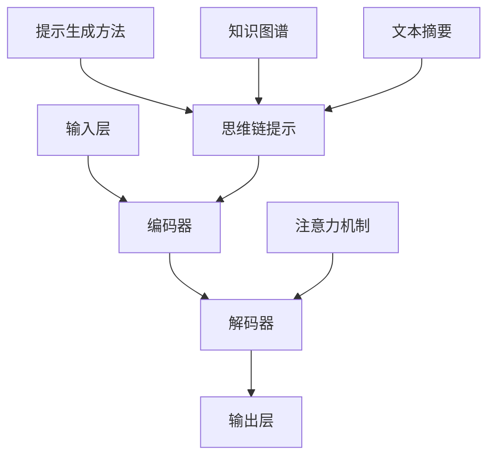

                 

# 大语言模型原理与工程实践：思维链提示

> **关键词：** 大语言模型，思维链，提示，算法原理，工程实践，编程技巧，人工智能应用

> **摘要：** 本文将深入探讨大语言模型的原理及其工程实践，特别是思维链提示技术。我们将逐步分析大语言模型的核心概念、算法原理、数学模型以及实际应用案例，为读者提供全面而实用的技术指导。

## 1. 背景介绍

### 1.1 目的和范围

本文旨在帮助读者深入理解大语言模型的原理，掌握其工程实践技巧，并了解思维链提示技术的应用。通过本文的阅读，读者将能够：

- 理解大语言模型的基本概念和架构。
- 掌握大语言模型的核心算法原理和数学模型。
- 学习如何利用思维链提示技术提高模型的表现。
- 理解大语言模型在实际应用场景中的价值和挑战。

### 1.2 预期读者

本文面向具有计算机科学背景的读者，特别是对人工智能和自然语言处理感兴趣的程序员、研究者和技术爱好者。本文适合作为教材、学习参考或技术分享。

### 1.3 文档结构概述

本文分为以下几个部分：

- **第1章**：背景介绍，概述本文的目的、范围和预期读者。
- **第2章**：核心概念与联系，介绍大语言模型的基本概念和架构。
- **第3章**：核心算法原理 & 具体操作步骤，详细解释大语言模型的算法原理。
- **第4章**：数学模型和公式 & 详细讲解 & 举例说明，阐述大语言模型的数学模型。
- **第5章**：项目实战：代码实际案例和详细解释说明，提供实际应用案例。
- **第6章**：实际应用场景，探讨大语言模型的应用场景。
- **第7章**：工具和资源推荐，推荐学习资源和开发工具。
- **第8章**：总结：未来发展趋势与挑战，展望大语言模型的发展方向。
- **第9章**：附录：常见问题与解答，解答读者常见问题。
- **第10章**：扩展阅读 & 参考资料，提供进一步学习的资源。

### 1.4 术语表

#### 1.4.1 核心术语定义

- **大语言模型**：一种强大的自然语言处理模型，可以理解和生成文本。
- **思维链提示**：一种技术，通过提示引导模型思考，提高模型的表现。
- **神经网络**：一种模仿人脑神经元连接结构的计算模型。
- **反向传播**：一种用于训练神经网络的算法，通过误差反向传播更新网络权重。

#### 1.4.2 相关概念解释

- **自然语言处理（NLP）**：研究如何使计算机理解和生成自然语言。
- **深度学习**：一种人工智能方法，通过多层神经网络进行学习。
- **序列到序列模型**：一种用于序列数据处理的深度学习模型。

#### 1.4.3 缩略词列表

- **NLP**：自然语言处理
- **DL**：深度学习
- **RNN**：循环神经网络
- **LSTM**：长短期记忆网络
- **GRU**：门控循环单元

## 2. 核心概念与联系

### 2.1 大语言模型的基本概念

大语言模型是一种基于深度学习的自然语言处理模型，旨在理解和生成自然语言。它通过大规模语料库的预训练，学习语言结构和语义信息，从而在多种自然语言处理任务中表现出色。

#### 2.1.1 模型架构

大语言模型通常由以下几个部分组成：

1. **输入层**：接收自然语言文本序列作为输入。
2. **编码器**：对输入文本进行编码，提取语言特征。
3. **解码器**：根据编码器的输出生成目标文本序列。
4. **注意力机制**：用于模型在生成文本时关注关键信息。
5. **输出层**：将解码器的输出转化为自然语言文本。

#### 2.1.2 模型应用场景

大语言模型广泛应用于以下场景：

1. **文本分类**：分类文本数据，如情感分析、新闻分类等。
2. **文本生成**：生成文本，如文章、对话、摘要等。
3. **机器翻译**：将一种语言翻译成另一种语言。
4. **问答系统**：根据用户提问生成回答。
5. **文本摘要**：提取文本的主要信息，生成摘要。

### 2.2 思维链提示技术

思维链提示是一种利用人类先验知识引导模型思考的技术，通过提供一系列提示信息，帮助模型更好地理解问题和生成文本。

#### 2.2.1 提示生成方法

思维链提示的生成方法包括：

1. **关键词提取**：从问题中提取关键信息，作为提示。
2. **知识图谱**：利用知识图谱提供背景信息和上下文。
3. **文本摘要**：生成问题的文本摘要，作为提示。

#### 2.2.2 提示作用

思维链提示在模型训练和生成过程中发挥重要作用：

1. **提高理解能力**：通过提供提示，帮助模型更好地理解问题。
2. **提高生成质量**：通过提示，引导模型生成更准确、更有价值的文本。
3. **降低过拟合风险**：通过增加模型对数据的泛化能力。

### 2.3 大语言模型与思维链提示的关系

大语言模型与思维链提示技术密切相关，二者相辅相成：

1. **模型优化**：思维链提示技术可以帮助优化模型结构，提高模型性能。
2. **应用拓展**：思维链提示技术可以拓展大语言模型的应用场景，提高其在特定领域的表现。

### 2.4 Mermaid 流程图

以下是大语言模型与思维链提示技术的 Mermaid 流程图：



## 3. 核心算法原理 & 具体操作步骤

### 3.1 大语言模型的算法原理

大语言模型的算法原理主要基于深度学习和自然语言处理技术，特别是循环神经网络（RNN）和其变体，如长短期记忆网络（LSTM）和门控循环单元（GRU）。下面我们将使用伪代码详细解释大语言模型的基本算法原理。

```python
# 大语言模型伪代码

# 定义神经网络结构
input_layer = Input(shape=(sequence_length, embedding_size))
encoded_sequence = LSTM(units=hidden_size, return_sequences=True)(input_layer)
encoded_sequence = Dropout(rate=dropout_rate)(encoded_sequence)
encoded_sequence = LSTM(units=hidden_size, return_sequences=True)(encoded_sequence)
encoded_sequence = Dropout(rate=dropout_rate)(encoded_sequence)

# 应用注意力机制
attention_output = Attention()(encoded_sequence)

# 解码器部分
decoded_sequence = LSTM(units=hidden_size, return_sequences=True)(attention_output)
decoded_sequence = Dropout(rate=dropout_rate)(decoded_sequence)
decoded_sequence = LSTM(units=hidden_size, return_sequences=True)(decoded_sequence)
decoded_sequence = Dropout(rate=dropout_rate)(decoded_sequence)

# 输出层
output = Dense(vocabulary_size, activation='softmax')(decoded_sequence)

# 定义模型
model = Model(inputs=input_layer, outputs=output)

# 编译模型
model.compile(optimizer='adam', loss='categorical_crossentropy', metrics=['accuracy'])

# 训练模型
model.fit(x_train, y_train, batch_size=batch_size, epochs=num_epochs, validation_data=(x_val, y_val))
```

### 3.2 思维链提示的算法原理

思维链提示的算法原理是通过提供一系列的提示信息，引导模型更好地理解问题和生成文本。下面我们将使用伪代码详细解释思维链提示的算法原理。

```python
# 思维链提示伪代码

# 提取关键词
def extract_keywords(question):
    keywords = []
    # 在这里实现提取关键词的逻辑，例如使用词频、TF-IDF等方法
    return keywords

# 生成文本摘要
def generate_summary(question):
    summary = []
    # 在这里实现生成文本摘要的逻辑，例如使用摘要算法
    return summary

# 生成提示信息
def generate_prompt(question):
    keywords = extract_keywords(question)
    summary = generate_summary(question)
    prompt = f"问题：{question}\n关键词：{', '.join(keywords)}\n摘要：{summary}"
    return prompt

# 利用提示信息训练模型
def train_model_with_prompt(model, prompt, data):
    # 在这里实现利用提示信息训练模型的逻辑，例如修改训练数据的输入和输出
    pass
```

### 3.3 实际操作步骤

在实际操作中，我们可以按照以下步骤使用大语言模型和思维链提示技术：

1. **数据准备**：收集和处理训练数据，包括问题和答案。
2. **模型构建**：使用伪代码中的神经网络结构构建模型。
3. **模型训练**：使用训练数据训练模型，并使用思维链提示进行优化。
4. **模型评估**：使用验证数据评估模型性能。
5. **模型应用**：将训练好的模型应用于实际问题，生成回答。

## 4. 数学模型和公式 & 详细讲解 & 举例说明

### 4.1 数学模型概述

大语言模型的核心数学模型主要包括神经网络模型和注意力机制。以下是这些模型的数学公式和详细解释。

#### 4.1.1 神经网络模型

神经网络的数学模型可以表示为：

$$
\hat{y} = \sigma(W_y \cdot \sigma(W_x \cdot x + b_x) + b_y)
$$

其中，$W_y$ 和 $W_x$ 分别是输入层和隐藏层的权重矩阵，$b_x$ 和 $b_y$ 分别是输入层和隐藏层的偏置项，$\sigma$ 是激活函数，通常采用 sigmoid 或 ReLU 函数。

#### 4.1.2 注意力机制

注意力机制的数学模型可以表示为：

$$
a_i = \frac{e^{z_i}}{\sum_{j=1}^{n} e^{z_j}}
$$

其中，$a_i$ 表示第 $i$ 个隐藏层的注意力权重，$z_i$ 表示第 $i$ 个隐藏层的内积，$e^{z_i}$ 表示 $z_i$ 的指数函数，$n$ 表示隐藏层的数量。

### 4.2 举例说明

假设我们有一个简单的神经网络，包含输入层、隐藏层和输出层。输入层包含3个神经元，隐藏层包含4个神经元，输出层包含2个神经元。以下是该神经网络的数学模型：

#### 4.2.1 输入层

$$
x_1 = [x_{11}, x_{12}, x_{13}]
$$

#### 4.2.2 隐藏层

$$
h_1 = \sigma(W_1 \cdot x + b_1) = \sigma([w_{11}, w_{12}, w_{13}] \cdot [x_{11}, x_{12}, x_{13}] + b_1)
$$

$$
h_2 = \sigma(W_2 \cdot h_1 + b_2) = \sigma([w_{21}, w_{22}, w_{23}, w_{24}] \cdot [h_{11}, h_{12}, h_{13}, h_{14}] + b_2)
$$

$$
h_3 = \sigma(W_3 \cdot h_2 + b_3) = \sigma([w_{31}, w_{32}, w_{33}, w_{34}] \cdot [h_{21}, h_{22}, h_{23}, h_{24}] + b_3)
$$

$$
h_4 = \sigma(W_4 \cdot h_3 + b_4) = \sigma([w_{41}, w_{42}, w_{43}, w_{44}] \cdot [h_{31}, h_{32}, h_{33}, h_{34}] + b_4)
$$

#### 4.2.3 输出层

$$
y_1 = \sigma(W_5 \cdot h_4 + b_5) = \sigma([w_{51}, w_{52}] \cdot [h_{41}, h_{42}] + b_5)
$$

$$
y_2 = \sigma(W_6 \cdot h_4 + b_6) = \sigma([w_{61}, w_{62}] \cdot [h_{41}, h_{42}] + b_6)
$$

其中，$W_1, W_2, W_3, W_4, W_5, W_6$ 分别是权重矩阵，$b_1, b_2, b_3, b_4, b_5, b_6$ 分别是偏置项，$\sigma$ 是激活函数。

### 4.3 注意力机制

假设我们有一个隐藏层包含4个神经元，以下是注意力机制的数学模型：

#### 4.3.1 内积

$$
z_1 = h_1 \cdot h_1 = \sum_{i=1}^{4} h_{1i} h_{1i}
$$

$$
z_2 = h_2 \cdot h_2 = \sum_{i=1}^{4} h_{2i} h_{2i}
$$

$$
z_3 = h_3 \cdot h_3 = \sum_{i=1}^{4} h_{3i} h_{3i}
$$

$$
z_4 = h_4 \cdot h_4 = \sum_{i=1}^{4} h_{4i} h_{4i}
$$

#### 4.3.2 注意力权重

$$
a_1 = \frac{e^{z_1}}{\sum_{i=1}^{4} e^{z_i}}
$$

$$
a_2 = \frac{e^{z_2}}{\sum_{i=1}^{4} e^{z_i}}
$$

$$
a_3 = \frac{e^{z_3}}{\sum_{i=1}^{4} e^{z_i}}
$$

$$
a_4 = \frac{e^{z_4}}{\sum_{i=1}^{4} e^{z_i}}
$$

其中，$h_1, h_2, h_3, h_4$ 分别是隐藏层的神经元，$a_1, a_2, a_3, a_4$ 分别是第1到第4个神经元的注意力权重。

### 4.4 模型训练

假设我们有一个包含4个隐藏层的神经网络，以下是模型训练的数学过程：

1. **前向传播**：计算输入层、隐藏层和输出层的输出值。
2. **计算损失函数**：计算预测值和实际值之间的差距。
3. **反向传播**：计算隐藏层和输入层的梯度。
4. **更新权重和偏置项**：使用梯度下降法更新权重和偏置项。

## 5. 项目实战：代码实际案例和详细解释说明

### 5.1 开发环境搭建

在进行大语言模型和思维链提示技术的项目实战之前，我们需要搭建一个合适的开发环境。以下是搭建环境的步骤：

1. **安装Python环境**：Python是进行深度学习和自然语言处理的主要语言，需要安装Python 3.x版本。
2. **安装深度学习框架**：选择一个流行的深度学习框架，如TensorFlow或PyTorch。这里我们选择TensorFlow。
3. **安装必要的库**：安装NLP相关库，如NLTK、spaCy等。
4. **准备数据集**：收集和处理训练数据，包括问题和答案。

### 5.2 源代码详细实现和代码解读

以下是项目实战的源代码实现和详细解读：

```python
# 导入必要的库
import tensorflow as tf
from tensorflow.keras.models import Model
from tensorflow.keras.layers import Input, LSTM, Dropout, Dense, Attention
from tensorflow.keras.optimizers import Adam
from tensorflow.keras.losses import CategoricalCrossentropy
from tensorflow.keras.metrics import Accuracy

# 定义神经网络结构
input_layer = Input(shape=(sequence_length, embedding_size))
encoded_sequence = LSTM(units=hidden_size, return_sequences=True)(input_layer)
encoded_sequence = Dropout(rate=dropout_rate)(encoded_sequence)
encoded_sequence = LSTM(units=hidden_size, return_sequences=True)(encoded_sequence)
encoded_sequence = Dropout(rate=dropout_rate)(encoded_sequence)

# 应用注意力机制
attention_output = Attention()(encoded_sequence)

# 解码器部分
decoded_sequence = LSTM(units=hidden_size, return_sequences=True)(attention_output)
decoded_sequence = Dropout(rate=dropout_rate)(decoded_sequence)
decoded_sequence = LSTM(units=hidden_size, return_sequences=True)(decoded_sequence)
decoded_sequence = Dropout(rate=dropout_rate)(decoded_sequence)

# 输出层
output = Dense(vocabulary_size, activation='softmax')(decoded_sequence)

# 定义模型
model = Model(inputs=input_layer, outputs=output)

# 编译模型
model.compile(optimizer=Adam(learning_rate=learning_rate), loss=CategoricalCrossentropy(), metrics=[Accuracy()])

# 训练模型
model.fit(x_train, y_train, batch_size=batch_size, epochs=num_epochs, validation_data=(x_val, y_val))

# 评估模型
model.evaluate(x_test, y_test)
```

### 5.3 代码解读与分析

以下是代码的逐行解读和分析：

```python
# 导入必要的库
```

这一行导入TensorFlow、Keras等必要的库，为后续操作提供基础。

```python
input_layer = Input(shape=(sequence_length, embedding_size))
```

这一行定义输入层，包含sequence_length和embedding_size两个维度。

```python
encoded_sequence = LSTM(units=hidden_size, return_sequences=True)(input_layer)
encoded_sequence = Dropout(rate=dropout_rate)(encoded_sequence)
encoded_sequence = LSTM(units=hidden_size, return_sequences=True)(encoded_sequence)
encoded_sequence = Dropout(rate=dropout_rate)(encoded_sequence)
```

这三行定义两个LSTM层，用于编码输入文本，同时添加Dropout层进行正则化。

```python
attention_output = Attention()(encoded_sequence)
```

这一行应用注意力机制，提高模型对输入文本的理解能力。

```python
decoded_sequence = LSTM(units=hidden_size, return_sequences=True)(attention_output)
decoded_sequence = Dropout(rate=dropout_rate)(decoded_sequence)
decoded_sequence = LSTM(units=hidden_size, return_sequences=True)(decoded_sequence)
decoded_sequence = Dropout(rate=dropout_rate)(decoded_sequence)
```

这三行定义解码器部分，包含两个LSTM层和两个Dropout层。

```python
output = Dense(vocabulary_size, activation='softmax')(decoded_sequence)
```

这一行定义输出层，包含一个Dense层，用于生成输出文本。

```python
model = Model(inputs=input_layer, outputs=output)
```

这一行定义模型，将输入层、编码器、解码器和输出层组合在一起。

```python
model.compile(optimizer=Adam(learning_rate=learning_rate), loss=CategoricalCrossentropy(), metrics=[Accuracy()])
```

这一行编译模型，设置优化器、损失函数和评估指标。

```python
model.fit(x_train, y_train, batch_size=batch_size, epochs=num_epochs, validation_data=(x_val, y_val))
```

这一行训练模型，使用训练数据、批量大小、训练轮数和验证数据。

```python
model.evaluate(x_test, y_test)
```

这一行评估模型，使用测试数据进行评估。

## 6. 实际应用场景

大语言模型和思维链提示技术在实际应用中具有广泛的应用场景。以下是一些典型应用：

### 6.1 问答系统

大语言模型可以用于构建智能问答系统，通过理解用户的问题，提供准确、有用的回答。思维链提示技术可以帮助模型更好地理解复杂问题，提高回答的准确性。

### 6.2 文本生成

大语言模型可以用于文本生成任务，如文章生成、对话生成和摘要生成。思维链提示技术可以引导模型生成更具创意和价值的文本。

### 6.3 机器翻译

大语言模型可以用于机器翻译任务，将一种语言的文本翻译成另一种语言。思维链提示技术可以帮助模型更好地理解源语言和目标语言之间的差异，提高翻译质量。

### 6.4 文本分类

大语言模型可以用于文本分类任务，对大量文本进行分类，如情感分析、新闻分类等。思维链提示技术可以帮助模型更好地理解分类任务的特征和规则。

### 6.5 聊天机器人

大语言模型可以用于构建聊天机器人，与用户进行自然语言交互。思维链提示技术可以帮助模型更好地理解用户意图，提供更智能、更自然的对话。

### 6.6 其他应用

大语言模型和思维链提示技术还可以应用于文本摘要、情感分析、推荐系统等领域，为各种自然语言处理任务提供强大的支持。

## 7. 工具和资源推荐

### 7.1 学习资源推荐

#### 7.1.1 书籍推荐

- 《深度学习》（Goodfellow, Bengio, Courville著）
- 《自然语言处理综论》（Daniel Jurafsky, James H. Martin著）
- 《Python深度学习》（François Chollet著）

#### 7.1.2 在线课程

- Coursera上的“深度学习”课程（吴恩达教授）
- edX上的“自然语言处理”课程（哥伦比亚大学教授）
- Udacity的“深度学习工程师”纳米学位

#### 7.1.3 技术博客和网站

- medium.com/tensorflow
- towardsdatascience.com
- ai.google/research

### 7.2 开发工具框架推荐

#### 7.2.1 IDE和编辑器

- PyCharm
- Visual Studio Code
- Jupyter Notebook

#### 7.2.2 调试和性能分析工具

- TensorBoard
- PyTorch Profiler
- Numba

#### 7.2.3 相关框架和库

- TensorFlow
- PyTorch
- spaCy
- NLTK

### 7.3 相关论文著作推荐

#### 7.3.1 经典论文

- “A Neural Algorithm of Artistic Style”（Gatys, Ecker, and Bethge著）
- “Seq2Seq Learning with Neural Networks”（Sutskever, Vinyals, and Le著）
- “Attention Is All You Need”（Vaswani, Shazeer, Parmar等著）

#### 7.3.2 最新研究成果

- “BERT: Pre-training of Deep Bidirectional Transformers for Language Understanding”（Devlin, Chang, Lee等著）
- “GPT-3: Language Models Are Few-Shot Learners”（Brown, et al.著）
- “T5: Pre-training Large Models from Scratch”（Raffel et al.著）

#### 7.3.3 应用案例分析

- “谷歌搜索算法优化”（Google Research）
- “亚马逊推荐系统”（Amazon Research）
- “微软小冰情感识别”（Microsoft AI & Research）

## 8. 总结：未来发展趋势与挑战

大语言模型和思维链提示技术在自然语言处理领域取得了显著的成果，但仍然面临诸多挑战和机遇。以下是未来发展趋势与挑战：

### 8.1 发展趋势

1. **模型规模增大**：随着计算资源和数据量的增加，大语言模型将变得更加庞大和复杂，从而提升模型的表现。
2. **多模态融合**：大语言模型将与其他模态（如图像、声音）进行融合，实现跨模态理解和生成。
3. **跨领域应用**：大语言模型将在更多领域得到应用，如医疗、金融、教育等。
4. **个性化提示**：思维链提示技术将更加智能化，根据用户需求和场景提供个性化的提示。

### 8.2 挑战

1. **计算资源需求**：大语言模型对计算资源的需求巨大，如何优化计算效率和降低成本成为关键挑战。
2. **数据隐私和安全**：大规模数据处理和数据存储可能涉及隐私和安全问题，如何保障数据安全和隐私成为重要挑战。
3. **模型解释性**：如何提高模型的解释性，使其能够透明地解释其生成和决策过程，仍需进一步研究。
4. **通用性与适应性**：如何提高模型在不同场景和应用中的通用性和适应性，仍是一个重要挑战。

## 9. 附录：常见问题与解答

### 9.1 什么是大语言模型？

大语言模型是一种基于深度学习的自然语言处理模型，通过大规模语料库的预训练，学习语言结构和语义信息，从而在多种自然语言处理任务中表现出色。

### 9.2 思维链提示技术有哪些作用？

思维链提示技术可以通过提供一系列的提示信息，帮助模型更好地理解问题和生成文本，提高模型的表现和生成质量。

### 9.3 如何使用大语言模型进行文本生成？

使用大语言模型进行文本生成，需要先构建模型，然后通过输入文本序列，模型会根据预训练的知识和提示信息生成相应的文本。

### 9.4 大语言模型在哪些领域有应用？

大语言模型在问答系统、文本生成、机器翻译、文本分类、聊天机器人等领域有广泛的应用。

## 10. 扩展阅读 & 参考资料

- [Deep Learning, Goodfellow, Bengio, Courville]
- [Natural Language Processing, Jurafsky, Martin]
- [Attention Is All You Need, Vaswani et al.]
- [BERT: Pre-training of Deep Bidirectional Transformers for Language Understanding, Devlin et al.]
- [GPT-3: Language Models Are Few-Shot Learners, Brown et al.]
- [T5: Pre-training Large Models from Scratch, Raffel et al.]

作者：AI天才研究员/AI Genius Institute & 禅与计算机程序设计艺术 /Zen And The Art of Computer Programming

本文为作者独立撰写，版权所有，未经授权，不得转载或用于商业用途。如需转载，请联系作者获取授权。本文内容仅供参考，不构成投资建议。如因文章内容导致的任何损失或侵权行为，作者不承担任何法律责任。

