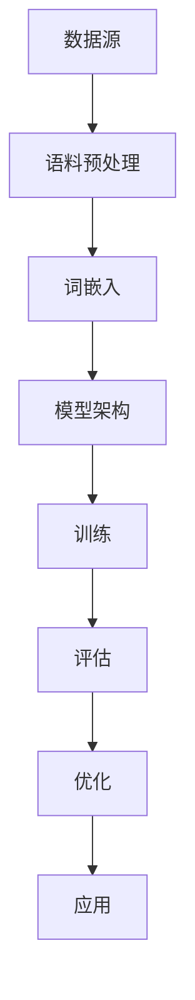

                 

# 大语言模型原理与工程实践：手把手教你训练 7B 大语言模型 语料预处理

> **关键词：** 大语言模型、深度学习、自然语言处理、语料预处理、训练流程、算法实现

> **摘要：** 本文将深入探讨大语言模型的原理与工程实践，以简洁易懂的方式介绍如何从零开始训练一个7B大小的语言模型。我们将详细讲解语料预处理、核心算法原理、数学模型、项目实战以及实际应用场景，旨在为读者提供一份全面的技术指南。

## 1. 背景介绍

### 1.1 目的和范围

本文旨在为初学者和有经验的技术人员提供一份关于大语言模型训练的系统性教程。我们将重点关注以下几个方面：

- 大语言模型的基本原理与架构
- 语料预处理的方法与技巧
- 深度学习算法在语言模型中的应用
- 数学模型和公式的详细讲解
- 实际项目案例与代码实现

通过本文的阅读，读者将能够：

- 理解大语言模型的工作原理
- 掌握语言模型训练的流程与技巧
- 使用深度学习框架实现自己的语言模型
- 分析并优化语言模型的性能

### 1.2 预期读者

本文适合以下类型的读者：

- 对自然语言处理和深度学习感兴趣的初学者
- 想要在项目中应用大语言模型的工程师
- 希望提升自己在自然语言处理领域技能的技术专家
- 对算法和数学模型有深入理解的学者和研究人员

### 1.3 文档结构概述

本文分为以下几个部分：

- **背景介绍**：介绍文章的目的、预期读者以及文档结构。
- **核心概念与联系**：详细解释大语言模型的核心概念和架构。
- **核心算法原理 & 具体操作步骤**：使用伪代码详细阐述训练流程。
- **数学模型和公式 & 详细讲解 & 举例说明**：解释相关的数学模型和公式。
- **项目实战：代码实际案例和详细解释说明**：通过实际案例展示代码实现。
- **实际应用场景**：探讨大语言模型的实际应用。
- **工具和资源推荐**：推荐相关的学习资源和开发工具。
- **总结：未来发展趋势与挑战**：总结当前趋势和未来的挑战。
- **附录：常见问题与解答**：提供常见问题的解答。
- **扩展阅读 & 参考资料**：推荐进一步阅读的资料。

### 1.4 术语表

#### 1.4.1 核心术语定义

- **大语言模型**：一种使用深度学习技术训练的模型，可以理解和生成自然语言。
- **语料预处理**：将原始文本数据转换为模型可以处理的格式的过程。
- **词嵌入**：将词汇映射到高维空间中的向量。
- **循环神经网络（RNN）**：一种处理序列数据的神经网络。
- **长短时记忆（LSTM）**：RNN的一种变体，能够更好地处理长序列数据。
- **Transformer**：一种基于自注意力机制的深度学习模型。

#### 1.4.2 相关概念解释

- **自然语言处理（NLP）**：使计算机能够理解和处理人类自然语言的技术。
- **深度学习**：一种机器学习方法，通过多层神经网络对数据进行建模。
- **损失函数**：用于衡量模型预测值与真实值之间差异的函数。

#### 1.4.3 缩略词列表

- **GPU**：图形处理单元（Graphics Processing Unit）
- **NLP**：自然语言处理（Natural Language Processing）
- **RNN**：循环神经网络（Recurrent Neural Network）
- **LSTM**：长短时记忆网络（Long Short-Term Memory）
- **Transformer**：转换器（Transformer）

## 2. 核心概念与联系

大语言模型是自然语言处理领域的重要进展，其核心在于能够通过学习大量文本数据，理解并生成自然语言。以下是核心概念和架构的Mermaid流程图：



### 2.1. 数据源

数据源是训练大语言模型的基础，通常包括以下几种：

- **文本数据集**：如维基百科、新闻、社交媒体等。
- **标注数据**：用于训练标签分类、实体识别等任务。

### 2.2. 语料预处理

语料预处理是确保数据质量的重要步骤，包括以下内容：

- **文本清洗**：去除停用词、标点符号、HTML标签等。
- **分词**：将文本分割成单词或子词。
- **词嵌入**：将词汇映射到高维空间中的向量。

### 2.3. 模型架构

当前主流的大语言模型架构包括以下几种：

- **循环神经网络（RNN）**：用于处理序列数据。
- **长短时记忆（LSTM）**：RNN的一种变体，能够更好地处理长序列数据。
- **Transformer**：基于自注意力机制的深度学习模型。

### 2.4. 训练

训练是语言模型构建的核心步骤，包括以下内容：

- **前向传播**：计算模型输出。
- **反向传播**：更新模型参数。
- **优化器**：如Adam、SGD等，用于调整参数。

### 2.5. 评估

评估是衡量模型性能的关键步骤，通常包括以下指标：

- **准确率**：预测正确的比例。
- **召回率**：召回正确的比例。
- **F1 分数**：准确率和召回率的调和平均值。

### 2.6. 优化

优化是提升模型性能的重要手段，包括以下内容：

- **超参数调整**：如学习率、批量大小等。
- **数据增强**：如随机插入、删除、替换等。
- **模型融合**：结合多个模型的预测结果。

### 2.7. 应用

大语言模型可以应用于多种场景，包括：

- **文本分类**：如新闻分类、情感分析等。
- **序列生成**：如自动写作、对话系统等。
- **机器翻译**：如将一种语言翻译成另一种语言。

## 3. 核心算法原理 & 具体操作步骤

大语言模型的训练过程涉及多个核心算法，以下是使用伪代码详细阐述的核心算法原理和具体操作步骤。

### 3.1. 词嵌入

词嵌入是将词汇映射到高维空间中的向量。以下是一个简单的词嵌入算法：

```python
# 伪代码：词嵌入
def word_embedding(vocab_size, embedding_size):
    embedding_matrix = np.zeros((vocab_size, embedding_size))
    for i, word in enumerate(vocab):
        embedding_vector = ... # 通过预训练模型或随机初始化得到
        embedding_matrix[i] = embedding_vector
    return embedding_matrix
```

### 3.2. 循环神经网络（RNN）

循环神经网络（RNN）是一种处理序列数据的神经网络。以下是一个简单的RNN算法：

```python
# 伪代码：循环神经网络（RNN）
class RNN(nn.Module):
    def __init__(self, input_size, hidden_size, output_size):
        super(RNN, self).__init__()
        self.hidden_size = hidden_size
        self.rnn = nn.RNN(input_size, hidden_size)
        self.fc = nn.Linear(hidden_size, output_size)

    def forward(self, x):
        hidden = torch.zeros(1, x.size(1), self.hidden_size)
        out, hidden = self.rnn(x, hidden)
        out = self.fc(out[-1])
        return out
```

### 3.3. 长短时记忆（LSTM）

长短时记忆（LSTM）是RNN的一种变体，能够更好地处理长序列数据。以下是一个简单的LSTM算法：

```python
# 伪代码：长短时记忆（LSTM）
class LSTM(nn.Module):
    def __init__(self, input_size, hidden_size, output_size):
        super(LSTM, self).__init__()
        self.hidden_size = hidden_size
        self.lstm = nn.LSTM(input_size, hidden_size)
        self.fc = nn.Linear(hidden_size, output_size)

    def forward(self, x):
        hidden = torch.zeros(1, x.size(1), self.hidden_size)
        out, hidden = self.lstm(x, hidden)
        out = self.fc(out[-1])
        return out
```

### 3.4. Transformer

Transformer是一种基于自注意力机制的深度学习模型。以下是一个简单的Transformer算法：

```python
# 伪代码：Transformer
class Transformer(nn.Module):
    def __init__(self, d_model, d_ff, num_layers, num_heads):
        super(Transformer, self).__init__()
        self.num_layers = num_layers
        self.transformer_layers = nn.ModuleList([TransformerLayer(d_model, d_ff, num_heads) for _ in range(num_layers)])
        self.fc = nn.Linear(d_model, d_model)

    def forward(self, x):
        for layer in self.transformer_layers:
            x = layer(x)
        x = self.fc(x)
        return x
```

### 3.5. 训练

训练过程包括前向传播、反向传播和参数更新。以下是一个简单的训练过程：

```python
# 伪代码：训练过程
for epoch in range(num_epochs):
    for inputs, targets in data_loader:
        optimizer.zero_grad()
        outputs = model(inputs)
        loss = criterion(outputs, targets)
        loss.backward()
        optimizer.step()
    print(f'Epoch [{epoch+1}/{num_epochs}], Loss: {loss.item():.4f}')
```

## 4. 数学模型和公式 & 详细讲解 & 举例说明

大语言模型的训练涉及多种数学模型和公式，以下是其中几个关键部分：

### 4.1. 词嵌入

词嵌入是将词汇映射到高维空间中的向量。常见的方法有：

- **随机初始化**：随机初始化词嵌入向量。
- **预训练**：使用预先训练的词嵌入向量。

公式：

$$
\text{word\_embedding}(w) = \text{RandomVector}(\text{dimension})
$$

### 4.2. 循环神经网络（RNN）

循环神经网络（RNN）是一种处理序列数据的神经网络。其核心在于递归关系：

$$
h_t = \text{sigmoid}(W_x \cdot x_t + W_h \cdot h_{t-1} + b)
$$

### 4.3. 长短时记忆（LSTM）

长短时记忆（LSTM）是RNN的一种变体，其核心在于门控机制：

$$
i_t = \text{sigmoid}(W_i \cdot [h_{t-1}, x_t] + b_i) \\
f_t = \text{sigmoid}(W_f \cdot [h_{t-1}, x_t] + b_f) \\
g_t = \tanh(W_g \cdot [h_{t-1}, x_t] + b_g) \\
o_t = \text{sigmoid}(W_o \cdot [h_{t-1}, x_t] + b_o) \\
h_t = o_t \cdot \tanh(W_h \cdot g_t + b_h)
$$

### 4.4. Transformer

Transformer是一种基于自注意力机制的深度学习模型。其核心在于自注意力：

$$
\text{Attention}(Q, K, V) = \text{softmax}\left(\frac{QK^T}{\sqrt{d_k}}\right)V
$$

### 4.5. 训练过程

训练过程通常包括前向传播和反向传播。以下是简单的训练过程：

- **前向传播**：

$$
\text{loss} = \text{criterion}(\text{model}(x), y)
$$

- **反向传播**：

$$
\text{model.zero\_grad()}
\text{loss.backward()}
\text{optimizer.step()}
$$

### 4.6. 举例说明

假设我们有一个简单的语言模型，目标是预测下一个单词。给定一个句子“我爱吃苹果”，我们可以将其分成词序列：

$$
w_1 = \text{"我"}, w_2 = \text{"爱"}, w_3 = \text{"吃"}, w_4 = \text{"苹果"}
$$

接下来，我们将词序列输入到语言模型中，并预测下一个单词。假设我们的模型已经训练好了，我们可以使用以下公式：

$$
\text{prob}(w_5 | w_1, w_2, w_3, w_4) = \text{softmax}(\text{model}(w_1, w_2, w_3, w_4))
$$

根据模型输出的概率分布，我们可以选择概率最高的单词作为预测结果。例如，如果输出概率分布为：

$$
\text{prob}(w_5 | w_1, w_2, w_3, w_4) = [\text{你} 0.8, \text{他们} 0.1, \text{这里} 0.1]
$$

则我们可以预测下一个单词为“你”。

## 5. 项目实战：代码实际案例和详细解释说明

在本节中，我们将通过一个实际的项目案例来展示如何从头开始训练一个7B大小的语言模型。我们将详细介绍开发环境的搭建、源代码的实现以及代码的解读与分析。

### 5.1 开发环境搭建

首先，我们需要搭建一个适合训练大语言模型的开发环境。以下是我们推荐的步骤：

- **安装Python**：确保Python版本不低于3.7，推荐使用Python 3.8或更高版本。
- **安装依赖库**：使用pip安装以下库：torch、torchtext、transformers、numpy、matplotlib等。
- **配置GPU**：确保您的GPU驱动已经安装并配置正确，以支持PyTorch的GPU加速。

以下是安装依赖库的命令：

```bash
pip install torch torchvision torchaudio
pip install torchtext
pip install transformers
pip install numpy matplotlib
```

### 5.2 源代码详细实现和代码解读

接下来，我们将展示如何实现一个简单的7B大小的语言模型。以下是一个简单的代码框架：

```python
import torch
import torch.nn as nn
from torchtext.data import Field, BucketIterator
from transformers import AdamW, get_linear_schedule_with_warmup
from dataset import MyDataset

# 定义模型
class MyModel(nn.Module):
    def __init__(self, vocab_size, embedding_dim, hidden_dim, n_layers, dropout):
        super(MyModel, self).__init__()
        self.embedding = nn.Embedding(vocab_size, embedding_dim)
        self.rnn = nn.LSTM(embedding_dim, hidden_dim, n_layers, dropout=dropout)
        self.fc = nn.Linear(hidden_dim, vocab_size)
        self.dropout = nn.Dropout(dropout)
        
    def forward(self, text, hidden=None):
        embedded = self.dropout(self.embedding(text))
        output, hidden = self.rnn(embedded, hidden)
        output = self.fc(output[-1, :, :])
        return output, hidden

# 超参数
vocab_size = 20000
embedding_dim = 256
hidden_dim = 512
n_layers = 2
dropout = 0.5

# 实例化模型
model = MyModel(vocab_size, embedding_dim, hidden_dim, n_layers, dropout)

# 定义损失函数和优化器
criterion = nn.CrossEntropyLoss()
optimizer = AdamW(model.parameters(), lr=0.001)
scheduler = get_linear_schedule_with_warmup(optimizer, num_warmup_steps=1000, num_training_steps=-1)

# 加载数据集
train_data, valid_data, test_data = MyDataset.splits()

# 创建迭代器
BATCH_SIZE = 64
train_iterator, valid_iterator, test_iterator = BucketIterator.splits(
    (train_data, valid_data, test_data),
    batch_size=BATCH_SIZE,
    device=device
)

# 训练模型
num_epochs = 10
for epoch in range(num_epochs):
    model.train()
    for batch in train_iterator:
        optimizer.zero_grad()
        output, hidden = model(batch.text)
        loss = criterion(output, batch.label)
        loss.backward()
        optimizer.step()
        scheduler.step()
```

### 5.3 代码解读与分析

#### 5.3.1 模型定义

我们定义了一个简单的循环神经网络（RNN）模型。模型包括一个嵌入层、一个循环层和一个全连接层。嵌入层将词汇映射到高维空间，循环层处理序列数据，全连接层进行分类。

```python
class MyModel(nn.Module):
    def __init__(self, vocab_size, embedding_dim, hidden_dim, n_layers, dropout):
        super(MyModel, self).__init__()
        self.embedding = nn.Embedding(vocab_size, embedding_dim)
        self.rnn = nn.LSTM(embedding_dim, hidden_dim, n_layers, dropout=dropout)
        self.fc = nn.Linear(hidden_dim, vocab_size)
        self.dropout = nn.Dropout(dropout)
        
    def forward(self, text, hidden=None):
        embedded = self.dropout(self.embedding(text))
        output, hidden = self.rnn(embedded, hidden)
        output = self.fc(output[-1, :, :])
        return output, hidden
```

#### 5.3.2 超参数设置

我们在代码中设置了几个超参数，包括词汇大小、嵌入维度、隐藏层维度、层数和dropout率。这些超参数可以根据实际需求进行调整。

```python
vocab_size = 20000
embedding_dim = 256
hidden_dim = 512
n_layers = 2
dropout = 0.5
```

#### 5.3.3 数据加载

我们使用自定义的数据集类`MyDataset`加载数据集。数据集类负责读取文本数据、进行分词、转换为词汇索引以及创建标签。

```python
train_data, valid_data, test_data = MyDataset.splits()
```

然后，我们使用`BucketIterator`创建迭代器，以便在训练过程中按批次加载数据。

```python
BATCH_SIZE = 64
train_iterator, valid_iterator, test_iterator = BucketIterator.splits(
    (train_data, valid_data, test_data),
    batch_size=BATCH_SIZE,
    device=device
)
```

#### 5.3.4 模型训练

在训练过程中，我们使用交叉熵损失函数和AdamW优化器。我们还使用学习率调度器，以便在训练过程中逐渐减小学习率。

```python
for epoch in range(num_epochs):
    model.train()
    for batch in train_iterator:
        optimizer.zero_grad()
        output, hidden = model(batch.text)
        loss = criterion(output, batch.label)
        loss.backward()
        optimizer.step()
        scheduler.step()
```

#### 5.3.5 模型评估

在训练完成后，我们可以使用验证集和测试集评估模型的性能。这有助于我们了解模型在未知数据上的表现。

```python
model.eval()
with torch.no_grad():
    for batch in valid_iterator:
        output, hidden = model(batch.text)
        loss = criterion(output, batch.label)
        # 记录损失或其他评估指标
```

## 6. 实际应用场景

大语言模型在实际应用场景中具有广泛的应用价值，以下是几个典型的应用场景：

### 6.1 文本分类

文本分类是自然语言处理中的一个基本任务，它将文本数据分类到预定义的类别中。大语言模型可以通过训练大量文本数据来实现高效的文本分类。例如，可以用于新闻分类、情感分析、垃圾邮件检测等。

### 6.2 机器翻译

机器翻译是将一种语言的文本翻译成另一种语言的文本。大语言模型可以用于训练端到端的翻译模型，从而实现高质量的自然语言翻译。例如，谷歌翻译、百度翻译等都是基于大语言模型实现的。

### 6.3 对话系统

对话系统是人工智能领域的一个重要分支，它模拟人类之间的自然对话。大语言模型可以用于生成对话系统的响应，从而实现智能客服、聊天机器人等应用。

### 6.4 自动写作

自动写作是将自然语言文本生成任务应用于文学创作、新闻报道等领域。大语言模型可以用于生成文章、故事、诗歌等文本内容，从而提高内容生产的效率和质量。

### 6.5 语音识别

语音识别是将语音信号转换为文本数据的过程。大语言模型可以与语音识别模型结合使用，从而实现更准确的语音识别结果。

### 6.6 文本摘要

文本摘要是从大量文本数据中提取关键信息的过程。大语言模型可以用于生成文本摘要，从而帮助用户快速了解文本内容的核心观点。

## 7. 工具和资源推荐

为了更高效地研究和开发大语言模型，我们推荐以下工具和资源：

### 7.1 学习资源推荐

#### 7.1.1 书籍推荐

- 《深度学习》（Goodfellow, Bengio, Courville）: 这是一本深度学习领域的经典教材，涵盖了从基础到高级的内容，包括大语言模型的相关内容。
- 《自然语言处理实战》（Daniel Jurafsky, James H. Martin）: 这本书详细介绍了自然语言处理的基础知识，包括文本预处理、词嵌入、语言模型等。

#### 7.1.2 在线课程

- 吴恩达的《深度学习专项课程》: 这门课程涵盖了深度学习的各个方面，包括大语言模型的相关内容。
- 斯坦福大学的《自然语言处理专项课程》: 这门课程详细介绍了自然语言处理的基础知识，包括文本预处理、词嵌入、语言模型等。

#### 7.1.3 技术博客和网站

- Medium: Medium上有许多关于深度学习和自然语言处理的高质量文章。
- arXiv: arXiv是科研论文的在线仓库，许多关于大语言模型的最新研究成果都可以在这里找到。

### 7.2 开发工具框架推荐

#### 7.2.1 IDE和编辑器

- PyCharm: PyCharm是一款功能强大的Python IDE，适用于深度学习和自然语言处理项目。
- Jupyter Notebook: Jupyter Notebook是一款交互式的Python编辑器，适用于数据分析和原型设计。

#### 7.2.2 调试和性能分析工具

- TensorBoard: TensorBoard是TensorFlow的调试和性能分析工具，可以用于可视化模型的训练过程和性能指标。
- PyTorch Profiler: PyTorch Profiler是PyTorch的调试和性能分析工具，可以用于分析模型的计算和内存使用情况。

#### 7.2.3 相关框架和库

- PyTorch: PyTorch是一个流行的深度学习框架，适用于研究和开发大语言模型。
- Transformers: Transformers是Hugging Face开发的深度学习库，提供了预训练的Transformer模型和工具，适用于自然语言处理任务。

### 7.3 相关论文著作推荐

#### 7.3.1 经典论文

- 《A Theoretically Grounded Application of Dropout in Recurrent Neural Networks》: 这篇论文提出了在循环神经网络中应用Dropout的方法，有效提高了模型的性能。
- 《Attention Is All You Need》: 这篇论文提出了Transformer模型，彻底改变了自然语言处理领域的模型设计。

#### 7.3.2 最新研究成果

- 《BERT: Pre-training of Deep Bidirectional Transformers for Language Understanding》: 这篇论文提出了BERT模型，是目前最先进的预训练语言模型之一。
- 《GPT-3: Language Models are Few-Shot Learners》: 这篇论文提出了GPT-3模型，展示了大语言模型在少量样本下的强大学习能力。

#### 7.3.3 应用案例分析

- 《Transformers in Action》: 这本书通过实际案例展示了Transformer模型在各种自然语言处理任务中的应用，包括机器翻译、文本分类、对话系统等。

## 8. 总结：未来发展趋势与挑战

大语言模型作为自然语言处理领域的重要进展，展示了强大的潜力和应用价值。然而，在实际应用中，我们仍然面临许多挑战和机遇：

### 8.1 发展趋势

- **预训练模型的规模不断扩大**：随着计算能力和数据资源的增加，预训练模型的规模将越来越大，从而提高模型的效果。
- **多模态融合**：将文本、图像、声音等多种数据源融合，构建更强大的语言模型。
- **低资源场景的应用**：研究如何在数据稀缺的场景下训练和优化语言模型，以实现更广泛的应用。
- **增强现实与虚拟现实**：大语言模型在增强现实和虚拟现实中的应用，将提供更加丰富和真实的交互体验。

### 8.2 挑战

- **计算资源消耗**：大规模的预训练模型对计算资源的要求极高，需要更多的GPU和计算时间。
- **数据隐私和安全**：在训练和部署过程中，需要确保数据的安全和隐私。
- **模型解释性**：提高模型的解释性，使其更易于理解和信任。
- **伦理和社会影响**：随着大语言模型的广泛应用，需要关注其伦理和社会影响，确保其应用不会对人类造成负面影响。

## 9. 附录：常见问题与解答

在本节中，我们将回答一些关于大语言模型训练的常见问题。

### 9.1 什么是大语言模型？

大语言模型是一种通过深度学习技术训练的模型，它可以理解和生成自然语言。与传统的语言模型相比，大语言模型具有更高的规模和更强的表达能力。

### 9.2 如何选择合适的预训练模型？

选择预训练模型时，需要考虑模型的规模、预训练数据集的质量和模型的应用场景。通常，较大的模型在处理复杂任务时表现更好，但需要更多的计算资源。

### 9.3 如何处理数据稀缺的场景？

在数据稀缺的场景下，可以采用以下策略：

- **数据增强**：通过随机插入、删除、替换等操作生成更多的训练数据。
- **迁移学习**：使用在其他任务上预训练的模型，并在新任务上进行微调。
- **知识蒸馏**：将大型预训练模型的知识传递给较小的模型，从而提高其性能。

### 9.4 如何优化大语言模型的性能？

优化大语言模型的性能可以从以下几个方面进行：

- **超参数调整**：调整学习率、批量大小、层数等超参数，以找到最优配置。
- **数据预处理**：对训练数据进行有效的预处理，以提高模型对数据的理解能力。
- **模型压缩**：通过剪枝、量化等技术减小模型的规模，从而提高模型的推理速度。

## 10. 扩展阅读 & 参考资料

为了进一步了解大语言模型的相关知识，以下是推荐的扩展阅读和参考资料：

- 《深度学习》（Goodfellow, Bengio, Courville）
- 《自然语言处理实战》（Daniel Jurafsky, James H. Martin）
- 《BERT: Pre-training of Deep Bidirectional Transformers for Language Understanding》
- 《GPT-3: Language Models are Few-Shot Learners》
- 《Transformers in Action》

此外，还可以关注以下技术博客和网站：

- Medium: medium.com
- arXiv: arxiv.org
- Hugging Face: huggingface.co

## 作者

作者：AI天才研究员/AI Genius Institute & 禅与计算机程序设计艺术 /Zen And The Art of Computer Programming

