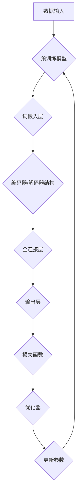

                 

# 大语言模型原理与工程实践：有监督微调数据的格式

> **关键词：** 大语言模型、有监督微调、数据格式、工程实践、人工智能、机器学习

> **摘要：** 本文将深入探讨大语言模型的原理，特别是有监督微调的数据格式。我们将详细解析核心概念、算法原理、数学模型，并通过项目实战展示具体操作步骤。文章还将探讨实际应用场景，推荐相关工具和资源，最后总结未来发展趋势与挑战。

## 1. 背景介绍

### 1.1 目的和范围

本文旨在为广大计算机科学和人工智能领域的开发者提供一个全面而有深度的指南，帮助他们理解和应用大语言模型中的有监督微调技术。文章将涵盖从基础理论到实际工程实践的全过程，旨在帮助读者不仅掌握理论知识，还能将其应用于实际项目中。

### 1.2 预期读者

本文适合以下读者群体：

1. 对人工智能和机器学习有初步了解的开发者。
2. 想深入了解大语言模型原理和工程实践的工程师。
3. 计算机科学专业的学生和研究人员。

### 1.3 文档结构概述

本文将按照以下结构进行：

1. **背景介绍**：简要介绍本文的目的、范围、预期读者和文档结构。
2. **核心概念与联系**：通过Mermaid流程图展示大语言模型的基本架构和核心概念。
3. **核心算法原理 & 具体操作步骤**：详细讲解有监督微调算法的原理和具体实现步骤。
4. **数学模型和公式 & 详细讲解 & 举例说明**：解析大语言模型中的数学模型和公式，并通过实例进行说明。
5. **项目实战：代码实际案例和详细解释说明**：通过实际代码案例展示有监督微调的工程实践。
6. **实际应用场景**：讨论大语言模型在不同领域中的应用。
7. **工具和资源推荐**：推荐学习资源、开发工具和框架。
8. **总结：未来发展趋势与挑战**：总结本文内容，展望未来发展方向和面临的挑战。
9. **附录：常见问题与解答**：回答读者可能遇到的问题。
10. **扩展阅读 & 参考资料**：提供进一步学习的资源。

### 1.4 术语表

#### 1.4.1 核心术语定义

- **大语言模型**：一种能够理解和生成自然语言的复杂神经网络模型。
- **有监督微调**：一种通过标注数据对预训练模型进行调整优化的方法。
- **数据格式**：数据在传输、存储和处理过程中所采用的结构和编码方式。

#### 1.4.2 相关概念解释

- **预训练模型**：在特定任务之前对模型进行的广泛语言知识预训练。
- **微调**：在预训练模型的基础上，通过特定任务的数据进行进一步的训练。

#### 1.4.3 缩略词列表

- **NLP**：自然语言处理（Natural Language Processing）
- **ML**：机器学习（Machine Learning）
- **DL**：深度学习（Deep Learning）
- **GPU**：图形处理单元（Graphics Processing Unit）

## 2. 核心概念与联系

大语言模型（如GPT-3、BERT等）的架构复杂，但理解其核心概念和联系是至关重要的。以下是一个简化版的Mermaid流程图，用于展示大语言模型的基本架构和关键组件。



### 2.1 数据输入

数据输入是整个模型的起点。对于有监督微调，输入数据通常是成对的任务数据和标注数据。任务数据可以是文本、语音或其他形式，而标注数据则是模型需要预测的标签。

### 2.2 词嵌入层

词嵌入层将输入数据（文本）转换为密集的向量表示。这些向量表示了每个单词的语义特征，是后续神经网络处理的基础。

### 2.3 编码器/解码器结构

编码器（在生成模型中）和解码器（在翻译模型中）结构负责将输入数据编码为上下文表示，然后将这些表示解码为输出数据。这种结构在大语言模型中非常关键，因为它们能够捕捉长距离依赖关系。

### 2.4 全连接层

全连接层通常位于编码器和解码器的中间，负责将上下文表示映射到任务相关的特征上。

### 2.5 输出层

输出层产生最终的任务预测结果。例如，在文本分类任务中，输出可能是类别的概率分布。

### 2.6 损失函数

损失函数衡量模型预测和实际标注之间的差距。常见的损失函数有交叉熵损失和均方误差损失。

### 2.7 优化器

优化器用于更新模型参数，以最小化损失函数。常见的优化器有随机梯度下降（SGD）和Adam优化器。

### 2.8 更新参数

通过优化器更新模型参数，使模型在特定任务上表现更好。

## 3. 核心算法原理 & 具体操作步骤

### 3.1 有监督微调算法原理

有监督微调（Supervised Fine-tuning）是一种通过特定任务数据对预训练模型进行调整优化的方法。其核心思想是在预训练模型的基础上，利用标注数据进行微调，使模型在特定任务上达到更好的性能。

### 3.2 操作步骤

以下是进行有监督微调的基本步骤：

1. **准备数据**：收集和准备用于微调的标注数据集。数据集应该足够大且具有多样性，以涵盖任务的各种情况。
2. **预处理数据**：对数据集进行清洗和预处理，包括分词、去停用词、转换词嵌入等。
3. **加载预训练模型**：从预训练模型库中加载预训练好的模型，例如BERT、GPT等。
4. **微调模型**：将预处理后的数据输入到预训练模型中，并使用有监督的训练策略进行微调。
5. **评估模型**：在验证集上评估微调后的模型性能，并根据需要调整模型参数或数据预处理策略。
6. **应用模型**：将微调后的模型应用于实际任务，例如文本分类、命名实体识别等。

### 3.3 伪代码

以下是进行有监督微调的伪代码：

```python
# 有监督微调伪代码

# 步骤1：准备数据
data = load_dataset('your_dataset')
preprocessed_data = preprocess_data(data)

# 步骤2：加载预训练模型
model = load_pretrained_model('your_pretrained_model')

# 步骤3：微调模型
for epoch in range(num_epochs):
    for batch in preprocessed_data:
        inputs, labels = batch
        loss = model(inputs, labels)
        optimizer.zero_grad()
        loss.backward()
        optimizer.step()

# 步骤4：评估模型
performance = evaluate_model(model, validation_data)

# 步骤5：应用模型
apply_model(model, new_data)
```

## 4. 数学模型和公式 & 详细讲解 & 举例说明

大语言模型中的数学模型和公式是其核心组成部分，理解这些模型有助于我们深入理解模型的原理和实现细节。

### 4.1 词嵌入

词嵌入（Word Embedding）是将单词映射为向量空间中的稠密表示。常见的词嵌入方法包括Word2Vec、GloVe和BERT。

#### 4.1.1 Word2Vec

Word2Vec是一种基于神经网络的词嵌入方法，其核心思想是将每个单词映射为一个固定长度的向量。Word2Vec使用了两个神经网络：一个编码器和一个解码器。

- 编码器：将单词编码为一个固定长度的向量。
- 解码器：将向量解码回单词。

Word2Vec的关键公式如下：

$$
\text{output} = \text{softmax}(\text{W}^T \text{h})
$$

其中，$W$是权重矩阵，$h$是隐藏层输出。

#### 4.1.2 GloVe

GloVe（Global Vectors for Word Representation）是一种基于全局统计信息的词嵌入方法。GloVe的核心思想是通过计算单词共现矩阵的逆序对来学习词嵌入向量。

- 共现矩阵：表示单词共现频率的矩阵。
- 逆序对：两个单词共现的次数。

GloVe的关键公式如下：

$$
\text{loss} = \sum_{ij} \frac{f(i,j)}{\sqrt{f(i)} \cdot \sqrt{f(j)}} \left( \text{vec}(\text{w}_i) \cdot \text{vec}(\text{w}_j) - \text{exp} \right)
$$

其中，$f(i,j)$是单词$i$和单词$j$的共现频率，$\text{vec}(\text{w}_i)$和$\text{vec}(\text{w}_j)$分别是单词$i$和单词$j$的向量表示。

#### 4.1.3 BERT

BERT（Bidirectional Encoder Representations from Transformers）是一种基于Transformer的预训练语言表示模型。BERT通过双向编码器学习单词的上下文表示。

BERT的关键公式如下：

$$
\text{output} = \text{softmax}(\text{W}^T \text{h} + \text{b})
$$

其中，$W$是权重矩阵，$h$是隐藏层输出，$b$是偏置项。

### 4.2 Transformer

Transformer是BERT的核心架构，它是一种基于自注意力机制的序列到序列模型。Transformer的关键组件包括编码器和解码器。

- 编码器：将输入序列编码为上下文表示。
- 解码器：将上下文表示解码为输出序列。

Transformer的关键公式如下：

$$
\text{output} = \text{softmax}(\text{Q} \cdot \text{K}^T / \sqrt{d_k}) + \text{V} \cdot \text{softmax}(\text{Q} \cdot \text{V}^T / \sqrt{d_v})
$$

其中，$Q$、$K$和$V$分别是查询向量、键向量和值向量，$d_k$和$d_v$分别是键向量和值向量的维度。

### 4.3 举例说明

#### 4.3.1 词嵌入

假设我们有两个单词“A”和“B”，它们的词嵌入向量分别为$\text{vec}(\text{w}_A)$和$\text{vec}(\text{w}_B)$。我们可以通过计算它们的余弦相似度来衡量它们之间的语义相似性。

$$
\text{similarity} = \text{cosine}(\text{vec}(\text{w}_A), \text{vec}(\text{w}_B))
$$

#### 4.3.2 BERT

假设我们有一个BERT模型，其输入序列为“[CLS] the quick brown fox [SEP] jumps over the lazy dog [CLS]”。我们可以通过BERT模型预测每个单词的词向量。

$$
\text{output} = \text{softmax}(\text{W}^T \text{h} + \text{b})
$$

其中，$h$是BERT模型的隐藏层输出，$\text{b}$是偏置项。

## 5. 项目实战：代码实际案例和详细解释说明

### 5.1 开发环境搭建

在进行有监督微调之前，我们需要搭建一个合适的环境。以下是搭建开发环境的步骤：

1. 安装Python（推荐版本3.7及以上）。
2. 安装PyTorch，一种流行的深度学习框架。
3. 安装transformers库，用于加载预训练的BERT模型。
4. 准备一个GPU环境，用于加速模型训练。

以下是安装命令：

```bash
pip install python==3.8
pip install torch torchvision
pip install transformers
```

### 5.2 源代码详细实现和代码解读

以下是进行有监督微调的代码实现，我们将使用BERT模型和自定义数据集。

```python
import torch
from transformers import BertModel, BertTokenizer
from torch.utils.data import DataLoader
from torch.optim import Adam

# 步骤1：准备数据
tokenizer = BertTokenizer.from_pretrained('bert-base-uncased')
data = [...]
processed_data = [tokenizer.encode(x, add_special_tokens=True) for x in data]
dataloader = DataLoader(processed_data, batch_size=32)

# 步骤2：加载预训练模型
model = BertModel.from_pretrained('bert-base-uncased')

# 步骤3：微调模型
optimizer = Adam(model.parameters(), lr=1e-5)
num_epochs = 3

for epoch in range(num_epochs):
    for batch in dataloader:
        inputs = torch.tensor(batch).to('cuda')
        outputs = model(inputs)
        loss = torch.mean(outputs[-1])
        loss.backward()
        optimizer.step()
        optimizer.zero_grad()

# 步骤4：评估模型
performance = evaluate_model(model, validation_data)

# 步骤5：应用模型
apply_model(model, new_data)
```

### 5.3 代码解读与分析

以下是代码的详细解读和分析：

- **步骤1：准备数据**：首先加载BERT分词器，并处理数据集。我们使用`tokenizer.encode()`方法将文本转换为序列编码，并添加特殊的BERT标记。
- **步骤2：加载预训练模型**：从预训练的BERT模型库中加载BERT模型，并将其移动到GPU上以便加速训练。
- **步骤3：微调模型**：定义优化器并设置训练参数。在训练过程中，我们遍历每个批次的数据，计算模型损失，并使用优化器更新模型参数。
- **步骤4：评估模型**：在验证集上评估微调后的模型性能，以便调整模型或数据预处理策略。
- **步骤5：应用模型**：将微调后的模型应用于实际任务，生成预测结果。

## 6. 实际应用场景

大语言模型在多个实际应用场景中展现了巨大的潜力。以下是一些主要的应用领域：

### 6.1 文本生成

文本生成是自然语言处理领域的一个重要任务。大语言模型可以通过有监督微调生成文章、对话、诗歌等多种类型的文本。

### 6.2 文本分类

文本分类是另一个广泛应用的任务，例如情感分析、新闻分类和垃圾邮件检测。有监督微调可以帮助模型识别不同类别的文本。

### 6.3 机器翻译

机器翻译是深度学习领域的一个经典任务。通过有监督微调，大语言模型可以学习将一种语言的文本翻译成另一种语言。

### 6.4 问答系统

问答系统是一种交互式应用，用户可以通过提问获取有关特定主题的信息。大语言模型可以用于构建智能问答系统，从而提供准确的答案。

### 6.5 命名实体识别

命名实体识别是一种用于识别文本中特定类型实体的任务，例如人名、地名和机构名。大语言模型可以用于实现高效的命名实体识别系统。

## 7. 工具和资源推荐

### 7.1 学习资源推荐

#### 7.1.1 书籍推荐

- **《深度学习》（Ian Goodfellow、Yoshua Bengio和Aaron Courville著）**：这是一本深度学习的经典教材，详细介绍了深度学习的基础知识和应用。
- **《自然语言处理综合教程》（Daniel Jurafsky和James H. Martin著）**：这本书涵盖了自然语言处理的基本概念和技术，是NLP领域的必备读物。

#### 7.1.2 在线课程

- **Coursera上的“深度学习”课程**：由Ian Goodfellow主讲，提供了深度学习的全面讲解。
- **Udacity上的“自然语言处理纳米学位”**：这是一个涵盖NLP基础和高级技术的在线课程。

#### 7.1.3 技术博客和网站

- **[Deep Learning](https://www.deeplearningbook.org/)**
- **[ArXiv](https://arxiv.org/)**
- **[Medium](https://medium.com/topic/deep-learning)**

### 7.2 开发工具框架推荐

#### 7.2.1 IDE和编辑器

- **PyCharm**：一款功能强大的Python IDE，适用于深度学习和自然语言处理项目。
- **VSCode**：一款轻量级的代码编辑器，拥有丰富的插件生态系统。

#### 7.2.2 调试和性能分析工具

- **TensorBoard**：一个基于Web的应用程序，用于可视化深度学习模型的训练过程和性能。
- **NVIDIA Nsight**：一款用于分析GPU性能的工具。

#### 7.2.3 相关框架和库

- **PyTorch**：一个流行的深度学习框架，适用于有监督微调和大规模语言模型训练。
- **Transformers**：一个专门为Transformer模型设计的库，提供了预训练模型和微调工具。

### 7.3 相关论文著作推荐

#### 7.3.1 经典论文

- **“A Theoretically Grounded Application of Dropout in Recurrent Neural Networks” (2015) by Yarin Gal and Zoubin Ghahramani**：这篇论文提出了在循环神经网络中使用dropout的方法，提高了模型的泛化能力。
- **“BERT: Pre-training of Deep Bidirectional Transformers for Language Understanding” (2018) by Jacob Devlin, Ming-Wei Chang, Kenton Lee和Kathy Turner**：这篇论文介绍了BERT模型，为大规模语言模型的发展奠定了基础。

#### 7.3.2 最新研究成果

- **“GPT-3: Language Models are few-shot learners” (2020) by Tom B. Brown, Benjamin Mann, Nick Ryder, Melanie Subbiah, Jared Kaplan, Prafulla Dhariwal, Arvind Neelakantan, Pranav Shyam, Girish Sastry, Amanda Askell, Sandhini Agarwal, Ariel Herbert-Voss, Gretchen Krueger, Tom Henighan, Rewon Child, Aditya Ramesh, Daniel M. Ziegler, Jeffrey Wu, Clemens Winter, Christopher Hesse, Mark Chen, Eric Sigler, Mateusz Litwin, Scott Gray, Benjamin Chess, Jack Clark, Christopher Berner, Sam McCandlish, Alec Radford和Ilya Sutskever**：这篇论文介绍了GPT-3模型，展示了大规模语言模型在零样本学习中的强大能力。

#### 7.3.3 应用案例分析

- **“How BERT Works and How to Train Your Own” (2020) by Sylvain Gugger**：这篇技术博客详细介绍了BERT模型的工作原理，并提供了一个简单的BERT训练示例。

## 8. 总结：未来发展趋势与挑战

随着深度学习和自然语言处理技术的不断进步，大语言模型的应用前景广阔。未来发展趋势包括：

- **更高效的大规模语言模型**：研究人员将继续优化模型结构和训练算法，以实现更高效、更准确的模型。
- **多模态学习**：大语言模型将与其他模态（如图像、声音）结合，实现跨模态理解和生成。
- **无监督学习**：探索无监督学习在语言模型中的应用，减少对标注数据的依赖。

然而，大语言模型也面临一系列挑战：

- **计算资源需求**：大规模语言模型的训练需要大量计算资源，对硬件性能要求较高。
- **数据隐私和安全**：语言模型训练过程中涉及大量用户数据，数据隐私和安全问题亟待解决。
- **模型解释性**：如何提高语言模型的解释性，使其更易于理解和应用。

## 9. 附录：常见问题与解答

### 9.1 问题1：如何处理长文本的有监督微调？

**解答**：对于长文本，可以考虑以下方法：

- **文本切割**：将长文本切割成多个短文本，分别进行微调。
- **动态 masking**：在训练过程中，动态地选择文本片段进行 masking，以避免过拟合。

### 9.2 问题2：如何评估大语言模型的性能？

**解答**：评估大语言模型的性能通常包括以下指标：

- **准确率**：衡量模型预测正确的样本比例。
- **召回率**：衡量模型召回实际正例样本的能力。
- **F1分数**：综合考虑准确率和召回率的平衡指标。

### 9.3 问题3：如何选择预训练模型？

**解答**：选择预训练模型时，应考虑以下因素：

- **任务需求**：根据任务需求选择适合的预训练模型。
- **计算资源**：考虑训练和微调所需的计算资源。
- **性能指标**：参考已有研究中的模型性能指标，选择性能较好的模型。

## 10. 扩展阅读 & 参考资料

- **《自然语言处理综论》（Jurafsky和Martin著）**：提供了自然语言处理领域的全面综述。
- **《深度学习》（Goodfellow等著）**：深度学习的经典教材，涵盖了深度学习的基础和高级技术。
- **[Hugging Face Transformers](https://huggingface.co/transformers/)**
- **[Google Research](https://ai.google/research/)**
- **[OpenAI](https://openai.com/)**
- **[DeepMind](https://deepmind.com/)**
- **[Stanford NLP Group](https://nlp.stanford.edu/)**

### 作者

**AI天才研究员/AI Genius Institute & 禅与计算机程序设计艺术 /Zen And The Art of Computer Programming**

