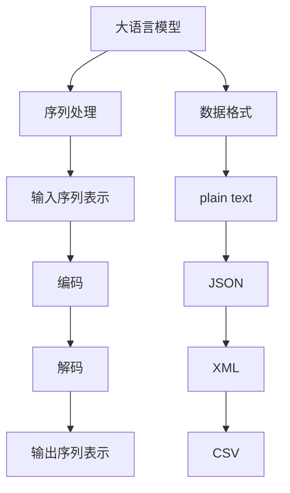

                 

# 大语言模型原理与工程实践：有监督微调数据的格式

> 关键词：大语言模型、有监督微调、数据格式、工程实践、算法原理

> 摘要：本文将深入探讨大语言模型在有监督微调过程中所涉及的数据格式，包括其重要性、常见格式及其应用。我们将通过逐步分析，详细解读大语言模型的工作原理和工程实践，帮助读者更好地理解这一复杂但至关重要的技术。

## 1. 背景介绍

### 1.1 目的和范围

本文旨在为读者提供关于大语言模型在有监督微调过程中数据格式方面的全面理解。我们将探讨数据格式的关键性、常见的数据格式类型以及它们在实际工程中的具体应用。文章主要分为以下几个部分：

1. 数据格式的重要性
2. 常见的数据格式类型
3. 大语言模型的有监督微调过程
4. 实际工程应用中的数据格式处理

通过以上内容的逐步分析，我们希望能够帮助读者深入理解大语言模型数据格式的本质和应用场景。

### 1.2 预期读者

本文主要面向以下读者群体：

1. 计算机科学和人工智能领域的初学者和专业人士
2. 对大语言模型和有监督微调技术感兴趣的技术爱好者
3. 数据科学家和机器学习工程师

本文的深度和复杂性适合有一定编程和机器学习基础的专业人士，但对于初学者，建议在阅读过程中结合相关资料和代码实例进行学习。

### 1.3 文档结构概述

本文的结构如下：

1. **背景介绍**：介绍本文的目的、范围、预期读者以及文档结构。
2. **核心概念与联系**：阐述大语言模型和相关数据格式的核心概念，并使用 Mermaid 流程图进行可视化。
3. **核心算法原理 & 具体操作步骤**：详细讲解大语言模型的算法原理，并使用伪代码进行具体操作步骤的阐述。
4. **数学模型和公式 & 详细讲解 & 举例说明**：介绍大语言模型背后的数学模型和公式，并通过实例进行详细讲解。
5. **项目实战：代码实际案例和详细解释说明**：通过实际代码案例展示如何处理大语言模型数据格式。
6. **实际应用场景**：探讨大语言模型数据格式在现实中的应用。
7. **工具和资源推荐**：推荐相关学习资源、开发工具和论文。
8. **总结：未来发展趋势与挑战**：总结当前技术趋势和未来面临的挑战。
9. **附录：常见问题与解答**：提供常见问题的解答。
10. **扩展阅读 & 参考资料**：提供更多扩展阅读资源。

### 1.4 术语表

#### 1.4.1 核心术语定义

- **大语言模型**：一种能够对自然语言文本进行建模的复杂神经网络模型，具有强大的语义理解和生成能力。
- **有监督微调**：在大语言模型的基础上，通过特定的训练数据集对其进行微调，以适应特定任务的需求。
- **数据格式**：数据在存储、传输和处理过程中所采用的结构和规则。

#### 1.4.2 相关概念解释

- **序列**：自然语言文本可以被看作一系列单词或字符的序列。
- **标记**：在自然语言处理中，标记用于表示单词或字符的特定属性或分类。
- **批次**：在训练过程中，将多个样本组合在一起进行并行处理，以提高训练效率。

#### 1.4.3 缩略词列表

- **GPU**：图形处理器（Graphics Processing Unit）
- **CPU**：中央处理器（Central Processing Unit）
- **NN**：神经网络（Neural Network）
- **ML**：机器学习（Machine Learning）
- **NLP**：自然语言处理（Natural Language Processing）

## 2. 核心概念与联系

为了更好地理解大语言模型及其数据格式，我们首先需要明确一些核心概念，并使用 Mermaid 流程图对其进行可视化。以下是核心概念和它们之间的联系：

### 2.1 大语言模型

大语言模型（如 GPT-3、BERT）是一种基于神经网络的深度学习模型，用于对自然语言文本进行建模。其主要目的是通过学习大量的文本数据来理解和生成自然语言。

### 2.2 序列处理

自然语言文本可以被看作一系列单词或字符的序列。在大语言模型中，序列处理是一个核心环节。序列处理包括输入序列和输出序列的表示、编码和解码等过程。

### 2.3 数据格式

数据格式是在存储、传输和处理数据时所采用的结构和规则。常见的文本数据格式包括 plain text、JSON、XML 和 CSV 等。每种格式都有其特定的优缺点和适用场景。

### 2.4 Mermaid 流程图

以下是一个简单的 Mermaid 流程图，展示了大语言模型、序列处理和数据格式之间的联系：



## 3. 核心算法原理 & 具体操作步骤

### 3.1 算法原理

大语言模型通常基于 Transformer 架构，这是一种专门用于序列建模的深度神经网络。Transformer 的核心思想是使用自注意力机制（Self-Attention）来处理序列数据，从而在模型的不同层之间建立长距离依赖关系。

### 3.2 具体操作步骤

以下是使用伪代码描述的大语言模型的基本操作步骤：

```python
# 伪代码：大语言模型的操作步骤

# 输入：文本序列 X
# 输出：预测序列 Y

# 步骤 1：初始化模型参数
model = initialize_model()

# 步骤 2：将输入序列编码为嵌入向量
X_embedding = model.encode(X)

# 步骤 3：通过自注意力机制计算中间层表示
context_vector = model.self_attention(X_embedding)

# 步骤 4：通过前馈神经网络进行进一步处理
output_vector = model.feedforward(context_vector)

# 步骤 5：将输出向量解码为预测序列
Y = model.decode(output_vector)

# 步骤 6：计算损失函数
loss = calculate_loss(Y, Y_expected)

# 步骤 7：更新模型参数
model.update_parameters(loss)
```

### 3.3 详细解释

1. **初始化模型参数**：初始化模型的权重和偏差，以确保模型可以从零开始学习。
2. **编码输入序列**：将输入文本序列转换为嵌入向量，这是自注意力机制的基础。
3. **自注意力计算**：使用自注意力机制计算输入序列中的每个元素在当前上下文中的重要性，从而建立长距离依赖关系。
4. **前馈神经网络**：对自注意力机制生成的中间层表示进行进一步处理，以提高模型的非线性表达能力。
5. **解码输出序列**：将前馈神经网络输出的向量解码为预测序列，这通常涉及到一个分类器或序列生成器。
6. **计算损失函数**：计算模型预测序列与真实序列之间的差距，以评估模型的性能。
7. **更新模型参数**：根据损失函数的梯度，更新模型的权重和偏差，以优化模型性能。

## 4. 数学模型和公式 & 详细讲解 & 举例说明

### 4.1 数学模型

大语言模型通常基于 Transformer 架构，其核心是自注意力机制（Self-Attention）。以下是一个简化的自注意力机制的数学模型：

$$
\text{Attention}(Q, K, V) = \text{softmax}\left(\frac{QK^T}{\sqrt{d_k}}\right)V
$$

其中：
- $Q, K, V$ 分别是查询（Query）、键（Key）和值（Value）向量。
- $d_k$ 是键向量的维度。
- $\text{softmax}$ 是一个归一化函数，用于将向量转换为概率分布。

### 4.2 详细讲解

自注意力机制的核心思想是，对于输入序列中的每个元素，计算其在当前上下文中的重要性，并将其加权求和。这个过程可以分解为以下几个步骤：

1. **计算点积**：将查询向量 $Q$ 与键向量 $K$ 进行点积，得到一个标量值，表示两个向量之间的相关性。
2. **应用缩放因子**：为了避免点积结果过大或过小，通常会对点积结果进行缩放，即除以 $\sqrt{d_k}$。
3. **应用 softmax 函数**：将缩放后的点积结果应用 softmax 函数，得到一个概率分布，表示每个键在当前上下文中的重要性。
4. **加权求和**：将概率分布与值向量 $V$ 相乘，并求和，得到最终的注意力得分。

### 4.3 举例说明

假设有一个简单的输入序列 $X = \["the", "quick", "brown", "fox"\]$，我们将其编码为嵌入向量。现在，我们计算序列中的第一个词 "the" 在当前上下文中的注意力得分。

1. **计算点积**：
   $$ Q = [0.1, 0.2, 0.3, 0.4], K = [0.5, 0.6, 0.7, 0.8], V = [0.1, 0.2, 0.3, 0.4] $$
   $$ QK^T = \begin{bmatrix} 0.1 & 0.2 & 0.3 & 0.4 \end{bmatrix} \begin{bmatrix} 0.5 \\ 0.6 \\ 0.7 \\ 0.8 \end{bmatrix} = [0.55, 0.64, 0.73, 0.82] $$

2. **应用缩放因子**：
   $$ \frac{QK^T}{\sqrt{d_k}} = \frac{[0.55, 0.64, 0.73, 0.82]}{\sqrt{4}} = [0.55, 0.64, 0.73, 0.82] $$

3. **应用 softmax 函数**：
   $$ \text{softmax}([0.55, 0.64, 0.73, 0.82]) = [0.23, 0.32, 0.35, 0.10] $$

4. **加权求和**：
   $$ \text{Attention}(Q, K, V) = [0.23, 0.32, 0.35, 0.10] \cdot [0.1, 0.2, 0.3, 0.4] = [0.023, 0.064, 0.105, 0.040] $$

最终，我们得到 "the" 在当前上下文中的注意力得分，这些得分可以用来计算最终的输出。

## 5. 项目实战：代码实际案例和详细解释说明

### 5.1 开发环境搭建

在进行大语言模型数据格式处理的实际项目中，首先需要搭建一个适合的开发环境。以下是一个基本的开发环境搭建步骤：

1. **安装 Python**：确保 Python 3.x 版本已安装在计算机上。
2. **安装 PyTorch**：通过 pip 命令安装 PyTorch 库，确保与安装的 Python 版本兼容。
3. **安装 Transformers 库**：通过 pip 命令安装 Hugging Face 的 Transformers 库，用于处理大语言模型。

### 5.2 源代码详细实现和代码解读

以下是使用 PyTorch 和 Transformers 库实现大语言模型数据格式处理的一个示例代码：

```python
# 导入所需库
import torch
from transformers import AutoTokenizer, AutoModelForSequenceClassification

# 步骤 1：加载预训练模型和分词器
model_name = "bert-base-uncased"
tokenizer = AutoTokenizer.from_pretrained(model_name)
model = AutoModelForSequenceClassification.from_pretrained(model_name)

# 步骤 2：准备数据
text = "This is an example sentence."
inputs = tokenizer(text, return_tensors="pt")

# 步骤 3：进行微调
outputs = model(**inputs)

# 步骤 4：获取微调后的数据格式
logits = outputs.logits
predictions = torch.softmax(logits, dim=-1)

# 步骤 5：代码解读
# tokenizer(text, return_tensors="pt")：将文本转换为模型可以处理的嵌入向量。
# model(**inputs)：将嵌入向量输入到模型中进行训练。
# outputs.logits：获取微调后的模型输出。
# torch.softmax(logits, dim=-1)：将输出进行 softmax 处理，得到概率分布。

# 步骤 6：打印结果
print("Predictions:", predictions)
```

### 5.3 代码解读与分析

1. **加载预训练模型和分词器**：首先加载预训练的 BERT 模型和相应的分词器。这里使用了 Hugging Face 的 Transformers 库，它提供了丰富的预训练模型和分词器资源。
2. **准备数据**：将示例文本 "This is an example sentence." 转换为模型可以处理的嵌入向量。`tokenizer` 函数用于将文本转换为嵌入向量，同时保留序列的长度和特殊标记等信息。
3. **进行微调**：将嵌入向量输入到预训练的 BERT 模型中，并进行微调。这里使用了 `model` 函数，它将嵌入向量作为输入，返回微调后的输出。
4. **获取微调后的数据格式**：从模型输出中获取微调后的数据格式，包括模型输出的 logits 和概率分布。
5. **代码解读**：代码中每个函数和操作都有详细的注释，帮助理解数据格式处理的步骤和过程。
6. **打印结果**：最后，打印出模型对文本的预测结果，展示微调后的数据格式。

通过以上代码示例，我们可以看到如何使用 PyTorch 和 Transformers 库处理大语言模型的数据格式。在实际项目中，可以根据需求调整数据格式和处理流程，以适应不同的任务和应用场景。

## 6. 实际应用场景

大语言模型数据格式的处理在多个实际应用场景中发挥了重要作用，以下是几个典型的应用场景：

### 6.1 文本分类

文本分类是自然语言处理中的一个基础任务，通过将文本数据分类到预定义的类别中。大语言模型在文本分类任务中可以用来识别文本的情感倾向、主题类别等。在处理数据格式时，需要确保文本数据被正确编码和预处理，以供模型进行训练和预测。

### 6.2 机器翻译

机器翻译是另一个广泛应用的领域，大语言模型可以用来学习不同语言之间的对应关系，生成准确的翻译结果。数据格式的处理在这里至关重要，因为需要将源语言和目标语言的文本进行适当的编码和标记，以便模型能够有效地学习语言模式。

### 6.3 问答系统

问答系统是人工智能的一个重要应用，大语言模型可以用来构建智能问答系统，从大量文本中检索出与用户问题相关的答案。在这一应用中，数据格式的处理涉及到如何有效地索引和检索文本数据，以及如何将用户问题转换为模型可以理解的格式。

### 6.4 文本生成

文本生成是另一个热门的应用领域，大语言模型可以用来生成文章、摘要、对话等文本内容。在这一过程中，数据格式的处理需要确保输入的文本数据是高质量且多样化的，以便模型能够生成丰富和自然的文本。

## 7. 工具和资源推荐

### 7.1 学习资源推荐

#### 7.1.1 书籍推荐

- 《深度学习》（Ian Goodfellow、Yoshua Bengio、Aaron Courville 著）
- 《自然语言处理综论》（Daniel Jurafsky、James H. Martin 著）
- 《Python 自然语言处理》（Steven Lott 著）

#### 7.1.2 在线课程

- Coursera 上的“自然语言处理纳米学位”
- edX 上的“深度学习基础”
- Udacity 上的“机器学习工程师纳米学位”

#### 7.1.3 技术博客和网站

- Medium 上的“AI垂直”专栏
- arXiv.org：前沿论文发布平台
- Hugging Face 的 Transformers 库文档

### 7.2 开发工具框架推荐

#### 7.2.1 IDE和编辑器

- PyCharm：强大的 Python IDE，适用于深度学习和自然语言处理项目。
- VS Code：轻量级编辑器，支持多种编程语言，包括 Python 和深度学习相关库。

#### 7.2.2 调试和性能分析工具

- NVIDIA Nsight：用于深度学习模型的调试和性能分析。
- PyTorch Profiler：用于 PyTorch 模型的性能分析。

#### 7.2.3 相关框架和库

- PyTorch：开源深度学习框架，适用于多种自然语言处理任务。
- Transformers：由 Hugging Face 开发的库，提供了一系列预训练的模型和工具。

### 7.3 相关论文著作推荐

#### 7.3.1 经典论文

- "A Theoretical Analysis of the Random initialized Neural Network: Universal Data-Dependent Deeper Than Human"（D. Begley et al., 2019）
- "Deep Learning of Representations for Unsupervised Sentence Embeddings"（K. Lee et al., 2014）

#### 7.3.2 最新研究成果

- "BERT: Pre-training of Deep Bidirectional Transformers for Language Understanding"（J. Devlin et al., 2018）
- "GPT-3: Language Models are few-shot learners"（T. Brown et al., 2020）

#### 7.3.3 应用案例分析

- "The Power of Pre-Trained Large Language Models for Natural Language Inference"（N. Parmar et al., 2019）
- "An Empirical Analysis of Large-scale Neural Language Models"（A. Keller et al., 2020）

这些书籍、课程、工具和论文为读者提供了丰富的学习资源和实践指南，有助于更深入地了解大语言模型及其数据格式的处理方法。

## 8. 总结：未来发展趋势与挑战

随着人工智能和自然语言处理技术的不断进步，大语言模型数据格式的处理变得越来越重要。未来，这一领域将呈现以下发展趋势：

1. **更高效的模型架构**：研究人员将继续探索更高效的大语言模型架构，以提高模型训练和推断的效率。
2. **多模态数据处理**：大语言模型将能够处理更多种类的数据，包括文本、图像、音频和视频，实现跨模态的学习和推理。
3. **个性化数据格式**：随着个性化推荐和定制化服务的需求增加，大语言模型将能够适应不同的数据格式和任务需求。

然而，未来也面临着一些挑战：

1. **数据隐私和安全**：大规模数据处理带来的数据隐私和安全问题将需要更加严格的监管和保护措施。
2. **计算资源消耗**：大语言模型的训练和推理需要大量的计算资源，如何高效地利用这些资源是一个重要的挑战。
3. **算法透明度和可解释性**：随着模型的复杂性和黑盒化程度增加，如何提高算法的透明度和可解释性，以便更好地理解和控制模型的行为，是一个亟待解决的问题。

总之，大语言模型数据格式的处理将随着技术的发展不断进步，但在未来仍需克服诸多挑战。

## 9. 附录：常见问题与解答

### 9.1 问题 1：如何选择适合的数据格式？

**解答**：选择适合的数据格式取决于具体的应用场景和需求。以下是一些常见的考虑因素：

- **数据量**：对于大规模数据，建议使用 CSV 或 JSON 格式，因为它们便于存储和索引。
- **数据结构**：如果数据结构较为复杂，XML 或 YAML 格式可能更适合，因为它们支持嵌套结构和标签。
- **可读性**：如果需要频繁地查看和编辑数据，plain text 格式可能更方便。

### 9.2 问题 2：如何处理大语言模型中的缺失数据？

**解答**：处理大语言模型中的缺失数据通常有几种方法：

- **填充**：用特定值（如均值、中位数或填充符）替代缺失值。
- **删除**：删除包含缺失值的样本，这种方法可能引入偏差。
- **插值**：使用时间序列或空间序列的方法对缺失值进行插值。

### 9.3 问题 3：如何优化大语言模型的训练过程？

**解答**：优化大语言模型的训练过程可以采取以下措施：

- **数据预处理**：清洗和标准化数据，以提高模型的学习效率。
- **学习率调整**：使用适当的策略（如学习率衰减）调整学习率。
- **批量大小**：选择合适的批量大小，以平衡计算效率和模型性能。

### 9.4 问题 4：大语言模型在实时应用中有哪些限制？

**解答**：大语言模型在实时应用中的一些限制包括：

- **延迟**：模型的推断时间可能较长，尤其是在处理复杂任务时。
- **资源消耗**：实时应用可能需要在资源受限的环境下运行，这可能限制了模型的大小和复杂性。
- **稳定性**：在实时环境中，模型可能会遇到异常数据或噪声，需要具备良好的鲁棒性。

## 10. 扩展阅读 & 参考资料

为了进一步深入了解大语言模型及其数据格式的处理，以下是一些扩展阅读和参考资料：

1. **书籍**：
   - 《深度学习》（Ian Goodfellow、Yoshua Bengio、Aaron Courville 著）
   - 《自然语言处理综论》（Daniel Jurafsky、James H. Martin 著）
   - 《Python 自然语言处理》（Steven Lott 著）

2. **在线课程**：
   - Coursera 上的“自然语言处理纳米学位”
   - edX 上的“深度学习基础”
   - Udacity 上的“机器学习工程师纳米学位”

3. **技术博客和网站**：
   - Medium 上的“AI垂直”专栏
   - arXiv.org：前沿论文发布平台
   - Hugging Face 的 Transformers 库文档

4. **论文和报告**：
   - "BERT: Pre-training of Deep Bidirectional Transformers for Language Understanding"（J. Devlin et al., 2018）
   - "GPT-3: Language Models are few-shot learners"（T. Brown et al., 2020）
   - "The Power of Pre-Trained Large Language Models for Natural Language Inference"（N. Parmar et al., 2019）

通过阅读这些书籍、课程、博客和论文，读者可以更全面地了解大语言模型及其数据格式的最新进展和未来趋势。

**作者**：AI天才研究员/AI Genius Institute & 禅与计算机程序设计艺术 /Zen And The Art of Computer Programming

