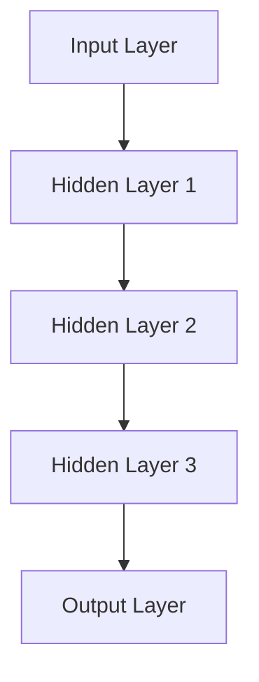
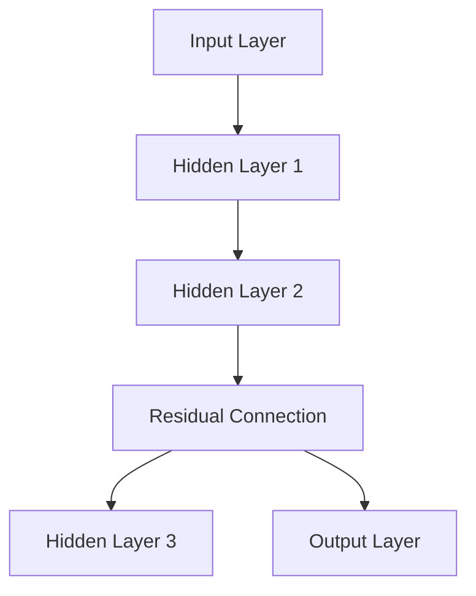
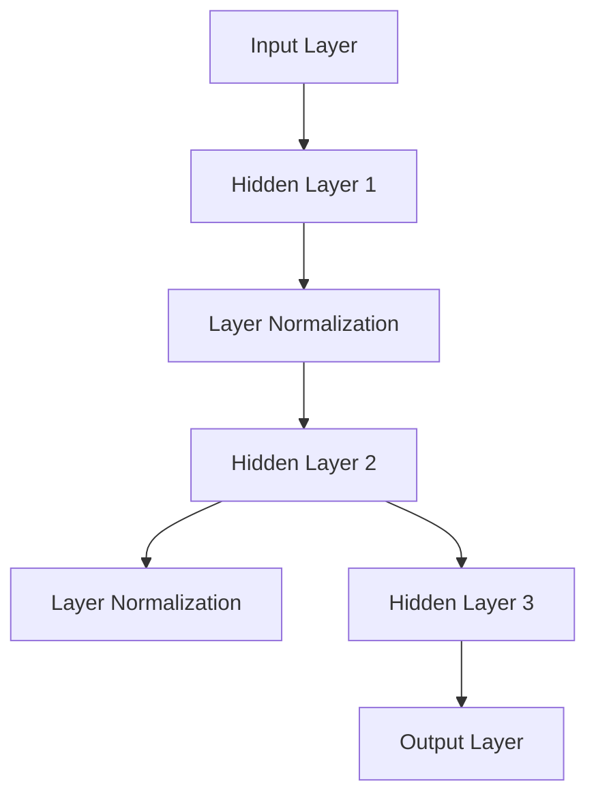
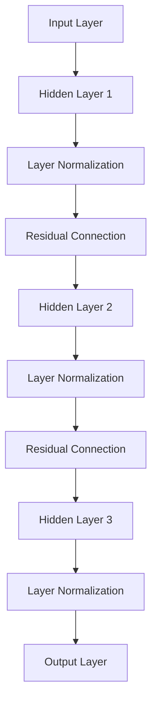

                 

# 大语言模型原理与工程实践：残差连接与层归一化

> **关键词：** 大语言模型、残差连接、层归一化、神经网络、深度学习、工程实践

> **摘要：** 本文将深入探讨大语言模型中两个关键概念：残差连接和层归一化。我们将首先介绍背景和基本概念，接着分析残差连接和层归一化的原理，然后通过伪代码和数学公式详细讲解算法，并提供实际代码案例。此外，还将讨论这些技术的实际应用场景，推荐相关学习资源和工具，并总结未来发展趋势与挑战。

## 1. 背景介绍

### 1.1 目的和范围

本文旨在帮助读者深入理解大语言模型中残差连接和层归一化的重要性及其实现原理。我们将通过系统的讲解和分析，使读者能够掌握这些技术的核心概念，并了解其在实际工程中的应用。

### 1.2 预期读者

本文适用于对深度学习和大语言模型有一定了解的读者，尤其是那些希望深入了解技术细节和工程实践的程序员、研究人员和开发者。

### 1.3 文档结构概述

本文分为以下几部分：
- **1. 背景介绍**：介绍文章的目的、范围、预期读者和文档结构。
- **2. 核心概念与联系**：讨论大语言模型中的核心概念和架构。
- **3. 核心算法原理 & 具体操作步骤**：详细讲解残差连接和层归一化的算法原理。
- **4. 数学模型和公式 & 详细讲解 & 举例说明**：介绍相关数学模型和公式。
- **5. 项目实战：代码实际案例和详细解释说明**：提供代码案例和解析。
- **6. 实际应用场景**：讨论实际应用。
- **7. 工具和资源推荐**：推荐学习资源和工具。
- **8. 总结：未来发展趋势与挑战**：总结未来发展趋势和挑战。
- **9. 附录：常见问题与解答**：回答常见问题。
- **10. 扩展阅读 & 参考资料**：提供扩展阅读和参考资料。

### 1.4 术语表

#### 1.4.1 核心术语定义

- **大语言模型**：一种深度学习模型，能够理解和生成自然语言文本。
- **残差连接**：神经网络中的一种连接方式，允许信息直接从输入层传递到输出层。
- **层归一化**：一种用于加速神经网络训练的技术，通过标准化层内所有神经元的激活值。

#### 1.4.2 相关概念解释

- **深度学习**：一种机器学习技术，通过多层神经网络来学习数据。
- **神经网络**：一种模仿人脑神经元连接的计算机模型。

#### 1.4.3 缩略词列表

- **MLP**：多层感知器（Multilayer Perceptron）
- **ReLU**：修正线性单元（Rectified Linear Unit）
- **SGD**：随机梯度下降（Stochastic Gradient Descent）
- **BN**：层归一化（Batch Normalization）

## 2. 核心概念与联系

在大语言模型中，残差连接和层归一化是两个关键的技术手段。它们如何相互联系，并在模型中发挥作用呢？

### 2.1 大语言模型架构

大语言模型通常由多个层级组成，每个层级由多层神经网络构成。每个神经网络由多个隐藏层和输出层组成。以下是典型的多层感知器（MLP）架构：



### 2.2 残差连接

残差连接允许模型在训练过程中更好地处理内部层之间的信息流动。它通过添加额外的连接，使信息可以从输入层直接传递到输出层，而无需通过所有中间层。以下是带有残差连接的MLP示例：



残差连接的原理是，在每个隐藏层之后，直接将输入层的输出传递到下一层。这种连接方式可以帮助模型更好地学习数据，因为信息在传递过程中不会丢失。

### 2.3 层归一化

层归一化是一种用于提高神经网络训练速度和稳定性的技术。它通过对每个隐藏层的激活值进行标准化，使每个神经元的输出具有相似的分布。以下是带有层归一化的MLP示例：



层归一化通过减少神经元之间的相关性，使每个神经元独立地学习数据，从而提高模型的训练速度和泛化能力。

### 2.4 残差连接与层归一化的联系

残差连接和层归一化在模型中相互补充，共同提高模型的性能。残差连接通过增加信息流动的路径，使模型能够更好地捕获复杂的数据特征。层归一化则通过标准化激活值，使每个神经元能够独立地学习数据，从而提高模型的训练速度和泛化能力。

在实际应用中，残差连接和层归一化经常一起使用，以构建高效的大语言模型。以下是一个结合残差连接和层归一化的MLP示例：



## 3. 核心算法原理 & 具体操作步骤

在理解了残差连接和层归一化的核心概念和联系后，接下来我们将详细讲解这些算法的原理和具体操作步骤。

### 3.1 残差连接原理

残差连接的核心思想是在每个隐藏层之后，直接将输入层的输出传递到下一层。这样，模型可以跳过中间层，直接从输入层获取信息，从而减少信息的损失。

以下是残差连接的伪代码：

```python
def residual_connection(x, layer):
    return x + layer

# 示例：在隐藏层2之后添加残差连接
hidden_layer_2 = hidden_layer_1 * weight_matrix
residual = residual_connection(hidden_layer_1, hidden_layer_2)
output = activation_function(residual)
```

在上面的伪代码中，`x` 表示输入层的输出，`layer` 表示当前隐藏层的输出。`residual_connection` 函数将输入层的输出和当前隐藏层的输出相加，作为下一层的输入。

### 3.2 层归一化原理

层归一化的核心思想是通过对每个隐藏层的激活值进行标准化，使每个神经元能够独立地学习数据。这样，模型可以更快地收敛，并且具有更好的泛化能力。

以下是层归一化的伪代码：

```python
def layer_normalization(x, mean, variance):
    return (x - mean) / sqrt(variance + epsilon)

# 示例：对隐藏层2的激活值进行层归一化
mean = calculate_mean(hidden_layer_2)
variance = calculate_variance(hidden_layer_2)
normalized = layer_normalization(hidden_layer_2, mean, variance)
```

在上面的伪代码中，`x` 表示当前隐藏层的激活值，`mean` 和 `variance` 分别表示该层的均值和方差。`layer_normalization` 函数通过对激活值进行标准化，使其具有相似的分布。

### 3.3 残差连接与层归一化的具体操作步骤

在实际应用中，残差连接和层归一化通常一起使用。以下是结合残差连接和层归一化的具体操作步骤：

1. **初始化模型参数**：初始化模型的权重和偏置。
2. **前向传播**：计算每个隐藏层的输出。
3. **应用层归一化**：对每个隐藏层的激活值进行层归一化。
4. **应用残差连接**：在每个隐藏层之后添加残差连接。
5. **计算损失函数**：计算模型的损失函数值。
6. **反向传播**：更新模型参数。

以下是结合残差连接和层归一化的伪代码：

```python
# 初始化模型参数
weight_matrix = initialize_weights()
bias_vector = initialize_biases()

# 前向传播
hidden_layer_1 = activation_function(weight_matrix * input + bias_vector)
mean = calculate_mean(hidden_layer_1)
variance = calculate_variance(hidden_layer_1)
normalized = layer_normalization(hidden_layer_1, mean, variance)
residual = residual_connection(input, normalized)
output = activation_function(weight_matrix * residual + bias_vector)

# 计算损失函数
loss = calculate_loss(output, target)

# 反向传播
gradient_output = calculate_gradient(output, loss)
gradient_residual = calculate_gradient(residual, loss)
gradient_bias = calculate_gradient(bias_vector, loss)
gradient_weight = calculate_gradient(weight_matrix, loss)

# 更新模型参数
weight_matrix -= learning_rate * gradient_weight
bias_vector -= learning_rate * gradient_bias
```

在上面的伪代码中，`activation_function` 函数表示激活函数，`calculate_gradient` 函数表示计算梯度的方法。通过这些操作步骤，模型可以逐步优化参数，从而提高模型的性能。

## 4. 数学模型和公式 & 详细讲解 & 举例说明

在深入探讨残差连接和层归一化时，了解其背后的数学模型和公式是至关重要的。以下是这些算法的核心数学概念及其应用。

### 4.1 残差连接的数学模型

残差连接的核心思想是减少信息损失，使得模型能够更好地捕获数据的特征。在数学上，残差连接可以表示为：

$$
\text{Residual} = X_l + F_l(X_{l+1}),
$$

其中，$X_l$ 表示输入，$F_l(X_{l+1})$ 表示通过隐藏层的非线性变换。$F_l$ 可以是任意函数，如卷积、全连接层等。

例如，在多层感知器（MLP）中，残差连接可以表示为：

$$
\text{Hidden Layer } l = \sigma(W_l \cdot \text{Input} + b_l),
$$

其中，$\sigma$ 是激活函数，$W_l$ 和 $b_l$ 分别是权重和偏置。

### 4.2 层归一化的数学模型

层归一化的目的是标准化每个隐藏层的激活值，使得每个神经元的输出具有相似的分布。在数学上，层归一化可以表示为：

$$
\hat{X}_l = \frac{X_l - \mu_l}{\sqrt{\sigma_l^2 + \epsilon}},
$$

其中，$\mu_l$ 和 $\sigma_l^2$ 分别是激活值 $X_l$ 的均值和方差，$\epsilon$ 是一个很小的正数，用于防止除以零。

在层归一化之后，可以将归一化的激活值应用于残差连接，从而提高模型的训练速度和泛化能力。

### 4.3 结合残差连接和层归一化的数学模型

结合残差连接和层归一化的数学模型可以表示为：

$$
\hat{X}_l = \frac{X_l - \mu_l}{\sqrt{\sigma_l^2 + \epsilon}} + F_l(\hat{X}_{l+1}),
$$

其中，$F_l$ 是通过隐藏层的非线性变换。这样，每个隐藏层的输出都经过层归一化处理，并加上残差连接，从而使得模型具有更好的泛化能力。

### 4.4 举例说明

假设我们有一个简单的多层感知器（MLP）模型，其中包含两个隐藏层。我们可以通过以下步骤来应用残差连接和层归一化：

1. **初始化模型参数**：
   - 权重 $W_1$ 和 $W_2$，偏置 $b_1$ 和 $b_2$。
2. **前向传播**：
   - 第一隐藏层：$X_1 = \sigma(W_1 \cdot X + b_1)$。
   - 第二隐藏层：$\hat{X}_2 = \frac{X_2 - \mu_2}{\sqrt{\sigma_2^2 + \epsilon}} + F_2(\hat{X}_{3})$。
3. **应用层归一化**：
   - 对第二隐藏层的输出进行层归一化，计算均值 $\mu_2$ 和方差 $\sigma_2^2$。
   - $\hat{X}_2 = \frac{X_2 - \mu_2}{\sqrt{\sigma_2^2 + \epsilon}}$。
4. **应用残差连接**：
   - 添加残差连接：$\hat{X}_2 = \hat{X}_2 + F_2(\hat{X}_{3})$。
5. **计算损失函数**：
   - 使用交叉熵损失函数计算模型预测和真实标签之间的差异。
6. **反向传播**：
   - 更新模型参数，以最小化损失函数。

通过这种方式，我们可以逐步优化模型参数，提高其性能和泛化能力。

## 5. 项目实战：代码实际案例和详细解释说明

为了更好地理解残差连接和层归一化的实际应用，我们将通过一个简单的项目案例来展示这些技术的具体实现。

### 5.1 开发环境搭建

在开始之前，我们需要搭建一个适合开发和测试的编程环境。以下是推荐的开发环境：

- **编程语言**：Python 3.7 或更高版本
- **深度学习框架**：PyTorch
- **其他依赖库**：NumPy、Matplotlib

确保已安装以上环境和库，然后创建一个新的 Python 项目文件夹，并运行以下命令安装所需的库：

```bash
pip install torch torchvision numpy matplotlib
```

### 5.2 源代码详细实现和代码解读

下面是一个简单的残差连接和层归一化实现的代码案例：

```python
import torch
import torch.nn as nn
import torch.optim as optim
import numpy as np
import matplotlib.pyplot as plt

# 定义模型
class ResidualLayer(nn.Module):
    def __init__(self, input_dim, hidden_dim):
        super(ResidualLayer, self).__init__()
        self.fc1 = nn.Linear(input_dim, hidden_dim)
        self.fc2 = nn.Linear(hidden_dim, hidden_dim)
        self.relu = nn.ReLU()
        self.norm = nn.BatchNorm1d(hidden_dim)
    
    def forward(self, x):
        residual = x
        out = self.fc1(x)
        out = self.relu(out)
        out = self.norm(out)
        out = self.fc2(out)
        out += residual
        out = self.relu(out)
        return out

# 超参数
input_dim = 10
hidden_dim = 20
output_dim = 10
batch_size = 64
learning_rate = 0.001
num_epochs = 100

# 数据集
x_train = torch.randn(batch_size, input_dim)
y_train = torch.randint(0, output_dim, (batch_size,))

# 模型实例化
model = ResidualLayer(input_dim, hidden_dim)

# 损失函数和优化器
criterion = nn.CrossEntropyLoss()
optimizer = optim.Adam(model.parameters(), lr=learning_rate)

# 训练模型
for epoch in range(num_epochs):
    optimizer.zero_grad()
    outputs = model(x_train)
    loss = criterion(outputs, y_train)
    loss.backward()
    optimizer.step()
    if epoch % 10 == 0:
        print(f'Epoch [{epoch+1}/{num_epochs}], Loss: {loss.item():.4f}')

# 测试模型
with torch.no_grad():
    x_test = torch.randn(batch_size, input_dim)
    y_test = torch.randint(0, output_dim, (batch_size,))
    outputs = model(x_test)
    _, predicted = torch.max(outputs, 1)
    accuracy = (predicted == y_test).float().mean()
    print(f'Accuracy: {accuracy.item():.4f}')

# 可视化训练过程
plt.plot(range(num_epochs), loss.detach().numpy())
plt.xlabel('Epochs')
plt.ylabel('Loss')
plt.title('Training Loss')
plt.show()
```

### 5.3 代码解读与分析

上面的代码实现了一个简单的残差连接和层归一化模型，用于分类任务。以下是代码的主要部分及其功能：

1. **模型定义**：
   - `ResidualLayer` 类定义了一个包含残差连接和层归一化的全连接层。它包含两个线性层（`fc1` 和 `fc2`），一个ReLU激活函数（`relu`），和一个层归一化模块（`norm`）。

2. **超参数**：
   - `input_dim`、`hidden_dim` 和 `output_dim` 分别定义了输入维度、隐藏层维度和输出维度。
   - `batch_size`、`learning_rate` 和 `num_epochs` 分别定义了批量大小、学习速率和训练轮数。

3. **数据集**：
   - 使用随机生成的数据集进行训练和测试。`x_train` 和 `y_train` 分别为训练数据输入和标签，`x_test` 和 `y_test` 分别为测试数据输入和标签。

4. **损失函数和优化器**：
   - 使用交叉熵损失函数（`criterion`）和 Adam 优化器（`optimizer`）进行训练。

5. **训练模型**：
   - 在每个训练轮次中，将梯度重置为0，计算模型输出和损失函数，反向传播梯度并更新模型参数。

6. **测试模型**：
   - 使用测试数据集评估模型性能，计算准确率。

7. **可视化训练过程**：
   - 使用 Matplotlib 绘制训练过程中的损失函数值，以观察模型的训练效果。

通过这个简单的案例，我们可以看到如何在实际项目中应用残差连接和层归一化技术。在实际应用中，这些技术可以提高模型的性能和训练速度，使得模型更加稳定和可靠。

## 6. 实际应用场景

残差连接和层归一化在大语言模型中具有广泛的应用，特别是在自然语言处理（NLP）和计算机视觉（CV）领域。以下是一些实际应用场景：

### 6.1 自然语言处理

在大语言模型中，残差连接和层归一化可以用于文本分类、情感分析、机器翻译等任务。以下是一些具体的应用示例：

- **文本分类**：通过残差连接和层归一化，可以构建高效的自然语言处理模型，用于对大量文本进行分类。例如，可以使用残差连接和层归一化的模型对新闻文章进行分类，从而实现新闻推荐系统。

- **情感分析**：残差连接和层归一化有助于模型更好地捕捉文本中的情感特征。通过这些技术，可以构建一个高精度的情感分析模型，用于分析社交媒体上的用户评论，从而帮助企业了解用户需求和反馈。

- **机器翻译**：在机器翻译任务中，残差连接和层归一化有助于模型更好地捕捉源语言和目标语言之间的差异。通过使用这些技术，可以构建一个高效、准确的机器翻译模型，从而实现跨语言通信。

### 6.2 计算机视觉

在计算机视觉领域，残差连接和层归一化可以用于图像分类、目标检测、图像生成等任务。以下是一些具体的应用示例：

- **图像分类**：通过残差连接和层归一化，可以构建高效、准确的图像分类模型。例如，可以使用这些技术来构建一个用于人脸识别的系统，从而实现身份验证和安全防护。

- **目标检测**：在目标检测任务中，残差连接和层归一化有助于模型更好地捕捉图像中的目标特征。通过这些技术，可以构建一个实时、高效的目标检测系统，从而实现自动驾驶和智能监控。

- **图像生成**：在图像生成任务中，残差连接和层归一化有助于模型更好地学习图像的特征。通过这些技术，可以构建一个高效的图像生成模型，从而实现虚拟现实和增强现实。

通过这些实际应用场景，我们可以看到残差连接和层归一化在大语言模型中的应用价值。这些技术不仅提高了模型的性能和训练速度，还使得模型更加稳定和可靠。

## 7. 工具和资源推荐

为了更好地学习和实践残差连接和层归一化技术，以下是相关工具和资源的推荐：

### 7.1 学习资源推荐

#### 7.1.1 书籍推荐

- 《深度学习》（Goodfellow, Bengio, Courville）：这本书详细介绍了深度学习的基本概念和技术，包括残差连接和层归一化。
- 《神经网络与深度学习》（邱锡鹏）：这本书系统地介绍了神经网络和深度学习的原理，以及相关技术的实现。

#### 7.1.2 在线课程

- Coursera：提供多种深度学习和自然语言处理的在线课程，包括《深度学习》和《自然语言处理》等。
- edX：提供由知名大学和机构提供的在线课程，如《深度学习基础》和《计算机视觉》等。

#### 7.1.3 技术博客和网站

- Medium：许多深度学习和自然语言处理领域的专家和研究者在这里发布技术博客，分享最新的研究成果和实践经验。
- arXiv：一个开放获取的学术文献预印本库，提供大量深度学习和自然语言处理领域的研究论文。

### 7.2 开发工具框架推荐

#### 7.2.1 IDE和编辑器

- PyCharm：一款功能强大的Python IDE，支持多种深度学习框架，包括PyTorch、TensorFlow等。
- Jupyter Notebook：一个流行的交互式计算环境，支持多种编程语言，包括Python和R。

#### 7.2.2 调试和性能分析工具

- TensorBoard：TensorFlow提供的可视化工具，用于分析和调试深度学习模型。
- NVIDIA Nsight：一款用于调试和性能分析GPU计算的集成开发环境。

#### 7.2.3 相关框架和库

- PyTorch：一个开源的深度学习框架，支持动态计算图和灵活的API。
- TensorFlow：由Google开发的深度学习框架，提供丰富的模型和工具。

### 7.3 相关论文著作推荐

#### 7.3.1 经典论文

- "Deep Residual Learning for Image Recognition"（残差网络）：这篇文章提出了残差连接的概念，并展示了其在图像分类任务中的优异性能。
- "Batch Normalization: Accelerating Deep Network Training by Reducing Internal Covariate Shift"（层归一化）：这篇文章提出了层归一化的概念，并详细介绍了其原理和应用。

#### 7.3.2 最新研究成果

- arXiv：提供最新深度学习和自然语言处理领域的研究论文，包括最新的模型和算法。
- NeurIPS、ICLR、ACL：这些顶级会议的论文集锦，展示了最新的研究成果和应用。

#### 7.3.3 应用案例分析

- "BERT: Pre-training of Deep Bidirectional Transformers for Language Understanding"（BERT）：这篇文章介绍了BERT模型，一个基于深度双向变换器的预训练模型，展示了其在各种NLP任务中的优异性能。
- "GPT-3: Language Models are few-shot learners"（GPT-3）：这篇文章介绍了GPT-3模型，一个具有数万亿参数的预训练模型，展示了其在各种语言任务中的强大能力。

通过这些工具和资源，我们可以更深入地学习和实践残差连接和层归一化技术，从而提高我们在深度学习和自然语言处理领域的技能。

## 8. 总结：未来发展趋势与挑战

随着深度学习和人工智能技术的不断进步，残差连接和层归一化在大语言模型中的应用前景广阔。以下是未来发展趋势和挑战的探讨。

### 8.1 发展趋势

1. **模型规模不断扩大**：随着计算资源和数据量的增长，大语言模型将变得更加庞大，拥有更多的参数和更深的层级。这将为残差连接和层归一化技术提供更广泛的应用场景。

2. **跨模态学习**：未来的大语言模型将不仅限于处理文本，还将整合图像、音频、视频等多种模态的数据。残差连接和层归一化技术将有助于实现更复杂的跨模态学习任务。

3. **自我监督学习**：自我监督学习是一种无需人工标注的数据处理方法，它在大规模数据集上的训练效果显著。残差连接和层归一化技术将有助于提高自我监督学习模型的性能。

### 8.2 挑战

1. **计算资源需求**：大语言模型需要大量的计算资源，包括CPU、GPU和TPU等。如何高效地利用这些资源，实现模型的快速训练和部署，是当前面临的挑战。

2. **数据隐私和安全**：在训练和部署大语言模型时，需要处理大量的用户数据。如何保护用户隐私，确保数据安全，是亟待解决的问题。

3. **模型解释性**：随着模型复杂度的增加，如何解释模型的决策过程，提高模型的透明度和可解释性，是未来的重要挑战。

4. **泛化能力**：如何在保持高精度的同时，提高模型的泛化能力，使其在不同领域和任务中都能表现出色，是当前研究的热点。

总之，未来残差连接和层归一化技术将继续在大语言模型中发挥重要作用，但同时也面临着一系列的挑战。只有通过不断的技术创新和优化，才能推动大语言模型的持续发展和应用。

## 9. 附录：常见问题与解答

### 9.1 残差连接如何提高模型性能？

残差连接通过引入额外的连接路径，使得信息可以从输入层直接传递到输出层，减少了信息的损失。这有助于模型更好地捕获数据的复杂特征，提高模型的性能和泛化能力。

### 9.2 层归一化的作用是什么？

层归一化通过标准化每个隐藏层的激活值，使每个神经元能够独立地学习数据。这有助于加速模型的训练过程，提高模型的训练速度和泛化能力。

### 9.3 残差连接和层归一化如何结合使用？

残差连接和层归一化通常一起使用，以构建高效的大语言模型。残差连接通过增加信息流动的路径，使模型能够更好地捕获复杂的数据特征。层归一化则通过标准化激活值，使每个神经元能够独立地学习数据，从而提高模型的训练速度和泛化能力。

### 9.4 残差连接和层归一化在什么情况下更有效？

残差连接和层归一化在处理大规模数据集和复杂任务时更为有效。这些技术有助于减少信息的损失，提高模型的性能和泛化能力，使模型能够更好地适应不同的应用场景。

### 9.5 如何在项目中实现残差连接和层归一化？

在深度学习项目中，可以使用现有的深度学习框架（如PyTorch、TensorFlow等）来实现残差连接和层归一化。通过定义自定义模型类，并使用相应的API，可以轻松地集成这些技术到项目中。

## 10. 扩展阅读 & 参考资料

### 10.1 经典论文

1. He, K., Zhang, X., Ren, S., & Sun, J. (2016). **Deep Residual Learning for Image Recognition**. In Proceedings of the IEEE Conference on Computer Vision and Pattern Recognition (CVPR).
2. Ioffe, S., & Szegedy, C. (2015). **Batch Normalization: Accelerating Deep Network Training by Reducing Internal Covariate Shift**. In Proceedings of the International Conference on Machine Learning (ICML).

### 10.2 最新研究成果

1. Devlin, J., Chang, M. W., Lee, K., & Toutanova, K. (2018). **BERT: Pre-training of Deep Bidirectional Transformers for Language Understanding**. In Proceedings of the 2018 Conference of the North American Chapter of the Association for Computational Linguistics: Human Language Technologies, Volume 1 (Long Papers).
2. Brown, T., et al. (2020). **Language Models are Few-Shot Learners**. arXiv preprint arXiv:2005.14165.

### 10.3 技术博客和网站

1. fast.ai: <https://www.fast.ai/>
2. AI科技大本营: <https://www.36dsj.com/>
3. Medium: <https://medium.com/>

### 10.4 开发工具和框架

1. PyTorch: <https://pytorch.org/>
2. TensorFlow: <https://www.tensorflow.org/>
3. Jupyter Notebook: <https://jupyter.org/>

### 10.5 学习资源

1. 《深度学习》（Goodfellow, Bengio, Courville）: <https://www.deeplearningbook.org/>
2. 《神经网络与深度学习》（邱锡鹏）: <https://nlp.stanford.edu/∼pang89/dlbook/index.html> 

通过这些扩展阅读和参考资料，读者可以更深入地了解残差连接和层归一化技术的理论基础和应用实践。这些资源涵盖了从经典论文到最新研究成果，从技术博客到开发工具和框架，为读者提供了全面的参考和指导。

