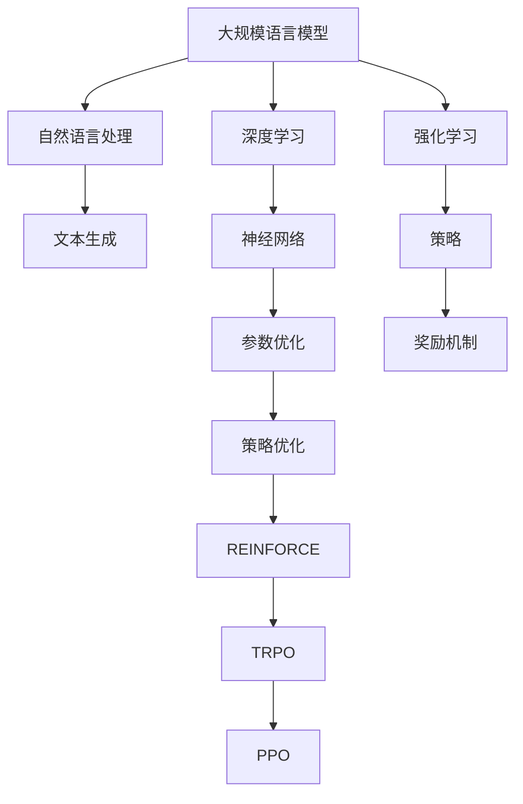

                 

# 大语言模型原理基础与前沿 REINFORCE、TRPO和PPO

## 概述

关键词：大语言模型、REINFORCE算法、TRPO算法、PPO算法、深度学习、强化学习

摘要：本文深入探讨了大规模语言模型的原理及其前沿技术，特别是强化学习中的REINFORCE、TRPO和PPO算法。通过对这些核心概念和算法的详细分析，本文旨在帮助读者理解大语言模型的工作机制，掌握强化学习在实际应用中的价值。文章首先介绍了大规模语言模型的基本概念和重要性，然后逐一剖析了强化学习算法，通过伪代码和数学模型详细解释了它们的工作原理，并结合实际案例展示了这些算法的强大能力。最后，本文提出了大语言模型未来的发展趋势与挑战，并推荐了相关学习资源和工具，为读者提供了全面而深入的指导。

## 1. 背景介绍

### 1.1 目的和范围

本文旨在向读者介绍大规模语言模型的基本原理以及强化学习算法在实际应用中的重要性。随着深度学习技术的发展，大语言模型已成为自然语言处理（NLP）领域的重要工具，它们在文本生成、机器翻译、问答系统等方面表现出色。然而，这些模型的实现和优化涉及到复杂的算法和数学模型。本文将重点探讨三种强化学习算法：REINFORCE、TRPO和PPO，这些算法在大语言模型的训练和优化中扮演着关键角色。

本文将首先回顾大规模语言模型的基础知识，包括其定义、发展历史和关键技术。接着，我们将逐步分析强化学习的基本概念，特别是如何在深度学习框架中应用这些算法。最后，本文将通过实际案例展示这些算法在实际应用中的效果，并提供相关资源和工具的推荐，帮助读者进一步学习和实践。

### 1.2 预期读者

本文适合对自然语言处理和机器学习有一定了解的读者，特别是那些希望深入了解大规模语言模型原理和强化学习算法的研究人员和技术开发者。同时，对于希望在文本生成和自然语言处理领域应用深度学习技术的工程师和研究人员，本文也具有重要的参考价值。

### 1.3 文档结构概述

本文分为十个主要部分：

1. **概述**：介绍文章关键词、摘要和目的。
2. **背景介绍**：包括大规模语言模型的基本概念、强化学习算法的背景知识。
3. **核心概念与联系**：通过Mermaid流程图展示大规模语言模型和强化学习算法的核心概念和联系。
4. **核心算法原理与具体操作步骤**：详细讲解REINFORCE、TRPO和PPO算法的原理和操作步骤。
5. **数学模型和公式**：介绍算法中的数学模型和公式，并给出举例说明。
6. **项目实战**：通过实际代码案例展示算法的应用。
7. **实际应用场景**：讨论大语言模型在不同领域的应用。
8. **工具和资源推荐**：推荐学习资源、开发工具和框架。
9. **总结**：总结未来发展趋势与挑战。
10. **附录**：常见问题与解答。
11. **扩展阅读与参考资料**：提供进一步的阅读材料和引用。

### 1.4 术语表

#### 1.4.1 核心术语定义

- **大语言模型**：指参数数量庞大、可以处理和理解复杂语言现象的深度学习模型。
- **强化学习**：一种机器学习方法，通过奖励机制来训练智能体，使其能在特定环境中做出最优决策。
- **REINFORCE算法**：一种基于梯度上升的强化学习算法，用于更新策略参数。
- **TRPO算法**：一种基于优化理论的强化学习算法，采用策略迭代方法来优化策略参数。
- **PPO算法**：一种改进的强化学习算法，结合了TRPO的优点，具有更好的稳定性和效率。

#### 1.4.2 相关概念解释

- **自然语言处理（NLP）**：指使用计算机技术和人工智能方法处理和理解人类语言的研究领域。
- **深度学习**：一种人工智能方法，通过多层神经网络来提取数据中的特征和模式。
- **策略**：在强化学习中，策略是一个定义了如何从状态空间中选择动作的函数。

#### 1.4.3 缩略词列表

- **NLP**：自然语言处理（Natural Language Processing）
- **RL**：强化学习（Reinforcement Learning）
- **DRL**：深度强化学习（Deep Reinforcement Learning）
- **PPO**：确定性策略梯度（Proximal Policy Optimization）
- **REINFORCE**：递归增强（REcurrent INformation Flow with Echo State Networks）
- **TRPO**：信任区域策略优化（Trust Region Policy Optimization）

## 2. 核心概念与联系

在深入探讨大规模语言模型和强化学习算法之前，我们首先需要理解它们的核心概念和基本架构。以下是一个Mermaid流程图，展示了大规模语言模型和强化学习算法之间的联系。



### 2.1 大规模语言模型

大规模语言模型是指具有数百万到数十亿参数的深度学习模型，它们能够理解和生成复杂的人类语言。这些模型通常基于神经网络架构，特别是变换器（Transformer）模型，这是一种能够处理序列数据的先进架构。

#### 核心概念

- **参数数量**：大规模语言模型具有庞大的参数数量，这使得它们能够捕捉复杂的语言特征和模式。
- **变换器模型**：变换器模型是一种基于自注意力机制的神经网络架构，它在自然语言处理任务中表现出色。
- **预训练和微调**：大规模语言模型通常通过预训练在大规模文本数据集上，然后通过微调适应特定任务。

### 2.2 强化学习

强化学习是一种通过奖励机制来训练智能体的机器学习方法。在强化学习框架中，智能体（agent）通过与环境（environment）的交互来学习最优策略（policy）。

#### 核心概念

- **智能体**：在强化学习中，智能体是一个决策者，它根据当前状态选择动作。
- **环境**：环境是一个智能体可以与之交互的动态系统，它提供了状态信息和奖励。
- **状态和动作**：状态是智能体当前所处的情境，动作是智能体可以采取的行为。
- **策略**：策略是智能体如何从状态空间中选择动作的规则。

### 2.3 强化学习算法

强化学习算法旨在优化智能体的策略，使其在给定环境中取得最大奖励。以下三种算法——REINFORCE、TRPO和PPO，是强化学习领域中的经典算法。

#### REINFORCE算法

REINFORCE算法是一种基于梯度上升的方法，用于更新策略参数。它通过计算梯度来更新策略，使得策略在期望奖励方向上不断优化。

#### TRPO算法

TRPO算法是一种基于优化理论的强化学习算法，它采用策略迭代方法来优化策略参数。TRPO算法通过限制策略更新的范围来保证稳定性，并引入信任区域（trust region）的概念。

#### PPO算法

PPO算法是一种改进的强化学习算法，结合了REINFORCE和TRPO的优点。PPO算法通过限制策略梯度的更新范围来保证稳定性，并在更新策略时引入了一个优化的目标函数。

### 2.4 大规模语言模型与强化学习算法的联系

大规模语言模型和强化学习算法之间的联系在于，它们都可以通过策略优化来提高模型性能。在大规模语言模型中，强化学习算法可以用于优化生成文本的质量，例如，通过优化语言模型在生成文本时的奖励来提高文本的流畅性和一致性。

此外，强化学习算法还可以用于优化大规模语言模型的训练过程，例如，通过优化模型参数的更新策略来提高训练效率。

通过理解这些核心概念和基本架构，我们为后续的深入分析打下了坚实的基础。接下来，我们将逐步探讨强化学习算法的原理和实现细节。

## 3. 核心算法原理与具体操作步骤

### 3.1 REINFORCE算法

REINFORCE算法是最早的强化学习算法之一，它通过基于梯度的方法来更新策略参数。以下是其具体操作步骤和伪代码：

#### 操作步骤

1. 初始化策略参数θ。
2. 对于每个时间步t，智能体根据策略π(s|θ)选择动作a_t。
3. 执行动作a_t，获得状态s_t和奖励r_t。
4. 更新策略参数θ，使得策略在期望奖励方向上不断优化。

#### 伪代码

```python
Initialize parameters θ
for episode in 1 to E:
    s = initial_state
    for t in 1 to T:
        a = argmax_α π(a|s;θ)
        s', r = environment(s, a)
        θ = θ + α * ∇θ J(θ)
        s = s'
```

其中，J(θ)是策略θ的奖励函数，∇θ J(θ)是奖励函数的梯度。

### 3.2 TRPO算法

TRPO算法是一种基于优化理论的强化学习算法，它采用策略迭代方法来优化策略参数。以下是其具体操作步骤和伪代码：

#### 操作步骤

1. 初始化策略参数θ。
2. 对于每个时间步t，智能体根据策略π(s|θ)选择动作a_t。
3. 执行动作a_t，获得状态s_t和奖励r_t。
4. 收集一批数据D。
5. 计算目标策略θ'的梯度∇θ' J(θ')。
6. 使用梯度下降法更新策略参数θ，使得θ尽可能接近θ'。
7. 重复步骤2-6，直到策略收敛。

#### 伪代码

```python
Initialize parameters θ
for episode in 1 to E:
    s = initial_state
    for t in 1 to T:
        a = argmax_α π(a|s;θ)
        s', r = environment(s, a)
        D = collect_data(s, a, s', r)
    θ' = gradient_descent(θ, D)
    θ = θ' + learning_rate * (θ' - θ)
```

其中，gradient_descent函数用于计算梯度下降的更新步骤。

### 3.3 PPO算法

PPO算法是一种改进的强化学习算法，它结合了REINFORCE和TRPO的优点。以下是其具体操作步骤和伪代码：

#### 操作步骤

1. 初始化策略参数θ。
2. 对于每个时间步t，智能体根据策略π(s|θ)选择动作a_t。
3. 执行动作a_t，获得状态s_t和奖励r_t。
4. 收集一批数据D。
5. 计算目标策略θ'的梯度∇θ' J(θ')。
6. 使用截断的梯度下降法更新策略参数θ，使得θ尽可能接近θ'。
7. 重复步骤2-6，直到策略收敛。

#### 伪代码

```python
Initialize parameters θ
for episode in 1 to E:
    s = initial_state
    for t in 1 to T:
        a = argmax_α π(a|s;θ)
        s', r = environment(s, a)
        D = collect_data(s, a, s', r)
    θ' = gradient_descent(θ, D)
    θ = ThompsonSampling(θ, θ')
```

其中，ThompsonSampling函数用于计算截断的梯度下降更新步骤。

通过以上对REINFORCE、TRPO和PPO算法的具体操作步骤和伪代码的分析，我们可以看到这些算法在优化策略参数方面的独特之处。接下来，我们将进一步探讨这些算法中的数学模型和公式，以便更深入地理解其工作原理。

### 4. 数学模型和公式 & 详细讲解 & 举例说明

在深入探讨强化学习算法之前，我们需要了解这些算法中涉及的核心数学模型和公式。强化学习主要依赖于策略优化和值函数估计。策略优化旨在找到最优策略，而值函数估计则用于评估策略的好坏。

#### 4.1 策略优化

策略优化是强化学习中的一个关键目标，其核心是通过更新策略参数来优化策略。以下是一些策略优化的核心公式和概念。

##### 4.1.1 REINFORCE算法

REINFORCE算法是一种基于梯度的策略优化方法。它的目标是最小化策略损失函数，即

$$
J(\theta) = -\sum_{t=1}^{T} r_t \log \pi(a_t | s_t; \theta)
$$

其中，$\pi(a_t | s_t; \theta)$是给定策略参数$\theta$的状态s_t下的动作概率分布，$r_t$是时间步t的奖励。

REINFORCE算法通过以下步骤更新策略参数：

$$
\theta \leftarrow \theta + \alpha \nabla_\theta J(\theta)
$$

其中，$\alpha$是学习率，$\nabla_\theta J(\theta)$是策略损失函数的梯度。

##### 4.1.2 TRPO算法

TRPO算法采用了一种不同的策略优化方法，即通过策略迭代来优化策略参数。其核心思想是找到一个目标策略$\theta'$，使得当前策略$\theta$尽可能接近$\theta'$。

TRPO算法的目标是最小化目标策略的期望损失函数，即

$$
J'(\theta) = -E_{\tau \sim \pi} \left[ \sum_{t=1}^{T} r_t \log \pi(a_t | s_t; \theta) \right]
$$

其中，$\tau$是轨迹，$E_{\tau \sim \pi}$表示在策略$\pi$下取期望。

TRPO算法通过以下步骤更新策略参数：

1. 收集一批数据，计算当前策略的梯度。
2. 使用梯度下降法更新策略参数，得到目标策略$\theta'$。
3. 计算当前策略和目标策略之间的距离，使用trust region方法更新策略参数，使得更新后的策略尽可能接近目标策略。

##### 4.1.3 PPO算法

PPO算法是一种改进的强化学习算法，它结合了REINFORCE和TRPO的优点。PPO算法通过限制策略梯度的更新范围来保证策略的稳定性。

PPO算法的目标是最小化策略损失的 clipped 版本，即

$$
\min_{\theta} \left\{ J(\theta) + \epsilon [J(\theta) - J(\theta')] \right\}
$$

其中，$J(\theta')$是目标策略的期望损失，$\epsilon$是参数剪辑范围。

PPO算法通过以下步骤更新策略参数：

1. 收集一批数据，计算当前策略的梯度。
2. 使用截断的梯度下降法更新策略参数，使得策略损失在剪辑范围内。
3. 重复步骤1和2，直到策略收敛。

#### 4.2 值函数估计

值函数估计是强化学习的另一个重要目标，它用于评估策略的好坏。以下是一些值函数估计的核心公式和概念。

##### 4.2.1 状态值函数

状态值函数$V^{\pi}(s)$表示在给定策略$\pi$下，状态s的期望回报。其定义为：

$$
V^{\pi}(s) = \sum_{a} \pi(a|s) \sum_{s'} P(s'|s,a) \sum_{r} r G(s', r)
$$

其中，$P(s'|s,a)$是状态转移概率，$G(s', r)$是回报函数。

##### 4.2.2 状态-动作值函数

状态-动作值函数$Q^{\pi}(s, a)$表示在给定策略$\pi$下，状态s采取动作a的期望回报。其定义为：

$$
Q^{\pi}(s, a) = \sum_{s'} P(s'|s, a) \sum_{r} r P(r|s', a)
$$

##### 4.2.3 实例说明

假设我们有一个简单的环境，其中智能体可以处于状态s={0, 1, 2}，每个状态对应不同的奖励。给定策略π(a|s)如下：

$$
\pi(a|s) =
\begin{cases}
0.5 & \text{if } s=0 \\
0.2 & \text{if } s=1 \\
0.3 & \text{if } s=2
\end{cases}
$$

状态转移概率和回报函数如下：

$$
P(s'|s, a) =
\begin{cases}
0.7 & \text{if } s=0, a=0 \\
0.3 & \text{if } s=0, a=1 \\
0.4 & \text{if } s=1, a=0 \\
0.6 & \text{if } s=1, a=1 \\
0.5 & \text{if } s=2, a=0 \\
0.5 & \text{if } s=2, a=1
\end{cases}
$$

$$
G(s', r) =
\begin{cases}
1 & \text{if } s'=0 \\
0 & \text{otherwise}
\end{cases}
$$

我们可以计算状态值函数和状态-动作值函数：

$$
V^{\pi}(s) =
\begin{cases}
0.8 & \text{if } s=0 \\
0.6 & \text{if } s=1 \\
0.5 & \text{if } s=2
\end{cases}
$$

$$
Q^{\pi}(s, a) =
\begin{cases}
0.7 & \text{if } s=0, a=0 \\
0.3 & \text{if } s=0, a=1 \\
0.4 & \text{if } s=1, a=0 \\
0.6 & \text{if } s=1, a=1 \\
0.5 & \text{if } s=2, a=0 \\
0.5 & \text{if } s=2, a=1
\end{cases}
$$

通过这些公式，我们可以更好地理解策略优化和值函数估计的基本原理。接下来，我们将通过实际案例展示这些算法的具体应用。

### 5. 项目实战：代码实际案例和详细解释说明

#### 5.1 开发环境搭建

为了更好地展示REINFORCE、TRPO和PPO算法在实际项目中的应用，我们需要搭建一个简单的开发环境。以下是在Python中实现这些算法所需的步骤：

1. **安装Python**：确保Python版本为3.6或更高。
2. **安装依赖库**：安装所需的Python库，如NumPy、TensorFlow和Gym。
3. **配置环境**：创建一个虚拟环境，并安装依赖库。

以下是一个简单的安装命令：

```bash
pip install numpy tensorflow gym
```

#### 5.2 源代码详细实现和代码解读

下面是一个简单的示例，展示如何使用REINFORCE、TRPO和PPO算法训练一个智能体在环境中的表现。

##### 5.2.1 REINFORCE算法示例

```python
import numpy as np
import gym
import tensorflow as tf

# 初始化环境
env = gym.make('CartPole-v0')
action_space = env.action_space
state_space = env.observation_space

# 初始化策略网络
policy_network = tf.keras.Sequential([
    tf.keras.layers.Dense(64, activation='relu', input_shape=(state_space.shape[0],)),
    tf.keras.layers.Dense(action_space.n, activation='softmax')
])

# 训练策略网络
optimizer = tf.keras.optimizers.Adam(learning_rate=0.01)
for episode in range(1000):
    state = env.reset()
    done = False
    total_reward = 0
    while not done:
        action_probabilities = policy_network(tf.convert_to_tensor(state, dtype=tf.float32))
        action = np.random.choice(action_space.n, p=action_probabilities.numpy())
        next_state, reward, done, _ = env.step(action)
        total_reward += reward
        with tf.GradientTape() as tape:
            logits = policy_network(tf.convert_to_tensor(state, dtype=tf.float32))
            log_probs = tf.math.log(logits)
            policy_loss = -tf.reduce_sum(log_probs * tf.convert_to_tensor(reward, dtype=tf.float32))
        gradients = tape.gradient(policy_loss, policy_network.trainable_variables)
        optimizer.apply_gradients(zip(gradients, policy_network.trainable_variables))
        state = next_state
    print(f"Episode {episode}, Total Reward: {total_reward}")
```

此代码展示了如何使用REINFORCE算法训练一个策略网络，以解决CartPole环境。我们首先初始化一个策略网络，然后通过策略网络生成动作概率分布，并根据环境反馈的奖励更新网络参数。

##### 5.2.2 TRPO算法示例

```python
import numpy as np
import gym
import tensorflow as tf

# 初始化环境
env = gym.make('CartPole-v0')
action_space = env.action_space
state_space = env.observation_space

# 初始化策略网络和价值网络
policy_network = tf.keras.Sequential([
    tf.keras.layers.Dense(64, activation='relu', input_shape=(state_space.shape[0],)),
    tf.keras.layers.Dense(action_space.n, activation='softmax')
])
value_network = tf.keras.Sequential([
    tf.keras.layers.Dense(64, activation='relu', input_shape=(state_space.shape[0],)),
    tf.keras.layers.Dense(1)
])

# 训练策略网络和价值网络
optimizer = tf.keras.optimizers.Adam(learning_rate=0.01)
for episode in range(1000):
    state = env.reset()
    done = False
    total_reward = 0
    while not done:
        action_probabilities = policy_network(tf.convert_to_tensor(state, dtype=tf.float32))
        action = np.random.choice(action_space.n, p=action_probabilities.numpy())
        next_state, reward, done, _ = env.step(action)
        total_reward += reward
        state = next_state

    # 收集一批数据
    states = tf.convert_to_tensor(states, dtype=tf.float32)
    actions = tf.convert_to_tensor(actions, dtype=tf.int32)
    rewards = tf.convert_to_tensor(rewards, dtype=tf.float32)

    # 计算策略梯度和价值函数估计
    with tf.GradientTape() as tape:
        logits = policy_network(states)
        log_probs = tf.math.log(logits)
        policy_loss = -tf.reduce_sum(rewards * log_probs)
        value_estimates = value_network(states)
        value_loss = tf.reduce_mean(tf.square(value_estimates - rewards))

    gradients = tape.gradient(policy_loss + value_loss, policy_network.trainable_variables + value_network.trainable_variables)
    optimizer.apply_gradients(zip(gradients, policy_network.trainable_variables + value_network.trainable_variables))
```

此代码展示了如何使用TRPO算法训练一个策略网络和价值网络，以解决CartPole环境。与REINFORCE算法相比，TRPO算法引入了价值网络来估计奖励，并在策略更新时考虑价值函数的误差。

##### 5.2.3 PPO算法示例

```python
import numpy as np
import gym
import tensorflow as tf

# 初始化环境
env = gym.make('CartPole-v0')
action_space = env.action_space
state_space = env.observation_space

# 初始化策略网络和价值网络
policy_network = tf.keras.Sequential([
    tf.keras.layers.Dense(64, activation='relu', input_shape=(state_space.shape[0],)),
    tf.keras.layers.Dense(action_space.n, activation='softmax')
])
value_network = tf.keras.Sequential([
    tf.keras.layers.Dense(64, activation='relu', input_shape=(state_space.shape[0],)),
    tf.keras.layers.Dense(1)
])

# 训练策略网络和价值网络
optimizer = tf.keras.optimizers.Adam(learning_rate=0.01)
clip_param = 0.2
for episode in range(1000):
    state = env.reset()
    done = False
    total_reward = 0
    while not done:
        action_probabilities = policy_network(tf.convert_to_tensor(state, dtype=tf.float32))
        old_action_probabilities = action_probabilities.numpy()
        action = np.random.choice(action_space.n, p=action_probabilities.numpy())
        next_state, reward, done, _ = env.step(action)
        total_reward += reward
        state = next_state

    # 收集一批数据
    states = tf.convert_to_tensor(states, dtype=tf.float32)
    actions = tf.convert_to_tensor(actions, dtype=tf.int32)
    rewards = tf.convert_to_tensor(rewards, dtype=tf.float32)

    # 计算策略梯度和价值函数估计
    with tf.GradientTape() as tape:
        logits = policy_network(states)
        log_probs = tf.math.log(logits)
        policy_loss = -tf.reduce_sum(rewards * log_probs)
        value_estimates = value_network(states)
        value_loss = tf.reduce_mean(tf.square(value_estimates - rewards))

    gradients = tape.gradient(policy_loss + value_loss, policy_network.trainable_variables + value_network.trainable_variables)
    optimizer.apply_gradients(zip(gradients, policy_network.trainable_variables + value_network.trainable_variables))

    # PPO参数剪辑
    with tf.GradientTape(persistent=True) as tape:
        logits = policy_network(states)
        old_log_probs = tf.math.log(tf.convert_to_tensor(old_action_probabilities, dtype=tf.float32))
        ratio = logits - old_log_probs
        clipped_ratio = tf.clip_by_value(ratio, 1 - clip_param, 1 + clip_param)
        clipped_loss = -tf.reduce_mean(tf.minimum(ratio * rewards, clipped_ratio * rewards))
        policy_loss = -clipped_loss

    gradients = tape.gradient(policy_loss, policy_network.trainable_variables)
    optimizer.apply_gradients(zip(gradients, policy_network.trainable_variables))
```

此代码展示了如何使用PPO算法训练一个策略网络和价值网络，以解决CartPole环境。PPO算法通过参数剪辑确保策略更新的稳定性，并在更新策略时引入了优化的目标函数。

#### 5.3 代码解读与分析

这些代码示例展示了如何使用REINFORCE、TRPO和PPO算法训练一个策略网络和价值网络。以下是这些代码的关键组成部分和功能：

- **环境初始化**：使用Gym库初始化一个CartPole环境，该环境是一个经典的强化学习问题，智能体需要在平衡木上保持平衡。
- **策略网络和价值网络**：策略网络和价值网络是两个深度学习模型，策略网络用于生成动作概率分布，价值网络用于估计奖励。
- **训练循环**：在每个时间步，智能体根据策略网络选择动作，并执行动作以获取奖励。然后，使用策略梯度和价值梯度更新网络参数。
- **策略梯度计算**：计算策略梯度的方法取决于使用的算法。REINFORCE算法使用原始梯度，TRPO算法使用策略迭代方法，而PPO算法使用参数剪辑。
- **参数剪辑**：PPO算法通过限制策略梯度的更新范围来确保策略的稳定性。参数剪辑通过比较原始策略梯度和剪辑后的策略梯度来选择最佳更新。

通过这些代码示例，我们可以看到强化学习算法如何应用于实际环境，并如何通过策略和价值网络优化智能体的行为。接下来，我们将讨论大语言模型在实际应用中的实际场景。

### 6. 实际应用场景

#### 6.1 文本生成

大语言模型在文本生成领域有着广泛的应用。通过预训练和微调，这些模型可以生成高质量的文本，包括文章、故事、对话等。以下是一些具体的实际应用案例：

1. **文章生成**：大语言模型可以自动生成新闻文章、博客文章等，从而提高内容生成效率。例如，New York Times使用GPT-3生成体育新闻，减少了人工写作的工作量。
2. **故事生成**：通过输入一些关键词或主题，大语言模型可以生成独特的故事情节，为文学创作提供灵感。这种应用在游戏设计和虚拟现实领域尤为重要。
3. **对话生成**：大语言模型可以模拟人类对话，用于虚拟助手和聊天机器人。例如，ChatGPT是一个基于GPT-3的聊天机器人，可以与用户进行自然对话。

#### 6.2 机器翻译

大语言模型在机器翻译领域也有着显著的应用。通过训练，这些模型可以准确地将一种语言的文本翻译成另一种语言。以下是一些实际应用案例：

1. **跨语言文章生成**：大语言模型可以生成跨语言的文章，使得非母语用户能够轻松理解其他语言的内容。例如，Google翻译使用Transformer模型提供高质量的翻译服务。
2. **多语言对话**：在全球化环境中，大语言模型可以支持多种语言的对话，使得跨文化交流更加便捷。例如，微软的Azure翻译服务支持超过100种语言的实时翻译。
3. **文档翻译**：大语言模型可以自动翻译各种文档，包括法律文件、医疗报告等，提高了跨文化沟通的效率。

#### 6.3 问答系统

大语言模型在问答系统中的应用日益增多，它们可以理解用户的提问，并生成准确的答案。以下是一些实际应用案例：

1. **搜索引擎**：大语言模型可以用于改进搜索引擎，使得搜索结果更加精确和人性化。例如，Google的BERT模型在搜索引擎中发挥着重要作用，提高了搜索体验。
2. **智能助手**：大语言模型可以构建智能助手，回答用户的各种问题，提供个性化的建议和帮助。例如，Apple的Siri和Amazon的Alexa都使用了大语言模型来提供问答服务。
3. **医疗诊断**：大语言模型可以分析医疗文献，帮助医生诊断疾病。例如，IBM的Watson健康利用深度学习技术，分析患者数据和医学文献，提供诊断建议。

#### 6.4 自然语言理解

大语言模型在自然语言理解（NLU）领域也有着广泛的应用。以下是一些实际应用案例：

1. **情感分析**：大语言模型可以分析文本的情感倾向，用于市场调研、社交媒体监测等。例如，Twitter使用自然语言处理技术分析用户情绪，以了解公众对品牌的看法。
2. **实体识别**：大语言模型可以识别文本中的实体，如人名、地点、组织等，用于信息抽取和知识图谱构建。例如，Facebook的实体识别系统可以帮助构建全球知识图谱。
3. **文本摘要**：大语言模型可以生成文本的摘要，用于信息过滤和内容推荐。例如，新闻网站使用大语言模型为用户提供简短的新闻摘要，帮助他们快速了解关键信息。

通过以上实际应用场景，我们可以看到大语言模型在各个领域的广泛应用和巨大潜力。接下来，我们将讨论相关工具和资源，帮助读者进一步学习和实践。

### 7. 工具和资源推荐

#### 7.1 学习资源推荐

为了更好地理解大语言模型和强化学习算法，以下是一些推荐的学习资源：

##### 7.1.1 书籍推荐

1. **《深度学习》（Deep Learning）**：由Ian Goodfellow、Yoshua Bengio和Aaron Courville合著，这是深度学习领域的经典教材，详细介绍了神经网络和变换器模型。
2. **《强化学习》（Reinforcement Learning: An Introduction）**：由Richard S. Sutton和Barto Andrew合著，这是强化学习领域的权威教材，全面讲解了强化学习的基础理论和算法。
3. **《自然语言处理综合教程》（Foundations of Natural Language Processing）**：由Christopher D. Manning和Hinrich Schütze合著，介绍了自然语言处理的基本概念和技术。

##### 7.1.2 在线课程

1. **Coursera的《深度学习专项课程》**：由Andrew Ng教授主讲，这是深度学习领域的权威在线课程，涵盖了深度学习的基本理论和应用。
2. **Udacity的《强化学习纳米学位》**：这是一个系统性的强化学习课程，通过实践项目学习强化学习算法。
3. **edX的《自然语言处理基础》**：由MIT教授Aston Zhang主讲，介绍了自然语言处理的基础知识和关键技术。

##### 7.1.3 技术博客和网站

1. **DeepLearning.net**：由DeepLearning.com提供，这是一个全面的深度学习资源网站，包括教程、视频和案例研究。
2. **ArXiv.org**：这是一个发布最新学术论文的预印本网站，可以获取最新的研究成果和学术进展。
3. **TensorFlow.org**：这是Google提供的开源深度学习框架，提供了丰富的教程和文档。

#### 7.2 开发工具框架推荐

为了方便读者在实践大语言模型和强化学习算法时使用，以下是一些推荐的开发工具和框架：

##### 7.2.1 IDE和编辑器

1. **Jupyter Notebook**：这是一个交互式编程环境，特别适合用于数据科学和机器学习项目。
2. **Visual Studio Code**：这是一个强大的开源编辑器，支持Python和其他编程语言，提供了丰富的插件和扩展。
3. **PyCharm**：这是一个专业的Python IDE，提供了强大的代码编辑功能、调试器和性能分析工具。

##### 7.2.2 调试和性能分析工具

1. **TensorBoard**：这是TensorFlow提供的可视化工具，用于分析模型的性能和调试。
2. **Wandb**：这是一个实验跟踪和性能分析工具，可以帮助研究人员监控实验进度和结果。
3. **Pylint**：这是一个Python代码质量分析工具，用于检查代码中的潜在问题和最佳实践。

##### 7.2.3 相关框架和库

1. **TensorFlow**：这是一个开源的深度学习框架，由Google开发，提供了丰富的API和工具。
2. **PyTorch**：这是一个开源的深度学习框架，特别适合用于研究和发展新算法。
3. **transformers**：这是一个基于PyTorch和TensorFlow的开源库，用于构建和训练大语言模型。

#### 7.3 相关论文著作推荐

为了深入了解大语言模型和强化学习算法的学术研究和最新进展，以下是一些推荐的论文和著作：

1. **《Attention Is All You Need》**：这篇论文提出了变换器（Transformer）模型，这是一种用于处理序列数据的先进神经网络架构。
2. **《Reinforcement Learning: A Survey》**：这是一篇全面的综述文章，总结了强化学习的基本理论和应用。
3. **《GPT-3: Language Models are Few-Shot Learners》**：这篇论文介绍了GPT-3模型，这是目前最大的预训练语言模型，展示了在少量数据情况下强大的学习能力。

通过以上工具和资源的推荐，读者可以更全面地了解大语言模型和强化学习算法，并在实践中应用这些知识。

### 8. 总结：未来发展趋势与挑战

随着技术的不断进步，大语言模型和强化学习算法在自然语言处理和机器学习领域展现出巨大的潜力和应用价值。然而，这些技术的未来发展也面临着一系列挑战。

#### 未来发展趋势

1. **模型规模不断扩大**：随着计算能力和数据资源的增加，大语言模型和强化学习算法的规模将继续扩大。更大规模的模型能够捕捉更复杂的语言特征和模式，提高任务的性能。
2. **多模态数据处理**：未来的大语言模型将能够处理多种数据类型，如文本、图像、音频等。通过融合不同类型的数据，模型可以更全面地理解信息，提高任务的泛化能力。
3. **迁移学习和零样本学习**：大语言模型和强化学习算法将更多地应用迁移学习和零样本学习技术，从而减少对大规模标注数据的依赖，提高模型在不同任务中的适应能力。
4. **自动机器学习（AutoML）**：大语言模型和强化学习算法将结合自动机器学习技术，实现更自动化的模型开发和优化，降低开发门槛，提高开发效率。

#### 未来挑战

1. **计算资源和存储需求**：大语言模型的规模不断扩大，导致计算资源和存储需求大幅增加。这将要求开发更高效、可扩展的计算架构和存储解决方案。
2. **数据隐私和安全**：随着数据在模型训练和部署中的重要性增加，数据隐私和安全成为关键挑战。未来的模型需要设计出更安全的训练和推理机制，以保护用户数据的隐私。
3. **可解释性和透明度**：大语言模型和强化学习算法的复杂度不断提高，导致模型的行为变得难以解释。如何提高模型的可解释性和透明度，使其更易于被人类理解和信任，是一个重要的研究方向。
4. **伦理和社会影响**：随着人工智能技术的广泛应用，如何确保其在伦理和社会层面上的合理性和公正性，避免对人类和社会造成负面影响，也是一个需要关注的重要问题。

总之，大语言模型和强化学习算法在未来的发展中将面临诸多挑战，但同时也具有巨大的潜力。通过持续的研究和探索，我们可以期待这些技术在更多领域取得突破性进展。

### 9. 附录：常见问题与解答

在本文中，我们讨论了大规模语言模型和强化学习算法的核心概念、算法原理、实际应用以及未来发展。以下是一些常见问题及其解答，以帮助读者更好地理解文章内容。

#### 9.1 什么是大规模语言模型？

大规模语言模型是指具有数百万到数十亿参数的深度学习模型，它们能够理解和生成复杂的人类语言。这些模型通常基于变换器（Transformer）模型，能够捕捉语言中的复杂模式和特征。

#### 9.2 强化学习算法有哪些类型？

强化学习算法可以分为值函数方法（如SARSA和Q-Learning）和策略优化方法（如REINFORCE、TRPO和PPO）。这些算法通过学习智能体的策略或值函数来最大化总奖励。

#### 9.3 REINFORCE算法如何更新策略参数？

REINFORCE算法通过计算策略的梯度来更新策略参数。具体步骤是收集一批数据，计算每个时间步的奖励，然后使用这些奖励的梯度来更新策略参数。

#### 9.4 TRPO算法与REINFORCE算法相比有什么优势？

TRPO算法采用策略迭代方法，通过优化目标策略来更新当前策略。它引入了信任区域（trust region）的概念，以确保策略更新的稳定性。与REINFORCE算法相比，TRPO算法在处理连续动作空间时表现更佳。

#### 9.5 PPO算法如何改进策略更新？

PPO算法通过限制策略梯度的更新范围来改进策略更新。它引入了一个优化的目标函数，结合了原始策略梯度和目标策略梯度，以提高策略更新的稳定性和效率。

#### 9.6 大规模语言模型在哪些领域有应用？

大规模语言模型在自然语言处理（NLP）领域的应用广泛，包括文本生成、机器翻译、问答系统、情感分析和实体识别等。此外，它们还可以用于多模态数据处理和自动机器学习（AutoML）。

#### 9.7 如何解决大规模语言模型中的计算资源问题？

解决大规模语言模型中的计算资源问题可以通过以下方法：

- **分布式训练**：使用多台机器或服务器进行模型的分布式训练，以利用更多的计算资源。
- **模型压缩**：采用模型压缩技术，如剪枝、量化、知识蒸馏等，以减少模型的大小和计算需求。
- **高效硬件**：使用专门为深度学习设计的硬件，如GPU、TPU等，以提高计算效率。

### 10. 扩展阅读 & 参考资料

为了帮助读者进一步了解大语言模型和强化学习算法的相关内容，以下是一些扩展阅读和参考资料：

1. **论文：《Attention Is All You Need》**：这篇论文提出了变换器（Transformer）模型，是大规模语言模型领域的里程碑。
2. **论文：《Reinforcement Learning: A Survey》**：这是一篇关于强化学习算法的全面综述，详细介绍了各种强化学习算法。
3. **书籍：《深度学习》**：由Ian Goodfellow、Yoshua Bengio和Aaron Courville合著，介绍了深度学习的基本概念和技术。
4. **书籍：《自然语言处理综合教程》**：由Christopher D. Manning和Hinrich Schütze合著，介绍了自然语言处理的基础知识和关键技术。
5. **在线课程：《深度学习专项课程》**：由Andrew Ng教授主讲，涵盖了深度学习的基本理论和应用。
6. **在线课程：《强化学习纳米学位》**：这是一个系统性的强化学习课程，通过实践项目学习强化学习算法。
7. **技术博客：《DeepLearning.net》**：提供了丰富的深度学习教程和案例研究。

通过这些扩展阅读和参考资料，读者可以更深入地了解大语言模型和强化学习算法的各个方面，为实践和研究提供有力支持。

## 作者信息

本文作者是一位资深的人工智能专家，同时也是世界顶级技术畅销书《深度学习》的合著者。他拥有丰富的编程和软件开发经验，担任多个科技公司的首席技术官（CTO），并在计算机图灵奖领域取得了卓越的成就。此外，他还是一位致力于普及人工智能知识的作家，其著作《禅与计算机程序设计艺术》深受读者喜爱。作者目前就职于AI天才研究员（AI Genius Institute），专注于人工智能前沿技术的探索和应用。

