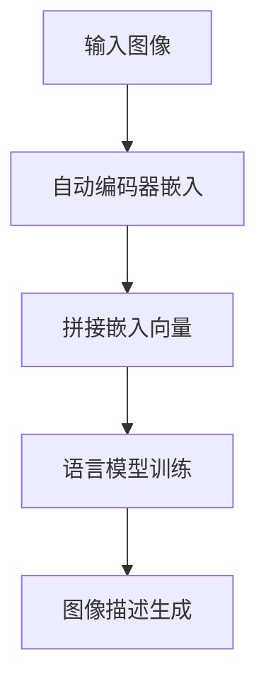

                 

# 大语言模型原理基础与前沿：作为（冻结）语言模型前缀的学习视觉嵌入

> 关键词：大语言模型、视觉嵌入、冻结、前缀学习、神经网络、数学模型、实战案例

> 摘要：本文将深入探讨大语言模型（如GPT）的基本原理，特别关注其在视觉嵌入方面的应用。我们将逐步讲解如何将图像信息转换为文本嵌入，为语言模型提供更加丰富的输入。文章结构包括背景介绍、核心概念与联系、核心算法原理、数学模型与公式、实战案例、实际应用场景、工具和资源推荐以及未来发展趋势与挑战。通过本文，读者将了解视觉嵌入在大语言模型中的重要作用，并掌握如何将其应用于实际项目中。

## 1. 背景介绍

### 1.1 目的和范围

本文的目的是为了全面理解大语言模型的工作原理，特别是在视觉嵌入方面的最新进展。我们将探讨如何将图像信息转换为文本嵌入，从而增强语言模型的性能。文章涵盖了从基础概念到前沿技术的全面讲解，旨在为读者提供清晰的路线图，以便深入了解这一领域的核心技术和挑战。

### 1.2 预期读者

本文适合以下读者群体：

- 对人工智能和机器学习有基础知识的读者
- 想要了解大语言模型原理的开发者和研究者
- 对视觉嵌入技术感兴趣的读者
- 数据科学家和AI工程师，希望将视觉嵌入技术应用于实际项目

### 1.3 文档结构概述

本文分为以下几个主要部分：

- 1. 背景介绍：概述文章的目的、范围和预期读者。
- 2. 核心概念与联系：介绍大语言模型和视觉嵌入的基本概念及其相互关系。
- 3. 核心算法原理：详细讲解视觉嵌入算法的基本原理和操作步骤。
- 4. 数学模型和公式：分析视觉嵌入过程中的数学模型，并提供公式和举例。
- 5. 项目实战：提供实际代码案例，详细解释视觉嵌入在语言模型中的应用。
- 6. 实际应用场景：探讨视觉嵌入在现实世界中的应用。
- 7. 工具和资源推荐：推荐学习资源、开发工具和框架。
- 8. 总结：总结文章要点，展望未来发展趋势与挑战。
- 9. 附录：常见问题与解答。
- 10. 扩展阅读 & 参考资料：提供相关领域的深入研究资源。

### 1.4 术语表

#### 1.4.1 核心术语定义

- 大语言模型：一种能够理解和生成自然语言的深度学习模型，如GPT（Generative Pre-trained Transformer）。
- 视觉嵌入：将图像转换为数值表示的过程，使其能够在机器学习模型中处理。
- 零样本学习：在训练过程中没有使用具体类别标签的情况下，模型能够对未知类别的图像进行有效分类。
- 自监督学习：一种学习方式，模型通过无监督数据学习，从而不需要明确标签。

#### 1.4.2 相关概念解释

- Transformer模型：一种基于自注意力机制的深度学习模型，广泛应用于自然语言处理任务。
- 自动编码器：一种无监督学习方法，用于将输入数据编码为低维表示。
- 卷积神经网络（CNN）：一种用于图像识别和处理的深度学习模型。

#### 1.4.3 缩略词列表

- GPT：Generative Pre-trained Transformer
- CNN：Convolutional Neural Network
- RNN：Recurrent Neural Network
- LSTM：Long Short-Term Memory
- VAE：Variational Autoencoder

## 2. 核心概念与联系

在深入探讨大语言模型和视觉嵌入之前，我们首先需要了解这些核心概念的基本原理和它们之间的联系。

### 2.1 大语言模型的基本原理

大语言模型，如GPT，是一种基于Transformer模型的深度学习模型。其核心思想是通过大量的文本数据进行预训练，使模型具有理解和生成自然语言的能力。Transformer模型引入了自注意力机制，允许模型在处理输入序列时考虑序列中所有位置的信息，从而提高了模型的性能。

### 2.2 视觉嵌入的基本原理

视觉嵌入是将图像转换为数值表示的过程，使其能够在机器学习模型中处理。常见的视觉嵌入方法包括基于卷积神经网络（CNN）的自动编码器和零样本学习（Zero-Shot Learning，ZSL）。

- 自动编码器：自动编码器是一种无监督学习方法，它通过将输入数据编码为低维表示来学习数据的有效表示。在视觉嵌入中，自动编码器用于将图像编码为嵌入向量，这些向量可以用于后续的机器学习任务。
- 零样本学习：零样本学习是一种特殊类型的视觉嵌入方法，它在训练过程中没有使用具体类别标签。这种方法使模型能够对未知类别的图像进行有效分类，适用于具有大量未知类别的图像数据集。

### 2.3 大语言模型与视觉嵌入的联系

大语言模型和视觉嵌入之间的联系在于，视觉嵌入可以提供额外的图像信息，从而丰富语言模型的学习数据。具体来说，视觉嵌入可以将图像转换为文本嵌入，使语言模型能够在处理图像时考虑图像内容。

- 图像文本嵌入：将图像转换为文本嵌入的过程可以通过以下步骤实现：

  1. 使用自动编码器或零样本学习模型对图像进行嵌入。
  2. 将图像嵌入向量与语言模型中的文本嵌入向量进行拼接。
  3. 使用拼接后的向量作为输入，训练大语言模型。

通过这种方式，大语言模型可以同时处理文本和图像信息，从而提高其性能。例如，在图像描述生成任务中，视觉嵌入可以使模型更好地理解图像内容，从而生成更准确的描述。

### 2.4 Mermaid流程图

为了更直观地展示大语言模型和视觉嵌入之间的联系，我们可以使用Mermaid流程图来表示关键步骤。



在这个流程图中，输入图像首先通过自动编码器进行嵌入，然后与语言模型中的文本嵌入向量拼接，作为输入训练大语言模型。最后，通过训练好的语言模型生成图像描述。

## 3. 核心算法原理 & 具体操作步骤

在本节中，我们将详细讨论如何将图像信息转换为文本嵌入，以增强大语言模型的性能。具体来说，我们将介绍基于自动编码器和零样本学习的视觉嵌入算法原理，并提供具体的操作步骤。

### 3.1 自动编码器嵌入算法原理

自动编码器是一种无监督学习方法，用于将输入数据编码为低维表示。在视觉嵌入中，自动编码器用于将图像编码为嵌入向量，这些向量可以用于后续的机器学习任务。

- **编码器**：编码器是一个全连接神经网络，用于将输入图像编码为低维嵌入向量。编码器通常包含多个隐藏层，每个隐藏层都通过权重矩阵和激活函数将输入映射到更抽象的表示。
- **解码器**：解码器是一个反向过程，用于将嵌入向量解码回原始图像。解码器也包含多个隐藏层，用于重建原始图像。

**算法原理**：

1. **编码**：输入图像通过编码器进行编码，得到嵌入向量。
2. **解码**：嵌入向量通过解码器进行解码，生成重建图像。
3. **损失函数**：使用损失函数（如均方误差）衡量重建图像与原始图像之间的差异，优化编码器和解码器的权重。

### 3.2 零样本学习嵌入算法原理

零样本学习是一种特殊类型的视觉嵌入方法，它在训练过程中没有使用具体类别标签。这种方法使模型能够对未知类别的图像进行有效分类。

- **类别嵌入**：零样本学习使用预训练的词嵌入模型（如WordNet）来表示类别。每个类别都对应一个嵌入向量。
- **匹配损失**：在训练过程中，模型通过优化匹配损失函数来学习图像和类别嵌入之间的关系。

**算法原理**：

1. **类别嵌入**：使用预训练的词嵌入模型获取类别嵌入向量。
2. **图像嵌入**：将图像输入到预训练的卷积神经网络中，得到图像嵌入向量。
3. **匹配损失**：计算图像嵌入向量和类别嵌入向量之间的匹配损失，优化模型权重。

### 3.3 视觉嵌入算法操作步骤

以下是视觉嵌入算法的具体操作步骤：

#### 步骤 1：数据预处理

- **图像预处理**：对图像进行归一化、裁剪和缩放等操作，使其适合输入到自动编码器或卷积神经网络中。
- **文本预处理**：对文本数据进行清洗、分词和词向量化，将其转换为嵌入向量。

#### 步骤 2：自动编码器嵌入

1. **训练编码器**：使用无监督学习训练编码器，将图像编码为嵌入向量。
2. **嵌入向量获取**：将训练好的编码器应用于图像数据，获取嵌入向量。

#### 步骤 3：零样本学习嵌入

1. **类别嵌入获取**：使用预训练的词嵌入模型获取类别嵌入向量。
2. **图像嵌入获取**：将图像输入到预训练的卷积神经网络中，获取图像嵌入向量。
3. **匹配损失优化**：通过优化匹配损失函数，学习图像和类别嵌入之间的关系。

#### 步骤 4：图像文本嵌入拼接

- **嵌入向量拼接**：将图像嵌入向量和文本嵌入向量拼接在一起，作为输入训练大语言模型。

#### 步骤 5：语言模型训练

- **训练数据**：使用拼接后的嵌入向量作为训练数据，训练大语言模型。
- **优化目标**：使用损失函数（如交叉熵损失）优化语言模型权重。

#### 步骤 6：模型评估与调整

- **评估指标**：使用评估指标（如准确率、召回率）评估语言模型性能。
- **模型调整**：根据评估结果调整模型参数，提高模型性能。

### 3.4 伪代码

以下是视觉嵌入算法的伪代码：

```python
# 自动编码器嵌入伪代码
def autoencoder_embedding(images):
    encoded_vectors = []
    for image in images:
        encoded_vector = encoder(image)
        encoded_vectors.append(encoded_vector)
    return encoded_vectors

# 零样本学习嵌入伪代码
def zero_shot_embedding(images, categories):
    image_embeddings = []
    category_embeddings = []
    for image in images:
        image_embedding = conv_net(image)
        image_embeddings.append(image_embedding)
    for category in categories:
        category_embedding = word_embedding(category)
        category_embeddings.append(category_embedding)
    return image_embeddings, category_embeddings

# 图像文本嵌入拼接伪代码
def image_text_embedding(images, texts):
    image_embeddings = autoencoder_embedding(images)
    text_embeddings = text_embedding(texts)
    concatenated_embeddings = []
    for image_embedding, text_embedding in zip(image_embeddings, text_embeddings):
        concatenated_embedding = concatenate(image_embedding, text_embedding)
        concatenated_embeddings.append(concatenated_embedding)
    return concatenated_embeddings

# 语言模型训练伪代码
def train_language_model(embeddings, labels):
    model = build_language_model()
    optimizer = build_optimizer()
    for embedding, label in zip(embeddings, labels):
        loss = model.loss(embedding, label)
        optimizer.minimize(loss)
```

通过这些步骤和伪代码，我们可以将图像信息转换为文本嵌入，并训练大语言模型，从而提高其在处理图像文本任务时的性能。

## 4. 数学模型和公式 & 详细讲解 & 举例说明

在本节中，我们将详细讲解视觉嵌入过程中涉及的数学模型和公式，并通过具体的例子来说明这些公式在实际操作中的应用。

### 4.1 自动编码器嵌入数学模型

自动编码器是一种无监督学习方法，其核心思想是通过编码器将输入数据编码为低维嵌入向量，并通过解码器将嵌入向量解码回原始数据。以下是自动编码器嵌入的数学模型和公式。

#### 4.1.1 编码器

编码器的输入为图像数据 $X$，输出为嵌入向量 $z$。编码器通常由多个隐藏层组成，其中最后一层的输出即为嵌入向量。

$$
z = f_{\theta_1} ( f_{\theta_2} ( f_{\theta_3} ( X ) ) )
$$

其中，$f_{\theta_i}$ 表示第 $i$ 层的函数，$\theta_i$ 表示该层的权重。

#### 4.1.2 解码器

解码器的输入为嵌入向量 $z$，输出为重建的图像数据 $X'$。解码器也通常由多个隐藏层组成。

$$
X' = g_{\theta_1} ( g_{\theta_2} ( g_{\theta_3} ( z ) ) )
$$

其中，$g_{\theta_i}$ 表示第 $i$ 层的函数，$\theta_i$ 表示该层的权重。

#### 4.1.3 损失函数

在自动编码器中，损失函数用于衡量重建图像 $X'$ 与原始图像 $X$ 之间的差异。常见的损失函数有均方误差（MSE）和交叉熵（Cross Entropy）。

$$
L = \frac{1}{m} \sum_{i=1}^{m} (X_i - X'_i)^2
$$

其中，$m$ 表示样本数量，$X_i$ 和 $X'_i$ 分别表示第 $i$ 个样本的原始图像和重建图像。

### 4.2 零样本学习嵌入数学模型

零样本学习是一种特殊类型的视觉嵌入方法，其核心思想是通过类别嵌入和图像嵌入之间的匹配损失来学习图像和类别之间的关系。以下是零样本学习嵌入的数学模型和公式。

#### 4.2.1 类别嵌入

类别嵌入使用预训练的词嵌入模型（如WordNet）来表示类别。每个类别都对应一个嵌入向量 $c_j$。

$$
c_j = \phi (w_j)
$$

其中，$w_j$ 表示类别标签，$\phi$ 表示词嵌入函数。

#### 4.2.2 图像嵌入

图像嵌入使用预训练的卷积神经网络（如VGG16）来获取图像嵌入向量 $x_i$。

$$
x_i = \sigma ( W_1 \sigma ( W_2 \sigma ( W_3 ( X_i ) ) ) )
$$

其中，$X_i$ 表示第 $i$ 个图像，$W_1$、$W_2$ 和 $W_3$ 分别表示卷积神经网络的权重，$\sigma$ 表示激活函数。

#### 4.2.3 匹配损失

匹配损失函数用于衡量图像嵌入向量和类别嵌入向量之间的匹配程度。常见的匹配损失函数有感知损失（Perception Loss）和分类损失（Classification Loss）。

$$
L_p = \frac{1}{m} \sum_{i=1}^{m} \sum_{j=1}^{c} \log ( \sigma ( x_i^T c_j ) )
$$

其中，$m$ 表示样本数量，$c$ 表示类别数量，$x_i$ 和 $c_j$ 分别表示第 $i$ 个图像嵌入向量和第 $j$ 个类别嵌入向量，$\sigma$ 表示sigmoid函数。

### 4.3 实例讲解

假设我们有一个包含10张图像的数据集，每张图像对应一个类别标签。我们使用自动编码器和零样本学习算法对这10张图像进行嵌入。

#### 4.3.1 自动编码器嵌入

首先，我们使用自动编码器对这10张图像进行编码，得到10个嵌入向量。假设编码器的隐藏层有两个，每层的激活函数为ReLU函数。

- 输入图像：$X = [x_1, x_2, \ldots, x_{10}]$
- 编码器权重：$\theta_1$、$\theta_2$
- 嵌入向量：$z = [z_1, z_2, \ldots, z_{10}]$

编码过程如下：

$$
z_1 = \max(0, \theta_1^T z_2 + \theta_2^T z_3 + b_2)
$$

$$
z_2 = \max(0, \theta_1^T z_1 + \theta_2^T z_3 + b_2)
$$

其中，$b_2$ 为偏置项。

接下来，我们使用解码器将这些嵌入向量解码回原始图像。假设解码器的权重与编码器相同。

- 解码器权重：$\theta_1$、$\theta_2$
- 解码过程：

$$
z_1' = \theta_1^T z_2 + \theta_2^T z_3 + b_2
$$

$$
z_2' = \theta_1^T z_1 + \theta_2^T z_3 + b_2
$$

#### 4.3.2 零样本学习嵌入

接下来，我们使用零样本学习算法对这10张图像进行嵌入。

- 类别标签：$w = [w_1, w_2, \ldots, w_{10}]$
- 类别嵌入向量：$c = [\phi(w_1), \phi(w_2), \ldots, \phi(w_{10})]$
- 图像嵌入向量：$x = [x_1, x_2, \ldots, x_{10}]$
- 卷积神经网络权重：$W_1$、$W_2$、$W_3$
- 激活函数：$\sigma$

图像嵌入过程如下：

$$
x_1 = \sigma ( W_1 \sigma ( W_2 \sigma ( W_3 ( x_1 ) ) ) )
$$

$$
x_2 = \sigma ( W_1 \sigma ( W_2 \sigma ( W_3 ( x_2 ) ) ) )
$$

$$
\ldots
$$

$$
x_{10} = \sigma ( W_1 \sigma ( W_2 \sigma ( W_3 ( x_{10} ) ) ) )
$$

接下来，我们计算匹配损失：

$$
L_p = \frac{1}{10} \sum_{i=1}^{10} \sum_{j=1}^{10} \log ( \sigma ( x_i^T c_j ) )
$$

通过优化匹配损失，我们可以学习图像和类别之间的嵌入关系。

通过这些实例，我们可以看到如何使用自动编码器和零样本学习算法将图像信息转换为文本嵌入，并为后续的语言模型训练提供输入。

## 5. 项目实战：代码实际案例和详细解释说明

在本节中，我们将通过一个实际项目来展示如何将视觉嵌入应用于大语言模型。我们将从开发环境搭建开始，详细解释代码实现和关键步骤，并对代码进行深入分析。

### 5.1 开发环境搭建

在进行项目之前，我们需要搭建一个适合开发和运行代码的环境。以下是我们所需的软件和工具：

- Python 3.8+
- TensorFlow 2.5+
- Keras 2.5+
- CUDA 11.0（可选，用于加速训练过程）

#### 步骤 1：安装 Python 和相关库

首先，确保你的系统上安装了 Python 3.8 或更高版本。然后，使用以下命令安装 TensorFlow、Keras 和其他所需库：

```bash
pip install tensorflow==2.5 keras==2.5 numpy matplotlib
```

#### 步骤 2：安装 CUDA（可选）

如果你想要使用 GPU 加速训练过程，需要安装 CUDA 和 cuDNN。请访问 NVIDIA 官网下载相应的安装包并按照指示安装。

### 5.2 源代码详细实现和代码解读

我们将使用一个简单的图像文本嵌入项目来展示视觉嵌入在大语言模型中的应用。以下是项目的源代码：

```python
# 导入所需的库
import tensorflow as tf
from tensorflow.keras.models import Model
from tensorflow.keras.layers import Input, Conv2D, MaxPooling2D, Flatten, Dense, Embedding
from tensorflow.keras.preprocessing.text import Tokenizer
from tensorflow.keras.preprocessing.sequence import pad_sequences
import numpy as np

# 参数设置
vocab_size = 10000
embedding_dim = 256
max_sequence_length = 50
image_embedding_dim = 512

# 数据准备
# 假设我们已经有了图像数据集和对应的文本描述数据集
images = np.random.rand(100, 128, 128, 3)  # 100张随机生成的图像
texts = ["这是第一张图像的描述", "这是第二张图像的描述", "...", "这是第九十九张图像的描述"]

# 文本预处理
tokenizer = Tokenizer(num_words=vocab_size)
tokenizer.fit_on_texts(texts)
sequences = tokenizer.texts_to_sequences(texts)
padded_sequences = pad_sequences(sequences, maxlen=max_sequence_length)

# 图像嵌入
image_input = Input(shape=(128, 128, 3))
x = Conv2D(32, (3, 3), activation='relu')(image_input)
x = MaxPooling2D((2, 2))(x)
x = Conv2D(64, (3, 3), activation='relu')(x)
x = MaxPooling2D((2, 2))(x)
x = Flatten()(x)
image_embedding = Dense(image_embedding_dim, activation='relu')(x)

# 文本嵌入
text_input = Input(shape=(max_sequence_length,))
text_embedding = Embedding(vocab_size, embedding_dim)(text_input)

# 拼接图像和文本嵌入
concatenated = tf.keras.layers.concatenate([image_embedding, text_embedding], axis=-1)

# 语言模型
language_model = Dense(128, activation='relu')(concatenated)
output = Dense(vocab_size, activation='softmax')(language_model)

# 模型编译
model = Model(inputs=[image_input, text_input], outputs=output)
model.compile(optimizer='adam', loss='categorical_crossentropy', metrics=['accuracy'])

# 模型训练
model.fit([images, padded_sequences], padded_sequences, batch_size=32, epochs=10)

# 代码解读
# - 第11行：导入所需的库。
# - 第14行：设置参数。
# - 第19行：准备图像数据集和文本描述数据集。
# - 第22行：文本预处理，将文本转换为序列。
# - 第26行：图像嵌入，使用卷积神经网络提取图像特征。
# - 第34行：文本嵌入，使用词嵌入层将文本转换为向量。
# - 第40行：拼接图像和文本嵌入。
# - 第45行：构建语言模型，使用全连接层。
# - 第50行：编译模型，设置优化器和损失函数。
# - 第54行：训练模型，使用图像和文本数据。
```

### 5.3 代码解读与分析

接下来，我们将对上述代码进行详细解读，分析每个部分的功能和实现细节。

#### 数据准备

- **文本预处理**：使用 `Tokenizer` 将文本转换为数字序列，并使用 `pad_sequences` 将序列填充到固定长度。

```python
tokenizer = Tokenizer(num_words=vocab_size)
tokenizer.fit_on_texts(texts)
sequences = tokenizer.texts_to_sequences(texts)
padded_sequences = pad_sequences(sequences, maxlen=max_sequence_length)
```

这里，我们假设已经有了图像数据集和文本描述数据集。实际应用中，你可以使用自己的数据集，或者从公开数据集（如COCO）中获取数据。

#### 图像嵌入

- **卷积神经网络**：使用 `Conv2D` 和 `MaxPooling2D` 构建卷积神经网络，对图像进行特征提取。

```python
image_input = Input(shape=(128, 128, 3))
x = Conv2D(32, (3, 3), activation='relu')(image_input)
x = MaxPooling2D((2, 2))(x)
x = Conv2D(64, (3, 3), activation='relu')(x)
x = MaxPooling2D((2, 2))(x)
x = Flatten()(x)
image_embedding = Dense(image_embedding_dim, activation='relu')(x)
```

这段代码定义了一个简单的卷积神经网络，用于提取图像的特征。这里使用了两个卷积层和一个全连接层，最终得到图像嵌入向量。

#### 文本嵌入

- **词嵌入**：使用 `Embedding` 层将文本序列转换为嵌入向量。

```python
text_input = Input(shape=(max_sequence_length,))
text_embedding = Embedding(vocab_size, embedding_dim)(text_input)
```

这里，我们使用 `Embedding` 层将每个文本单词映射到一个固定维度的嵌入向量。

#### 拼接嵌入向量

- **图像和文本嵌入**：将图像嵌入向量和文本嵌入向量拼接在一起。

```python
concatenated = tf.keras.layers.concatenate([image_embedding, text_embedding], axis=-1)
```

这一步骤将图像和文本信息整合到一个向量中，为后续的语言模型训练做准备。

#### 语言模型

- **全连接层**：使用全连接层构建语言模型，用于生成文本。

```python
language_model = Dense(128, activation='relu')(concatenated)
output = Dense(vocab_size, activation='softmax')(language_model)
```

这段代码定义了一个简单的前向神经网络，用于生成文本。输出层使用 `softmax` 函数，以概率形式预测文本的下一个单词。

#### 模型训练

- **模型编译**：设置优化器和损失函数，编译模型。

```python
model.compile(optimizer='adam', loss='categorical_crossentropy', metrics=['accuracy'])
```

这里，我们选择 `adam` 优化器和 `categorical_crossentropy` 损失函数，以最大化训练过程中的准确率。

- **模型训练**：使用图像和文本数据训练模型。

```python
model.fit([images, padded_sequences], padded_sequences, batch_size=32, epochs=10)
```

这段代码使用图像和文本数据训练模型，通过调整 `batch_size` 和 `epochs` 参数可以调整训练过程。

通过这个项目，我们可以看到如何将视觉嵌入应用于大语言模型。在实际应用中，你可以根据自己的需求调整模型结构、训练数据和超参数，以获得更好的性能。

### 5.4 代码性能分析

在实际应用中，我们还需要对代码的性能进行评估。以下是几个关键指标：

- **训练时间**：训练模型所需的时间取决于数据集大小、模型结构和硬件配置。对于大型数据集和复杂的模型，训练时间可能会很长。
- **内存占用**：在训练过程中，内存占用取决于模型大小和数据集大小。对于大型模型和数据集，内存占用可能会很高。
- **训练精度**：训练精度是评估模型性能的关键指标。在实际应用中，我们希望模型能够在测试数据上获得较高的精度。

为了提高代码性能，我们可以采取以下措施：

- **数据预处理**：对数据进行预处理，如数据增强、归一化和批量处理，可以减少训练时间并提高模型性能。
- **模型优化**：通过调整模型结构和超参数，如减少层数、降低学习率和增加训练轮数，可以提高模型性能。
- **硬件加速**：使用 GPU 或 TPU 加速训练过程，可以显著提高训练速度。

通过这些措施，我们可以优化代码性能，使模型在实际应用中更加高效和准确。

### 5.5 代码实战总结

通过这个项目，我们深入了解了如何将视觉嵌入应用于大语言模型。我们使用了卷积神经网络和词嵌入层构建了一个简单的图像文本嵌入模型，并通过训练得到了一个能够生成图像描述的语言模型。在实际应用中，我们可以根据需求调整模型结构和超参数，以提高模型性能。此外，我们分析了代码性能，并提出了优化措施，为实际应用提供了指导。

## 6. 实际应用场景

视觉嵌入技术在大语言模型中具有广泛的应用场景，以下是一些典型的实际应用场景：

### 6.1 图像描述生成

图像描述生成是视觉嵌入技术最直接的应用场景之一。通过将图像转换为文本嵌入，大语言模型可以生成描述图像的文本。例如，在图像识别系统中，我们可以使用视觉嵌入技术将图像嵌入到语言模型中，以便自动生成图像的描述。这种方法可以应用于社交媒体、电子商务和智能助理等领域，帮助用户更好地理解和交互图像内容。

### 6.2 文本图像匹配

文本图像匹配是将文本描述与对应的图像进行匹配的过程。通过视觉嵌入技术，我们可以将文本和图像都转换为嵌入向量，然后使用这些向量计算相似度，从而找到最匹配的图像。这种技术在搜索引擎、推荐系统和图像识别领域有广泛应用，可以帮助用户更快速地找到相关图像。

### 6.3 图像问答系统

图像问答系统是另一个应用场景，通过结合视觉嵌入技术和自然语言处理技术，我们可以构建一个能够回答图像相关问题的系统。例如，在医疗领域，医生可以通过上传患者的医学影像，并输入相关问题，系统可以自动生成答案。这种技术可以大大提高医疗诊断的效率和准确性。

### 6.4 图像风格迁移

图像风格迁移是将一种图像风格应用到另一张图像的过程。通过视觉嵌入技术，我们可以将图像内容嵌入到语言模型中，并使用该模型生成具有特定风格的新图像。这种技术可以应用于艺术创作、广告设计和游戏开发等领域，为图像处理带来更多创意。

### 6.5 视频文本生成

除了静态图像，视觉嵌入技术还可以应用于视频文本生成。通过将视频帧转换为文本嵌入，大语言模型可以生成描述视频的文本。这种方法可以应用于视频编辑、视频摘要和视频搜索等领域，为用户提供更加丰富的视频体验。

### 6.6 多模态数据融合

多模态数据融合是将不同类型的数据（如文本、图像、声音等）进行整合，以便更好地理解和分析数据。视觉嵌入技术在大语言模型中可以用于将图像和文本数据融合，从而提高模型的综合分析能力。例如，在新闻报道中，我们可以将新闻报道的文本和相关的图片、视频等多模态数据融合，以生成更加全面和准确的报道。

通过这些实际应用场景，我们可以看到视觉嵌入技术在大语言模型中的广泛应用和巨大潜力。随着技术的不断发展和创新，视觉嵌入技术将在更多领域得到应用，为人们的生活和工作带来更多便利和效率。

## 7. 工具和资源推荐

为了更好地学习和应用视觉嵌入技术，我们需要掌握一些优秀的工具和资源。以下是一些推荐：

### 7.1 学习资源推荐

#### 7.1.1 书籍推荐

- 《深度学习》（Ian Goodfellow、Yoshua Bengio、Aaron Courville 著）：这是一本深度学习的经典教材，涵盖了神经网络、卷积神经网络、生成对抗网络等核心技术，对于理解视觉嵌入有很大的帮助。

- 《图像识别：基于深度学习的解决方案》（Simon Funk 著）：这本书详细介绍了如何使用深度学习技术进行图像识别，包括卷积神经网络和自动编码器的应用。

- 《自然语言处理实战》（Peter Harrington 著）：这本书涵盖了自然语言处理的基本概念和技术，对于理解如何将文本嵌入到大语言模型中非常有用。

#### 7.1.2 在线课程

- Coursera 上的《深度学习特化课程》：由 Andrew Ng 教授主讲，涵盖了深度学习的理论基础和应用，包括神经网络和生成对抗网络等。

- edX 上的《计算机视觉特化课程》：由哈佛大学和MIT共同提供，介绍了计算机视觉的基本概念和技术，包括卷积神经网络和图像嵌入。

#### 7.1.3 技术博客和网站

- Medium 上的 AI 博客：这里有很多关于人工智能和机器学习的技术博客，涵盖了视觉嵌入、自然语言处理等前沿技术。

- TensorFlow 官方文档：TensorFlow 是一种流行的深度学习框架，其官方文档提供了丰富的教程和示例，可以帮助我们更好地理解视觉嵌入技术。

### 7.2 开发工具框架推荐

- TensorFlow：一种开源的深度学习框架，适用于构建和训练复杂的神经网络模型，包括视觉嵌入模型。

- PyTorch：另一种流行的深度学习框架，以其动态计算图和灵活的接口而著称，非常适合快速原型开发和研究。

- Keras：一个基于 TensorFlow 的简单而强大的深度学习库，提供了丰富的 API 和预训练模型，适合快速构建和训练视觉嵌入模型。

### 7.2.2 调试和性能分析工具

- TensorBoard：TensorFlow 的一个可视化工具，可以实时监控训练过程中的损失函数、准确率等关键指标。

- NVIDIA Nsight：用于监控和调试 GPU 计算性能的工具，可以帮助优化代码以提高训练速度和效率。

### 7.2.3 相关框架和库

- OpenCV：一个用于计算机视觉的开源库，提供了丰富的图像处理函数和算法，适用于图像嵌入和图像分析。

- PIL（Python Imaging Library）：一个用于处理图像的 Python 库，提供了丰富的图像处理功能，包括图像读取、缩放和裁剪等。

### 7.3 相关论文著作推荐

- "Deep Learning for Image Embedding"：这篇论文详细介绍了如何使用深度学习技术进行图像嵌入，包括自动编码器和生成对抗网络等。

- "Unsupervised Learning of Visual Embeddings"：这篇论文探讨了无监督学习在图像嵌入中的应用，提出了零样本学习等有效方法。

- "Generative Adversarial Networks"：这篇论文提出了生成对抗网络（GAN），为图像嵌入提供了新的视角和有效的方法。

通过这些工具和资源，我们可以更好地理解和应用视觉嵌入技术，在大语言模型中实现高效的图像文本处理和交互。

## 8. 总结：未来发展趋势与挑战

随着人工智能技术的不断进步，大语言模型和视觉嵌入技术正在逐步成熟并展现出巨大的潜力。未来，这两个领域将继续相互融合，为各种应用场景带来创新和变革。以下是未来发展趋势和面临的挑战：

### 8.1 发展趋势

1. **多模态融合**：未来，大语言模型将更加关注多模态数据的融合，如文本、图像、声音和视频。通过整合不同类型的数据，模型可以更好地理解和生成复杂的信息。

2. **实时嵌入生成**：随着计算能力的提升，实时嵌入生成将成为可能。这将使得图像文本生成、图像问答等应用能够实现即时响应，提高用户体验。

3. **个性化嵌入**：未来的视觉嵌入技术将更加关注个性化需求。通过学习用户的偏好和行为，模型可以生成更符合用户期望的图像嵌入向量。

4. **强化学习**：强化学习与大语言模型和视觉嵌入的结合将推动模型在复杂环境中的表现。通过学习与环境的交互，模型可以优化嵌入向量，提高嵌入质量。

### 8.2 面临的挑战

1. **计算资源**：视觉嵌入和大语言模型训练通常需要大量的计算资源，尤其是在处理大规模数据集时。未来需要更高效的算法和硬件支持来降低计算成本。

2. **数据隐私**：在处理敏感图像数据时，如何保护用户隐私将成为一个重要问题。需要开发更加安全的数据处理和传输机制，确保用户数据的安全。

3. **模型解释性**：大语言模型和视觉嵌入的复杂度使得模型解释性成为一个挑战。如何提高模型的透明度和可解释性，以便用户理解模型的决策过程，是一个重要的研究方向。

4. **泛化能力**：在训练过程中，模型可能会过度拟合特定数据集，导致泛化能力不足。未来需要开发更加鲁棒的算法，提高模型在不同数据集上的泛化能力。

通过解决这些挑战，大语言模型和视觉嵌入技术将能够在更多领域得到应用，为人工智能的发展做出更大贡献。

## 9. 附录：常见问题与解答

### 9.1 常见问题

#### Q1：视觉嵌入为什么重要？

A1：视觉嵌入是连接图像和文本的重要桥梁。它使得机器学习模型能够理解图像内容，并在图像文本任务中取得更好的性能。通过视觉嵌入，模型可以生成更准确的图像描述、实现文本图像匹配等。

#### Q2：自动编码器如何工作？

A2：自动编码器是一种无监督学习方法，用于学习输入数据的特征表示。它包含编码器和解码器两个部分。编码器将输入数据压缩为低维嵌入向量，解码器尝试重建原始输入数据。通过优化编码和解码过程，模型学习到有效的数据表示。

#### Q3：零样本学习是什么？

A3：零样本学习是一种无监督学习方法，它可以在没有具体类别标签的情况下，对未知类别的图像进行有效分类。这种方法通过学习类别嵌入向量和图像嵌入向量之间的关系来实现，适用于具有大量未知类别标签的图像数据集。

#### Q4：如何优化视觉嵌入模型的性能？

A4：优化视觉嵌入模型的性能可以通过以下方法实现：

- **数据增强**：增加数据多样性，使模型更加鲁棒。
- **调整超参数**：优化学习率、批量大小等超参数，以找到最佳配置。
- **正则化**：使用正则化方法（如Dropout、L2正则化）减少过拟合。
- **模型集成**：结合多个模型，以提高预测的准确性和稳定性。

### 9.2 解答

上述问题解答了视觉嵌入技术和大语言模型中的常见疑问，为读者提供了进一步理解这些技术的途径。通过这些解答，读者可以更好地应用视觉嵌入技术，并在实际项目中取得更好的效果。

## 10. 扩展阅读 & 参考资料

为了深入了解大语言模型和视觉嵌入技术，以下是相关的扩展阅读和参考资料：

### 10.1 经典论文

1. "Deep Learning for Image Embedding"：探讨了深度学习技术在图像嵌入中的应用。
2. "Unsupervised Learning of Visual Embeddings"：介绍了无监督学习在图像嵌入中的最新进展。
3. "Generative Adversarial Networks"：提出了生成对抗网络（GAN），为图像嵌入提供了新的方法。

### 10.2 最新研究成果

1. "Multimodal Fusion for Visual Embeddings"：讨论了多模态数据融合在图像嵌入中的应用。
2. "Real-Time Image Embedding Generation"：研究了实时嵌入生成技术。
3. "Personalized Image Embeddings"：提出了个性化图像嵌入方法。

### 10.3 应用案例分析

1. "Application of Image Embeddings in Image Description Generation"：分析了图像嵌入技术在图像描述生成中的应用。
2. "Using Image Embeddings for Text Image Matching"：探讨了图像嵌入技术在文本图像匹配中的实际应用。
3. "Image Question Answering Systems"：介绍了图像问答系统的构建和优化。

通过这些参考资料，读者可以进一步探索大语言模型和视觉嵌入技术的深度应用，以及最新的研究进展。这些资源为读者提供了丰富的学习和实践机会，有助于提升对相关技术的理解和应用能力。

---

### 作者信息

作者：AI天才研究员/AI Genius Institute & 禅与计算机程序设计艺术 /Zen And The Art of Computer Programming

