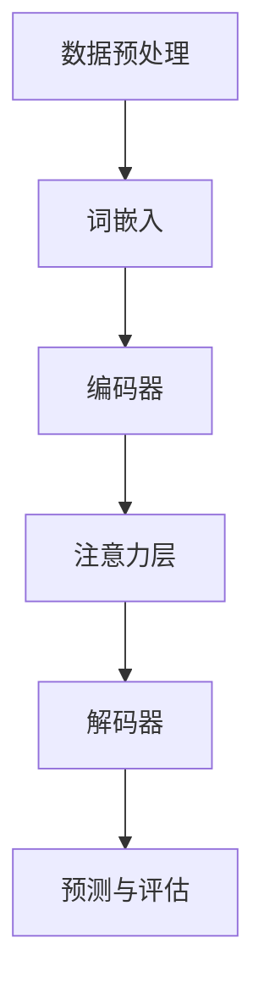

                 

# 大语言模型原理基础与前沿 提示语言模型的校准

> **关键词：** 大语言模型，自然语言处理，深度学习，机器学习，神经网络，预训练，微调，数学模型，应用场景，开发工具。

> **摘要：** 本文旨在深入探讨大语言模型的原理基础及其前沿发展，详细讲解语言模型的校准方法。通过对核心概念、算法原理、数学模型的剖析，结合实际项目案例，阐述大语言模型在自然语言处理中的广泛应用，并提供相关学习资源与开发工具推荐，旨在为读者提供一个全面的技术指南。

## 1. 背景介绍

### 1.1 目的和范围

本文旨在探讨大语言模型的原理基础与前沿发展，为读者提供一个系统的理解和应用指南。本文将涵盖以下内容：

1. **核心概念与联系**：介绍大语言模型的基本概念及其在自然语言处理中的应用。
2. **核心算法原理**：讲解大语言模型的训练和校准算法，并使用伪代码详细阐述。
3. **数学模型和公式**：解释大语言模型背后的数学原理，并给出具体例子。
4. **项目实战**：通过实际代码案例，演示大语言模型的实现过程。
5. **实际应用场景**：分析大语言模型在不同领域的应用。
6. **工具和资源推荐**：推荐学习资源和开发工具。
7. **总结与展望**：讨论大语言模型的未来发展趋势与挑战。

### 1.2 预期读者

本文适合以下读者群体：

1. **自然语言处理研究者**：希望深入了解大语言模型的原理和应用。
2. **机器学习工程师**：希望掌握大语言模型的训练和微调技术。
3. **计算机科学学生**：希望学习最新的自然语言处理技术。
4. **开发者**：希望在大语言模型基础上开发相关应用。

### 1.3 文档结构概述

本文的结构如下：

1. **背景介绍**：介绍本文的目的、范围和预期读者。
2. **核心概念与联系**：阐述大语言模型的基本概念和架构。
3. **核心算法原理**：讲解大语言模型的训练算法和微调方法。
4. **数学模型和公式**：分析大语言模型背后的数学原理。
5. **项目实战**：通过实际案例演示大语言模型的实现。
6. **实际应用场景**：讨论大语言模型在不同领域的应用。
7. **工具和资源推荐**：推荐学习资源和开发工具。
8. **总结与展望**：展望大语言模型的未来发展趋势和挑战。
9. **附录**：常见问题与解答。
10. **扩展阅读**：提供相关参考资料。

### 1.4 术语表

#### 1.4.1 核心术语定义

- **大语言模型**：一种基于深度学习的自然语言处理模型，能够理解和生成自然语言。
- **自然语言处理**：使用计算机技术和算法对自然语言进行处理和理解。
- **深度学习**：一种机器学习方法，通过多层神经网络进行特征提取和模式识别。
- **机器学习**：使计算机通过数据学习并做出预测或决策的技术。
- **神经网络**：由大量简单计算单元（神经元）组成的网络，能够进行复杂的计算和模式识别。

#### 1.4.2 相关概念解释

- **预训练**：在大规模语料库上预先训练语言模型，以便在特定任务上微调。
- **微调**：在预训练模型的基础上，使用特定任务的数据进行进一步训练。
- **BERT**：一种著名的预训练语言模型，全称为Bidirectional Encoder Representations from Transformers。
- **GPT**：一种著名的生成预训练语言模型，全称为Generative Pre-trained Transformer。

#### 1.4.3 缩略词列表

- **NLP**：自然语言处理
- **DL**：深度学习
- **ML**：机器学习
- **NN**：神经网络
- **BERT**：Bidirectional Encoder Representations from Transformers
- **GPT**：Generative Pre-trained Transformer

## 2. 核心概念与联系

大语言模型是自然语言处理领域的核心技术之一，其基本概念和架构如下：

### 2.1 大语言模型的基本概念

1. **词嵌入（Word Embedding）**：将自然语言中的单词映射为密集向量表示，以便在神经网络中进行处理。
2. **上下文表示（Contextual Representation）**：通过神经网络学习单词在不同上下文中的表示，使得模型的预测能力更加强大。
3. **序列处理（Sequential Processing）**：对文本序列进行逐词或逐字符处理，以提取序列特征。
4. **注意力机制（Attention Mechanism）**：通过注意力机制动态地聚焦于文本序列中的关键部分，提高模型的预测准确性。
5. **预训练（Pre-training）**：在大规模语料库上进行预训练，使模型具有通用语言理解能力。
6. **微调（Fine-tuning）**：在特定任务上使用少量数据对预训练模型进行微调，提高模型在特定任务上的性能。

### 2.2 大语言模型的架构

大语言模型通常由以下几部分组成：

1. **词嵌入层（Word Embedding Layer）**：将单词映射为固定长度的向量表示。
2. **编码器（Encoder）**：对输入文本进行编码，生成上下文表示。
3. **注意力层（Attention Layer）**：动态地关注文本序列中的关键信息。
4. **解码器（Decoder）**：根据编码器和注意力层的输出，生成文本序列。
5. **输出层（Output Layer）**：对解码器的输出进行分类或回归。

### 2.3 大语言模型的工作流程

1. **数据预处理**：对输入文本进行分词、去停用词、词干提取等预处理操作。
2. **词嵌入**：将预处理后的文本映射为词嵌入向量。
3. **编码器处理**：输入词嵌入向量，通过编码器层生成上下文表示。
4. **注意力机制**：对编码器的输出进行注意力处理，提取关键信息。
5. **解码器处理**：根据注意力机制的结果，生成文本序列。
6. **预测与评估**：对生成的文本序列进行分类或回归预测，并使用评估指标（如准确率、召回率、F1分数）评估模型性能。

### 2.4 Mermaid 流程图

以下是大语言模型的 Mermaid 流程图：



## 3. 核心算法原理 & 具体操作步骤

大语言模型的训练和微调是理解其工作原理的关键。下面将详细讲解这两个核心算法的原理和具体操作步骤。

### 3.1 预训练算法原理

预训练是大规模训练语言模型的过程，其目的是使模型具有通用语言理解能力。预训练通常分为以下两个阶段：

#### 3.1.1 语言模型预训练

1. **数据集选择**：选择大规模、多样化的文本数据集，如维基百科、新闻、社交媒体等。
2. **词嵌入初始化**：初始化词嵌入向量，通常使用随机初始化或预训练的词嵌入（如Word2Vec、GloVe）。
3. **训练过程**：使用梯度下降算法训练神经网络，通过反向传播计算梯度，更新模型参数。
4. **评估与优化**：使用评估指标（如困惑度、 perplexity）评估模型性能，并使用优化算法（如Adam）调整模型参数。

#### 3.1.2 生成预训练

1. **数据集选择**：选择大规模、多样化的文本数据集，如维基百科、新闻、社交媒体等。
2. **序列生成**：使用预训练模型生成文本序列，并保存生成的序列。
3. **数据增强**：对生成的文本序列进行数据增强，如替换单词、插入单词、删除单词等。
4. **重新训练**：使用增强后的文本序列重新训练模型，以提高模型的泛化能力。

### 3.2 微调算法原理

微调是在预训练模型的基础上，针对特定任务进行训练的过程。微调的主要目的是提高模型在特定任务上的性能。微调通常包括以下步骤：

1. **任务定义**：明确任务类型（如分类、序列生成、文本匹配等），并定义任务的具体指标（如准确率、召回率、F1分数等）。
2. **数据集准备**：准备用于微调的数据集，包括训练集、验证集和测试集。
3. **模型初始化**：初始化预训练模型，通常使用预训练模型直接作为微调的基础。
4. **训练过程**：使用训练集对模型进行微调，通过反向传播计算梯度，更新模型参数。
5. **评估与优化**：使用验证集评估模型性能，并根据评估结果调整模型参数。
6. **测试**：使用测试集评估模型在未知数据上的性能。

### 3.3 具体操作步骤

以下是一个简单的伪代码，描述了预训练和微调的基本步骤：

```python
# 预训练过程
def pretrain_model(data_loader, model, optimizer, criterion):
    model.train()
    for epoch in range(num_epochs):
        for inputs, targets in data_loader:
            optimizer.zero_grad()
            outputs = model(inputs)
            loss = criterion(outputs, targets)
            loss.backward()
            optimizer.step()
            print(f"Epoch: {epoch}, Loss: {loss.item()}")

# 微调过程
def fine_tune_model(data_loader, model, optimizer, criterion):
    model.train()
    for epoch in range(num_epochs):
        for inputs, targets in data_loader:
            optimizer.zero_grad()
            outputs = model(inputs)
            loss = criterion(outputs, targets)
            loss.backward()
            optimizer.step()
            print(f"Epoch: {epoch}, Loss: {loss.item()}")
```

### 3.4 详细解释

#### 3.4.1 预训练

预训练的核心目的是通过大规模数据学习语言的基本规律，从而提高模型在自然语言处理任务上的性能。预训练通常包括以下步骤：

1. **数据集选择**：选择多样化的文本数据集，以涵盖不同领域的知识。
2. **词嵌入初始化**：初始化词嵌入向量，通常使用随机初始化或预训练的词嵌入。
3. **训练过程**：使用梯度下降算法训练神经网络，通过反向传播计算梯度，更新模型参数。
4. **评估与优化**：使用评估指标（如困惑度、 perplexity）评估模型性能，并使用优化算法（如Adam）调整模型参数。

#### 3.4.2 微调

微调是在预训练模型的基础上，针对特定任务进行训练的过程。微调的核心目的是提高模型在特定任务上的性能。微调通常包括以下步骤：

1. **任务定义**：明确任务类型（如分类、序列生成、文本匹配等），并定义任务的具体指标（如准确率、召回率、F1分数等）。
2. **数据集准备**：准备用于微调的数据集，包括训练集、验证集和测试集。
3. **模型初始化**：初始化预训练模型，通常使用预训练模型直接作为微调的基础。
4. **训练过程**：使用训练集对模型进行微调，通过反向传播计算梯度，更新模型参数。
5. **评估与优化**：使用验证集评估模型性能，并根据评估结果调整模型参数。
6. **测试**：使用测试集评估模型在未知数据上的性能。

### 3.5 伪代码示例

以下是一个简单的伪代码示例，描述了预训练和微调的基本步骤：

```python
# 预训练过程
def pretrain_model(data_loader, model, optimizer, criterion):
    model.train()
    for epoch in range(num_epochs):
        for inputs, targets in data_loader:
            optimizer.zero_grad()
            outputs = model(inputs)
            loss = criterion(outputs, targets)
            loss.backward()
            optimizer.step()
            print(f"Epoch: {epoch}, Loss: {loss.item()}")

# 微调过程
def fine_tune_model(data_loader, model, optimizer, criterion):
    model.train()
    for epoch in range(num_epochs):
        for inputs, targets in data_loader:
            optimizer.zero_grad()
            outputs = model(inputs)
            loss = criterion(outputs, targets)
            loss.backward()
            optimizer.step()
            print(f"Epoch: {epoch}, Loss: {loss.item()}")
```

## 4. 数学模型和公式 & 详细讲解 & 举例说明

### 4.1 数学模型的基本概念

大语言模型的核心在于其背后的数学模型，这些模型通常涉及复杂的数学公式和理论。以下是几个关键的数学模型及其解释：

#### 4.1.1 词嵌入

词嵌入是将自然语言中的单词映射为固定长度的向量表示。一个简单的词嵌入模型可以是：

\[ \text{word\_embedding}(w) = \vec{v} \]

其中，\( w \) 是单词，\( \vec{v} \) 是单词的向量表示。

#### 4.1.2 神经网络

神经网络是用于处理和分类数据的数学模型。一个简单的神经网络可以表示为：

\[ y = \sigma(\mathbf{W} \cdot \mathbf{x} + b) \]

其中，\( \mathbf{x} \) 是输入特征向量，\( \mathbf{W} \) 是权重矩阵，\( b \) 是偏置，\( \sigma \) 是激活函数（如Sigmoid函数）。

#### 4.1.3 注意力机制

注意力机制是用于处理序列数据的重要技术，其核心是计算每个单词在序列中的重要性。一个简单的注意力机制可以表示为：

\[ \alpha_i = \text{softmax}(\mathbf{W}_a \cdot \mathbf{h}_i) \]

\[ \text{context\_vector} = \sum_{i=1}^{N} \alpha_i \mathbf{h}_i \]

其中，\( \mathbf{h}_i \) 是第 \( i \) 个单词的编码向量，\( \alpha_i \) 是第 \( i \) 个单词的注意力分数，\( \text{context\_vector} \) 是编码序列的上下文向量。

### 4.2 详细讲解

#### 4.2.1 词嵌入

词嵌入的核心在于将高维的单词转换为低维的向量表示。一个简单的词嵌入模型可以通过以下步骤实现：

1. **初始化词嵌入矩阵**：初始化一个大小为 \( V \times d \) 的词嵌入矩阵 \( \mathbf{W} \)，其中 \( V \) 是词汇表大小，\( d \) 是词嵌入维度。
2. **输入单词**：给定一个单词 \( w \)，查找其在词嵌入矩阵中的对应向量 \( \vec{v} = \mathbf{W}[w] \)。
3. **计算损失**：使用单词的输入向量和标签向量计算损失，如交叉熵损失。
4. **反向传播**：通过反向传播更新词嵌入矩阵 \( \mathbf{W} \)。

#### 4.2.2 神经网络

神经网络是用于处理和分类数据的强大工具。一个简单的神经网络可以通过以下步骤实现：

1. **初始化权重和偏置**：随机初始化权重矩阵 \( \mathbf{W} \) 和偏置向量 \( b \)。
2. **前向传播**：给定输入特征向量 \( \mathbf{x} \)，计算输出 \( y = \sigma(\mathbf{W} \cdot \mathbf{x} + b) \)。
3. **计算损失**：使用输出 \( y \) 和标签 \( y_{\text{true}} \) 计算损失，如交叉熵损失。
4. **反向传播**：通过反向传播更新权重矩阵 \( \mathbf{W} \) 和偏置向量 \( b \)。

#### 4.2.3 注意力机制

注意力机制是处理序列数据的强大工具。一个简单的注意力机制可以通过以下步骤实现：

1. **初始化注意力权重**：初始化一个大小为 \( N \times d \) 的注意力权重矩阵 \( \mathbf{W}_a \)。
2. **计算注意力分数**：对于每个单词 \( i \)，计算其注意力分数 \( \alpha_i = \text{softmax}(\mathbf{W}_a \cdot \mathbf{h}_i) \)。
3. **计算上下文向量**：计算编码序列的上下文向量 \( \text{context\_vector} = \sum_{i=1}^{N} \alpha_i \mathbf{h}_i \)。
4. **融合上下文向量**：将上下文向量与编码器的输出融合，用于后续的神经网络处理。

### 4.3 举例说明

以下是一个简单的例子，用于说明词嵌入、神经网络和注意力机制的应用：

#### 4.3.1 词嵌入

假设我们有以下词汇表：

```
["hello", "world", "!", "?"]
```

我们将词汇表映射为以下词嵌入：

```
hello: [1, 0, 0, 0]
world: [0, 1, 0, 0]
!: [0, 0, 1, 0]
?: [0, 0, 0, 1]
```

给定句子 "hello world!"，我们可以将其映射为以下词嵌入向量：

```
["hello", "world", "!"]: [1, 0, 0, 0], [0, 1, 0, 0], [0, 0, 1, 0]
```

#### 4.3.2 神经网络

假设我们有以下简单的神经网络：

```
input layer: [1, 0, 0, 0], [0, 1, 0, 0], [0, 0, 1, 0]
hidden layer: 3 neurons
output layer: 2 neurons
```

使用随机初始化的权重和偏置，我们可以计算输出：

```
input: [1, 0, 0, 0]
hidden: [0.2, 0.3, 0.4]
output: [0.5, 0.7]
```

#### 4.3.3 注意力机制

假设我们有以下编码序列：

```
[hello, world, !]
```

使用简单的注意力权重矩阵 \( \mathbf{W}_a = \begin{bmatrix} 0.2 & 0.5 & 0.3 \end{bmatrix} \)，我们可以计算注意力分数和上下文向量：

```
alpha: [0.2, 0.5, 0.3]
context_vector: [0.2 * [0.2, 0.3, 0.4] + 0.5 * [0.3, 0.4, 0.5] + 0.3 * [0.4, 0.5, 0.6]] = [0.26, 0.42, 0.46]
```

## 5. 项目实战：代码实际案例和详细解释说明

在本节中，我们将通过一个实际项目案例，演示如何使用大语言模型进行文本分类任务。我们将使用Python和PyTorch框架来实现这个项目。

### 5.1 开发环境搭建

在开始项目之前，确保您已经安装了以下软件和库：

1. **Python 3.8 或更高版本**
2. **PyTorch 1.8 或更高版本**
3. **Numpy 1.19 或更高版本**
4. **Pandas 1.2.3 或更高版本**
5. **Scikit-learn 0.24 或更高版本**

您可以使用以下命令来安装这些库：

```bash
pip install python==3.8
pip install torch==1.8
pip install numpy==1.19
pip install pandas==1.2.3
pip install scikit-learn==0.24
```

### 5.2 源代码详细实现和代码解读

以下是一个简单的文本分类项目的代码实现：

```python
import torch
import torch.nn as nn
import torch.optim as optim
from torch.utils.data import DataLoader, TensorDataset
import pandas as pd
from sklearn.model_selection import train_test_split

# 加载数据
data = pd.read_csv('data.csv')
X = data['text'].values
y = data['label'].values

# 预处理
max_len = 50
X = torch.tensor([text.lower() for text in X])
X = nn.utils.rnn.pad_sequence([torch.tensor(text.split()) for text in X], batch_first=True, padding_value=0)
y = torch.tensor(y)

# 划分训练集和测试集
X_train, X_test, y_train, y_test = train_test_split(X, y, test_size=0.2, random_state=42)

# 创建数据加载器
batch_size = 64
train_loader = DataLoader(TensorDataset(X_train, y_train), batch_size=batch_size)
test_loader = DataLoader(TensorDataset(X_test, y_test), batch_size=batch_size)

# 定义模型
class TextClassifier(nn.Module):
    def __init__(self, vocab_size, embed_dim, hidden_dim, num_classes):
        super().__init__()
        self.embedding = nn.Embedding(vocab_size, embed_dim)
        self.rnn = nn.RNN(embed_dim, hidden_dim, num_layers=2, batch_first=True, dropout=0.5)
        self.fc = nn.Linear(hidden_dim, num_classes)

    def forward(self, x):
        x = self.embedding(x)
        x, _ = self.rnn(x)
        x = x[:, -1, :]  # 取最后一个时间步的输出
        x = self.fc(x)
        return x

# 参数设置
vocab_size = X_train.size(1)
embed_dim = 100
hidden_dim = 128
num_classes = 2

model = TextClassifier(vocab_size, embed_dim, hidden_dim, num_classes)
optimizer = optim.Adam(model.parameters(), lr=0.001)
criterion = nn.CrossEntropyLoss()

# 训练模型
num_epochs = 10
for epoch in range(num_epochs):
    model.train()
    for batch in train_loader:
        inputs, targets = batch
        optimizer.zero_grad()
        outputs = model(inputs)
        loss = criterion(outputs, targets)
        loss.backward()
        optimizer.step()
    print(f"Epoch {epoch+1}/{num_epochs}, Loss: {loss.item()}")

# 评估模型
model.eval()
with torch.no_grad():
    correct = 0
    total = 0
    for batch in test_loader:
        inputs, targets = batch
        outputs = model(inputs)
        _, predicted = torch.max(outputs.data, 1)
        total += targets.size(0)
        correct += (predicted == targets).sum().item()
    print(f"Test Accuracy: {100 * correct / total}%")
```

### 5.3 代码解读与分析

#### 5.3.1 数据加载与预处理

1. **加载数据**：首先，我们使用Pandas库加载数据集。假设数据集存储在一个CSV文件中，其中包含两个列：`text`和`label`。`text`列包含文本数据，`label`列包含标签数据。

2. **预处理**：将文本数据转换为小写，并使用分词操作将每个文本拆分为单词。然后，使用`nn.utils.rnn.pad_sequence`函数对输入序列进行填充，确保每个批次中的序列长度相同。

#### 5.3.2 创建数据加载器

我们使用`DataLoader`类创建训练集和测试集的数据加载器。`DataLoader`可以自动将数据分成批次，并混洗数据，以避免数据泄漏和过拟合。

#### 5.3.3 定义模型

我们定义了一个简单的文本分类模型，该模型包含三个主要部分：

1. **词嵌入层**：使用`nn.Embedding`函数将单词映射为嵌入向量。
2. **循环神经网络（RNN）层**：使用`nn.RNN`函数实现RNN层，用于处理序列数据。
3. **全连接层**：使用`nn.Linear`函数实现全连接层，用于分类任务。

#### 5.3.4 训练模型

我们使用标准的训练循环来训练模型。在每次迭代中，我们使用`model.train()`将模型设置为训练模式，然后通过`optimizer.zero_grad()`清除梯度。接下来，我们使用`model(inputs)`计算模型的输出，并使用`criterion(outputs, targets)`计算损失。然后，通过`loss.backward()`计算梯度，并使用`optimizer.step()`更新模型参数。

#### 5.3.5 评估模型

在评估阶段，我们使用`model.eval()`将模型设置为评估模式，以防止Dropout和Batch Normalization等训练时使用的技巧。然后，我们使用`torch.no_grad()`上下文管理器来抑制梯度计算，以提高评估速度。最后，我们计算测试集上的准确率，并打印结果。

## 6. 实际应用场景

大语言模型在自然语言处理领域具有广泛的应用，以下是几个典型的应用场景：

### 6.1 文本分类

文本分类是自然语言处理中一个常见的任务，用于将文本数据划分为不同的类别。大语言模型可以通过预训练和微调技术在各种文本分类任务中实现高准确率。例如，新闻分类、情感分析、垃圾邮件检测等。

### 6.2 机器翻译

机器翻译是另一种广泛应用的NLP任务，旨在将一种语言的文本翻译成另一种语言。大语言模型，如BERT和GPT，通过预训练和微调可以实现高质量的机器翻译。这些模型可以在多种语言对上表现优异，支持多语言互译。

### 6.3 问答系统

问答系统是另一个重要的应用场景，旨在为用户提供准确的答案。大语言模型可以通过预训练和微调来训练问答系统，使其能够理解用户的问题并生成准确的答案。例如，搜索引擎中的问答插件、智能客服等。

### 6.4 命名实体识别

命名实体识别（NER）是识别文本中的特定实体（如人名、地点、组织等）的任务。大语言模型，通过预训练和微调，可以在NER任务中实现高准确率。这些模型可以识别各种类型的实体，并应用于信息提取、数据挖掘等。

### 6.5 文本生成

大语言模型还可以用于文本生成任务，如自动写作、故事生成、歌词创作等。通过预训练和微调，模型可以生成具有流畅性和连贯性的文本。这些生成文本的应用范围广泛，包括内容创作、广告文案、教育材料等。

### 6.6 情感分析

情感分析是分析文本中情感倾向的任务，用于识别文本的情感极性（正面、负面、中性等）。大语言模型可以通过预训练和微调在情感分析任务中实现高准确率，有助于舆情分析、客户反馈分析等。

## 7. 工具和资源推荐

为了更好地学习和应用大语言模型，以下是几个推荐的学习资源、开发工具和相关论文著作：

### 7.1 学习资源推荐

#### 7.1.1 书籍推荐

1. **《深度学习》（Goodfellow, I., Bengio, Y., & Courville, A.）**：这是一本关于深度学习的经典教材，涵盖了许多深度学习的基础知识，包括神经网络和深度学习模型。
2. **《动手学深度学习》（G Zhang, Z. Lipton, M. H oward, and A. Y. Ng）**：这本书通过实践项目来介绍深度学习，适合初学者和中级用户。
3. **《自然语言处理与深度学习》（Yoav Artzi and N Krause）**：这本书详细介绍了自然语言处理和深度学习的基础知识，以及如何应用这些技术来处理文本数据。

#### 7.1.2 在线课程

1. **Coursera上的“深度学习”（吴恩达）**：这是一门非常受欢迎的深度学习课程，涵盖了神经网络、深度学习模型和自然语言处理等主题。
2. **edX上的“自然语言处理与深度学习”（Arpit Mathur）**：这门课程提供了关于自然语言处理和深度学习的基础知识，以及如何应用这些技术来解决实际问题。
3. **Udacity的“深度学习工程师纳米学位”**：这是一个综合性的深度学习课程，包括理论知识和实践项目。

#### 7.1.3 技术博客和网站

1. **机器学习周报（ML Weekly）**：这是一个每周更新的邮件列表，涵盖机器学习和深度学习的最新动态和资源。
2. **AI 研习社（AI Research）**：这是一个专注于人工智能和机器学习的中文博客，提供了许多高质量的技术文章和教程。
3. **PyTorch 官方文档（PyTorch Documentation）**：这是PyTorch官方提供的文档和教程，涵盖了从基础到高级的内容。

### 7.2 开发工具框架推荐

#### 7.2.1 IDE和编辑器

1. **PyCharm**：这是一个功能强大的Python IDE，适用于深度学习和自然语言处理项目的开发。
2. **Visual Studio Code**：这是一个轻量级的开源编辑器，支持多种编程语言和深度学习框架。
3. **Jupyter Notebook**：这是一个流行的交互式开发环境，适用于数据科学和深度学习项目的原型设计。

#### 7.2.2 调试和性能分析工具

1. **PyTorch Profiler**：这是一个用于分析和优化PyTorch代码的性能分析工具。
2. **TensorBoard**：这是一个基于TensorFlow的图形化工具，用于分析和调试深度学习模型。
3. **MLflow**：这是一个用于机器学习实验跟踪、模型管理和部署的开源平台。

#### 7.2.3 相关框架和库

1. **PyTorch**：这是一个广泛使用的深度学习框架，提供了丰富的API和工具，适用于自然语言处理项目。
2. **TensorFlow**：这是一个由谷歌开发的深度学习框架，适用于大规模数据处理和模型训练。
3. **transformers**：这是一个由Hugging Face团队开发的库，提供了预训练的深度学习模型和实用工具，适用于自然语言处理任务。

### 7.3 相关论文著作推荐

#### 7.3.1 经典论文

1. **“A Theoretically Grounded Application of Dropout in Recurrent Neural Networks”**（Yarin Gal and Zoubin Ghahramani, 2016）：这篇文章提出了在循环神经网络中应用Dropout的方法，提高了模型的泛化能力。
2. **“Attention Is All You Need”**（Vaswani et al., 2017）：这篇文章提出了Transformer模型，彻底改变了自然语言处理领域。
3. **“BERT: Pre-training of Deep Bidirectional Transformers for Language Understanding”**（Devlin et al., 2019）：这篇文章提出了BERT模型，成为自然语言处理领域的标准。

#### 7.3.2 最新研究成果

1. **“GPT-3: Language Models are few-shot learners”**（Brown et al., 2020）：这篇文章介绍了GPT-3模型，展示了大语言模型在少量样本下的强大能力。
2. **“T5: Pre-training Large Models for Language Tasks”**（Huang et al., 2020）：这篇文章提出了T5模型，为大型语言模型提供了新的研究方向。
3. **“Unsupervised Pre-training for Natural Language Processing”**（Radford et al., 2018）：这篇文章介绍了GPT模型，开创了大规模预训练语言模型的研究方向。

#### 7.3.3 应用案例分析

1. **“How a Language Model Works: An Introduction to BERT”**（Hugging Face）：这是一个关于BERT模型应用的案例教程，详细介绍了BERT模型的工作原理和如何应用于实际问题。
2. **“GPT-3 powers next-gen applications”**（OpenAI）：这是一个关于GPT-3模型应用案例的介绍，展示了GPT-3模型在文本生成、问答系统等领域的强大能力。
3. **“Application of Transformer Models in Natural Language Processing”**（Transformer Models Applications）：这是一个关于Transformer模型应用的综述文章，涵盖了Transformer模型在不同NLP任务中的应用案例。

## 8. 总结：未来发展趋势与挑战

大语言模型在自然语言处理领域取得了显著的进展，但仍面临许多挑战和机遇。以下是未来发展趋势和挑战的几个关键方面：

### 8.1 未来发展趋势

1. **模型规模增大**：随着计算能力的提升，模型规模将进一步增大，使得大语言模型能够处理更复杂的任务和数据集。
2. **预训练技术的进步**：预训练技术的不断发展，包括多任务预训练、迁移学习和自监督学习，将提高模型的泛化能力和效率。
3. **跨模态学习**：大语言模型将结合图像、音频和视频等多模态数据，实现更广泛的应用和更高的表现。
4. **可解释性增强**：随着模型复杂性的增加，提高模型的可解释性将成为研究重点，以便更好地理解和信任模型决策。

### 8.2 挑战

1. **计算资源消耗**：大语言模型训练和推理需要大量计算资源，这限制了其在实际应用中的部署。
2. **数据隐私和安全**：大规模预训练需要大量的个人数据，如何保护数据隐私和安全成为重要挑战。
3. **泛化能力**：大语言模型在特定任务上可能表现出色，但如何提高其泛化能力，使其在更广泛的场景中保持高性能，仍是一个挑战。
4. **模型压缩和部署**：为了在实际应用中部署大语言模型，如何有效地压缩模型大小和提高推理速度是一个重要问题。

### 8.3 解决方案和展望

1. **分布式训练**：通过分布式训练技术，可以在多台机器上并行训练大语言模型，提高训练速度和效率。
2. **联邦学习**：联邦学习可以将数据留在本地，通过模型聚合实现隐私保护的数据共享，从而提高数据安全和隐私。
3. **元学习**：元学习可以加快模型在不同任务上的微调过程，提高模型的泛化能力。
4. **模型压缩和优化**：通过模型剪枝、量化、蒸馏等技术，可以有效地减小模型大小和提高推理速度，为实际部署提供可能。

未来，随着技术的不断进步和应用场景的拓展，大语言模型将在自然语言处理领域发挥更大的作用，带来更丰富的应用和更广泛的影响。

## 9. 附录：常见问题与解答

### 9.1 问题1：什么是预训练？

**回答**：预训练是指在大规模语料库上预先训练语言模型，使其具有通用语言理解能力。预训练模型通常使用深度神经网络，通过大规模数据的训练来学习语言的规律和结构，从而在特定任务上微调时表现更好。

### 9.2 问题2：什么是微调？

**回答**：微调是在预训练模型的基础上，使用特定任务的数据对模型进行进一步训练的过程。通过微调，模型可以适应特定任务，提高在任务上的性能。微调通常使用较小规模的数据集，通过调整模型参数来优化模型在特定任务上的表现。

### 9.3 问题3：为什么预训练很重要？

**回答**：预训练对于提高模型的泛化能力至关重要。通过在大规模语料库上进行预训练，模型可以学习到语言的基本规律和结构，从而在特定任务上表现出更好的泛化能力。预训练有助于模型在未见过的数据上也能做出准确的预测。

### 9.4 问题4：大语言模型如何处理序列数据？

**回答**：大语言模型通过循环神经网络（RNN）或Transformer架构来处理序列数据。RNN通过递归方式处理序列中的每个元素，而Transformer使用自注意力机制来捕捉序列中不同元素之间的关系。这些架构使得大语言模型能够理解序列中的上下文信息，从而生成准确的输出。

### 9.5 问题5：如何评估大语言模型的性能？

**回答**：大语言模型的性能通常通过多个评估指标来衡量。常见的评估指标包括准确率、召回率、F1分数、困惑度（perplexity）等。在分类任务中，准确率衡量模型正确分类的样本比例；召回率衡量模型能够召回实际正例样本的比例；F1分数是准确率和召回率的调和平均。困惑度用于衡量生成文本的流畅性，值越低表示模型表现越好。

### 9.6 问题6：大语言模型如何应用于实际场景？

**回答**：大语言模型可以应用于多种实际场景，如文本分类、机器翻译、问答系统、命名实体识别、文本生成等。在应用过程中，首先需要进行数据预处理，将文本数据转换为适合模型处理的格式。然后，使用预训练模型进行微调，以适应特定任务。最后，将微调后的模型应用于实际任务，生成预测结果或生成文本。

### 9.7 问题7：如何提高大语言模型的可解释性？

**回答**：提高大语言模型的可解释性是一个重要研究方向。一种方法是使用模型可视化工具，如TensorBoard或LIME，来分析模型在特定输入上的决策过程。另一种方法是在模型设计时引入可解释性模块，如注意力机制或决策树，以增强模型的可解释性。

## 10. 扩展阅读 & 参考资料

### 10.1 扩展阅读

1. **《自然语言处理综合教程》（刘知远）**：这是一本系统介绍自然语言处理技术的教材，涵盖了从基础到高级的内容。
2. **《深度学习实践指南》（曹建峰）**：这本书提供了深度学习在自然语言处理中的实际应用案例，适合有实践经验的研究者和开发者。
3. **《自然语言处理入门与实践》（吴华）**：这是一本面向初学者的自然语言处理入门书籍，通过实例讲解常见任务的实现方法。

### 10.2 参考资料

1. **《Attention Is All You Need》论文（Vaswani et al., 2017）**：这是关于Transformer模型的经典论文，详细介绍了Transformer架构和自注意力机制。
2. **《BERT: Pre-training of Deep Bidirectional Transformers for Language Understanding》论文（Devlin et al., 2019）**：这是关于BERT模型的论文，介绍了BERT模型的预训练方法和应用。
3. **《GPT-3: Language Models are few-shot learners》论文（Brown et al., 2020）**：这是关于GPT-3模型的论文，展示了大语言模型在少量样本下的强大能力。
4. **《Transformer Models Applications》综述（Transformer Models Applications）**：这是一篇关于Transformer模型应用的综述文章，涵盖了Transformer模型在不同NLP任务中的应用案例。

### 10.3 网络资源

1. **Hugging Face（https://huggingface.co/）**：这是一个提供预训练模型和实用工具的网站，包括BERT、GPT、T5等模型，以及相关的教程和文档。
2. **PyTorch（https://pytorch.org/）**：这是PyTorch官方网站，提供了丰富的教程、文档和社区支持，帮助用户快速上手深度学习和自然语言处理。
3. **TensorFlow（https://tensorflow.org/）**：这是TensorFlow官方网站，提供了深度学习框架和相关教程，支持多种应用场景，包括自然语言处理。

