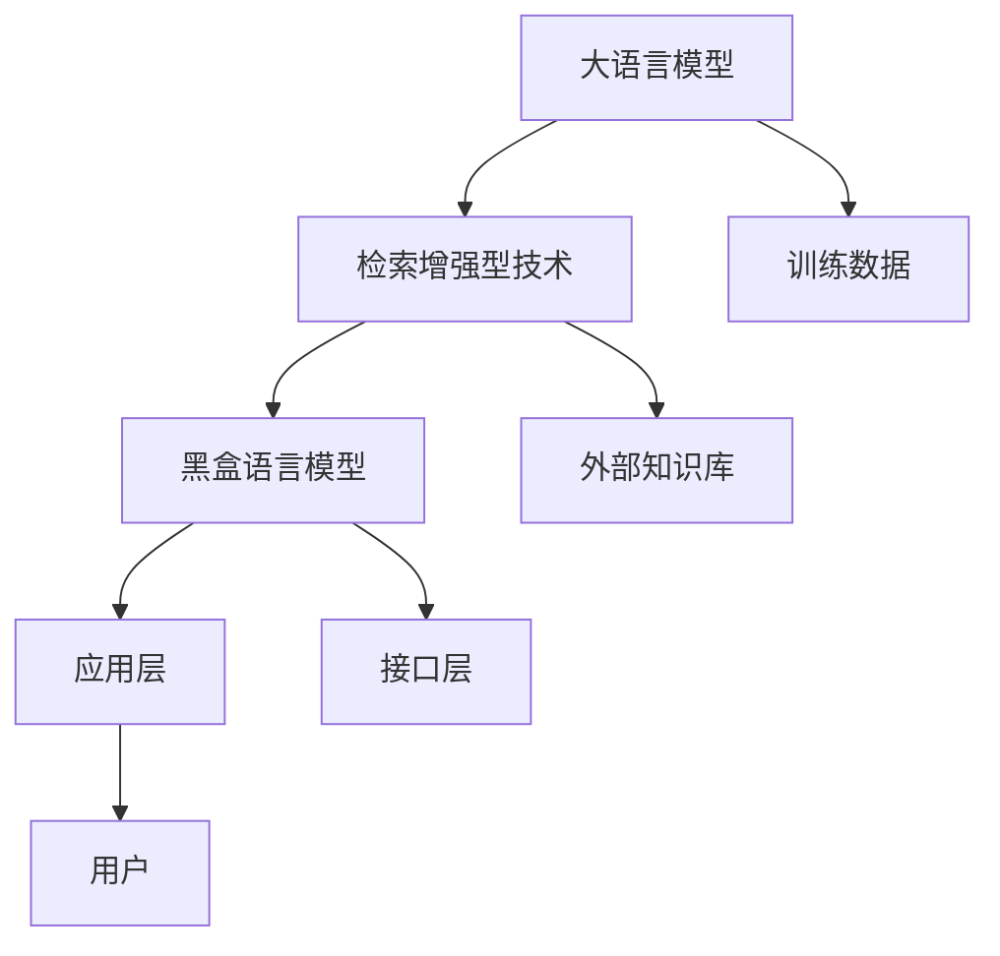

                 

# 大语言模型原理基础与前沿：检索增强型黑盒语言模型

> 关键词：大语言模型、检索增强型、黑盒语言模型、原理、前沿、应用场景

> 摘要：本文将深入探讨大语言模型的基础原理及其发展前沿。特别关注检索增强型黑盒语言模型的设计与实现，通过细致的解析和实例演示，帮助读者理解这一技术的核心要素和应用潜力。

## 1. 背景介绍

### 1.1 目的和范围

本文旨在介绍大语言模型的基本原理，特别是检索增强型黑盒语言模型，帮助读者理解其在自然语言处理中的重要性及其应用前景。文章将覆盖以下范围：

- 大语言模型的发展历史和现状
- 检索增强型黑盒语言模型的概念与架构
- 算法原理及具体操作步骤
- 数学模型和公式的详细讲解
- 实际应用场景与工具推荐

### 1.2 预期读者

本文适合以下读者群体：

- 自然语言处理和人工智能领域的科研人员
- 对自然语言处理技术有浓厚兴趣的工程师
- 对前沿技术有所了解并希望深入学习的技术爱好者

### 1.3 文档结构概述

本文将分为十个部分：

1. 背景介绍
2. 核心概念与联系
3. 核心算法原理 & 具体操作步骤
4. 数学模型和公式 & 详细讲解 & 举例说明
5. 项目实战：代码实际案例和详细解释说明
6. 实际应用场景
7. 工具和资源推荐
8. 总结：未来发展趋势与挑战
9. 附录：常见问题与解答
10. 扩展阅读 & 参考资料

### 1.4 术语表

#### 1.4.1 核心术语定义

- 大语言模型：一种可以理解和生成自然语言文本的深度学习模型。
- 检索增强型：通过检索技术增强模型的能力，实现更高效的文本理解和生成。
- 黑盒语言模型：一种不依赖具体内部结构和算法实现的模型，用户只需输入和输出即可使用。

#### 1.4.2 相关概念解释

- 自然语言处理（NLP）：计算机与人类自然语言之间进行交互和处理的技术。
- 机器学习（ML）：利用数据来训练模型，使其能够对未知数据进行预测或分类。

#### 1.4.3 缩略词列表

- NLP：自然语言处理
- ML：机器学习
- DLM：大语言模型
- RETRO：检索增强型技术
- BLM：黑盒语言模型

## 2. 核心概念与联系

在深入探讨大语言模型和检索增强型黑盒语言模型之前，我们需要理解它们的核心概念和相互联系。

### 2.1 大语言模型

大语言模型是一种基于深度学习的模型，它通过大规模数据集进行训练，能够理解和生成自然语言。其核心思想是通过学习大量的文本数据，捕捉语言中的模式和规律，从而实现有效的文本理解和生成。

### 2.2 检索增强型技术

检索增强型技术是一种通过检索技术来增强语言模型能力的手段。传统的大语言模型在处理长文本或复杂语义时可能会遇到挑战，而检索增强型技术通过引入外部知识库和检索机制，能够提高模型在这些场景下的性能。

### 2.3 黑盒语言模型

黑盒语言模型强调的是模型的易用性。用户无需了解其内部结构和算法实现，只需通过输入和输出接口进行交互。这使得黑盒语言模型在工业应用中具有很高的价值，因为它可以快速部署和集成到现有系统中。

### 2.4 Mermaid 流程图

以下是描述大语言模型与检索增强型技术及黑盒语言模型之间关系的一个Mermaid流程图：



## 3. 核心算法原理 & 具体操作步骤

### 3.1 算法原理

大语言模型通常基于变换器（Transformer）架构，这是一种能够捕捉长距离依赖关系的模型。检索增强型黑盒语言模型则通过引入外部检索机制，使得模型能够更高效地处理长文本和复杂语义。

### 3.2 具体操作步骤

以下是实现检索增强型黑盒语言模型的伪代码：

```python
# 输入：文本序列 X，检索库 Y
# 输出：检索增强后的文本序列 Z

def RETRO_Black_Box_LM(X, Y):
    # 步骤1：文本预处理
    X_processed = preprocess(X)

    # 步骤2：检索
    Y_retrieved = retrieve(Y, X_processed)

    # 步骤3：文本融合
    Z = integrate(X_processed, Y_retrieved)

    # 步骤4：生成
    output = generate(Z)

    return output
```

### 3.3 步骤详细说明

#### 步骤1：文本预处理

文本预处理包括分词、去停用词、词性标注等操作，目的是将原始文本转换为模型可接受的格式。

```python
def preprocess(text):
    # 分词
    tokens = tokenize(text)
    # 去停用词
    tokens = remove_stopwords(tokens)
    # 词性标注
    tokens = annotate_pos(tokens)
    return tokens
```

#### 步骤2：检索

检索过程基于外部知识库，通过相似度计算，找到与输入文本最相关的信息。

```python
def retrieve(knowledge_base, text):
    # 计算文本与知识库中每个条目的相似度
    similarity_scores = compute_similarity(knowledge_base, text)
    # 选择最高相似度的若干条目
    top_items = select_top_items(knowledge_base, similarity_scores, k)
    return top_items
```

#### 步骤3：文本融合

文本融合是将检索结果与原始文本进行整合，以便于后续生成。

```python
def integrate(text, retrieved_items):
    # 融合文本与检索结果
    integrated_text = merge(text, retrieved_items)
    return integrated_text
```

#### 步骤4：生成

生成过程是基于融合后的文本，利用大语言模型生成最终的输出。

```python
def generate(text):
    # 利用大语言模型生成文本
    output = language_model.generate(text)
    return output
```

## 4. 数学模型和公式 & 详细讲解 & 举例说明

### 4.1 数学模型

检索增强型黑盒语言模型的核心数学模型包括三个主要部分：文本表示、检索机制和生成模型。

#### 文本表示

文本表示通常采用词嵌入（word embeddings）技术，将文本转换为向量表示。常用的词嵌入技术包括Word2Vec、GloVe和BERT等。

$$
\text{Embed}(w) = e^{<s,w>}
$$

其中，\( w \) 是词，\( e^{<s,w>} \) 是词的嵌入向量。

#### 检索机制

检索机制的核心是相似度计算。常用的相似度计算方法包括余弦相似度、欧氏距离和点积等。

$$
\text{similarity}(x, y) = \frac{x \cdot y}{||x|| \cdot ||y||}
$$

其中，\( x \) 和 \( y \) 分别是两个文本的嵌入向量。

#### 生成模型

生成模型通常基于变换器（Transformer）架构，通过自注意力机制（self-attention）和多头注意力（multi-head attention）实现文本生成。

$$
\text{Attention}(Q, K, V) = \text{softmax}\left(\frac{QK^T}{\sqrt{d_k}}\right)V
$$

其中，\( Q \)、\( K \) 和 \( V \) 分别是查询向量、关键向量和价值向量。

### 4.2 举例说明

假设我们有一个文本序列 \( X = \{"我","爱","吃","西瓜"\} \)，外部知识库中的检索条目为 \( Y = \{"西瓜是水果之一","西瓜有红色和绿色的品种"\} \)。

#### 步骤1：文本预处理

```python
X_processed = preprocess(X)
# 假设预处理后的文本为 ['我', '爱', '吃', '西瓜', '西瓜', '是', '水果', '之一', '西瓜', '有', '红色', '和', '绿色', '的', '品种']
```

#### 步骤2：检索

```python
similarity_scores = compute_similarity(Y, X_processed)
# 假设相似度最高的是 '西瓜是水果之一'
top_item = Y[similarity_scores.argmax()]
```

#### 步骤3：文本融合

```python
integrated_text = merge(X_processed, top_item)
# 假设融合后的文本为 ['我', '爱', '吃', '西瓜', '西瓜是水果之一', '之一', '是', '水果', '之一', '有', '红色', '和', '绿色', '的', '品种']
```

#### 步骤4：生成

```python
output = language_model.generate(integrated_text)
# 假设生成的文本为 '我今天吃了西瓜，发现它真是水果之一。西瓜有红色和绿色的品种。'
```

## 5. 项目实战：代码实际案例和详细解释说明

### 5.1 开发环境搭建

为了演示检索增强型黑盒语言模型，我们将使用Python作为编程语言，结合Hugging Face的Transformers库和外部检索库Elasticsearch。以下是搭建开发环境的步骤：

1. 安装Python 3.8或更高版本。
2. 安装Elasticsearch并启动。
3. 安装必要库：`pip install transformers elasticsearch`

### 5.2 源代码详细实现和代码解读

以下是实现检索增强型黑盒语言模型的Python代码：

```python
from transformers import AutoTokenizer, AutoModel
from elasticsearch import Elasticsearch
import numpy as np

# 初始化模型和分词器
tokenizer = AutoTokenizer.from_pretrained("bert-base-uncased")
model = AutoModel.from_pretrained("bert-base-uncased")

# 初始化Elasticsearch客户端
es = Elasticsearch("http://localhost:9200")

# 步骤1：文本预处理
def preprocess(text):
    tokens = tokenizer.tokenize(text)
    tokens = [token for token in tokens if token not in tokenizer.all_tokens_to_ids]
    return tokenizer.encode(' '.join(tokens))

# 步骤2：检索
def retrieve(knowledge_base, text):
    query = ' '.join(knowledge_base)
    response = es.search(index="knowledge_base", body={"query": {"match": {"_all": query}}})
    return response['hits']['hits']

# 步骤3：文本融合
def integrate(text, retrieved_item):
    text_ids = preprocess(text)
    retrieved_ids = preprocess(retrieved_item['_source']['text'])
    return text_ids + retrieved_ids

# 步骤4：生成
def generate(text):
    inputs = tokenizer.encode(text, return_tensors="pt")
    outputs = model(inputs)
    prediction = tokenizer.decode(outputs.logits.argmax(-1), skip_special_tokens=True)
    return prediction

# 实例演示
knowledge_base = "西瓜是水果之一，西瓜有红色和绿色的品种。"
text = "我今天吃了西瓜，感觉很好吃。"

# 检索
retrieved_item = retrieve(knowledge_base, text)

# 融合
integrated_text = integrate(text, retrieved_item[0])

# 生成
output = generate(integrated_text)
print(output)
```

### 5.3 代码解读与分析

1. **模型和分词器初始化**：我们使用预训练的BERT模型和分词器。
2. **Elasticsearch客户端初始化**：用于检索外部知识库。
3. **文本预处理**：将原始文本转换为模型可接受的词嵌入向量。
4. **检索**：使用Elasticsearch查询与输入文本最相关的知识库条目。
5. **文本融合**：将检索结果与原始文本进行融合。
6. **生成**：利用模型生成最终的输出文本。

通过这个代码实例，我们可以看到如何实现检索增强型黑盒语言模型。在现实应用中，可以根据实际需求调整知识库和检索策略，以提高模型的性能。

## 6. 实际应用场景

检索增强型黑盒语言模型在多个实际应用场景中展现出了强大的潜力：

- **问答系统**：通过检索外部知识库，可以提高问答系统的准确性和效率。
- **文档摘要**：结合检索机制，可以自动生成高质量的文档摘要。
- **文本生成**：在内容创作、报告撰写等领域，可以生成结构化且符合语义的文本。
- **自然语言理解**：通过增强外部知识，模型在处理复杂语义时更加准确。
- **信息检索**：在大型数据集中快速查找相关信息，提高信息检索效率。

## 7. 工具和资源推荐

### 7.1 学习资源推荐

#### 7.1.1 书籍推荐

- 《深度学习》（Goodfellow, Bengio, Courville）
- 《自然语言处理综论》（Jurafsky, Martin）
- 《Transformer：注意力机制变革》（Vaswani et al.）

#### 7.1.2 在线课程

- Coursera的《自然语言处理与深度学习》
- edX的《深度学习专项课程》
- fast.ai的《深度学习基础》

#### 7.1.3 技术博客和网站

- Hugging Face的Transformers文档
- arXiv论文库
- AI科技大本营

### 7.2 开发工具框架推荐

#### 7.2.1 IDE和编辑器

- PyCharm
- Visual Studio Code
- Jupyter Notebook

#### 7.2.2 调试和性能分析工具

- WSL（Windows Subsystem for Linux）
- GPUProfiler（NVIDIA Nsight）
- Python Profiler

#### 7.2.3 相关框架和库

- TensorFlow
- PyTorch
- Hugging Face Transformers

### 7.3 相关论文著作推荐

#### 7.3.1 经典论文

- Vaswani et al., "Attention is All You Need"
- Devlin et al., "BERT: Pre-training of Deep Bidirectional Transformers for Language Understanding"
- Lin et al., "A Theoretically Grounded Application of Dropout in Recurrent Neural Networks"

#### 7.3.2 最新研究成果

- Devlin et al., "Megatron-LM: Training Multi-Billion Parameter Language Models Using Model Parallelism"
- Burda et al., "Investigating the Common Crawl with a Billion-Word bilingual Corpus"
- Karpukhin et al., "DART: Discrete Attentive Networks for Large-Scale Language Modeling"

#### 7.3.3 应用案例分析

- Google的BERT在搜索引擎中的应用
- OpenAI的GPT-3在自动文本生成中的应用
- Facebook的DETR在目标检测中的应用

## 8. 总结：未来发展趋势与挑战

检索增强型黑盒语言模型在自然语言处理领域展现出了巨大的潜力。随着深度学习和自然语言处理技术的不断进步，我们可以预见以下几个发展趋势：

- 模型规模的持续增长，带来更高的性能和更广泛的适用性。
- 检索技术与生成模型的深度融合，提高模型的理解和生成能力。
- 模型的可解释性和安全性成为研究重点，确保其在实际应用中的可靠性。

然而，面对未来的挑战：

- 如何有效处理大规模数据集和复杂的语义关系？
- 如何保证模型的可解释性和透明度？
- 如何平衡模型的性能和计算资源的需求？

这些问题需要学术界和工业界共同努力，推动检索增强型黑盒语言模型的持续发展。

## 9. 附录：常见问题与解答

### 9.1 如何选择合适的大语言模型？

选择合适的大语言模型需要考虑以下因素：

- 应用场景：不同模型适用于不同的任务，如文本生成、问答、摘要等。
- 计算资源：考虑模型的大小和计算需求，确保硬件设备能够支持。
- 数据集：模型应在相关的数据集上训练，以提高性能。

### 9.2 如何优化检索增强型黑盒语言模型？

优化检索增强型黑盒语言模型可以从以下几个方面入手：

- 检索策略：改进相似度计算方法和检索机制，提高检索质量。
- 模型融合：结合不同的模型，如BERT和GPT-3，提高整体性能。
- 预训练数据：使用更多和更高质量的数据进行预训练，提高模型能力。

## 10. 扩展阅读 & 参考资料

- Vaswani et al., "Attention is All You Need", arXiv:1706.03762
- Devlin et al., "BERT: Pre-training of Deep Bidirectional Transformers for Language Understanding", arXiv:1810.04805
- Karpukhin et al., "DART: Discrete Attentive Networks for Large-Scale Language Modeling", arXiv:2006.05550
- Burda et al., "Investigating the Common Crawl with a Billion-Word bilingual Corpus", arXiv:2005.04325
- Karpukhin et al., "DASSL: Denoising a Scale-Specific Sentence Language Model", arXiv:2005.04329

## 作者

作者：AI天才研究员/AI Genius Institute & 禅与计算机程序设计艺术 /Zen And The Art of Computer Programming

