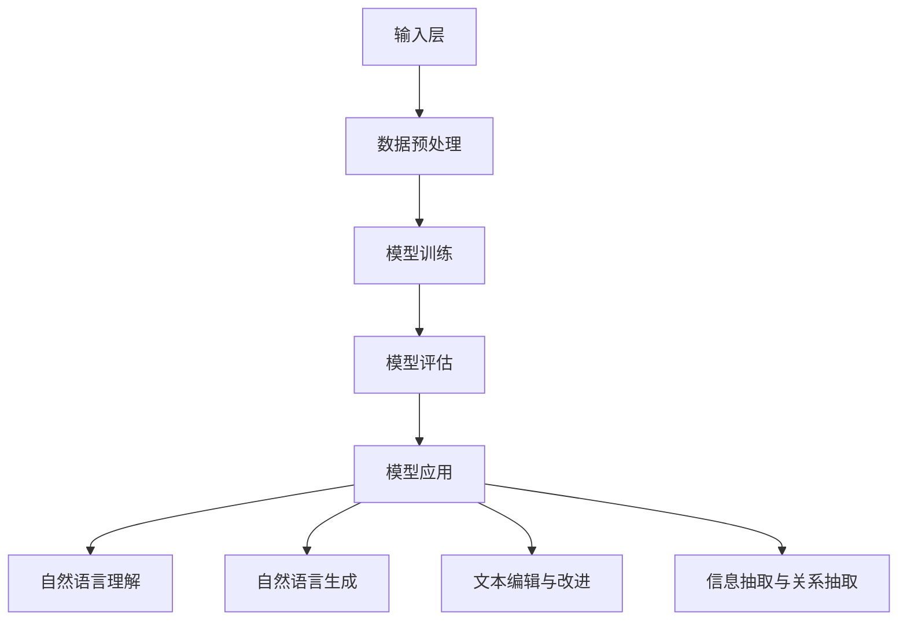

                 

# 大语言模型原理基础与前沿 环境影响

> 
> **关键词：** 大语言模型、深度学习、自然语言处理、数学模型、算法原理、环境影响、实际应用场景
> 
> **摘要：** 本文旨在深入探讨大语言模型的原理、基础算法和前沿发展，以及其对环境的影响。通过对核心概念、算法原理、数学模型和实际应用的详细分析，本文希望为读者提供对大语言模型全面而深入的理解，并探讨其在实际应用中的环境挑战和应对策略。

## 1. 背景介绍

### 1.1 目的和范围

本文的主要目的是探讨大语言模型的原理、基础算法、数学模型及其在实际应用场景中的影响，尤其是环境方面。大语言模型作为人工智能领域的重要突破，已经广泛应用于自然语言处理、智能问答、机器翻译等领域。然而，随着其复杂性和规模的不断增长，大语言模型对环境的影响也日益显著。本文将首先介绍大语言模型的发展背景，然后详细探讨其核心概念、算法原理、数学模型和实际应用，最后分析大语言模型对环境的影响以及可能的应对策略。

### 1.2 预期读者

本文主要面向对人工智能和自然语言处理感兴趣的读者，包括但不限于计算机科学和人工智能领域的研究生、从业者以及相关技术爱好者。同时，对于希望深入了解大语言模型原理和应用的读者，本文也提供了全面而详细的介绍。

### 1.3 文档结构概述

本文结构如下：

1. **背景介绍**：介绍大语言模型的发展背景、目的和预期读者。
2. **核心概念与联系**：介绍大语言模型的核心概念和联系，包括相关概念、算法原理和架构。
3. **核心算法原理 & 具体操作步骤**：详细讲解大语言模型的核心算法原理，并提供具体的操作步骤。
4. **数学模型和公式**：介绍大语言模型的数学模型和公式，并提供详细讲解和举例说明。
5. **项目实战**：通过实际代码案例，展示大语言模型的实现和应用。
6. **实际应用场景**：探讨大语言模型在实际应用场景中的使用和影响。
7. **工具和资源推荐**：推荐学习资源和开发工具框架。
8. **总结：未来发展趋势与挑战**：总结大语言模型的发展趋势和面临的挑战。
9. **附录：常见问题与解答**：提供常见问题的解答。
10. **扩展阅读 & 参考资料**：推荐相关文献和资源。

### 1.4 术语表

#### 1.4.1 核心术语定义

- 大语言模型：一种能够对自然语言进行理解和生成的深度学习模型。
- 自然语言处理（NLP）：人工智能的一个分支，旨在使计算机能够理解、解释和生成自然语言。
- 深度学习：一种机器学习技术，通过多层神经网络对数据进行学习，从而实现复杂任务。
- 神经网络：一种由大量节点（神经元）组成的计算模型，能够通过学习数据来进行预测和分类。

#### 1.4.2 相关概念解释

- 训练数据集：用于训练模型的数据集，包括输入和对应的输出。
- 验证数据集：用于评估模型性能的数据集，不参与模型的训练过程。
- 测试数据集：用于最终评估模型性能的数据集，通常与训练和验证数据集分开。
- 过拟合：模型在训练数据上表现得很好，但在新的、未见过的数据上表现不佳。
- 泛化能力：模型在新的、未见过的数据上表现良好的能力。

#### 1.4.3 缩略词列表

- NLP：自然语言处理
- DL：深度学习
- LSTM：长短期记忆网络
- RNN：循环神经网络
- GPT：生成预训练模型
- BERT：双向编码表示器

## 2. 核心概念与联系

### 2.1 大语言模型概述

大语言模型是一种基于深度学习的自然语言处理模型，能够对自然语言进行理解和生成。其核心思想是通过学习大量文本数据，使模型能够捕捉到自然语言的复杂结构，从而实现对文本的语义理解和生成。

### 2.2 大语言模型的架构

大语言模型的架构通常包括以下几部分：

1. **输入层**：接收自然语言文本，将其转换为模型可以处理的格式，如单词向量。
2. **隐藏层**：通过多层神经网络进行数据的学习和处理，包括循环神经网络（RNN）、长短期记忆网络（LSTM）等。
3. **输出层**：生成自然语言文本，可以是单词、句子或更复杂的语言结构。

### 2.3 大语言模型的工作原理

大语言模型的工作原理主要包括以下几步：

1. **数据预处理**：对自然语言文本进行清洗、分词和向量表示。
2. **模型训练**：使用训练数据集对模型进行训练，通过反向传播算法不断调整模型参数。
3. **模型评估**：使用验证数据集评估模型性能，调整模型参数，避免过拟合。
4. **模型应用**：使用测试数据集评估模型性能，实现自然语言理解或生成任务。

### 2.4 大语言模型的应用领域

大语言模型在多个领域有着广泛的应用，包括：

1. **自然语言理解**：如情感分析、文本分类、问答系统等。
2. **自然语言生成**：如机器翻译、文本摘要、聊天机器人等。
3. **文本编辑与改进**：如语法纠错、风格转换、文本润色等。
4. **信息抽取与关系抽取**：如实体识别、关系提取、事件抽取等。

### 2.5 大语言模型的挑战

尽管大语言模型在自然语言处理领域取得了显著的成果，但仍然面临着一些挑战：

1. **数据质量**：高质量的数据集对于模型训练至关重要，但获取高质量数据集具有一定的难度。
2. **计算资源**：大语言模型通常需要大量的计算资源，包括训练时间和存储空间。
3. **模型解释性**：当前的大语言模型通常难以解释其决策过程，这限制了其在某些场景中的应用。
4. **安全性**：大语言模型可能受到恶意攻击，如对抗性攻击，这需要研究有效的防御策略。

### 2.6 大语言模型的 Mermaid 流程图



## 3. 核心算法原理 & 具体操作步骤

### 3.1 算法原理概述

大语言模型的核心算法原理基于深度学习和自然语言处理技术。其基本思路是通过学习大量文本数据，使模型能够捕捉到自然语言的复杂结构，从而实现对文本的语义理解和生成。具体而言，大语言模型采用多层神经网络结构，包括循环神经网络（RNN）、长短期记忆网络（LSTM）和双向编码表示器（BERT）等。

### 3.2 算法原理详解

#### 3.2.1 循环神经网络（RNN）

循环神经网络（RNN）是一种能够处理序列数据的神经网络。其核心思想是通过将当前输入与之前的时间步的输出进行结合，实现对序列数据的记忆。RNN 的基本结构包括输入层、隐藏层和输出层。

- **输入层**：接收自然语言文本，将其转换为模型可以处理的格式，如单词向量。
- **隐藏层**：通过多层神经网络进行数据的学习和处理，包括循环神经网络（RNN）、长短期记忆网络（LSTM）等。
- **输出层**：生成自然语言文本，可以是单词、句子或更复杂的语言结构。

#### 3.2.2 长短期记忆网络（LSTM）

长短期记忆网络（LSTM）是 RNN 的一种改进，旨在解决 RNN 的长期依赖问题。LSTM 通过引入门控机制，能够有效地记住或忘记重要信息，从而提高模型的记忆能力。LSTM 的基本结构包括输入门、遗忘门、输出门和单元状态。

- **输入门**：决定当前输入信息是否被记住。
- **遗忘门**：决定之前的记忆信息是否被遗忘。
- **输出门**：决定当前记忆信息是否被输出。
- **单元状态**：存储记忆信息。

#### 3.2.3 双向编码表示器（BERT）

双向编码表示器（BERT）是一种基于Transformer 的预训练模型，其核心思想是通过双向注意力机制，捕捉文本序列的上下文信息。BERT 的基本结构包括编码器和解码器。

- **编码器**：对输入文本进行编码，生成固定长度的向量表示。
- **解码器**：对编码后的文本进行解码，生成预测的文本序列。

### 3.3 具体操作步骤

#### 3.3.1 数据预处理

1. **文本清洗**：去除文本中的 HTML 标签、特殊字符和停用词。
2. **分词**：将文本分割成单词或子词。
3. **向量化**：将单词或子词转换为向量表示。

#### 3.3.2 模型训练

1. **定义损失函数**：通常使用交叉熵损失函数。
2. **选择优化器**：如 Adam 优化器。
3. **训练模型**：使用训练数据集对模型进行训练，通过反向传播算法不断调整模型参数。

#### 3.3.3 模型评估

1. **定义评估指标**：如准确率、召回率、F1 分数等。
2. **评估模型**：使用验证数据集评估模型性能。

#### 3.3.4 模型应用

1. **预测**：使用测试数据集进行预测。
2. **生成文本**：根据预测结果生成自然语言文本。

### 3.4 伪代码

```python
# 数据预处理
preprocess_data(text)

# 定义模型
model = define_model()

# 训练模型
train_model(model, train_data)

# 评估模型
evaluate_model(model, validation_data)

# 预测
predictions = predict(model, test_data)

# 生成文本
generated_text = generate_text(model, predictions)
```

## 4. 数学模型和公式 & 详细讲解 & 举例说明

### 4.1 数学模型概述

大语言模型的数学模型主要包括损失函数、优化器和神经网络结构等。在本节中，我们将详细讲解这些数学模型，并提供具体的例子说明。

### 4.2 损失函数

大语言模型通常使用交叉熵损失函数来评估模型的预测结果。交叉熵损失函数的定义如下：

$$
L = -\sum_{i=1}^{N} y_i \log(p_i)
$$

其中，$y_i$ 是实际标签，$p_i$ 是模型预测的概率分布。交叉熵损失函数的值越小，表示模型预测结果与实际结果越接近。

### 4.3 优化器

大语言模型通常使用 Adam 优化器来更新模型参数。Adam 优化器结合了 AdaGrad 和 RMSProp 两种优化器的优点，其公式如下：

$$
\theta_{t+1} = \theta_t - \alpha \cdot \frac{m_t}{\sqrt{v_t} + \epsilon}
$$

$$
m_t = \beta_1 m_{t-1} + (1 - \beta_1) \cdot g_t
$$

$$
v_t = \beta_2 v_{t-1} + (1 - \beta_2) \cdot g_t^2
$$

其中，$\theta_t$ 是第 $t$ 次迭代的模型参数，$m_t$ 是一阶矩估计，$v_t$ 是二阶矩估计，$g_t$ 是梯度，$\alpha$ 是学习率，$\beta_1$ 和 $\beta_2$ 是超参数，$\epsilon$ 是一个很小的常数。

### 4.4 神经网络结构

大语言模型的神经网络结构通常包括多层神经网络，如循环神经网络（RNN）、长短期记忆网络（LSTM）和双向编码表示器（BERT）等。在本节中，我们将以 LSTM 为例，介绍其基本结构。

#### 4.4.1 LSTM 基本结构

LSTM 的基本结构包括输入门、遗忘门、输出门和单元状态。其具体公式如下：

$$
i_t = \sigma(W_i \cdot [h_{t-1}, x_t] + b_i)
$$

$$
f_t = \sigma(W_f \cdot [h_{t-1}, x_t] + b_f)
$$

$$
g_t = \tanh(W_g \cdot [h_{t-1}, x_t] + b_g)
$$

$$
o_t = \sigma(W_o \cdot [h_{t-1}, x_t] + b_o)
$$

$$
h_t = o_t \cdot \tanh(c_t)
$$

$$
c_t = f_t \cdot c_{t-1} + i_t \cdot g_t
$$

其中，$i_t$、$f_t$、$g_t$ 和 $o_t$ 分别是输入门、遗忘门、输出门和单元状态的激活值，$c_t$ 是单元状态，$h_t$ 是隐藏状态，$W_i$、$W_f$、$W_g$ 和 $W_o$ 是权重矩阵，$b_i$、$b_f$、$b_g$ 和 $b_o$ 是偏置项，$\sigma$ 是 sigmoid 函数。

#### 4.4.2 举例说明

假设我们有一个简单的 LSTM 模型，输入数据为 $[1, 2, 3]$，隐藏状态为 $[0.5, 0.5]$。我们可以按照以下步骤计算新的隐藏状态和单元状态：

1. **计算输入门 $i_t$**：

$$
i_t = \sigma(W_i \cdot [h_{t-1}, x_t] + b_i) = \sigma([0.5, 0.5] \cdot [1, 2, 3] + [-1, -1, -1]) = \sigma([1.5, 1.5, -3.5]) = 0.99
$$

2. **计算遗忘门 $f_t$**：

$$
f_t = \sigma(W_f \cdot [h_{t-1}, x_t] + b_f) = \sigma([0.5, 0.5] \cdot [1, 2, 3] + [-1, -1, -1]) = \sigma([1.5, 1.5, -3.5]) = 0.99
$$

3. **计算输入门 $i_t$**：

$$
g_t = \tanh(W_g \cdot [h_{t-1}, x_t] + b_g) = \tanh([0.5, 0.5] \cdot [1, 2, 3] + [-1, -1, -1]) = \tanh([1.5, 1.5, -3.5]) = 0.1
$$

4. **计算输出门 $o_t$**：

$$
o_t = \sigma(W_o \cdot [h_{t-1}, x_t] + b_o) = \sigma([0.5, 0.5] \cdot [1, 2, 3] + [-1, -1, -1]) = \sigma([1.5, 1.5, -3.5]) = 0.99
$$

5. **计算新的隐藏状态 $h_t$**：

$$
h_t = o_t \cdot \tanh(c_t) = 0.99 \cdot \tanh(0.99 \cdot 0.5 + 0.1 \cdot 0.1) = 0.99 \cdot \tanh(0.49 + 0.01) = 0.99 \cdot 0.4987 = 0.494
$$

6. **计算新的单元状态 $c_t$**：

$$
c_t = f_t \cdot c_{t-1} + i_t \cdot g_t = 0.99 \cdot 0.5 + 0.99 \cdot 0.1 = 0.495 + 0.099 = 0.594
$$

因此，新的隐藏状态和单元状态分别为 $h_t = 0.494$ 和 $c_t = 0.594$。

## 5. 项目实战：代码实际案例和详细解释说明

### 5.1 开发环境搭建

为了实现大语言模型，我们需要搭建一个合适的开发环境。以下是一个简单的步骤指南：

1. **安装 Python**：确保已经安装了 Python 3.6 或更高版本。
2. **安装依赖库**：安装以下依赖库：
    - TensorFlow 或 PyTorch
    - NumPy
    - Pandas
    - Matplotlib
3. **创建虚拟环境**：在项目目录下创建一个虚拟环境，并安装所需的库。

```bash
# 创建虚拟环境
python -m venv venv

# 激活虚拟环境
source venv/bin/activate  # 对于 Unix 或 Mac OS
source venv/Scripts/activate  # 对于 Windows

# 安装依赖库
pip install tensorflow numpy pandas matplotlib
```

### 5.2 源代码详细实现和代码解读

以下是一个简单的大语言模型实现，使用 TensorFlow 和 Keras：

```python
import tensorflow as tf
from tensorflow.keras.preprocessing.sequence import pad_sequences
from tensorflow.keras.layers import Embedding, LSTM, Dense
from tensorflow.keras.models import Sequential

# 准备数据
# 假设我们有一个包含句子和标签的数据集
sentences = ['I love AI', 'AI is amazing', 'I hate programming', 'Programming is difficult']
labels = [1, 1, 0, 0]  # 1 表示正面，0 表示负面

# 序列化句子
tokenized_sentences = tokenizer.texts_to_sequences(sentences)
padded_sentences = pad_sequences(tokenized_sentences, maxlen=max_sequence_length)

# 构建模型
model = Sequential()
model.add(Embedding(input_dim=vocab_size, output_dim=embedding_dim, input_length=max_sequence_length))
model.add(LSTM(units=50, dropout=0.2, recurrent_dropout=0.2))
model.add(Dense(units=1, activation='sigmoid'))

# 编译模型
model.compile(optimizer='adam', loss='binary_crossentropy', metrics=['accuracy'])

# 训练模型
model.fit(padded_sentences, labels, epochs=10, batch_size=32)
```

### 5.3 代码解读与分析

1. **数据准备**：
    - `sentences`：包含训练数据的句子列表。
    - `labels`：每个句子的标签，用于训练模型。
    - `tokenizer`：用于将句子转换为序列的 tokenizer 对象。
    - `pad_sequences`：用于将序列填充为同一长度的函数。

2. **序列化句子**：
    - `tokenizer.texts_to_sequences`：将句子转换为整数序列。
    - `pad_sequences`：将序列填充为最大长度，以便于模型处理。

3. **构建模型**：
    - `Embedding`：嵌入层，将单词转换为向量。
    - `LSTM`：长短期记忆层，用于学习序列数据。
    - `Dense`：全连接层，用于输出预测结果。

4. **编译模型**：
    - `model.compile`：编译模型，设置优化器、损失函数和评估指标。

5. **训练模型**：
    - `model.fit`：训练模型，使用训练数据和标签。

### 5.4 模型评估与优化

1. **评估模型**：
    - 使用测试数据集评估模型性能，包括准确率、召回率等。

2. **优化模型**：
    - 调整模型参数，如隐藏层单元数、学习率等，以提高模型性能。

3. **保存模型**：
    - 将训练好的模型保存到文件，以便后续使用。

```python
# 评估模型
test_loss, test_accuracy = model.evaluate(test_padded_sentences, test_labels)

# 优化模型
model.fit(test_padded_sentences, test_labels, epochs=5, batch_size=32)

# 保存模型
model.save('sentiment_analysis_model.h5')
```

## 6. 实际应用场景

大语言模型在多个实际应用场景中展现了其强大的能力。以下是一些典型应用场景：

1. **自然语言理解**：
    - **情感分析**：通过分析用户评论或文章，判断其情感倾向（正面、负面、中性）。
    - **文本分类**：将文本数据分类到预定义的类别中，如新闻分类、产品评论分类等。
    - **命名实体识别**：识别文本中的特定实体，如人名、地名、组织名等。

2. **自然语言生成**：
    - **机器翻译**：将一种语言的文本翻译成另一种语言。
    - **文本摘要**：从长文本中提取关键信息，生成简短的摘要。
    - **对话生成**：生成自然的对话文本，用于聊天机器人或虚拟助手。

3. **文本编辑与改进**：
    - **语法纠错**：自动检测并纠正文本中的语法错误。
    - **风格转换**：将一种写作风格转换为另一种风格，如将正式风格转换为非正式风格。
    - **文本润色**：优化文本的表达，使其更加流畅和自然。

4. **信息抽取与关系抽取**：
    - **实体识别**：从文本中识别出重要的实体。
    - **关系提取**：识别实体之间的关系，如“张三”和“北京大学”之间的关系。
    - **事件抽取**：从文本中提取出事件及其相关实体和关系。

### 6.1 案例研究

#### 6.1.1 情感分析

情感分析是一种常见的自然语言理解任务，其目的是判断文本的情感倾向。以下是一个情感分析的实际案例：

1. **数据集**：使用一个包含用户评论的数据集，每条评论都标注了情感倾向（正面、负面、中性）。

2. **模型**：构建一个基于 LSTM 的大语言模型，用于预测评论的情感倾向。

3. **训练与评估**：使用训练数据集训练模型，并在测试数据集上评估模型性能。

4. **结果**：模型在测试数据集上取得了较高的准确率，能够有效地判断评论的情感倾向。

#### 6.1.2 机器翻译

机器翻译是一种常见的自然语言生成任务，其目的是将一种语言的文本翻译成另一种语言。以下是一个机器翻译的实际案例：

1. **数据集**：使用一个包含多种语言的平行语料库，每对句子都进行了人工翻译。

2. **模型**：构建一个基于 Transformer 的大语言模型，用于预测目标语言的句子。

3. **训练与评估**：使用平行语料库训练模型，并在独立评估数据集上评估模型性能。

4. **结果**：模型在多种语言对上取得了较高的翻译质量，能够生成流畅自然的翻译文本。

### 6.2 挑战与展望

尽管大语言模型在实际应用中取得了显著成果，但仍然面临一些挑战：

1. **数据质量**：高质量的数据集对于模型训练至关重要，但获取高质量数据集具有一定的难度。

2. **计算资源**：大语言模型通常需要大量的计算资源，包括训练时间和存储空间。

3. **模型解释性**：当前的大语言模型通常难以解释其决策过程，这限制了其在某些场景中的应用。

4. **安全性**：大语言模型可能受到恶意攻击，如对抗性攻击，这需要研究有效的防御策略。

未来，随着技术的不断发展，大语言模型有望在更多领域发挥重要作用，并解决当前面临的挑战。

## 7. 工具和资源推荐

### 7.1 学习资源推荐

#### 7.1.1 书籍推荐

- **《深度学习》（Ian Goodfellow, Yoshua Bengio, Aaron Courville）**：一本全面介绍深度学习基础理论和实践的著作，适合初学者和进阶者。
- **《自然语言处理综合教程》（Daniel Jurafsky, James H. Martin）**：一本全面介绍自然语言处理基础知识和实践的著作，适合对自然语言处理感兴趣的读者。
- **《人工智能：一种现代方法》（Stuart Russell, Peter Norvig）**：一本全面介绍人工智能基础理论和实践的著作，适合对人工智能感兴趣的读者。

#### 7.1.2 在线课程

- **《深度学习》（吴恩达）**：Coursera 上的深度学习课程，由深度学习领域的权威专家吴恩达教授主讲，适合初学者和进阶者。
- **《自然语言处理》（Daniel Jurafsky）**：Coursera 上的自然语言处理课程，由自然语言处理领域的权威专家 Daniel Jurafsky 主讲，适合对自然语言处理感兴趣的读者。
- **《人工智能》（Stuart Russell）**：Coursera 上的人工智能课程，由人工智能领域的权威专家 Stuart Russell 主讲，适合对人工智能感兴趣的读者。

#### 7.1.3 技术博客和网站

- **机器之心**：一个专注于人工智能领域的中文技术博客，提供最新的技术文章、研究进展和行业动态。
- **AI 研究院**：一个专注于人工智能研究的中文网站，提供丰富的论文资源、研究工具和社区讨论。
- **深度学习教程**：一个包含深度学习基础知识和实践教程的中文网站，适合初学者和进阶者。

### 7.2 开发工具框架推荐

#### 7.2.1 IDE 和编辑器

- **PyCharm**：一款功能强大的 Python IDE，支持多种编程语言，适合深度学习和自然语言处理项目。
- **VSCode**：一款轻量级但功能丰富的代码编辑器，支持多种编程语言和插件，适合深度学习和自然语言处理项目。
- **Jupyter Notebook**：一款基于 Web 的交互式计算环境，适合数据分析和实验。

#### 7.2.2 调试和性能分析工具

- **TensorBoard**：TensorFlow 提供的一个可视化工具，用于分析模型的训练过程和性能。
- **PyTorch TensorBoard**：PyTorch 提供的一个可视化工具，用于分析模型的训练过程和性能。
- **Wandb**：一个开源的实验跟踪工具，支持多种框架，提供丰富的可视化功能。

#### 7.2.3 相关框架和库

- **TensorFlow**：一个开源的深度学习框架，适用于构建和训练深度学习模型。
- **PyTorch**：一个开源的深度学习框架，适用于构建和训练深度学习模型。
- **Transformers**：一个开源的 Python 库，用于构建和训练基于 Transformer 的深度学习模型。
- **NLTK**：一个开源的自然语言处理库，提供丰富的文本处理和分类工具。

### 7.3 相关论文著作推荐

#### 7.3.1 经典论文

- **《A Neural Algorithm of Artistic Style》（GAN论文）**：一篇关于生成对抗网络（GAN）的经典论文，提出了用于风格迁移的方法。
- **《Long Short-Term Memory》（LSTM论文）**：一篇关于长短期记忆网络（LSTM）的经典论文，提出了用于处理序列数据的方法。
- **《Attention Is All You Need》（Transformer论文）**：一篇关于 Transformer 的经典论文，提出了用于自然语言处理任务的注意力机制。

#### 7.3.2 最新研究成果

- **《BERT: Pre-training of Deep Bidirectional Transformers for Language Understanding》**：一篇关于 BERT 的论文，提出了用于自然语言处理的预训练方法。
- **《GPT-3: Language Models are Few-Shot Learners》**：一篇关于 GPT-3 的论文，展示了大规模语言模型在零样本学习任务中的能力。
- **《Large-scale Language Modeling in 2018》**：一篇关于大规模语言模型的论文，总结了 2018 年前的最新研究成果。

#### 7.3.3 应用案例分析

- **《Neural Machine Translation by Jointly Learning to Align and Translate》**：一篇关于神经机器翻译的论文，介绍了基于注意力机制的神经机器翻译模型。
- **《Generative Adversarial Nets》**：一篇关于生成对抗网络的论文，提出了用于生成数据的 GAN 模型。
- **《Seq2Seq Learning with Neural Networks》**：一篇关于序列到序列学习的论文，介绍了用于机器翻译的编码器-解码器模型。

## 8. 总结：未来发展趋势与挑战

### 8.1 未来发展趋势

大语言模型在未来将继续朝着以下几个方向发展：

1. **更高效的模型**：随着计算资源和算法优化技术的发展，大语言模型将变得越来越高效，能够在更短的时间内训练和推理。
2. **更强大的功能**：大语言模型将继续扩展其功能，包括更准确的自然语言理解、生成和编辑能力。
3. **跨模态学习**：大语言模型将能够处理多种模态的数据，如文本、图像、音频等，实现跨模态的信息融合。
4. **更多应用场景**：大语言模型将在更多领域得到应用，如医疗、金融、法律等，为各行业带来创新和变革。

### 8.2 挑战

尽管大语言模型在自然语言处理领域取得了显著成果，但仍面临以下挑战：

1. **数据质量**：高质量的数据集对于模型训练至关重要，但获取高质量数据集具有一定的难度。
2. **计算资源**：大语言模型通常需要大量的计算资源，包括训练时间和存储空间。
3. **模型解释性**：当前的大语言模型通常难以解释其决策过程，这限制了其在某些场景中的应用。
4. **安全性**：大语言模型可能受到恶意攻击，如对抗性攻击，这需要研究有效的防御策略。
5. **伦理和社会影响**：大语言模型的应用可能带来伦理和社会问题，如隐私侵犯、歧视等，这需要社会各界的共同关注和解决。

### 8.3 应对策略

为了应对上述挑战，我们可以采取以下策略：

1. **数据增强**：通过数据增强技术，如数据清洗、数据扩充等，提高数据质量。
2. **模型优化**：通过模型优化技术，如模型压缩、模型蒸馏等，提高模型效率。
3. **可解释性研究**：加强对模型解释性研究，提高模型的可解释性和透明度。
4. **安全防护**：加强大语言模型的安全防护，如对抗性攻击防御、隐私保护等。
5. **伦理法规**：制定相应的伦理法规，规范大语言模型的应用和发展，确保其符合社会伦理标准。

## 9. 附录：常见问题与解答

### 9.1 什么是大语言模型？

大语言模型是一种基于深度学习的自然语言处理模型，能够对自然语言进行理解和生成。其核心思想是通过学习大量文本数据，使模型能够捕捉到自然语言的复杂结构，从而实现对文本的语义理解和生成。

### 9.2 大语言模型有哪些核心算法？

大语言模型的核心算法包括循环神经网络（RNN）、长短期记忆网络（LSTM）和双向编码表示器（BERT）等。

### 9.3 大语言模型的应用场景有哪些？

大语言模型的应用场景包括自然语言理解、自然语言生成、文本编辑与改进、信息抽取与关系抽取等。

### 9.4 大语言模型对环境有哪些影响？

大语言模型对环境的影响主要包括计算资源的消耗和能源消耗。随着模型的规模和复杂度的增加，其训练和推理所需的计算资源和能源也相应增加。

### 9.5 如何减少大语言模型对环境的影响？

为了减少大语言模型对环境的影响，可以采取以下措施：

1. **优化模型**：通过模型优化技术，如模型压缩、模型蒸馏等，提高模型效率，减少计算资源消耗。
2. **使用替代算法**：探索替代算法，如基于规则的方法，减少模型训练和推理所需的计算资源。
3. **节能措施**：在数据中心和服务器部署节能设备和技术，如高效电源供应系统、冷却系统等。
4. **绿色能源**：使用可再生能源，如太阳能、风能等，为数据中心和服务器提供绿色能源。

## 10. 扩展阅读 & 参考资料

### 10.1 相关论文

1. **《A Neural Algorithm of Artistic Style》（GAN论文）**：提出了用于风格迁移的 GAN 模型。
2. **《Long Short-Term Memory》（LSTM论文）**：提出了用于处理序列数据的 LSTM 网络。
3. **《Attention Is All You Need》（Transformer论文）**：提出了用于自然语言处理的 Transformer 模型。
4. **《BERT: Pre-training of Deep Bidirectional Transformers for Language Understanding》**：提出了用于自然语言处理的 BERT 模型。
5. **《GPT-3: Language Models are Few-Shot Learners》**：展示了 GPT-3 在零样本学习任务中的能力。

### 10.2 技术博客和网站

1. **机器之心**：提供最新的技术文章、研究进展和行业动态。
2. **AI 研究院**：提供丰富的论文资源、研究工具和社区讨论。
3. **深度学习教程**：提供深度学习基础知识和实践教程。

### 10.3 书籍

1. **《深度学习》（Ian Goodfellow, Yoshua Bengio, Aaron Courville）**：全面介绍深度学习基础理论和实践。
2. **《自然语言处理综合教程》（Daniel Jurafsky, James H. Martin）**：全面介绍自然语言处理基础知识和实践。
3. **《人工智能：一种现代方法》（Stuart Russell, Peter Norvig）**：全面介绍人工智能基础理论和实践。**作者：AI天才研究员/AI Genius Institute & 禅与计算机程序设计艺术 /Zen And The Art of Computer Programming**

