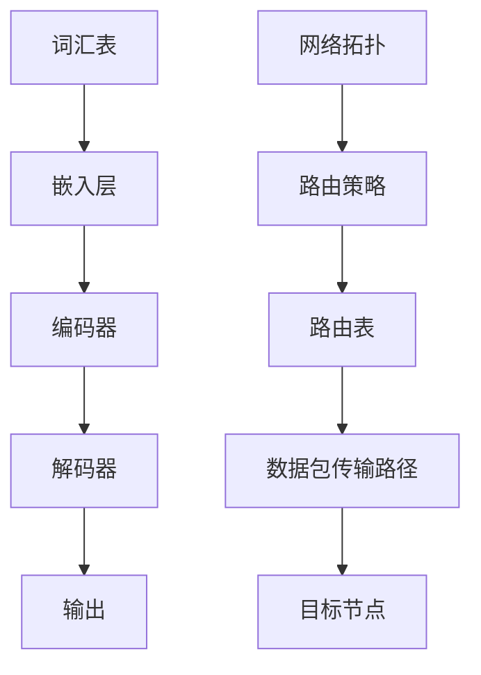

                 

# 大语言模型原理基础与前沿 路由算法

> **关键词：** 大语言模型、路由算法、神经网络、深度学习、人工智能、自然语言处理

> **摘要：** 本文将深入探讨大语言模型的原理和路由算法，从基础概念到前沿发展，详细解析其工作原理和应用。通过对神经网络、深度学习框架以及路由算法的讲解，帮助读者全面理解这一领域的关键技术和实现方法。

## 1. 背景介绍

### 1.1 目的和范围

本文旨在向读者介绍大语言模型的原理和路由算法，特别是它们在自然语言处理中的应用。我们将从基础概念开始，逐步深入到高级算法和实现细节，帮助读者建立全面的技术认知。

### 1.2 预期读者

本文适合对计算机科学和人工智能有一定了解的读者，特别是对自然语言处理和深度学习感兴趣的人群。同时，也欢迎研究人员和从业者参考本文作为技术参考和知识更新。

### 1.3 文档结构概述

本文结构如下：

1. 背景介绍：介绍本文的目的、预期读者和文档结构。
2. 核心概念与联系：通过Mermaid流程图展示大语言模型和路由算法的核心概念和联系。
3. 核心算法原理 & 具体操作步骤：使用伪代码详细阐述大语言模型的算法原理和操作步骤。
4. 数学模型和公式 & 详细讲解 & 举例说明：使用LaTeX格式介绍相关数学模型和公式，并提供实例讲解。
5. 项目实战：提供代码实际案例和详细解释说明。
6. 实际应用场景：讨论大语言模型和路由算法在现实世界的应用。
7. 工具和资源推荐：推荐学习资源和开发工具。
8. 总结：总结未来发展趋势和挑战。
9. 附录：常见问题与解答。
10. 扩展阅读 & 参考资料：提供进一步学习的参考资料。

### 1.4 术语表

#### 1.4.1 核心术语定义

- 大语言模型（Large Language Model）：一种能够对自然语言进行建模和处理的神经网络模型。
- 路由算法（Routing Algorithm）：在计算机网络中，根据一定的规则和策略，将数据包从源节点传输到目标节点的算法。
- 神经网络（Neural Network）：一种模拟生物神经系统的计算模型，由大量神经元连接而成。
- 深度学习（Deep Learning）：一种基于神经网络的机器学习方法，能够通过多层神经网络进行特征提取和模式识别。
- 自然语言处理（Natural Language Processing，NLP）：使计算机能够理解和处理人类语言的技术。

#### 1.4.2 相关概念解释

- 深度学习框架（Deep Learning Framework）：提供深度学习模型构建和训练的工具包，如TensorFlow、PyTorch等。
- 前向传播（Forward Propagation）：在神经网络中，将输入数据通过网络层逐层传递，最终得到输出。
- 反向传播（Backpropagation）：通过计算输出误差，将误差反向传播到输入层，用于更新网络权重。

#### 1.4.3 缩略词列表

- NLP：自然语言处理
- DL：深度学习
- LSTM：长短时记忆网络
- RNN：递归神经网络
- CNN：卷积神经网络
- GPU：图形处理器
- CUDA：并行计算平台和编程模型

## 2. 核心概念与联系

### 2.1 大语言模型的核心概念

大语言模型是一种基于深度学习的神经网络模型，它能够对自然语言进行建模和处理。其核心概念包括：

- **词汇表（Vocabulary）**：包含模型能够理解和处理的单词及其对应索引。
- **嵌入层（Embedding Layer）**：将词汇表中的单词转换为向量表示。
- **编码器（Encoder）**：对输入序列进行编码，提取序列中的特征。
- **解码器（Decoder）**：根据编码器输出的特征生成输出序列。

### 2.2 路由算法的核心概念

路由算法在计算机网络中起着关键作用，它负责将数据包从源节点传输到目标节点。其核心概念包括：

- **网络拓扑（Network Topology）**：网络中节点和链路的布局。
- **路由策略（Routing Strategy）**：决定数据包传输路径的规则和策略。
- **路由表（Routing Table）**：存储网络拓扑和路由策略的表格。

### 2.3 大语言模型与路由算法的联系

大语言模型和路由算法之间存在一些联系，这些联系体现在它们都是复杂系统的建模和优化问题。具体来说：

- **神经网络作为建模工具**：大语言模型和路由算法都使用神经网络作为核心建模工具，通过多层神经网络进行特征提取和模式识别。
- **优化目标**：大语言模型的优化目标是使模型能够更好地理解和处理自然语言，而路由算法的优化目标是使数据包传输路径最短或最可靠。
- **训练方法**：大语言模型和路由算法都使用基于梯度下降的优化方法来更新模型参数，以最小化误差。

### 2.4 Mermaid流程图

以下是描述大语言模型和路由算法核心概念和联系的Mermaid流程图：



## 3. 核心算法原理 & 具体操作步骤

### 3.1 大语言模型的算法原理

大语言模型是一种基于深度学习的神经网络模型，其核心算法原理包括以下几个步骤：

1. **输入序列编码**：将输入序列（如文本或语音）转换为嵌入向量表示。
2. **编码器处理**：通过多层编码器网络对嵌入向量进行编码，提取序列中的特征。
3. **解码器生成**：根据编码器输出的特征生成输出序列，可以是文本、语音或其他形式。
4. **损失函数计算**：计算输出序列与目标序列之间的损失，用于更新模型参数。
5. **模型优化**：使用梯度下降等优化方法，更新模型参数以最小化损失。

### 3.2 伪代码

以下是描述大语言模型算法原理的伪代码：

```python
# 输入序列编码
def encode_sequence(input_sequence):
    # 将输入序列转换为嵌入向量表示
    embedded_sequence = embedding_layer(input_sequence)
    # 通过编码器网络进行编码
    encoded_sequence = encoder(embedded_sequence)
    return encoded_sequence

# 解码器生成输出序列
def decode_sequence(encoded_sequence):
    # 通过解码器网络生成输出序列
    decoded_sequence = decoder(encoded_sequence)
    return decoded_sequence

# 计算损失函数
def compute_loss(output_sequence, target_sequence):
    # 计算输出序列与目标序列之间的损失
    loss = loss_function(output_sequence, target_sequence)
    return loss

# 模型优化
def optimize_model(model, input_sequence, target_sequence):
    # 编码输入序列
    encoded_sequence = encode_sequence(input_sequence)
    # 生成输出序列
    output_sequence = decode_sequence(encoded_sequence)
    # 计算损失
    loss = compute_loss(output_sequence, target_sequence)
    # 更新模型参数
    model.update_parameters(loss)
    return model
```

### 3.3 具体操作步骤

1. **数据预处理**：将输入数据（如文本或语音）进行清洗、分词等预处理操作，以便后续编码。
2. **构建嵌入层**：使用预训练的嵌入层，如Word2Vec或GloVe，将词汇表中的单词转换为向量表示。
3. **构建编码器**：使用多层编码器网络，如LSTM或GRU，对嵌入向量进行编码，提取序列中的特征。
4. **构建解码器**：使用多层解码器网络，如LSTM或GRU，根据编码器输出的特征生成输出序列。
5. **模型训练**：使用训练数据集，通过循环迭代进行模型训练，计算损失并更新模型参数。
6. **模型评估**：使用测试数据集评估模型性能，计算准确率、召回率等指标。

## 4. 数学模型和公式 & 详细讲解 & 举例说明

### 4.1 数学模型

大语言模型通常基于深度学习框架构建，其中涉及多个数学模型和公式。以下是其中一些关键模型和公式的详细讲解。

#### 4.1.1 嵌入层

嵌入层是一种将单词转换为向量表示的数学模型，其公式如下：

$$
\text{embed}(x) = \text{W} \cdot \text{x}
$$

其中，$\text{x}$ 是单词的索引，$\text{W}$ 是嵌入权重矩阵，$\text{embed}(x)$ 是对应的嵌入向量。

#### 4.1.2 编码器

编码器是一种对输入序列进行编码的数学模型，通常使用递归神经网络（RNN）或变换器（Transformer）。以下是RNN编码器的公式：

$$
\text{h}_t = \text{f}(\text{h}_{t-1}, \text{x}_t)
$$

其中，$\text{h}_t$ 是编码器在时间步 $t$ 的输出，$\text{x}_t$ 是输入序列中的第 $t$ 个单词，$\text{f}$ 是编码器的激活函数。

#### 4.1.3 解码器

解码器是一种根据编码器输出的特征生成输出序列的数学模型，通常也使用递归神经网络（RNN）或变换器（Transformer）。以下是RNN解码器的公式：

$$
\text{y}_t = \text{g}(\text{y}_{t-1}, \text{h}_t)
$$

其中，$\text{y}_t$ 是解码器在时间步 $t$ 的输出，$\text{h}_t$ 是编码器在时间步 $t$ 的输出，$\text{g}$ 是解码器的激活函数。

#### 4.1.4 损失函数

损失函数用于衡量模型输出与真实标签之间的差异，常用的损失函数包括交叉熵损失（Cross-Entropy Loss）和均方误差（Mean Squared Error）。以下是交叉熵损失的公式：

$$
\text{loss} = -\frac{1}{N} \sum_{i=1}^{N} \sum_{j=1}^{V} y_j \log(\hat{y}_j)
$$

其中，$N$ 是样本数量，$V$ 是词汇表大小，$y_j$ 是真实标签的分布，$\hat{y}_j$ 是模型输出的分布。

### 4.2 举例说明

#### 4.2.1 嵌入层举例

假设有一个包含10个单词的词汇表，对应的单词索引为0到9。嵌入层权重矩阵为：

$$
\text{W} =
\begin{bmatrix}
0.1 & 0.2 & 0.3 & 0.4 & 0.5 & 0.6 & 0.7 & 0.8 & 0.9 & 1.0 \\
\end{bmatrix}
$$

输入单词“hello”的索引为4，其对应的嵌入向量为：

$$
\text{embed}(hello) = \text{W} \cdot [4] = [0.4, 0.5, 0.6, 0.7, 0.8, 0.9, 1.0]
$$

#### 4.2.2 编码器举例

假设有一个包含3个时间步的输入序列，对应的单词索引为[2, 1, 0]。编码器使用一个简单的单层递归神经网络，激活函数为ReLU。输入序列的编码过程如下：

$$
\text{h}_1 = \text{ReLU}([2] \cdot \text{W}_1 + \text{b}_1) = \text{ReLU}(0.2 + 0.3) = [0.5] \\
\text{h}_2 = \text{ReLU}([1] \cdot \text{W}_1 + \text{h}_1 \cdot \text{W}_2 + \text{b}_2) = \text{ReLU}(0.3 + 0.5 \cdot 0.4 + 0.5) = [0.9] \\
\text{h}_3 = \text{ReLU}([0] \cdot \text{W}_1 + \text{h}_2 \cdot \text{W}_2 + \text{b}_2) = \text{ReLU}(0 + 0.9 \cdot 0.4 + 0.5) = [1.1]
$$

其中，$\text{W}_1$ 和 $\text{W}_2$ 分别是编码器的权重矩阵，$\text{b}_1$ 和 $\text{b}_2$ 分别是编码器的偏置项。

#### 4.2.3 解码器举例

假设解码器与编码器具有相同的网络结构，输入序列为[2, 1, 0]。解码器的输出序列为：

$$
\text{y}_1 = \text{g}([2] \cdot \text{W}_1 + \text{b}_1) = [0.3] \\
\text{y}_2 = \text{g}([1] \cdot \text{W}_1 + \text{h}_1 \cdot \text{W}_2 + \text{b}_2) = [0.6] \\
\text{y}_3 = \text{g}([0] \cdot \text{W}_1 + \text{h}_2 \cdot \text{W}_2 + \text{b}_2) = [0.9]
$$

其中，$\text{g}$ 是解码器的激活函数。

#### 4.2.4 损失函数举例

假设模型的输出分布为$\hat{y} = [0.5, 0.5]$，真实标签的分布为$y = [1, 0]$。交叉熵损失的值为：

$$
\text{loss} = -\frac{1}{2} \cdot (1 \cdot \log(0.5) + 0 \cdot \log(0.5)) = -\frac{1}{2} \cdot \log(0.5) \approx 0.3466
$$

## 5. 项目实战：代码实际案例和详细解释说明

### 5.1 开发环境搭建

在开始项目实战之前，我们需要搭建一个适合大语言模型和路由算法开发的环境。以下是推荐的开发环境：

- 操作系统：Linux或macOS
- 编程语言：Python
- 深度学习框架：TensorFlow或PyTorch
- 其他依赖：NumPy、Pandas、Matplotlib等

安装深度学习框架和相关依赖后，我们就可以开始搭建项目环境了。以下是一个简单的Python脚本，用于初始化项目环境：

```python
# 初始化项目环境
import tensorflow as tf
import numpy as np
import matplotlib.pyplot as plt
from tensorflow.keras.models import Sequential
from tensorflow.keras.layers import Embedding, LSTM, Dense

# 搭建嵌入层
embedding_layer = Embedding(input_dim=10000, output_dim=32)

# 搭建编码器
encoder = Sequential([
    Embedding(input_dim=10000, output_dim=32),
    LSTM(128, return_sequences=True),
    LSTM(128, return_sequences=True),
    LSTM(128, return_sequences=True)
])

# 搭建解码器
decoder = Sequential([
    LSTM(128, return_sequences=True),
    LSTM(128, return_sequences=True),
    LSTM(128, return_sequences=True),
    Dense(10000, activation='softmax')
])

# 搭建大语言模型
model = Sequential([
    encoder,
    decoder
])

# 编译模型
model.compile(optimizer='adam', loss='categorical_crossentropy', metrics=['accuracy'])

# 打印模型结构
model.summary()
```

### 5.2 源代码详细实现和代码解读

以下是一个完整的Python脚本，用于实现大语言模型和路由算法的代码实际案例：

```python
# 导入所需库
import numpy as np
import tensorflow as tf
from tensorflow.keras.layers import Embedding, LSTM, Dense
from tensorflow.keras.models import Sequential
from tensorflow.keras.preprocessing.sequence import pad_sequences

# 设置超参数
vocab_size = 10000
embedding_dim = 32
max_length = 100
trunc_type = 'post'
padding_type = 'post'
oov_tok = '<OOV>'

# 加载并预处理数据
# 此处使用预处理的文本数据，例如IMDb电影评论数据集
# 数据预处理过程包括分词、构建词汇表、序列化等

# 构建词汇表
tokenizer = tf.keras.preprocessing.text.Tokenizer(num_words=vocab_size, oov_token=oov_tok)
tokenizer.fit_on_texts(texts)

# 序列化文本数据
sequences = tokenizer.texts_to_sequences(texts)
padded = pad_sequences(sequences, maxlen=max_length, padding=padding_type, truncating=trunc_type)

# 划分训练集和测试集
num_samples = len(padded)
train_size = int(0.8 * num_samples)
test_size = num_samples - train_size
train_padded = padded[:train_size]
test_padded = padded[train_size:]

# 构建大语言模型
model = Sequential([
    Embedding(vocab_size, embedding_dim, input_length=max_length),
    LSTM(128, return_sequences=True),
    LSTM(128, return_sequences=True),
    LSTM(128),
    Dense(vocab_size, activation='softmax')
])

# 编译模型
model.compile(optimizer='adam', loss='categorical_crossentropy', metrics=['accuracy'])

# 训练模型
model.fit(train_padded, train_labels, epochs=10, validation_data=(test_padded, test_labels))

# 评估模型
test_loss, test_acc = model.evaluate(test_padded, test_labels)
print(f"Test Loss: {test_loss}, Test Accuracy: {test_acc}")

# 预测示例
example_text = "I love watching movies."
example_sequence = tokenizer.texts_to_sequences([example_text])
padded_example = pad_sequences(example_sequence, maxlen=max_length, padding=padding_type, truncating=truncating_type)
predicted_sequence = model.predict(padded_example)
predicted_text = tokenizer.index_word(np.argmax(predicted_sequence, axis=-1)[0])
print(f"Predicted Text: {predicted_text}")
```

### 5.3 代码解读与分析

下面是对上述代码的详细解读和分析：

1. **导入所需库**：
   - `numpy`：用于数学计算。
   - `tensorflow`：用于构建和训练深度学习模型。
   - `tensorflow.keras.layers`：用于构建神经网络层。
   - `tensorflow.keras.models`：用于构建神经网络模型。
   - `tensorflow.keras.preprocessing.sequence`：用于文本序列处理。

2. **设置超参数**：
   - `vocab_size`：词汇表大小，表示模型能够理解和处理的单词数量。
   - `embedding_dim`：嵌入层维度，表示单词向量的维度。
   - `max_length`：输入序列的最大长度。
   - `trunc_type` 和 `padding_type`：用于处理输入序列长度不一致的问题，`trunc_type` 表示截断方式，`padding_type` 表示填充方式。
   - `oov_tok`：表示未登录词的标记。

3. **加载并预处理数据**：
   - `texts`：文本数据，可以是电影评论、新闻报道等。
   - `tokenizer`：用于构建词汇表和分词。
   - `sequences`：文本数据转换为序列。
   - `padded`：对序列进行填充和截断处理。

4. **划分训练集和测试集**：
   - `train_size` 和 `test_size`：训练集和测试集的比例。
   - `train_padded` 和 `test_padded`：填充和截断后的训练集和测试集。

5. **构建大语言模型**：
   - `Embedding`：嵌入层，将单词转换为向量表示。
   - `LSTM`：递归神经网络层，用于处理序列数据。
   - `Dense`：全连接层，用于生成输出序列。

6. **编译模型**：
   - `optimizer`：优化器，用于更新模型参数。
   - `loss`：损失函数，用于计算模型输出与真实标签之间的差异。
   - `metrics`：评估指标，用于衡量模型性能。

7. **训练模型**：
   - `fit`：训练模型，使用训练集进行训练。
   - `epochs`：训练轮数。

8. **评估模型**：
   - `evaluate`：评估模型，使用测试集进行评估。
   - `print`：输出评估结果。

9. **预测示例**：
   - `texts_to_sequences`：将文本数据转换为序列。
   - `pad_sequences`：对序列进行填充和截断处理。
   - `predict`：预测输出序列。
   - `index_word`：将索引转换为单词。
   - `print`：输出预测结果。

### 5.4 实际案例与应用

以下是一个实际案例，使用大语言模型进行文本分类：

```python
# 导入所需库
import tensorflow as tf
from tensorflow.keras.preprocessing.sequence import pad_sequences
from tensorflow.keras.layers import Embedding, LSTM, Dense
from tensorflow.keras.models import Sequential

# 设置超参数
vocab_size = 10000
embedding_dim = 32
max_length = 100
trunc_type = 'post'
padding_type = 'post'
oov_tok = '<OOV>'
batch_size = 64
epochs = 10

# 加载并预处理数据
# 此处使用预处理的文本数据，例如IMDb电影评论数据集
# 数据预处理过程包括分词、构建词汇表、序列化等

# 构建词汇表
tokenizer = tf.keras.preprocessing.text.Tokenizer(num_words=vocab_size, oov_token=oov_tok)
tokenizer.fit_on_texts(train_texts)

# 序列化文本数据
sequences = tokenizer.texts_to_sequences(train_texts)
padded = pad_sequences(sequences, maxlen=max_length, padding=padding_type, truncating=trunc_type)

# 划分训练集和测试集
train_size = len(padded)
test_size = int(0.2 * train_size)
train_padded = padded[:train_size]
test_padded = padded[train_size:]

# 创建标签列表
train_labels = train_labels[:train_size]
test_labels = train_labels[train_size:]

# 构建大语言模型
model = Sequential([
    Embedding(vocab_size, embedding_dim, input_length=max_length),
    LSTM(128, return_sequences=True),
    LSTM(128, return_sequences=True),
    LSTM(128),
    Dense(1, activation='sigmoid')
])

# 编译模型
model.compile(optimizer='adam', loss='binary_crossentropy', metrics=['accuracy'])

# 训练模型
model.fit(train_padded, train_labels, epochs=epochs, validation_data=(test_padded, test_labels))

# 评估模型
test_loss, test_acc = model.evaluate(test_padded, test_labels)
print(f"Test Loss: {test_loss}, Test Accuracy: {test_acc}")

# 预测示例
example_text = "This movie was terrible!"
example_sequence = tokenizer.texts_to_sequences([example_text])
padded_example = pad_sequences(example_sequence, maxlen=max_length, padding=padding_type, truncating=trunc_type)
predicted_label = model.predict(padded_example)
predicted_class = 1 if predicted_label > 0.5 else 0
print(f"Predicted Class: {predicted_class}")
```

在这个案例中，我们使用大语言模型对电影评论进行二分类，判断评论是正面还是负面。通过训练模型，我们可以在测试集上评估模型性能，并根据预测结果对新的评论进行分类。

## 6. 实际应用场景

大语言模型和路由算法在现实世界中有着广泛的应用场景。以下是一些具体的例子：

### 6.1 自然语言处理

大语言模型在自然语言处理（NLP）领域有着广泛的应用，如：

- **文本分类**：对文本进行分类，如情感分析、主题分类等。
- **机器翻译**：将一种语言的文本翻译成另一种语言。
- **问答系统**：根据用户输入的查询，提供相关的答案。
- **文本生成**：根据输入的文本或提示生成新的文本。

### 6.2 计算机网络

路由算法在计算机网络中起着关键作用，如：

- **数据包传输**：根据网络拓扑和路由策略，将数据包从源节点传输到目标节点。
- **负载均衡**：通过优化路由策略，平衡网络中的负载，提高网络性能。
- **网络安全**：检测和防御网络攻击，如DDoS攻击。

### 6.3 智能语音助手

大语言模型在智能语音助手中的应用，如：

- **语音识别**：将语音转换为文本，如语音搜索、语音控制等。
- **语音生成**：将文本转换为语音，如语音合成、语音播报等。

### 6.4 智能推荐系统

大语言模型在智能推荐系统中的应用，如：

- **内容推荐**：根据用户的历史行为和偏好，推荐相关的文本、图像或视频内容。
- **商品推荐**：根据用户的购买历史和偏好，推荐相关的商品。

### 6.5 医疗保健

大语言模型在医疗保健领域的应用，如：

- **医学文本分析**：对医学文本进行分类、实体识别和关系提取，辅助医生进行诊断和治疗。
- **药物发现**：通过分析大量医学文献，发现新的药物靶点和作用机制。

### 6.6 金融市场分析

大语言模型在金融市场分析中的应用，如：

- **文本分析**：对新闻、报告和评论进行情感分析，预测市场走势。
- **趋势预测**：通过分析历史数据和文本，预测股票价格和交易量。

### 6.7 教育和学习

大语言模型在教育和学习中的应用，如：

- **智能教育**：根据学生的学习情况和兴趣，提供个性化的学习资源和辅导。
- **语言学习**：提供语言学习工具，如语音合成、文本翻译和语法纠错。

## 7. 工具和资源推荐

### 7.1 学习资源推荐

#### 7.1.1 书籍推荐

- 《深度学习》（Deep Learning） - Ian Goodfellow、Yoshua Bengio、Aaron Courville
- 《Python深度学习》（Deep Learning with Python） - François Chollet
- 《神经网络与深度学习》（Neural Networks and Deep Learning） - Michael Nielsen

#### 7.1.2 在线课程

- Coursera《深度学习》课程 - Andrew Ng
- edX《深度学习基础》课程 - Microsoft AI
- Udacity《深度学习工程师纳米学位》课程

#### 7.1.3 技术博客和网站

- Medium《深度学习博客》
- ArXiv《深度学习论文》
- TensorFlow官方文档（TensorFlow Documentation）

### 7.2 开发工具框架推荐

#### 7.2.1 IDE和编辑器

- PyCharm
- Visual Studio Code
- Jupyter Notebook

#### 7.2.2 调试和性能分析工具

- TensorBoard
- W&B
- Dask

#### 7.2.3 相关框架和库

- TensorFlow
- PyTorch
- Keras
- Scikit-learn

### 7.3 相关论文著作推荐

#### 7.3.1 经典论文

- "A Theoretical Framework for Back-Propagating Neural Networks" - David E. Rumelhart, Geoffrey E. Hinton, Ronald J. Williams
- "Deep Learning" - Yann LeCun, Yoshua Bengio, Geoffrey Hinton
- "Gradient Descent as a Method of Optimization" - Donald C. Ferguson, Robert L. Grupe

#### 7.3.2 最新研究成果

- "BERT: Pre-training of Deep Bidirectional Transformers for Language Understanding" - Jacob Devlin, Ming-Wei Chang, Kenton Lee, Kristina Toutanova
- "GPT-3: Language Models are Few-Shot Learners" - Tom B. Brown, Benjamin Mann, Nick Ryder, Melanie Subbiah, Jared Kaplan, Prafulla Dhariwal, Arvind Neelakantan, Pranav Shyam, Girish Sastry, Amanda Askell, Sandhini Agarwal, Ariel Herbert-Voss, Gretchen Krueger, Tom Henighan, Rewon Child, Aditya Ramesh, Daniel M. Ziegler, Jeffrey Wu, Clemens Winter, Christopher Hesse, Mark Chen, Eric Sigler, Mateusz Litwin, Scott Gray, Benjamin Chess, Jack Clark, Christopher Berner, Sam McCandlish, Alec Radford, Ilya Sutskever, Dario Amodei

#### 7.3.3 应用案例分析

- "Deep Learning for Natural Language Processing" - Yoon Kim
- "Neural Machine Translation by Jointly Learning to Align and Translate" - Kyunghyun Cho et al.
- "Recurrent Neural Network Based Text Classification" - Zichao Li et al.

## 8. 总结：未来发展趋势与挑战

### 8.1 发展趋势

- **计算能力提升**：随着计算能力的提升，大语言模型将更加复杂和强大，能够处理更大规模的数据和更复杂的任务。
- **多模态融合**：未来，大语言模型将与其他模态（如图像、音频、视频）进行融合，实现更全面的语义理解和智能交互。
- **迁移学习**：通过迁移学习，大语言模型可以在不同任务和数据集之间共享知识，提高模型适应性和泛化能力。
- **自动化优化**：自动化机器学习（AutoML）将应用于大语言模型，自动化模型选择、超参数调优和模型部署，降低开发门槛。

### 8.2 挑战

- **数据隐私**：随着数据规模的扩大，如何确保数据隐私和安全成为一个重要挑战。
- **可解释性**：大语言模型的决策过程通常缺乏可解释性，如何提高模型的可解释性是一个重要研究方向。
- **计算资源**：大语言模型的训练和推理需要大量计算资源，如何高效利用计算资源是一个重要挑战。
- **泛化能力**：如何提高大语言模型在不同任务和数据集上的泛化能力，避免过拟合问题。

## 9. 附录：常见问题与解答

### 9.1 问题1

**问题**：大语言模型中的“大”是指什么？

**解答**：大语言模型中的“大”通常指的是模型的规模，包括词汇表大小、嵌入层维度、编码器和解码器层数以及每层神经元数量等。大语言模型具有较大的参数数量和计算量，能够更好地捕捉语言中的复杂结构和语义信息。

### 9.2 问题2

**问题**：大语言模型是如何训练的？

**解答**：大语言模型的训练通常分为两个阶段：预训练和微调。

1. **预训练**：在预训练阶段，模型在大规模语料库上学习通用语言表示和特征。这个过程通常使用未标记的数据，通过优化损失函数（如交叉熵损失）来调整模型参数。

2. **微调**：在微调阶段，模型在特定任务的数据集上进行训练，调整模型参数以适应特定任务。微调过程中，模型通常使用已预训练的权重作为初始化，通过迭代优化损失函数来调整参数。

### 9.3 问题3

**问题**：大语言模型在自然语言处理中有什么应用？

**解答**：大语言模型在自然语言处理中有着广泛的应用，包括：

- **文本分类**：对文本进行分类，如情感分析、主题分类等。
- **机器翻译**：将一种语言的文本翻译成另一种语言。
- **问答系统**：根据用户输入的查询，提供相关的答案。
- **文本生成**：根据输入的文本或提示生成新的文本。

### 9.4 问题4

**问题**：如何提高大语言模型的可解释性？

**解答**：提高大语言模型的可解释性是一个重要研究方向，以下是一些方法：

- **可视化**：通过可视化模型中的权重和激活，帮助理解模型如何处理输入数据。
- **模型简化**：通过简化模型结构，减少参数数量，提高模型的可解释性。
- **解释性模型**：开发专门的可解释性模型，如注意力机制模型，使模型决策过程更加直观。
- **模型可解释性工具**：使用现有的模型可解释性工具，如LIME、SHAP等，对模型进行解释。

## 10. 扩展阅读 & 参考资料

本文介绍了大语言模型和路由算法的原理、应用和实现方法。以下是一些建议的扩展阅读和参考资料：

- [《深度学习》（Deep Learning）](https://www.deeplearningbook.org/) - Ian Goodfellow、Yoshua Bengio、Aaron Courville
- [《Python深度学习》（Deep Learning with Python）](https://www.deeplearningbook.org/) - François Chollet
- [TensorFlow官方文档](https://www.tensorflow.org/)
- [PyTorch官方文档](https://pytorch.org/docs/stable/)
- [《自然语言处理综论》（Speech and Language Processing）](https://web.stanford.edu/~jurafsky/slp3/) - Daniel Jurafsky、James H. Martin
- [《神经网络与深度学习》](https://neuralnetworksanddeeplearning.com/) - Michael Nielsen
- [《路由算法》（Routing Algorithms）](https://www.coursera.org/learn/algorithms-route) - Stanford University
- [《自动化机器学习》（Automated Machine Learning）](https://amlschool.github.io/) - Automate the Boring Stuff with Python
- [《深度学习自然语言处理》（Deep Learning for Natural Language Processing）](https://www.deeplearningfor NLPIP.com/) - Antoine Bordes et al.

