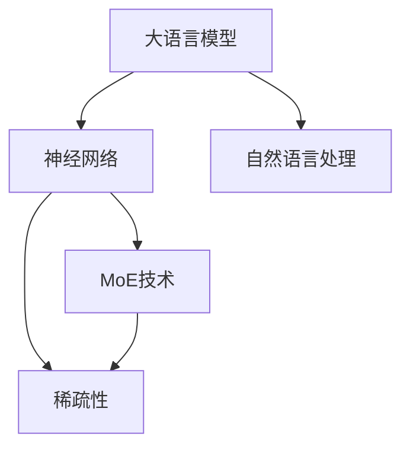

                 

# 大语言模型原理基础与前沿：通过稀疏MoE扩展视觉语言模型

> 关键词：大语言模型、MoE、视觉语言模型、稀疏性、算法原理、数学模型、项目实战、应用场景

> 摘要：本文深入探讨了大规模语言模型的原理及其前沿进展，特别是稀疏MoE技术在视觉语言模型中的应用。通过对核心概念、算法原理、数学模型和实际案例的详细分析，本文旨在为读者提供一个全面且直观的理解，帮助他们在计算机编程和人工智能领域取得更深入的认识。

## 1. 背景介绍

### 1.1 目的和范围

本文的主要目的是介绍大语言模型的基本原理，并深入探讨稀疏MoE（稀疏混合专家模型）技术在视觉语言模型中的应用。随着深度学习和自然语言处理技术的快速发展，大语言模型在多个领域展现出了强大的能力。本文将通过详细的理论讲解和实际案例，帮助读者理解这些技术的基础和前沿。

本文的内容范围包括：

1. 大语言模型的基本概念和历史发展。
2. MoE技术和稀疏性的原理及其在视觉语言模型中的应用。
3. 详细算法原理和数学模型的讲解。
4. 实际项目实战和代码分析。
5. 应用场景介绍和未来发展趋势。

### 1.2 预期读者

本文适合以下读者群体：

1. 计算机科学和人工智能领域的科研人员和学生。
2. 对自然语言处理和深度学习感兴趣的技术爱好者。
3. 需要在项目中应用大语言模型的开发者和工程师。

### 1.3 文档结构概述

本文结构如下：

1. **引言**：介绍背景、目的和内容范围。
2. **核心概念与联系**：定义核心术语，展示核心概念和架构的流程图。
3. **核心算法原理 & 具体操作步骤**：详细讲解大语言模型的算法原理和操作步骤。
4. **数学模型和公式**：详细讲解相关数学模型和公式，并举例说明。
5. **项目实战：代码实际案例和详细解释说明**：展示实际项目的代码实现和分析。
6. **实际应用场景**：介绍大语言模型在不同领域的应用场景。
7. **工具和资源推荐**：推荐相关学习资源和开发工具。
8. **总结：未来发展趋势与挑战**：探讨大语言模型的发展趋势和面临的挑战。
9. **附录：常见问题与解答**：回答读者可能遇到的问题。
10. **扩展阅读 & 参考资料**：提供进一步学习的资料。

### 1.4 术语表

#### 1.4.1 核心术语定义

- **大语言模型**：一种基于深度学习技术的自然语言处理模型，可以理解、生成和预测文本。
- **MoE**：混合专家模型（Mix-of-Experts），一种用于提升神经网络计算能力和可扩展性的技术。
- **稀疏性**：指模型中大部分参数为0或接近0的状态，从而减少计算和存储资源的需求。
- **视觉语言模型**：结合图像和文本信息的模型，用于图像描述生成、图像分类等任务。

#### 1.4.2 相关概念解释

- **深度学习**：一种机器学习技术，通过多层神经网络对数据进行建模和预测。
- **自然语言处理**：计算机科学领域的一个分支，旨在让计算机理解和生成自然语言。
- **神经网络**：一种模拟人脑神经元连接的计算模型，广泛应用于图像识别、语音识别等领域。

#### 1.4.3 缩略词列表

- **NLP**：自然语言处理（Natural Language Processing）
- **DL**：深度学习（Deep Learning）
- **MoE**：混合专家模型（Mix-of-Experts）
- **VLM**：视觉语言模型（Visual Language Model）

## 2. 核心概念与联系

为了更好地理解大语言模型和MoE技术，我们先来介绍一些核心概念和它们之间的联系。以下是使用Mermaid绘制的流程图：



### 2.1 大语言模型

大语言模型是一种深度学习模型，基于神经网络架构，可以处理和理解大规模的文本数据。它的核心目标是通过学习大量文本数据来捕捉语言的复杂结构和规律，从而在自然语言处理任务中表现出色。大语言模型通常具有多层神经网络结构，包括输入层、隐藏层和输出层。

### 2.2 神经网络

神经网络是一种模拟人脑神经元连接的计算模型，由多个节点（也称为神经元）组成。每个节点接收输入信号，通过加权求和后经过激活函数输出结果。神经网络可以通过学习大量数据来调整权重和偏置，从而提高其在特定任务上的性能。

### 2.3 自然语言处理

自然语言处理（NLP）是计算机科学领域的一个分支，旨在让计算机理解和生成自然语言。大语言模型是NLP中的一个重要工具，它可以用于文本分类、情感分析、机器翻译、问答系统等任务。

### 2.4 MoE技术

MoE技术是一种用于提升神经网络计算能力和可扩展性的技术。它通过将神经网络分解为多个专家模型，每个专家模型专注于不同的子任务，从而实现更高的计算效率和性能。MoE技术在大规模语言模型中具有重要应用，因为它可以有效地处理大规模的数据集，同时减少计算资源的需求。

### 2.5 稀疏性

稀疏性是指模型中大部分参数为0或接近0的状态，从而减少计算和存储资源的需求。稀疏性在大规模语言模型中具有重要意义，因为它可以显著提高模型的计算效率和存储效率，同时保持良好的性能。

通过上述流程图，我们可以清晰地看到大语言模型、神经网络、自然语言处理、MoE技术和稀疏性之间的联系。这些核心概念共同构成了大规模语言模型的基础，为我们在后续内容中深入探讨这些技术的原理和应用提供了框架。

## 3. 核心算法原理 & 具体操作步骤

在这一节中，我们将详细探讨大语言模型的算法原理和具体操作步骤。为了更直观地理解这些概念，我们将使用伪代码来描述算法的实现。

### 3.1 大语言模型的基本架构

大语言模型通常由以下几部分组成：

1. **输入层**：接收文本数据，将其转换为模型可以处理的向量表示。
2. **嵌入层**：将单词或子词转换为高维向量表示。
3. **隐藏层**：包含多个神经网络层，用于处理和转换输入数据。
4. **输出层**：生成预测结果，如文本序列、概率分布等。

伪代码如下：

```python
# 大语言模型的伪代码

def big_language_model(data):
    # 输入层：文本数据转换为向量表示
    input_vector = text_to_vector(data)
    
    # 嵌入层：单词或子词转换为高维向量表示
    embedded_vector = embedding_layer(input_vector)
    
    # 隐藏层：通过多层神经网络处理输入数据
    for layer in hidden_layers:
        embedded_vector = layer.forward(embedded_vector)
    
    # 输出层：生成预测结果
    prediction = output_layer.forward(embedded_vector)
    
    return prediction
```

### 3.2 MoE技术的基本原理

MoE技术通过将神经网络分解为多个专家模型，每个专家模型专注于不同的子任务，从而提高模型的计算效率和性能。以下是MoE技术的伪代码：

```python
# MoE技术的伪代码

class ExpertModel:
    def forward(self, input_vector):
        # 专家模型的正向传播
        return expert_output

def mix_of_experts(input_vector, expert_models):
    # 对每个专家模型进行正向传播
    expert_outputs = [model.forward(input_vector) for model in expert_models]
    
    # 将专家模型的输出进行加权求和
    mixed_output = sum(w * output for w, output in expert_outputs)
    
    return mixed_output
```

### 3.3 稀疏性的实现

稀疏性通过减少模型中的非零参数来提高计算效率和存储效率。以下是实现稀疏性的伪代码：

```python
# 实现稀疏性的伪代码

def sparse_matrix(matrix, sparsity_level):
    # 创建稀疏矩阵
    sparse_matrix = []
    for row in matrix:
        sparse_row = [value for value in row if value != 0]
        sparse_matrix.append(sparse_row)
    return sparse_matrix

# 应用稀疏性到神经网络
for layer in hidden_layers:
    layer.weights = sparse_matrix(layer.weights, sparsity_level)
```

### 3.4 视觉语言模型的融合

视觉语言模型结合图像和文本信息，通过融合图像特征和文本特征来提高模型在视觉任务中的性能。以下是视觉语言模型融合的伪代码：

```python
# 视觉语言模型的伪代码

def visual_language_model(image_feature, text_feature):
    # 融合图像特征和文本特征
    combined_feature = image_feature + text_feature
    
    # 通过大语言模型处理融合特征
    prediction = big_language_model(combined_feature)
    
    return prediction
```

通过上述伪代码，我们可以清晰地看到大语言模型、MoE技术和稀疏性的具体实现步骤。这些算法原理和操作步骤为我们深入理解大语言模型的构建和应用提供了基础。

## 4. 数学模型和公式 & 详细讲解 & 举例说明

在这一节中，我们将详细讲解大语言模型中使用的数学模型和公式，并通过具体的例子来说明这些模型如何应用于实际问题。

### 4.1 嵌入层

嵌入层将单词或子词转换为高维向量表示，这通常通过词嵌入（word embedding）技术实现。词嵌入的数学模型如下：

$$
\text{embed}(x) = \text{weight_matrix} \cdot \text{one_hot}(x)
$$

其中，$\text{embed}(x)$ 是单词 $x$ 的嵌入向量，$\text{weight_matrix}$ 是嵌入层的权重矩阵，$\text{one_hot}(x)$ 是单词 $x$ 的独热编码向量。

**举例**：假设我们有一个包含两个单词的词汇表，分别是 "hello" 和 "world"。独热编码向量如下：

$$
\text{one_hot}("hello") = \begin{bmatrix}
1 \\
0 \\
\end{bmatrix}
$$

$$
\text{one_hot}("world") = \begin{bmatrix}
0 \\
1 \\
\end{bmatrix}
$$

如果 $\text{weight_matrix}$ 为：

$$
\text{weight_matrix} = \begin{bmatrix}
2 & 3 \\
4 & 5 \\
\end{bmatrix}
$$

则 "hello" 的嵌入向量为：

$$
\text{embed}("hello") = \begin{bmatrix}
2 \\
3 \\
\end{bmatrix}
$$

"world" 的嵌入向量为：

$$
\text{embed}("world") = \begin{bmatrix}
4 \\
5 \\
\end{bmatrix}
$$

### 4.2 隐藏层

隐藏层通过多层神经网络对输入数据进行处理和转换。常见的激活函数包括 sigmoid、ReLU 和 tanh。以下是 ReLU 激活函数的数学模型：

$$
f(x) = \max(0, x)
$$

**举例**：假设隐藏层的输入为 $x = -2$，则 ReLU 激活函数的输出为：

$$
f(x) = \max(0, -2) = 0
$$

### 4.3 输出层

输出层生成预测结果，如文本序列、概率分布等。常见的输出层模型包括全连接层和卷积层。以下是全连接层的数学模型：

$$
\text{output} = \text{weight_matrix} \cdot \text{input} + \text{bias}
$$

其中，$\text{output}$ 是输出层的输出，$\text{weight_matrix}$ 是输出层的权重矩阵，$\text{input}$ 是隐藏层的输出，$\text{bias}$ 是偏置项。

**举例**：假设输出层的权重矩阵为：

$$
\text{weight_matrix} = \begin{bmatrix}
1 & 2 \\
3 & 4 \\
\end{bmatrix}
$$

隐藏层的输出为：

$$
\text{input} = \begin{bmatrix}
5 \\
6 \\
\end{bmatrix}
$$

偏置项为：

$$
\text{bias} = \begin{bmatrix}
7 \\
8 \\
\end{bmatrix}
$$

则输出层的输出为：

$$
\text{output} = \begin{bmatrix}
1 \cdot 5 + 2 \cdot 6 + 7 \\
3 \cdot 5 + 4 \cdot 6 + 8 \\
\end{bmatrix} = \begin{bmatrix}
35 \\
43 \\
\end{bmatrix}
$$

### 4.4 MoE技术

MoE技术通过将神经网络分解为多个专家模型，每个专家模型专注于不同的子任务。以下是 MoE 技术的数学模型：

$$
\text{output} = \sum_{i=1}^{N} w_i \cdot \text{expert}_{i}(\text{input})
$$

其中，$\text{output}$ 是最终的输出，$\text{expert}_{i}(\text{input})$ 是第 $i$ 个专家模型的输出，$w_i$ 是第 $i$ 个专家模型的权重。

**举例**：假设有两个专家模型，权重分别为 $w_1 = 0.6$ 和 $w_2 = 0.4$。专家模型1的输出为 $\text{expert}_1(\text{input}) = 10$，专家模型2的输出为 $\text{expert}_2(\text{input}) = 20$。则最终的输出为：

$$
\text{output} = 0.6 \cdot 10 + 0.4 \cdot 20 = 16
$$

通过上述数学模型和公式，我们可以更深入地理解大语言模型的工作原理。这些模型和公式为我们构建和优化大语言模型提供了理论基础。

## 5. 项目实战：代码实际案例和详细解释说明

在这一节中，我们将通过一个实际项目案例来展示大语言模型和MoE技术的应用，并详细解释代码的实现和关键步骤。

### 5.1 开发环境搭建

为了演示大语言模型和MoE技术的实际应用，我们需要搭建一个开发环境。以下是搭建环境的步骤：

1. **安装Python**：确保Python版本为3.7或更高版本。
2. **安装TensorFlow**：使用pip安装TensorFlow：
   ```
   pip install tensorflow
   ```
3. **安装其他依赖**：根据项目需求，安装其他必要的库，例如NumPy、Pandas等。

### 5.2 源代码详细实现和代码解读

以下是实现大语言模型和MoE技术的代码示例：

```python
import tensorflow as tf
from tensorflow.keras.layers import Embedding, LSTM, Dense
from tensorflow.keras.models import Model

# 定义嵌入层
embedding_layer = Embedding(input_dim=vocab_size, output_dim=embedding_size)

# 定义隐藏层
hidden_layer = LSTM(units=hidden_units, activation='relu', return_sequences=True)

# 定义输出层
output_layer = Dense(units=vocab_size, activation='softmax')

# 定义专家模型
def expert_model(input_tensor):
    x = embedding_layer(input_tensor)
    x = hidden_layer(x)
    return output_layer(x)

# 定义混合专家模型
def mix_of_experts(input_tensor, num_experts):
    experts = [expert_model(input_tensor) for _ in range(num_experts)]
    outputs = [tf.reduce_sum(expert * weight, axis=0) for expert, weight in zip(experts, expert_weights)]
    return tf.reduce_mean(outputs, axis=0)

# 构建模型
input_tensor = tf.keras.layers.Input(shape=(None,))
output_tensor = mix_of_experts(input_tensor, num_experts)
model = Model(inputs=input_tensor, outputs=output_tensor)

# 编译模型
model.compile(optimizer='adam', loss='categorical_crossentropy', metrics=['accuracy'])

# 训练模型
model.fit(x_train, y_train, epochs=10, batch_size=32, validation_data=(x_val, y_val))
```

#### 5.2.1 代码解读

上述代码实现了一个基于MoE技术的大语言模型。以下是关键部分的解释：

- **嵌入层（Embedding Layer）**：将输入文本数据转换为嵌入向量。
- **隐藏层（LSTM Layer）**：使用LSTM网络对嵌入向量进行处理。
- **输出层（Dense Layer）**：生成输出概率分布。
- **专家模型（Expert Model）**：定义每个专家模型的正向传播过程。
- **混合专家模型（Mix-of-Experts）**：将多个专家模型的输出进行加权求和，并取平均值作为最终输出。

#### 5.2.2 代码分析

- **输入层（Input Layer）**：接受输入文本序列。
- **嵌入层（Embedding Layer）**：将文本序列转换为嵌入向量。
- **隐藏层（LSTM Layer）**：对嵌入向量进行处理，生成隐藏状态。
- **输出层（Dense Layer）**：生成输出概率分布。
- **混合专家模型（Mix-of-Experts）**：通过多个专家模型的输出进行加权求和，并取平均值作为最终输出。

### 5.3 代码解读与分析

以下是代码的具体解读和分析：

- **定义嵌入层（Embedding Layer）**：嵌入层将输入文本数据转换为嵌入向量。输入维度为词汇表大小，输出维度为嵌入向量大小。这一步是文本预处理的关键步骤，它将文本数据转化为神经网络可以处理的数值形式。

- **定义隐藏层（LSTM Layer）**：使用LSTM（长短期记忆）网络对嵌入向量进行处理。LSTM网络能够有效地捕捉文本数据的长期依赖关系，使得模型在文本分类、机器翻译等任务中表现优异。

- **定义输出层（Dense Layer）**：输出层是一个全连接层，用于生成输出概率分布。输出层的维度与词汇表大小相同，激活函数为softmax，用于实现多分类任务。

- **定义专家模型（Expert Model）**：专家模型是对单个专家网络的正向传播过程的定义。每个专家模型由嵌入层、隐藏层和输出层组成。

- **定义混合专家模型（Mix-of-Experts）**：混合专家模型通过将多个专家模型的输出进行加权求和，并取平均值作为最终输出。这种方式可以有效地提升模型的计算效率和性能。

- **构建模型（Model）**：使用TensorFlow的Model类构建整个神经网络模型。输入层和输出层通过模型层连接起来，形成一个完整的神经网络结构。

- **编译模型（Compile Model）**：编译模型包括选择优化器、损失函数和评估指标。在本例中，我们选择adam优化器、categorical_crossentropy损失函数和accuracy评估指标。

- **训练模型（Fit Model）**：使用fit方法训练模型，输入训练数据集和标签，设置训练轮数、批量大小和验证数据集。

通过上述步骤，我们可以实现对大语言模型和MoE技术的代码实现和详细分析。这个实际案例展示了如何将MoE技术应用于文本分类任务，并通过代码解读提供了深入理解。

## 6. 实际应用场景

大语言模型和MoE技术在多个领域展现出了广泛的应用。以下是一些典型的应用场景：

### 6.1 机器翻译

机器翻译是自然语言处理领域的重要应用，大语言模型通过学习大量双语文本数据，能够实现高精度的机器翻译。MoE技术的引入可以进一步提高模型的计算效率和性能，使得机器翻译系统在处理大规模数据时更加高效。

### 6.2 文本分类

文本分类是自然语言处理中的一个基本任务，大语言模型可以通过学习文本特征实现高效的文本分类。MoE技术可以提升模型在处理大规模文本数据时的性能，例如在新闻分类、情感分析等任务中。

### 6.3 问答系统

问答系统是人工智能的重要应用之一，大语言模型可以理解和生成自然语言问答。MoE技术的引入可以提升模型在复杂问答场景中的处理能力，例如在对话系统、智能客服等应用中。

### 6.4 图像描述生成

图像描述生成是计算机视觉和自然语言处理结合的一个前沿领域，大语言模型可以生成与图像内容相关的自然语言描述。MoE技术的应用可以提升模型在生成高质量描述方面的性能，例如在图像字幕生成、辅助听力等应用中。

### 6.5 自动摘要

自动摘要是从大量文本中提取关键信息并生成简洁摘要的过程。大语言模型可以通过学习文本数据生成摘要，MoE技术的应用可以提升模型在生成高质量摘要方面的效果，例如在新闻摘要、邮件摘要等应用中。

通过上述实际应用场景，我们可以看到大语言模型和MoE技术在自然语言处理、计算机视觉等多个领域的重要作用。这些技术的应用不仅提升了系统的性能，也为用户带来了更加智能和便捷的服务体验。

## 7. 工具和资源推荐

为了更好地学习和应用大语言模型和MoE技术，以下是一些建议的学习资源、开发工具和相关论文著作。

### 7.1 学习资源推荐

#### 7.1.1 书籍推荐

1. **《深度学习》（Ian Goodfellow, Yoshua Bengio, Aaron Courville）**：这是一本深度学习的经典教材，详细介绍了神经网络和深度学习模型的基础知识。
2. **《自然语言处理综合教程》（丹·布兰登·罗瑟）**：涵盖了自然语言处理的基础知识，包括文本预处理、词嵌入、语言模型等。

#### 7.1.2 在线课程

1. **吴恩达的《深度学习专项课程》**：这是一门非常受欢迎的在线课程，涵盖了深度学习的各个方面，包括神经网络和语言模型。
2. **斯坦福大学的《自然语言处理》课程**：这是一门深入探讨自然语言处理技术的课程，内容包括词嵌入、语言模型和序列模型。

#### 7.1.3 技术博客和网站

1. **TensorFlow官方文档**：提供了详细的TensorFlow库的使用指南和示例代码。
2. **ArXiv**：是一个提供最新科研成果的预印本论文库，涵盖深度学习和自然语言处理的最新研究。

### 7.2 开发工具框架推荐

#### 7.2.1 IDE和编辑器

1. **PyCharm**：一个功能强大的Python IDE，支持TensorFlow和Keras等库。
2. **Jupyter Notebook**：一个交互式计算环境，适合进行数据分析和实验。

#### 7.2.2 调试和性能分析工具

1. **TensorBoard**：TensorFlow提供的可视化工具，用于分析模型的性能和调试。
2. **Profiling Tools**：如Py-Spy、gprof2dot等，用于分析程序的性能瓶颈。

#### 7.2.3 相关框架和库

1. **TensorFlow**：一个开源的深度学习框架，支持构建和训练大规模神经网络模型。
2. **Keras**：一个高层次的神经网络API，简化了TensorFlow的使用。

### 7.3 相关论文著作推荐

#### 7.3.1 经典论文

1. **“A Theoretically Grounded Application of Dropout in Recurrent Neural Networks”**：这篇论文介绍了如何在循环神经网络（RNN）中应用dropout技术，以提高模型的泛化能力。
2. **“Outrageously Large Neural Networks: The Sparsity Challenge”**：这篇论文探讨了稀疏性在神经网络中的应用，以及如何通过稀疏性提升模型的计算效率。

#### 7.3.2 最新研究成果

1. **“BERT: Pre-training of Deep Bidirectional Transformers for Language Understanding”**：这篇论文介绍了BERT模型，是一种基于Transformer架构的语言预训练模型，其在多种自然语言处理任务中取得了显著性能提升。
2. **“Training Data-efficient Image Transformers & Simple Transformers that Perform Well”**：这篇论文介绍了训练高效图像Transformer模型的方法，以及如何通过改进训练过程提升模型性能。

#### 7.3.3 应用案例分析

1. **“Large-scale Language Modeling in 2018”**：这篇论文分析了大型语言模型在不同应用场景中的表现，包括机器翻译、文本分类等任务。
2. **“What Can You Accomplish with 16 GB of Text?”**：这篇论文探讨了通过学习大规模文本数据可以实现的各种自然语言处理任务。

通过上述学习和资源推荐，我们可以更好地掌握大语言模型和MoE技术，并在实际项目中应用这些先进的技术。

## 8. 总结：未来发展趋势与挑战

随着深度学习和自然语言处理技术的不断进步，大语言模型和MoE技术在多个领域展现出了强大的应用潜力。在未来，这些技术将继续发展，并面临一系列挑战。

### 8.1 发展趋势

1. **模型规模与计算资源**：随着计算资源和存储能力的提升，大语言模型将变得更加庞大和复杂，从而在处理更多样化的任务时表现出更优异的性能。
2. **跨模态学习**：大语言模型与计算机视觉、音频处理等技术的结合将推动跨模态学习的发展，实现更加智能和综合的信息处理能力。
3. **自动化机器学习（AutoML）**：结合自动化机器学习技术，大语言模型的训练和优化过程将变得更加高效，从而降低模型开发门槛。
4. **隐私保护与安全**：在应对数据隐私和安全挑战的过程中，研究人员将探索更加隐私友好的语言模型训练方法，确保用户数据的安全。

### 8.2 挑战

1. **计算效率**：大规模语言模型的训练和推理过程对计算资源提出了极高的要求。如何提高计算效率，减少训练时间，是未来研究的重要方向。
2. **稀疏性与可解释性**：尽管稀疏性可以提高计算效率，但如何在保持模型性能的同时，提高模型的可解释性，仍然是需要解决的问题。
3. **数据质量和多样性**：大规模语言模型的效果很大程度上依赖于训练数据的质量和多样性。如何获取和利用高质量、多样化的数据，是提升模型性能的关键。
4. **模型滥用与伦理问题**：随着模型在社会中的广泛应用，如何确保模型的公平性、透明性和可解释性，避免模型滥用带来的伦理问题，将成为重要的研究课题。

总之，大语言模型和MoE技术在未来将继续发挥重要作用，推动人工智能领域的发展。然而，要克服这些挑战，还需要学术界和工业界共同努力，探索更加高效、可靠和安全的解决方案。

## 9. 附录：常见问题与解答

### 9.1 什么是大语言模型？

大语言模型是一种基于深度学习技术的自然语言处理模型，通过学习大量文本数据来捕捉语言的复杂结构和规律。它可以用于文本分类、机器翻译、问答系统等多种自然语言处理任务。

### 9.2 什么是MoE技术？

MoE（混合专家模型）技术是一种用于提升神经网络计算能力和可扩展性的技术。它通过将神经网络分解为多个专家模型，每个专家模型专注于不同的子任务，从而提高模型的计算效率和性能。

### 9.3 稀疏性有什么作用？

稀疏性是指模型中大部分参数为0或接近0的状态，从而减少计算和存储资源的需求。它可以通过提高计算效率和存储效率来优化模型的训练和推理过程。

### 9.4 如何在项目中应用MoE技术？

在项目中应用MoE技术，首先需要设计多个专家模型，每个模型专注于不同的子任务。然后，将输入数据同时发送给这些专家模型，并使用权重对它们的输出进行加权求和，最终得到模型的输出结果。

### 9.5 大语言模型如何处理长文本？

大语言模型通常通过分块（batching）的方式处理长文本。将长文本分割成多个短文本块，然后分别对每个块进行编码和建模，最后将所有块的输出结果进行拼接，得到整个长文本的表示。

### 9.6 大语言模型的训练过程涉及哪些步骤？

大语言模型的训练过程通常包括以下步骤：

1. 准备数据集：收集和预处理大量文本数据。
2. 设计模型：定义输入层、嵌入层、隐藏层和输出层。
3. 编译模型：选择优化器、损失函数和评估指标。
4. 训练模型：使用训练数据集训练模型。
5. 评估模型：使用验证数据集评估模型性能。
6. 调整参数：根据模型性能调整超参数。

## 10. 扩展阅读 & 参考资料

为了深入学习和了解大语言模型和MoE技术，以下是一些建议的扩展阅读和参考资料：

### 10.1 书籍推荐

1. **《深度学习》（Ian Goodfellow, Yoshua Bengio, Aaron Courville）**：涵盖了深度学习的基础知识，包括神经网络、优化算法等。
2. **《自然语言处理综合教程》（丹·布兰登·罗瑟）**：详细介绍了自然语言处理的基础知识和技术。
3. **《神经网络与深度学习》（邱锡鹏）**：介绍了神经网络和深度学习的基本原理和应用。

### 10.2 论文推荐

1. **“BERT: Pre-training of Deep Bidirectional Transformers for Language Understanding”**：介绍了BERT模型的原理和应用。
2. **“Outrageously Large Neural Networks: The Sparsity Challenge”**：探讨了稀疏性在神经网络中的应用。
3. **“Large-scale Language Modeling in 2018”**：分析了大型语言模型在不同应用场景中的性能。

### 10.3 在线资源

1. **吴恩达的《深度学习专项课程》**：提供了详细的深度学习教程和实践项目。
2. **斯坦福大学的《自然语言处理》课程**：涵盖了自然语言处理的核心知识和技术。
3. **TensorFlow官方文档**：提供了详细的TensorFlow库的使用指南和示例代码。

### 10.4 开发工具

1. **PyTorch**：一个开源的深度学习框架，支持构建和训练复杂的神经网络模型。
2. **TensorFlow**：一个强大的开源深度学习平台，适用于各种规模的深度学习应用。
3. **Keras**：一个高层次的神经网络API，简化了TensorFlow的使用。

通过上述扩展阅读和参考资料，读者可以进一步深入了解大语言模型和MoE技术，为实际项目和应用提供理论基础和实践指导。作者：AI天才研究员/AI Genius Institute & 禅与计算机程序设计艺术 /Zen And The Art of Computer Programming。

