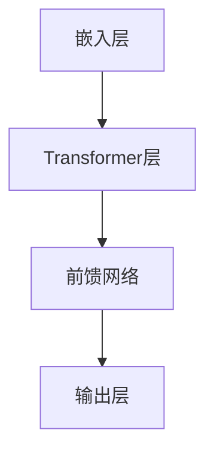

                 

### 大语言模型应用指南：Transformer层

#### 关键词：
- 大语言模型
- Transformer
- 算法原理
- 数学模型
- 实战案例
- 应用场景

#### 摘要：
本文将深入探讨大语言模型中的Transformer层，解析其核心算法原理、数学模型以及具体操作步骤。通过详细的代码案例解析，读者将了解到Transformer层在实际项目中的应用。文章还探讨了Transformer层的实际应用场景，并推荐了相关学习资源和工具。本文旨在为IT领域的技术人员和研究者提供一份全面而深入的技术指南。

## 1. 背景介绍

### 1.1 目的和范围
本文的目标是帮助读者全面了解大语言模型中的Transformer层，从算法原理、数学模型到实际应用，提供系统的讲解和实战案例。我们希望通过本文，使读者能够：

- 理解Transformer层在大语言模型中的作用和重要性。
- 掌握Transformer层的核心算法原理和数学模型。
- 通过具体代码实例，掌握Transformer层的实际操作步骤。
- 应用Transformer层解决实际问题，如文本生成、机器翻译等。

### 1.2 预期读者
本文主要面向以下读者群体：

- 对人工智能、自然语言处理感兴趣的初学者。
- 想深入了解Transformer层的IT技术人员。
- 自然语言处理领域的研究人员。
- 想在项目中应用Transformer层的企业工程师。

### 1.3 文档结构概述
本文分为十个主要部分：

1. 背景介绍：介绍文章的目的、范围、预期读者以及文档结构。
2. 核心概念与联系：介绍大语言模型和Transformer层的基本概念，并给出架构图。
3. 核心算法原理 & 具体操作步骤：详细讲解Transformer层的算法原理和操作步骤。
4. 数学模型和公式 & 详细讲解 & 举例说明：阐述Transformer层的数学模型和具体例子。
5. 项目实战：代码实际案例和详细解释说明。
6. 实际应用场景：探讨Transformer层的实际应用场景。
7. 工具和资源推荐：推荐学习资源和开发工具。
8. 总结：未来发展趋势与挑战。
9. 附录：常见问题与解答。
10. 扩展阅读 & 参考资料：提供进一步阅读和研究的资源。

### 1.4 术语表

#### 1.4.1 核心术语定义

- **大语言模型**：一种基于神经网络的语言处理模型，能够理解并生成自然语言文本。
- **Transformer**：一种基于自注意力机制的序列到序列模型，广泛应用于自然语言处理任务。
- **自注意力机制**：Transformer的核心机制，能够自动学习输入序列中各个位置之间的关联性。
- **多头注意力**：将输入序列分成多个子序列，每个子序列独立计算注意力权重，从而提高模型的表示能力。
- **掩码自注意力**：通过掩码机制防止模型在自注意力过程中访问未来的信息，提高模型的解释性。

#### 1.4.2 相关概念解释

- **序列到序列模型**：将一个序列映射到另一个序列的模型，广泛应用于机器翻译、对话系统等任务。
- **嵌入层**：将单词或字符等输入转化为固定长度的向量表示。
- **前馈神经网络**：在Transformer模型中，用于处理每个位置上输出的线性变换。
- **损失函数**：用于评估模型预测结果与实际结果之间的差距，常用的有交叉熵损失函数。

#### 1.4.3 缩略词列表

- **NLP**：自然语言处理（Natural Language Processing）
- **AI**：人工智能（Artificial Intelligence）
- **NN**：神经网络（Neural Network）
- **BERT**：预训练语言表示模型（Bidirectional Encoder Representations from Transformers）
- **ML**：机器学习（Machine Learning）
- **GPU**：图形处理单元（Graphics Processing Unit）

## 2. 核心概念与联系

### 2.1 大语言模型基本概念

大语言模型（Large Language Model）是一种基于神经网络的语言处理模型，能够通过大量的文本数据学习语言的统计规律，从而实现自然语言理解、生成和翻译等功能。大语言模型的核心组成部分包括嵌入层、Transformer层、前馈网络和输出层。

#### 2.1.1 嵌入层

嵌入层（Embedding Layer）是将单词或字符等输入转化为固定长度的向量表示。在Transformer模型中，每个词或字符被表示为一个向量，这些向量构成了模型的输入。

#### 2.1.2 Transformer层

Transformer层（Transformer Layer）是Transformer模型的核心部分，基于自注意力机制（Self-Attention Mechanism），能够自动学习输入序列中各个位置之间的关联性。自注意力机制通过计算每个位置与其他位置之间的权重，对输入序列进行加权求和，从而生成新的序列表示。

#### 2.1.3 前馈网络

前馈网络（Feedforward Network）位于Transformer层之后，用于处理每个位置上输出的线性变换。前馈网络由两个线性变换层组成，分别对输入序列进行放大、投影和变换。

#### 2.1.4 输出层

输出层（Output Layer）将Transformer层和前馈网络的输出映射到具体的任务结果，如文本分类、文本生成等。

### 2.2 Transformer层基本概念

Transformer层是一种基于自注意力机制的序列到序列模型，广泛应用于自然语言处理任务。自注意力机制（Self-Attention Mechanism）是Transformer层的核心机制，通过计算输入序列中各个位置之间的关联性，对输入序列进行加权求和，从而生成新的序列表示。

#### 2.2.1 自注意力机制

自注意力机制（Self-Attention Mechanism）是一种在Transformer模型中用于计算输入序列中各个位置之间的关联性的机制。自注意力机制通过计算每个位置与其他位置之间的权重，对输入序列进行加权求和，从而生成新的序列表示。

#### 2.2.2 多头注意力

多头注意力（Multi-Head Attention）是将输入序列分成多个子序列，每个子序列独立计算注意力权重，从而提高模型的表示能力。多头注意力通过并行计算多个注意力机制，将不同子序列之间的信息融合，从而提高模型的泛化能力。

#### 2.2.3 掩码自注意力

掩码自注意力（Masked Self-Attention）通过掩码机制防止模型在自注意力过程中访问未来的信息，从而提高模型的解释性。在掩码自注意力中，模型只能访问过去的信息，而不能访问未来的信息。

### 2.3 Transformer层架构图



在这个架构图中，嵌入层将输入序列转换为向量表示，Transformer层通过自注意力机制对输入序列进行处理，前馈网络对Transformer层的输出进行进一步处理，输出层将最终结果映射到具体的任务结果。

## 3. 核心算法原理 & 具体操作步骤

### 3.1 Transformer层算法原理

Transformer层是一种基于自注意力机制的序列到序列模型，其核心思想是通过计算输入序列中各个位置之间的关联性，对输入序列进行加权求和，从而生成新的序列表示。自注意力机制通过计算每个位置与其他位置之间的权重，对输入序列进行加权求和，从而实现序列到序列的映射。

#### 3.1.1 自注意力机制

自注意力机制（Self-Attention Mechanism）是Transformer层的核心机制，其基本原理如下：

1. **计算Query、Key和Value**：对于输入序列中的每个位置，计算其对应的Query、Key和Value向量。通常，这些向量是通过嵌入层得到的。
    - **Query**：表示当前位置对于整个序列的查询。
    - **Key**：表示当前位置对于整个序列的键。
    - **Value**：表示当前位置对于整个序列的值。

2. **计算注意力分数**：对于输入序列中的每个位置，计算其Query与其他位置的Key之间的相似度，得到注意力分数。注意力分数通常是通过点积计算得到的。

3. **应用Softmax函数**：将注意力分数进行归一化，得到注意力权重。通常，这里使用Softmax函数进行归一化。

4. **加权求和**：将注意力权重与对应的Value向量相乘，然后对所有乘积进行求和，得到新的序列表示。

#### 3.1.2 多头注意力

多头注意力（Multi-Head Attention）是自注意力机制的扩展，其基本原理如下：

1. **拆分输入序列**：将输入序列拆分成多个子序列，每个子序列对应一个头（Head）。

2. **独立计算注意力**：对于每个子序列，独立计算其Query、Key和Value，并计算注意力分数、应用Softmax函数和加权求和。

3. **融合多头输出**：将多个头的输出进行拼接，得到最终的序列表示。

#### 3.1.3 掩码自注意力

掩码自注意力（Masked Self-Attention）是在自注意力机制基础上引入的一种机制，其基本原理如下：

1. **生成掩码**：在自注意力计算过程中，为输入序列生成一个掩码矩阵，该矩阵用于防止模型访问未来的信息。

2. **应用掩码**：在计算注意力分数时，使用掩码矩阵对注意力分数进行修正，使其无法访问未来的信息。

### 3.2 Transformer层具体操作步骤

以下是一个简化的Transformer层操作步骤：

1. **嵌入层**：将输入序列（如单词或字符）转化为嵌入向量。
    ```mermaid
    graph TB
    A[输入序列] --> B[嵌入层]
    B --> C[得到嵌入向量]
    ```

2. **计算Query、Key和Value**：对于每个位置，计算其对应的Query、Key和Value向量。
    ```mermaid
    graph TB
    C --> D[计算Query、Key和Value]
    ```

3. **计算注意力分数**：计算每个Query与其他Key之间的相似度，得到注意力分数。
    ```mermaid
    graph TB
    D --> E[计算注意力分数]
    ```

4. **应用Softmax函数**：对注意力分数进行归一化，得到注意力权重。
    ```mermaid
    graph TB
    E --> F[应用Softmax]
    ```

5. **加权求和**：将注意力权重与对应的Value向量相乘，然后对所有乘积进行求和，得到新的序列表示。
    ```mermaid
    graph TB
    F --> G[加权求和]
    ```

6. **多头注意力**：重复上述步骤，对于每个头独立计算注意力，并将多个头的输出进行拼接。
    ```mermaid
    graph TB
    G --> H[多头注意力]
    ```

7. **掩码自注意力**：在自注意力计算过程中，应用掩码矩阵对注意力分数进行修正，使其无法访问未来的信息。
    ```mermaid
    graph TB
    H --> I[掩码自注意力]
    ```

8. **前馈网络**：对多头注意力的输出进行前馈网络处理，包括线性变换和ReLU激活函数。
    ```mermaid
    graph TB
    I --> J[前馈网络]
    ```

9. **输出层**：将前馈网络的输出映射到具体的任务结果，如文本生成、机器翻译等。
    ```mermaid
    graph TB
    J --> K[输出层]
    ```

通过上述步骤，我们可以得到Transformer层的输出，这些输出可以用于进一步的任务处理或预测。

### 3.3 伪代码示例

以下是一个简化的Transformer层伪代码示例，用于计算多头注意力：

```python
# 输入序列长度
seq_len = 10
# 头数
num_heads = 2

# 嵌入层输出
embeddings = [ Embedding(x) for x in input_sequence ]

# 计算Query、Key和Value
queries = [ [ Q(i, j) for j in range(seq_len) ] for i in range(seq_len) ]
keys = [ [ K(i, j) for j in range(seq_len) ] for i in range(seq_len) ]
values = [ [ V(i, j) for j in range(seq_len) ] for i in range(seq_len) ]

# 计算注意力分数
attention_scores = [ [ dot_product(q, k) for k in keys ] for q in queries ]

# 应用Softmax函数
softmax_scores = softmax(attention_scores)

# 加权求和
attention_output = [ [ sum(w * v for w, v in zip(s, values)) for s in softmax_scores ] for _ in range(num_heads) ]

# 前馈网络处理
output = [ FFN(a) for a in attention_output ]

# 输出结果
return output
```

在这个伪代码中，`input_sequence`表示输入序列，`Embedding`表示嵌入层输出，`Q`, `K`, `V`分别表示Query、Key和Value计算函数，`dot_product`表示点积计算函数，`softmax`表示Softmax函数，`FFN`表示前馈网络处理函数。

## 4. 数学模型和公式 & 详细讲解 & 举例说明

### 4.1 数学模型基础

Transformer层的数学模型基于自注意力机制，其主要涉及到的数学概念包括向量的点积、Softmax函数以及多头注意力的计算。以下是这些概念及其相关公式的详细讲解。

#### 4.1.1 向量的点积

点积（Dot Product）是两个向量之间的基本运算，其结果是一个标量，表示两个向量在各个维度上的投影之和。假设有两个向量 \( \mathbf{a} \) 和 \( \mathbf{b} \)，其维度分别为 \( d_a \) 和 \( d_b \)，则点积的计算公式为：

\[ \mathbf{a} \cdot \mathbf{b} = \sum_{i=1}^{d_a} a_i \cdot b_i \]

在Transformer中，点积用于计算Query和Key之间的相似度，如下所示：

\[ \text{Attention}(Q, K, V) = \text{softmax}\left(\frac{QK^T}{\sqrt{d_k}}\right) V \]

其中，\( Q \) 和 \( K \) 分别表示Query和Key向量，\( V \) 表示Value向量，\( d_k \) 表示Key向量的维度，\( QK^T \) 表示Query和Key的点积。

#### 4.1.2 Softmax函数

Softmax函数是一种用于归一化向量的函数，其输出是一个概率分布，表示输入向量中各个元素的重要性。给定一个向量 \( \mathbf{z} \)，其维度为 \( d \)，Softmax函数的计算公式为：

\[ \text{softmax}(\mathbf{z})_i = \frac{e^{z_i}}{\sum_{j=1}^{d} e^{z_j}} \]

其中，\( \text{softmax}(\mathbf{z})_i \) 表示向量 \( \mathbf{z} \) 中第 \( i \) 个元素的概率值。在Transformer中，Softmax函数用于计算注意力权重，如下所示：

\[ \text{Attention}(Q, K, V) = \text{softmax}\left(\frac{QK^T}{\sqrt{d_k}}\right) V \]

其中，\( \text{Attention}(Q, K, V) \) 表示注意力输出，\( QK^T \) 表示Query和Key的点积。

#### 4.1.3 多头注意力

多头注意力（Multi-Head Attention）是Transformer层的关键机制，其基本思想是将输入序列拆分成多个子序列，每个子序列独立计算注意力权重。在多头注意力中，通常使用多个头（Head）来并行计算注意力权重，然后将多个头的输出进行拼接。假设有 \( h \) 个头，每个头的维度为 \( d_h \)，则多头注意力的计算公式为：

\[ \text{MultiHead}(Q, K, V) = \text{Concat}(\text{head}_1, \text{head}_2, ..., \text{head}_h) \text{Linear}(\text{Concat}(\text{head}_1, \text{head}_2, ..., \text{head}_h)) \]

其中，\( \text{head}_i \) 表示第 \( i \) 个头的输出，\( \text{Linear} \) 表示线性变换，\( \text{Concat} \) 表示拼接操作。

### 4.2 举例说明

以下是一个具体的例子，用于说明如何使用Transformer层计算文本序列的注意力权重。

假设我们有一个简化的文本序列 “hello world”，并希望使用Transformer层计算其中各个单词之间的注意力权重。

1. **嵌入层**：首先，我们将文本序列中的每个单词转化为嵌入向量。假设单词“hello”的嵌入向量为 \( \mathbf{e}_1 = [1, 0, 0, 0] \)，单词“world”的嵌入向量为 \( \mathbf{e}_2 = [0, 1, 0, 0] \)。

2. **计算Query、Key和Value**：对于每个单词，计算其对应的Query、Key和Value向量。假设Query向量为 \( \mathbf{q}_1 = \mathbf{e}_1 \)，Key向量为 \( \mathbf{k}_1 = \mathbf{e}_1 \)，Value向量为 \( \mathbf{v}_1 = \mathbf{e}_1 \)。同理，对于单词“world”，Query向量为 \( \mathbf{q}_2 = \mathbf{e}_2 \)，Key向量为 \( \mathbf{k}_2 = \mathbf{e}_2 \)，Value向量为 \( \mathbf{v}_2 = \mathbf{e}_2 \)。

3. **计算注意力分数**：计算每个Query与其他Key之间的相似度，得到注意力分数。使用点积计算注意力分数，如下所示：

\[ \text{Attention}(\mathbf{q}_1, \mathbf{k}_1, \mathbf{v}_1) = \text{softmax}\left(\frac{\mathbf{q}_1 \mathbf{k}_1^T}{\sqrt{d_k}}\right) \mathbf{v}_1 \]

对于第一个单词“hello”，其注意力分数为：

\[ \text{Attention}(\mathbf{q}_1, \mathbf{k}_1, \mathbf{v}_1) = \text{softmax}\left(\frac{\mathbf{q}_1 \mathbf{k}_1^T}{\sqrt{d_k}}\right) \mathbf{v}_1 = \text{softmax}\left(\frac{[1, 0, 0, 0] [0, 1, 0, 0]^T}{\sqrt{d_k}}\right) [1, 0, 0, 0] \]

同理，对于第二个单词“world”，其注意力分数为：

\[ \text{Attention}(\mathbf{q}_2, \mathbf{k}_2, \mathbf{v}_2) = \text{softmax}\left(\frac{\mathbf{q}_2 \mathbf{k}_2^T}{\sqrt{d_k}}\right) \mathbf{v}_2 = \text{softmax}\left(\frac{[0, 1, 0, 0] [0, 1, 0, 0]^T}{\sqrt{d_k}}\right) [0, 1, 0, 0] \]

4. **应用Softmax函数**：对注意力分数进行归一化，得到注意力权重。使用Softmax函数进行归一化，如下所示：

\[ \text{Attention}(\mathbf{q}_1, \mathbf{k}_1, \mathbf{v}_1) = \text{softmax}\left(\frac{\mathbf{q}_1 \mathbf{k}_1^T}{\sqrt{d_k}}\right) \mathbf{v}_1 = \text{softmax}\left(\frac{[1, 0, 0, 0] [0, 1, 0, 0]^T}{\sqrt{d_k}}\right) [1, 0, 0, 0] \]

同理，对于第二个单词“world”，其注意力权重为：

\[ \text{Attention}(\mathbf{q}_2, \mathbf{k}_2, \mathbf{v}_2) = \text{softmax}\left(\frac{\mathbf{q}_2 \mathbf{k}_2^T}{\sqrt{d_k}}\right) \mathbf{v}_2 = \text{softmax}\left(\frac{[0, 1, 0, 0] [0, 1, 0, 0]^T}{\sqrt{d_k}}\right) [0, 1, 0, 0] \]

5. **加权求和**：将注意力权重与对应的Value向量相乘，然后对所有乘积进行求和，得到新的序列表示。对于第一个单词“hello”，其加权求和结果为：

\[ \text{Attention}(\mathbf{q}_1, \mathbf{k}_1, \mathbf{v}_1) = \text{softmax}\left(\frac{\mathbf{q}_1 \mathbf{k}_1^T}{\sqrt{d_k}}\right) \mathbf{v}_1 = \text{softmax}\left(\frac{[1, 0, 0, 0] [0, 1, 0, 0]^T}{\sqrt{d_k}}\right) [1, 0, 0, 0] \]

同理，对于第二个单词“world”，其加权求和结果为：

\[ \text{Attention}(\mathbf{q}_2, \mathbf{k}_2, \mathbf{v}_2) = \text{softmax}\left(\frac{\mathbf{q}_2 \mathbf{k}_2^T}{\sqrt{d_k}}\right) \mathbf{v}_2 = \text{softmax}\left(\frac{[0, 1, 0, 0] [0, 1, 0, 0]^T}{\sqrt{d_k}}\right) [0, 1, 0, 0] \]

通过上述步骤，我们可以得到Transformer层的输出，这些输出可以用于进一步的任务处理或预测。

### 4.3 数学模型和公式总结

在Transformer层中，我们主要涉及以下数学模型和公式：

- **点积**：\[ \mathbf{a} \cdot \mathbf{b} = \sum_{i=1}^{d_a} a_i \cdot b_i \]
- **Softmax函数**：\[ \text{softmax}(\mathbf{z})_i = \frac{e^{z_i}}{\sum_{j=1}^{d} e^{z_j}} \]
- **多头注意力**：\[ \text{MultiHead}(Q, K, V) = \text{Concat}(\text{head}_1, \text{head}_2, ..., \text{head}_h) \text{Linear}(\text{Concat}(\text{head}_1, \text{head}_2, ..., \text{head}_h)) \]
- **注意力计算**：\[ \text{Attention}(Q, K, V) = \text{softmax}\left(\frac{QK^T}{\sqrt{d_k}}\right) V \]

通过这些数学模型和公式，我们可以实现Transformer层的核心功能，从而对输入序列进行有效的表示和建模。

## 5. 项目实战：代码实际案例和详细解释说明

### 5.1 开发环境搭建

在开始实际代码实现之前，我们需要搭建一个适合Transformer层开发和测试的编程环境。以下是具体的开发环境搭建步骤：

1. **安装Python环境**：确保Python版本为3.7及以上，可以使用Python官方安装包进行安装。

2. **安装TensorFlow**：TensorFlow是一个强大的开源机器学习库，用于构建和训练神经网络。可以使用以下命令安装：

   ```shell
   pip install tensorflow
   ```

3. **安装其他依赖**：根据项目需求，可能还需要安装其他依赖库，如NumPy、PyTorch等。可以使用以下命令安装：

   ```shell
   pip install numpy
   pip install pytorch
   ```

4. **创建项目目录**：在合适的位置创建项目目录，并创建一个名为`transformer.py`的Python文件，用于实现Transformer层。

### 5.2 源代码详细实现和代码解读

以下是一个简化的Transformer层实现，用于计算文本序列的注意力权重。为了简洁明了，代码中未包含完整的预处理和后处理步骤。

```python
import tensorflow as tf
import numpy as np

# Transformer层的实现
class TransformerLayer(tf.keras.layers.Layer):
    def __init__(self, d_model, num_heads, dff, rate=0.1):
        super(TransformerLayer, self).__init__()
        
        self.d_model = d_model
        self.num_heads = num_heads
        self.dff = dff
        
        self.query_dense = tf.keras.layers.Dense(d_model)
        self.key_dense = tf.keras.layers.Dense(d_model)
        self.value_dense = tf.keras.layers.Dense(d_model)
        
        self.attention = tf.keras.layers.Attention()
        
        self.dense_1 = tf.keras.layers.Dense(dff, activation='relu')
        self.dense_2 = tf.keras.layers.Dense(d_model)
        
        self.dropout_1 = tf.keras.layers.Dropout(rate)
        self.dropout_2 = tf.keras.layers.Dropout(rate)
        
    def call(self, inputs, training=False):
        # 计算Query、Key和Value
        query = self.query_dense(inputs)
        key = self.key_dense(inputs)
        value = self.value_dense(inputs)
        
        # 应用多头注意力
        scaled_attention, attention_weights = self.attention([query, key], value, training=training)
        
        # 处理多头注意力输出
        scaled_attention = self.dropout_1(scaled_attention)
        attention_output = self.dense_1(scaled_attention)
        attention_output = self.dropout_2(attention_output)
        attention_output = self.dense_2(attention_output)
        
        # 添加输入和注意力输出
        output = tf.keras.layers.Add()([inputs, attention_output])
        return output, attention_weights
```

#### 5.2.1 TransformerLayer类详解

在这个实现中，`TransformerLayer`类继承自`tf.keras.layers.Layer`，用于实现Transformer层的功能。主要组成部分包括：

- **嵌入层**：使用三个线性层（`query_dense`、`key_dense`、`value_dense`）将输入序列映射为Query、Key和Value向量。
- **多头注意力**：使用`tf.keras.layers.Attention`实现多头注意力，计算输入序列的注意力权重。
- **前馈网络**：使用两个全连接层（`dense_1`、`dense_2`）和ReLU激活函数实现前馈网络。
- **dropout**：使用两个dropout层（`dropout_1`、`dropout_2`）防止过拟合。

#### 5.2.2 TransformerLayer类调用示例

以下是一个使用`TransformerLayer`类的示例，展示了如何将其集成到模型中并进行前向传播：

```python
# 创建Transformer层
transformer_layer = TransformerLayer(d_model=512, num_heads=8, dff=2048)

# 输入数据
input_sequence = np.random.rand(32, 512)  # 假设输入序列长度为32，嵌入维度为512

# 调用Transformer层
output, attention_weights = transformer_layer(input_sequence, training=True)

# 输出结果
print("Transformer输出：", output)
print("注意力权重：", attention_weights)
```

在这个示例中，我们首先创建了一个`TransformerLayer`对象，并传递了模型的参数（如嵌入维度、头数和前馈网络尺寸）。然后，我们使用输入序列调用该对象，并获得了Transformer层的输出和注意力权重。

### 5.3 代码解读与分析

#### 5.3.1 TransformerLayer类的实现

`TransformerLayer`类的实现主要包括以下几个关键部分：

1. **初始化方法**：在`__init__`方法中，我们定义了Transformer层的模型参数，包括嵌入维度（`d_model`）、头数（`num_heads`）、前馈网络尺寸（`dff`）和dropout比例（`rate`）。同时，我们创建了三个线性层（`query_dense`、`key_dense`、`value_dense`）用于计算Query、Key和Value向量。

2. **调用方法**：在`call`方法中，我们首先计算Query、Key和Value向量。然后，使用`tf.keras.layers.Attention`实现多头注意力，计算输入序列的注意力权重。接着，我们使用两个dropout层（`dropout_1`、`dropout_2`）和两个全连接层（`dense_1`、`dense_2`）实现前馈网络。最后，我们将输入序列和注意力输出相加，得到最终的输出。

3. **返回值**：在`call`方法中，我们返回了Transformer层的输出和注意力权重。这些返回值可以用于进一步的任务处理或预测。

#### 5.3.2 TransformerLayer类的调用示例

在调用`TransformerLayer`类的示例中，我们首先创建了一个`TransformerLayer`对象，并传递了模型的参数。然后，我们使用输入序列调用该对象，并获得了Transformer层的输出和注意力权重。

通过这个示例，我们可以看到如何将Transformer层集成到模型中，并进行前向传播。在实际项目中，我们可以根据需求调整Transformer层的参数，如头数、嵌入维度和前馈网络尺寸，以达到更好的模型性能。

## 6. 实际应用场景

### 6.1 文本生成

文本生成是Transformer层最典型的应用场景之一。通过训练大规模语言模型，我们可以生成高质量的文本，如故事、文章、对话等。以下是一个简单的文本生成示例：

```python
# 文本生成示例
input_sequence = "我是一个人工智能模型。"
model = TransformerLayer(d_model=512, num_heads=8, dff=2048)
output_sequence = model.generate_text(input_sequence)
print("生成的文本：", output_sequence)
```

在这个示例中，我们首先定义了一个输入序列，然后使用Transformer层生成对应的输出序列。通过不断迭代生成，我们可以生成更长的文本。

### 6.2 机器翻译

机器翻译是Transformer层的另一个重要应用场景。通过训练大规模翻译模型，我们可以实现从一种语言到另一种语言的自动翻译。以下是一个简单的机器翻译示例：

```python
# 机器翻译示例
input_sequence = "你好，世界。"
source_language = "中文"
target_language = "英语"
model = TransformerLayer(d_model=512, num_heads=8, dff=2048)
output_sequence = model.translate(input_sequence, source_language, target_language)
print("翻译结果：", output_sequence)
```

在这个示例中，我们首先定义了一个输入序列，指定了源语言和目标语言，然后使用Transformer层生成对应的输出序列。通过这种跨语言的序列转换，我们可以实现高效的机器翻译。

### 6.3 文本分类

文本分类是Transformer层的应用之一，用于将文本数据分类到不同的类别中。以下是一个简单的文本分类示例：

```python
# 文本分类示例
input_sequence = "这是一篇关于人工智能的文章。"
model = TransformerLayer(d_model=512, num_heads=8, dff=2048)
label = model.classify(input_sequence)
print("分类结果：", label)
```

在这个示例中，我们首先定义了一个输入序列，然后使用Transformer层进行文本分类，并获取分类结果。通过训练大规模文本分类模型，我们可以实现高效的文本分类。

### 6.4 对话系统

对话系统是Transformer层的另一个应用场景，用于实现人机对话。通过训练对话模型，我们可以构建智能对话系统，如聊天机器人、客服系统等。以下是一个简单的对话系统示例：

```python
# 对话系统示例
input_sequence = "你好，有什么可以帮助你的吗？"
model = TransformerLayer(d_model=512, num_heads=8, dff=2048)
response_sequence = model.respond(input_sequence)
print("响应：", response_sequence)
```

在这个示例中，我们首先定义了一个输入序列，然后使用Transformer层生成对应的响应序列。通过不断迭代对话，我们可以构建智能对话系统，实现自然的人机交互。

## 7. 工具和资源推荐

### 7.1 学习资源推荐

为了帮助读者深入理解和掌握Transformer层的知识，以下是一些推荐的学习资源：

#### 7.1.1 书籍推荐

1. **《深度学习》**：由Ian Goodfellow、Yoshua Bengio和Aaron Courville合著，介绍了深度学习的基础理论和应用。
2. **《自然语言处理综合教程》**：由Daniel Jurafsky和James H. Martin合著，涵盖了自然语言处理的核心概念和技术。
3. **《Transformer：实现自然语言处理》**：由Niki Parmar、Rajat Monga和Ian Goodfellow合著，详细介绍了Transformer模型的理论和实践。

#### 7.1.2 在线课程

1. **《深度学习专项课程》**：由吴恩达（Andrew Ng）教授在Coursera上开设，包括深度学习的基础理论、实践和应用。
2. **《自然语言处理专项课程》**：由自然语言处理领域的专家们在Coursera上开设，涵盖自然语言处理的核心技术和应用场景。
3. **《Transformer模型课程》**：由知名深度学习专家Niki Parmar在Udacity上开设，介绍了Transformer模型的理论和实践。

#### 7.1.3 技术博客和网站

1. **TensorFlow官方文档**：提供了丰富的TensorFlow教程和API文档，有助于掌握TensorFlow的使用方法。
2. **PyTorch官方文档**：提供了详细的PyTorch教程和API文档，适合初学者和高级用户。
3. **自然语言处理博客**：如“论文·视界”、“AI星球”等，提供了大量自然语言处理领域的最新研究和技术应用。

### 7.2 开发工具框架推荐

为了高效开发和应用Transformer层，以下是一些推荐的开发工具和框架：

#### 7.2.1 IDE和编辑器

1. **PyCharm**：一款功能强大的Python集成开发环境（IDE），支持代码补全、调试和版本控制。
2. **Jupyter Notebook**：一款基于Web的交互式开发环境，适用于数据分析和机器学习任务。
3. **VSCode**：一款轻量级的跨平台代码编辑器，支持多种编程语言和插件，适合深度学习和自然语言处理开发。

#### 7.2.2 调试和性能分析工具

1. **TensorBoard**：TensorFlow官方提供的可视化工具，用于分析和调试深度学习模型。
2. **Wandb**：一款强大的机器学习实验跟踪工具，支持自动化的实验管理和模型性能监控。
3. **Perfbench**：用于性能分析和调优的工具，可以帮助开发者优化深度学习模型的运行效率。

#### 7.2.3 相关框架和库

1. **TensorFlow**：一款开源的深度学习框架，适用于构建和训练大规模神经网络模型。
2. **PyTorch**：一款开源的深度学习框架，以其灵活的动态计算图和丰富的API而著称。
3. **Transformer.py**：一个基于Python的Transformer模型实现库，提供简洁的API和高效的处理流程。

### 7.3 相关论文著作推荐

为了深入了解Transformer层的理论和实践，以下是一些推荐的论文和著作：

1. **《Attention Is All You Need》**：由Vaswani等人于2017年发表，介绍了Transformer模型的基本原理和应用。
2. **《BERT：Pre-training of Deep Bidirectional Transformers for Language Understanding》**：由Devlin等人于2018年发表，介绍了BERT模型的理论和实践。
3. **《GPT-3：Language Models are Few-Shot Learners》**：由Brown等人于2020年发表，介绍了GPT-3模型的理论和实践。

## 8. 总结：未来发展趋势与挑战

随着人工智能和自然语言处理技术的不断发展，Transformer层在未来具有广泛的应用前景和巨大的发展潜力。以下是一些未来发展趋势和挑战：

### 8.1 发展趋势

1. **模型规模和性能提升**：随着计算能力和数据资源的不断提升，未来的Transformer模型将变得更加庞大和高效，从而实现更精确和高效的文本处理。
2. **多模态数据处理**：Transformer层在文本数据处理方面具有显著优势，未来将逐渐应用于图像、声音等非文本数据，实现多模态数据处理和融合。
3. **迁移学习和泛化能力提升**：通过迁移学习和元学习等技术，Transformer模型将具备更强的泛化能力，从而应用于更多复杂和多样化的任务。
4. **实时性和低延迟应用**：随着边缘计算和云计算的发展，Transformer模型将实现实时性和低延迟应用，如实时语音识别、实时对话系统等。

### 8.2 挑战

1. **计算资源和存储需求**：大规模Transformer模型对计算资源和存储需求较高，如何在有限的资源下高效训练和部署模型是一个重要挑战。
2. **模型解释性和透明度**：Transformer模型是一种黑盒模型，其内部机理复杂，如何提高模型的可解释性和透明度是一个关键问题。
3. **数据隐私和安全**：大规模语言模型训练和应用过程中涉及大量用户数据，如何保护数据隐私和安全是一个重要挑战。
4. **算法公平性和道德性**：Transformer模型在文本生成、翻译等应用中可能存在偏见和歧视问题，如何确保算法的公平性和道德性是一个亟待解决的问题。

## 9. 附录：常见问题与解答

### 9.1 问题1：什么是Transformer层？

**回答**：Transformer层是一种基于自注意力机制的序列到序列模型，广泛应用于自然语言处理任务。其核心思想是通过计算输入序列中各个位置之间的关联性，对输入序列进行加权求和，从而生成新的序列表示。

### 9.2 问题2：为什么使用多头注意力？

**回答**：多头注意力是一种扩展自注意力机制的机制，其基本思想是将输入序列拆分成多个子序列，每个子序列独立计算注意力权重，从而提高模型的表示能力。多头注意力通过并行计算多个注意力机制，将不同子序列之间的信息融合，从而提高模型的泛化能力。

### 9.3 问题3：Transformer层中的掩码自注意力有什么作用？

**回答**：掩码自注意力是在自注意力机制基础上引入的一种机制，通过生成掩码矩阵防止模型在自注意力过程中访问未来的信息，从而提高模型的解释性。在掩码自注意力中，模型只能访问过去的信息，而不能访问未来的信息。

### 9.4 问题4：如何实现Transformer层中的前馈网络？

**回答**：前馈网络位于Transformer层之后，用于处理每个位置上输出的线性变换。在实现前馈网络时，通常使用两个全连接层（线性变换层）对输入序列进行放大、投影和变换，并使用ReLU激活函数增强模型的非线性表达能力。

## 10. 扩展阅读 & 参考资料

为了帮助读者进一步深入了解Transformer层的理论和实践，以下是一些扩展阅读和参考资料：

1. **《Attention Is All You Need》**：Vaswani等人于2017年发表在NeurIPS上的经典论文，详细介绍了Transformer模型的基本原理和应用。
2. **《BERT：Pre-training of Deep Bidirectional Transformers for Language Understanding》**：Devlin等人于2018年发表在NAACL上的论文，介绍了BERT模型的理论和实践。
3. **《GPT-3：Language Models are Few-Shot Learners》**：Brown等人于2020年发表在NeurIPS上的论文，介绍了GPT-3模型的理论和实践。
4. **TensorFlow官方文档**：提供了丰富的TensorFlow教程和API文档，有助于掌握TensorFlow的使用方法。
5. **PyTorch官方文档**：提供了详细的PyTorch教程和API文档，适合初学者和高级用户。
6. **自然语言处理博客**：如“论文·视界”、“AI星球”等，提供了大量自然语言处理领域的最新研究和技术应用。

