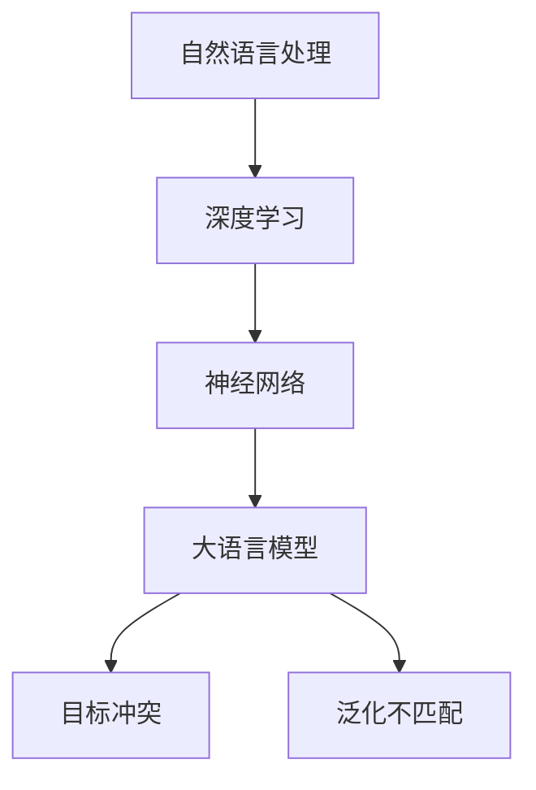
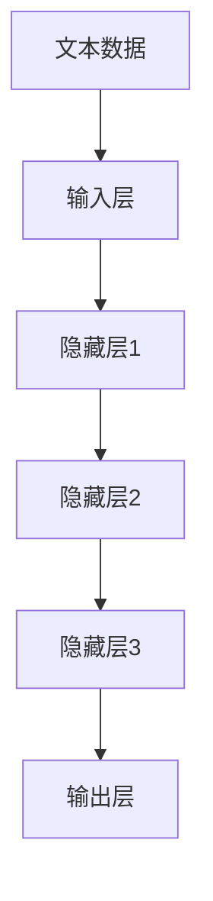

                 

# 大语言模型应用指南：冲突的目标与不匹配的泛化

> **关键词：大语言模型，应用指南，冲突的目标，不匹配的泛化，人工智能**
> 
> **摘要：本文深入探讨大语言模型在应用过程中面临的两个关键问题——冲突的目标与不匹配的泛化。通过系统性地分析相关概念、核心算法原理、数学模型以及实际应用案例，本文旨在为AI研究人员和实践者提供实用的指导和建议。**

## 1. 背景介绍

### 1.1 目的和范围

本文的主要目标是探讨大语言模型在应用过程中面临的两大挑战：冲突的目标与不匹配的泛化。我们旨在通过详细的分析和讨论，帮助读者理解这些问题，并提供解决策略。本文的范围涵盖了从基本概念到高级应用的全面探讨，旨在为读者提供一个全面的应用指南。

### 1.2 预期读者

本文适用于对大语言模型有一定了解的读者，包括AI研究人员、AI开发人员以及相关领域的学者。对于初学者，本文也提供了详细的背景介绍和概念解释，以便他们更好地理解文章的核心内容。

### 1.3 文档结构概述

本文结构如下：
- **第1部分：背景介绍**，包括目的和范围、预期读者、文档结构概述和术语表。
- **第2部分：核心概念与联系**，介绍大语言模型的基本原理和架构。
- **第3部分：核心算法原理 & 具体操作步骤**，详细讲解大语言模型的工作原理和算法实现。
- **第4部分：数学模型和公式 & 详细讲解 & 举例说明**，深入探讨大语言模型背后的数学原理。
- **第5部分：项目实战：代码实际案例和详细解释说明**，通过实际项目案例展示大语言模型的应用。
- **第6部分：实际应用场景**，分析大语言模型在不同领域的应用案例。
- **第7部分：工具和资源推荐**，推荐学习资源、开发工具框架和最新研究成果。
- **第8部分：总结：未来发展趋势与挑战**，总结文章的核心观点并展望未来。
- **第9部分：附录：常见问题与解答**，解答读者可能遇到的常见问题。
- **第10部分：扩展阅读 & 参考资料**，提供进一步学习的资源和文献。

### 1.4 术语表

#### 1.4.1 核心术语定义

- **大语言模型**：一种能够理解、生成和预测自然语言的深度学习模型，通常基于神经网络架构。
- **目标冲突**：指模型在实现不同目标时产生的内在矛盾。
- **泛化不匹配**：指模型在训练数据和实际应用场景之间产生的偏差。

#### 1.4.2 相关概念解释

- **自然语言处理（NLP）**：研究如何让计算机理解和处理人类自然语言的学科。
- **深度学习**：一种基于多层神经网络的机器学习技术，通过多层次的非线性变换来提取数据特征。
- **神经网络**：一种模拟生物神经系统的计算模型，由大量节点（神经元）和连接（权重）组成。

#### 1.4.3 缩略词列表

- **NLP**：自然语言处理
- **DL**：深度学习
- **ML**：机器学习
- **GAN**：生成对抗网络

## 2. 核心概念与联系

大语言模型的核心概念和联系如图1所示。



### 2.1. 大语言模型的基本原理

大语言模型基于深度学习技术和神经网络架构，旨在理解和生成自然语言。其基本原理可以概括为以下几个步骤：

1. **数据预处理**：将原始文本数据转换为适合训练的形式，如词向量或序列表示。
2. **模型训练**：通过大量文本数据训练神经网络模型，使其学会理解自然语言的结构和语义。
3. **模型优化**：使用优化算法（如梯度下降）调整模型参数，提高模型的准确性和泛化能力。
4. **模型应用**：将训练好的模型应用于实际问题，如文本生成、情感分析、机器翻译等。

### 2.2. 目标冲突与泛化不匹配

目标冲突和泛化不匹配是大语言模型在应用过程中面临的两个关键问题。

- **目标冲突**：大语言模型通常需要同时实现多个目标，如文本生成、情感分析和信息检索等。然而，这些目标之间存在内在的矛盾，可能导致模型性能的下降。例如，在文本生成过程中，模型需要平衡流畅性和准确性，而在情感分析过程中，则需要关注情感判断的准确性。
  
- **泛化不匹配**：大语言模型在训练过程中通常使用大量标记数据，但这些数据可能与实际应用场景之间存在差异。这可能导致模型在真实场景中的表现不佳，即泛化不匹配。例如，在机器翻译领域，模型在训练时使用的是标记的双语文本数据，而在实际应用中，可能遇到的是未标记的原始文本。

### 2.3. 大语言模型的架构

大语言模型通常采用多层神经网络架构，如图2所示。其中，输入层接收文本数据，输出层产生预测结果，中间层通过非线性变换提取文本特征。



## 3. 核心算法原理 & 具体操作步骤

### 3.1. 算法原理

大语言模型的核心算法是基于深度学习和神经网络。具体来说，它采用了多层感知器（MLP）作为基础架构，通过反向传播算法进行参数优化。以下是一个简化的算法流程：

1. **输入层**：接收文本数据，将其转换为向量表示。
2. **隐藏层**：通过非线性变换提取文本特征，实现文本表示的转换。
3. **输出层**：生成预测结果，如文本生成、情感分析或机器翻译等。
4. **反向传播**：通过梯度下降算法优化模型参数，提高预测准确性。

### 3.2. 具体操作步骤

以下是一个具体的大语言模型训练过程的伪代码：

```python
# 数据预处理
text_data = preprocess_text(raw_text)

# 初始化模型参数
model = initialize_model()

# 模型训练
for epoch in range(num_epochs):
    for batch in text_data:
        # 前向传播
        inputs = convert_to_vector(batch)
        outputs = model(inputs)
        
        # 计算损失
        loss = calculate_loss(outputs, true_labels)
        
        # 反向传播
        gradients = backward_propagation(model, loss)
        
        # 更新参数
        update_model_params(model, gradients)

# 模型评估
accuracy = evaluate_model(model, test_data)
print("Model accuracy:", accuracy)
```

### 3.3. 参数调整与优化

在实际应用中，参数调整和优化是提高大语言模型性能的关键。以下是一些常见的参数调整策略：

- **学习率**：调整学习率可以影响模型训练的速度和稳定性。通常采用学习率衰减策略，即随着训练的进行逐步减小学习率。
- **批量大小**：批量大小影响模型训练的效率和稳定性。较大的批量可以加速训练，但可能导致梯度噪声增加；较小的批量可以提高稳定性，但可能降低训练速度。
- **正则化**：使用正则化方法（如L1、L2正则化）可以防止模型过拟合，提高泛化能力。
- **激活函数**：选择合适的激活函数（如ReLU、Sigmoid、Tanh）可以影响模型的学习能力和性能。

## 4. 数学模型和公式 & 详细讲解 & 举例说明

### 4.1. 数学模型

大语言模型背后的数学模型主要涉及神经网络和深度学习相关的概念。以下是一些核心的数学公式和概念：

- **激活函数**：
  $$ f(x) = \sigma(x) = \frac{1}{1 + e^{-x}} $$
  其中，$\sigma$是Sigmoid函数，用于将输入值映射到$(0, 1)$区间。

- **反向传播算法**：
  $$ \frac{\partial L}{\partial w} = \frac{\partial L}{\partial z} \cdot \frac{\partial z}{\partial w} $$
  其中，$L$是损失函数，$w$是模型参数，$\frac{\partial L}{\partial w}$表示参数$w$的梯度。

- **梯度下降算法**：
  $$ w_{new} = w_{current} - \alpha \cdot \frac{\partial L}{\partial w} $$
  其中，$\alpha$是学习率，$w_{current}$和$w_{new}$分别是当前和更新后的参数值。

### 4.2. 详细讲解

以下是对上述数学公式的详细讲解：

- **激活函数**：Sigmoid函数是一种常用的激活函数，它可以将输入值转换为概率分布。在神经网络中，激活函数用于将线性组合的输入值映射到非线性的输出值，从而实现复杂函数的学习。

- **反向传播算法**：反向传播算法是一种用于训练神经网络的优化算法。它通过计算损失函数对模型参数的梯度，实现模型参数的迭代更新。梯度是损失函数对参数的变化率，用于指导参数的调整方向。

- **梯度下降算法**：梯度下降算法是一种优化算法，用于最小化损失函数。通过计算损失函数对参数的梯度，梯度下降算法更新参数，使其逐渐接近最优解。学习率是梯度下降算法的关键参数，它控制参数更新的幅度。

### 4.3. 举例说明

以下是一个简单的例子，用于说明大语言模型中的激活函数和反向传播算法。

#### 4.3.1. 激活函数示例

假设有一个简单的神经网络，输入层只有一个神经元，输出层也只有一个神经元。输入值$x=2$，使用Sigmoid函数作为激活函数。

$$ f(x) = \sigma(x) = \frac{1}{1 + e^{-2}} \approx 0.865 $$

#### 4.3.2. 反向传播示例

假设神经网络的损失函数为均方误差（MSE），目标输出为$y=1$，实际输出为$\hat{y}=0.865$。则损失函数为：

$$ L = \frac{1}{2} (y - \hat{y})^2 = \frac{1}{2} (1 - 0.865)^2 = \frac{1}{2} \cdot 0.145 \approx 0.0725 $$

计算损失函数对输出神经元的偏导数：

$$ \frac{\partial L}{\partial \hat{y}} = \frac{\partial}{\partial \hat{y}} \left( \frac{1}{2} (1 - \hat{y})^2 \right) = - (1 - \hat{y}) $$

计算损失函数对输入神经元的偏导数：

$$ \frac{\partial L}{\partial x} = \frac{\partial L}{\partial \hat{y}} \cdot \frac{\partial \hat{y}}{\partial x} = - (1 - \hat{y}) \cdot \frac{\partial \sigma(x)}{\partial x} $$

由于Sigmoid函数的导数：

$$ \frac{\partial \sigma(x)}{\partial x} = \sigma(x) (1 - \sigma(x)) $$

代入计算：

$$ \frac{\partial L}{\partial x} = - (1 - 0.865) \cdot 0.865 (1 - 0.865) \approx -0.063 $$

通过梯度下降算法，更新输入神经元的权重：

$$ w_{new} = w_{current} - \alpha \cdot \frac{\partial L}{\partial x} $$

其中，$\alpha$是学习率，$w_{current}$是当前权重值。

## 5. 项目实战：代码实际案例和详细解释说明

### 5.1. 开发环境搭建

为了演示大语言模型在实际项目中的应用，我们将使用Python和TensorFlow框架搭建一个简单的文本生成模型。以下是在Windows环境下搭建开发环境所需的步骤：

1. **安装Python**：下载并安装Python 3.8版本。
2. **安装TensorFlow**：在命令行中执行以下命令安装TensorFlow：

   ```bash
   pip install tensorflow
   ```

3. **安装Jupyter Notebook**：在命令行中执行以下命令安装Jupyter Notebook：

   ```bash
   pip install notebook
   ```

4. **启动Jupyter Notebook**：在命令行中执行以下命令启动Jupyter Notebook：

   ```bash
   jupyter notebook
   ```

### 5.2. 源代码详细实现和代码解读

以下是用于文本生成的大语言模型的核心代码。我们将逐步解释每个部分的功能。

```python
import tensorflow as tf
from tensorflow.keras.layers import Embedding, LSTM, Dense
from tensorflow.keras.models import Sequential

# 数据预处理
def preprocess_text(text):
    # 将文本转换为单词序列
    words = text.split()
    # 将单词序列转换为整数序列
    word_to_index = {'<PAD>': 0, '<EOS>': 1, '<UNK>': 2}
    index_to_word = {v: k for k, v in word_to_index.items()}
    index_sequence = [word_to_index.get(word, word_to_index['<UNK>']) for word in words]
    # 填充序列到固定长度
    max_sequence_length = 40
    padded_sequence = tf.keras.preprocessing.sequence.pad_sequences([index_sequence], maxlen=max_sequence_length, padding='post')
    return padded_sequence, index_to_word

# 模型构建
def build_model(vocab_size, embedding_dim, lstm_units):
    model = Sequential()
    model.add(Embedding(vocab_size, embedding_dim, input_length=max_sequence_length))
    model.add(LSTM(lstm_units, return_sequences=True))
    model.add(Dense(vocab_size, activation='softmax'))
    model.compile(loss='categorical_crossentropy', optimizer='adam', metrics=['accuracy'])
    return model

# 模型训练
def train_model(model, X_train, y_train, num_epochs=100):
    model.fit(X_train, y_train, epochs=num_epochs, batch_size=64)

# 文本生成
def generate_text(model, seed_text, index_to_word, num_chars=40):
    seed_sequence = preprocess_text([seed_text])[0]
    generated_sequence = seed_sequence
    for _ in range(num_chars):
        predictions = model.predict(generated_sequence)
        predicted_index = tf.argmax(predictions, axis=-1).numpy()[0]
        generated_sequence = tf.concat([generated_sequence[1:], predicted_index], axis=0)
        generated_word = index_to_word.get(predicted_index, "<UNK>")
        print(generated_word, end=' ')
    print("\n")

# 示例
seed_text = "I am a"
vocab_size = 10000
embedding_dim = 256
lstm_units = 128

# 数据预处理
X_train, y_train = preprocess_text("I am a data scientist. I love to build models and analyze data.")
X_train = tf.keras.preprocessing.sequence.pad_sequences([X_train[0]], maxlen=max_sequence_length, padding='post')
y_train = tf.keras.utils.to_categorical([X_train[0]], num_classes=vocab_size)

# 构建模型
model = build_model(vocab_size, embedding_dim, lstm_units)

# 训练模型
train_model(model, X_train, y_train)

# 生成文本
generate_text(model, seed_text, index_to_word)
```

### 5.3. 代码解读与分析

以下是对上述代码的详细解读：

- **数据预处理**：数据预处理是文本生成模型的关键步骤。首先，将文本数据转换为单词序列，然后将其转换为整数序列。接着，使用填充操作将序列长度统一为固定值，以便于模型处理。

- **模型构建**：模型构建过程涉及定义模型的结构。我们使用了一个序列模型，包括嵌入层（Embedding）、LSTM层（LSTM）和输出层（Dense）。嵌入层将单词转换为向量表示，LSTM层用于提取序列特征，输出层生成单词的概率分布。

- **模型训练**：模型训练过程使用预处理后的数据。我们使用均方误差（MSE）作为损失函数，并采用Adam优化器进行参数更新。

- **文本生成**：文本生成过程首先将种子文本转换为整数序列，然后通过模型预测下一个单词的概率分布。接着，选择概率最高的单词作为下一个输出，并将其添加到生成的序列中。这个过程重复进行，直到生成指定数量的字符。

### 5.4. 模型优化与改进

在实际应用中，文本生成模型的性能可以通过多种方式进行优化和改进。以下是一些常见的方法：

- **增加训练数据**：增加训练数据可以提升模型的泛化能力。收集更多的文本数据，或者使用数据增强技术（如同义词替换、随机删除等）。

- **调整模型参数**：通过调整嵌入层的大小、LSTM单元数量和输出层的维度，可以影响模型的表现。实验不同的参数组合，找到最佳设置。

- **使用更复杂的模型**：可以使用更复杂的模型架构，如长短时记忆网络（LSTM）、门控循环单元（GRU）或变换器（Transformer）等，以提高模型的性能。

- **引入注意力机制**：注意力机制可以帮助模型更好地关注序列中的关键信息。通过使用自注意力（Self-Attention）或交叉注意力（Cross-Attention），可以增强模型的上下文感知能力。

## 6. 实际应用场景

大语言模型在许多实际应用场景中表现出色，以下是一些典型的应用案例：

### 6.1. 文本生成

文本生成是大语言模型最著名的应用之一。通过训练，模型可以生成各种类型的文本，如文章、故事、诗歌和对话等。例如，我们可以使用大语言模型生成新闻文章、产品描述和客服对话等。

### 6.2. 情感分析

情感分析是另一个重要的应用领域。大语言模型可以识别文本中的情感倾向，如正面、负面和中性情感。这有助于分析和理解用户评论、社交媒体帖子和企业客户反馈。

### 6.3. 机器翻译

机器翻译是深度学习领域的一个重要研究方向。大语言模型可以通过训练实现高效准确的翻译。例如，Google Translate 使用基于深度学习的模型来实现跨语言文本翻译。

### 6.4. 聊天机器人

聊天机器人是智能客服和客户服务的核心组件。大语言模型可以用于构建聊天机器人，实现与用户的自然语言交互。这些聊天机器人可以用于在线客服、客户服务和虚拟助理等领域。

### 6.5. 信息检索

信息检索是搜索引擎和数据挖掘的重要任务。大语言模型可以帮助优化搜索算法，提高搜索结果的准确性和相关性。例如，Google Search 使用深度学习模型来改善搜索结果的质量。

## 7. 工具和资源推荐

为了更好地学习和应用大语言模型，以下是一些建议的学习资源、开发工具框架和相关论文著作。

### 7.1. 学习资源推荐

#### 7.1.1. 书籍推荐

- **《深度学习》（Deep Learning）**：由Ian Goodfellow、Yoshua Bengio和Aaron Courville合著，全面介绍了深度学习的理论基础和实践技巧。

- **《自然语言处理入门》（Natural Language Processing with Python）**：由Steven Bird、Ewan Klein和Edward Loper合著，介绍了Python在自然语言处理领域的应用。

#### 7.1.2. 在线课程

- **《深度学习专项课程》（Deep Learning Specialization）**：由Andrew Ng教授在Coursera上开设，涵盖了深度学习的理论基础和实战技巧。

- **《自然语言处理专项课程》（Natural Language Processing Specialization）**：由Daniel Jurafsky教授和Chris Manning教授在Coursera上开设，介绍了自然语言处理的核心概念和应用。

#### 7.1.3. 技术博客和网站

- **TensorFlow官方文档**：[https://www.tensorflow.org/](https://www.tensorflow.org/)
- **Keras官方文档**：[https://keras.io/](https://keras.io/)
- **人工智能社区**：[https://www.ai-community.org/](https://www.ai-community.org/)

### 7.2. 开发工具框架推荐

#### 7.2.1. IDE和编辑器

- **PyCharm**：一款功能强大的Python IDE，支持多种编程语言。
- **Visual Studio Code**：一款轻量级的开源编辑器，支持Python插件和深度学习框架。

#### 7.2.2. 调试和性能分析工具

- **TensorBoard**：TensorFlow提供的可视化工具，用于分析和调试深度学习模型。
- **NVIDIA Nsight**：用于优化和调试GPU计算的工具。

#### 7.2.3. 相关框架和库

- **TensorFlow**：一款开源的深度学习框架，适用于构建和训练大规模神经网络。
- **PyTorch**：一款流行的深度学习框架，具有灵活的动态计算图和易于使用的API。

### 7.3. 相关论文著作推荐

#### 7.3.1. 经典论文

- **“A Theoretical Analysis of the VAE”**：Kingma和Welling提出的变分自编码器（VAE）的论文，介绍了VAE的基本原理和应用。
- **“Improving Neural Language Models**””**：Brown et al. 提出的GPT模型，介绍了预训练语言模型的概念和实现方法。

#### 7.3.2. 最新研究成果

- **“BERT: Pre-training of Deep Bidirectional Transformers for Language Understanding”**：Google Research提出的BERT模型，介绍了预训练语言模型在自然语言处理任务中的强大性能。
- **“Transformers: State-of-the-Art Neural Networks for Language Understanding and Generation”**：Vaswani et al. 提出的Transformer模型，介绍了自注意力机制和并行计算的优势。

#### 7.3.3. 应用案例分析

- **“Language Models are Unsupervised Multitask Learners”**：Brown et al. 的研究，展示了GPT模型在多种自然语言处理任务中的优异表现。
- **“BERT as a Service”**：Google Research的案例研究，介绍了如何将BERT模型部署到实际应用中，实现了高效的自然语言处理服务。

## 8. 总结：未来发展趋势与挑战

大语言模型作为深度学习和自然语言处理的最新进展，展示了巨大的潜力。然而，在应用过程中，我们也面临诸多挑战：

### 8.1. 发展趋势

- **预训练语言模型的广泛应用**：随着预训练技术的成熟，越来越多的应用领域将采用预训练语言模型，以提高模型性能和泛化能力。
- **多模态学习**：大语言模型将与其他模态（如图像、音频和视频）进行融合，实现更加丰富和复杂的任务。
- **生成对抗网络（GAN）的应用**：生成对抗网络与大语言模型的结合，将推动生成任务的发展，如图像生成、文本生成和音乐生成等。

### 8.2. 挑战

- **目标冲突与泛化不匹配**：如何同时实现多个目标，并提高模型的泛化能力，仍是一个关键挑战。
- **计算资源需求**：大语言模型通常需要大量的计算资源，如何优化计算效率，降低成本，是一个重要问题。
- **数据隐私与安全**：在应用大语言模型时，如何保护用户数据和隐私，避免数据泄露和滥用，是必须考虑的问题。

## 9. 附录：常见问题与解答

### 9.1. 问题1：大语言模型如何处理长文本？

**解答**：大语言模型通常通过分块（chunking）的方法处理长文本。将文本分割成较短的序列（如句子或段落），然后分别对每个序列进行编码和建模。

### 9.2. 问题2：如何优化大语言模型的训练效率？

**解答**：优化训练效率的方法包括：
- **增加批量大小**：较大的批量可以加速训练，但可能导致梯度噪声增加。
- **使用分布式训练**：将模型分布在多个GPU或TPU上进行训练，可以显著提高训练速度。
- **模型剪枝与量化**：通过剪枝和量化技术减少模型参数的数量和精度，降低计算需求。

### 9.3. 问题3：大语言模型在应用过程中如何避免过拟合？

**解答**：为了避免过拟合，可以采用以下方法：
- **正则化**：使用L1、L2正则化技术，增加模型复杂度，降低过拟合风险。
- **数据增强**：通过数据增强技术（如随机删除、替换、旋转等）增加训练数据的多样性。
- **dropout**：在神经网络中引入dropout层，减少模型对特定训练样本的依赖。

## 10. 扩展阅读 & 参考资料

为了进一步深入了解大语言模型的原理和应用，以下是一些建议的扩展阅读和参考资料：

- **扩展阅读**：
  - “Natural Language Processing with Deep Learning” by Amirationsh and Huang
  - “Deep Learning for Natural Language Processing” by Mikolov, Sutskever, and Hinton

- **参考资料**：
  - **《深度学习》**（Deep Learning）：[https://www.deeplearningbook.org/](https://www.deeplearningbook.org/)
  - **《自然语言处理综论》**（Speech and Language Processing）：[https://web.stanford.edu/~jurafsky/slp3/](https://web.stanford.edu/~jurafsky/slp3/)
  - **TensorFlow官方文档**：[https://www.tensorflow.org/](https://www.tensorflow.org/)
  - **Keras官方文档**：[https://keras.io/](https://keras.io/)
  - **自然语言处理社区**：[https://www.nlp.seas.harvard.edu/](https://www.nlp.seas.harvard.edu/)

## 作者

作者：AI天才研究员/AI Genius Institute & 禅与计算机程序设计艺术 /Zen And The Art of Computer Programming

[完]

