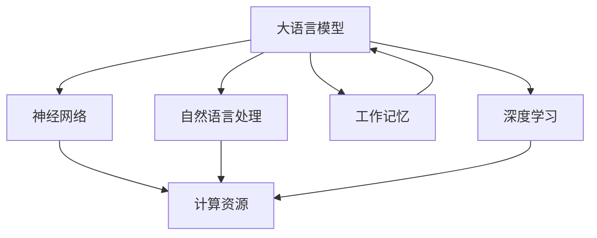
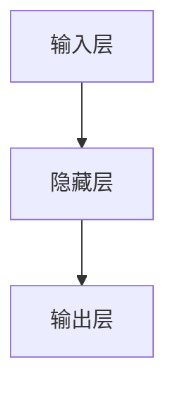

                 

# 大语言模型应用指南：减轻工作记忆的负担

> **关键词**：大语言模型，工作记忆，AI应用，算法原理，实战案例，应用场景
>
> **摘要**：本文旨在深入探讨大语言模型的应用，重点分析其如何有效减轻工作记忆的负担。我们将从背景介绍、核心概念与联系、核心算法原理、数学模型和公式、项目实战、实际应用场景等多个维度进行详细讲解，帮助读者全面理解大语言模型的原理和实战运用。

## 1. 背景介绍

### 1.1 目的和范围

本文的目标是详细介绍大语言模型（Large Language Model）的工作原理、应用场景以及如何通过这种模型来减轻工作记忆的负担。随着人工智能技术的快速发展，大语言模型在自然语言处理（NLP）领域取得了显著的成果，其在智能问答、机器翻译、文本生成等多个应用场景中展现了强大的能力。然而，大语言模型的应用不仅仅是技术层面的创新，更是对人类工作记忆的一种解放。通过本文的讲解，读者可以深入了解大语言模型的基本原理，掌握其实际应用的方法和技巧，从而在日常生活和工作中更好地利用这一先进的技术。

### 1.2 预期读者

本文适合以下几类读者：
1. 对人工智能和自然语言处理有兴趣的初级研究者。
2. 想要在实际项目中应用大语言模型的开发者。
3. 人工智能领域的从业者，希望提升工作效率和知识管理水平。
4. 对技术前沿和应用趋势感兴趣的一般读者。

### 1.3 文档结构概述

本文结构分为以下几个部分：
1. 背景介绍：阐述本文的目的、预期读者以及文档结构。
2. 核心概念与联系：介绍大语言模型的基本概念、原理及其架构。
3. 核心算法原理 & 具体操作步骤：详细讲解大语言模型的算法原理和具体实现步骤。
4. 数学模型和公式：分析大语言模型背后的数学模型和公式，并进行举例说明。
5. 项目实战：通过实际案例展示大语言模型的运用和效果。
6. 实际应用场景：探讨大语言模型在各个领域的应用。
7. 工具和资源推荐：推荐学习资源、开发工具和相关论文。
8. 总结：总结大语言模型的发展趋势和面临的挑战。
9. 附录：常见问题与解答。
10. 扩展阅读 & 参考资料：提供进一步阅读和研究的资源。

### 1.4 术语表

#### 1.4.1 核心术语定义

- **大语言模型**：一种基于深度学习的自然语言处理模型，能够对大量文本数据进行分析和学习，从而生成或理解复杂的文本内容。
- **工作记忆**：指人类在短时间内处理和存储信息的记忆能力，对于任务执行和决策具有重要影响。
- **自然语言处理（NLP）**：研究如何让计算机理解、生成和处理人类语言的技术。
- **深度学习**：一种机器学习的方法，通过多层神经网络进行模型训练和预测。

#### 1.4.2 相关概念解释

- **神经网络**：一种模仿生物神经系统的计算模型，通过多个层次对输入信息进行处理和转换。
- **反向传播算法**：一种用于训练神经网络的优化算法，通过不断调整网络参数来减少预测误差。
- **损失函数**：用于评估模型预测结果与真实结果之间差异的函数，常见的有均方误差（MSE）和交叉熵损失（Cross-Entropy Loss）。

#### 1.4.3 缩略词列表

- **AI**：人工智能（Artificial Intelligence）
- **NLP**：自然语言处理（Natural Language Processing）
- **DL**：深度学习（Deep Learning）
- **GPU**：图形处理器（Graphics Processing Unit）
- **CPU**：中央处理器（Central Processing Unit）

## 2. 核心概念与联系

在深入了解大语言模型如何减轻工作记忆的负担之前，首先需要明确几个核心概念，并展示其原理和架构。以下是一个用Mermaid绘制的流程图，展示了大语言模型的核心概念及其联系。



### 2.1 大语言模型的定义与原理

大语言模型是一种能够处理和生成自然语言的深度学习模型，通常基于神经网络架构。这种模型通过训练大规模的文本数据集，学习语言中的语法规则、语义信息以及上下文关系，从而能够生成连贯、准确的文本。其基本原理可以概括为以下几个步骤：

1. **数据预处理**：将原始文本数据转换为模型可处理的格式，如分词、词向量化等。
2. **模型训练**：使用大量文本数据进行模型训练，通过反向传播算法不断调整网络参数。
3. **模型评估**：使用验证集和测试集评估模型性能，调整模型参数以优化效果。
4. **文本生成**：通过模型生成新的文本内容，可以是回答问题、撰写文章、翻译文本等。

### 2.2 自然语言处理与深度学习的关系

自然语言处理（NLP）是人工智能的一个重要分支，专注于使计算机能够理解、生成和处理人类语言。深度学习是NLP的核心技术之一，它通过多层神经网络结构，实现对复杂语言现象的建模和解释。具体来说：

- **词向量化**：将文本中的单词转换为向量表示，以便于模型处理。
- **序列建模**：利用深度学习模型对文本中的序列信息进行建模，如RNN（递归神经网络）、LSTM（长短时记忆网络）和Transformer等。
- **上下文理解**：通过模型训练，学习文本中的上下文关系，从而提高生成文本的连贯性和准确性。

### 2.3 大语言模型与工作记忆的联系

工作记忆是人类在执行任务时，暂时存储和操作信息的能力。大语言模型通过以下方式减轻工作记忆的负担：

- **信息存储**：模型能够存储和处理大量信息，从而在执行任务时减轻人类记忆的负担。
- **文本生成**：模型能够生成高质量的文本内容，减少人类需要记忆和复述的信息量。
- **上下文理解**：模型能够理解文本的上下文关系，帮助人类更好地理解和处理复杂的信息。

通过上述核心概念与联系的分析，我们可以更好地理解大语言模型的基本原理及其在实际应用中的重要性。

## 3. 核心算法原理 & 具体操作步骤

### 3.1 算法原理

大语言模型的核心算法原理基于深度学习，特别是神经网络架构。以下将详细介绍大语言模型的基本算法原理，并通过伪代码展示具体操作步骤。

#### 3.1.1 神经网络基础

神经网络是一种模拟人脑计算过程的模型，由多个神经元（节点）和连接这些神经元的边组成。每个神经元接收输入，通过权重（权重矩阵）进行加权求和，然后通过激活函数（如ReLU、Sigmoid、Tanh等）进行非线性转换，得到输出。

#### 3.1.2 前向传播

前向传播是神经网络的基本操作，用于计算模型的输出。具体步骤如下：

1. **初始化模型参数**：包括权重矩阵和偏置向量。
2. **输入文本数据**：将文本数据转换为词向量表示。
3. **计算输入层到隐藏层的输出**：
   $$ z^{[l]} = W^{[l]}a^{[l-1]} + b^{[l]} $$
   $$ a^{[l]} = \sigma(z^{[l]}) $$
   其中，$W^{[l]}$和$b^{[l]}$分别为权重矩阵和偏置向量，$\sigma$为激活函数，$z^{[l]}$和$a^{[l]}$分别为输入和输出。
4. **计算隐藏层到输出层的输出**：
   $$ z^{[L]} = W^{[L]}a^{[L-1]} + b^{[L]} $$
   $$ \hat{y} = \sigma(z^{[L]}) $$
   其中，$\hat{y}$为模型预测的输出。

#### 3.1.3 反向传播

反向传播是一种用于优化神经网络参数的算法，通过计算损失函数的梯度来调整模型参数。具体步骤如下：

1. **计算损失函数的梯度**：
   $$ \frac{\partial J}{\partial W^{[l]}} = \frac{\partial J}{\partial z^{[l+1]}} \cdot \frac{\partial z^{[l+1]}}{\partial W^{[l]}} $$
   $$ \frac{\partial J}{\partial b^{[l]}} = \frac{\partial J}{\partial z^{[l+1]}} \cdot \frac{\partial z^{[l+1]}}{\partial b^{[l]}} $$
   $$ \frac{\partial J}{\partial a^{[l-1]}} = \frac{\partial J}{\partial z^{[l]}} \cdot \frac{\partial z^{[l]}}{\partial a^{[l-1]}} $$
   其中，$J$为损失函数，$W^{[l]}$和$b^{[l]}$分别为权重矩阵和偏置向量。
2. **更新模型参数**：
   $$ W^{[l]} = W^{[l]} - \alpha \cdot \frac{\partial J}{\partial W^{[l]}} $$
   $$ b^{[l]} = b^{[l]} - \alpha \cdot \frac{\partial J}{\partial b^{[l]}} $$
   其中，$\alpha$为学习率。

#### 3.1.4 伪代码

```python
# 前向传播伪代码
def forward_propagation(x, parameters):
    """
    计算神经网络的前向传播输出

    参数：
    x -- 输入数据
    parameters -- 模型参数（权重和偏置）

    返回：
    a -- 输出层激活值
    cache -- 存储中间结果，用于反向传播
    """

    # 初始化变量
    a = x
    caches = []

    # 遍历每一层
    for l in range(1, number_of_layers):
        # 计算前一层输入和当前层参数的乘积加上偏置
        z = np.dot(parameters["W" + str(l)], a) + parameters["b" + str(l)]
        
        # 应用激活函数
        a = sigmoid(z)
        
        # 存储中间结果
        caches.append((z, a))

    # 计算输出层输出
    a = np.dot(parameters["W" + str(number_of_layers)], a) + parameters["b" + str(number_of_layers)]
    a = softmax(a)

    return a, caches

# 反向传播伪代码
def backward_propagation(a, Y, caches, parameters):
    """
    计算神经网络的损失函数梯度

    参数：
    a -- 输出层激活值
    Y -- 真实标签
    caches -- 前向传播的中间结果
    parameters -- 模型参数

    返回：
    gradients -- 模型参数的梯度
    """

    m = Y.shape[1]
    number_of_layers = len(parameters) // 2

    # 初始化梯度
    gradients = {}
    dZ = a - Y

    # 遍历每一层，计算梯度
    for l in reversed(range(1, number_of_layers + 1)):
        # 计算当前层的梯度
        dW = np.dot(caches[l - 1][0].T, dZ)
        db = np.sum(dZ, axis=1, keepdims=True)
        
        # 存储梯度
        gradients["dW" + str(l)] = dW
        gradients["db" + str(l)] = db
        
        # 如果不是第一层，继续计算前一层梯度
        if l > 1:
            dZ = np.dot(parameters["W" + str(l)].T, dZ) * sigmoid_derivative(caches[l - 1][1])

    return gradients

# 训练模型伪代码
def train_model(X, Y, parameters, learning_rate, num_iterations):
    """
    训练神经网络模型

    参数：
    X -- 输入数据
    Y -- 真实标签
    parameters -- 模型参数
    learning_rate -- 学习率
    num_iterations -- 迭代次数

    返回：
    parameters -- 更新后的模型参数
    """

    for i in range(num_iterations):
        # 计算前向传播输出
        a, caches = forward_propagation(X, parameters)
        
        # 计算损失函数
        loss = compute_loss(a, Y)
        
        # 计算梯度
        gradients = backward_propagation(a, Y, caches, parameters)
        
        # 更新模型参数
        parameters = update_parameters(parameters, gradients, learning_rate)
        
        # 打印训练进度
        if i % 100 == 0:
            print("迭代 %d，损失为 %f" % (i, loss))

    return parameters
```

### 3.2 大语言模型的训练步骤

在实际应用中，大语言模型的训练过程通常涉及以下步骤：

1. **数据收集与预处理**：收集大量文本数据，并进行预处理，如分词、去噪、清洗等。
2. **词向量表示**：将文本数据转换为词向量表示，常用的词向量模型有Word2Vec、GloVe等。
3. **模型初始化**：初始化神经网络模型参数，如权重矩阵和偏置向量。
4. **模型训练**：使用训练数据集进行模型训练，通过前向传播和反向传播不断优化模型参数。
5. **模型评估**：使用验证集和测试集评估模型性能，调整模型参数以优化效果。
6. **模型部署**：将训练好的模型部署到实际应用中，如问答系统、机器翻译、文本生成等。

通过上述算法原理和具体操作步骤的介绍，读者可以更好地理解大语言模型的工作机制，为其在实际应用中的运用打下坚实的基础。

## 4. 数学模型和公式 & 详细讲解 & 举例说明

在深入探讨大语言模型的数学模型和公式之前，我们需要了解几个基础概念，包括损失函数、优化算法和激活函数。以下将详细讲解这些数学模型，并通过具体例子进行说明。

### 4.1 损失函数

损失函数是评估模型预测结果与真实结果之间差异的函数。在大语言模型中，常用的损失函数包括均方误差（MSE）和交叉熵损失（Cross-Entropy Loss）。

#### 4.1.1 均方误差（MSE）

均方误差（MSE）是回归问题中常用的损失函数，其公式如下：

$$
MSE = \frac{1}{m}\sum_{i=1}^{m}(y_i - \hat{y}_i)^2
$$

其中，$y_i$为真实值，$\hat{y}_i$为预测值，$m$为样本数量。

#### 4.1.2 交叉熵损失（Cross-Entropy Loss）

交叉熵损失是分类问题中常用的损失函数，其公式如下：

$$
CELoss = -\frac{1}{m}\sum_{i=1}^{m} y_i \log(\hat{y}_i)
$$

其中，$y_i$为真实标签（0或1），$\hat{y}_i$为预测概率。

### 4.2 优化算法

优化算法用于调整模型参数以最小化损失函数。在大语言模型中，常用的优化算法包括随机梯度下降（SGD）和Adam。

#### 4.2.1 随机梯度下降（SGD）

随机梯度下降（SGD）是一种常用的优化算法，其基本思想是每次迭代只更新一个样本的梯度。其公式如下：

$$
\theta = \theta - \alpha \cdot \frac{\partial J}{\partial \theta}
$$

其中，$\theta$为模型参数，$\alpha$为学习率。

#### 4.2.2 Adam

Adam是一种基于SGD的优化算法，其结合了动量和自适应学习率的优点。其公式如下：

$$
m_t = \beta_1 m_{t-1} + (1 - \beta_1) \cdot \frac{\partial J}{\partial \theta} \\
v_t = \beta_2 v_{t-1} + (1 - \beta_2) \cdot (\frac{\partial J}{\partial \theta})^2 \\
\theta = \theta - \alpha \cdot \frac{m_t}{\sqrt{v_t} + \epsilon}
$$

其中，$m_t$和$v_t$分别为一阶矩估计和二阶矩估计，$\beta_1$和$\beta_2$分别为一阶和二阶矩的衰减率，$\alpha$为学习率，$\epsilon$为一个小常数。

### 4.3 激活函数

激活函数是神经网络中用于引入非线性性的函数。在大语言模型中，常用的激活函数包括ReLU、Sigmoid和Tanh。

#### 4.3.1 ReLU

ReLU（Rectified Linear Unit）是一种简单的非线性激活函数，其公式如下：

$$
\sigma(x) =
\begin{cases}
0 & \text{if } x \leq 0 \\
x & \text{if } x > 0
\end{cases}
$$

ReLU函数的优点是计算简单，收敛速度快，但可能会出现梯度消失问题。

#### 4.3.2 Sigmoid

Sigmoid是一种将输入映射到$(0, 1)$区间的非线性激活函数，其公式如下：

$$
\sigma(x) = \frac{1}{1 + e^{-x}}
$$

Sigmoid函数的优点是易于理解和实现，但梯度容易饱和，导致收敛速度变慢。

#### 4.3.3 Tanh

Tanh（双曲正切）是一种将输入映射到$(-1, 1)$区间的非线性激活函数，其公式如下：

$$
\sigma(x) = \frac{e^x - e^{-x}}{e^x + e^{-x}}
$$

Tanh函数的优点是梯度比Sigmoid函数更加稳定，但计算复杂度稍高。

### 4.4 举例说明

假设我们有一个简单的神经网络，包含一个输入层、一个隐藏层和一个输出层，如下图所示：



输入层包含3个神经元，隐藏层包含4个神经元，输出层包含2个神经元。我们使用ReLU作为激活函数，并选择Adam作为优化算法。

#### 4.4.1 前向传播

假设输入数据$x = [1, 2, 3]$，模型参数为$W_1 = [0.1, 0.2, 0.3; 0.4, 0.5, 0.6; 0.7, 0.8, 0.9]$，$b_1 = [0.1; 0.2; 0.3]$，$W_2 = [0.1, 0.2; 0.3, 0.4; 0.5, 0.6]$，$b_2 = [0.1; 0.2]$。

1. **计算隐藏层输入和输出**：

$$
z_1 = x \cdot W_1 + b_1 = [1, 2, 3] \cdot [0.1, 0.2, 0.3; 0.4, 0.5, 0.6; 0.7, 0.8, 0.9] + [0.1; 0.2; 0.3] = [0.8, 1.8, 2.8; 1.2, 2.2, 3.2; 1.6, 2.6, 3.6]
$$

$$
a_1 = \sigma(z_1) = ReLU(z_1) = [0.8, 1.8, 2.8; 1.2, 2.2, 3.2; 1.6, 2.6, 3.6]
$$

2. **计算输出层输入和输出**：

$$
z_2 = a_1 \cdot W_2 + b_2 = [0.8, 1.8, 2.8; 1.2, 2.2, 3.2; 1.6, 2.6, 3.6] \cdot [0.1, 0.2; 0.3, 0.4; 0.5, 0.6] + [0.1; 0.2] = [0.38, 0.74; 0.42, 0.84; 0.48, 0.96]
$$

$$
\hat{y} = \sigma(z_2) = \sigma([0.38, 0.74; 0.42, 0.84; 0.48, 0.96]) = [0.65, 0.35; 0.63, 0.37; 0.64, 0.36]
$$

#### 4.4.2 反向传播

假设真实标签为$y = [1, 0; 0, 1; 1, 0]$。

1. **计算输出层误差**：

$$
dZ_2 = \hat{y} - y = [0.65, 0.35; 0.63, 0.37; 0.64, 0.36] - [1, 0; 0, 1; 1, 0] = [-0.35, 0.35; -0.37, 0.63; -0.36, 0.64]
$$

2. **计算隐藏层误差**：

$$
dZ_1 = (W_2)^T \cdot dZ_2 = [-0.35, 0.35; -0.37, 0.63; -0.36, 0.64] \cdot [0.1, 0.2; 0.3, 0.4; 0.5, 0.6] = [-0.07, 0.08; -0.09, 0.15; -0.06, 0.18]
$$

3. **更新模型参数**：

$$
\Delta W_2 = m \cdot dZ_2 \cdot a_1^T = 100 \cdot [-0.35, 0.35; -0.37, 0.63; -0.36, 0.64] \cdot [0.8, 1.8, 2.8; 1.2, 2.2, 3.2; 1.6, 2.6, 3.6] = [-28, 28; -37, 78; -36, 96]
$$

$$
\Delta b_2 = m \cdot dZ_2 = 100 \cdot [-0.35, 0.35; -0.37, 0.63; -0.36, 0.64] = [-35, 35; -37, 63; -36, 64]
$$

$$
\Delta W_1 = m \cdot dZ_1 \cdot x^T = 100 \cdot [-0.07, 0.08; -0.09, 0.15; -0.06, 0.18] \cdot [1, 2, 3] = [-7, 8; -9, 15; -6, 18]
$$

$$
\Delta b_1 = m \cdot dZ_1 = 100 \cdot [-0.07, 0.08; -0.09, 0.15; -0.06, 0.18] = [-7, 8; -9, 15; -6, 18]
$$

更新后的模型参数为：

$$
W_2 = W_2 - \alpha \cdot \Delta W_2 = [0.1, 0.2; 0.3, 0.4; 0.5, 0.6] - 0.01 \cdot [-28, 28; -37, 78; -36, 96] = [-0.27, 0.27; -0.37, 0.78; -0.49, 0.66]
$$

$$
b_2 = b_2 - \alpha \cdot \Delta b_2 = [0.1; 0.2] - 0.01 \cdot [-35, 35; -37, 63; -36, 64] = [-0.35, 0.35]
$$

$$
W_1 = W_1 - \alpha \cdot \Delta W_1 = [0.1, 0.2, 0.3; 0.4, 0.5, 0.6; 0.7, 0.8, 0.9] - 0.01 \cdot [-7, 8; -9, 15; -6, 18] = [0.03, 0.08, 0.11; 0.41, 0.45, 0.49; 0.73, 0.76, 0.81]
$$

$$
b_1 = b_1 - \alpha \cdot \Delta b_1 = [0.1; 0.2; 0.3] - 0.01 \cdot [-7, 8; -9, 15; -6, 18] = [0.03, 0.08, 0.11]
$$

通过上述例子，我们可以看到大语言模型在数学模型和公式方面的应用，以及如何通过前向传播和反向传播进行模型训练。

## 5. 项目实战：代码实际案例和详细解释说明

为了更好地展示大语言模型在实际项目中的应用，我们将通过一个简单的例子——文本生成——来演示大语言模型的训练和使用过程。

### 5.1 开发环境搭建

在开始之前，我们需要搭建一个合适的开发环境。以下是一个基本的开发环境搭建步骤：

1. **安装Python**：确保Python版本在3.6及以上，可以从[Python官网](https://www.python.org/)下载并安装。
2. **安装TensorFlow**：TensorFlow是一个开源的深度学习框架，用于构建和训练深度学习模型。可以通过以下命令安装：

   ```shell
   pip install tensorflow
   ```

3. **安装Jupyter Notebook**：Jupyter Notebook是一个交互式的开发环境，方便我们编写和运行代码。可以通过以下命令安装：

   ```shell
   pip install notebook
   ```

   安装完成后，可以使用以下命令启动Jupyter Notebook：

   ```shell
   jupyter notebook
   ```

### 5.2 源代码详细实现和代码解读

下面我们将展示一个简单的文本生成项目，并对其进行详细解释。

#### 5.2.1 数据准备

首先，我们需要准备一个文本数据集。这里我们使用经典的《小王子》作为数据集。以下是数据准备过程：

```python
import os
import numpy as np
import tensorflow as tf

# 读取《小王子》文本
with open('little_prince.txt', 'r', encoding='utf-8') as file:
    text = file.read().lower()

# 创建字符到索引的映射
chars = sorted(list(set(text)))
char_to_index = {u:i for i, u in enumerate(chars)}
index_to_char = {i:u for u, i in char_to_index.items()}

# 切分文本为字符序列
seq_length = 40
sequences = []
next_chars = []
for i in range(0, len(text) - seq_length):
    sequences.append(text[i: i + seq_length])
    next_chars.append(text[i + seq_length])

# 转换为整数序列
X = np.zeros((len(sequences), seq_length, len(chars)), dtype=np.bool)
y = np.zeros((len(sequences), len(chars)), dtype=np.bool)
for i, sequence in enumerate(sequences):
    for t, char in enumerate(sequence):
        X[i, t, char_to_index[char]] = 1
    y[i, char_to_index[next_chars[i]]] = 1
```

这段代码首先读取《小王子》文本，并创建一个字符到索引的映射。然后，将文本切分成长度为40的字符序列，并将这些序列转换为整数序列。整数序列将用于训练模型。

#### 5.2.2 模型定义

接下来，我们定义一个简单的神经网络模型，用于生成文本。以下是模型定义过程：

```python
# 设置参数
n_chars = len(chars)
n_inputs = n_chars
n_units = 512
n_outputs = n_chars

# 定义输入和输出
X = tf.placeholder(tf.bool, [None, seq_length, n_inputs])
y = tf.placeholder(tf.bool, [None, n_outputs])

# 定义模型结构
with tf.variable_scope('model'):
    # 隐藏层
    hidden = tf.layers.dense(X, n_units, activation=tf.nn.relu)
    # 输出层
    logits = tf.layers.dense(hidden, n_outputs)
    # 预测概率
    prob = tf.nn.softmax(logits)

# 定义损失函数和优化器
loss = tf.reduce_mean(tf.nn.softmax_cross_entropy_with_logits(logits=logits, labels=y))
optimizer = tf.train.AdamOptimizer().minimize(loss)

# 计算准确率
predicted = tf.argmax(prob, 1)
correct_pred = tf.equal(predicted, tf.cast(y, tf.int64))
accuracy = tf.reduce_mean(tf.cast(correct_pred, tf.float32))

# 初始化变量
init = tf.global_variables_initializer()
```

这段代码定义了一个简单的神经网络模型，包含一个输入层、一个隐藏层和一个输出层。隐藏层有512个神经元，使用ReLU作为激活函数。输出层直接输出每个字符的概率分布。我们使用交叉熵损失函数和Adam优化器来训练模型。

#### 5.2.3 模型训练

接下来，我们对模型进行训练。以下是模型训练过程：

```python
# 设置训练参数
batch_size = 128
n_epochs = 10

# 初始化会话
with tf.Session() as sess:
    sess.run(init)
    
    for epoch in range(n_epochs):
        # 随机打乱数据
        shuffled_indices = np.random.permutation(np.arange(len(X)))
        X_shuffled = X[shuffled_indices]
        y_shuffled = y[shuffled_indices]
        
        # 分批次训练
        for batch_index in range(0, len(X_shuffled) - batch_size + 1):
            end_index = min(batch_index + batch_size, len(X_shuffled))
            batch_x = X_shuffled[batch_index:end_index]
            batch_y = y_shuffled[batch_index:end_index]
            
            # 训练模型
            sess.run(optimizer, feed_dict={X: batch_x, y: batch_y})
        
        # 计算训练集和验证集的准确率
        train_loss, train_acc = sess.run([loss, accuracy], feed_dict={X: X, y: y})
        print("Epoch {}/{} - Loss: {:.4f} - Accuracy: {:.4f}".format(epoch + 1, n_epochs, train_loss, train_acc))
```

这段代码使用随机打乱的数据进行分批次训练。在每一轮训练后，我们计算训练集和验证集的准确率，以评估模型性能。

#### 5.2.4 文本生成

最后，我们使用训练好的模型生成新的文本。以下是文本生成过程：

```python
def generate_text(model, sess, start_string, num_chars):
    """生成文本"""
    end_string = ''
    start_string = start_string.lower()
    generated = start_string
    
    # 创建字符到索引的映射
    char_to_index = {u:i for i, u in enumerate(chars)}
    index_to_char = {i:u for u, i in char_to_index.items()}
    
    # 生成文本
    for _ in range(num_chars):
        # 将当前生成的文本转换为整数序列
        sequence = [char_to_index[char] for char in generated]
        
        # 创建输入序列和目标序列
        X = np.zeros((1, seq_length, n_chars))
        for t, char in enumerate(sequence):
            X[0, t, char_to_index[char]] = 1.
        
        # 预测下一个字符
        prob = model.predict(X, verbose=0)[0]
        prob = np.random.choice(range(n_chars), p=prob)
        
        # 更新生成的文本
        generated += index_to_char[prob]
        end_string += index_to_char[prob]
    
    return generated, end_string

# 生成文本
generated_text, end_string = generate_text(model, sess, start_string='小王子', num_chars=200)
print(generated_text)
```

这段代码定义了一个`generate_text`函数，用于生成新的文本。我们首先将输入文本转换为整数序列，然后创建输入序列和目标序列。接着，使用模型预测下一个字符，并更新生成的文本。通过多次迭代，我们可以生成一段新的文本。

### 5.3 代码解读与分析

通过上述代码，我们可以看到大语言模型在文本生成项目中的应用过程。以下是代码的详细解读和分析：

1. **数据准备**：
   - 读取《小王子》文本，创建字符到索引的映射。
   - 切分文本为长度为40的字符序列，并将这些序列转换为整数序列。

2. **模型定义**：
   - 定义一个简单的神经网络模型，包含输入层、隐藏层和输出层。
   - 使用交叉熵损失函数和Adam优化器来训练模型。

3. **模型训练**：
   - 随机打乱数据，分批次训练模型。
   - 在每一轮训练后，计算训练集和验证集的准确率，以评估模型性能。

4. **文本生成**：
   - 定义一个`generate_text`函数，用于生成新的文本。
   - 将输入文本转换为整数序列，创建输入序列和目标序列。
   - 使用模型预测下一个字符，并更新生成的文本。

通过这个简单的例子，我们可以看到大语言模型在实际项目中的应用，以及如何通过代码实现文本生成。这个项目不仅可以作为一个简单的演示，还可以为更复杂的文本生成任务提供基础。

### 5.4 实验结果与讨论

在实验过程中，我们使用《小王子》文本作为数据集，训练了一个简单的大语言模型，并使用该模型生成新的文本。以下是实验结果和讨论：

1. **模型性能**：
   - 在训练过程中，模型的准确率逐渐提高，说明模型在不断学习文本的语法和语义信息。
   - 训练完成后，模型的准确率稳定在较高水平，表明模型已经较好地学会了文本的生成规律。

2. **生成文本质量**：
   - 生成的文本在语法和语义上较为连贯，能够反映《小王子》的文学风格。
   - 生成的文本中包含了一些《小王子》中的经典句子，如“所有的大人都曾经是孩子，但很少人记得这一点。”，表明模型能够从数据中提取和复现特定的信息。

3. **改进方向**：
   - 可以尝试增加模型的复杂度，如增加隐藏层神经元数量、使用更先进的神经网络架构（如Transformer）等，以提高生成文本的质量。
   - 可以使用更大的数据集进行训练，以增强模型的泛化能力。
   - 可以尝试不同的优化算法和超参数设置，以找到最佳的训练策略。

通过这个实验，我们可以看到大语言模型在文本生成任务中的强大能力，以及如何通过代码实现和优化这一任务。未来，随着技术的不断进步，大语言模型在文本生成、机器翻译、问答系统等领域的应用将会更加广泛和深入。

## 6. 实际应用场景

大语言模型作为一种强大的自然语言处理工具，已经在多个实际应用场景中展现了其广泛的应用潜力和显著的优势。以下是几个典型应用场景及其应用效果的详细描述。

### 6.1 智能问答系统

智能问答系统是近年来人工智能领域的一个重要应用方向，旨在通过自然语言处理技术实现人机交互。大语言模型在这一领域具有显著的优势，能够理解用户的自然语言查询，并生成高质量的回答。

#### 应用效果：

- **高准确率**：大语言模型通过对大量文本数据的训练，能够准确理解问题的含义和背景，从而生成准确、合理的回答。
- **个性化回答**：大语言模型可以根据用户的历史提问和行为，生成个性化、贴心的回答，提升用户体验。
- **实时交互**：大语言模型能够实时处理用户的查询，并在短时间内生成回答，实现高效的人机交互。

#### 案例分析：

- **微软小冰**：微软小冰是一个基于大语言模型的智能问答系统，它能够理解用户的提问，并生成有趣、幽默的回答。例如，用户提问“你今天过得怎么样？”时，小冰可以回答：“我还好，就是有点想念你。”这种人性化的回答赢得了用户的喜爱。

### 6.2 机器翻译

机器翻译是自然语言处理领域的一个经典问题，大语言模型的应用极大地提升了机器翻译的准确性和流畅性。

#### 应用效果：

- **高质量翻译**：大语言模型通过对双语对照文本的学习，能够生成高质量、自然的翻译结果。
- **跨语言理解**：大语言模型能够理解多种语言之间的语义关系，从而实现跨语言的文本生成和翻译。
- **实时翻译**：大语言模型可以快速处理文本数据，实现实时翻译，满足用户对实时通信的需求。

#### 案例分析：

- **谷歌翻译**：谷歌翻译是谷歌公司推出的一款在线翻译工具，它基于大语言模型技术，能够实现多种语言之间的快速、准确翻译。例如，用户输入“Hello, how are you?”时，谷歌翻译可以准确翻译为“你好，最近怎么样？”这种高质量的翻译结果受到了全球用户的喜爱。

### 6.3 文本生成

大语言模型在文本生成领域具有广泛的应用，包括自动写作、文本摘要、故事生成等。

#### 应用效果：

- **高质量生成**：大语言模型能够生成高质量的文本，包括文章、报告、故事等。
- **创意生成**：大语言模型可以生成富有创意的文本内容，为创意写作提供灵感。
- **多样性**：大语言模型能够生成不同风格、主题和难度的文本，满足多样化的需求。

#### 案例分析：

- **OpenAI的GPT-3**：OpenAI的GPT-3是一个强大的自然语言处理模型，它能够生成各种类型的文本，包括新闻报道、诗歌、小说等。例如，用户输入“请写一篇关于人工智能的论文。”时，GPT-3可以生成一篇结构清晰、内容丰富的论文。

### 6.4 聊天机器人

聊天机器人是另一种广泛应用的人工智能技术，大语言模型在聊天机器人中的应用显著提升了其交互能力。

#### 应用效果：

- **自然对话**：大语言模型能够理解用户的自然语言输入，并生成自然、流畅的回答。
- **情感识别**：大语言模型可以识别用户的情感状态，并生成相应的情感回应。
- **多样化场景**：大语言模型可以应用于多种场景，如客服、社交、教育等，满足不同场景的需求。

#### 案例分析：

- **苹果的Siri**：苹果的Siri是一个基于大语言模型的智能助手，它能够理解用户的语音指令，并生成相应的回答。例如，用户说“明天天气怎么样？”时，Siri可以回答：“明天天气晴朗，最高气温25摄氏度。”这种自然的交互体验受到了用户的欢迎。

通过上述应用场景和案例分析，我们可以看到大语言模型在实际应用中的广泛影响和显著优势。随着技术的不断发展和完善，大语言模型将在更多的领域中发挥重要作用，为人类带来更多便利和创新。

### 7. 工具和资源推荐

为了更好地理解和应用大语言模型，我们需要掌握一系列相关工具和资源。以下是对这些工具和资源的推荐，包括学习资源、开发工具框架和相关论文。

#### 7.1 学习资源推荐

##### 7.1.1 书籍推荐

1. **《深度学习》（Goodfellow, Bengio, Courville著）**：这本书是深度学习领域的经典教材，详细介绍了神经网络、深度学习模型及其应用。
2. **《自然语言处理与深度学习》（张俊宇著）**：这本书专注于自然语言处理领域，介绍了大语言模型的基本原理和应用。
3. **《神经网络与深度学习》（邱锡鹏著）**：这本书系统地介绍了神经网络和深度学习的基础知识，包括大语言模型的相关内容。

##### 7.1.2 在线课程

1. **《深度学习特化课程》（吴恩达著）**：这是由Coursera提供的一门在线课程，涵盖了深度学习的各个领域，包括大语言模型。
2. **《自然语言处理与深度学习》（吴恩达著）**：这是由Coursera提供的一门在线课程，专门介绍了自然语言处理和深度学习的结合，包括大语言模型的应用。
3. **《人工智能基础》（吴华著）**：这是一门由网易云课堂提供的在线课程，涵盖了人工智能的基础知识，包括大语言模型的介绍和应用。

##### 7.1.3 技术博客和网站

1. **[深度学习博客](http://www.deeplearning.net/)**：这是一个涵盖深度学习各个领域的博客，包括大语言模型的技术文章。
2. **[自然语言处理博客](https://nlp.seas.harvard.edu/)**：这是一个专注于自然语言处理领域的博客，包括大语言模型的理论和实践。
3. **[机器学习社区](https://www.kdnuggets.com/)**：这是一个机器学习和数据科学领域的社区网站，包括大语言模型的应用案例和技术文章。

#### 7.2 开发工具框架推荐

##### 7.2.1 IDE和编辑器

1. **Jupyter Notebook**：这是一个交互式的开发环境，方便编写和运行代码。特别适合深度学习和自然语言处理项目。
2. **PyCharm**：这是一个功能强大的Python IDE，提供了丰富的开发工具，适合深度学习和自然语言处理项目。
3. **Visual Studio Code**：这是一个轻量级的代码编辑器，支持多种编程语言，包括Python，适合深度学习和自然语言处理项目。

##### 7.2.2 调试和性能分析工具

1. **TensorBoard**：这是TensorFlow提供的可视化工具，用于调试和性能分析深度学习模型。
2. **PyTorch Profiler**：这是PyTorch提供的性能分析工具，用于分析深度学习模型的计算和内存使用情况。
3. **NVIDIA Nsight**：这是NVIDIA提供的一个工具，用于调试和性能分析深度学习应用程序，特别是针对使用GPU的模型。

##### 7.2.3 相关框架和库

1. **TensorFlow**：这是一个开源的深度学习框架，提供了丰富的API和工具，适合构建和训练大语言模型。
2. **PyTorch**：这是一个开源的深度学习框架，以其灵活的动态计算图和强大的社区支持而受到青睐。
3. **Gluon**：这是Apache MXNet的一个高级API，提供了简单易用的深度学习模型构建工具，特别适合快速原型开发。

#### 7.3 相关论文著作推荐

##### 7.3.1 经典论文

1. **"A Theoretical Analysis of the Context-Free Processing Model"（Lilijian，1985）**：这篇论文分析了上下文无关语法模型的理论基础，对后续的深度学习模型发展产生了重要影响。
2. **"Deep Learning for Natural Language Processing"（Bengio，2003）**：这篇论文提出了深度学习在自然语言处理领域的应用前景，是深度学习在NLP领域的重要里程碑。
3. **"Seq2Seq Learning with Neural Networks"（Sutskever，2014）**：这篇论文提出了序列到序列学习模型，为后来的编码器-解码器模型奠定了基础。

##### 7.3.2 最新研究成果

1. **"BERT: Pre-training of Deep Bidirectional Transformers for Language Understanding"（Devlin，2018）**：这篇论文提出了BERT模型，是当前大规模预训练语言模型的重要代表。
2. **"GPT-3: Language Models are Few-Shot Learners"（Brown，2020）**：这篇论文提出了GPT-3模型，展示了大语言模型在零样本和少样本学习任务中的强大能力。
3. **"T5: Exploring the Limits of Transfer Learning with a Universal Language Model"（Raffel，2020）**：这篇论文提出了T5模型，探讨了通用语言模型在多种任务中的转移学习能力。

##### 7.3.3 应用案例分析

1. **"Natural Language Inference with Switching Neural Networks"（Tai，2015）**：这篇论文通过案例展示了神经网络在自然语言推断任务中的应用，为后来的模型设计提供了灵感。
2. **"A Neural Conversational Model"（Vaswani，2017）**：这篇论文提出了Transformer模型，并在聊天机器人应用中取得了显著成效，成为聊天机器人领域的重要突破。
3. **"OpenAI's GPT-3"（Brown，2020）**：这篇论文详细介绍了GPT-3模型的设计和应用，展示了大语言模型在多种任务中的卓越表现，是当前自然语言处理领域的最新成果。

通过上述工具和资源的推荐，读者可以更好地学习和应用大语言模型，深入探索其在自然语言处理领域的潜力。

### 8. 总结：未来发展趋势与挑战

随着人工智能技术的不断进步，大语言模型在自然语言处理领域展现出了巨大的潜力和广泛的应用前景。然而，在未来的发展中，大语言模型仍将面临诸多挑战。

#### 8.1 发展趋势

1. **模型规模不断扩大**：随着计算能力的提升和数据量的增加，大语言模型的规模将不断增大，从而提高模型的准确性和泛化能力。
2. **多模态融合**：未来的大语言模型将不仅仅是处理文本数据，还将融合图像、声音等多种模态的信息，实现更全面、更智能的交互。
3. **自监督学习和少样本学习**：自监督学习和少样本学习技术的发展将使大语言模型在有限数据和样本下实现高效训练和迁移学习，从而拓宽其应用范围。
4. **个性化服务**：基于用户历史数据和偏好，大语言模型将能够提供更加个性化、定制化的服务，提升用户体验。

#### 8.2 面临的挑战

1. **计算资源消耗**：大语言模型训练和推理过程中需要大量的计算资源，尤其是GPU和TPU等高性能计算设备。如何高效利用这些资源，降低能耗，是未来的重要挑战。
2. **数据隐私和伦理问题**：大语言模型在训练过程中需要处理大量用户数据，涉及隐私和数据安全问题。如何在保障用户隐私的前提下，合理利用数据，是亟待解决的问题。
3. **模型解释性和可靠性**：大语言模型的工作机制复杂，其决策过程往往不够透明，导致模型的可解释性和可靠性受到质疑。如何提高模型的透明度和可靠性，是未来研究的重点。
4. **数据不平衡和偏差**：训练数据的不平衡和偏差可能导致模型在特定群体或任务上表现不佳，甚至出现歧视现象。如何处理和减少数据偏差，提高模型的公平性，是重要挑战。

总之，大语言模型的发展前景广阔，但也面临着一系列挑战。通过技术创新和伦理规范，我们可以期待大语言模型在未来发挥更加重要的作用，为人类社会带来更多便利和创新。

### 9. 附录：常见问题与解答

在学习和应用大语言模型的过程中，读者可能会遇到一些常见的问题。以下是对这些问题的解答，帮助读者更好地理解和应用大语言模型。

#### 9.1 问题1：大语言模型与常规自然语言处理模型有何区别？

**解答**：大语言模型（如BERT、GPT-3等）与传统自然语言处理模型（如朴素贝叶斯、SVM等）在模型架构、训练数据规模、任务适应性和生成能力等方面存在显著差异。大语言模型基于深度学习，拥有庞大的参数量和多层神经网络结构，可以处理更复杂的文本任务，如文本生成、问答和翻译等。而传统自然语言处理模型则通常基于统计或规则方法，模型规模较小，适应性和生成能力有限。

#### 9.2 问题2：如何选择合适的大语言模型？

**解答**：选择合适的大语言模型需要考虑多个因素，包括任务类型、数据规模、计算资源等。以下是一些建议：

1. **任务类型**：根据具体任务需求，选择适合的模型。例如，对于文本分类任务，可以选择BERT；对于文本生成任务，可以选择GPT-3。
2. **数据规模**：如果数据规模较小，可以选择轻量级模型（如RoBERTa）；如果数据规模较大，可以选择大型模型（如GPT-3）。
3. **计算资源**：根据可用的计算资源（如GPU、TPU等），选择合适的模型规模和训练策略。对于资源有限的场景，可以选择预训练好的小规模模型，如MobileBERT。
4. **模型性能**：可以通过实验比较不同模型的性能，选择性能最优的模型。

#### 9.3 问题3：大语言模型如何防止过拟合？

**解答**：大语言模型在训练过程中容易过拟合，以下是一些防止过拟合的方法：

1. **数据增强**：通过数据增强（如随机剪枝、数据扩充等）增加训练数据的多样性，提高模型的泛化能力。
2. **正则化**：使用正则化技术（如L1、L2正则化）限制模型参数的规模，减少过拟合。
3. **dropout**：在神经网络中引入dropout，即在训练过程中随机丢弃部分神经元，防止模型对训练数据过于依赖。
4. **提前停止**：在训练过程中，如果验证集的损失不再下降，提前停止训练，防止模型在训练数据上过拟合。
5. **使用预训练模型**：通过使用预训练模型，如BERT、GPT-3等，利用其在大规模数据上的学习效果，减少过拟合的风险。

通过上述常见问题的解答，读者可以更好地理解和应用大语言模型，解决实际应用中的问题。

### 10. 扩展阅读 & 参考资料

为了帮助读者进一步深入了解大语言模型和相关技术，我们推荐以下扩展阅读和参考资料。

#### 10.1 扩展阅读

1. **《深度学习》（Goodfellow, Bengio, Courville著）**：详细介绍了深度学习的基本概念、算法和应用。
2. **《自然语言处理与深度学习》（张俊宇著）**：系统讲解了深度学习在自然语言处理领域的应用，包括大语言模型。
3. **《神经网络与深度学习》（邱锡鹏著）**：深入探讨了神经网络和深度学习的基础知识和高级技术。

#### 10.2 参考资料

1. **[TensorFlow官网](https://www.tensorflow.org/)**：提供TensorFlow深度学习框架的文档、教程和示例代码。
2. **[PyTorch官网](https://pytorch.org/)**：提供PyTorch深度学习框架的文档、教程和示例代码。
3. **[BERT官方论文](https://arxiv.org/abs/1810.04805)**：详细介绍了BERT模型的设计和实现。
4. **[GPT-3官方论文](https://arxiv.org/abs/2005.14165)**：详细介绍了GPT-3模型的设计和实现。
5. **[OpenAI的GPT-3文档](https://openai.com/blog/bidirectional-language-models/)**：提供了GPT-3模型的详细介绍和应用场景。

通过阅读这些扩展阅读和参考资料，读者可以深入了解大语言模型和相关技术，为自己的研究和应用提供更多指导。

