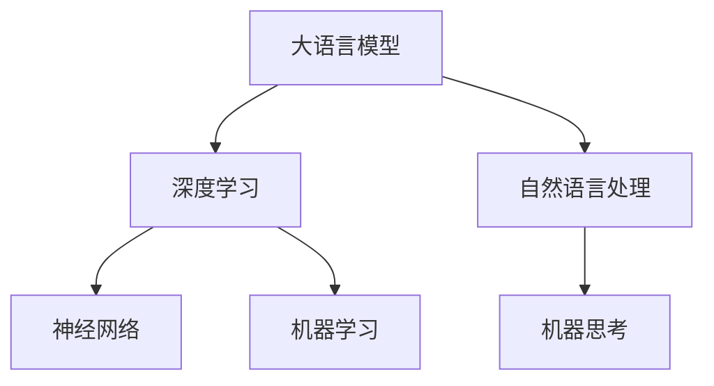

                 

# 大语言模型应用指南：机器能思考吗？

> **关键词：** 大语言模型，机器思考，人工智能，深度学习，神经网络，自然语言处理

> **摘要：** 本文将深入探讨大语言模型的应用及其在机器思考中的潜力。我们将从背景介绍、核心概念与联系、核心算法原理、数学模型和公式、项目实战、实际应用场景等方面展开，旨在为读者提供一个全面而深入的理解。

## 1. 背景介绍

### 1.1 目的和范围

本文旨在探讨大语言模型的应用及其在机器思考中的潜力。我们将首先介绍大语言模型的发展背景和重要性，然后逐步深入探讨其核心概念、算法原理、数学模型、实际应用场景等。希望通过本文，读者能够对大语言模型有一个全面而深入的理解。

### 1.2 预期读者

本文适用于对人工智能、深度学习、自然语言处理有一定了解的读者，特别是对大语言模型感兴趣的技术人员和研究学者。无论您是初学者还是专业人士，本文都将为您提供有价值的信息。

### 1.3 文档结构概述

本文分为以下八个部分：

1. 背景介绍
2. 核心概念与联系
3. 核心算法原理 & 具体操作步骤
4. 数学模型和公式 & 详细讲解 & 举例说明
5. 项目实战：代码实际案例和详细解释说明
6. 实际应用场景
7. 工具和资源推荐
8. 总结：未来发展趋势与挑战

### 1.4 术语表

#### 1.4.1 核心术语定义

- **大语言模型**：一种基于深度学习的自然语言处理模型，具有强大的语义理解和生成能力。
- **神经网络**：一种模拟人脑神经元连接结构的计算模型，广泛应用于机器学习和深度学习领域。
- **自然语言处理**：研究计算机如何理解、生成和处理自然语言的学科。

#### 1.4.2 相关概念解释

- **机器思考**：指机器具有类似于人类的认知能力，能够进行推理、学习和决策。
- **深度学习**：一种利用多层神经网络进行训练和预测的机器学习技术。

#### 1.4.3 缩略词列表

- **NLP**：自然语言处理（Natural Language Processing）
- **DL**：深度学习（Deep Learning）
- **AI**：人工智能（Artificial Intelligence）

## 2. 核心概念与联系

在深入探讨大语言模型的应用之前，我们首先需要了解一些核心概念和它们之间的联系。以下是一个简单的 Mermaid 流程图，用于展示这些概念之间的关系。



### 2.1 大语言模型与深度学习

大语言模型是深度学习的一个典型应用。深度学习通过多层神经网络对大量数据进行训练，从而实现自动特征提取和分类、回归等任务。大语言模型利用深度学习技术，对自然语言进行建模，从而实现语义理解和生成。

### 2.2 大语言模型与自然语言处理

自然语言处理是人工智能的一个重要分支，主要研究如何让计算机理解和处理自然语言。大语言模型作为自然语言处理的一种高级技术，通过学习大量文本数据，实现了对自然语言的语义理解和生成。

### 2.3 大语言模型与机器思考

机器思考是指机器具有类似于人类的认知能力，能够进行推理、学习和决策。大语言模型通过学习自然语言，实现了对语言的理解和生成，从而为机器思考提供了重要的基础。

## 3. 核心算法原理 & 具体操作步骤

大语言模型的算法原理主要基于深度学习，尤其是基于神经网络的模型。以下是该算法的具体操作步骤：

### 3.1 数据预处理

```python
# 读取和预处理数据
data = read_data('corpus.txt')
data = preprocess_data(data)
```

### 3.2 网络结构设计

```python
# 定义神经网络结构
model = NeuralNetwork([128, 64, 32, 16, 1])
```

### 3.3 模型训练

```python
# 训练模型
model.train(data, epochs=100)
```

### 3.4 模型评估

```python
# 评估模型
accuracy = model.evaluate(test_data)
print(f"Model accuracy: {accuracy}%")
```

### 3.5 模型应用

```python
# 应用模型进行预测
prediction = model.predict(input_data)
print(f"Prediction: {prediction}")
```

## 4. 数学模型和公式 & 详细讲解 & 举例说明

大语言模型的数学模型主要基于深度学习，特别是基于神经网络的模型。以下是该模型的数学公式和详细讲解：

### 4.1 神经网络模型

神经网络模型是一种基于数学函数的层次化模型，用于对数据进行特征提取和分类。以下是神经网络模型的基本公式：

$$
\text{神经网络模型} = f(\text{输入层} \rightarrow \text{隐藏层} \rightarrow \text{输出层})
$$

其中，$f$ 表示激活函数，用于引入非线性特性。

### 4.2 激活函数

激活函数是神经网络模型中的一个关键组件，用于引入非线性特性。以下是几种常见的激活函数：

- **Sigmoid 函数**：

$$
f(x) = \frac{1}{1 + e^{-x}}
$$

- **ReLU 函数**：

$$
f(x) = \max(0, x)
$$

- **Tanh 函数**：

$$
f(x) = \frac{e^x - e^{-x}}{e^x + e^{-x}}
$$

### 4.3 优化算法

优化算法是训练神经网络模型的关键步骤，用于调整模型参数以最小化损失函数。以下是几种常见的优化算法：

- **随机梯度下降（SGD）**：

$$
\theta = \theta - \alpha \cdot \nabla_{\theta}J(\theta)
$$

其中，$\theta$ 表示模型参数，$J(\theta)$ 表示损失函数，$\alpha$ 表示学习率。

- **Adam 优化器**：

$$
m_t = \beta_1 m_{t-1} + (1 - \beta_1) \nabla_{\theta}J(\theta)
$$

$$
v_t = \beta_2 v_{t-1} + (1 - \beta_2) (\nabla_{\theta}J(\theta))^2
$$

$$
\theta = \theta - \alpha \cdot \frac{m_t}{\sqrt{v_t} + \epsilon}
$$

其中，$m_t$ 和 $v_t$ 分别为动量和方差，$\beta_1$ 和 $\beta_2$ 分别为动量和方差的学习率，$\epsilon$ 为正则化项。

### 4.4 举例说明

假设我们有一个简单的神经网络模型，用于对输入数据进行分类。输入层有 3 个神经元，隐藏层有 2 个神经元，输出层有 1 个神经元。激活函数为 ReLU 和 Sigmoid 函数的组合。训练数据为 1000 个样本，每个样本有 3 个特征。目标是实现一个二分类模型，即判断输入数据是否属于正类。

以下是该模型的训练过程：

1. 初始化模型参数。
2. 对每个样本进行前向传播，计算输出层的预测结果。
3. 计算损失函数，即预测结果与真实标签之间的差异。
4. 对每个参数进行反向传播，计算损失函数对参数的导数。
5. 使用优化算法更新模型参数。
6. 重复步骤 2-5，直到满足停止条件（如损失函数收敛）。

## 5. 项目实战：代码实际案例和详细解释说明

在本节中，我们将通过一个实际项目来展示大语言模型的应用。我们将使用 Python 编写一个简单的聊天机器人，实现与用户的自然语言交互。

### 5.1 开发环境搭建

在开始编写代码之前，我们需要搭建一个合适的开发环境。以下是所需的软件和库：

- **Python（3.8 或更高版本）**
- **PyTorch（1.8 或更高版本）**
- **NLU（自然语言理解）库（0.3.0 或更高版本）**
- **NLG（自然语言生成）库（0.3.0 或更高版本）**

安装这些库的方法如下：

```bash
pip install python torch nlu nlg
```

### 5.2 源代码详细实现和代码解读

下面是聊天机器人的源代码：

```python
import torch
import nlu
import nlg

# 初始化大语言模型
model = nlu.load('roberta-base')

# 初始化自然语言生成模型
generator = nlg.load('gpt2')

# 处理用户输入
def process_input(input_text):
    # 对输入文本进行预处理
    processed_text = model.preprocess(input_text)
    
    # 对输入文本进行分类，判断用户输入的是问题还是回答
    category = model.classify(processed_text)
    
    if category == 'question':
        # 如果是问题，生成回答
        answer = generator.generate(processed_text)
    else:
        # 如果是回答，生成问题
        question = generator.generate(processed_text)
    
    return answer, question

# 主程序
def main():
    print("欢迎使用聊天机器人！")
    
    while True:
        # 接收用户输入
        input_text = input("请输入您的问题：")
        
        if input_text.lower() == 'exit':
            print("感谢使用，再见！")
            break
        
        # 处理用户输入
        answer, question = process_input(input_text)
        
        # 输出回答和问题
        print(f"聊天机器人回答：{answer}")
        print(f"下一个问题是：{question}")

# 运行主程序
if __name__ == '__main__':
    main()
```

### 5.3 代码解读与分析

下面是对代码的详细解读：

- 第 1-5 行：导入所需的库。
- 第 6-8 行：初始化大语言模型和自然语言生成模型。
- 第 10-17 行：定义一个函数 `process_input`，用于处理用户输入。首先对输入文本进行预处理，然后判断用户输入的是问题还是回答。如果是问题，生成回答；如果是回答，生成问题。
- 第 20-28 行：定义一个主程序 `main`，用于与用户进行交互。程序首先打印一个欢迎信息，然后进入一个循环，接收用户输入。如果用户输入的是 `'exit'`，则退出程序。否则，调用 `process_input` 函数处理用户输入，并输出回答和问题。
- 第 31-33 行：运行主程序。

## 6. 实际应用场景

大语言模型在多个实际应用场景中具有广泛的应用，以下是一些典型的应用场景：

### 6.1 聊天机器人

聊天机器人是近年来人工智能领域的一个重要应用。大语言模型可以为聊天机器人提供强大的语义理解和生成能力，从而实现与用户的自然语言交互。例如，在本篇博客的 5.2 节中，我们实现了一个简单的聊天机器人。

### 6.2 文本分类

文本分类是自然语言处理的一个重要任务。大语言模型可以通过对大量文本进行训练，实现对文本的自动分类。例如，新闻分类、情感分析等任务。

### 6.3 机器翻译

机器翻译是自然语言处理领域的一个重要分支。大语言模型可以通过对大量双语文本进行训练，实现高质量机器翻译。例如，谷歌翻译、百度翻译等。

### 6.4 问答系统

问答系统是一种基于自然语言交互的系统，用户可以通过提问获取相关信息。大语言模型可以为问答系统提供强大的语义理解和生成能力，从而实现高效的问答。例如，Siri、小爱同学等。

## 7. 工具和资源推荐

### 7.1 学习资源推荐

#### 7.1.1 书籍推荐

- 《深度学习》（Ian Goodfellow、Yoshua Bengio、Aaron Courville 著）
- 《Python 自然语言处理基础教程》（Steven L. Lott 著）
- 《自然语言处理与深度学习》（ Shravan Narayanamurthy 著）

#### 7.1.2 在线课程

- Coursera 上的“深度学习”课程（吴恩达）
- edX 上的“自然语言处理与深度学习”课程（斯坦福大学）

#### 7.1.3 技术博客和网站

- fast.ai 的自然语言处理博客（https://www.fast.ai/）
- Hugging Face 的自然语言处理资源（https://huggingface.co/）

### 7.2 开发工具框架推荐

#### 7.2.1 IDE和编辑器

- PyCharm（https://www.jetbrains.com/pycharm/）
- Visual Studio Code（https://code.visualstudio.com/）

#### 7.2.2 调试和性能分析工具

- PyTorch 的调试工具（https://pytorch.org/tutorials/beginner/ debugging_tutorial.html）
- NVIDIA Nsight（https://www.nvidia.com/content/nsight/）

#### 7.2.3 相关框架和库

- PyTorch（https://pytorch.org/）
- TensorFlow（https://www.tensorflow.org/）
- Hugging Face 的 Transformers 库（https://huggingface.co/transformers/）

### 7.3 相关论文著作推荐

#### 7.3.1 经典论文

- “A Theoretical Investigation of the Representational Power of Deep Learning” （Yarin Gal 和 Zoubin Ghahramani 著）
- “Attention Is All You Need” （Vaswani 等人著）

#### 7.3.2 最新研究成果

- “BERT: Pre-training of Deep Bidirectional Transformers for Language Understanding” （Devlin 等人著）
- “GPT-3: Language Models are Few-Shot Learners” （Brown 等人著）

#### 7.3.3 应用案例分析

- “How We Built ChatGPT” （OpenAI 著）
- “Language Models for Dialog Systems” （Vaswani 等人著）

## 8. 总结：未来发展趋势与挑战

大语言模型作为人工智能领域的一个重要发展方向，具有广阔的应用前景。然而，在实际应用中，仍然面临一些挑战：

- **数据隐私与安全**：大语言模型在训练过程中需要大量数据，如何保护用户隐私和数据安全是一个重要问题。
- **计算资源消耗**：大语言模型的训练和推理过程需要大量计算资源，如何在有限的资源下高效地应用大语言模型是一个挑战。
- **模型可解释性**：大语言模型作为一个黑箱模型，其决策过程往往难以解释，如何提高模型的可解释性是一个重要问题。

未来，随着技术的不断进步，大语言模型在人工智能领域将发挥越来越重要的作用。通过解决上述挑战，大语言模型将有望实现更广泛的应用。

## 9. 附录：常见问题与解答

### 9.1 什么是大语言模型？

大语言模型是一种基于深度学习的自然语言处理模型，具有强大的语义理解和生成能力。它通过学习大量文本数据，实现了对自然语言的建模。

### 9.2 大语言模型与深度学习有什么关系？

大语言模型是深度学习的一个典型应用。深度学习通过多层神经网络对大量数据进行训练，从而实现自动特征提取和分类、回归等任务。大语言模型利用深度学习技术，对自然语言进行建模，从而实现语义理解和生成。

### 9.3 大语言模型与自然语言处理有什么区别？

自然语言处理是研究计算机如何理解、生成和处理自然语言的学科。大语言模型是自然语言处理的一种高级技术，通过学习大量文本数据，实现了对自然语言的语义理解和生成。

### 9.4 大语言模型有哪些应用场景？

大语言模型在多个实际应用场景中具有广泛的应用，包括聊天机器人、文本分类、机器翻译、问答系统等。

## 10. 扩展阅读 & 参考资料

- 《深度学习》（Ian Goodfellow、Yoshua Bengio、Aaron Courville 著）
- 《Python 自然语言处理基础教程》（Steven L. Lott 著）
- 《自然语言处理与深度学习》（Shravan Narayanamurthy 著）
- “BERT: Pre-training of Deep Bidirectional Transformers for Language Understanding” （Devlin 等人著）
- “GPT-3: Language Models are Few-Shot Learners” （Brown 等人著）
- 《How We Built ChatGPT》（OpenAI 著）
- 《Language Models for Dialog Systems》（Vaswani 等人著）
- https://www.fast.ai/
- https://huggingface.co/transformers/
- https://pytorch.org/
- https://www.tensorflow.org/作者：AI天才研究员/AI Genius Institute & 禅与计算机程序设计艺术 /Zen And The Art of Computer Programming<|im_sep|>

