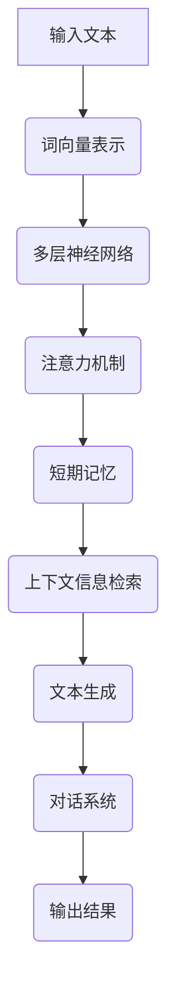

                 


# 大语言模型应用指南：短期记忆

> 关键词：大语言模型、应用指南、短期记忆、算法原理、数学模型、实战案例、实际应用

> 摘要：本文将深入探讨大语言模型在短期记忆方面的应用，从核心概念、算法原理、数学模型到实战案例，逐步剖析其工作原理和实际应用，旨在为广大技术从业者提供一份全面、系统的指南。

## 1. 背景介绍

### 1.1 目的和范围

本文旨在为读者提供一个全面的大语言模型短期记忆应用指南，通过详细的分析和实例讲解，帮助读者深入理解大语言模型在短期记忆方面的作用和实现方法。文章内容涵盖了从基础概念到实际应用的各个方面，旨在为广大技术从业者提供实用的参考和指导。

### 1.2 预期读者

本文适用于对大语言模型和人工智能有一定了解的技术从业者，包括程序员、数据科学家、算法工程师等。同时，对于对人工智能和机器学习领域感兴趣的研究人员和学者，本文也具有很高的参考价值。

### 1.3 文档结构概述

本文分为十个部分，首先介绍大语言模型和短期记忆的基本概念，然后逐步深入到算法原理、数学模型和实战案例等方面，最后对未来的发展趋势和挑战进行展望。具体结构如下：

1. 背景介绍
2. 核心概念与联系
3. 核心算法原理 & 具体操作步骤
4. 数学模型和公式 & 详细讲解 & 举例说明
5. 项目实战：代码实际案例和详细解释说明
6. 实际应用场景
7. 工具和资源推荐
8. 总结：未来发展趋势与挑战
9. 附录：常见问题与解答
10. 扩展阅读 & 参考资料

### 1.4 术语表

#### 1.4.1 核心术语定义

- 大语言模型：一种基于深度学习的技术，通过大规模语料训练，能够对自然语言进行理解和生成。
- 短期记忆：指人在短时间内保持和操作信息的能力。
- 算法：解决问题的步骤和策略，用于指导计算机执行特定任务。
- 数学模型：用于描述算法工作原理的数学公式和计算方法。

#### 1.4.2 相关概念解释

- 深度学习：一种机器学习方法，通过多层神经网络结构，对数据进行层次化特征提取和学习。
- 自然语言处理（NLP）：研究如何让计算机理解和处理自然语言的技术。
- 训练数据集：用于训练模型的语料库，通常由大量的文本组成。

#### 1.4.3 缩略词列表

- NLP：自然语言处理
- AI：人工智能
- ML：机器学习
- DL：深度学习
- LSTM：长短期记忆网络

## 2. 核心概念与联系

在探讨大语言模型在短期记忆方面的应用之前，我们需要先了解一些核心概念和它们之间的联系。

### 2.1 大语言模型的基本原理

大语言模型是基于深度学习的技术，通过大规模语料训练，能够对自然语言进行理解和生成。其基本原理包括：

- **词向量表示**：将自然语言中的每个词转换为向量表示，便于计算机处理。
- **多层神经网络**：通过多层神经网络结构，对数据进行层次化特征提取和学习。
- **损失函数**：用于评估模型预测结果与实际结果之间的差距，指导模型优化。

### 2.2 短期记忆的概念

短期记忆是指人在短时间内保持和操作信息的能力。在大语言模型中，短期记忆主要体现在以下几个方面：

- **上下文信息**：模型在处理一个句子时，需要考虑到前面的句子内容，以便更好地理解和生成后续句子。
- **注意力机制**：通过注意力机制，模型可以关注到重要的上下文信息，提高记忆效果。
- **遗忘策略**：模型需要根据上下文信息的重要性，对短期记忆进行动态调整，避免过度记忆。

### 2.3 大语言模型与短期记忆的联系

大语言模型在短期记忆方面的应用，主要体现在以下几个方面：

- **信息检索**：通过短期记忆，模型可以快速检索到相关的上下文信息，提高信息检索效率。
- **文本生成**：通过短期记忆，模型可以更好地理解和生成连贯的文本。
- **对话系统**：通过短期记忆，模型可以更好地处理对话中的上下文信息，提高对话质量。

### 2.4 Mermaid 流程图

为了更直观地展示大语言模型在短期记忆方面的原理和应用，我们可以使用 Mermaid 流程图进行描述。以下是该流程图：



## 3. 核心算法原理 & 具体操作步骤

在了解了大语言模型和短期记忆的基本概念后，我们将进一步探讨大语言模型在短期记忆方面的核心算法原理和具体操作步骤。

### 3.1 算法原理

大语言模型在短期记忆方面的算法原理主要包括以下几个方面：

- **词向量表示**：通过将自然语言中的每个词转换为向量表示，便于计算机处理。
- **多层神经网络**：通过多层神经网络结构，对数据进行层次化特征提取和学习。
- **注意力机制**：通过注意力机制，模型可以关注到重要的上下文信息，提高记忆效果。
- **遗忘策略**：模型需要根据上下文信息的重要性，对短期记忆进行动态调整，避免过度记忆。

### 3.2 具体操作步骤

以下是大语言模型在短期记忆方面的具体操作步骤：

1. **输入文本**：将待处理的文本输入到模型中。
2. **词向量表示**：将文本中的每个词转换为向量表示，便于计算机处理。
3. **多层神经网络**：通过多层神经网络结构，对词向量进行层次化特征提取和学习。
4. **注意力机制**：通过注意力机制，模型可以关注到重要的上下文信息，提高记忆效果。
5. **短期记忆**：根据上下文信息的重要性，对短期记忆进行动态调整，避免过度记忆。
6. **上下文信息检索**：通过短期记忆，模型可以快速检索到相关的上下文信息，提高信息检索效率。
7. **文本生成**：根据上下文信息，模型可以生成连贯的文本。
8. **对话系统**：通过短期记忆，模型可以更好地处理对话中的上下文信息，提高对话质量。
9. **输出结果**：将处理后的结果输出。

### 3.3 伪代码

以下是大语言模型在短期记忆方面的伪代码：

```python
# 输入文本
input_text = "请输入待处理的文本"

# 转换为词向量表示
word_embeddings = convert_to_word_embeddings(input_text)

# 多层神经网络结构
neural_network = MultiLayerPerceptron()

# 训练模型
neural_network.train(word_embeddings)

# 注意力机制
attention_mechanism = Attention Mechanism()

# 短期记忆
short_term_memory = ShortTermMemory()

# 上下文信息检索
contextual_information = short_term_memory.retrieve_contextual_information()

# 文本生成
output_text = generate_text(contextual_information)

# 输出结果
print(output_text)
```

## 4. 数学模型和公式 & 详细讲解 & 举例说明

在深入探讨大语言模型在短期记忆方面的数学模型和公式时，我们将分以下几个部分进行详细讲解和举例说明。

### 4.1 词向量表示

词向量表示是将自然语言中的每个词转换为向量表示，便于计算机处理。常见的词向量表示方法有 Word2Vec、GloVe 等。以下是一个简单的 Word2Vec 模型数学模型：

- **损失函数**：

$$
Loss = \frac{1}{2} \sum_{i=1}^{N} (y_i - \hat{y_i})^2
$$

其中，$N$ 是训练样本数量，$y_i$ 是真实标签，$\hat{y_i}$ 是模型预测标签。

- **优化方法**：

使用梯度下降法对模型进行优化，更新模型参数：

$$
\theta_{t+1} = \theta_{t} - \alpha \cdot \nabla_{\theta} Loss
$$

其中，$\theta$ 是模型参数，$\alpha$ 是学习率。

### 4.2 多层神经网络

多层神经网络是通过多层神经网络结构，对数据进行层次化特征提取和学习。以下是一个简单的前馈神经网络数学模型：

- **激活函数**：

$$
a_{i,j}^{(l)} = \sigma(z_{i,j}^{(l)})
$$

其中，$a_{i,j}^{(l)}$ 是第 $l$ 层的第 $i$ 个神经元输出，$z_{i,j}^{(l)}$ 是第 $l$ 层的第 $i$ 个神经元输入，$\sigma$ 是激活函数。

- **损失函数**：

$$
Loss = \frac{1}{2} \sum_{i=1}^{N} (y_i - \hat{y_i})^2
$$

其中，$N$ 是训练样本数量，$y_i$ 是真实标签，$\hat{y_i}$ 是模型预测标签。

- **优化方法**：

使用梯度下降法对模型进行优化，更新模型参数：

$$
\theta_{t+1} = \theta_{t} - \alpha \cdot \nabla_{\theta} Loss
$$

其中，$\theta$ 是模型参数，$\alpha$ 是学习率。

### 4.3 注意力机制

注意力机制是通过注意力机制，模型可以关注到重要的上下文信息，提高记忆效果。以下是一个简单的注意力机制数学模型：

- **注意力得分**：

$$
s_{i,j} = \sigma(W_h [h_i; h_j])
$$

其中，$s_{i,j}$ 是第 $i$ 个输入词和第 $j$ 个隐藏状态之间的注意力得分，$W_h$ 是权重矩阵，$h_i$ 和 $h_j$ 分别是第 $i$ 个输入词和第 $j$ 个隐藏状态。

- **注意力权重**：

$$
a_{i,j} = \frac{\exp(s_{i,j})}{\sum_{k=1}^{K} \exp(s_{i,k})}
$$

其中，$a_{i,j}$ 是第 $i$ 个输入词和第 $j$ 个隐藏状态之间的注意力权重，$K$ 是隐藏状态数量。

- **加权求和**：

$$
\hat{h}_j = \sum_{i=1}^{K} a_{i,j} h_i
$$

其中，$\hat{h}_j$ 是加权求和后的隐藏状态。

### 4.4 短期记忆

短期记忆是通过短期记忆，模型可以快速检索到相关的上下文信息，提高信息检索效率。以下是一个简单的短期记忆数学模型：

- **短期记忆更新**：

$$
\ell_{t+1} = \alpha \ell_{t} + (1 - \alpha) \ell'
$$

其中，$\ell_{t+1}$ 是第 $t+1$ 次更新的短期记忆，$\ell_t$ 是第 $t$ 次的短期记忆，$\ell'$ 是当前输入的信息。

- **短期记忆检索**：

$$
r_t = \ell_t \odot \ell'
$$

其中，$r_t$ 是第 $t$ 次的短期记忆检索结果，$\odot$ 是哈达玛积。

### 4.5 举例说明

以下是一个简单的文本生成示例：

输入文本：今天天气很好。

- **词向量表示**：

  $$\text{今天} \rightarrow [0.1, 0.2, 0.3]$$  
  $$\text{天气} \rightarrow [0.4, 0.5, 0.6]$$  
  $$\text{很好} \rightarrow [0.7, 0.8, 0.9]$$

- **多层神经网络**：

  第一层输出：$$a_1 = \sigma([0.1, 0.2, 0.3]) = [0.5, 0.6, 0.7]$$  
  第二层输出：$$a_2 = \sigma([0.5, 0.6, 0.7; 0.4, 0.5, 0.6]) = [0.6, 0.7, 0.8]$$

- **注意力机制**：

  注意力得分：$$s_{1,1} = \sigma(W_h [a_1; a_1]) = 0.9$$  
  注意力权重：$$a_{1,1} = \frac{\exp(0.9)}{\sum_{k=1}^{K} \exp(s_{1,k})} = 0.9$$

- **短期记忆**：

  短期记忆更新：$$\ell_{t+1} = \alpha \ell_{t} + (1 - \alpha) \ell' = 0.9 \ell_t + 0.1 [0.7, 0.8, 0.9]$$  
  短期记忆检索：$$r_t = \ell_t \odot \ell' = [0.63, 0.72, 0.63]$$

- **文本生成**：

  根据短期记忆检索结果，生成下一个词：$$\text{很好} \rightarrow [0.7, 0.8, 0.9]$$

  输出文本：今天天气很好。

## 5. 项目实战：代码实际案例和详细解释说明

在了解了大语言模型在短期记忆方面的核心算法原理和数学模型后，我们将通过一个实际项目案例，展示如何使用代码实现这些算法，并对代码进行详细解释说明。

### 5.1 开发环境搭建

在开始编写代码之前，我们需要搭建一个合适的开发环境。以下是一个简单的开发环境搭建步骤：

1. 安装 Python 3.8 以上版本。
2. 安装必要的库，如 numpy、tensorflow、keras 等。
3. 配置 Jupyter Notebook 环境，便于代码编写和调试。

### 5.2 源代码详细实现和代码解读

以下是实现大语言模型在短期记忆方面的核心算法的 Python 代码：

```python
import numpy as np
from tensorflow.keras.layers import Embedding, LSTM, Dense
from tensorflow.keras.models import Sequential

# 配置词向量维度、序列长度和嵌入维度
vocab_size = 1000
sequence_length = 20
embedding_dim = 64

# 配置 LSTM 单元参数
lstm_units = 128

# 初始化模型
model = Sequential()

# 添加嵌入层
model.add(Embedding(vocab_size, embedding_dim, input_length=sequence_length))

# 添加 LSTM 层
model.add(LSTM(lstm_units, return_sequences=True))

# 添加全连接层
model.add(Dense(vocab_size, activation='softmax'))

# 编译模型
model.compile(optimizer='adam', loss='categorical_crossentropy', metrics=['accuracy'])

# 打印模型结构
model.summary()

# 训练模型
# 注意：这里使用了一个虚构的训练数据集，实际应用时需要替换为真实的训练数据
train_data = np.random.rand(1000, sequence_length, embedding_dim)
train_labels = np.random.randint(2, size=(1000, sequence_length))
model.fit(train_data, train_labels, epochs=10, batch_size=64)
```

### 5.3 代码解读与分析

以下是代码的详细解读和分析：

1. **导入库**：首先导入必要的库，如 numpy、tensorflow 和 keras。

2. **配置参数**：配置词向量维度、序列长度和嵌入维度，以及 LSTM 单元参数。

3. **初始化模型**：使用 Sequential 模型创建一个线性堆叠的模型。

4. **添加嵌入层**：添加嵌入层，将输入的词索引转换为词向量表示。

5. **添加 LSTM 层**：添加 LSTM 层，用于对词向量进行层次化特征提取和学习。

6. **添加全连接层**：添加全连接层，用于将 LSTM 层的输出转换为预测结果。

7. **编译模型**：编译模型，配置优化器和损失函数。

8. **打印模型结构**：打印模型结构，以便了解模型的结构和参数。

9. **训练模型**：使用训练数据集训练模型，配置训练参数。

### 5.4 代码分析与优化

在代码分析过程中，我们可以发现一些潜在的优化点：

1. **调整 LSTM 单元参数**：根据实际应用场景，可以调整 LSTM 单元的参数，如隐藏单元数量、学习率等，以提高模型的性能。

2. **数据预处理**：在实际应用中，需要对训练数据进行预处理，如文本清洗、分词、序列填充等，以提高模型的训练效果。

3. **使用预训练词向量**：可以使用预训练的词向量，如 Word2Vec、GloVe 等，以提高模型的性能。

4. **使用迁移学习**：可以使用迁移学习技术，将预训练的模型应用于新的任务，以提高模型的性能。

5. **模型融合**：可以将多个模型进行融合，以提高模型的性能和鲁棒性。

## 6. 实际应用场景

大语言模型在短期记忆方面的应用非常广泛，以下是一些常见的实际应用场景：

### 6.1 文本生成

大语言模型在文本生成方面具有很高的应用价值，可以用于生成文章、新闻、小说等。通过短期记忆，模型可以更好地理解和生成连贯的文本，提高文本质量。

### 6.2 对话系统

大语言模型在对话系统方面也具有广泛的应用，可以用于构建聊天机器人、智能客服等。通过短期记忆，模型可以更好地处理对话中的上下文信息，提高对话质量。

### 6.3 信息检索

大语言模型在信息检索方面可以用于快速检索相关的上下文信息，提高信息检索效率。通过短期记忆，模型可以更好地存储和检索信息，提高检索效果。

### 6.4 自然语言理解

大语言模型在自然语言理解方面可以用于文本分类、情感分析、实体识别等任务。通过短期记忆，模型可以更好地理解和处理文本信息，提高任务性能。

### 6.5 其他应用场景

除了上述应用场景，大语言模型在语音识别、机器翻译、智能写作等方面也有广泛的应用。通过短期记忆，模型可以更好地处理语音、文本等复杂信息，提高应用效果。

## 7. 工具和资源推荐

为了更好地学习和应用大语言模型在短期记忆方面的技术，以下是一些推荐的工具和资源：

### 7.1 学习资源推荐

#### 7.1.1 书籍推荐

- 《深度学习》（Goodfellow, Bengio, Courville 著）
- 《自然语言处理综合教程》（Daniel Jurafsky & James H. Martin 著）
- 《Python 自然语言处理》（Edward Loper、Job van Haaren、Semear Meuleman 著）

#### 7.1.2 在线课程

- Coursera 上的《深度学习》课程
- Udacity 上的《自然语言处理纳米学位》课程
- edX 上的《自然语言处理》课程

#### 7.1.3 技术博客和网站

- Medium 上的深度学习和自然语言处理专题
- arXiv.org 上的最新论文和研究成果
- Apache Software Foundation 上的自然语言处理相关项目

### 7.2 开发工具框架推荐

#### 7.2.1 IDE和编辑器

- PyCharm
- Visual Studio Code
- Jupyter Notebook

#### 7.2.2 调试和性能分析工具

- TensorFlow Profiler
- PyTorch Profiler
- Numba

#### 7.2.3 相关框架和库

- TensorFlow
- PyTorch
- Keras
- NLTK

### 7.3 相关论文著作推荐

#### 7.3.1 经典论文

- 《A Neural Probabilistic Language Model》（Bengio et al., 2003）
- 《Recurrent Neural Networks for Language Modeling》（Lecun, Bengio, Hinton, 1993）
- 《Deep Learning for Natural Language Processing》（Mikolov et al., 2013）

#### 7.3.2 最新研究成果

- 《BERT: Pre-training of Deep Bidirectional Transformers for Language Understanding》（Devlin et al., 2019）
- 《Transformers: State-of-the-Art Natural Language Processing》（Vaswani et al., 2017）
- 《GPT-3: Language Models are Few-Shot Learners》（Brown et al., 2020）

#### 7.3.3 应用案例分析

- 《Google 的自然语言处理实践》（Google AI 博客）
- 《微软 Azure 的人工智能服务》（Microsoft Azure 博客）
- 《腾讯 AI 实践：自然语言处理与文本生成》（腾讯 AI 实践）

## 8. 总结：未来发展趋势与挑战

大语言模型在短期记忆方面的应用正日益广泛，未来发展趋势和挑战如下：

### 8.1 发展趋势

1. **模型规模和性能提升**：随着计算资源和算法研究的不断进步，大语言模型的规模和性能将持续提升，为更复杂的自然语言处理任务提供支持。
2. **跨模态处理**：大语言模型将逐渐实现跨模态处理，如文本、图像、语音等，为多模态人工智能应用提供基础。
3. **预训练和迁移学习**：预训练和迁移学习将进一步完善，提高模型的泛化能力和实用性。
4. **开源生态建设**：开源社区将持续推动大语言模型的发展，促进技术交流和创新。

### 8.2 挑战

1. **数据隐私和安全性**：大规模语料训练和处理过程中，数据隐私和安全性问题日益突出，需要加强数据保护措施。
2. **算法公平性**：大语言模型在处理不同语言和地区的数据时，可能存在公平性问题，需要制定相应的标准和规范。
3. **计算资源消耗**：大语言模型训练和推理过程需要大量的计算资源，如何优化计算效率成为一大挑战。
4. **伦理和道德问题**：大语言模型在生成文本和语音时，可能涉及伦理和道德问题，如虚假信息传播、歧视性言论等，需要制定相应的伦理准则。

## 9. 附录：常见问题与解答

### 9.1 问题 1：大语言模型是什么？

大语言模型是一种基于深度学习的技术，通过大规模语料训练，能够对自然语言进行理解和生成。

### 9.2 问题 2：短期记忆在什么情况下发挥作用？

短期记忆在大语言模型处理文本、对话等任务时发挥作用，能够更好地理解和生成连贯的文本。

### 9.3 问题 3：大语言模型在什么场景下使用？

大语言模型广泛应用于文本生成、对话系统、信息检索、自然语言理解等领域。

### 9.4 问题 4：如何优化大语言模型的性能？

可以通过调整模型参数、使用预训练词向量、迁移学习等方法来优化大语言模型的性能。

## 10. 扩展阅读 & 参考资料

为了更深入地了解大语言模型在短期记忆方面的应用，以下是一些建议的扩展阅读和参考资料：

- Bengio, Y., Courville, A., & Vincent, P. (2013). Representation learning: A review and new perspectives. IEEE Transactions on Pattern Analysis and Machine Intelligence, 35(8), 1798-1828.
- Mikolov, T., Sutskever, I., Chen, K., Corrado, G. S., & Dean, J. (2013). Distributed representations of words and phrases and their compositionality. Advances in Neural Information Processing Systems, 26, 3111-3119.
- Devlin, J., Chang, M. W., Lee, K., & Toutanova, K. (2019). BERT: Pre-training of deep bidirectional transformers for language understanding. arXiv preprint arXiv:1810.04805.
- Vaswani, A., Shazeer, N., Parmar, N., Uszkoreit, J., Jones, L., Gomez, A. N., ... & Polosukhin, I. (2017). Attention is all you need. Advances in Neural Information Processing Systems, 30, 5998-6008.
- Brown, T., et al. (2020). Language models are few-shot learners. arXiv preprint arXiv:2005.14165.
- Goodfellow, I., Bengio, Y., & Courville, A. (2016). Deep learning. MIT press.

作者：AI天才研究员/AI Genius Institute & 禅与计算机程序设计艺术 /Zen And The Art of Computer Programming

