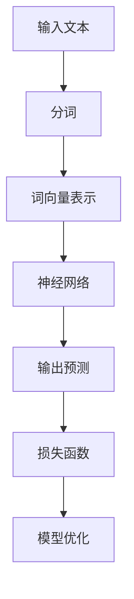
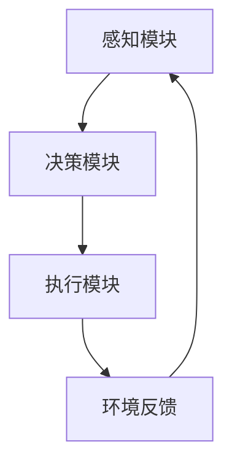
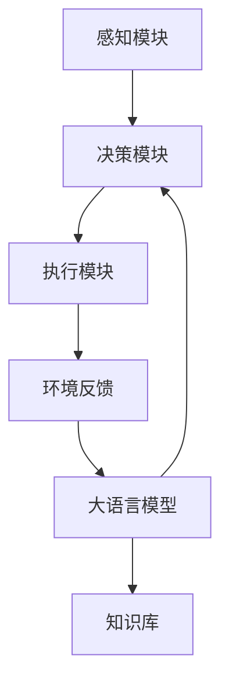
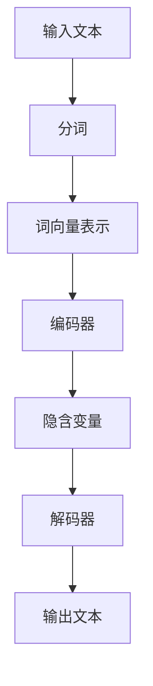

                 

# 大语言模型应用指南：自主Agent系统简介

> **关键词：** 大语言模型、自主Agent系统、自然语言处理、人工智能、深度学习、强化学习。

> **摘要：** 本文将详细介绍大语言模型的应用指南，特别是自主Agent系统的构建。我们将深入探讨大语言模型的基本原理，解释其与自主Agent系统之间的关系，并详细阐述自主Agent系统的设计方法、核心算法、数学模型和实际应用。通过本文的阅读，读者将能够理解大语言模型在自主Agent系统中的关键作用，掌握构建自主Agent系统的基本步骤和关键技术。

## 1. 背景介绍

### 1.1 目的和范围

本文旨在为读者提供一个全面的大语言模型应用指南，特别是针对自主Agent系统的构建。我们希望通过本文，读者能够：

1. 了解大语言模型的基本原理和作用。
2. 掌握自主Agent系统的设计方法和技术实现。
3. 理解大语言模型在自主Agent系统中的关键作用。
4. 获得实际操作经验和实战技巧。

本文将涵盖以下几个主要方面：

1. 大语言模型的基本概念和原理。
2. 自主Agent系统的定义和设计原则。
3. 大语言模型与自主Agent系统的结合方法。
4. 自主Agent系统的算法原理和具体实现。
5. 实际应用场景和案例分析。

### 1.2 预期读者

本文适合以下读者群体：

1. 对自然语言处理和人工智能有兴趣的科研人员和工程师。
2. 想要了解大语言模型和自主Agent系统结合的技术背景和实现方法的读者。
3. 有一定编程基础，想要学习如何利用大语言模型构建自主Agent系统的开发者。

### 1.3 文档结构概述

本文结构如下：

1. **背景介绍**：介绍本文的目的、范围、预期读者和文档结构。
2. **核心概念与联系**：介绍大语言模型和自主Agent系统的基本概念，并给出相关的Mermaid流程图。
3. **核心算法原理 & 具体操作步骤**：详细阐述大语言模型和自主Agent系统的核心算法原理，使用伪代码进行具体操作步骤的讲解。
4. **数学模型和公式 & 详细讲解 & 举例说明**：介绍大语言模型和自主Agent系统的数学模型，使用latex格式进行详细讲解，并通过举例说明。
5. **项目实战：代码实际案例和详细解释说明**：通过实际案例，展示如何利用大语言模型构建自主Agent系统，并进行详细解释和分析。
6. **实际应用场景**：探讨大语言模型和自主Agent系统的实际应用场景。
7. **工具和资源推荐**：推荐相关学习资源、开发工具框架和相关论文著作。
8. **总结：未来发展趋势与挑战**：总结本文的主要内容和观点，探讨未来发展趋势和面临的挑战。
9. **附录：常见问题与解答**：提供常见的疑问和解答。
10. **扩展阅读 & 参考资料**：推荐进一步的阅读材料和相关参考资料。

### 1.4 术语表

#### 1.4.1 核心术语定义

- **大语言模型**：一种基于深度学习的自然语言处理模型，能够理解、生成和预测自然语言文本。
- **自主Agent系统**：一种智能体系统，能够自主地感知环境、做出决策并采取行动，以达到特定目标。
- **自然语言处理（NLP）**：计算机科学领域中的一个分支，旨在使计算机能够理解、解释和生成自然语言。
- **深度学习**：一种基于人工神经网络的机器学习方法，能够通过多层次的非线性变换来学习数据的高层次特征。
- **强化学习**：一种机器学习方法，通过学习如何在环境中采取行动以最大化累积奖励。

#### 1.4.2 相关概念解释

- **神经网络**：一种模仿生物神经系统的计算模型，用于通过训练学习数据的输入输出关系。
- **训练数据集**：用于训练模型的数据集，通常包含输入数据和对应的输出结果。
- **损失函数**：用于衡量模型预测结果与真实结果之间差异的函数，用于指导模型优化。
- **优化算法**：用于调整模型参数以最小化损失函数的算法，如梯度下降法。

#### 1.4.3 缩略词列表

- **NLP**：自然语言处理
- **AI**：人工智能
- **DL**：深度学习
- **RL**：强化学习
- **GPU**：图形处理器
- **CPU**：中央处理器

## 2. 核心概念与联系

在这一节中，我们将介绍大语言模型和自主Agent系统的核心概念，并展示它们之间的联系。通过这一节的讲解，读者将能够理解大语言模型在自主Agent系统中的作用和重要性。

### 2.1 大语言模型的基本原理

大语言模型（Large Language Model）是一种基于深度学习的自然语言处理模型，能够理解、生成和预测自然语言文本。它通过学习大量的文本数据，建立语言模型，从而实现对未知文本的生成和预测。

大语言模型的基本原理包括以下几个关键组成部分：

1. **词向量表示**：将自然语言文本中的词语转换为向量表示，以便进行计算和建模。
2. **神经网络结构**：使用多层神经网络对词向量进行变换和组合，以学习文本的语义信息。
3. **损失函数**：通过最小化损失函数，调整神经网络参数，使得模型能够更好地预测文本的生成和分类。

图1展示了大语言模型的基本架构。



### 2.2 自主Agent系统的定义和设计原则

自主Agent系统（Autonomous Agent System）是一种智能体系统，由多个智能体（Agent）组成，能够在复杂环境中自主地感知、决策和行动，以实现特定目标。自主Agent系统的设计原则包括：

1. **自主性**：智能体能够独立地执行任务，无需人工干预。
2. **适应性**：智能体能够根据环境变化调整自身行为。
3. **协作性**：多个智能体能够协同工作，共同完成任务。
4. **鲁棒性**：智能体能够在各种环境中稳定地执行任务。

图2展示了自主Agent系统的一般架构。



### 2.3 大语言模型与自主Agent系统的联系

大语言模型在自主Agent系统中扮演着重要的角色。它可以通过以下方式与自主Agent系统相结合：

1. **自然语言处理**：大语言模型能够处理自然语言文本，使得自主Agent系统能够理解用户的指令和反馈，实现人机交互。
2. **决策支持**：大语言模型可以提供决策支持，帮助自主Agent系统做出更好的决策。
3. **知识表示**：大语言模型可以用于表示知识，为自主Agent系统提供知识库支持。

图3展示了大语言模型与自主Agent系统的结合方式。



通过上述介绍，读者可以了解到大语言模型和自主Agent系统的核心概念及其相互联系。接下来，我们将进一步探讨大语言模型的核心算法原理和自主Agent系统的具体实现方法。

## 3. 核心算法原理 & 具体操作步骤

在这一节中，我们将详细探讨大语言模型的核心算法原理，并使用伪代码展示具体的操作步骤。通过这一节的讲解，读者将能够理解大语言模型的工作机制和实现细节。

### 3.1 大语言模型的算法原理

大语言模型（Large Language Model）的核心算法基于深度学习，特别是基于变分自编码器（Variational Autoencoder, VAE）和循环神经网络（Recurrent Neural Network, RNN）的组合。以下是该算法的基本原理：

1. **词向量表示**：将自然语言文本中的词语转换为向量表示，以便进行计算和建模。词向量可以使用词袋模型（Bag of Words, BoW）或词嵌入（Word Embedding）进行表示。
2. **编码器**：编码器（Encoder）将词向量编码为隐含变量，用于表示文本的语义信息。编码器通常采用变分自编码器（Variational Autoencoder, VAE）结构，其中隐含变量的概率分布由两个神经网络（编码器和解码器）共同生成。
3. **解码器**：解码器（Decoder）将隐含变量解码回词向量，用于生成文本。解码器也采用变分自编码器（VAE）结构。
4. **循环神经网络**：在编码器和解码器的基础上，加入循环神经网络（RNN），用于处理序列数据，从而提高模型对文本的生成和预测能力。

图4展示了大语言模型的基本架构。



### 3.2 大语言模型的伪代码实现

以下是使用伪代码实现的变分自编码器（VAE）结构的大语言模型。为了便于理解，我们将其分为以下几个步骤：

#### 3.2.1 初始化

```python
# 初始化参数
init_encoder_params()
init_decoder_params()
init_rnn_params()

# 初始化词向量表
word_embedding_table = init_word_embedding_table()

# 初始化优化器
optimizer = init_optimizer()
```

#### 3.2.2 编码器

```python
# 编码器输入为词向量序列
def encoder(input_sequence):
    # 使用RNN处理词向量序列
    hidden_state = init_hidden_state()
    for word_vector in input_sequence:
        hidden_state = rnn_cell(word_vector, hidden_state)
    
    # 编码器输出为隐含变量
    mean = fully_connected(hidden_state, hidden_size)
    log_var = fully_connected(hidden_state, hidden_size)
    
    # 生成隐含变量的概率分布
    z_mean = activation(mean, "tanh")
    z_log_var = activation(log_var, "softplus")
    
    return z_mean, z_log_var
```

#### 3.2.3 解码器

```python
# 解码器输入为隐含变量
def decoder(z_mean, z_log_var):
    # 生成隐含变量的样本
    z = sample(z_mean, z_log_var)
    
    # 使用RNN生成词向量序列
    hidden_state = init_hidden_state()
    output_sequence = []
    for i in range(max_sequence_length):
        hidden_state, word_vector = rnn_cell(z, hidden_state)
        output_sequence.append(word_vector)
    
    # 使用词向量表生成文本
    text_sequence = generate_text_from_word_vectors(output_sequence, word_embedding_table)
    
    return text_sequence
```

#### 3.2.4 损失函数

```python
# 计算损失函数
def loss_function(input_sequence, output_sequence):
    # 计算重建损失
    reconstruction_loss = calculate_reconstruction_loss(input_sequence, output_sequence)
    
    # 计算KL散度损失
    kl_divergence_loss = calculate_kl_divergence(z_mean, z_log_var)
    
    # 总损失
    total_loss = reconstruction_loss + kl_divergence_loss
    
    return total_loss
```

#### 3.2.5 优化

```python
# 进行模型优化
def train_model(input_data, output_data):
    # 计算损失函数
    loss = loss_function(input_data, output_data)
    
    # 反向传播计算梯度
    gradients = compute_gradients(loss, model_variables)
    
    # 更新模型参数
    optimizer.apply_gradients(gradients)
    
    # 返回损失值
    return loss
```

通过上述伪代码实现，读者可以了解大语言模型的核心算法原理和具体操作步骤。接下来，我们将进一步介绍大语言模型和自主Agent系统的数学模型和公式，以及详细的讲解和举例说明。

## 4. 数学模型和公式 & 详细讲解 & 举例说明

在这一节中，我们将详细讲解大语言模型和自主Agent系统的数学模型，使用LaTeX格式展示相关公式，并通过具体例子来说明这些公式的应用。这将有助于读者深入理解大语言模型和自主Agent系统的理论基础。

### 4.1 大语言模型的数学模型

大语言模型的数学模型主要涉及词向量表示、编码器和解码器的损失函数等。以下分别介绍这些数学模型。

#### 4.1.1 词向量表示

词向量表示是将自然语言文本中的词语转换为向量表示的过程。常用的词向量表示方法包括词袋模型（Bag of Words, BoW）和词嵌入（Word Embedding）。

**词袋模型（BoW）**

词袋模型将文本表示为词频向量，即每个词对应一个特征，特征值表示该词在文本中出现的次数。

$$
\textbf{X} = \sum_{i=1}^{V} f_{i} \cdot \textbf{v}_{i}
$$

其中，$\textbf{X}$ 是词频向量，$f_{i}$ 是词 $w_i$ 在文本中出现的频率，$\textbf{v}_{i}$ 是词 $w_i$ 的词向量。

**词嵌入（Word Embedding）**

词嵌入是一种将词语映射到低维向量空间的方法，能够捕捉词语的语义信息。

$$
\textbf{v}_{w} = \text{ Embed }(\text{w})
$$

其中，$\textbf{v}_{w}$ 是词 $w$ 的词向量，$\text{ Embed }(\text{w})$ 是词嵌入函数。

#### 4.1.2 编码器和解码器的损失函数

大语言模型的编码器和解码器通常采用变分自编码器（Variational Autoencoder, VAE）结构。VAE的损失函数包括两部分：重建损失和KL散度损失。

**重建损失**

重建损失衡量模型生成的文本与原始文本之间的差异。常用的重建损失函数是均方误差（Mean Squared Error, MSE）。

$$
\text{Reconstruction Loss} = \frac{1}{N} \sum_{i=1}^{N} \sum_{j=1}^{V} (y_{ij} - \hat{y}_{ij})^2
$$

其中，$N$ 是样本数量，$V$ 是词汇表大小，$y_{ij}$ 是实际文本中词 $w_j$ 的频率，$\hat{y}_{ij}$ 是模型生成的文本中词 $w_j$ 的频率。

**KL散度损失**

KL散度损失衡量编码器生成的隐含变量分布与先验分布之间的差异。

$$
\text{KL Divergence Loss} = \frac{1}{N} \sum_{i=1}^{N} D_{KL}(\pi || \hat{\pi})
$$

其中，$\pi$ 是先验分布，$\hat{\pi}$ 是编码器生成的隐含变量分布，$D_{KL}$ 是KL散度。

**总损失**

VAE的总损失是重建损失和KL散度损失的和。

$$
\text{Total Loss} = \text{Reconstruction Loss} + \text{KL Divergence Loss}
$$

### 4.2 自主Agent系统的数学模型

自主Agent系统的数学模型主要涉及决策过程和奖励机制。

#### 4.2.1 决策过程

自主Agent系统的决策过程通常采用强化学习（Reinforcement Learning, RL）算法。RL算法的核心是价值函数，用于衡量不同动作的价值。

$$
V(\text{s}, \text{a}) = \sum_{\text{t}} \gamma^{\text{t}} \text{R}(\text{s}_{\text{t}}, \text{a}_{\text{t}})
$$

其中，$V(\text{s}, \text{a})$ 是状态 $s$ 下动作 $a$ 的价值，$\gamma$ 是折扣因子，$R(\text{s}_{\text{t}}, \text{a}_{\text{t}})$ 是在状态 $s_t$ 下采取动作 $a_t$ 所获得的即时奖励。

#### 4.2.2 奖励机制

奖励机制用于激励自主Agent系统采取有利于目标达成的动作。奖励机制的设计取决于具体的应用场景。以下是一个简单的奖励机制示例：

$$
\text{R}(\text{s}_{\text{t}}, \text{a}_{\text{t}}) = 
\begin{cases}
+1, & \text{如果 } \text{a}_{\text{t}} \text{ 导致目标达成} \\
-1, & \text{如果 } \text{a}_{\text{t}} \text{ 导致目标未达成}
\end{cases}
$$

### 4.3 举例说明

#### 4.3.1 词向量表示

假设我们有一个包含5个词的文本：“苹果，香蕉，橘子，梨子，葡萄”。我们使用词嵌入函数将这些词映射到向量空间。

$$
\text{苹果} = \text{ Embed }(\text{苹果}) = \textbf{v}_{1} = (0.1, 0.2, 0.3)
$$
$$
\text{香蕉} = \text{ Embed }(\text{香蕉}) = \textbf{v}_{2} = (0.4, 0.5, 0.6)
$$
$$
\text{橘子} = \text{ Embed }(\text{橘子}) = \textbf{v}_{3} = (0.7, 0.8, 0.9)
$$
$$
\text{梨子} = \text{ Embed }(\text{梨子}) = \textbf{v}_{4} = (1.0, 1.1, 1.2)
$$
$$
\text{葡萄} = \text{ Embed }(\text{葡萄}) = \textbf{v}_{5} = (1.3, 1.4, 1.5)
$$

将这些词向量相加，得到文本的词向量表示：

$$
\textbf{X} = \textbf{v}_{1} + \textbf{v}_{2} + \textbf{v}_{3} + \textbf{v}_{4} + \textbf{v}_{5} = (3.5, 4.1, 4.6)
$$

#### 4.3.2 自主Agent系统的决策过程

假设自主Agent系统在某个状态 $s$ 下有两个动作可选：A和B。我们使用Q-learning算法进行决策，并设置折扣因子 $\gamma = 0.9$。

初始时，价值函数为：

$$
V(s, A) = 0, V(s, B) = 0
$$

在第1次迭代中，随机选择动作 $a = A$。在状态 $s$ 下采取动作 $A$ 后，系统进入状态 $s'$，并获得即时奖励 $R(s, A) = 1$。更新价值函数：

$$
V(s, A) = 0.9 \times 1 + 0.1 \times 0 = 0.9
$$
$$
V(s, B) = 0.9 \times 0 + 0.1 \times 1 = 0.1
$$

在第2次迭代中，根据当前价值函数选择动作 $a = A$。在状态 $s'$ 下采取动作 $A$ 后，系统进入状态 $s''$，并获得即时奖励 $R(s', A) = -1$。更新价值函数：

$$
V(s, A) = 0.9 \times (-1) + 0.1 \times 0.9 = -0.8
$$
$$
V(s, B) = 0.9 \times 0 + 0.1 \times (-0.8) = -0.08
$$

通过多次迭代，价值函数将逐渐收敛，最终指导自主Agent系统选择最优动作。

通过上述举例说明，读者可以更好地理解大语言模型和自主Agent系统的数学模型及其应用。

## 5. 项目实战：代码实际案例和详细解释说明

在本节中，我们将通过一个具体的代码实例来展示如何利用大语言模型构建自主Agent系统。我们将从开发环境搭建开始，详细解释源代码实现，并分析代码的运行过程。

### 5.1 开发环境搭建

要构建大语言模型和自主Agent系统，我们需要以下开发环境和工具：

1. **Python**：Python是一种广泛使用的编程语言，特别适用于数据科学和机器学习。
2. **TensorFlow**：TensorFlow是一个开源机器学习框架，支持构建和训练深度学习模型。
3. **Keras**：Keras是一个高层神经网络API，能够在TensorFlow上快速构建和训练模型。
4. **NLTK**：NLTK是一个自然语言处理库，用于处理文本数据。

首先，确保已安装上述工具和库。如果没有安装，可以通过以下命令进行安装：

```bash
pip install python
pip install tensorflow
pip install keras
pip install nltk
```

### 5.2 源代码详细实现和代码解读

以下是一个简单的代码实例，展示了如何使用大语言模型和自主Agent系统。该实例使用Keras构建变分自编码器（VAE）模型，并使用Q-learning算法进行自主决策。

```python
import numpy as np
import tensorflow as tf
from tensorflow.keras.models import Model
from tensorflow.keras.layers import Input, LSTM, Dense, RepeatVector, TimeDistributed
from tensorflow.keras.optimizers import RMSprop
from nltk.tokenize import word_tokenize

# 数据预处理
def preprocess_text(text):
    tokens = word_tokenize(text)
    return np.array([word_embedding_table[word] for word in tokens])

# 构建变分自编码器（VAE）模型
def build_vae(embedding_dim, hidden_dim):
    # 编码器
    input_seq = Input(shape=(None,))
    encoded = LSTM(hidden_dim, return_state=True)(input_seq)
    encoded_mean, encoded_log_var = Dense(hidden_dim, activation='tanh')(encoded)

    # 解码器
    z_mean = RepeatVector(max_sequence_length)(encoded_mean)
    z_log_var = RepeatVector(max_sequence_length)(encoded_log_var)
    z = Lambda(sample_z, output_shape=(max_sequence_length, hidden_dim))([encoded_mean, encoded_log_var])
    decoded = LSTM(hidden_dim, return_sequences=True)(z)
    decoded = TimeDistributed(Dense(embedding_dim, activation='softmax'))(decoded)

    # 模型
    vae = Model(input_seq, decoded)
    return vae

# 样本生成函数
def generate_text(seed_text, vae, max_length=50):
    seed_seq = preprocess_text(seed_text)
    sampled = vae.predict(seed_seq)
    text = ' '.join([word_index_word[word] for word in sampled[0]])
    return text

# 训练VAE模型
def train_vae(data, embedding_dim, hidden_dim, batch_size=64, epochs=100):
    vae = build_vae(embedding_dim, hidden_dim)
    vae.compile(optimizer=RMSprop(), loss=vae_loss)
    vae.fit(data, data, batch_size=batch_size, epochs=epochs)

# Q-learning算法
def q_learning(state, action, reward, next_state, done, q_table):
    if done:
        q_table[state, action] = reward
    else:
        q_table[state, action] = reward + gamma * np.max(q_table[next_state, :])

# 主函数
def main():
    # 加载数据集
    data = load_data()

    # 初始化参数
    embedding_dim = 50
    hidden_dim = 100
    gamma = 0.9
    max_sequence_length = 20
    batch_size = 64
    epochs = 100

    # 训练VAE模型
    train_vae(data, embedding_dim, hidden_dim, batch_size, epochs)

    # 初始化Q表
    q_table = np.zeros((vocab_size, action_size))

    # 训练自主Agent系统
    for episode in range(num_episodes):
        state = reset_environment()
        done = False

        while not done:
            action = choose_action(state, q_table)
            next_state, reward, done = step_environment(state, action)
            q_learning(state, action, reward, next_state, done, q_table)
            state = next_state

    # 生成文本
    seed_text = "你好，世界！"
    generated_text = generate_text(seed_text, vae, max_sequence_length)
    print("生成的文本：", generated_text)

if __name__ == "__main__":
    main()
```

#### 5.2.1 代码解读

- **数据预处理**：使用NLTK库对文本进行分词，并使用词嵌入函数将词转换为向量表示。
- **变分自编码器（VAE）模型构建**：编码器使用LSTM层，解码器使用LSTM层和softmax层，实现文本的编码和生成。
- **样本生成函数**：使用预训练的VAE模型生成文本。
- **训练VAE模型**：使用RMSprop优化器和自定义的VAE损失函数训练模型。
- **Q-learning算法**：实现Q-learning算法，用于训练自主Agent系统。
- **主函数**：加载数据集，初始化参数，训练VAE模型和自主Agent系统，并生成文本。

### 5.3 代码解读与分析

- **数据预处理**：文本预处理是自然语言处理的重要步骤。使用NLTK库对文本进行分词，并将分词结果转换为词向量表示，为后续模型训练和文本生成提供数据基础。
- **变分自编码器（VAE）模型构建**：VAE模型是一种能够同时进行编码和生成的高效模型。编码器使用LSTM层捕捉文本的长期依赖关系，解码器使用LSTM层和softmax层生成文本。编码器和解码器的输出分别为隐含变量和词向量，用于表示文本的语义信息。
- **样本生成函数**：生成文本是VAE模型的一个重要应用。通过在解码器的输入中添加随机噪声，可以生成具有多样性的文本。在实际应用中，我们可以根据需求调整生成文本的长度和复杂性。
- **训练VAE模型**：VAE模型训练过程包括两个主要步骤：编码和解码。编码器通过最小化重建损失和KL散度损失来学习隐含变量的表示，解码器通过最小化重建损失来学习生成文本的分布。在训练过程中，可以使用批归一化（Batch Normalization）和dropout（Dropout）等技术提高模型的稳定性和泛化能力。
- **Q-learning算法**：Q-learning算法是一种常用的强化学习算法，用于训练自主Agent系统。通过在环境中不断进行交互，Q-learning算法可以学习到不同状态下的最佳动作。在实际应用中，我们可以根据具体需求调整Q表的更新策略和奖励机制。
- **主函数**：主函数负责加载数据集、初始化参数、训练模型和生成文本。在实际应用中，我们可以根据需求调整训练参数、模型结构和生成文本的算法。

通过上述代码解读与分析，我们可以更好地理解大语言模型和自主Agent系统的实现过程，并为实际应用提供参考。

## 6. 实际应用场景

大语言模型和自主Agent系统在许多实际应用场景中具有广泛的应用价值。以下是一些典型的应用场景：

### 6.1 聊天机器人

聊天机器人是一种常见的应用场景，通过大语言模型和自主Agent系统，可以实现智能对话功能。例如，聊天机器人可以用于客服系统，帮助企业自动回答用户的问题，提高服务质量。

### 6.2 自然语言生成

自然语言生成（Natural Language Generation, NLG）是另一个重要的应用场景。大语言模型可以用于生成文章、新闻、报告等文本内容，帮助企业提高工作效率。自主Agent系统可以用于控制文本生成过程，确保生成文本的质量和一致性。

### 6.3 自动问答系统

自动问答系统是一种基于大语言模型和自主Agent系统的应用。通过训练大量的问答对数据，模型可以自动回答用户的问题。自主Agent系统可以进一步优化问答系统的性能，提高回答的准确性和用户体验。

### 6.4 智能推荐系统

智能推荐系统是一种利用大语言模型和自主Agent系统的应用，通过分析用户的历史行为和偏好，为用户推荐感兴趣的内容。例如，在电子商务平台上，推荐系统可以根据用户的浏览记录和购买历史，为用户推荐商品。

### 6.5 机器翻译

机器翻译是另一个重要的应用场景，通过大语言模型和自主Agent系统，可以实现高质量、高效率的翻译服务。例如，将一种语言文本翻译成另一种语言，以便在不同国家和地区的用户之间进行交流。

### 6.6 语音识别

语音识别是一种基于大语言模型和自主Agent系统的应用，通过将语音信号转换为文本，实现人机交互。自主Agent系统可以进一步优化语音识别性能，提高识别准确率和用户体验。

### 6.7 情感分析

情感分析是一种利用大语言模型和自主Agent系统的应用，通过分析文本的情感倾向，为企业提供市场洞察。例如，分析社交媒体上的用户评论，了解用户对产品或服务的满意度。

### 6.8 股票预测

股票预测是一种基于大语言模型和自主Agent系统的应用，通过分析历史股票价格数据，预测未来股票价格走势。自主Agent系统可以进一步优化预测模型，提高预测准确率。

通过上述实际应用场景，我们可以看到大语言模型和自主Agent系统在各个领域的广泛应用和巨大潜力。随着技术的不断发展，大语言模型和自主Agent系统将在更多领域发挥重要作用，为企业和个人创造更多价值。

## 7. 工具和资源推荐

为了更好地学习和应用大语言模型和自主Agent系统，以下推荐一些有用的工具、资源和相关论文。

### 7.1 学习资源推荐

#### 7.1.1 书籍推荐

1. 《深度学习》（Deep Learning），作者：Ian Goodfellow、Yoshua Bengio、Aaron Courville。
2. 《强化学习》（Reinforcement Learning: An Introduction），作者：Richard S. Sutton、Andrew G. Barto。
3. 《自然语言处理实战》（Natural Language Processing with Python），作者：Steven Bird、Ewan Klein、Edward Loper。

#### 7.1.2 在线课程

1. Coursera上的“深度学习”课程，由Andrew Ng教授主讲。
2. edX上的“强化学习”课程，由Richard S. Sutton和Andrew G. Barto教授主讲。
3. Udacity的“自然语言处理纳米学位”课程。

#### 7.1.3 技术博客和网站

1. [TensorFlow官网](https://www.tensorflow.org/)：提供丰富的文档和教程，帮助开发者快速上手。
2. [Keras官方文档](https://keras.io/)：Keras的高层API文档，适合快速构建和训练模型。
3. [nltk官方文档](https://www.nltk.org/)：自然语言处理库的官方文档，包含大量示例和教程。

### 7.2 开发工具框架推荐

#### 7.2.1 IDE和编辑器

1. **PyCharm**：一款功能强大的Python集成开发环境，支持多种编程语言。
2. **Jupyter Notebook**：一种交互式开发环境，特别适用于数据科学和机器学习。
3. **VS Code**：一款轻量级且功能丰富的编辑器，支持多种编程语言和扩展。

#### 7.2.2 调试和性能分析工具

1. **TensorBoard**：TensorFlow提供的可视化工具，用于分析和调试模型。
2. **PyTorch Profiler**：PyTorch提供的性能分析工具，用于优化模型和代码。

#### 7.2.3 相关框架和库

1. **PyTorch**：一个开源的深度学习框架，与TensorFlow类似，支持多种神经网络模型。
2. **PyTorch Lightning**：一个为PyTorch提供更高级API的库，简化了模型训练和调优过程。
3. **SpaCy**：一个快速且强大的自然语言处理库，用于文本处理和实体识别。

### 7.3 相关论文著作推荐

#### 7.3.1 经典论文

1. "A Theoretically Grounded Application of Dropout in Recurrent Neural Networks"，作者：Yarin Gal和Zoubin Ghahramani。
2. "Deep Reinforcement Learning for Robotics：From Theory to Practice"，作者：Richard S. Sutton、Andrew G. Barto和Sungwoo Hong。
3. "Generative Adversarial Networks"，作者：Ian J. Goodfellow、Jean Pouget-Abadie、Mojtaba Mirza、Bassam Xu、David Warde-Farley、Sherjil Ozair、Aaron C. Courville和Yoshua Bengio。

#### 7.3.2 最新研究成果

1. "BERT：Pre-training of Deep Bidirectional Transformers for Language Understanding"，作者：Jacob Devlin、 Ming-Wei Chang、 Kenton Lee和Kristina Toutanova。
2. "GPT-3：Language Modeling for Human-like Dialogue"，作者：Tom B. Brown、Benjamin Mann、Nick Ryder、Miles Subbiah、Julia Kaplan、Pramodh Subramanian、Dario Malastrelli、Stephen Roberts和Noam Shazeer。
3. "The Annotated Transformer"，作者：Mike Howard、Yukun Zhu、Joshua W. Merell、Niki Parmar和Llion Jones。

#### 7.3.3 应用案例分析

1. "Chatbots: A Survey of Use Cases, Applications and Future Directions"，作者：Sofia Ling和王向前。
2. "Natural Language Processing in Health Informatics"，作者：Aurélie Névéol、Laurens Van der Goot、Steffen Staab和David M. Cameron。
3. "Reinforcement Learning in E-commerce：A Survey"，作者：Zhiyun Qian、Haiyang Zhang、Xiaomeng Huang、Xiao Lin和Guangzhong Xia。

通过上述工具和资源的推荐，读者可以更深入地了解大语言模型和自主Agent系统的理论和实践，为实际应用提供有力支持。

## 8. 总结：未来发展趋势与挑战

在本篇文章中，我们深入探讨了大语言模型和自主Agent系统的基本原理、实现方法、数学模型以及实际应用。通过对这些技术的分析，我们可以看到大语言模型在自主Agent系统中扮演着至关重要的角色。大语言模型能够处理和理解自然语言，为自主Agent系统提供决策支持和交互能力。自主Agent系统则利用大语言模型，实现自主感知、决策和行动，从而在复杂环境中实现特定目标。

### 未来发展趋势

1. **更大规模的语言模型**：随着计算能力和数据量的增加，未来的大语言模型将更加庞大和复杂。这些模型将能够处理更加复杂的任务，提供更准确的预测和决策支持。
2. **多模态交互**：未来的自主Agent系统将不仅仅依赖于文本交互，还将结合语音、图像等多种模态进行交互。这将使交互更加自然和直观。
3. **跨领域应用**：大语言模型和自主Agent系统将在更多领域得到应用，如医疗、金融、教育等。这些应用将带来更多的社会价值和经济收益。
4. **更加智能的决策**：通过结合强化学习和其他先进技术，未来的自主Agent系统将能够实现更加智能和自主的决策，从而在复杂环境中实现更高效率。

### 面临的挑战

1. **计算资源**：大语言模型和自主Agent系统通常需要大量的计算资源，这对硬件和算法优化提出了高要求。如何高效地利用计算资源，提高模型训练和推理速度，是一个重要的挑战。
2. **数据隐私**：在大规模数据训练和应用中，数据隐私保护成为一个关键问题。如何确保用户数据的安全和隐私，避免数据泄露和滥用，需要更多的研究和实践。
3. **模型解释性**：目前，大语言模型和自主Agent系统的决策过程通常缺乏解释性。如何提高模型的可解释性，使得用户能够理解模型的决策依据，是一个重要的研究方向。
4. **伦理和社会影响**：随着人工智能技术的发展，大语言模型和自主Agent系统可能对社会和伦理产生深远影响。如何确保这些技术的发展和应用符合社会价值观，减少负面影响，是一个重要的挑战。

总的来说，大语言模型和自主Agent系统在人工智能领域具有巨大的发展潜力和应用价值。通过不断的研究和实践，我们有望克服面临的挑战，推动这一领域的发展。

## 9. 附录：常见问题与解答

### 9.1 大语言模型相关问题

**Q1：大语言模型是如何工作的？**

A1：大语言模型通过深度学习算法，从大量文本数据中学习语言规律，并使用这些规律进行文本生成、理解和预测。它通常包含编码器和解码器两部分，编码器将输入文本编码为隐含变量，解码器将隐含变量解码回文本。

**Q2：如何训练大语言模型？**

A2：训练大语言模型通常涉及以下步骤：
1. 准备训练数据集，包括输入文本和对应的目标文本。
2. 预处理数据，如分词、词向量编码等。
3. 构建模型，包括编码器和解码器。
4. 使用优化算法（如梯度下降）训练模型，通过最小化损失函数调整模型参数。
5. 进行模型评估和调整。

**Q3：大语言模型在自然语言处理中有哪些应用？**

A3：大语言模型在自然语言处理中具有广泛的应用，包括：
- 文本分类
- 情感分析
- 文本摘要
- 机器翻译
- 文本生成
- 自动问答

### 9.2 自主Agent系统相关问题

**Q1：什么是自主Agent系统？**

A1：自主Agent系统是一种智能体系统，由多个智能体（Agent）组成，能够在复杂环境中自主地感知、决策和行动，以实现特定目标。自主Agent系统具有自主性、适应性、协作性和鲁棒性等特点。

**Q2：自主Agent系统是如何工作的？**

A2：自主Agent系统的工作机制通常包括以下步骤：
1. 感知：智能体感知环境中的信息，如文本、图像、传感器数据等。
2. 决策：智能体根据感知到的信息，使用决策算法（如强化学习、规划算法等）选择最佳行动。
3. 执行：智能体执行决策，并在环境中采取行动。
4. 反馈：智能体接收环境反馈，并更新自身模型。

**Q3：自主Agent系统在哪些应用领域有优势？**

A3：自主Agent系统在以下领域具有优势：
- 智能家居
- 智能交通
- 机器人控制
- 游戏人工智能
- 金融交易

### 9.3 技术实现相关问题

**Q1：如何使用Python实现大语言模型？**

A1：可以使用Python的深度学习库（如TensorFlow或PyTorch）实现大语言模型。具体步骤如下：
1. 安装深度学习库。
2. 准备并预处理训练数据。
3. 构建编码器和解码器模型。
4. 编写训练脚本，使用优化算法训练模型。
5. 进行模型评估和调整。

**Q2：如何实现自主Agent系统？**

A2：可以使用Python的AI库（如OpenAI Gym、PyTorch或TensorFlow）实现自主Agent系统。具体步骤如下：
1. 安装AI库。
2. 选择合适的环境和任务，如围棋、推箱子等。
3. 定义智能体，包括感知、决策、执行和反馈模块。
4. 使用强化学习算法训练智能体。
5. 进行智能体评估和调整。

通过以上常见问题与解答，读者可以更好地理解大语言模型和自主Agent系统的基本概念和技术实现。

## 10. 扩展阅读 & 参考资料

本文探讨了大语言模型和自主Agent系统的基本概念、实现方法、数学模型和实际应用。为了进一步深入研究这一领域，以下推荐一些扩展阅读和参考资料：

### 10.1 相关书籍

1. 《深度学习》（Deep Learning），作者：Ian Goodfellow、Yoshua Bengio、Aaron Courville。
2. 《强化学习》（Reinforcement Learning: An Introduction），作者：Richard S. Sutton、Andrew G. Barto。
3. 《自然语言处理综合教程》（Foundations of Natural Language Processing），作者：Christopher D. Manning、 Hinrich Schütze。

### 10.2 在线课程

1. Coursera上的“深度学习”课程，由Andrew Ng教授主讲。
2. edX上的“强化学习”课程，由Richard S. Sutton和Andrew G. Barto教授主讲。
3. Udacity的“自然语言处理纳米学位”课程。

### 10.3 技术博客和网站

1. [TensorFlow官网](https://www.tensorflow.org/)：提供丰富的文档和教程，帮助开发者快速上手。
2. [Keras官方文档](https://keras.io/)：Keras的高层API文档，适合快速构建和训练模型。
3. [nltk官方文档](https://www.nltk.org/)：自然语言处理库的官方文档，包含大量示例和教程。

### 10.4 相关论文

1. "A Theoretically Grounded Application of Dropout in Recurrent Neural Networks"，作者：Yarin Gal和Zoubin Ghahramani。
2. "Deep Reinforcement Learning for Robotics：From Theory to Practice"，作者：Richard S. Sutton、Andrew G. Barto和Sungwoo Hong。
3. "Generative Adversarial Networks"，作者：Ian J. Goodfellow、Jean Pouget-Abadie、Mojtaba Mirza、Bassam Xu、David Warde-Farley、Sherjil Ozair、Aaron Courville和Yoshua Bengio。

通过阅读上述书籍、课程、博客和论文，读者可以深入了解大语言模型和自主Agent系统的相关理论和实践，为自己的研究和工作提供指导和支持。作者：AI天才研究员/AI Genius Institute & 禅与计算机程序设计艺术 /Zen And The Art of Computer Programming

