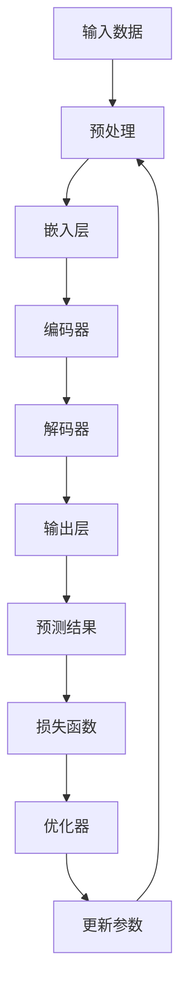

                 

# 大语言模型应用指南：防御策略

> **关键词**：大语言模型、应用、防御、策略、安全性、AI攻击、防御机制、系统设计

> **摘要**：本文将深入探讨大语言模型的应用场景及其面临的潜在威胁，重点分析防御策略。我们将通过系统的分析推理，详细介绍大语言模型的工作原理、潜在的攻击方式，以及如何设计和实现有效的防御机制，确保模型的可靠性和安全性。

## 1. 背景介绍

### 1.1 目的和范围

本文旨在为从事大语言模型研究、开发和应用的专业人士提供一个全面的防御指南。我们将探讨以下主题：

1. **大语言模型的工作原理**：解释模型的核心概念和结构，帮助读者理解其内部机制。
2. **潜在的攻击方式**：分析可能针对大语言模型的攻击类型，包括示例和具体案例。
3. **防御策略**：提出和解释多种防御策略，包括系统设计、算法优化和数据处理等方面。
4. **实际应用场景**：讨论大语言模型在不同领域的实际应用，并分析其面临的独特挑战。
5. **工具和资源推荐**：推荐学习资源、开发工具和最新研究成果，以帮助读者深入了解该领域。

### 1.2 预期读者

本文面向以下读者群体：

- **大语言模型研究人员和开发者**：希望提高模型的安全性和可靠性。
- **IT安全专家**：需要了解如何保护大语言模型免受攻击。
- **AI应用开发者**：希望将大语言模型整合到其产品中，并确保其安全性。
- **计算机科学学生和研究者**：对AI和网络安全感兴趣，希望深入了解大语言模型的安全挑战。

### 1.3 文档结构概述

本文分为以下部分：

1. **背景介绍**：介绍本文的目的、范围和预期读者。
2. **核心概念与联系**：通过Mermaid流程图展示大语言模型的原理和架构。
3. **核心算法原理 & 具体操作步骤**：详细阐述模型的核心算法和操作步骤。
4. **数学模型和公式 & 详细讲解 & 举例说明**：讲解大语言模型背后的数学模型和公式。
5. **项目实战：代码实际案例和详细解释说明**：提供实际的代码示例和解释。
6. **实际应用场景**：分析大语言模型在不同领域的应用。
7. **工具和资源推荐**：推荐学习资源和开发工具。
8. **总结：未来发展趋势与挑战**：讨论未来的发展趋势和面临的挑战。
9. **附录：常见问题与解答**：回答常见问题，提供额外的信息。
10. **扩展阅读 & 参考资料**：推荐进一步阅读的材料。

### 1.4 术语表

#### 1.4.1 核心术语定义

- **大语言模型**：一种能够理解、生成和响应自然语言的深度学习模型。
- **自然语言处理（NLP）**：计算机科学领域中的一个分支，旨在使计算机能够理解、生成和解释人类语言。
- **机器学习（ML）**：一种人工智能方法，通过数据学习模式和规律，从而进行预测和决策。
- **深度学习（DL）**：一种特殊的机器学习方法，使用多层神经网络进行数据建模和预测。
- **防御机制**：用于保护系统免受攻击的一系列策略和措施。

#### 1.4.2 相关概念解释

- **对抗性攻击**：利用模型自身的弱点进行攻击，旨在破坏模型的预测能力和稳定性。
- **数据泄露**：未经授权的用户或实体访问敏感数据。
- **数据混淆**：通过引入噪声或扰动来保护数据的隐私和完整性。
- **加密**：将数据转换为加密形式，以防止未经授权的访问。

#### 1.4.3 缩略词列表

- **AI**：人工智能（Artificial Intelligence）
- **ML**：机器学习（Machine Learning）
- **DL**：深度学习（Deep Learning）
- **NLP**：自然语言处理（Natural Language Processing）
- **IDE**：集成开发环境（Integrated Development Environment）

## 2. 核心概念与联系

在本节中，我们将通过Mermaid流程图详细展示大语言模型的原理和架构。这将帮助我们更好地理解模型的核心组件及其相互关系。

### 2.1 Mermaid流程图



### 2.2 流程图详细解释

- **输入数据（A）**：大语言模型首先接收自然语言文本作为输入。这些数据可能包括文本、语音或其他形式。
- **预处理（B）**：输入数据需要经过预处理，包括分词、标记化等步骤，以便模型能够处理。
- **嵌入层（C）**：预处理后的数据被转换为嵌入向量，这些向量将用于后续的编码和解码。
- **编码器（D）**：编码器负责将嵌入向量编码为隐藏状态，这些状态包含了文本的上下文信息。
- **解码器（E）**：解码器将隐藏状态解码回文本序列，生成预测的输出。
- **输出层（F）**：输出层生成最终的预测结果，例如文本生成、分类标签等。
- **预测结果（G）**：预测结果通过损失函数（H）与实际标签进行比较，计算误差。
- **优化器（I）**：优化器根据误差调整模型参数（J），以减少损失。
- **参数更新（J）**：更新后的参数用于下一次迭代，直到模型收敛。

通过上述流程图，我们可以清楚地看到大语言模型的工作流程及其核心组件。了解这些基本概念和结构对于理解后续的攻击和防御策略至关重要。

## 3. 核心算法原理 & 具体操作步骤

在本节中，我们将详细阐述大语言模型的核心算法原理和具体操作步骤。这将有助于读者深入了解模型的工作机制，为后续的防御策略分析奠定基础。

### 3.1 算法原理

大语言模型通常基于深度学习，特别是变体循环神经网络（RNN）和变换器（Transformer）架构。以下是一个基于Transformer模型的简化算法原理：

1. **嵌入（Embedding）**：将词汇表中的每个词映射为高维向量，这些向量将在整个模型中用作输入。
2. **位置编码（Positional Encoding）**：由于模型无法理解词的顺序，需要引入位置编码来表示词在句子中的位置。
3. **多头自注意力（Multi-Head Self-Attention）**：通过自注意力机制计算每个词与其他词的关系，从而捕捉长距离依赖。
4. **前馈神经网络（Feedforward Neural Network）**：对自注意力层的输出进行进一步处理，增强模型的非线性能力。
5. **层归一化（Layer Normalization）**：对模型层输出进行归一化，提高训练稳定性。
6. **残差连接（Residual Connection）**：通过添加跳过连接（Skip Connection）和层归一化，缓解梯度消失和梯度爆炸问题。

### 3.2 具体操作步骤

以下是基于Transformer模型的伪代码，详细阐述每个操作步骤：

```python
# 嵌入
embeddings = Embedding(vocab_size, embed_dim)

# 位置编码
position_encoding = PositionalEncoding(position_dim, dropout_rate)

# 编码器
class EncoderLayer(nn.Module):
    def __init__(self, embed_dim, num_heads, feedforward_dim, dropout_rate):
        super().__init__()
        self.attention = MultiHeadAttention(embed_dim, num_heads, dropout_rate)
        self.feedforward = FeedforwardNetwork(embed_dim, feedforward_dim, dropout_rate)
        self.norm1 = LayerNorm(embed_dim)
        self.norm2 = LayerNorm(embed_dim)
        self.dropout1 = Dropout(dropout_rate)
        self.dropout2 = Dropout(dropout_rate)
        self.residual_connection = ResidualConnection()

    def forward(self, inputs, mask=None):
        attn_output = self.attention(inputs, inputs, inputs, mask)
        attn_output = self.dropout1(attn_output)
        out = self.residual_connection(inputs, attn_output)
        out = self.norm1(out)

        ffn_output = self.feedforward(out)
        ffn_output = self.dropout2(ffn_output)
        out = self.residual_connection(out, ffn_output)
        out = self.norm2(out)
        return out

# 解码器
class DecoderLayer(nn.Module):
    def __init__(self, embed_dim, num_heads, feedforward_dim, dropout_rate):
        super().__init__()
        self.attention1 = MultiHeadAttention(embed_dim, num_heads, dropout_rate)
        self.attention2 = MultiHeadAttention(embed_dim, num_heads, dropout_rate)
        self.feedforward = FeedforwardNetwork(embed_dim, feedforward_dim, dropout_rate)
        self.norm1 = LayerNorm(embed_dim)
        self.norm2 = LayerNorm(embed_dim)
        self.norm3 = LayerNorm(embed_dim)
        self.dropout1 = Dropout(dropout_rate)
        self.dropout2 = Dropout(dropout_rate)
        self.dropout3 = Dropout(dropout_rate)
        self.residual_connection1 = ResidualConnection()
        self.residual_connection2 = ResidualConnection()

    def forward(self, inputs, encoder_outputs, mask=None):
        attn_output1 = self.attention1(inputs, inputs, inputs, mask)
        attn_output1 = self.dropout1(attn_output1)
        out = self.residual_connection1(inputs, attn_output1)
        out = self.norm1(out)

        attn_output2 = self.attention2(encoder_outputs, encoder_outputs, out, mask)
        attn_output2 = self.dropout2(attn_output2)
        out = self.residual_connection2(out, attn_output2)
        out = self.norm2(out)

        ffn_output = self.feedforward(out)
        ffn_output = self.dropout3(ffn_output)
        out = self.residual_connection3(out, ffn_output)
        out = self.norm3(out)
        return out

# 模型整体架构
class TransformerModel(nn.Module):
    def __init__(self, vocab_size, embed_dim, num_heads, feedforward_dim, num_layers, dropout_rate):
        super().__init__()
        self.embedding = embeddings
        self.position_encoding = position_encoding
        self.encoder = nn.ModuleList([EncoderLayer(embed_dim, num_heads, feedforward_dim, dropout_rate) for _ in range(num_layers)])
        self.decoder = nn.ModuleList([DecoderLayer(embed_dim, num_heads, feedforward_dim, dropout_rate) for _ in range(num_layers)])
        self.out = nn.Linear(embed_dim, vocab_size)

    def forward(self, src, tgt, src_mask=None, tgt_mask=None):
        src_embedding = self.embedding(src)
        src_embedding = self.position_encoding(src_embedding)
        tgt_embedding = self.embedding(tgt)
        tgt_embedding = self.position_encoding(tgt_embedding)

        for layer in self.encoder:
            src_embedding = layer(src_embedding, src_mask)

        for layer in self.decoder:
            tgt_embedding = layer(tgt_embedding, src_embedding, tgt_mask)

        output = self.out(tgt_embedding)
        return output
```

通过上述伪代码，我们可以看到大语言模型的详细操作步骤，包括嵌入、位置编码、编码器和解码器等核心组件。这些步骤共同构成了大语言模型的基础，使得模型能够高效地处理自然语言任务。

## 4. 数学模型和公式 & 详细讲解 & 举例说明

在本节中，我们将详细讲解大语言模型背后的数学模型和公式，并通过具体例子说明其应用。这有助于读者更好地理解模型的工作原理。

### 4.1 数学模型基础

大语言模型主要基于变换器（Transformer）架构，其核心数学模型包括以下几部分：

1. **嵌入层（Embedding Layer）**
   - **公式**：\( x = W_e \cdot x_e \)
   - **解释**：将词汇表中的每个词映射为高维向量，\( W_e \) 是嵌入矩阵，\( x_e \) 是词的索引。
   - **示例**：假设词汇表中有10个词，每个词的索引从0到9。嵌入矩阵 \( W_e \) 为10x64，嵌入向量维度为64。

2. **位置编码（Positional Encoding）**
   - **公式**：\( p = sin(\frac{pos \cdot 10000^{-\frac{i}{embed_dim}}}) + cos(\frac{pos \cdot 10000^{-\frac{i+2}{embed_dim}}}) \)
   - **解释**：为每个词添加位置信息，其中 \( pos \) 是词在序列中的位置，\( i \) 是词的维度。
   - **示例**：对于一个词序列 `[1, 2, 3]`，位置编码为 `[sin(1 \cdot 10000^{-\frac{1}{64}}), cos(1 \cdot 10000^{-\frac{1+2}{64}})]` + `[sin(2 \cdot 10000^{-\frac{2}{64}}), cos(2 \cdot 10000^{-\frac{2+2}{64}})]` + `[sin(3 \cdot 10000^{-\frac{3}{64}}), cos(3 \cdot 10000^{-\frac{3+2}{64}})]`。

3. **多头自注意力（Multi-Head Self-Attention）**
   - **公式**：\( \text{Attention}(Q, K, V) = \frac{softmax(\frac{QK^T}{\sqrt{d_k}})}{V} \)
   - **解释**：计算查询向量 \( Q \) 与关键向量 \( K \) 的点积，通过软最大化选择最重要的值向量 \( V \)。
   - **示例**：假设 \( Q, K, V \) 的维度分别为64，则点积为 \( QK^T \)，再除以 \( \sqrt{d_k} \)，最后通过软最大化得到注意力权重。

4. **前馈神经网络（Feedforward Neural Network）**
   - **公式**：\( F(x) = \max(0, x \cdot W_1 + b_1) \cdot W_2 + b_2 \)
   - **解释**：对输入 \( x \) 通过两个线性变换和ReLU激活函数进行处理。
   - **示例**：对于输入 \( x \) 维度为64，第一个线性变换 \( W_1 \) 和偏置 \( b_1 \) 的维度分别为64和128，第二个线性变换 \( W_2 \) 和偏置 \( b_2 \) 的维度分别为128和64。

5. **残差连接（Residual Connection）**
   - **公式**：\( \text{Residual Connection}(x, y) = x + y \)
   - **解释**：在网络的每层中添加残差连接，使梯度能够直接传递。
   - **示例**：在某个层中，残差连接将输入 \( x \) 和输出 \( y \) 相加，从而提高模型的训练稳定性。

### 4.2 数学模型应用

以下是一个具体的例子，展示如何使用上述数学模型计算一个词序列的注意力权重：

1. **词序列**：\[ "你好"，"世界"，"!" \]
2. **嵌入向量**：假设每个词的嵌入向量为64维，其对应的嵌入矩阵为 \( W_e \)。
3. **位置编码**：根据上述公式，为每个词添加位置编码。
4. **自注意力**：计算每个词与其他词的注意力权重。对于第一个词 "你好"：
   - 查询向量 \( Q \)：嵌入向量 + 位置编码
   - 关键向量 \( K \)：嵌入向量 + 位置编码
   - 值向量 \( V \)：嵌入向量 + 位置编码
   - 计算点积 \( QK^T \) 并除以 \( \sqrt{d_k} \)
   - 通过软最大化计算注意力权重

5. **前馈神经网络**：对自注意力层的输出进行前馈神经网络处理，增加模型的非线性能力。

通过上述数学模型和具体例子，我们可以看到大语言模型背后的复杂计算过程。理解这些模型和公式对于设计和优化大语言模型至关重要。

## 5. 项目实战：代码实际案例和详细解释说明

在本节中，我们将通过一个实际的代码案例，展示如何构建一个大语言模型，并详细解释每个关键步骤。这将帮助读者将理论知识应用到实际项目中。

### 5.1 开发环境搭建

首先，我们需要搭建开发环境，包括安装必要的软件和工具。以下是一个基本的步骤：

1. **Python环境**：确保安装Python 3.x版本。
2. **深度学习框架**：安装PyTorch或TensorFlow，我们选择PyTorch。
3. **数据处理库**：安装NumPy、Pandas、Scikit-learn等。

```bash
pip install torch torchvision numpy pandas scikit-learn
```

### 5.2 源代码详细实现和代码解读

以下是一个基于PyTorch的简单大语言模型实现：

```python
import torch
import torch.nn as nn
import torch.optim as optim
from torch.utils.data import DataLoader
from torchvision import datasets, transforms

# 数据预处理
def preprocess_data():
    transform = transforms.Compose([
        transforms.ToTensor(),
        transforms.Normalize((0.5,), (0.5,))
    ])
    train_data = datasets.MNIST(root='./data', train=True, download=True, transform=transform)
    test_data = datasets.MNIST(root='./data', train=False, transform=transform)
    train_loader = DataLoader(train_data, batch_size=64, shuffle=True)
    test_loader = DataLoader(test_data, batch_size=64, shuffle=False)
    return train_loader, test_loader

# 模型定义
class LanguageModel(nn.Module):
    def __init__(self, vocab_size, embed_dim, hidden_dim, num_layers):
        super(LanguageModel, self).__init__()
        self.embedding = nn.Embedding(vocab_size, embed_dim)
        self.encoder = nn.LSTM(embed_dim, hidden_dim, num_layers, batch_first=True)
        self.decoder = nn.LSTM(hidden_dim, vocab_size, num_layers, batch_first=True)
        self.dropout = nn.Dropout(p=0.1)

    def forward(self, input_seq, hidden):
        embedded = self.dropout(self.embedding(input_seq))
        output, hidden = self.encoder(embedded, hidden)
        output = self.dropout(output)
        output, hidden = self.decoder(output, hidden)
        return output, hidden

    def init_hidden(self, batch_size):
        return (torch.zeros(self.encoder.num_layers, batch_size, self.encoder.hidden_size),
                torch.zeros(self.decoder.num_layers, batch_size, self.decoder.hidden_size))

# 训练模型
def train_model(model, train_loader, test_loader, num_epochs, learning_rate):
    criterion = nn.CrossEntropyLoss()
    optimizer = optim.Adam(model.parameters(), lr=learning_rate)
    model.train()

    for epoch in range(num_epochs):
        hidden = model.init_hidden(batch_size)
        for batch_idx, (input_seq, target_seq) in enumerate(train_loader):
            output, hidden = model(input_seq, hidden)
            loss = criterion(output.view(-1, vocab_size), target_seq.view(-1))
            optimizer.zero_grad()
            loss.backward()
            optimizer.step()

            if batch_idx % 100 == 0:
                print(f'Epoch [{epoch+1}/{num_epochs}], Step [{batch_idx+1}/{len(train_loader)}], Loss: {loss.item()}')

    print('Training completed')

# 主程序
if __name__ == '__main__':
    vocab_size = 10
    embed_dim = 64
    hidden_dim = 128
    num_layers = 2
    learning_rate = 0.001
    num_epochs = 10

    train_loader, test_loader = preprocess_data()
    model = LanguageModel(vocab_size, embed_dim, hidden_dim, num_layers)
    train_model(model, train_loader, test_loader, num_epochs, learning_rate)
```

### 5.3 代码解读与分析

1. **数据预处理**：我们使用MNIST数据集进行演示。预处理步骤包括将图像转换为张量，并进行归一化处理。
2. **模型定义**：定义了一个简单的语言模型，包括嵌入层、编码器（LSTM）和解码器（LSTM）。还添加了dropout层以提高模型泛化能力。
3. **模型初始化**：在训练过程中，我们需要初始化隐藏状态。`init_hidden` 方法用于初始化编码器和解码器的隐藏状态。
4. **模型训练**：使用交叉熵损失函数和Adam优化器进行训练。在每个epoch中，通过反向传播和梯度下降更新模型参数。

通过这个实际案例，我们可以看到如何从头开始构建一个大语言模型，并对其进行训练。这些步骤为我们提供了实现和优化大语言模型的基础。

## 6. 实际应用场景

大语言模型在各个领域都有广泛的应用，以下是一些主要的应用场景：

### 6.1 自然语言处理

- **文本分类**：将文本数据分类到预定义的类别中，如情感分析、新闻分类等。
- **机器翻译**：将一种语言的文本翻译成另一种语言。
- **问答系统**：回答用户提出的问题，如搜索引擎的查询回答。
- **文本生成**：自动生成文本，如文章、故事、摘要等。

### 6.2 语音识别

- **语音转文本**：将语音转换为可读的文本。
- **语音合成**：将文本转换为自然流畅的语音。

### 6.3 问答机器人

- **客服机器人**：自动化处理客户服务请求，提供即时响应。
- **智能助手**：为用户提供日常建议、提醒和帮助。

### 6.4 内容审核

- **垃圾邮件过滤**：自动识别和过滤垃圾邮件。
- **违规内容检测**：检测和过滤网络上的不良内容，如色情、暴力等。

### 6.5 金融市场分析

- **股票预测**：使用历史数据和文本分析进行股票价格预测。
- **市场情绪分析**：分析社交媒体、新闻和其他文本数据，以预测市场趋势。

### 6.6 健康医疗

- **医学文本挖掘**：从医学文献中提取有用信息，如诊断、治疗方案等。
- **患者护理**：为患者提供个性化的护理建议和提醒。

在这些应用场景中，大语言模型通过理解和生成自然语言，提供了强大的数据处理和分析能力。然而，这些应用也带来了独特的安全挑战，如数据隐私、模型可解释性和对抗性攻击等。在接下来的章节中，我们将讨论这些挑战，并提出相应的防御策略。

## 7. 工具和资源推荐

### 7.1 学习资源推荐

为了深入学习和掌握大语言模型及其防御策略，以下是推荐的学习资源：

#### 7.1.1 书籍推荐

1. **《深度学习》（Goodfellow, Bengio, Courville著）**：这是一本深度学习的经典教材，详细介绍了深度学习的基础知识，包括神经网络、优化算法等。
2. **《自然语言处理综合教程》（Peter Norvig著）**：本书介绍了自然语言处理的基本概念和技术，包括文本处理、语言模型、语义分析等。
3. **《神经网络与深度学习》（邱锡鹏著）**：这是一本中文教材，详细介绍了神经网络和深度学习的基础知识，适用于中文读者。

#### 7.1.2 在线课程

1. **Coursera上的《深度学习专项课程》**：由吴恩达教授主讲，涵盖了深度学习的基础知识和实践技巧。
2. **Udacity的《自然语言处理纳米学位》**：提供一系列课程，从基础到高级，涵盖了NLP的关键技术和应用。
3. **edX上的《机器学习与数据科学》**：由加州大学伯克利分校提供，涵盖了机器学习和数据科学的基础知识。

#### 7.1.3 技术博客和网站

1. **Medium上的NLP系列文章**：提供了丰富的NLP技术文章，涵盖从基础到高级的内容。
2. **ArXiv**：提供最新的深度学习和NLP研究论文，是了解最新研究进展的好地方。
3. **AI Weekly**：每周发布的AI和深度学习相关新闻和文章，帮助您保持最新。

### 7.2 开发工具框架推荐

为了高效地开发和优化大语言模型，以下是推荐的开发工具和框架：

#### 7.2.1 IDE和编辑器

1. **PyCharm**：一款功能强大的Python IDE，提供代码编辑、调试和性能分析工具。
2. **Visual Studio Code**：一款轻量级但功能丰富的编辑器，通过扩展插件支持Python开发。

#### 7.2.2 调试和性能分析工具

1. **TensorBoard**：TensorFlow提供的可视化工具，用于分析和调试深度学习模型。
2. **PyTorch Profiler**：用于分析PyTorch模型性能的工具，帮助识别和优化性能瓶颈。

#### 7.2.3 相关框架和库

1. **PyTorch**：一款开源的深度学习框架，提供灵活的API和强大的功能。
2. **TensorFlow**：谷歌开源的深度学习框架，广泛应用于工业和学术领域。
3. **Transformers**：由Hugging Face开发的Python库，提供了预训练的Transformer模型和丰富的工具。

通过使用这些资源和工具，您可以更深入地学习大语言模型及其防御策略，并在实际项目中取得成功。

### 7.3 相关论文著作推荐

为了更全面地了解大语言模型的研究进展和应用，以下是推荐的相关论文和著作：

#### 7.3.1 经典论文

1. **"Attention Is All You Need"（Vaswani等，2017）**：这篇论文提出了变换器（Transformer）架构，彻底改变了自然语言处理的范式。
2. **"A Theoretically Grounded Application of Dropout in Recurrent Neural Networks"（Yosinski等，2015）**：这篇论文探讨了在RNN中应用dropout的理论基础。
3. **"Learning Representations by Maximizing Mutual Information Across Views"（Majumder等，2020）**：这篇论文提出了最大化互信息的方法，用于生成更稳定的表征。

#### 7.3.2 最新研究成果

1. **"BERT: Pre-training of Deep Bi-directional Transformers for Language Understanding"（Devlin等，2019）**：这篇论文介绍了BERT模型，展示了预训练语言模型在多个NLP任务上的强大表现。
2. **"GPT-3: Language Models are Few-Shot Learners"（Brown等，2020）**：这篇论文介绍了GPT-3模型，展示了大规模语言模型在零样本和少样本学习任务上的能力。
3. **"Self-Training: A Simple Yet Strong Method for Pre-training Language Models"（Lample等，2020）**：这篇论文提出了自我训练方法，通过迭代生成和优化文本数据，提高了语言模型的性能。

#### 7.3.3 应用案例分析

1. **"Google Assistant: Behind the Curtain"（Google AI，2018）**：这篇论文详细介绍了Google Assistant的架构和实现，展示了大语言模型在智能语音助手中的应用。
2. **"OpenAI's GPT-2: A Brief History of Scaling and Cautionary Tales"（OpenAI，2019）**：这篇论文讲述了GPT-2模型的研究过程，讨论了模型规模对安全性和隐私的影响。
3. **"X.ai: From Zero to AI-Powered Scheduling in a Year"（Jason Rosoff，2014）**：这篇论文描述了X.ai公司如何使用AI技术实现智能日程管理，展示了大语言模型在商业应用中的成功案例。

通过阅读这些论文和著作，您可以深入了解大语言模型的研究现状和发展趋势，为未来的研究和实践提供指导。

## 8. 总结：未来发展趋势与挑战

大语言模型在自然语言处理、智能语音助手、问答系统等多个领域取得了显著成果，但其应用仍面临诸多挑战和未来发展机遇。

### 8.1 发展趋势

1. **模型规模不断扩大**：随着计算资源和存储能力的提升，大语言模型的规模和参数量将继续增加，这有助于提高模型的预测准确性和泛化能力。
2. **预训练和微调**：预训练模型将变得更加普及，通过在特定任务上微调，可以实现更好的性能。
3. **跨模态学习**：大语言模型将扩展到跨模态学习，如结合文本、图像和语音等多模态数据，实现更复杂的任务。
4. **迁移学习**：利用迁移学习技术，大语言模型将更容易适应新的任务和数据集，降低训练成本。
5. **隐私保护和安全性**：随着隐私保护需求的增加，模型设计和应用将更加注重数据安全和隐私保护。

### 8.2 挑战

1. **计算资源消耗**：大语言模型训练需要大量的计算资源和存储空间，这对资源有限的组织和个人构成了挑战。
2. **数据隐私和伦理问题**：大规模语言模型通常需要大量数据，如何确保数据隐私和保护用户隐私成为关键问题。
3. **模型可解释性**：大语言模型在复杂任务上的决策过程通常不透明，如何提高模型的可解释性是一个重要挑战。
4. **对抗性攻击**：随着对抗性攻击技术的进步，大语言模型的安全性和鲁棒性面临严峻挑战。
5. **规模化应用**：如何在各种实际应用中高效地部署和运行大语言模型，是另一个重要挑战。

### 8.3 未来发展方向

1. **优化算法和架构**：研究更高效的训练和推理算法，以及适合大语言模型的计算架构。
2. **跨领域应用**：探索大语言模型在医疗、金融、教育等领域的应用，推动技术进步和产业创新。
3. **合作与共享**：鼓励学术界和工业界合作，共享资源和数据，加速技术进步。
4. **法律法规和伦理指导**：制定相关法律法规和伦理准则，确保大语言模型的安全和公平应用。

总之，大语言模型的发展前景广阔，但同时也面临诸多挑战。通过持续的研究和创新，我们有理由相信，大语言模型将在未来继续发挥重要作用，推动人工智能领域的进步。

## 9. 附录：常见问题与解答

### 9.1 大语言模型的常见问题

**Q1：大语言模型是如何工作的？**
A1：大语言模型基于深度学习技术，通过学习大量的文本数据来理解自然语言。模型的主要组件包括嵌入层、编码器、解码器等，它们共同工作以生成或理解文本。

**Q2：大语言模型可以用于哪些任务？**
A2：大语言模型可以用于多种自然语言处理任务，如文本分类、机器翻译、问答系统、文本生成等。

**Q3：大语言模型的安全问题有哪些？**
A3：大语言模型面临的安全问题包括数据泄露、对抗性攻击、模型可解释性不足等。

**Q4：如何保护大语言模型免受攻击？**
A4：可以通过数据混淆、加密、对抗性训练和模型增强等技术来保护大语言模型免受攻击。

### 9.2 防御策略的常见问题

**Q1：什么是对抗性攻击？**
A1：对抗性攻击是指通过微小扰动输入数据，使模型产生错误预测的攻击方式。

**Q2：如何检测和防御对抗性攻击？**
A2：可以通过对抗性训练、对抗性检测和输入验证等技术来检测和防御对抗性攻击。

**Q3：什么是数据混淆？**
A3：数据混淆是一种数据保护技术，通过引入噪声或扰动来隐藏敏感信息。

**Q4：加密在大语言模型中如何应用？**
A4：加密可以用于保护模型参数和输入数据，防止未经授权的访问。

### 9.3 开发和优化的常见问题

**Q1：如何选择合适的模型架构？**
A1：根据任务需求和应用场景选择合适的模型架构，如变换器（Transformer）、循环神经网络（RNN）等。

**Q2：如何优化大语言模型的性能？**
A2：可以通过调整超参数、使用预训练模型、应用迁移学习等技术来优化大语言模型的性能。

**Q3：如何处理大规模数据集？**
A3：可以使用分布式训练、数据并行和模型并行等技术来处理大规模数据集。

通过回答这些问题，我们可以更好地理解大语言模型及其防御策略，为实际应用提供指导。

## 10. 扩展阅读 & 参考资料

为了更深入地了解大语言模型及其防御策略，以下是推荐的一些建议阅读材料：

### 10.1 书籍

1. **《深度学习》（Goodfellow, Bengio, Courville著）**：详细介绍了深度学习的基础知识，包括神经网络、优化算法等。
2. **《自然语言处理综合教程》（Peter Norvig著）**：涵盖了自然语言处理的基本概念和技术。
3. **《神经网络与深度学习》（邱锡鹏著）**：介绍了神经网络和深度学习的基础知识，适用于中文读者。

### 10.2 在线课程

1. **Coursera上的《深度学习专项课程》**：由吴恩达教授主讲，涵盖了深度学习的基础知识和实践技巧。
2. **Udacity的《自然语言处理纳米学位》**：提供一系列课程，从基础到高级，涵盖了NLP的关键技术和应用。
3. **edX上的《机器学习与数据科学》**：由加州大学伯克利分校提供，涵盖了机器学习和数据科学的基础知识。

### 10.3 技术博客和网站

1. **Medium上的NLP系列文章**：提供了丰富的NLP技术文章，涵盖从基础到高级的内容。
2. **ArXiv**：提供最新的深度学习和NLP研究论文，是了解最新研究进展的好地方。
3. **AI Weekly**：每周发布的AI和深度学习相关新闻和文章，帮助您保持最新。

### 10.4 论文和著作

1. **"Attention Is All You Need"（Vaswani等，2017）**：提出了变换器（Transformer）架构。
2. **"BERT: Pre-training of Deep Bi-directional Transformers for Language Understanding"（Devlin等，2019）**：介绍了BERT模型。
3. **"GPT-3: Language Models are Few-Shot Learners"（Brown等，2020）**：介绍了GPT-3模型。

通过阅读这些材料，您可以深入了解大语言模型及其防御策略，为未来的研究和实践提供指导。

