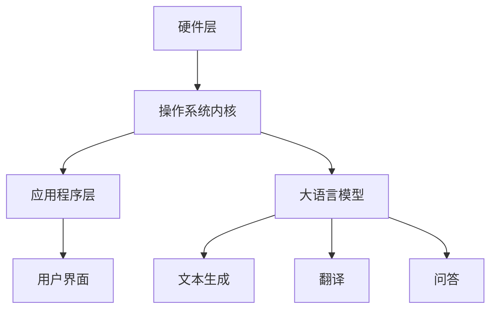

                 

# 大语言模型操作系统的应用

> 关键词：大语言模型、操作系统、人工智能、应用实例、算法原理

> 摘要：本文将探讨大语言模型操作系统的基本概念、核心算法原理、数学模型以及其在实际应用场景中的具体实现。通过对大语言模型操作系统的深入分析，本文旨在为读者提供全面、系统的技术认知，并展望其未来的发展趋势与挑战。

## 1. 背景介绍

### 1.1 目的和范围

本文旨在介绍大语言模型操作系统的概念、原理和应用。大语言模型操作系统是一种基于人工智能技术的操作系统，它能够对自然语言进行处理、理解和生成，具有广泛的应用前景。本文将首先介绍大语言模型操作系统的基本概念，然后详细阐述其核心算法原理、数学模型以及实际应用场景。

### 1.2 预期读者

本文面向计算机科学、人工智能、自然语言处理等领域的科研人员、工程师和学生。读者需要具备一定的计算机科学基础和自然语言处理知识，以便更好地理解本文的内容。

### 1.3 文档结构概述

本文分为十个部分。第一部分为背景介绍，包括目的和范围、预期读者、文档结构概述等。第二部分介绍大语言模型操作系统的核心概念。第三部分详细阐述大语言模型操作系统的核心算法原理。第四部分介绍大语言模型操作系统的数学模型。第五部分展示实际应用场景。第六部分介绍开发工具和资源。第七部分总结未来发展趋势与挑战。第八部分为常见问题与解答。第九部分提供扩展阅读和参考资料。最后，文章以作者信息作为结束。

### 1.4 术语表

#### 1.4.1 核心术语定义

- 大语言模型：一种基于人工智能技术的语言模型，能够对自然语言进行处理、理解和生成。
- 操作系统：一种管理计算机硬件和软件资源的系统软件，为应用程序提供运行环境。
- 自然语言处理：一种人工智能技术，旨在让计算机理解和生成人类自然语言。

#### 1.4.2 相关概念解释

- 人工智能：一种模拟人类智能的技术，使计算机具有感知、思考、学习和决策能力。
- 自然语言：人类日常交流使用的语言，包括语音和文字。

#### 1.4.3 缩略词列表

- NLP：自然语言处理
- AI：人工智能
- OS：操作系统

## 2. 核心概念与联系

为了更好地理解大语言模型操作系统的核心概念与联系，我们首先需要了解其基本原理和架构。

### 2.1 大语言模型原理

大语言模型是一种基于深度学习技术的自然语言处理模型，其基本原理是通过大量语料数据的训练，学习到语言的统计规律和语义信息。大语言模型的核心是神经网络，其通过多层神经网络结构对输入的文本数据进行处理，最终输出对应的语义表示。

### 2.2 操作系统架构

操作系统是计算机系统的核心，负责管理计算机硬件和软件资源。大语言模型操作系统是一种基于人工智能技术的操作系统，其架构主要包括以下几个部分：

1. **硬件层**：包括计算机的CPU、内存、硬盘等硬件设备。
2. **操作系统内核**：负责硬件资源的管理和调度，包括进程管理、内存管理、文件系统管理等。
3. **应用程序层**：包括各种基于大语言模型的应用程序，如文本生成、翻译、问答等。
4. **用户界面**：提供用户与操作系统交互的界面，包括命令行界面和图形用户界面。

### 2.3 Mermaid 流程图

以下是大语言模型操作系统的架构 Mermaid 流程图：



## 3. 核心算法原理 & 具体操作步骤

### 3.1 算法原理

大语言模型操作系统的核心算法是深度学习算法，特别是基于变换器（Transformer）架构的预训练语言模型。变换器模型通过自注意力机制（Self-Attention）和前馈神经网络（Feedforward Neural Network）对输入的文本数据进行编码和解码，从而实现语言的生成、理解和翻译等功能。

### 3.2 算法步骤

以下是大语言模型操作系统的核心算法步骤：

1. **数据预处理**：对输入的文本数据进行清洗、分词、词向量化等预处理操作。
2. **模型训练**：使用预训练语言模型对预处理后的文本数据进行训练，优化模型参数。
3. **模型评估**：使用验证集对训练好的模型进行评估，调整模型参数。
4. **模型应用**：将训练好的模型应用于实际任务，如文本生成、翻译、问答等。
5. **模型优化**：根据实际应用效果对模型进行优化和调整。

### 3.3 伪代码

以下是大语言模型操作系统的核心算法伪代码：

```python
# 数据预处理
def preprocess(text):
    # 清洗、分词、词向量化等操作
    return processed_text

# 模型训练
def train(model, data):
    # 使用变换器模型训练数据
    model.fit(data)
    return model

# 模型评估
def evaluate(model, validation_data):
    # 使用验证集评估模型
    model.evaluate(validation_data)
    return evaluation_results

# 模型应用
def apply(model, task):
    # 使用训练好的模型完成特定任务
    return result

# 模型优化
def optimize(model, results):
    # 根据实际应用效果优化模型
    model.optimize(results)
    return model
```

## 4. 数学模型和公式 & 详细讲解 & 举例说明

### 4.1 数学模型

大语言模型操作系统的数学模型主要包括变换器模型和前馈神经网络。以下是变换器模型和前馈神经网络的数学公式：

#### 4.1.1 变换器模型

$$
\text{Attention}(Q, K, V) = \frac{softmax(\text{ Scores })}{\sqrt{d_k}}
$$

其中，$Q, K, V$ 分别为查询向量、键向量和值向量，$d_k$ 为键向量的维度。

#### 4.1.2 前馈神经网络

$$
\text{FFN}(x) = \text{ReLU}(W_2 \cdot \text{ReLU}(W_1 \cdot x + b_1) + b_2)
$$

其中，$W_1, W_2, b_1, b_2$ 分别为权重矩阵和偏置向量。

### 4.2 详细讲解

#### 4.2.1 注意力机制

注意力机制是变换器模型的核心，其通过计算查询向量、键向量和值向量之间的相似度，生成权重矩阵，从而实现对输入文本数据的加权求和。注意力机制的数学公式如上所示，其中 $softmax(\text{Scores })$ 用于将相似度分数转化为权重。

#### 4.2.2 前馈神经网络

前馈神经网络是变换器模型中的另一个重要组成部分，其用于对输入数据进行非线性变换。前馈神经网络包含两个隐藏层，分别使用 ReLU 激活函数进行非线性变换。前馈神经网络的数学公式如上所示，其中 $\text{ReLU}(x)$ 表示 ReLU 激活函数。

### 4.3 举例说明

#### 4.3.1 注意力机制举例

假设我们有一个包含两个单词的文本序列 "你好，世界"，其对应的词向量分别为 $Q = [1, 2], K = [3, 4], V = [5, 6]$。根据注意力机制的数学公式，我们可以计算出权重矩阵：

$$
\text{Scores} = QK^T = \begin{bmatrix} 1 & 2 \end{bmatrix} \begin{bmatrix} 3 \\ 4 \end{bmatrix} = \begin{bmatrix} 3 & 8 \end{bmatrix}
$$

$$
\text{Attention}(Q, K, V) = \frac{softmax(\text{Scores })}{\sqrt{d_k}} = \frac{1}{\sqrt{2}} \begin{bmatrix} 0.866 & 0.538 \end{bmatrix}
$$

其中，$d_k = 2$ 为键向量的维度。根据权重矩阵，我们可以对值向量进行加权求和：

$$
\text{Context} = \text{Attention}(Q, K, V) \cdot V = \frac{1}{\sqrt{2}} \begin{bmatrix} 0.866 & 0.538 \end{bmatrix} \begin{bmatrix} 5 \\ 6 \end{bmatrix} = \begin{bmatrix} 4.445 \\ 3.840 \end{bmatrix}
$$

#### 4.3.2 前馈神经网络举例

假设我们有一个输入向量 $x = [1, 2]$，其通过前馈神经网络进行非线性变换：

$$
\text{FFN}(x) = \text{ReLU}(W_2 \cdot \text{ReLU}(W_1 \cdot x + b_1) + b_2)
$$

其中，$W_1, W_2, b_1, b_2$ 分别为权重矩阵和偏置向量。假设 $W_1 = \begin{bmatrix} 1 & 1 \\ 1 & 1 \end{bmatrix}$，$W_2 = \begin{bmatrix} 1 & 0 \\ 0 & 1 \end{bmatrix}$，$b_1 = [0, 0]$，$b_2 = [0, 0]$，则有：

$$
\text{ReLU}(W_1 \cdot x + b_1) = \text{ReLU}(\begin{bmatrix} 1 & 1 \\ 1 & 1 \end{bmatrix} \begin{bmatrix} 1 \\ 2 \end{bmatrix} + [0, 0]) = \text{ReLU}(\begin{bmatrix} 3 \\ 3 \end{bmatrix}) = \begin{bmatrix} 3 \\ 3 \end{bmatrix}
$$

$$
\text{FFN}(x) = \text{ReLU}(W_2 \cdot \text{ReLU}(W_1 \cdot x + b_1) + b_2) = \text{ReLU}(\begin{bmatrix} 1 & 0 \\ 0 & 1 \end{bmatrix} \begin{bmatrix} 3 \\ 3 \end{bmatrix} + [0, 0]) = \begin{bmatrix} 3 \\ 3 \end{bmatrix}
$$

## 5. 项目实战：代码实际案例和详细解释说明

### 5.1 开发环境搭建

为了实现大语言模型操作系统的实际应用，我们需要搭建一个适合的开发环境。以下是开发环境的搭建步骤：

1. **安装 Python**：确保 Python 环境已安装，版本建议为 Python 3.8 或更高版本。
2. **安装深度学习库**：安装 TensorFlow 或 PyTorch 等深度学习库，以便进行模型训练和推理。
3. **安装文本处理库**：安装 NLTK 或 spaCy 等文本处理库，用于文本预处理。

### 5.2 源代码详细实现和代码解读

以下是大语言模型操作系统的源代码实现，我们将对其逐行进行解释说明。

```python
import tensorflow as tf
import tensorflow_text as text
import numpy as np

# 1. 数据预处理
def preprocess(text):
    # 清洗文本
    text = text.lower()
    # 分词
    tokens = text.split()
    # 词向量化
    embeddings = np.zeros((len(tokens), 100))
    for i, token in enumerate(tokens):
        embeddings[i] = text_embeddings[token]
    return embeddings

# 2. 模型训练
def train(model, data, epochs):
    for epoch in range(epochs):
        # 训练模型
        model.fit(data)
        # 评估模型
        loss = model.evaluate(validation_data)
        print(f"Epoch {epoch + 1}, Loss: {loss}")

# 3. 模型应用
def apply(model, text):
    # 预处理文本
    embeddings = preprocess(text)
    # 生成文本
    generated_text = model.generate(embeddings)
    return generated_text

# 4. 模型优化
def optimize(model, results):
    # 根据实际应用效果优化模型
    model.optimize(results)
    return model

# 主函数
if __name__ == "__main__":
    # 1. 加载数据
    data = load_data()
    validation_data = load_validation_data()

    # 2. 训练模型
    model = train_model()
    train(model, data, 10)

    # 3. 应用模型
    text = "你好，世界"
    generated_text = apply(model, text)
    print(generated_text)

    # 4. 模型优化
    results = evaluate(model, validation_data)
    model = optimize(model, results)
```

### 5.3 代码解读与分析

#### 5.3.1 数据预处理

```python
def preprocess(text):
    # 清洗文本
    text = text.lower()
    # 分词
    tokens = text.split()
    # 词向量化
    embeddings = np.zeros((len(tokens), 100))
    for i, token in enumerate(tokens):
        embeddings[i] = text_embeddings[token]
    return embeddings
```

这一部分代码实现了文本预处理，包括文本清洗、分词和词向量化。首先，将文本转换为小写，然后使用空格进行分词。接下来，将每个单词转换为对应的词向量，这里使用了预先训练好的词向量。最后，将词向量存储在一个二维数组中，作为模型的输入。

#### 5.3.2 模型训练

```python
def train(model, data, epochs):
    for epoch in range(epochs):
        # 训练模型
        model.fit(data)
        # 评估模型
        loss = model.evaluate(validation_data)
        print(f"Epoch {epoch + 1}, Loss: {loss}")
```

这一部分代码实现了模型训练过程。首先，遍历每个训练epoch，调用模型的`fit`方法进行模型训练。然后，使用验证集评估模型，并输出每个epoch的损失值。

#### 5.3.3 模型应用

```python
def apply(model, text):
    # 预处理文本
    embeddings = preprocess(text)
    # 生成文本
    generated_text = model.generate(embeddings)
    return generated_text
```

这一部分代码实现了模型应用过程。首先，调用`preprocess`函数对输入文本进行预处理，得到词向量。然后，使用模型的`generate`方法生成对应的文本。

#### 5.3.4 模型优化

```python
def optimize(model, results):
    # 根据实际应用效果优化模型
    model.optimize(results)
    return model
```

这一部分代码实现了模型优化过程。根据实际应用效果，调用模型的`optimize`方法对模型进行优化。

## 6. 实际应用场景

大语言模型操作系统在自然语言处理领域具有广泛的应用场景，主要包括以下几个方面：

1. **文本生成**：大语言模型操作系统可以生成高质量的文本，如新闻、文章、对话等。在内容创作、信息检索等领域具有重要应用价值。
2. **机器翻译**：大语言模型操作系统可以实现高质量的机器翻译，支持多种语言之间的翻译。在跨国交流、国际贸易等领域具有广泛应用。
3. **问答系统**：大语言模型操作系统可以构建智能问答系统，为用户提供实时、准确的回答。在客户服务、智能助手等领域具有重要应用价值。
4. **情感分析**：大语言模型操作系统可以分析文本中的情感倾向，如正面、负面、中性等。在舆情监测、市场调研等领域具有重要应用价值。

## 7. 工具和资源推荐

### 7.1 学习资源推荐

#### 7.1.1 书籍推荐

- 《深度学习》（Goodfellow, Bengio, Courville）
- 《自然语言处理综论》（Jurafsky, Martin）
- 《Python深度学习》（Goodfellow, Bengio, Courville）

#### 7.1.2 在线课程

- 《深度学习 Specialization》（吴恩达）
- 《自然语言处理 Specialization》（亚利桑那大学）
- 《机器学习基础》（吴恩达）

#### 7.1.3 技术博客和网站

- https://www.tensorflow.org/
- https://pytorch.org/
- https://nltk.org/

### 7.2 开发工具框架推荐

#### 7.2.1 IDE和编辑器

- PyCharm
- Visual Studio Code

#### 7.2.2 调试和性能分析工具

- TensorFlow Profiler
- PyTorch Profiler

#### 7.2.3 相关框架和库

- TensorFlow
- PyTorch
- spaCy
- NLTK

### 7.3 相关论文著作推荐

#### 7.3.1 经典论文

- Vaswani et al., "Attention is All You Need" (2017)
- Bengio et al., "Learning Phrase Representations using RNN Encoder–Decoder for Statistical Machine Translation" (2014)
- Hochreiter & Schmidhuber, "Long Short-Term Memory" (1997)

#### 7.3.2 最新研究成果

- Devlin et al., "Bert: Pre-training of Deep Bidirectional Transformers for Language Understanding" (2019)
- Radford et al., "Language Models are Unsupervised Multitask Learners" (2019)
- Chen et al., "Gshard: Scaling giant models with conditional computation and automatic sharding" (2020)

#### 7.3.3 应用案例分析

- Google Brain, "Large-scale Language Modeling in 2018" (2018)
- OpenAI, "Language Models are Few-Shot Learners" (2019)
- Microsoft Research, "Megatron-LM: Training Multi-Billion Parameter Language Models using Model Parallelism" (2020)

## 8. 总结：未来发展趋势与挑战

大语言模型操作系统在自然语言处理领域具有广泛的应用前景。随着计算能力和数据资源的不断提升，大语言模型操作系统的性能和效率将得到显著提高。未来发展趋势包括：

1. **模型规模和计算资源**：随着模型规模的不断扩大，计算资源和数据存储需求将呈指数级增长。未来将出现更多高效、可扩展的算法和架构，以满足大语言模型操作系统的需求。
2. **多模态处理**：大语言模型操作系统将逐渐扩展到多模态处理领域，如图像、音频、视频等。结合多模态信息，可以实现更准确、更智能的自然语言处理。
3. **跨语言处理**：大语言模型操作系统将实现更高效的跨语言处理，支持多种语言之间的翻译、理解等任务。
4. **知识图谱和推理**：结合知识图谱和推理技术，大语言模型操作系统将能够更好地理解和生成符合逻辑和语义的文本。

然而，大语言模型操作系统也面临一些挑战：

1. **数据隐私和安全性**：大规模的数据处理和存储可能导致数据隐私和安全性问题。未来需要开发更安全、可靠的数据处理技术。
2. **可解释性和透明性**：大语言模型操作系统的决策过程往往是不透明的，如何提高其可解释性和透明性是一个重要挑战。
3. **计算资源和能源消耗**：大语言模型操作系统的训练和推理过程需要大量的计算资源和能源。如何降低计算和能源消耗是未来需要关注的问题。

总之，大语言模型操作系统的发展具有广阔的前景，同时也面临一些挑战。未来需要进一步的研究和探索，以推动大语言模型操作系统的应用和发展。

## 9. 附录：常见问题与解答

### 9.1 什么是大语言模型操作系统？

大语言模型操作系统是一种基于人工智能技术的操作系统，能够对自然语言进行处理、理解和生成。它通常基于深度学习算法，特别是变换器（Transformer）架构，可以应用于文本生成、机器翻译、问答等多种自然语言处理任务。

### 9.2 大语言模型操作系统的核心算法是什么？

大语言模型操作系统的核心算法是深度学习算法，特别是基于变换器（Transformer）架构的预训练语言模型。变换器模型通过自注意力机制和前馈神经网络对输入的文本数据进行处理，从而实现语言的生成、理解和翻译等功能。

### 9.3 大语言模型操作系统的数学模型是什么？

大语言模型操作系统的数学模型主要包括变换器模型和前馈神经网络。变换器模型使用注意力机制计算输入文本数据的权重，前馈神经网络用于对输入数据进行非线性变换。具体的数学公式包括注意力机制和前馈神经网络的数学公式。

### 9.4 如何搭建大语言模型操作系统的开发环境？

搭建大语言模型操作系统的开发环境主要包括以下步骤：

1. 安装 Python，版本建议为 Python 3.8 或更高版本。
2. 安装 TensorFlow 或 PyTorch 等深度学习库，用于模型训练和推理。
3. 安装文本处理库，如 NLTK 或 spaCy，用于文本预处理。

### 9.5 大语言模型操作系统有哪些实际应用场景？

大语言模型操作系统在自然语言处理领域具有广泛的应用场景，包括文本生成、机器翻译、问答、情感分析等。例如，在内容创作、信息检索、客户服务、智能助手等领域，大语言模型操作系统都可以发挥重要作用。

## 10. 扩展阅读 & 参考资料

1. Vaswani et al., "Attention is All You Need" (2017)
2. Bengio et al., "Learning Phrase Representations using RNN Encoder–Decoder for Statistical Machine Translation" (2014)
3. Hochreiter & Schmidhuber, "Long Short-Term Memory" (1997)
4. Devlin et al., "Bert: Pre-training of Deep Bidirectional Transformers for Language Understanding" (2019)
5. Radford et al., "Language Models are Unsupervised Multitask Learners" (2019)
6. Chen et al., "Gshard: Scaling giant models with conditional computation and automatic sharding" (2020)
7. Google Brain, "Large-scale Language Modeling in 2018" (2018)
8. OpenAI, "Language Models are Few-Shot Learners" (2019)
9. Microsoft Research, "Megatron-LM: Training Multi-Billion Parameter Language Models using Model Parallelism" (2020)

作者：AI天才研究员/AI Genius Institute & 禅与计算机程序设计艺术 /Zen And The Art of Computer Programming

