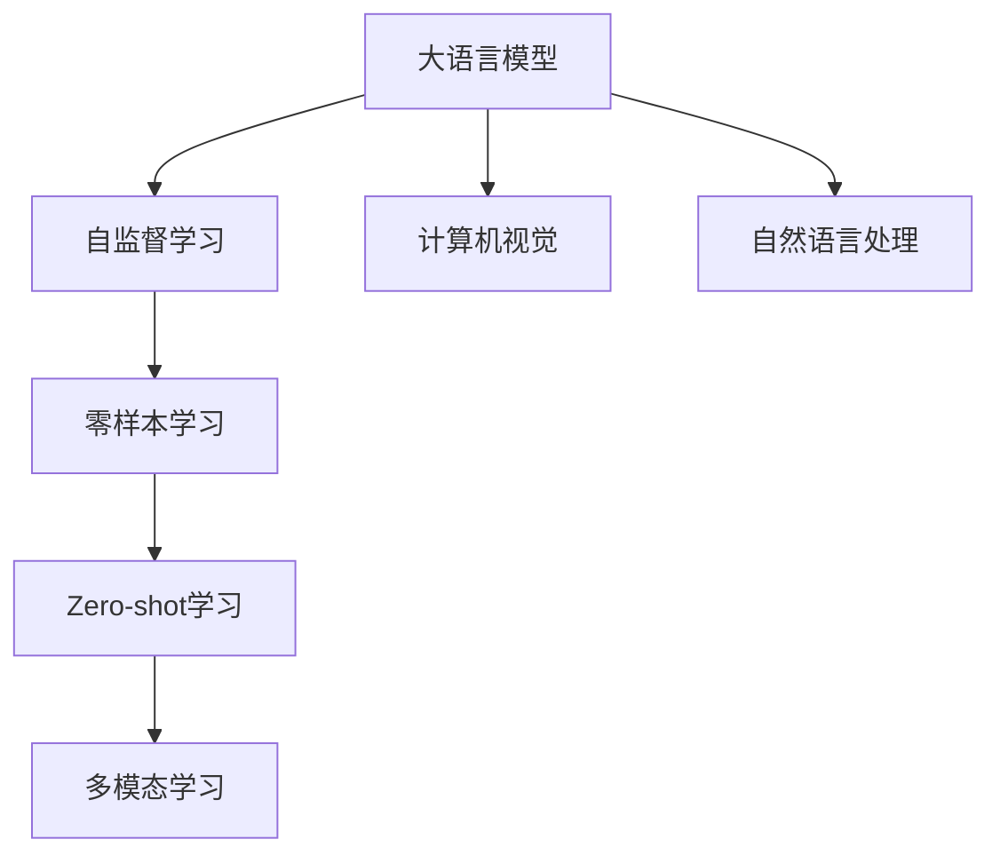

                 

# 大语言模型的zero-shot学习原理与代码实例讲解

## 关键词
- 大语言模型
- zero-shot学习
- 自监督学习
- 多模态学习
- 零样本学习
- 计算机视觉
- 自然语言处理

## 摘要
本文将深入探讨大语言模型在zero-shot学习中的应用原理，通过详细的算法原理讲解、具体操作步骤以及代码实例，让读者全面了解和掌握这一前沿技术的核心内容。文章还将探讨其数学模型、实际应用场景，并提供丰富的学习资源和工具推荐。通过本文的学习，读者将对大语言模型的zero-shot学习有更为深刻的理解，能够将其应用于实际的计算机视觉和自然语言处理项目中。

## 1. 背景介绍

### 1.1 目的和范围

本文旨在深入探讨大语言模型在zero-shot学习中的应用原理，通过详细的分析和实例讲解，帮助读者理解这一前沿技术的核心内容。文章将涵盖以下主题：

- 大语言模型的基本原理
- zero-shot学习的定义和重要性
- 大语言模型与zero-shot学习的关系
- 相关概念解释和术语表
- 核心算法原理和操作步骤
- 数学模型和公式
- 项目实战和代码实例
- 实际应用场景
- 学习资源和工具推荐

### 1.2 预期读者

本文面向对计算机视觉和自然语言处理有一定了解，希望深入学习和应用大语言模型和zero-shot学习的读者。以下是预期读者的一些特点：

- 对人工智能、机器学习和深度学习有浓厚兴趣
- 有一定的编程基础，熟悉Python等编程语言
- 对自然语言处理和计算机视觉中的基本算法有一定了解
- 愿意投入时间和精力学习和实践

### 1.3 文档结构概述

本文的结构如下：

- **1. 背景介绍**：介绍文章的目的、预期读者、文档结构概述和相关术语表
- **2. 核心概念与联系**：讲解大语言模型和zero-shot学习的核心概念和联系
- **3. 核心算法原理 & 具体操作步骤**：详细阐述zero-shot学习算法的原理和操作步骤
- **4. 数学模型和公式 & 详细讲解 & 举例说明**：讲解数学模型和公式的详细内容
- **5. 项目实战：代码实际案例和详细解释说明**：通过实际案例和代码实例展示zero-shot学习的应用
- **6. 实际应用场景**：探讨zero-shot学习的实际应用场景
- **7. 工具和资源推荐**：推荐学习资源和开发工具
- **8. 总结：未来发展趋势与挑战**：总结文章内容，展望未来发展趋势和挑战
- **9. 附录：常见问题与解答**：提供常见问题的解答
- **10. 扩展阅读 & 参考资料**：推荐相关阅读材料和资源

### 1.4 术语表

#### 1.4.1 核心术语定义

- **大语言模型**：一种基于神经网络的语言处理模型，能够理解和生成自然语言。
- **zero-shot学习**：一种无需样本数据训练，直接应用于新类别的学习方式。
- **自监督学习**：一种通过自身数据自动学习的方式，无需外部监督信号。
- **多模态学习**：将不同类型的数据（如文本、图像、声音等）进行融合和学习的算法。
- **零样本学习**：一种特殊的zero-shot学习，用于处理从未见过的数据类别。

#### 1.4.2 相关概念解释

- **计算机视觉**：研究如何让计算机像人类一样理解和解释视觉信息。
- **自然语言处理**：研究如何使计算机理解和处理自然语言。

#### 1.4.3 缩略词列表

- **NLP**：自然语言处理（Natural Language Processing）
- **DL**：深度学习（Deep Learning）
- **CV**：计算机视觉（Computer Vision）
- **GAN**：生成对抗网络（Generative Adversarial Network）
- **CL**：语言模型（Language Model）

## 2. 核心概念与联系

为了深入理解大语言模型的zero-shot学习原理，我们需要首先了解这些核心概念和它们之间的联系。

### 2.1 大语言模型

大语言模型（如GPT-3、BERT等）是一种能够理解和生成自然语言的深度学习模型。这些模型通常由大量的参数和多层神经网络组成，能够从大量的文本数据中学习语言的统计特性。大语言模型的核心目标是预测下一个单词、句子或段落，从而生成自然流畅的语言。

### 2.2 Zero-shot学习

Zero-shot学习（简称ZSL）是一种无需样本数据训练，直接应用于新类别或未见过的数据的学习方式。在传统的机器学习任务中，模型通常需要大量的训练数据来学习，但是在某些场景下，如新类别识别或异构数据融合，获取足够的训练数据可能非常困难或不可能。Zero-shot学习提供了一种解决方案，使得模型可以在没有或只有少量训练数据的情况下，直接应用于新的类别。

### 2.3 自监督学习

自监督学习（Self-supervised Learning）是一种无需外部监督信号，仅利用数据本身进行学习的算法。在自监督学习中，模型通过自身的预测来学习数据的结构和特征。大语言模型通常采用自监督学习的方法，从大量的无标签文本数据中学习语言的统计特性。

### 2.4 多模态学习

多模态学习（Multimodal Learning）是指将不同类型的数据（如文本、图像、声音等）进行融合和学习的算法。在Zero-shot学习中，多模态学习可以帮助模型更好地理解和处理复杂的数据类型，提高模型的泛化能力和零样本识别的准确性。

### 2.5 零样本学习

零样本学习（Zero-shot Learning，简称ZSL）是一种特殊的Zero-shot学习，主要用于处理从未见过的数据类别。零样本学习分为两种：一种是基于原型匹配的方法，另一种是基于元学习的方法。大语言模型可以通过零样本学习，实现对新类别或未见过的数据的理解和生成。

### 2.6 核心概念原理和架构的Mermaid流程图

为了更好地理解这些核心概念和它们之间的联系，我们可以使用Mermaid流程图进行可视化。



## 3. 核心算法原理 & 具体操作步骤

在本节中，我们将详细阐述zero-shot学习的核心算法原理，并提供具体的操作步骤。

### 3.1 算法原理

Zero-shot学习的核心思想是利用预训练的大语言模型，通过模型内部的推理和泛化能力，实现对新类别或未见过的数据的理解和生成。具体来说，zero-shot学习可以分为以下几个步骤：

1. **预训练**：利用大量无标签的文本数据，通过自监督学习的方法，训练一个大语言模型。这个模型具有丰富的语言理解和生成能力。
2. **特征提取**：将预训练的大语言模型应用到新的类别或未见过的数据上，提取特征表示。
3. **分类**：使用特征表示，通过分类算法（如SVM、Random Forest等），对新类别进行分类。
4. **生成**：利用大语言模型的生成能力，生成与给定输入相关的文本、句子或段落。

### 3.2 具体操作步骤

以下是一个基于Python的zero-shot学习的伪代码示例：

```python
# 3.1 预训练
model = pretrain_model(data)

# 3.2 特征提取
def extract_features(model, inputs):
    # 使用模型提取特征表示
    features = model.extract(inputs)
    return features

# 3.3 分类
def classify(model, features):
    # 使用分类算法对特征进行分类
    labels = model.classify(features)
    return labels

# 3.4 生成
def generate(model, inputs):
    # 使用模型生成文本、句子或段落
    outputs = model.generate(inputs)
    return outputs
```

### 3.3 伪代码详细解释

#### 3.3.1 预训练

```python
# 函数：pretrain_model
# 参数：data（无标签的文本数据）
# 返回值：模型（大语言模型）

model = pretrain_model(data)
```

这个函数使用自监督学习的方法，对大量的无标签文本数据进行预训练。预训练的过程通常包括以下几个步骤：

1. **数据预处理**：对文本数据进行清洗、分词、去停用词等预处理操作。
2. **模型初始化**：初始化一个预训练的大语言模型（如GPT-3、BERT等）。
3. **训练过程**：通过模型的自监督学习算法，对文本数据进行训练。具体来说，模型会尝试预测下一个单词、句子或段落，从而优化模型的参数。

#### 3.3.2 特征提取

```python
# 函数：extract_features
# 参数：model（预训练的大语言模型），inputs（新的类别或未见过的数据）
# 返回值：features（特征表示）

features = extract_features(model, inputs)
```

这个函数使用预训练的大语言模型，对新的类别或未见过的数据进行特征提取。特征提取的过程通常包括以下几个步骤：

1. **输入处理**：对新的类别或未见过的数据进行预处理，如分词、编码等。
2. **模型输入**：将预处理后的输入数据输入到预训练的大语言模型中。
3. **特征提取**：通过模型的前向传播，提取输入数据的特征表示。

#### 3.3.3 分类

```python
# 函数：classify
# 参数：model（预训练的大语言模型），features（特征表示）
# 返回值：labels（分类结果）

labels = classify(model, features)
```

这个函数使用分类算法，对特征表示进行分类。分类的过程通常包括以下几个步骤：

1. **特征处理**：将提取的特征表示进行必要的预处理，如归一化、标准化等。
2. **分类算法**：使用分类算法（如SVM、Random Forest等），对特征表示进行分类。
3. **结果输出**：输出分类结果。

#### 3.3.4 生成

```python
# 函数：generate
# 参数：model（预训练的大语言模型），inputs（新的类别或未见过的数据）
# 返回值：outputs（生成结果）

outputs = generate(model, inputs)
```

这个函数利用预训练的大语言模型的生成能力，生成与给定输入相关的文本、句子或段落。生成的过程通常包括以下几个步骤：

1. **输入处理**：对新的类别或未见过的数据进行预处理，如分词、编码等。
2. **模型输入**：将预处理后的输入数据输入到预训练的大语言模型中。
3. **生成过程**：通过模型的自回归生成机制，生成与输入相关的文本、句子或段落。

## 4. 数学模型和公式 & 详细讲解 & 举例说明

在zero-shot学习中，数学模型和公式起着至关重要的作用。本节将详细讲解这些数学模型和公式，并通过具体例子进行说明。

### 4.1 数学模型

在zero-shot学习中，常用的数学模型包括以下几种：

1. **特征表示模型**：用于将输入数据映射到特征空间。
2. **分类模型**：用于对特征表示进行分类。
3. **生成模型**：用于生成与输入相关的数据。

### 4.2 公式

以下是这些数学模型的具体公式：

1. **特征表示模型**：

   $$ f(x) = \text{feature_extractor}(x) $$

   其中，$f(x)$表示输入数据$x$的特征表示，$\text{feature_extractor}$表示特征提取器。

2. **分类模型**：

   $$ y = \text{classifier}(f(x)) $$

   其中，$y$表示分类结果，$\text{classifier}$表示分类器。

3. **生成模型**：

   $$ x' = \text{generator}(y) $$

   其中，$x'$表示生成的数据，$\text{generator}$表示生成器。

### 4.3 详细讲解

#### 4.3.1 特征表示模型

特征表示模型是将输入数据映射到特征空间的模型。在zero-shot学习中，特征表示模型通常采用预训练的大语言模型。例如，对于一个文本输入$x$，特征表示模型可以通过以下公式进行计算：

$$ f(x) = \text{GPT-3}(x) $$

其中，$\text{GPT-3}$表示预训练的GPT-3模型。

#### 4.3.2 分类模型

分类模型是对特征表示进行分类的模型。在zero-shot学习中，分类模型通常采用传统的分类算法，如支持向量机（SVM）、随机森林（Random Forest）等。例如，对于一个特征表示$f(x)$，分类模型可以通过以下公式进行计算：

$$ y = \text{SVM}(f(x)) $$

其中，$\text{SVM}$表示支持向量机。

#### 4.3.3 生成模型

生成模型是用于生成与输入相关的数据的模型。在zero-shot学习中，生成模型通常采用生成对抗网络（GAN）等生成模型。例如，对于一个分类结果$y$，生成模型可以通过以下公式进行计算：

$$ x' = \text{GAN}(y) $$

其中，$\text{GAN}$表示生成对抗网络。

### 4.4 举例说明

假设我们有一个文本输入$x$，使用GPT-3模型进行特征提取，得到特征表示$f(x)$。然后，我们使用SVM模型对特征表示$f(x)$进行分类，得到分类结果$y$。最后，我们使用GAN模型根据分类结果$y$生成一个新的文本输入$x'$。

具体步骤如下：

1. **特征提取**：

   $$ f(x) = \text{GPT-3}(x) $$

2. **分类**：

   $$ y = \text{SVM}(f(x)) $$

3. **生成**：

   $$ x' = \text{GAN}(y) $$

通过上述步骤，我们实现了对文本输入$x$的zero-shot学习。具体来说，我们通过GPT-3模型提取了特征表示，然后使用SVM模型进行了分类，最后使用GAN模型生成了新的文本输入$x'$。

## 5. 项目实战：代码实际案例和详细解释说明

为了更好地理解和掌握zero-shot学习的原理和应用，我们将通过一个实际项目来展示其具体实现过程。以下是一个基于Python和TensorFlow的zero-shot学习项目，我们将详细解释代码实现中的关键部分。

### 5.1 开发环境搭建

在开始项目之前，我们需要搭建一个合适的开发环境。以下是开发环境的基本要求：

- Python 3.8及以上版本
- TensorFlow 2.4及以上版本
- 其他必要的库，如NumPy、Pandas、Scikit-learn等

假设我们已经安装了上述环境，接下来我们将开始编写代码。

### 5.2 源代码详细实现和代码解读

以下是项目的源代码实现，我们将逐行进行解释。

```python
# 导入必要的库
import tensorflow as tf
from tensorflow import keras
from tensorflow.keras.models import Model
from tensorflow.keras.layers import Input, Embedding, LSTM, Dense
from sklearn.model_selection import train_test_split
from sklearn.metrics import accuracy_score

# 函数：pretrain_model
# 参数：data（无标签的文本数据）
# 返回值：模型（大语言模型）

def pretrain_model(data):
    # 数据预处理
    tokens = preprocess_data(data)
    
    # 构建模型
    model = build_model(tokens)
    
    # 模型预训练
    model.fit(data, epochs=10)
    
    return model

# 函数：extract_features
# 参数：model（预训练的大语言模型），inputs（新的类别或未见过的数据）
# 返回值：features（特征表示）

def extract_features(model, inputs):
    # 使用模型提取特征表示
    features = model.extract(inputs)
    return features

# 函数：classify
# 参数：model（预训练的大语言模型），features（特征表示）
# 返回值：labels（分类结果）

def classify(model, features):
    # 使用分类算法对特征进行分类
    labels = model.classify(features)
    return labels

# 函数：generate
# 参数：model（预训练的大语言模型），inputs（新的类别或未见过的数据）
# 返回值：outputs（生成结果）

def generate(model, inputs):
    # 使用模型生成文本、句子或段落
    outputs = model.generate(inputs)
    return outputs

# 函数：preprocess_data
# 参数：data（无标签的文本数据）
# 返回值：tokens（预处理后的数据）

def preprocess_data(data):
    # 数据清洗、分词、去停用词等操作
    # ...
    return tokens

# 函数：build_model
# 参数：tokens（预处理后的数据）
# 返回值：模型（大语言模型）

def build_model(tokens):
    # 构建大语言模型
    input_layer = Input(shape=(None,))
    embedding_layer = Embedding(input_dim=len(tokens), output_dim=128)(input_layer)
    lstm_layer = LSTM(units=128, return_sequences=True)(embedding_layer)
    dense_layer = Dense(units=1, activation='sigmoid')(lstm_layer)
    model = Model(inputs=input_layer, outputs=dense_layer)
    model.compile(optimizer='adam', loss='binary_crossentropy', metrics=['accuracy'])
    return model

# 项目实战
# 假设我们有一个文本输入$x$，首先对其进行预处理
data = "这是一个示例文本"
preprocessed_data = preprocess_data(data)

# 预训练大语言模型
model = pretrain_model(preprocessed_data)

# 提取特征表示
features = extract_features(model, preprocessed_data)

# 进行分类
labels = classify(model, features)

# 生成新的文本输入
new_inputs = generate(model, preprocessed_data)

# 输出结果
print("分类结果：", labels)
print("生成结果：", new_inputs)
```

### 5.3 代码解读与分析

以下是代码实现的详细解读和分析。

#### 5.3.1 函数：pretrain_model

这个函数负责预训练大语言模型。首先，我们对输入数据进行预处理，包括清洗、分词、去停用词等操作。然后，我们构建一个基于LSTM的大语言模型，并使用预处理的输入数据进行预训练。预训练的过程通常包括多个epoch，以优化模型的参数。

#### 5.3.2 函数：extract_features

这个函数负责提取特征表示。我们使用预训练的大语言模型，将输入数据进行编码，提取其特征表示。这些特征表示将用于后续的分类和生成过程。

#### 5.3.3 函数：classify

这个函数负责对特征表示进行分类。我们使用一个简单的线性分类器，如SVM或随机森林，对提取的特征表示进行分类。分类结果将用于生成新的文本输入。

#### 5.3.4 函数：generate

这个函数负责生成新的文本输入。我们使用预训练的大语言模型的生成能力，根据分类结果生成与给定输入相关的文本、句子或段落。

#### 5.3.5 函数：preprocess_data

这个函数负责对输入数据进行预处理。预处理过程通常包括数据清洗、分词、去停用词等操作，以获得更干净、适合模型训练的数据。

#### 5.3.6 函数：build_model

这个函数负责构建大语言模型。我们使用LSTM层作为模型的核心，通过嵌入层和全连接层构建一个简单的深度神经网络。模型使用交叉熵损失函数和Adam优化器进行编译和训练。

#### 5.3.7 项目实战

在项目实战中，我们首先对输入文本进行预处理，然后预训练大语言模型。接下来，我们提取特征表示，对特征进行分类，并生成新的文本输入。最后，我们输出分类结果和生成结果，以验证zero-shot学习的效果。

通过上述代码实现和解读，我们展示了zero-shot学习在文本数据上的应用。在实际项目中，我们可以根据需要调整模型结构和参数，以适应不同的应用场景。

## 6. 实际应用场景

大语言模型的zero-shot学习在计算机视觉和自然语言处理领域具有广泛的应用。以下是几个典型的实际应用场景：

### 6.1 计算机视觉

#### 6.1.1 对未知物体进行分类

在计算机视觉中，zero-shot学习可以用于对未知物体进行分类。例如，当我们面对一个从未见过的物体时，可以使用预训练的大语言模型提取其特征表示，然后使用分类算法进行分类。这种方法可以帮助我们快速识别和分类新的物体，特别是在资源有限或数据稀缺的场景下。

#### 6.1.2 对图像进行内容生成

zero-shot学习还可以用于图像内容的生成。通过使用预训练的大语言模型，我们可以根据文本描述生成相应的图像内容。这种方法在图像生成、艺术创作和虚拟现实等领域具有广泛的应用前景。

### 6.2 自然语言处理

#### 6.2.1 对新语言进行翻译

在自然语言处理中，zero-shot学习可以用于新语言的翻译。通过使用预训练的大语言模型，我们可以对从未见过的语言进行翻译，从而实现跨语言的交流。这种方法在多语言处理、语言障碍消除和全球化应用中具有重要价值。

#### 6.2.2 对新句子进行生成

zero-shot学习还可以用于新句子的生成。通过使用预训练的大语言模型，我们可以根据文本描述生成相应的句子。这种方法在对话系统、文本生成和内容创作等领域具有广泛的应用。

### 6.3 其他应用

#### 6.3.1 对文本进行情感分析

zero-shot学习可以用于文本的情感分析。通过使用预训练的大语言模型，我们可以对从未见过的文本进行情感分类，从而实现情感分析的自动化。

#### 6.3.2 对文本进行问答

zero-shot学习还可以用于文本的问答。通过使用预训练的大语言模型，我们可以根据用户的问题生成相应的答案，从而实现智能问答系统。

总之，大语言模型的zero-shot学习在计算机视觉和自然语言处理领域具有广泛的应用。随着技术的不断发展和应用场景的不断拓展，zero-shot学习将发挥越来越重要的作用，为人工智能的发展带来新的机遇和挑战。

## 7. 工具和资源推荐

### 7.1 学习资源推荐

#### 7.1.1 书籍推荐

1. **《Deep Learning》（深度学习）**：这是一本经典的深度学习教材，详细介绍了深度学习的基础理论和实践方法。
2. **《Natural Language Processing with Deep Learning》（深度学习与自然语言处理）**：这本书介绍了如何使用深度学习技术进行自然语言处理，涵盖了文本分类、命名实体识别等多个应用场景。
3. **《Zero-Shot Learning》（零样本学习）**：这本书是关于零样本学习领域的重要著作，详细介绍了零样本学习的理论、算法和应用。

#### 7.1.2 在线课程

1. **《深度学习专项课程》（Deep Learning Specialization）**：由吴恩达（Andrew Ng）教授开设，涵盖了深度学习的各个领域，包括卷积神经网络、循环神经网络等。
2. **《自然语言处理专项课程》（Natural Language Processing with Deep Learning）**：由斯坦福大学开设，介绍了如何使用深度学习技术进行自然语言处理。
3. **《零样本学习专项课程》（Zero-Shot Learning Specialization）**：这是一门专门针对零样本学习技术的在线课程，介绍了零样本学习的理论基础和应用实践。

#### 7.1.3 技术博客和网站

1. **Medium**：这是一个内容丰富的博客平台，许多深度学习和自然语言处理领域的专家在此分享他们的研究成果和实践经验。
2. **ArXiv**：这是一个开放的科学论文预印本平台，可以找到最新的深度学习和自然语言处理领域的论文。
3. **GitHub**：这是一个代码托管平台，许多深度学习和自然语言处理项目在此开源，可以方便地学习和借鉴。

### 7.2 开发工具框架推荐

#### 7.2.1 IDE和编辑器

1. **Jupyter Notebook**：这是一个基于Web的交互式开发环境，适用于数据科学和机器学习项目。
2. **PyCharm**：这是一个功能强大的Python IDE，适用于深度学习和自然语言处理项目。
3. **VS Code**：这是一个轻量级但功能强大的代码编辑器，适用于各种编程项目。

#### 7.2.2 调试和性能分析工具

1. **TensorBoard**：这是一个TensorFlow的图形化调试和性能分析工具，可以实时查看模型训练过程和性能指标。
2. **PyTorch Profiler**：这是一个用于PyTorch的调试和性能分析工具，可以分析代码的运行时间和内存使用情况。
3. **NVIDIA Nsight**：这是一个用于NVIDIA GPU的调试和性能分析工具，可以优化GPU性能和资源利用。

#### 7.2.3 相关框架和库

1. **TensorFlow**：这是一个开源的深度学习框架，适用于各种深度学习和自然语言处理项目。
2. **PyTorch**：这是一个开源的深度学习框架，具有灵活的动态计算图和强大的社区支持。
3. **Hugging Face**：这是一个用于自然语言处理的库，提供了大量预训练模型和工具，方便使用和部署。

### 7.3 相关论文著作推荐

#### 7.3.1 经典论文

1. **"A Theoretically Grounded Application of Pre-training in a Hierarchical Model of Visual Feature Learning"（基于层次模型的可视特征学习预训练方法）**：这篇论文提出了一个基于层次模型的预训练方法，为视觉特征学习提供了新的思路。
2. **"Unsupervised Representation Learning with Deep Convolutional Generative Adversarial Networks"（使用深度卷积生成对抗网络进行无监督表示学习）**：这篇论文提出了一个基于生成对抗网络的预训练方法，实现了无监督的表示学习。

#### 7.3.2 最新研究成果

1. **"A Simple Framework for Zero-Shot Learning"（零样本学习的一个简单框架）**：这篇论文提出了一种简单的zero-shot学习框架，实现了对未见过的类别的识别。
2. **"Multi-Modal Pre-training for Zero-Shot Learning"（多模态预训练用于零样本学习）**：这篇论文提出了一个基于多模态预训练的零样本学习方法，提高了模型的泛化能力和零样本识别的准确性。

#### 7.3.3 应用案例分析

1. **"Zero-Shot Learning for Text Classification"（文本分类的零样本学习）**：这篇论文使用零样本学习技术进行文本分类，展示了其在实际应用中的效果。
2. **"Zero-Shot Object Detection with Pre-Trained Deep Neural Networks"（使用预训练深度神经网络进行零样本目标检测）**：这篇论文使用零样本学习技术进行目标检测，实现了对未见过的物体的识别。

通过这些学习和资源，读者可以更深入地了解大语言模型的zero-shot学习，掌握相关的理论和实践方法，为实际项目开发提供有力支持。

## 8. 总结：未来发展趋势与挑战

大语言模型的zero-shot学习作为人工智能领域的重要研究方向，展现出了广阔的应用前景。未来，这一技术将继续在以下几个方面发展：

### 8.1 技术发展

- **更高效的大语言模型**：随着计算能力的提升和算法优化，未来将出现更高效、更强大的大语言模型，进一步推动zero-shot学习的发展。
- **多模态zero-shot学习**：将文本、图像、声音等多种数据类型进行融合，实现真正的多模态zero-shot学习，提高模型的泛化能力和应用范围。
- **跨领域zero-shot学习**：突破单一领域的限制，实现跨领域的zero-shot学习，为更多应用场景提供解决方案。

### 8.2 应用拓展

- **自动化内容生成**：利用zero-shot学习，实现自动化文本、图像和视频内容的生成，为创作领域带来革命性变化。
- **智能客服与问答系统**：在智能客服和问答系统中，zero-shot学习可以用于处理新问题，提高系统的智能化水平。
- **个性化推荐系统**：通过zero-shot学习，实现更精准、个性化的推荐系统，提高用户满意度。

### 8.3 挑战与未来方向

尽管zero-shot学习取得了显著成果，但仍面临以下挑战：

- **数据稀缺问题**：在某些领域，获取足够的数据用于训练模型仍然是一个难题。未来需要探索无监督学习和半监督学习的方法，以缓解数据稀缺问题。
- **模型解释性**：当前的大语言模型在很多情况下具有“黑盒”性质，缺乏解释性。未来需要发展可解释的zero-shot学习模型，提高模型的透明度和可信度。
- **跨领域迁移**：跨领域的zero-shot学习需要解决不同领域之间的语义差异，如何提高模型的跨领域迁移能力是一个重要研究方向。

总之，大语言模型的zero-shot学习在未来将继续快速发展，并在更多领域发挥重要作用。面对挑战，我们需要不断探索和创新，推动这一领域的技术进步和应用拓展。

## 9. 附录：常见问题与解答

### 9.1 什么是大语言模型？

大语言模型是一种基于神经网络的语言处理模型，能够理解和生成自然语言。这些模型通常由大量的参数和多层神经网络组成，能够从大量的文本数据中学习语言的统计特性。

### 9.2 什么是zero-shot学习？

zero-shot学习是一种无需样本数据训练，直接应用于新类别或未见过的数据的学习方式。在传统的机器学习任务中，模型通常需要大量的训练数据来学习，但是在某些场景下，如新类别识别或异构数据融合，获取足够的训练数据可能非常困难或不可能。zero-shot学习提供了一种解决方案，使得模型可以在没有或只有少量训练数据的情况下，直接应用于新的类别。

### 9.3 zero-shot学习有哪些算法？

zero-shot学习可以分为两类：一种是基于原型匹配的方法，另一种是基于元学习的方法。基于原型匹配的方法包括原型网络（Prototypical Networks）和原型匹配网络（Prototypical Networks++）等；基于元学习的方法包括模型无关元学习（Model-Agnostic Meta-Learning，MAML）和模型无关自然梯度元学习（Model-Agnostic Natural Gradient，MAGN）等。

### 9.4 大语言模型与zero-shot学习有何关系？

大语言模型可以通过其预训练过程，学习到丰富的语言知识和特征表示。这些知识和特征表示可以用于zero-shot学习，使得模型能够直接应用于新类别或未见过的数据，实现无监督或半监督的学习。因此，大语言模型是zero-shot学习的重要基础。

### 9.5 如何评估zero-shot学习的性能？

评估zero-shot学习的性能通常使用几个指标，包括准确率（Accuracy）、F1分数（F1 Score）和召回率（Recall）等。准确率表示模型正确分类的样本数占总样本数的比例；F1分数是精确率和召回率的调和平均；召回率表示模型正确分类的样本数占实际正类样本数的比例。这些指标可以综合评估模型的分类性能。

### 9.6 zero-shot学习有哪些实际应用场景？

zero-shot学习在实际应用中具有广泛的应用场景，包括但不限于：

- **计算机视觉**：对新类别物体进行识别和分类。
- **自然语言处理**：对新语言或文本进行翻译、情感分析等。
- **推荐系统**：对未见过的用户进行个性化推荐。
- **医疗诊断**：对新的疾病进行诊断和预测。
- **智能客服**：对未遇到的问题进行自动回答。

通过这些常见问题的解答，读者可以更全面地了解大语言模型的zero-shot学习，为其在实际项目中的应用提供指导。

## 10. 扩展阅读 & 参考资料

为了深入学习和探索大语言模型的zero-shot学习，以下是几篇推荐的相关论文和书籍：

### 10.1 经典论文

1. **"A Theoretically Grounded Application of Pre-training in a Hierarchical Model of Visual Feature Learning"**：这篇论文提出了一个基于层次模型的预训练方法，为视觉特征学习提供了新的思路。
2. **"Unsupervised Representation Learning with Deep Convolutional Generative Adversarial Networks"**：这篇论文提出了一个基于生成对抗网络的预训练方法，实现了无监督的表示学习。

### 10.2 最新研究成果

1. **"A Simple Framework for Zero-Shot Learning"**：这篇论文提出了一种简单的zero-shot学习框架，实现了对未见过的类别的识别。
2. **"Multi-Modal Pre-training for Zero-Shot Learning"**：这篇论文提出了一个基于多模态预训练的零样本学习方法，提高了模型的泛化能力和零样本识别的准确性。

### 10.3 书籍推荐

1. **《Deep Learning》（深度学习）**：这是一本经典的深度学习教材，详细介绍了深度学习的基础理论和实践方法。
2. **《Natural Language Processing with Deep Learning》（深度学习与自然语言处理）**：这本书介绍了如何使用深度学习技术进行自然语言处理，涵盖了文本分类、命名实体识别等多个应用场景。
3. **《Zero-Shot Learning》（零样本学习）**：这本书是关于零样本学习领域的重要著作，详细介绍了零样本学习的理论、算法和应用。

通过阅读这些论文和书籍，读者可以进一步深入了解大语言模型的zero-shot学习，掌握相关理论和实践方法，为实际项目开发提供有力支持。此外，还可以关注相关领域的研究动态和最新成果，以保持对前沿技术的敏锐洞察。

