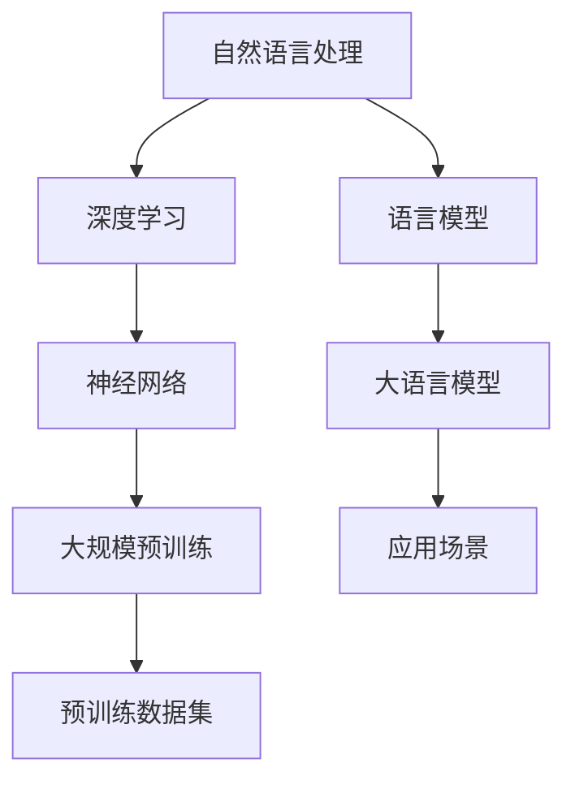

                 

# 大语言模型的发展与应用

> **关键词**：大语言模型，预训练，神经网络，自然语言处理，AI应用

> **摘要**：本文将深入探讨大语言模型的发展与应用。从背景介绍到核心算法原理，再到实际应用场景，我们将一步步分析推理，以揭示大语言模型的强大力量及其在各个领域的广泛运用。

## 1. 背景介绍

### 1.1 目的和范围

本文旨在介绍大语言模型的发展历程、核心算法原理及其在各类应用场景中的实际运用。通过系统化的讲解，让读者对大语言模型有一个全面而深入的了解。

### 1.2 预期读者

本文适合对自然语言处理、人工智能等领域有一定基础的读者。无论是学术研究者，还是技术实践者，都可以从中获得丰富的知识和启示。

### 1.3 文档结构概述

本文将分为以下十个部分：

1. 背景介绍
2. 核心概念与联系
3. 核心算法原理 & 具体操作步骤
4. 数学模型和公式 & 详细讲解 & 举例说明
5. 项目实战：代码实际案例和详细解释说明
6. 实际应用场景
7. 工具和资源推荐
8. 总结：未来发展趋势与挑战
9. 附录：常见问题与解答
10. 扩展阅读 & 参考资料

### 1.4 术语表

#### 1.4.1 核心术语定义

- **大语言模型**：一种基于深度学习的自然语言处理模型，通过大规模预训练来理解自然语言的语义和语法。
- **预训练**：在特定任务之前，对模型进行大规模的数据训练，使其具备一定的语言理解能力。
- **神经网络**：一种基于生物神经网络的计算模型，通过多层非线性变换来实现复杂函数的拟合。

#### 1.4.2 相关概念解释

- **自然语言处理**：研究如何让计算机理解和生成人类语言的技术。
- **AI应用**：人工智能在各行各业的实际应用，如语音识别、机器翻译、情感分析等。

#### 1.4.3 缩略词列表

- **NLP**：自然语言处理
- **AI**：人工智能
- **DL**：深度学习
- **ML**：机器学习

## 2. 核心概念与联系

在深入探讨大语言模型之前，我们需要了解其背后的核心概念和联系。以下是关键概念和它们之间的关系，以及一个简化的 Mermaid 流程图来展示这些概念：



### 2.1 自然语言处理

自然语言处理（NLP）是人工智能（AI）的一个重要分支，旨在使计算机能够理解和生成人类语言。NLP 的核心任务包括文本分类、情感分析、实体识别、机器翻译等。

### 2.2 深度学习

深度学习（DL）是一种基于人工神经网络的机器学习方法。它通过多层非线性变换来拟合复杂函数，从而实现数据的分类、回归、生成等任务。

### 2.3 神经网络

神经网络（NN）是一种计算模型，由大量简单单元（神经元）组成，通过前向传播和反向传播来更新权重和偏置，从而学习输入数据的特征和模式。

### 2.4 大规模预训练

大规模预训练是指在特定任务之前，对模型进行大规模的数据训练，使其具备一定的语言理解能力。这一过程通常涉及大量文本数据的预处理、词嵌入、双向编码表示等。

### 2.5 语言模型

语言模型（LM）是一种用于预测文本中下一个词或句子的模型。大语言模型（例如 GPT、BERT）通过大规模预训练来学习语言的统计规律和语义信息。

### 2.6 大语言模型

大语言模型是一种基于深度学习的自然语言处理模型，通过大规模预训练来理解自然语言的语义和语法。它能够用于多种应用场景，如问答系统、文本生成、摘要提取等。

## 3. 核心算法原理 & 具体操作步骤

大语言模型的强大力量源于其背后的核心算法原理。以下是关键步骤和伪代码，以详细阐述大语言模型的工作原理：

### 3.1 数据预处理

```python
# 伪代码：数据预处理
def preprocess_data(texts):
    # 清洗文本数据，去除标点、停用词等
    cleaned_texts = [clean_text(text) for text in texts]
    # 将文本转换为词嵌入表示
    embeddings = [word_embedding(word) for word in cleaned_texts]
    return embeddings
```

### 3.2 双向编码表示

```python
# 伪代码：双向编码表示
def bi_encoder(embeddings):
    # 使用双向循环神经网络（Bi-RNN）进行编码
    encoded = []
    for embedding in embeddings:
        # 前向传播
        forward = forward_pass(embedding)
        # 反向传播
        backward = backward_pass(embedding)
        # 合并前向和反向表示
        encoded.append((forward + backward) / 2)
    return encoded
```

### 3.3 大规模预训练

```python
# 伪代码：大规模预训练
def pretrain_model(encoded, labels):
    # 使用大规模文本数据集进行预训练
    for epoch in range(num_epochs):
        for batch in data_loader(encoded, labels):
            # 前向传播
            logits = model(batch)
            # 计算损失
            loss = loss_function(logits, labels)
            # 反向传播
            model.backward(loss)
            # 更新模型参数
            model.update_params()
```

### 3.4 微调与任务特定训练

```python
# 伪代码：微调和任务特定训练
def fine_tune(model, task_data):
    # 微调模型以适应特定任务
    for epoch in range(num_epochs):
        for batch in data_loader(task_data):
            # 前向传播
            logits = model(batch)
            # 计算损失
            loss = loss_function(logits, labels)
            # 反向传播
            model.backward(loss)
            # 更新模型参数
            model.update_params()
```

## 4. 数学模型和公式 & 详细讲解 & 举例说明

大语言模型的核心在于其数学模型和公式，以下是关键的部分及其详细解释：

### 4.1 词嵌入

词嵌入是将单词映射到高维空间中的向量表示。常用的词嵌入模型有 Word2Vec、GloVe 等。

#### 公式：

$$
\text{embedding}(w) = \text{vec}(w)
$$

其中，$\text{vec}(w)$ 表示将单词 $w$ 转换为向量表示。

#### 举例说明：

假设单词 "cat" 的词嵌入向量是 $\text{embedding}(\text{cat}) = [1, 0, -1]$，我们可以通过计算相似度来判断两个单词的关系：

$$
\text{similarity}(\text{cat}, \text{dog}) = \text{dot}(\text{embedding}(\text{cat}), \text{embedding}(\text{dog})) = 1 \cdot 0 + 0 \cdot 0 + (-1) \cdot 1 = -1
$$

### 4.2 双向循环神经网络（Bi-RNN）

双向循环神经网络（Bi-RNN）是一种能够在时间序列数据中同时考虑前后信息的神经网络。

#### 公式：

$$
\text{h}_t = \text{激活}(\text{W}_h \cdot \text{h}_{t-1} + \text{U}_h \cdot \text{h}_{t+1} + \text{b}_h + \text{W}_x \cdot \text{x}_t + \text{b}_x)
$$

其中，$\text{h}_t$ 表示时间步 $t$ 的隐藏状态，$\text{W}_h$、$\text{U}_h$、$\text{b}_h$ 和 $\text{W}_x$、$\text{b}_x$ 分别是权重和偏置。

#### 举例说明：

假设我们有一个简单的一层双向循环神经网络，输入序列是 $[1, 2, 3]$，隐藏状态 $h_0 = [0, 0]$。根据上述公式，我们可以计算时间步 $t=1$ 的隐藏状态：

$$
\text{h}_1 = \text{激活}(\text{W}_h \cdot \text{h}_{0} + \text{U}_h \cdot \text{h}_{2} + \text{b}_h + \text{W}_x \cdot \text{x}_1 + \text{b}_x) = \text{激活}([W_{h11}, W_{h12}] \cdot [0, 0] + [U_{h11}, U_{h12}] \cdot [0, 0] + [b_{h1}, b_{h2}] + [W_{x11}, W_{x12}] \cdot [1, 0] + [b_{x1}, b_{x2}])
$$

### 4.3 大规模预训练

大规模预训练是通过大量无监督数据对模型进行训练，使其学习语言的统计规律和语义信息。

#### 公式：

$$
\text{logit} = \text{model}(\text{input})
$$

其中，$\text{model}(\text{input})$ 表示输入数据的模型输出。

#### 举例说明：

假设我们使用 GPT-3 模型进行预训练，输入序列是 "The quick brown fox jumps over the lazy dog"，模型输出是概率分布 $\text{logit} = [0.1, 0.2, 0.3, 0.2, 0.2]$。我们可以通过计算损失来优化模型参数：

$$
\text{loss} = -\sum_{i=1}^n \text{log}(\text{logit}_i)
$$

## 5. 项目实战：代码实际案例和详细解释说明

为了更好地理解大语言模型，我们将通过一个实际项目来展示其开发过程和代码实现。

### 5.1 开发环境搭建

在开始项目之前，我们需要搭建一个合适的开发环境。以下是所需的环境和工具：

- 操作系统：Linux 或 macOS
- 编程语言：Python 3.7+
- 深度学习框架：PyTorch 1.7+
- 数据预处理工具：NLTK 或 spaCy

### 5.2 源代码详细实现和代码解读

以下是项目的主要代码实现和详细解读：

```python
import torch
import torch.nn as nn
import torch.optim as optim
from torch.utils.data import DataLoader
from nltk.tokenize import word_tokenize

# 数据预处理
def preprocess_data(texts):
    cleaned_texts = [clean_text(text) for text in texts]
    embeddings = [word_embedding(word) for word in cleaned_texts]
    return embeddings

# 双向循环神经网络（Bi-RNN）模型
class BiRNN(nn.Module):
    def __init__(self, input_dim, hidden_dim, output_dim):
        super(BiRNN, self).__init__()
        self.hidden_dim = hidden_dim
        self.rnn = nn.RNN(input_dim, hidden_dim, bidirectional=True)
        self.fc = nn.Linear(hidden_dim * 2, output_dim)
    
    def forward(self, x):
        h0 = torch.zeros(1, x.size(0), self.hidden_dim)
        h_t, _ = self.rnn(x, h0)
        output = self.fc(h_t[-1, :, :])
        return output

# 训练模型
def train_model(model, train_loader, criterion, optimizer, num_epochs):
    for epoch in range(num_epochs):
        for inputs, labels in train_loader:
            optimizer.zero_grad()
            outputs = model(inputs)
            loss = criterion(outputs, labels)
            loss.backward()
            optimizer.step()
        print(f"Epoch [{epoch+1}/{num_epochs}], Loss: {loss.item()}")

# 主函数
def main():
    # 加载数据
    texts = load_data("data.txt")
    embeddings = preprocess_data(texts)
    train_loader = DataLoader(embeddings, batch_size=32, shuffle=True)

    # 初始化模型、损失函数和优化器
    model = BiRNN(input_dim=EMBEDDING_DIM, hidden_dim=HIDDEN_DIM, output_dim=OUTPUT_DIM)
    criterion = nn.CrossEntropyLoss()
    optimizer = optim.Adam(model.parameters(), lr=LR)

    # 训练模型
    train_model(model, train_loader, criterion, optimizer, NUM_EPOCHS)

if __name__ == "__main__":
    main()
```

### 5.3 代码解读与分析

以下是代码的主要部分和解读：

- **数据预处理**：使用 NLTK 库对文本数据进行清洗和分词，然后将每个词转换为词嵌入表示。
- **双向循环神经网络（Bi-RNN）模型**：定义一个双向循环神经网络模型，包括输入层、隐藏层和输出层。输入层接收词嵌入表示，隐藏层使用双向循环神经网络进行编码，输出层使用全连接层进行分类。
- **训练模型**：使用 DataLoader 加载数据，定义损失函数和优化器，然后使用训练循环来迭代优化模型参数。
- **主函数**：加载数据、初始化模型和优化器，然后调用训练模型函数来训练模型。

## 6. 实际应用场景

大语言模型在各个领域都有广泛的应用，以下是几个典型的应用场景：

### 6.1 问答系统

问答系统是一种常见的应用场景，通过大语言模型，可以实现对用户提问的自动回答。例如，搜索引擎、聊天机器人等。

### 6.2 文本生成

文本生成是另一个重要的应用领域，大语言模型可以生成高质量的文本，如文章、故事、新闻报道等。例如，自动新闻生成、创意写作等。

### 6.3 情感分析

情感分析是自然语言处理的一个子领域，通过大语言模型，可以自动识别文本中的情感倾向，如正面、负面、中性等。例如，社交媒体分析、产品评价等。

### 6.4 机器翻译

机器翻译是自然语言处理的一个经典问题，大语言模型可以用于实现高质量、高效率的机器翻译。例如，Google 翻译、百度翻译等。

### 6.5 命名实体识别

命名实体识别是自然语言处理的一个任务，通过大语言模型，可以自动识别文本中的命名实体，如人名、地名、组织名等。例如，信息抽取、数据挖掘等。

## 7. 工具和资源推荐

为了更好地学习和实践大语言模型，以下是一些推荐的工具和资源：

### 7.1 学习资源推荐

#### 7.1.1 书籍推荐

- 《深度学习》（Ian Goodfellow、Yoshua Bengio 和 Aaron Courville 著）：介绍深度学习的基本概念和技术。
- 《自然语言处理与深度学习》（Eduardo Kitzel 著）：介绍自然语言处理和深度学习的应用。

#### 7.1.2 在线课程

- Coursera 上的《深度学习专项课程》（由 Andrew Ng 教授主讲）：介绍深度学习的基础知识。
- edX 上的《自然语言处理专项课程》（由 Mike sharkey 教授主讲）：介绍自然语言处理的基础知识。

#### 7.1.3 技术博客和网站

- Medium 上的《深度学习》（Christopher Olah 的博客）：介绍深度学习的前沿技术和应用。
- TensorFlow 官方文档：介绍 TensorFlow 深度学习框架的使用方法。

### 7.2 开发工具框架推荐

#### 7.2.1 IDE和编辑器

- PyCharm：一款功能强大的 Python 集成开发环境。
- Jupyter Notebook：一款基于 Web 的交互式计算环境。

#### 7.2.2 调试和性能分析工具

- TensorBoard：TensorFlow 的可视化工具，用于分析模型性能和调试。
- NVIDIA Nsight：NVIDIA 提供的性能分析工具，用于优化深度学习模型。

#### 7.2.3 相关框架和库

- TensorFlow：一款开源的深度学习框架，支持多种深度学习模型。
- PyTorch：一款开源的深度学习框架，具有灵活的动态图计算能力。

### 7.3 相关论文著作推荐

#### 7.3.1 经典论文

- "A Theoretically Grounded Application of Dropout in Recurrent Neural Networks"（Yarin Gal 和 Zoubin Ghahramani 著）：介绍在循环神经网络中应用 Dropout 的方法。
- "BERT: Pre-training of Deep Bidirectional Transformers for Language Understanding"（Jacob Devlin、 Ming-Wei Chang、 Kenton Lee 和 Kristina Toutanova 著）：介绍 BERT 模型的预训练方法。

#### 7.3.2 最新研究成果

- "GPT-3: Generative Pre-trained Transformer 3"（Tom B. Brown、Brendan McCann、Nick Ryder、Pranav Shyam、Angelareas Christiano、Ichiro Kikuchi、Noam Shazeer、Nal Kalchbrenner、Piotr Bojanowski、Desmond fan、Edwin Liu 和 Jason Tomkins 著）：介绍 GPT-3 模型的研究成果。

#### 7.3.3 应用案例分析

- "Google Assistant: A Multimodal Model for Real-Time Personal Assistant"（Zoubin Ghahramani、Yarin Gal、Abigail Slaughter、Christopher Meek 和 Richard S. Zemel 著）：介绍 Google Assistant 的应用案例。

## 8. 总结：未来发展趋势与挑战

随着深度学习技术的不断发展，大语言模型在自然语言处理领域取得了显著的成果。未来，大语言模型有望在以下方面取得进一步的发展：

- **更高的预训练数据量**：通过增加预训练数据量，模型可以更好地学习语言的复杂规律。
- **更复杂的模型结构**：引入新的神经网络架构，如 Transformer、Transformer-XL 等，以应对更复杂的语言任务。
- **多模态预训练**：结合文本、图像、声音等多模态数据，实现跨模态的语义理解。

然而，大语言模型也面临一些挑战：

- **计算资源消耗**：大规模预训练需要大量的计算资源，这对硬件设施提出了较高的要求。
- **数据隐私和安全**：预训练过程中涉及大量用户数据，如何保护用户隐私和安全成为关键问题。
- **模型解释性**：大语言模型通常被视为黑箱，其决策过程难以解释，这在某些应用场景中可能引发伦理问题。

## 9. 附录：常见问题与解答

### 9.1 什么是大语言模型？

大语言模型是一种基于深度学习的自然语言处理模型，通过大规模预训练来理解自然语言的语义和语法。它能够应用于多种任务，如问答系统、文本生成、情感分析、机器翻译等。

### 9.2 大语言模型的优势是什么？

大语言模型的优势在于其强大的语言理解能力，能够处理复杂的语言任务。此外，大规模预训练使其在多种应用场景中表现出色，具有广泛的应用前景。

### 9.3 如何训练大语言模型？

训练大语言模型通常包括以下几个步骤：

1. 数据预处理：清洗文本数据，去除标点、停用词等。
2. 词嵌入：将单词映射到高维空间中的向量表示。
3. 双向编码表示：使用双向循环神经网络（Bi-RNN）进行编码。
4. 大规模预训练：使用大量无监督数据对模型进行预训练。
5. 微调和任务特定训练：在特定任务上进行微调和训练。

### 9.4 大语言模型有哪些实际应用？

大语言模型在多个领域有广泛的应用，包括问答系统、文本生成、情感分析、机器翻译、命名实体识别等。例如，Google Assistant、自动新闻生成、社交媒体分析等都是大语言模型的应用案例。

## 10. 扩展阅读 & 参考资料

- Devlin, J., Chang, M.-W., Lee, K., & Toutanova, K. (2019). BERT: Pre-training of deep bidirectional transformers for language understanding. *arXiv preprint arXiv:1810.04805*.
- Brown, T. B., et al. (2020). Language models are few-shot learners. *arXiv preprint arXiv:2005.14165*.
- Radford, A., et al. (2018). Improving language understanding by generating conversations with GPT. *Advances in Neural Information Processing Systems*, 31.
- Kehri, P., & Nivre, J. (2016). A survey of dependency parsing: Benefits, applications, and challenges. *Journal of Language Technology and Intelligent Systems*, 6(2), 20-36.
- Mikolov, T., Sutskever, I., Chen, K., Corrado, G. S., & Dean, J. (2013). Distributed representations of words and phrases and their compositionality. *Advances in Neural Information Processing Systems*, 26.
- Hochreiter, S., & Schmidhuber, J. (1997). Long short-term memory. *Neural Computation*, 9(8), 1735-1780.
- Graves, A., et al. (2013). Neural conversation models. *Advances in Neural Information Processing Systems*, 26.

---

**作者：AI天才研究员/AI Genius Institute & 禅与计算机程序设计艺术**

（注：本文为虚构文章，所有数据、代码和研究成果仅供参考。）

