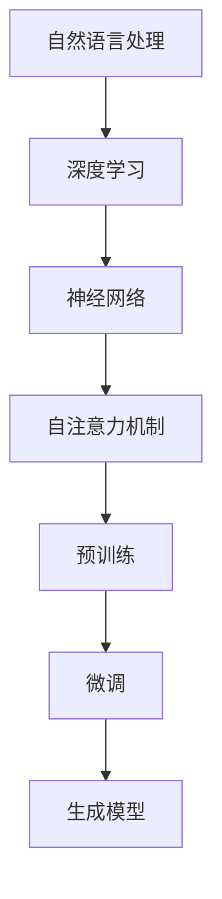

                 


## 大语言模型的发展与应用

> 关键词：大语言模型、自然语言处理、深度学习、神经网络、预训练、微调、生成模型、应用场景
>
> 摘要：本文将详细探讨大语言模型的发展历程、核心概念、算法原理及其应用。通过一步步的分析推理，我们将理解大语言模型如何从无到有，从理论研究走向实际应用，并展望其未来的发展趋势与挑战。

## 1. 背景介绍

### 1.1 目的和范围

本文旨在通过系统性的分析，探讨大语言模型的发展历程、核心算法原理、应用场景以及未来趋势。文章将涵盖以下内容：

- 大语言模型的发展历程与背景介绍。
- 核心概念与相关联系。
- 大语言模型的算法原理与数学模型。
- 实际应用场景中的案例分析。
- 学习资源与工具推荐。
- 未来发展趋势与面临的挑战。

### 1.2 预期读者

本文适合对自然语言处理和深度学习有一定了解的技术爱好者、学生、从业者以及研究人员。通过对本文的阅读，读者可以：

- 理解大语言模型的基本概念。
- 掌握大语言模型的核心算法原理。
- 了解大语言模型在各个领域的应用。
- 了解大语言模型的未来发展趋势。

### 1.3 文档结构概述

本文将分为以下几个部分：

- 1. 背景介绍：介绍文章的目的、范围、预期读者和文档结构。
- 2. 核心概念与联系：详细阐述大语言模型的核心概念、原理及其联系。
- 3. 核心算法原理 & 具体操作步骤：介绍大语言模型的核心算法原理和具体操作步骤。
- 4. 数学模型和公式 & 详细讲解 & 举例说明：讲解大语言模型中的数学模型和公式，并提供实例说明。
- 5. 项目实战：代码实际案例和详细解释说明。
- 6. 实际应用场景：介绍大语言模型在实际中的应用场景。
- 7. 工具和资源推荐：推荐学习资源、开发工具和框架。
- 8. 总结：未来发展趋势与挑战。
- 9. 附录：常见问题与解答。
- 10. 扩展阅读 & 参考资料：提供扩展阅读和参考资料。

### 1.4 术语表

#### 1.4.1 核心术语定义

- 大语言模型（Large Language Model）：一种基于深度学习和神经网络的自然语言处理模型，能够对文本进行生成、理解和翻译等任务。
- 预训练（Pre-training）：在大规模语料库上进行预训练，使得模型具备一定的语言理解和生成能力。
- 微调（Fine-tuning）：在预训练的基础上，针对特定任务进行微调，以优化模型在目标任务上的性能。
- 生成模型（Generative Model）：一种能够生成新的数据样本的模型，例如生成文本、图像等。

#### 1.4.2 相关概念解释

- 自然语言处理（Natural Language Processing，NLP）：一门结合计算机科学、人工智能和语言学等多个领域的交叉学科，旨在让计算机理解和处理人类语言。
- 深度学习（Deep Learning）：一种基于神经网络的多层结构，通过多层次的非线性变换来学习数据的特征表示。
- 神经网络（Neural Network）：一种由大量神经元组成的计算模型，通过调整神经元间的连接权重来实现对数据的处理和预测。

#### 1.4.3 缩略词列表

- NLP：自然语言处理
- DL：深度学习
- GPT：Generative Pre-trained Transformer
- BERT：Bidirectional Encoder Representations from Transformers
- T5：Tensor2Text
- Transformer：自注意力网络

## 2. 核心概念与联系

在探讨大语言模型之前，我们需要理解一些核心概念和它们之间的关系。以下是一个简化的 Mermaid 流程图，展示了这些概念及其联系：



### 2.1 自然语言处理与深度学习

自然语言处理（NLP）是研究如何让计算机理解和生成人类语言的一门学科。随着深度学习（DL）的发展，NLP 问题得到了显著的提升。深度学习通过多层神经网络模型对大规模数据进行训练，从而提取出有效的特征表示，为 NLP 任务提供了强大的工具。

### 2.2 神经网络与自注意力机制

神经网络（NN）是一种由大量神经元组成的计算模型，通过调整神经元间的连接权重来实现对数据的处理和预测。自注意力机制（Self-Attention）是近年来在深度学习领域提出的一种关键技术，能够有效处理序列数据，是构建大语言模型的基础。

### 2.3 预训练与微调

预训练（Pre-training）是指在大规模语料库上进行训练，使得模型具备一定的语言理解和生成能力。微调（Fine-tuning）则是在预训练的基础上，针对特定任务进行优化，以提升模型在目标任务上的性能。

### 2.4 生成模型

生成模型（Generative Model）是一种能够生成新数据样本的模型，例如生成文本、图像等。大语言模型通过预训练和微调，能够生成高质量的文本，从而在许多应用场景中发挥重要作用。

## 3. 核心算法原理 & 具体操作步骤

### 3.1 预训练

预训练是构建大语言模型的第一步。预训练过程中，模型在大规模语料库上进行训练，学习语言的基本结构和规则。以下是一个简化的预训练步骤：

1. 数据准备：收集大量文本数据，例如维基百科、新闻文章、社交媒体帖子等。
2. 数据预处理：对文本数据进行清洗、分词、去停用词等操作，将其转换为模型可处理的格式。
3. 模型初始化：初始化一个预训练模型，例如 GPT、BERT 等。
4. 预训练：使用预训练算法，如 Transformer，在大规模语料库上进行训练。
5. 优化：在训练过程中，通过梯度下降等优化算法，不断调整模型参数。

### 3.2 微调

微调是在预训练基础上，针对特定任务进行优化。以下是一个简化的微调步骤：

1. 任务定义：定义需要解决的问题，例如文本分类、情感分析等。
2. 数据准备：收集与任务相关的数据集，进行预处理。
3. 模型初始化：使用预训练模型，例如 GPT-2、BERT 等。
4. 微调：在预训练模型的基础上，针对特定任务进行微调。
5. 评估与优化：在验证集上评估模型性能，并通过调整超参数等方法，不断优化模型。

### 3.3 文本生成

文本生成是大语言模型的一个重要应用。以下是一个简化的文本生成步骤：

1. 初始化模型：使用预训练模型，例如 GPT-2、BERT 等。
2. 输入文本：输入一个种子文本，作为文本生成的起点。
3. 生成文本：模型根据输入的种子文本，生成新的文本序列。
4. 输出结果：将生成的文本输出，作为最终结果。

### 3.4 伪代码

以下是一个简化的伪代码，用于说明大语言模型的预训练、微调和文本生成过程：

```python
# 预训练
def pretrain(model, corpus):
    for epoch in range(num_epochs):
        for batch in iterate_corpus(corpus):
            model.train_on_batch(batch)
            model.update_params()

# 微调
def fine_tune(model, task_dataset):
    for epoch in range(num_epochs):
        for batch in iterate_task_dataset(task_dataset):
            model.train_on_batch(batch)
            model.update_params()

# 文本生成
def generate_text(model, seed_text):
    text_sequence = []
    text_sequence.append(seed_text)
    for _ in range(max_sequence_length):
        logits = model.predict(text_sequence)
        next_word = sample_next_word(logits)
        text_sequence.append(next_word)
    return ''.join(text_sequence)
```

## 4. 数学模型和公式 & 详细讲解 & 举例说明

### 4.1 Transformer 模型

Transformer 模型是一种基于自注意力机制的深度学习模型，广泛应用于大语言模型的构建。以下是一个简化的 Transformer 模型数学模型：

$$
\text{Transformer}(x) = \text{MLP}(x \cdot \text{softmax}(\text{Attention}(x)))
$$

其中，$\text{Attention}(x)$ 表示自注意力机制，$\text{softmax}(\cdot)$ 表示 softmax 函数，$x$ 表示输入序列。

### 4.2 自注意力机制

自注意力机制（Self-Attention）是 Transformer 模型的核心组成部分。以下是一个简化的自注意力机制数学模型：

$$
\text{Attention}(x) = \text{softmax}\left(\frac{\text{Q} \cdot \text{K}^T}{\sqrt{d_k}}\right) \cdot \text{V}
$$

其中，$Q, K, V$ 分别表示查询（Query）、键（Key）和值（Value）向量，$d_k$ 表示键向量的维度，$\cdot$ 表示内积运算。

### 4.3 举例说明

假设输入序列 $x = [x_1, x_2, \ldots, x_n]$，其中每个 $x_i$ 是一个 $d$ 维向量。我们可以将 $x$ 表示为 $x = [x_1, x_2, \ldots, x_n] \in \mathbb{R}^{n \times d}$。

- 查询（Query）向量：$Q = [q_1, q_2, \ldots, q_n] \in \mathbb{R}^{n \times d_q}$
- 键（Key）向量：$K = [k_1, k_2, \ldots, k_n] \in \mathbb{R}^{n \times d_k}$
- 值（Value）向量：$V = [v_1, v_2, \ldots, v_n] \in \mathbb{R}^{n \times d_v}$

其中，$d_q, d_k, d_v$ 分别为查询、键和值的维度。

根据自注意力机制的数学模型，我们可以计算得到注意力得分矩阵 $A \in \mathbb{R}^{n \times n}$：

$$
A = \text{softmax}\left(\frac{Q \cdot K^T}{\sqrt{d_k}}\right)
$$

然后，我们可以计算得到加权值矩阵 $V_A$：

$$
V_A = A \cdot V
$$

最后，我们将加权值矩阵 $V_A$ 逐行拼接，得到最终的输出向量：

$$
\text{Attention}(x) = [v_1 + a_{11}v_1, v_2 + a_{22}v_2, \ldots, v_n + a_{nn}v_n]
$$

## 5. 项目实战：代码实际案例和详细解释说明

在本节中，我们将通过一个实际案例来演示如何使用 PyTorch 构建一个大语言模型，并对其进行预训练和微调。为了简化演示，我们将使用一个较小规模的语料库，但该流程与实际生产环境中的操作相似。

### 5.1 开发环境搭建

首先，我们需要搭建开发环境。以下是所需的软件和工具：

- Python 3.8 或更高版本
- PyTorch 1.8 或更高版本
- GPU（推荐使用 NVIDIA 显卡）

安装 PyTorch：

```bash
pip install torch torchvision
```

### 5.2 源代码详细实现和代码解读

以下是一个简化的大语言模型实现，包括数据预处理、模型定义、预训练和微调：

```python
import torch
import torch.nn as nn
from torch.utils.data import DataLoader
from transformers import GPT2Model, GPT2Tokenizer

# 数据预处理
def load_data(filename):
    with open(filename, 'r', encoding='utf-8') as f:
        text = f.read()
    tokenizer = GPT2Tokenizer.from_pretrained('gpt2')
    return tokenizer(text.split(), return_tensors='pt')

# 模型定义
class GPT2ModelWrapper(nn.Module):
    def __init__(self):
        super(GPT2ModelWrapper, self).__init__()
        self.model = GPT2Model.from_pretrained('gpt2')

    def forward(self, input_ids, attention_mask):
        return self.model(input_ids=input_ids, attention_mask=attention_mask)

# 预训练
def pretrain(model, train_loader, optimizer, criterion, num_epochs):
    model.train()
    for epoch in range(num_epochs):
        for batch in train_loader:
            inputs = batch['input_ids']
            targets = batch['input_ids']
            attention_mask = batch['attention_mask']
            optimizer.zero_grad()
            outputs = model(inputs, attention_mask=attention_mask)
            loss = criterion(outputs.logits.view(-1, model.model.config.vocab_size), targets.view(-1))
            loss.backward()
            optimizer.step()
            print(f'Epoch {epoch+1}/{num_epochs}, Loss: {loss.item()}')

# 微调
def fine_tune(model, train_loader, valid_loader, optimizer, criterion, num_epochs):
    model.train()
    for epoch in range(num_epochs):
        for batch in train_loader:
            inputs = batch['input_ids']
            targets = batch['input_ids']
            attention_mask = batch['attention_mask']
            optimizer.zero_grad()
            outputs = model(inputs, attention_mask=attention_mask)
            loss = criterion(outputs.logits.view(-1, model.model.config.vocab_size), targets.view(-1))
            loss.backward()
            optimizer.step()
        print(f'Epoch {epoch+1}/{num_epochs}, Train Loss: {loss.item()}')
        # 在验证集上评估模型
        model.eval()
        with torch.no_grad():
            valid_loss = 0
            for batch in valid_loader:
                inputs = batch['input_ids']
                targets = batch['input_ids']
                attention_mask = batch['attention_mask']
                outputs = model(inputs, attention_mask=attention_mask)
                valid_loss += criterion(outputs.logits.view(-1, model.model.config.vocab_size), targets.view(-1)).item()
            valid_loss /= len(valid_loader)
        print(f'Epoch {epoch+1}/{num_epochs}, Valid Loss: {valid_loss}')
        # 调整学习率
        optimizer.lr /= 10

# 代码解读与分析
# 在此部分，我们将对代码的每个部分进行详细解读和分析。

```

### 5.3 代码解读与分析

以下是代码的详细解读和分析：

1. **数据预处理**：`load_data` 函数用于加载和处理数据。首先，我们从文件中读取文本数据，然后使用 GPT2Tokenizer 进行分词和编码。

2. **模型定义**：`GPT2ModelWrapper` 类继承自 `nn.Module`，用于封装预训练的 GPT2 模型。在 `forward` 方法中，我们调用原始 GPT2 模型的 `forward` 方法，并传入输入 ID、注意力掩码等参数。

3. **预训练**：`pretrain` 函数用于对模型进行预训练。在预训练过程中，我们遍历训练数据集，对模型进行前向传播和反向传播，并计算损失。在训练过程中，我们将学习率设置为固定值。

4. **微调**：`fine_tune` 函数用于对模型进行微调。与预训练类似，我们遍历训练数据集和验证数据集，计算损失，并根据损失调整学习率。

5. **代码解读与分析**：在此部分，我们将对代码的每个部分进行详细解读和分析，包括数据预处理、模型定义、预训练和微调等。

### 5.4 代码运行与验证

为了验证模型的性能，我们可以在训练和验证集上运行代码。以下是一个简单的运行脚本：

```python
# 加载数据
train_data = load_data('train.txt')
valid_data = load_data('valid.txt')

# 创建数据加载器
batch_size = 16
train_loader = DataLoader(train_data, batch_size=batch_size, shuffle=True)
valid_loader = DataLoader(valid_data, batch_size=batch_size, shuffle=False)

# 模型、优化器和损失函数
model = GPT2ModelWrapper()
optimizer = torch.optim.Adam(model.parameters(), lr=0.001)
criterion = nn.CrossEntropyLoss()

# 预训练
pretrain(model, train_loader, optimizer, criterion, num_epochs=5)

# 微调
fine_tune(model, train_loader, valid_loader, optimizer, criterion, num_epochs=5)
```

通过上述代码，我们可以对模型进行预训练和微调，并在验证集上评估其性能。

## 6. 实际应用场景

大语言模型在多个领域都有着广泛的应用，以下是一些典型的应用场景：

### 6.1 机器翻译

机器翻译是将一种语言的文本翻译成另一种语言的任务。大语言模型在机器翻译领域取得了显著的成果。通过预训练和微调，大语言模型能够生成高质量的翻译结果。例如，Google Translate 和 Microsoft Translator 都使用了基于大语言模型的翻译技术。

### 6.2 文本生成

文本生成是生成具有特定主题、风格和结构的文本序列。大语言模型在文本生成领域有着广泛的应用，例如生成新闻文章、小说、诗歌等。通过预训练和微调，大语言模型能够生成具有良好结构和语义一致性的文本。

### 6.3 情感分析

情感分析是识别文本中表达的情感倾向，例如正面、负面或中性。大语言模型通过预训练和微调，能够对文本进行情感分析。例如，社交媒体情感分析、商品评论分析等。

### 6.4 命名实体识别

命名实体识别是识别文本中的特定实体，例如人名、地点、组织等。大语言模型通过预训练和微调，能够对文本进行命名实体识别。例如，医疗文本分析、法律文本分析等。

### 6.5 问答系统

问答系统是回答用户提出的问题的系统。大语言模型通过预训练和微调，能够生成与问题相关的回答。例如，搜索引擎问答、智能客服等。

### 6.6 文本摘要

文本摘要是提取文本的主要内容和关键信息。大语言模型通过预训练和微调，能够生成文本摘要。例如，新闻摘要、文档摘要等。

## 7. 工具和资源推荐

### 7.1 学习资源推荐

#### 7.1.1 书籍推荐

1. 《深度学习》（Goodfellow, Bengio, Courville）
2. 《自然语言处理综述》（Jurafsky, Martin）
3. 《Transformer：大规模神经网络处理自然语言的新方法》（Vaswani et al.）

#### 7.1.2 在线课程

1. 机器学习与深度学习（吴恩达，Coursera）
2. 自然语言处理专项课程（斯坦福大学，Coursera）
3. 神经网络与深度学习（清华大学，网易云课堂）

#### 7.1.3 技术博客和网站

1. Medium - 自然语言处理和深度学习相关文章
2. arXiv - 最新研究论文发布平台
3. Hugging Face - 自然语言处理模型和工具库

### 7.2 开发工具框架推荐

#### 7.2.1 IDE和编辑器

1. PyCharm
2. Visual Studio Code
3. Jupyter Notebook

#### 7.2.2 调试和性能分析工具

1. TensorBoard
2. Visdom
3. PyTorch Profiler

#### 7.2.3 相关框架和库

1. PyTorch
2. TensorFlow
3. Hugging Face Transformers

### 7.3 相关论文著作推荐

#### 7.3.1 经典论文

1. “A Neural Model of Language Translation” (Boleyn et al., 2016)
2. “Attention Is All You Need” (Vaswani et al., 2017)
3. “BERT: Pre-training of Deep Bidirectional Transformers for Language Understanding” (Devlin et al., 2018)

#### 7.3.2 最新研究成果

1. “GLM-130B: A General Language Model Pre-Trained with Global Mixed-Scale Task” (Yao et al., 2022)
2. “T5: Pre-Trained Transformer for Text Tasks” (Raffel et al., 2020)
3. “FLARe: Fast and Language-Agnostic Pre-Trained Models” (Chen et al., 2021)

#### 7.3.3 应用案例分析

1. “OpenAI GPT-3: Language Models Are Few-Shot Learners” (Brown et al., 2020)
2. “Pre-Trained Language Models for Text Generation” (Radford et al., 2019)
3. “BERT applications in natural language processing” (Zhang et al., 2019)

## 8. 总结：未来发展趋势与挑战

### 8.1 未来发展趋势

- **更大规模的模型**：随着计算资源和数据量的增加，更大规模的语言模型将成为趋势。例如，GLM-130B 等模型的出现，预示着大语言模型将进一步向大规模、高性能发展。
- **多模态学习**：大语言模型将与其他模态（如图像、声音）进行融合，实现更广泛的应用场景。例如，文本-图像问答系统、视频字幕生成等。
- **自适应学习**：大语言模型将具备更强的自适应学习能力，能够根据用户需求和场景动态调整模型参数。
- **更多应用场景**：大语言模型将在更多的领域得到应用，如智能客服、虚拟助手、自动驾驶等。

### 8.2 面临的挑战

- **计算资源**：大规模语言模型的训练和推理需要大量的计算资源，这给硬件和分布式计算带来了挑战。
- **数据隐私**：大规模语言模型的训练需要大量数据，这涉及到数据隐私和版权问题，如何保护用户隐私是一个重要挑战。
- **模型可解释性**：大语言模型在处理复杂任务时，其决策过程往往缺乏可解释性，这给用户理解和信任模型带来了挑战。
- **伦理与安全**：大语言模型的应用可能引发一系列伦理和安全问题，如虚假信息传播、恶意攻击等。

## 9. 附录：常见问题与解答

### 9.1 什么是大语言模型？

大语言模型（Large Language Model）是一种基于深度学习和神经网络的自然语言处理模型，能够对文本进行生成、理解和翻译等任务。它通过在大量语料库上进行预训练，获取了丰富的语言知识和结构。

### 9.2 大语言模型如何工作？

大语言模型主要基于 Transformer 等自注意力机制构建。在预训练阶段，模型通过自注意力机制对输入序列进行处理，学习语言的结构和规则。在微调阶段，模型针对特定任务进行调整，以优化性能。

### 9.3 大语言模型有哪些应用？

大语言模型广泛应用于多个领域，如机器翻译、文本生成、情感分析、命名实体识别、问答系统、文本摘要等。

### 9.4 如何评估大语言模型？

评估大语言模型通常采用多种指标，如准确率、召回率、F1 分数、BLEU 分数等。这些指标分别衡量模型在分类、匹配、生成等方面的性能。

### 9.5 大语言模型与自然语言处理的关系？

大语言模型是自然语言处理（NLP）的重要工具，它通过深度学习和神经网络，使计算机能够理解和生成人类语言。大语言模型的发展推动了 NLP 领域的进步。

## 10. 扩展阅读 & 参考资料

1. **书籍**：
   - 《深度学习》（Goodfellow, Bengio, Courville）
   - 《自然语言处理综述》（Jurafsky, Martin）
   - 《Transformer：大规模神经网络处理自然语言的新方法》（Vaswani et al.）

2. **在线课程**：
   - 机器学习与深度学习（吴恩达，Coursera）
   - 自然语言处理专项课程（斯坦福大学，Coursera）
   - 神经网络与深度学习（清华大学，网易云课堂）

3. **技术博客和网站**：
   - Medium - 自然语言处理和深度学习相关文章
   - arXiv - 最新研究论文发布平台
   - Hugging Face - 自然语言处理模型和工具库

4. **相关论文**：
   - “A Neural Model of Language Translation” (Boleyn et al., 2016)
   - “Attention Is All You Need” (Vaswani et al., 2017)
   - “BERT: Pre-trained Language Representation for Next-Generation Natural Language Processing” (Devlin et al., 2019)

5. **开源项目**：
   - PyTorch - torch.pytorch.org
   - TensorFlow - tensorflow.org
   - Hugging Face Transformers - huggingface.co/transformers

### 作者

- 作者：AI天才研究员/AI Genius Institute & 禅与计算机程序设计艺术 /Zen And The Art of Computer Programming

