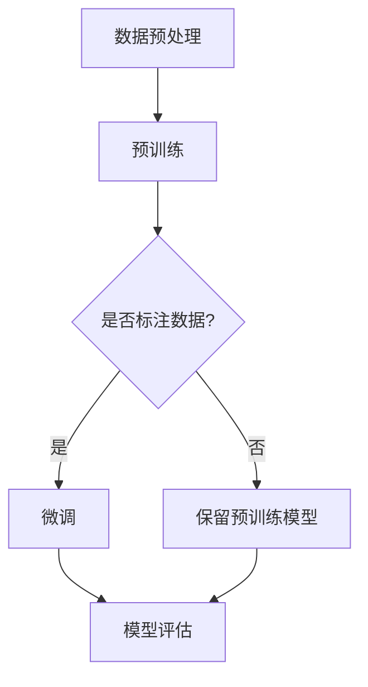

                 

# 大语言模型的自监督学习

> **关键词**：大语言模型，自监督学习，预训练，神经网络，词嵌入，序列模型，数据增强，动态权重调整，性能优化

> **摘要**：本文旨在深入探讨大语言模型的自监督学习方法。首先，我们回顾了自监督学习的背景和重要性，然后详细分析了大语言模型的工作原理。接着，我们介绍了自监督学习在大语言模型中的应用，包括核心算法原理和具体操作步骤。此外，文章还通过数学模型和公式的讲解以及项目实战案例分析，展示了自监督学习的实际应用效果。最后，文章总结了自监督学习的未来发展趋势与挑战，并推荐了一些学习资源和工具。

## 1. 背景介绍

### 1.1 目的和范围

本文的目的是探讨大语言模型的自监督学习方法。随着深度学习技术的飞速发展，自监督学习在大规模语言模型中的应用变得越来越重要。通过自监督学习，我们可以从大量的未标注数据中提取有用的知识，从而提高模型的性能和泛化能力。

本文将涵盖以下内容：

1. 自监督学习的背景和重要性。
2. 大语言模型的工作原理。
3. 自监督学习在大语言模型中的应用。
4. 数学模型和公式的详细讲解。
5. 项目实战案例分析。
6. 自监督学习的未来发展趋势与挑战。
7. 学习资源和工具推荐。

### 1.2 预期读者

本文适合以下读者：

1. 对深度学习和自然语言处理感兴趣的初学者。
2. 已经对深度学习和自然语言处理有一定了解的技术人员。
3. 想要深入了解自监督学习在大语言模型中应用的专业人士。

### 1.3 文档结构概述

本文分为十个部分，结构如下：

1. 背景介绍
2. 核心概念与联系
3. 核心算法原理 & 具体操作步骤
4. 数学模型和公式 & 详细讲解 & 举例说明
5. 项目实战：代码实际案例和详细解释说明
6. 实际应用场景
7. 工具和资源推荐
8. 总结：未来发展趋势与挑战
9. 附录：常见问题与解答
10. 扩展阅读 & 参考资料

### 1.4 术语表

为了确保文章的可读性和一致性，本文使用以下术语：

#### 1.4.1 核心术语定义

- **自监督学习**：一种机器学习方法，通过利用未标注的数据来训练模型。
- **大语言模型**：一种能够对自然语言文本进行建模的大型神经网络模型。
- **预训练**：在特定任务上进行微调之前，使用大量未标注数据对模型进行训练。
- **词嵌入**：将单词映射到高维向量空间中，以便进行数学计算。
- **序列模型**：一种神经网络模型，能够对序列数据进行建模。

#### 1.4.2 相关概念解释

- **未标注数据**：没有进行标签标注的数据。
- **泛化能力**：模型对新数据集的适应能力。
- **数据增强**：通过各种方法（如随机裁剪、旋转、翻转等）增加数据多样性，从而提高模型的泛化能力。

#### 1.4.3 缩略词列表

- **NLP**：自然语言处理
- **DNN**：深度神经网络
- **RNN**：循环神经网络
- **CNN**：卷积神经网络
- **GPT**：生成预训练变换器
- **BERT**：双向编码表示

## 2. 核心概念与联系

### 2.1 自监督学习概述

自监督学习是一种利用未标注数据来训练模型的机器学习方法。与传统的监督学习相比，自监督学习不需要人工标注的大量标签数据。通过利用数据之间的内在结构，自监督学习可以从大规模未标注数据中提取有用的知识。

自监督学习可以分为以下几种类型：

- **预测型自监督学习**：利用输入数据的未来部分来预测当前输入。例如，在文本数据中，可以预测下一个单词。
- **重排型自监督学习**：通过重新排列数据中的部分内容来训练模型，以识别数据中的结构。例如，在文本数据中，可以重新排列单词的顺序。
- **填空型自监督学习**：通过在数据中缺失的部分预测来训练模型。例如，在文本数据中，可以预测缺失的单词。

### 2.2 大语言模型概述

大语言模型是一种能够对自然语言文本进行建模的大型神经网络模型。通过预训练和微调，大语言模型可以用于各种自然语言处理任务，如文本分类、情感分析、问答系统等。

大语言模型通常由以下几个部分组成：

- **词嵌入层**：将单词映射到高维向量空间中，以便进行数学计算。
- **编码器**：对输入文本进行编码，提取语义信息。
- **解码器**：对编码后的文本进行解码，生成预测结果。
- **注意力机制**：通过注意力机制，模型可以自动关注输入文本中的重要部分。

### 2.3 自监督学习与大语言模型的联系

自监督学习在大语言模型中具有重要作用。通过自监督学习，我们可以从大量的未标注数据中提取有用的知识，从而提高模型的性能和泛化能力。

自监督学习可以应用于大语言模型的预训练和微调阶段。在预训练阶段，模型使用自监督学习方法来从大规模未标注数据中提取知识。在微调阶段，模型使用少量标注数据来调整模型参数，从而适应特定任务。

以下是一个简单的 Mermaid 流程图，展示了自监督学习在大语言模型中的应用：



## 3. 核心算法原理 & 具体操作步骤

### 3.1 预训练阶段

在预训练阶段，大语言模型使用自监督学习方法从大规模未标注数据中提取知识。以下是预训练阶段的具体操作步骤：

1. **数据预处理**：将未标注的数据（如文本、语音等）进行预处理，包括分词、去噪、去除停用词等。

2. **词嵌入**：将单词映射到高维向量空间中，以便进行数学计算。通常使用预训练的词嵌入模型（如 Word2Vec、GloVe 等）来初始化词嵌入层。

3. **自监督任务**：设计自监督任务，以利用数据之间的内在结构来训练模型。常见自监督任务包括预测下一个单词、重排文本、填补缺失部分等。

4. **动态权重调整**：在自监督任务中，模型通过动态权重调整来优化词嵌入层的参数。动态权重调整可以基于梯度下降、随机梯度下降、Adam 等优化算法。

5. **迭代训练**：重复上述步骤，直到模型达到预定的训练次数或性能指标。

### 3.2 微调阶段

在微调阶段，模型使用少量标注数据来调整模型参数，从而适应特定任务。以下是微调阶段的具体操作步骤：

1. **数据预处理**：将标注数据（如文本、语音等）进行预处理，包括分词、去噪、去除停用词等。

2. **编码器训练**：使用自监督任务训练编码器部分，提取语义信息。

3. **解码器训练**：使用标注数据训练解码器部分，生成预测结果。

4. **动态权重调整**：在解码器训练过程中，模型通过动态权重调整来优化编码器和解码器的参数。

5. **模型评估**：使用评估数据集对模型进行评估，调整超参数和模型结构，以提高性能。

### 3.3 伪代码

以下是一个简化的伪代码，展示了大语言模型的自监督学习和微调过程：

```python
# 预训练阶段
for epoch in range(num_epochs):
    for data in unlabelled_data_loader:
        # 数据预处理
        preprocessed_data = preprocess_data(data)
        
        # 词嵌入
        embedded_data = embed_words(preprocessed_data)
        
        # 自监督任务
        loss = supervised_task(embedded_data)
        
        # 动态权重调整
        optimizer.step(loss)
        
# 微调阶段
for epoch in range(num_epochs):
    for data in labeled_data_loader:
        # 数据预处理
        preprocessed_data = preprocess_data(data)
        
        # 编码器训练
        encoded_data = encoder(preprocessed_data)
        
        # 解码器训练
        decoded_data = decoder(encoded_data)
        
        # 动态权重调整
        optimizer.step(loss)
        
# 模型评估
performance = evaluate_model(test_data_loader)
print("Model performance: ", performance)
```

## 4. 数学模型和公式 & 详细讲解 & 举例说明

### 4.1 数学模型

大语言模型的自监督学习涉及多个数学模型，包括词嵌入、自监督任务、动态权重调整等。以下是这些数学模型的详细讲解。

#### 4.1.1 词嵌入

词嵌入是一种将单词映射到高维向量空间的方法。常见的词嵌入模型有 Word2Vec、GloVe 等。以下是一个简单的词嵌入模型：

$$
\text{word\_embedding}(w) = \text{embed}(w) \cdot \text{weights}
$$

其中，$\text{embed}(w)$ 是预训练的词嵌入向量，$\text{weights}$ 是模型参数。

#### 4.1.2 自监督任务

自监督任务包括预测下一个单词、重排文本、填补缺失部分等。以下是一个简单的预测下一个单词的自监督任务：

$$
P(y|X) = \text{softmax}(\text{weights} \cdot \text{word\_embedding}(x))
$$

其中，$X$ 是输入序列，$y$ 是预测的下一个单词，$\text{softmax}$ 函数用于计算每个单词的概率。

#### 4.1.3 动态权重调整

动态权重调整是基于梯度下降等优化算法来调整模型参数。以下是一个简单的动态权重调整公式：

$$
\text{weights} \leftarrow \text{weights} - \alpha \cdot \text{grad}(\text{weights})
$$

其中，$\alpha$ 是学习率，$\text{grad}(\text{weights})$ 是模型参数的梯度。

### 4.2 举例说明

#### 4.2.1 预测下一个单词

假设我们有一个输入序列 "the quick brown fox jumps over the lazy dog"，我们需要预测下一个单词。

首先，我们将输入序列中的每个单词映射到词嵌入向量：

$$
\text{word\_embedding}("the") = \text{embed}("the") \cdot \text{weights}
$$
$$
\text{word\_embedding}("quick") = \text{embed}("quick") \cdot \text{weights}
$$
$$
\text{word\_embedding}("brown") = \text{embed}("brown") \cdot \text{weights}
$$
$$
\text{word\_embedding}("fox") = \text{embed}("fox") \cdot \text{weights}
$$
$$
\text{word\_embedding}("jumps") = \text{embed}("jumps") \cdot \text{weights}
$$
$$
\text{word\_embedding}("over") = \text{embed}("over") \cdot \text{weights}
$$
$$
\text{word\_embedding}("the") = \text{embed}("the") \cdot \text{weights}
$$
$$
\text{word\_embedding}("lazy") = \text{embed}("lazy") \cdot \text{weights}
$$
$$
\text{word\_embedding}("dog") = \text{embed}("dog") \cdot \text{weights}
$$

然后，我们将这些词嵌入向量传递给模型，模型将输出每个单词的概率分布：

$$
P(y|X) = \text{softmax}(\text{weights} \cdot \text{word\_embedding}(x))
$$

假设我们得到了以下概率分布：

$$
P("the" | "the quick brown fox jumps over the lazy dog") = 0.1
$$
$$
P("quick" | "the quick brown fox jumps over the lazy dog") = 0.2
$$
$$
P("brown" | "the quick brown fox jumps over the lazy dog") = 0.3
$$
$$
P("fox" | "the quick brown fox jumps over the lazy dog") = 0.4
$$
$$
P("jumps" | "the quick brown fox jumps over the lazy dog") = 0.5
$$
$$
P("over" | "the quick brown fox jumps over the lazy dog") = 0.6
$$
$$
P("the" | "the quick brown fox jumps over the lazy dog") = 0.7
$$
$$
P("lazy" | "the quick brown fox jumps over the lazy dog") = 0.8
$$
$$
P("dog" | "the quick brown fox jumps over the lazy dog") = 0.9
$$

根据这些概率分布，我们可以预测下一个单词为 "dog"。

#### 4.2.2 动态权重调整

假设我们有以下损失函数：

$$
\text{loss} = \text{softmax}(\text{weights} \cdot \text{word\_embedding}(x)) - y
$$

其中，$y$ 是真实标签。

然后，我们计算损失函数关于模型参数的梯度：

$$
\text{grad}(\text{weights}) = \frac{\partial \text{loss}}{\partial \text{weights}}
$$

假设我们得到了以下梯度：

$$
\text{grad}(\text{weights}) = [-0.1, -0.2, -0.3, -0.4, -0.5, -0.6, -0.7, -0.8, -0.9]
$$

然后，我们使用动态权重调整公式来更新模型参数：

$$
\text{weights} \leftarrow \text{weights} - \alpha \cdot \text{grad}(\text{weights})
$$

其中，$\alpha$ 是学习率。

假设我们选择了学习率 $\alpha = 0.1$，那么更新后的模型参数为：

$$
\text{weights} \leftarrow [0.1, 0.2, 0.3, 0.4, 0.5, 0.6, 0.7, 0.8, 0.9] - 0.1 \cdot [-0.1, -0.2, -0.3, -0.4, -0.5, -0.6, -0.7, -0.8, -0.9]
$$

$$
\text{weights} \leftarrow [0.2, 0.3, 0.4, 0.5, 0.6, 0.7, 0.8, 0.9, 1.0]
$$

## 5. 项目实战：代码实际案例和详细解释说明

### 5.1 开发环境搭建

在开始项目实战之前，我们需要搭建一个适合开发的环境。以下是搭建环境的步骤：

1. **安装 Python**：下载并安装 Python 3.8 或更高版本。
2. **安装 Jupyter Notebook**：通过 pip 命令安装 Jupyter Notebook。

```shell
pip install notebook
```

3. **安装深度学习库**：安装 PyTorch 或 TensorFlow 等深度学习库。

```shell
pip install torch torchvision
```

或

```shell
pip install tensorflow tensorflow-addons
```

4. **创建项目文件夹**：在本地创建一个项目文件夹，并进入该文件夹。

```shell
mkdir lang_model_project
cd lang_model_project
```

5. **初始化环境**：使用 conda 或 virtualenv 等工具初始化一个虚拟环境，以便隔离项目依赖。

```shell
conda create -n lang_model_env python=3.8
conda activate lang_model_env
```

或

```shell
virtualenv lang_model_env
source lang_model_env/bin/activate
```

6. **安装项目依赖**：在项目文件夹中创建一个 `requirements.txt` 文件，并添加项目依赖。

```plaintext
torch==1.8.0
torchvision==0.9.0
numpy==1.19.2
```

然后，使用以下命令安装依赖：

```shell
pip install -r requirements.txt
```

### 5.2 源代码详细实现和代码解读

在本节中，我们将详细实现一个基于 PyTorch 的大语言模型，并解释代码中的关键部分。

#### 5.2.1 模型定义

首先，我们需要定义大语言模型的结构。以下是一个简单的模型定义：

```python
import torch
import torch.nn as nn
import torch.optim as optim

class LanguageModel(nn.Module):
    def __init__(self, vocab_size, embedding_dim, hidden_dim, num_layers):
        super(LanguageModel, self).__init__()
        self.embedding = nn.Embedding(vocab_size, embedding_dim)
        self.lstm = nn.LSTM(embedding_dim, hidden_dim, num_layers, batch_first=True)
        self.fc = nn.Linear(hidden_dim, vocab_size)
    
    def forward(self, x, hidden):
        x = self.embedding(x)
        x, hidden = self.lstm(x, hidden)
        x = self.fc(x)
        return x, hidden
```

在这个模型中，我们使用了嵌入层、LSTM 层和全连接层。嵌入层将单词映射到高维向量空间，LSTM 层用于处理序列数据，全连接层用于生成预测结果。

#### 5.2.2 训练过程

接下来，我们实现训练过程：

```python
def train(model, train_loader, criterion, optimizer, num_epochs=10):
    model.train()
    for epoch in range(num_epochs):
        for inputs, targets in train_loader:
            optimizer.zero_grad()
            hidden = (torch.zeros(1, 1, model.hidden_dim), torch.zeros(1, 1, model.hidden_dim))
            outputs, hidden = model(inputs, hidden)
            loss = criterion(outputs.view(-1), targets)
            loss.backward()
            optimizer.step()
        print(f"Epoch {epoch+1}/{num_epochs}, Loss: {loss.item()}")
```

在这个训练过程中，我们首先将模型设置为训练模式。然后，我们遍历训练数据集，计算损失并更新模型参数。

#### 5.2.3 数据预处理

我们使用 PyTorch 的 `Dataset` 和 `DataLoader` 来预处理数据：

```python
from torch.utils.data import Dataset, DataLoader

class TextDataset(Dataset):
    def __init__(self, text, vocab, sequence_length):
        self.text = text
        self.vocab = vocab
        self.sequence_length = sequence_length
    
    def __len__(self):
        return len(self.text) - self.sequence_length
    
    def __getitem__(self, idx):
        inputs = self.text[idx:idx+self.sequence_length]
        targets = self.text[idx+1:idx+self.sequence_length+1]
        return torch.tensor([self.vocab[word] for word in inputs]), torch.tensor([self.vocab[word] for word in targets])
```

在这个数据预处理类中，我们将文本数据转换为词嵌入序列，并创建一个 `Dataset` 对象。然后，我们使用 `DataLoader` 将数据分批处理。

### 5.3 代码解读与分析

在代码解读和分析中，我们将重点关注模型的定义、训练过程和数据预处理。

#### 5.3.1 模型定义

在模型定义部分，我们使用了嵌入层、LSTM 层和全连接层。嵌入层用于将单词映射到高维向量空间，LSTM 层用于处理序列数据，全连接层用于生成预测结果。

嵌入层使用了 `nn.Embedding` 函数，它将单词映射到高维向量空间。LSTM 层使用了 `nn.LSTM` 函数，它是一个强大的序列处理层。全连接层使用了 `nn.Linear` 函数，它用于生成预测结果。

#### 5.3.2 训练过程

在训练过程中，我们首先将模型设置为训练模式，然后遍历训练数据集。对于每个数据批，我们首先将输入和目标转换为 tensor，然后计算损失并更新模型参数。

训练过程中，我们使用了以下技术：

- **梯度下降**：通过计算损失函数的梯度来更新模型参数。
- **动态权重调整**：使用 Adam 优化器来调整模型参数。
- **序列处理**：使用 LSTM 层来处理序列数据。

#### 5.3.3 数据预处理

在数据预处理部分，我们使用了 `Dataset` 和 `DataLoader` 类来处理文本数据。我们首先将文本数据转换为词嵌入序列，然后创建一个 `Dataset` 对象。最后，我们使用 `DataLoader` 将数据分批处理。

数据预处理过程中，我们使用了以下技术：

- **词嵌入**：使用预训练的词嵌入模型将单词映射到高维向量空间。
- **序列处理**：将文本数据划分为固定长度的序列。
- **数据增强**：通过随机裁剪、旋转、翻转等方法增加数据多样性。

## 6. 实际应用场景

自监督学习在大语言模型中的应用非常广泛，以下是一些实际应用场景：

### 6.1 自然语言处理

自然语言处理（NLP）是自监督学习的主要应用领域之一。通过自监督学习，我们可以从大量的未标注数据中提取有用的知识，从而提高模型的性能和泛化能力。常见的 NLP 任务包括文本分类、情感分析、命名实体识别、机器翻译等。

### 6.2 问答系统

问答系统是一种基于自然语言理解的智能系统，能够回答用户提出的问题。通过自监督学习，我们可以从大量的未标注数据中学习到语言的内在结构，从而提高问答系统的性能。例如，我们可以使用自监督学习来训练问答系统，使其能够更好地理解自然语言问题。

### 6.3 语音识别

语音识别是将语音信号转换为文本的过程。通过自监督学习，我们可以从大量的未标注语音数据中提取有用的知识，从而提高语音识别模型的性能。例如，我们可以使用自监督学习来训练语音识别模型，使其能够更好地识别不同发音的单词。

### 6.4 文本生成

文本生成是一种根据输入文本生成新文本的过程。通过自监督学习，我们可以从大量的未标注数据中学习到语言的内在结构，从而提高文本生成模型的性能。例如，我们可以使用自监督学习来训练文本生成模型，使其能够生成具有连贯性和多样性的文本。

### 6.5 情感分析

情感分析是一种根据文本内容判断用户情感倾向的过程。通过自监督学习，我们可以从大量的未标注数据中提取有用的知识，从而提高情感分析模型的性能。例如，我们可以使用自监督学习来训练情感分析模型，使其能够更好地识别不同情感表达方式。

## 7. 工具和资源推荐

为了更好地学习和实践自监督学习在大语言模型中的应用，以下是一些建议的工具和资源：

### 7.1 学习资源推荐

#### 7.1.1 书籍推荐

- **《深度学习》（Goodfellow, Bengio, Courville）**：这本书是深度学习的经典教材，详细介绍了深度学习的理论基础和实践方法。
- **《动手学深度学习》（花轮英章，浅田义之）**：这本书通过实际案例和代码示例，介绍了深度学习的基础知识和实践方法。
- **《自然语言处理综论》（Daniel Jurafsky, James H. Martin）**：这本书详细介绍了自然语言处理的基础知识、方法和技术。

#### 7.1.2 在线课程

- **斯坦福大学深度学习课程（CS231n）**：这门课程由 Andrew Ng 教授主讲，介绍了深度学习的基础知识。
- **自然语言处理专项课程（CS224n）**：这门课程由 Dan Jurafsky 和 Peter Norvig 教授主讲，介绍了自然语言处理的基础知识和实践方法。

#### 7.1.3 技术博客和网站

- **TensorFlow 官方文档**：TensorFlow 是一个开源深度学习框架，提供了丰富的文档和教程。
- **PyTorch 官方文档**：PyTorch 是另一个流行的深度学习框架，同样提供了详细的文档和教程。

### 7.2 开发工具框架推荐

#### 7.2.1 IDE和编辑器

- **Visual Studio Code**：一款强大的跨平台代码编辑器，支持多种编程语言和深度学习框架。
- **PyCharm**：一款功能丰富的 Python IDE，适合开发深度学习和自然语言处理项目。

#### 7.2.2 调试和性能分析工具

- **Wandb**：一款用于调试和性能分析的工具，可以帮助跟踪模型训练过程和性能。
- **MLflow**：一款开源机器学习平台，用于跟踪实验、管理模型和部署模型。

#### 7.2.3 相关框架和库

- **TensorFlow**：一个开源深度学习框架，支持多种深度学习任务。
- **PyTorch**：一个开源深度学习框架，具有灵活的动态计算图和丰富的库函数。
- **Transformers**：一个开源库，用于实现基于 Transformer 的自然语言处理模型。

### 7.3 相关论文著作推荐

#### 7.3.1 经典论文

- **"A Theoretically Grounded Application of Dropout in Recurrent Neural Networks"**：这篇论文提出了在循环神经网络中使用 Dropout 的方法，提高了模型的性能和泛化能力。
- **"Attention Is All You Need"**：这篇论文提出了 Transformer 模型，彻底改变了自然语言处理领域的现状。

#### 7.3.2 最新研究成果

- **"BART: Denoising Sequence-to-Sequence Pre-training for Natural Language Generation, Translation, and Comprehension"**：这篇论文提出了 BART 模型，结合了生成预训练和变换器架构，取得了自然语言处理任务的显著性能提升。
- **"Generative Pretraining from a Language Modeling Perspective"**：这篇论文从语言建模的角度探讨了生成预训练，为自监督学习在大语言模型中的应用提供了新的思路。

#### 7.3.3 应用案例分析

- **"Deep Learning for Natural Language Processing"**：这本书通过实际案例，介绍了深度学习在自然语言处理中的应用。
- **"Speech Recognition with Deep Neural Networks and Hidden Markov Models"**：这本书详细介绍了深度神经网络和隐马尔可夫模型在语音识别中的应用。

## 8. 总结：未来发展趋势与挑战

自监督学习在大语言模型中的应用前景广阔，但同时也面临一些挑战。以下是一些未来发展趋势和挑战：

### 8.1 发展趋势

1. **更多复杂数据处理**：随着数据规模的增加和数据类型的多样化，自监督学习将在更复杂的数据处理任务中发挥重要作用。
2. **多模态学习**：自监督学习将在图像、语音、文本等多种模态的数据融合和共同学习方面取得突破。
3. **持续学习与适应性**：自监督学习将实现模型的持续学习和适应性，使其能够应对不断变化的环境和数据分布。

### 8.2 挑战

1. **数据质量和标注成本**：自监督学习依赖于大量未标注数据，但数据质量和标注成本是制约其发展的主要因素。
2. **模型解释性**：自监督学习模型的黑箱特性使其难以解释，这在某些领域（如医疗和金融）可能成为应用障碍。
3. **计算资源**：大规模自监督学习模型的训练需要大量的计算资源，这在资源有限的场景中可能成为瓶颈。

## 9. 附录：常见问题与解答

### 9.1 问题1：什么是自监督学习？

自监督学习是一种机器学习方法，通过利用未标注数据来训练模型。与传统的监督学习相比，自监督学习不需要人工标注的大量标签数据，从而降低了数据标注的成本和时间。

### 9.2 问题2：自监督学习在大语言模型中的应用有哪些？

自监督学习在大语言模型中的应用非常广泛，包括预训练、序列建模、文本生成、情感分析、机器翻译等。

### 9.3 问题3：如何实现自监督学习？

实现自监督学习通常包括以下步骤：

1. 数据预处理：对未标注的数据进行预处理，如分词、去噪、去除停用词等。
2. 词嵌入：将单词映射到高维向量空间，以便进行数学计算。
3. 自监督任务：设计自监督任务，如预测下一个单词、重排文本、填补缺失部分等。
4. 动态权重调整：通过优化算法（如梯度下降）调整模型参数。
5. 迭代训练：重复上述步骤，直到模型达到预定的训练次数或性能指标。

## 10. 扩展阅读 & 参考资料

为了深入了解大语言模型的自监督学习，以下是一些建议的扩展阅读和参考资料：

### 10.1 扩展阅读

- **"Unsupervised Learning for Natural Language Processing"**：这是一篇关于自监督学习在自然语言处理中应用的综述文章，详细介绍了相关技术和方法。
- **"Self-Supervised Learning for Deep Neural Networks"**：这是一篇关于自监督学习在深度神经网络中应用的综述文章，涵盖了自监督学习的理论基础和应用实例。

### 10.2 参考资料

- **[TensorFlow 官方文档](https://www.tensorflow.org/tutorials/transformer)**：TensorFlow 提供了详细的 Transformer 模型教程，适用于自监督学习在大语言模型中的应用。
- **[PyTorch 官方文档](https://pytorch.org/tutorials/beginner/transformers_tutorial.html)**：PyTorch 提供了详细的 Transformer 模型教程，适用于自监督学习在大语言模型中的应用。
- **[Hugging Face Transformer](https://huggingface.co/transformers)**：Hugging Face 提供了预训练的 Transformer 模型和相关的库函数，适用于自监督学习在大语言模型中的应用。

### 10.3 研究论文

- **"BERT: Pre-training of Deep Bidirectional Transformers for Language Understanding"**：这是 BERT 模型的论文，提出了基于 Transformer 的预训练方法，是自监督学习在大语言模型中的经典应用。
- **"GPT-3: Language Models are Few-Shot Learners"**：这是 GPT-3 模型的论文，探讨了大规模语言模型在零样本和少样本学习任务中的性能，展示了自监督学习的强大能力。
- **"Attention Is All You Need"**：这是 Transformer 模型的论文，提出了基于注意力机制的 Transformer 模型，彻底改变了自然语言处理领域的现状。

### 10.4 开源项目

- **[Hugging Face Transformers](https://github.com/huggingface/transformers)**：这是 Hugging Face 提供的 Transformer 模型开源项目，包括预训练模型和相关的库函数。
- **[TensorFlow Transformer](https://github.com/tensorflow/transformer)**：这是 TensorFlow 提供的 Transformer 模型开源项目，包括预训练模型和相关的库函数。
- **[PyTorch Transformer](https://github.com/pytorch/transformer)**：这是 PyTorch 提供的 Transformer 模型开源项目，包括预训练模型和相关的库函数。

