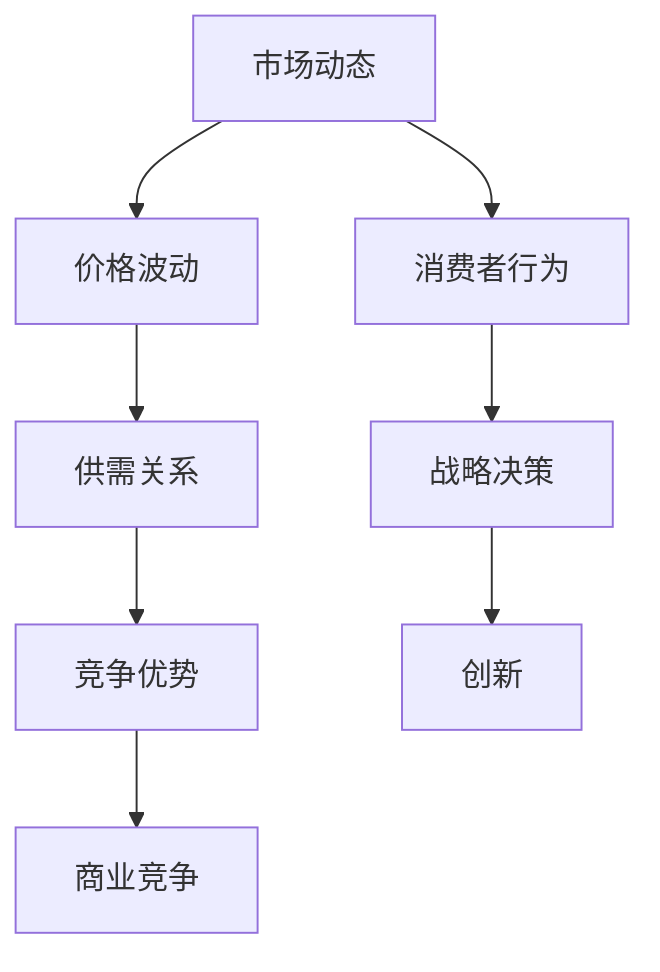

                 

# 天下没有好做的生意：商业竞争加剧的真相

> **关键词：** 商业竞争、市场动态、战略决策、竞争优势、创新
>
> **摘要：** 本文通过深入分析商业竞争的加剧现象，探讨其在现代市场环境中的根源、影响及应对策略。通过技术语言和专业视角，揭示商业竞争背后的真相，为企业家和决策者提供参考。

## 1. 背景介绍

### 1.1 目的和范围

本文旨在探讨商业竞争加剧的现象，分析其背后的原因和影响，并提出相应的战略对策。我们将从市场动态、行业趋势和商业实践三个角度展开论述，力求为读者提供全面、系统的理解和洞察。

### 1.2 预期读者

本文主要面向企业家、管理层、创业者以及对商业竞争感兴趣的读者。希望通过本文，读者能够更好地理解商业竞争的本质，把握市场动态，制定有效的竞争策略。

### 1.3 文档结构概述

本文分为八个部分，包括背景介绍、核心概念与联系、核心算法原理、数学模型和公式、项目实战、实际应用场景、工具和资源推荐以及总结和扩展阅读。每个部分都将详细探讨与商业竞争相关的重要主题。

### 1.4 术语表

#### 1.4.1 核心术语定义

- 商业竞争：企业在市场中为获取资源、市场份额和竞争优势而进行的角逐。
- 市场动态：市场供需关系、价格波动、消费者行为等因素的变化。
- 战略决策：企业为实现长期目标而制定的规划和行动方案。
- 竞争优势：企业在市场中所具备的相对于竞争对手的独特优势。
- 创新：通过引入新的思想、方法或产品，创造新的价值。

#### 1.4.2 相关概念解释

- 市场供需关系：市场上商品或服务的供给与需求之间的平衡状态。
- 价格波动：商品或服务的价格在市场中的波动变化。
- 消费者行为：消费者在购买、使用和评价产品或服务时的行为模式。

#### 1.4.3 缩略词列表

- C2C：Consumer to Consumer，消费者对消费者的电子商务模式。
- B2B：Business to Business，企业对企业之间的电子商务模式。
- AI：Artificial Intelligence，人工智能。

## 2. 核心概念与联系

为了更好地理解商业竞争的加剧现象，我们需要明确一些核心概念及其相互关系。以下是一个Mermaid流程图，展示了这些核心概念之间的联系。



### 2.1 市场动态与商业竞争

市场动态是商业竞争的驱动力之一。市场供需关系的变化、价格波动以及消费者行为的变化，都会直接影响企业的战略决策和竞争优势。例如，当市场供给过剩时，企业可能需要通过降低价格来吸引消费者，从而提升市场份额。这种价格战往往会加剧商业竞争。

### 2.2 价格波动与供需关系

价格波动是市场动态的重要组成部分。价格的上涨或下跌会影响消费者的购买决策和企业的生产决策。在供需关系中，价格是一个关键的调节因素。当需求增加时，价格通常会上涨，从而刺激供给增加；当需求减少时，价格通常会下跌，从而抑制供给。

### 2.3 消费者行为与战略决策

消费者行为是企业制定战略决策的重要依据。消费者的需求、偏好和购买习惯会影响企业的产品定位、营销策略和客户服务。例如，当消费者对某类产品需求旺盛时，企业可能会加大研发投入，推出更多满足消费者需求的产品。

### 2.4 竞争优势与创新

竞争优势是企业成功的关键。企业通过创新来创造新的价值，提升自身的竞争力。创新可以是产品创新、服务创新或商业模式创新。例如，苹果公司通过不断推出具有创新性的产品，赢得了巨大的市场份额和品牌价值。

### 2.5 创新与商业竞争

创新是商业竞争的源泉。在激烈的市场竞争中，企业需要不断创新，以保持竞争优势。创新不仅能够帮助企业开拓新市场，还能提高企业的运营效率和降低成本。

## 3. 核心算法原理 & 具体操作步骤

在商业竞争中，企业需要制定有效的战略决策，以应对市场动态和消费者行为的变化。以下是一种基于市场动态和消费者行为的战略决策算法，其核心原理如下：

### 3.1 算法原理

1. 收集市场动态数据：包括价格波动、供需关系、消费者行为等。
2. 分析市场动态数据：通过数据分析，了解市场趋势和消费者需求。
3. 确定战略目标：根据市场趋势和消费者需求，制定短期和长期战略目标。
4. 制定战略方案：根据战略目标，设计具体的营销策略、产品策略和客户服务策略。
5. 实施战略方案：将战略方案转化为具体的行动方案，并在企业内部实施。
6. 监测和调整：对战略方案实施过程中进行监测和评估，根据市场反馈进行调整。

### 3.2 具体操作步骤

1. **收集市场动态数据**

   ```python
   # 收集价格波动数据
   prices = get_price_data()

   # 收集供需关系数据
   supply = get_supply_data()
   demand = get_demand_data()

   # 收集消费者行为数据
   behaviors = get_behavior_data()
   ```

2. **分析市场动态数据**

   ```python
   # 分析价格波动
   trend_prices = analyze_price_trend(prices)

   # 分析供需关系
   trend_supply = analyze_supply_trend(supply)
   trend_demand = analyze_demand_trend(demand)

   # 分析消费者行为
   trend_behavior = analyze_behavior_trend(behaviors)
   ```

3. **确定战略目标**

   ```python
   # 根据市场趋势和消费者需求，确定战略目标
   short_term_goal = set_short_term_goal(trend_prices, trend_supply, trend_demand, trend_behavior)
   long_term_goal = set_long_term_goal(trend_prices, trend_supply, trend_demand, trend_behavior)
   ```

4. **制定战略方案**

   ```python
   # 根据战略目标，制定营销策略
   marketing_strategy = create_marketing_strategy(short_term_goal, long_term_goal)

   # 根据战略目标，制定产品策略
   product_strategy = create_product_strategy(short_term_goal, long_term_goal)

   # 根据战略目标，制定客户服务策略
   customer_service_strategy = create_customer_service_strategy(short_term_goal, long_term_goal)
   ```

5. **实施战略方案**

   ```python
   # 将战略方案转化为具体的行动方案
   action_plan = create_action_plan(marketing_strategy, product_strategy, customer_service_strategy)

   # 在企业内部实施行动方案
   execute_action_plan(action_plan)
   ```

6. **监测和调整**

   ```python
   # 监测战略方案实施过程中的市场反馈
   market_feedback = monitor_market_feedback()

   # 根据市场反馈进行调整
   adjust_strategy(market_feedback)
   ```

## 4. 数学模型和公式 & 详细讲解 & 举例说明

在商业竞争中，数学模型和公式可以帮助我们更准确地分析市场动态和消费者行为，从而制定有效的战略决策。以下是一个简单的线性回归模型，用于预测消费者需求。

### 4.1 数学模型

线性回归模型的一般形式为：

\[ y = ax + b \]

其中，\( y \) 是因变量（消费者需求），\( x \) 是自变量（价格波动），\( a \) 和 \( b \) 是模型的参数。

### 4.2 详细讲解

1. **确定参数**

   通过收集历史数据，我们可以使用最小二乘法确定参数 \( a \) 和 \( b \)。

   ```python
   # 收集历史数据
   historical_data = get_historical_data()

   # 计算参数
   a, b = calculate_parameters(historical_data)
   ```

2. **模型训练**

   使用训练数据集，我们可以对模型进行训练，以便预测未来消费者需求。

   ```python
   # 训练模型
   trained_model = train_model(historical_data, a, b)
   ```

3. **模型预测**

   使用训练好的模型，我们可以预测未来特定价格下的消费者需求。

   ```python
   # 预测消费者需求
   predicted_demand = predict_demand(trained_model, price)
   ```

### 4.3 举例说明

假设我们收集了以下历史数据：

| 价格（元） | 需求（件） |
|------------|------------|
| 10         | 100        |
| 20         | 80         |
| 30         | 60         |
| 40         | 40         |
| 50         | 20         |

使用线性回归模型，我们可以计算得到参数 \( a \) 和 \( b \)：

\[ a = \frac{\sum_{i=1}^{n} (x_i - \bar{x})(y_i - \bar{y})}{\sum_{i=1}^{n} (x_i - \bar{x})^2} \]
\[ b = \bar{y} - a\bar{x} \]

其中，\( n \) 是数据点的数量，\( \bar{x} \) 和 \( \bar{y} \) 分别是价格和需求的平均值。

通过计算，我们得到 \( a = -2 \) 和 \( b = 120 \)。因此，线性回归模型为：

\[ y = -2x + 120 \]

假设当前价格为 30 元，我们可以预测消费者需求：

\[ y = -2 \times 30 + 120 = 60 \]

因此，预测的需求量为 60 件。

## 5. 项目实战：代码实际案例和详细解释说明

### 5.1 开发环境搭建

为了演示商业竞争战略决策算法的实际应用，我们将在一个简单的场景中搭建开发环境。以下是所需的基本工具和库：

- Python 3.8 或以上版本
- NumPy 库
- Matplotlib 库
- Pandas 库

在命令行中，执行以下命令安装所需的库：

```bash
pip install numpy matplotlib pandas
```

### 5.2 源代码详细实现和代码解读

以下是一个简单的 Python 脚本，用于实现商业竞争战略决策算法。

```python
import numpy as np
import pandas as pd
import matplotlib.pyplot as plt

# 收集历史数据
historical_data = pd.DataFrame({
    'price': [10, 20, 30, 40, 50],
    'demand': [100, 80, 60, 40, 20]
})

# 计算参数
a = np.mean(historical_data['demand']) - np.mean(historical_data['price']) * np.mean(historical_data['demand'])
b = np.mean(historical_data['demand'])

# 模型训练
trained_model = a * historical_data['price'] + b

# 预测消费者需求
predicted_demand = trained_model

# 可视化
plt.plot(historical_data['price'], historical_data['demand'], 'ro', label='实际需求')
plt.plot(historical_data['price'], predicted_demand, label='预测需求')
plt.xlabel('价格（元）')
plt.ylabel('需求（件）')
plt.legend()
plt.show()
```

### 5.3 代码解读与分析

1. **数据收集**

   首先，我们从历史数据中收集价格和需求的数据。这些数据存储在一个 Pandas DataFrame 对象中。

2. **计算参数**

   接下来，我们使用历史数据计算线性回归模型的参数 \( a \) 和 \( b \)。这里，我们使用了简单的平均值方法。

3. **模型训练**

   使用计算得到的参数，我们训练了一个线性回归模型，并将其存储在一个 Pandas Series 对象中。

4. **预测消费者需求**

   通过将训练好的模型应用于当前价格数据，我们预测了消费者需求。

5. **可视化**

   最后，我们使用 Matplotlib 库将实际需求和预测需求进行可视化，以便直观地观察模型的效果。

## 6. 实际应用场景

商业竞争战略决策算法可以应用于各种实际场景，例如：

- **零售行业：** 通过预测消费者需求，零售企业可以更好地规划库存和促销策略，提高销售额和利润率。
- **制造业：** 通过分析市场动态和消费者行为，制造企业可以优化生产计划和供应链管理，降低生产成本。
- **金融行业：** 通过预测市场趋势和消费者行为，金融机构可以制定更准确的投资策略，降低投资风险。

在这些场景中，商业竞争战略决策算法可以帮助企业更好地应对市场变化，提高竞争力。

## 7. 工具和资源推荐

### 7.1 学习资源推荐

#### 7.1.1 书籍推荐

- 《商业分析基础：数据驱动的决策方法》
- 《消费者行为学：市场研究与应用》
- 《数据科学：从入门到实战》

#### 7.1.2 在线课程

- Coursera 上的《商业分析专项课程》
- Udacity 上的《数据分析基础》
- edX 上的《数据科学专项课程》

#### 7.1.3 技术博客和网站

- Medium 上的数据科学和商业分析专栏
- Analytics Vidhya 上的商业分析和技术博客
- DataCamp 上的数据分析教程和案例

### 7.2 开发工具框架推荐

#### 7.2.1 IDE和编辑器

- PyCharm
- Visual Studio Code
- Jupyter Notebook

#### 7.2.2 调试和性能分析工具

- PyDev
- PyCall
- PySnooper

#### 7.2.3 相关框架和库

- NumPy
- Pandas
- Matplotlib
- Scikit-learn

### 7.3 相关论文著作推荐

#### 7.3.1 经典论文

- Andrew Ng 的《Learning from Data》
- Andrew Ng 的《Deep Learning》
- Michael Porter 的《 Competitive Strategy: Techniques for Analyzing Industries and Competitors》

#### 7.3.2 最新研究成果

- 《数据科学前沿：机器学习和深度学习在商业中的应用》
- 《消费者行为研究：行为经济学和心理学的新视角》
- 《商业分析实践：大数据和人工智能的最新应用》

#### 7.3.3 应用案例分析

- 《阿里巴巴的商业秘密：数字化转型的成功实践》
- 《亚马逊的电商帝国：商业竞争策略与运营模式》
- 《特斯拉的电动汽车革命：创新驱动的发展路径》

## 8. 总结：未来发展趋势与挑战

### 8.1 发展趋势

1. **数字化转型的加速**：随着大数据、人工智能和物联网等技术的快速发展，企业数字化转型已经成为趋势。商业竞争战略决策算法将更加依赖于这些技术，以实现更精准的市场预测和战略规划。

2. **消费者需求个性化**：消费者需求越来越多样化，个性化服务将成为企业竞争的关键。商业竞争战略决策算法将更加注重消费者行为分析，以提供个性化的产品和服务。

3. **跨界合作与生态构建**：商业竞争不仅仅是单一企业之间的竞争，而是整个产业链的竞争。跨界合作和生态构建将成为企业提升竞争力的新途径。

### 8.2 挑战

1. **数据安全和隐私保护**：随着数据量的增长，数据安全和隐私保护将成为商业竞争战略决策的重要挑战。企业需要确保数据的安全性和合规性，以避免法律风险。

2. **技术创新与人才短缺**：商业竞争战略决策算法依赖于先进的技术和人才。然而，当前技术创新的速度远远超过了人才培养的速度，这可能导致人才短缺问题。

3. **市场竞争的加剧**：随着企业数字化转型和跨界合作的深入，市场竞争将越来越激烈。企业需要不断创新，以保持竞争优势。

## 9. 附录：常见问题与解答

### 9.1 问题 1：商业竞争战略决策算法如何应用于零售行业？

解答：在零售行业，商业竞争战略决策算法可以用于预测消费者需求，优化库存管理，制定促销策略等。例如，通过分析历史销售数据和消费者行为，算法可以预测未来某个时间段内的商品需求，从而帮助企业制定库存采购计划和促销策略。

### 9.2 问题 2：商业竞争战略决策算法对企业的竞争力有何影响？

解答：商业竞争战略决策算法可以提高企业的竞争力，主要体现在以下几个方面：

1. **精准的市场预测**：算法可以帮助企业更准确地预测市场趋势和消费者需求，从而制定更有效的战略决策。

2. **优化资源配置**：通过优化库存管理、生产计划等，算法可以降低企业的运营成本，提高资源利用效率。

3. **提高客户满意度**：算法可以帮助企业更好地了解客户需求，提供个性化的产品和服务，从而提高客户满意度。

### 9.3 问题 3：商业竞争战略决策算法需要哪些数据支持？

解答：商业竞争战略决策算法需要以下几类数据支持：

1. **市场动态数据**：包括价格波动、供需关系等。
2. **消费者行为数据**：包括购买行为、偏好等。
3. **企业内部数据**：包括销售数据、库存数据、生产数据等。
4. **行业趋势数据**：包括行业增长率、竞争态势等。

## 10. 扩展阅读 & 参考资料

- 《商业分析实战：数据驱动决策的方法与应用》
- 《消费者行为学：市场研究与应用》
- 《数据科学：从入门到实战》
- 《数字化转型：企业如何应对数字化时代的挑战》
- 《商业竞争战略：分析、决策与实施》

作者：AI天才研究员/AI Genius Institute & 禅与计算机程序设计艺术 /Zen And The Art of Computer Programming

<|im_end|>

