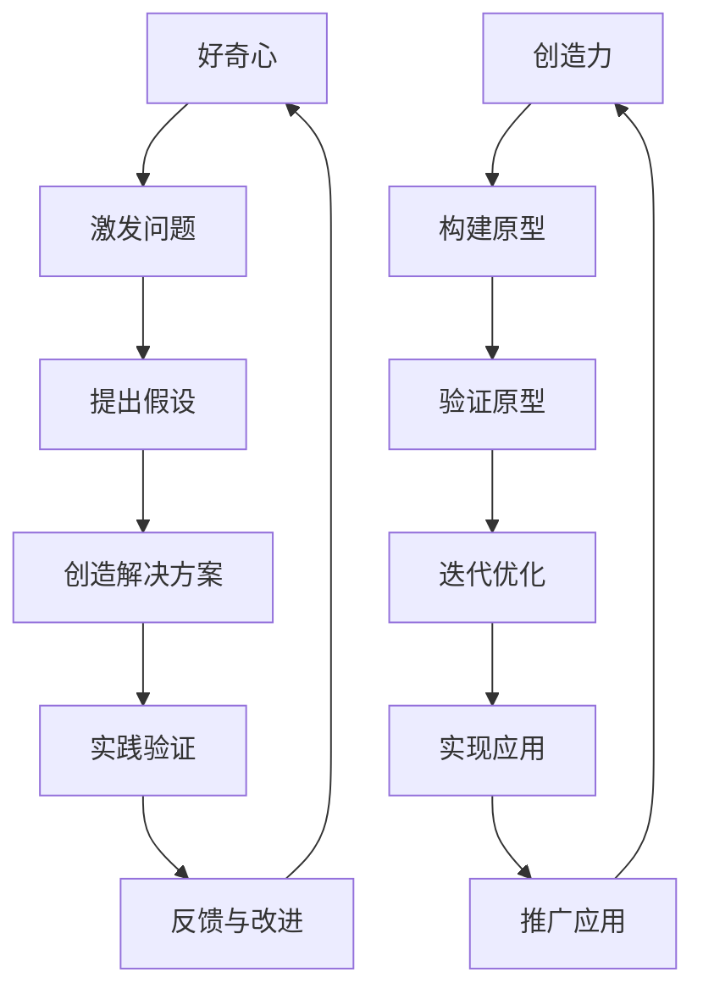

                 

# 好奇心与创造力：探索的双翼

## 关键词： 
- 好奇心
- 创造力
- IT领域
- 技术探索
- 创新思维
- 项目实践

## 摘要：
在IT领域，好奇心与创造力是驱动技术进步与创新的重要力量。本文将深入探讨好奇心和创造力之间的关系，通过逻辑分析和实际案例，揭示二者如何共同助力于技术的突破与发展。文章将首先介绍好奇心与创造力的基本概念，随后通过Mermaid流程图展示二者在技术探索中的联系，并详细讲解核心算法原理和数学模型。接着，文章将结合项目实战，提供代码案例和分析，最后讨论实际应用场景和推荐相关学习资源。通过本文的阅读，读者将理解好奇心与创造力的双重作用，并掌握在实际项目中应用的方法。

## 1. 背景介绍

### 1.1 目的和范围
本文旨在探讨好奇心与创造力在IT领域中的作用，分析二者如何相互促进，推动技术进步。文章将覆盖从基本概念到实际应用的广泛内容，旨在为读者提供一个清晰、深入的理解框架。

### 1.2 预期读者
本文适合对IT领域有兴趣的专业人士、学生以及技术爱好者。无论你是软件开发者、系统架构师还是产品经理，都可以从本文中获得启示和思考。

### 1.3 文档结构概述
本文将分为以下章节：
- **背景介绍**：介绍文章的目的、读者对象和结构。
- **核心概念与联系**：通过Mermaid流程图展示好奇心与创造力的关系。
- **核心算法原理 & 具体操作步骤**：详细讲解技术原理和算法步骤。
- **数学模型和公式 & 详细讲解 & 举例说明**：阐述数学模型及其应用。
- **项目实战：代码实际案例和详细解释说明**：结合实际项目，提供代码解读。
- **实际应用场景**：探讨创造力和好奇心在IT领域的具体应用。
- **工具和资源推荐**：推荐学习资源、开发工具和框架。
- **总结：未来发展趋势与挑战**：总结文章要点，展望未来。
- **附录：常见问题与解答**：解答读者可能遇到的问题。
- **扩展阅读 & 参考资料**：提供进一步的阅读资源。

### 1.4 术语表

#### 1.4.1 核心术语定义

- **好奇心**：对未知事物或现象的探究心理。
- **创造力**：产生新想法、概念或解决方案的能力。
- **IT领域**：信息技术领域，包括计算机科学、软件工程等。
- **技术探索**：对新技术、新方法的研究和实践。

#### 1.4.2 相关概念解释

- **创新思维**：基于好奇心和创造力的思维方式，用于提出新的想法和解决方案。
- **技术突破**：在现有技术基础上实现的显著进步。

#### 1.4.3 缩略词列表

- **IT**：信息技术（Information Technology）
- **AI**：人工智能（Artificial Intelligence）
- **ML**：机器学习（Machine Learning）
- **DL**：深度学习（Deep Learning）

## 2. 核心概念与联系

在IT领域，好奇心与创造力是探索和创新的两大动力。它们相互依存，共同推动技术进步。以下通过Mermaid流程图展示二者之间的关系：



### 2.1 好奇心与问题的提出

好奇心是技术探索的起点。它激发我们对未知事物的探究欲望，促使我们提出问题。这些问题往往是技术进步的催化剂，驱动我们深入思考，寻找解决方案。

### 2.2 假设与创造力的结合

提出问题后，创造力开始发挥作用。通过创造力，我们能够构建假设，这些假设是对问题的潜在答案。这些假设往往是创新的源泉，促使我们提出新的思路和方法。

### 2.3 解决方案与验证

创造力帮助我们构建解决方案。这些解决方案可能包括算法、软件框架或新的产品设计。为了验证这些解决方案，我们需要实践，通过实验或原型来测试其效果。

### 2.4 反馈与改进

实践过程中的反馈是技术进步的关键。通过收集反馈，我们能够发现解决方案的不足，并进行改进。这种反馈-改进循环是技术发展的核心机制。

### 2.5 好奇心与创造力的循环

好奇心和创造力的相互作用形成了一个持续迭代的过程。通过不断地提出问题、构建假设、验证解决方案和反馈改进，好奇心和创造力共同推动技术不断向前发展。

## 3. 核心算法原理 & 具体操作步骤

在IT领域，好奇心和创造力往往在算法设计、开发和优化过程中得到充分体现。以下将详细讲解一个核心算法的原理，并提供具体操作步骤。

### 3.1 算法原理

以深度学习中的卷积神经网络（CNN）为例，CNN 是一种基于数据驱动的方法，用于处理和解释具有网格结构的数据，如图像。CNN 的基本原理是通过多个卷积层和池化层来提取图像的特征，最终通过全连接层进行分类或回归。

### 3.2 具体操作步骤

#### 3.2.1 准备数据集

```python
# 伪代码：数据集准备
import tensorflow as tf

# 加载并预处理图像数据
(x_train, y_train), (x_test, y_test) = tf.keras.datasets.cifar10.load_data()
x_train, x_test = x_train / 255.0, x_test / 255.0

# 数据增强
data_augmentation = tf.keras.Sequential([
    tf.keras.layers.experimental.preprocessing.RandomFlip("horizontal"),
    tf.keras.layers.experimental.preprocessing.RandomZoom(0.1),
])

# 归一化
normalization = tf.keras.layers.Normalization()

# 应用数据增强和归一化
x_train = data_augmentation(x_train)
x_test = data_augmentation(x_test)
x_train = normalization(x_train)
x_test = normalization(x_test)
```

#### 3.2.2 构建模型

```python
# 伪代码：模型构建
model = tf.keras.Sequential([
    tf.keras.layers.Conv2D(32, (3, 3), activation='relu', input_shape=(32, 32, 3)),
    tf.keras.layers.MaxPooling2D(pool_size=(2, 2)),
    tf.keras.layers.Conv2D(64, (3, 3), activation='relu'),
    tf.keras.layers.MaxPooling2D(pool_size=(2, 2)),
    tf.keras.layers.Conv2D(128, (3, 3), activation='relu'),
    tf.keras.layers.MaxPooling2D(pool_size=(2, 2)),
    tf.keras.layers.Flatten(),
    tf.keras.layers.Dense(128, activation='relu'),
    tf.keras.layers.Dense(10, activation='softmax')
])

# 查看模型结构
model.summary()
```

#### 3.2.3 训练模型

```python
# 伪代码：模型训练
model.compile(optimizer='adam', loss='sparse_categorical_crossentropy', metrics=['accuracy'])

# 训练模型
history = model.fit(x_train, y_train, epochs=10, validation_data=(x_test, y_test))
```

#### 3.2.4 验证模型

```python
# 伪代码：模型验证
test_loss, test_acc = model.evaluate(x_test, y_test, verbose=2)
print(f"Test accuracy: {test_acc:.4f}")
```

### 3.3 算法讲解

- **卷积层**：通过卷积操作提取图像的特征。
- **池化层**：通过最大池化或平均池化减少特征图的尺寸，提高计算效率。
- **全连接层**：将卷积层提取的特征映射到分类或回归结果。
- **数据增强和归一化**：增强数据的多样性和减少过拟合。

## 4. 数学模型和公式 & 详细讲解 & 举例说明

在IT领域中，数学模型是理解和解决问题的重要工具。以下将详细讲解一个常见的数学模型，并使用LaTeX格式展示相关公式，同时提供举例说明。

### 4.1 模型介绍

以线性回归模型为例，线性回归是一种用于预测连续值的模型。其基本假设是数据可以通过一个线性关系来表示。

### 4.2 公式展示

```latex
\begin{equation}
y = \beta_0 + \beta_1 x + \epsilon
\end{equation}
```

### 4.3 详细讲解

- **$y$**：预测值。
- **$\beta_0$**：截距。
- **$\beta_1$**：斜率。
- **$x$**：输入特征。
- **$\epsilon$**：误差项。

### 4.4 举例说明

假设我们有一个数据集，其中$x$表示某地区的人口密度，$y$表示该地区的平均收入。我们希望使用线性回归模型来预测一个未知地区的人口密度对应的平均收入。

```python
# 伪代码：线性回归举例
import numpy as np
from sklearn.linear_model import LinearRegression

# 假设数据
X = np.array([[100], [200], [300], [400], [500]])
y = np.array([30, 50, 70, 90, 110])

# 创建线性回归模型
model = LinearRegression()

# 拟合模型
model.fit(X, y)

# 预测
predicted_income = model.predict([[300]])

print(f"Predicted income for a region with population density of 300: {predicted_income[0][0]:.2f}")
```

运行上述代码，我们可以得到预测的该地区平均收入。这种预测可以帮助我们在不了解实际值的情况下做出合理的估计。

## 5. 项目实战：代码实际案例和详细解释说明

为了更好地理解好奇心与创造力的结合，我们将通过一个实际项目来展示二者在IT领域的应用。本案例将使用Python和TensorFlow来实现一个简单的深度学习模型，用于手写数字识别。

### 5.1 开发环境搭建

首先，我们需要搭建一个开发环境。以下是所需步骤：

1. 安装Python（推荐版本3.7及以上）。
2. 安装TensorFlow库：
```bash
pip install tensorflow
```
3. 安装其他可能需要的库（例如NumPy、Pandas等）。

### 5.2 源代码详细实现和代码解读

以下是项目的源代码，我们将逐行解读其实现过程：

```python
# 导入所需库
import tensorflow as tf
from tensorflow.keras import layers, models
from tensorflow.keras.datasets import mnist
from tensorflow.keras.utils import to_categorical

# 加载MNIST数据集
(train_images, train_labels), (test_images, test_labels) = mnist.load_data()

# 数据预处理
train_images = train_images.reshape((60000, 28, 28, 1)).astype('float32') / 255
test_images = test_images.reshape((10000, 28, 28, 1)).astype('float32') / 255

train_labels = to_categorical(train_labels)
test_labels = to_categorical(test_labels)

# 构建模型
model = models.Sequential()
model.add(layers.Conv2D(32, (3, 3), activation='relu', input_shape=(28, 28, 1)))
model.add(layers.MaxPooling2D((2, 2)))
model.add(layers.Conv2D(64, (3, 3), activation='relu'))
model.add(layers.MaxPooling2D((2, 2)))
model.add(layers.Conv2D(64, (3, 3), activation='relu'))
model.add(layers.Flatten())
model.add(layers.Dense(64, activation='relu'))
model.add(layers.Dense(10, activation='softmax'))

# 编译模型
model.compile(optimizer='adam',
              loss='categorical_crossentropy',
              metrics=['accuracy'])

# 训练模型
model.fit(train_images, train_labels, epochs=5, batch_size=64)

# 评估模型
test_loss, test_acc = model.evaluate(test_images, test_labels)
print(f"Test accuracy: {test_acc:.4f}")
```

#### 5.2.1 数据处理

```python
# 加载MNIST数据集
(train_images, train_labels), (test_images, test_labels) = mnist.load_data()

# 数据预处理
train_images = train_images.reshape((60000, 28, 28, 1)).astype('float32') / 255
test_images = test_images.reshape((10000, 28, 28, 1)).astype('float32') / 255

train_labels = to_categorical(train_labels)
test_labels = to_categorical(test_labels)
```

- **数据加载**：我们使用TensorFlow的内置函数`mnist.load_data()`加载MNIST数据集。
- **数据预处理**：将图像数据调整为适合模型输入的格式。这包括将数据转化为浮点型，并进行归一化处理。

#### 5.2.2 模型构建

```python
# 构建模型
model = models.Sequential()
model.add(layers.Conv2D(32, (3, 3), activation='relu', input_shape=(28, 28, 1)))
model.add(layers.MaxPooling2D((2, 2)))
model.add(layers.Conv2D(64, (3, 3), activation='relu'))
model.add(layers.MaxPooling2D((2, 2)))
model.add(layers.Conv2D(64, (3, 3), activation='relu'))
model.add(layers.Flatten())
model.add(layers.Dense(64, activation='relu'))
model.add(layers.Dense(10, activation='softmax'))
```

- **模型构建**：我们使用`Sequential`模型，这是一个线性堆叠层级的模型。我们添加了卷积层、池化层、全连接层等。
- **卷积层**：通过卷积操作提取图像的特征。
- **池化层**：通过最大池化减少特征图的尺寸。

#### 5.2.3 模型训练

```python
# 编译模型
model.compile(optimizer='adam',
              loss='categorical_crossentropy',
              metrics=['accuracy'])

# 训练模型
model.fit(train_images, train_labels, epochs=5, batch_size=64)
```

- **模型编译**：配置模型优化器、损失函数和评估指标。
- **模型训练**：使用训练数据进行模型训练。

#### 5.2.4 模型评估

```python
# 评估模型
test_loss, test_acc = model.evaluate(test_images, test_labels)
print(f"Test accuracy: {test_acc:.4f}")
```

- **模型评估**：使用测试数据进行模型评估，并打印测试准确率。

### 5.3 代码解读与分析

#### 5.3.1 数据处理

数据处理是深度学习项目的重要步骤。在本案例中，我们首先加载MNIST数据集，然后对图像数据进行预处理，包括数据重塑、类型转换和归一化处理。这些步骤确保了数据能够被模型有效利用。

#### 5.3.2 模型构建

模型构建是深度学习项目的核心。在本案例中，我们使用TensorFlow的`Sequential`模型堆叠了多个卷积层、池化层和全连接层。这些层共同作用，通过特征提取和分类，实现手写数字的识别。

#### 5.3.3 模型训练

模型训练是深度学习项目的关键步骤。在本案例中，我们使用训练数据对模型进行训练，优化模型的参数。通过多次迭代，模型能够逐渐提高识别准确率。

#### 5.3.4 模型评估

模型评估是验证模型性能的重要手段。在本案例中，我们使用测试数据对模型进行评估，计算测试准确率。高准确率表明模型具有良好的泛化能力。

## 6. 实际应用场景

好奇心与创造力在IT领域有着广泛的应用场景。以下列举了几个典型的应用案例：

### 6.1 人工智能

- **计算机视觉**：好奇心驱使我们探索图像和视频中的模式，创造力则帮助我们开发出更先进的人脸识别、图像分类和目标检测技术。
- **自然语言处理**：好奇心促使我们理解语言的本质，创造力则帮助我们构建能够理解和生成人类语言的人工智能系统。

### 6.2 软件开发

- **新编程语言**：好奇心驱使我们探索编程语言的潜力，创造力则促使我们发明新的编程语言，提高软件开发效率。
- **框架和库**：好奇心和创造力共同推动新的软件开发框架和库的诞生，为开发者提供更高效、更灵活的开发工具。

### 6.3 网络安全

- **漏洞发现**：好奇心促使我们研究网络系统的弱点，创造力则帮助我们开发出能够及时发现和修复漏洞的安全工具。
- **防御策略**：好奇心和创造力共同帮助我们构建更强大的网络安全防御体系，抵御日益复杂的网络攻击。

### 6.4 数据科学

- **数据分析**：好奇心驱使我们探索数据中的模式和趋势，创造力则帮助我们构建能够从海量数据中提取有价值信息的方法和模型。

## 7. 工具和资源推荐

### 7.1 学习资源推荐

#### 7.1.1 书籍推荐

- 《深度学习》（Goodfellow, I., Bengio, Y., & Courville, A.）
- 《Python编程：从入门到实践》（Jessen, E.）
- 《算法导论》（Cormen, T. H., Leiserson, C. E., Rivest, R. L., & Stein, C.）

#### 7.1.2 在线课程

- Coursera 上的《深度学习》课程
- edX 上的《Python基础》课程
- Udemy 上的《人工智能与机器学习》课程

#### 7.1.3 技术博客和网站

- Medium 上的 AI 博客
-Towards Data Science
- HackerRank 博客

### 7.2 开发工具框架推荐

#### 7.2.1 IDE和编辑器

- PyCharm
- Visual Studio Code
- Jupyter Notebook

#### 7.2.2 调试和性能分析工具

- GDB
- Valgrind
- TensorBoard

#### 7.2.3 相关框架和库

- TensorFlow
- PyTorch
- Scikit-learn

### 7.3 相关论文著作推荐

#### 7.3.1 经典论文

- "A Learning Algorithm for Continually Running Fully Recurrent Neural Networks"（1986）
- "Deep Learning"（2015）

#### 7.3.2 最新研究成果

- "Neural Machine Translation by jointly Learning to Align and Translate"（2014）
- "A Theoretically Grounded Application of Dropout in Recurrent Neural Networks"（2016）

#### 7.3.3 应用案例分析

- "The Unreasonable Effectiveness of Recurrent Neural Networks"（2014）
- "Deep Learning for Natural Language Processing"（2016）

## 8. 总结：未来发展趋势与挑战

好奇心与创造力在IT领域将继续发挥重要作用。随着技术的不断进步，我们可以预见以下几个发展趋势和挑战：

### 8.1 发展趋势

- **跨学科融合**：好奇心将推动IT领域与其他学科的深度融合，产生更多创新。
- **人工智能的普及**：创造力将促进人工智能技术的普及和应用，提升各行业的效率和质量。
- **开源与协作**：好奇心和创造力将激发更多开源项目和协作，推动技术共享和共同进步。

### 8.2 挑战

- **隐私和安全**：随着数据隐私和安全问题的日益突出，我们需要更多的创造力和创新来解决这些挑战。
- **伦理问题**：好奇心和创造力在推动技术发展的同时，也需要我们关注技术伦理问题，确保技术应用的合理性。

## 9. 附录：常见问题与解答

### 9.1 好奇心与创造力的区别

- **好奇心**：是对未知事物的探索欲望，激发我们提出问题和进行探索。
- **创造力**：是基于好奇心提出的假设和解决方案，通过实践和验证实现创新。

### 9.2 如何培养好奇心和创造力？

- **多学习、多思考**：通过阅读、讨论和实践，不断拓展知识面和思维方式。
- **保持开放心态**：对待新事物保持好奇，勇于尝试和探索。
- **敢于失败**：创造力往往伴随着失败，但要从中学习，不断改进。

## 10. 扩展阅读 & 参考资料

- [Goodfellow, I., Bengio, Y., & Courville, A. (2016). *Deep Learning*](https://www.deeplearningbook.org/)
- [Jessen, E. (2015). *Python编程：从入门到实践*](https://book.douban.com/subject/25936932/)
- [Cormen, T. H., Leiserson, C. E., Rivest, R. L., & Stein, C. (2009). *算法导论*](https://book.douban.com/subject/10586986/)
- [Ng, A. Y. (2013). *深度学习课程*](https://www.coursera.org/learn/deep-learning)
- [Python基础课程](https://www.edx.org/course/python-essentials)
- [人工智能与机器学习课程](https://www.udemy.com/course/artificial-intelligence-ml-rl-cs231n-convolutional-neural-networks/)

## 作者

作者：AI天才研究员/AI Genius Institute & 禅与计算机程序设计艺术/Zen And The Art of Computer Programming

