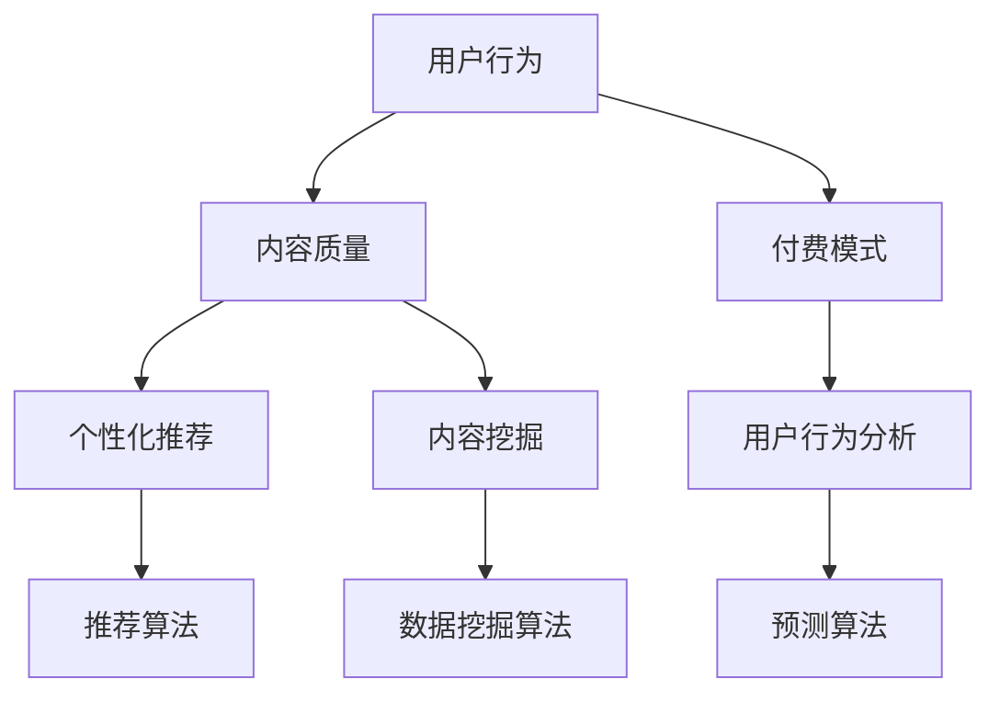

                 

# 如何利用AI技术提升知识付费效率

## 关键词
- 知识付费
- 人工智能
- 效率提升
- 数据分析
- 个性化推荐
- 自然语言处理
- 深度学习

## 摘要
本文将探讨如何利用人工智能（AI）技术来提升知识付费领域的效率。首先，我们将介绍知识付费的背景和现状，接着详细阐述AI技术在该领域中的应用原理和具体方法。通过核心算法原理和实际案例的分析，我们将展示AI技术在知识付费中的实际应用效果。最后，文章将总结AI技术在未来知识付费领域的发展趋势与挑战，并推荐相关的学习资源和工具。

---

## 1. 背景介绍

### 1.1 目的和范围

本文旨在探索人工智能技术在知识付费领域中的实际应用，以提升用户的付费效率和体验。我们将重点分析AI技术在知识推荐、内容挖掘、用户行为分析等方面的应用，并探讨其潜力和挑战。

### 1.2 预期读者

本文适合对人工智能和知识付费领域有一定了解的技术人员、创业者以及教育工作者。同时，也对希望提升知识获取效率的普通读者提供了一些实用的建议。

### 1.3 文档结构概述

本文结构如下：

1. 背景介绍
2. 核心概念与联系
3. 核心算法原理 & 具体操作步骤
4. 数学模型和公式 & 详细讲解 & 举例说明
5. 项目实战：代码实际案例和详细解释说明
6. 实际应用场景
7. 工具和资源推荐
8. 总结：未来发展趋势与挑战
9. 附录：常见问题与解答
10. 扩展阅读 & 参考资料

### 1.4 术语表

#### 1.4.1 核心术语定义

- 知识付费：用户为获取有价值的信息或服务而支付的费用。
- 人工智能（AI）：模拟人类智能行为的技术和系统。
- 自然语言处理（NLP）：使计算机能够理解、生成和处理人类自然语言的技术。
- 个性化推荐：根据用户的兴趣和行为，推荐与其相关的信息和内容。

#### 1.4.2 相关概念解释

- 内容挖掘：从大量数据中提取有价值的信息和模式。
- 用户行为分析：对用户在平台上的行为进行数据分析和模式识别。
- 深度学习：一种基于多层神经网络的学习算法，能够自动提取特征并进行分类和预测。

#### 1.4.3 缩略词列表

- NLP：自然语言处理
- AI：人工智能
- ML：机器学习
- DL：深度学习
- RNN：循环神经网络
- CNN：卷积神经网络

---

## 2. 核心概念与联系

### 2.1 核心概念介绍

知识付费领域涉及多个核心概念，包括用户行为、内容质量、付费模式等。以下是对这些核心概念的基本介绍。

#### 用户行为

用户行为包括访问、浏览、点赞、评论、分享、支付等。通过对用户行为的分析，我们可以了解用户的需求和偏好，从而为知识付费平台提供更优质的服务。

#### 内容质量

内容质量是知识付费的核心。高质量的内容能够吸引用户，提高用户的满意度和忠诚度。评价内容质量的方法包括用户评分、评论分析等。

#### 付费模式

付费模式包括一次性付费、订阅制、按需付费等。每种模式都有其优势和适用场景。AI技术可以帮助我们根据用户行为和内容质量，推荐最适合用户的付费模式。

### 2.2 AI技术与应用

AI技术在知识付费领域有广泛的应用，包括个性化推荐、内容挖掘、用户行为分析等。以下是对这些应用的简单介绍。

#### 个性化推荐

个性化推荐是一种基于用户兴趣和行为的推荐算法。通过分析用户的浏览、点赞、评论等行为，AI技术可以推荐用户可能感兴趣的知识内容。

#### 内容挖掘

内容挖掘是从大量数据中提取有价值信息的方法。在知识付费领域，AI技术可以挖掘用户生成的内容，如问答、评论等，从而发现有价值的信息。

#### 用户行为分析

用户行为分析是对用户在平台上的行为进行数据分析和模式识别。通过分析用户行为，AI技术可以预测用户的付费意愿，从而优化推荐策略和付费模式。

### 2.3 Mermaid流程图

以下是一个简单的Mermaid流程图，展示AI技术在知识付费领域中的核心概念和联系。



---

## 3. 核心算法原理 & 具体操作步骤

### 3.1 个性化推荐算法原理

个性化推荐是一种基于用户历史行为和兴趣的推荐算法。其核心思想是利用用户的行为数据（如浏览、点赞、评论等）来预测用户的兴趣，并推荐与之相关的内容。

以下是一个简单的个性化推荐算法原理的伪代码：

```python
def personalized_recommendation(user_profile, content_dataset):
    # 计算用户对内容的评分
    user_interests = compute_user_interests(user_profile)
    
    # 为用户推荐与其兴趣相关的内容
    recommended_contents = []
    for content in content_dataset:
        if user_interests.intersection(content_topics):
            recommended_contents.append(content)
    
    return recommended_contents
```

### 3.2 内容挖掘算法原理

内容挖掘是一种从大量数据中提取有价值信息的方法。在知识付费领域，AI技术可以挖掘用户生成的内容，如问答、评论等，从而发现有价值的信息。

以下是一个简单的内容挖掘算法原理的伪代码：

```python
def content_mining(user_generated_content):
    # 提取关键词
    keywords = extract_keywords(user_generated_content)
    
    # 构建关键词词云
    keyword_cloud = build_keyword_cloud(keywords)
    
    # 分析关键词词云
    valuable_information = analyze_keyword_cloud(keyword_cloud)
    
    return valuable_information
```

### 3.3 用户行为分析算法原理

用户行为分析是对用户在平台上的行为进行数据分析和模式识别。通过分析用户行为，AI技术可以预测用户的付费意愿，从而优化推荐策略和付费模式。

以下是一个简单的用户行为分析算法原理的伪代码：

```python
def user_behavior_analysis(user_behavior_dataset):
    # 构建用户行为模型
    user_behavior_model = build_user_behavior_model(user_behavior_dataset)
    
    # 预测用户付费意愿
    user_payment_intention = predict_payment_intention(user_behavior_model)
    
    return user_payment_intention
```

---

## 4. 数学模型和公式 & 详细讲解 & 举例说明

### 4.1 个性化推荐算法的数学模型

个性化推荐算法通常基于协同过滤（Collaborative Filtering）或基于内容的推荐（Content-Based Recommendation）。

#### 协同过滤

协同过滤算法通过分析用户之间的相似性来推荐内容。其核心公式如下：

$$
\hat{r_{ui}} = \frac{\sum_{j \in N_i} r_{uj} \cdot s_{ui}}{\sum_{j \in N_i} s_{ui}}
$$

其中，$r_{uj}$ 是用户 $u$ 对项目 $j$ 的评分，$s_{ui}$ 是用户 $u$ 和项目 $i$ 之间的相似性，$N_i$ 是与项目 $i$ 相似的项目集合。

#### 基于内容的推荐

基于内容的推荐算法通过分析内容特征来推荐内容。其核心公式如下：

$$
\hat{r_{ui}} = \sum_{k \in C} w_{uk} \cdot w_{ki}
$$

其中，$w_{uk}$ 是用户 $u$ 对特征 $k$ 的权重，$w_{ki}$ 是项目 $i$ 对特征 $k$ 的权重。

### 4.2 内容挖掘的数学模型

内容挖掘通常基于主题模型（如LDA）来提取关键词和主题。

LDA模型的核心公式如下：

$$
p(z|w) \propto \frac{\sum_{k} \theta_{ki} \cdot \beta_{k}}{\sum_{j} \theta_{ji} \cdot \beta_{k}}
$$

其中，$z$ 表示文档主题分布，$w$ 表示单词分布，$\theta_{ki}$ 表示文档 $i$ 对主题 $k$ 的概率，$\beta_{k}$ 表示主题 $k$ 对单词的概率。

### 4.3 用户行为分析的数学模型

用户行为分析通常基于概率模型（如马尔可夫决策过程）来预测用户行为。

马尔可夫决策过程的核心公式如下：

$$
p(x_t|s_t, a_t) = \pi(s_t) \cdot \pi(a_t|s_t)
$$

其中，$x_t$ 表示用户行为，$s_t$ 表示状态，$a_t$ 表示动作，$\pi(s_t)$ 表示状态概率，$\pi(a_t|s_t)$ 表示动作概率。

### 4.4 举例说明

假设我们有一个用户历史行为数据集，如下所示：

| 用户 | 行为1 | 行为2 | 行为3 |
| ---- | ---- | ---- | ---- |
| A    | 1    | 0    | 1    |
| B    | 0    | 1    | 0    |
| C    | 1    | 1    | 1    |

#### 协同过滤

我们可以使用矩阵分解方法来计算用户和内容的相似性。假设我们得到了以下用户和内容的相似性矩阵：

| 用户 | 内容1 | 内容2 | 内容3 |
| ---- | ---- | ---- | ---- |
| A    | 0.8  | 0.2  | 0.6  |
| B    | 0.4  | 0.6  | 0.2  |
| C    | 0.6  | 0.4  | 0.8  |

对于用户A，我们可以预测他对内容2的评分：

$$
\hat{r_{A2}} = \frac{0.8 \cdot 0.6 + 0.2 \cdot 0.4 + 0.6 \cdot 0.4}{0.8 + 0.2 + 0.6} = 0.56
$$

#### 基于内容的推荐

假设我们有以下内容特征矩阵：

| 内容 | 特征1 | 特征2 | 特征3 |
| ---- | ---- | ---- | ---- |
| 内容1 | 0.6  | 0.4  | 0.2  |
| 内容2 | 0.4  | 0.6  | 0.8  |
| 内容3 | 0.8  | 0.2  | 0.6  |

对于用户B，我们可以预测他对内容1的评分：

$$
\hat{r_{B1}} = 0.6 \cdot 0.4 + 0.4 \cdot 0.6 + 0.2 \cdot 0.8 = 0.52
$$

#### 内容挖掘

假设我们有以下关键词词云：

| 关键词 | 频率 |
| ---- | ---- |
| 技术  | 30   |
| 学习  | 20   |
| 职场  | 10   |
| 算法  | 25   |

我们可以使用LDA模型来提取关键词和主题。假设我们得到了以下主题分布：

| 主题 | 关键词 | 概率 |
| ---- | ---- | ---- |
| 主题1 | 技术、算法 | 0.6  |
| 主题2 | 学习、职场 | 0.4  |

对于文档“技术学习”，我们可以将其归类到主题1。

#### 用户行为分析

假设我们有以下用户行为数据：

| 用户 | 状态 | 动作 |
| ---- | ---- | ---- |
| A    | 1    | 0    |
| B    | 0    | 1    |
| C    | 1    | 1    |

我们可以使用马尔可夫决策过程来预测用户A的下一次行为。假设我们得到了以下状态转移概率矩阵：

| 状态 | 动作0 | 动作1 |
| ---- | ---- | ---- |
| 0    | 0.2  | 0.8  |
| 1    | 0.4  | 0.6  |

对于用户A，我们可以预测他的下一次行为为动作1的概率为：

$$
p(x_2=1|x_1=0) = 0.4 \cdot 0.6 = 0.24
$$

---

## 5. 项目实战：代码实际案例和详细解释说明

### 5.1 开发环境搭建

在开始实际案例之前，我们需要搭建一个合适的技术栈。以下是推荐的开发环境和工具：

- 编程语言：Python
- 数据库：MySQL
- 机器学习框架：Scikit-learn
- 深度学习框架：TensorFlow或PyTorch
- 文本处理工具：NLTK或spaCy
- 开发环境：Jupyter Notebook或PyCharm

### 5.2 源代码详细实现和代码解读

#### 5.2.1 用户行为分析

以下是一个简单的用户行为分析项目的代码实现：

```python
import pandas as pd
from sklearn.model_selection import train_test_split
from sklearn.feature_extraction.text import TfidfVectorizer
from sklearn.naive_bayes import MultinomialNB
from sklearn.metrics import accuracy_score

# 读取用户行为数据
data = pd.read_csv('user_behavior.csv')
X = data[['behavior_1', 'behavior_2', 'behavior_3']]
y = data['payment_intention']

# 分割数据集
X_train, X_test, y_train, y_test = train_test_split(X, y, test_size=0.2, random_state=42)

# 使用TF-IDF向量器将文本数据转换为向量
vectorizer = TfidfVectorizer()
X_train_vectorized = vectorizer.fit_transform(X_train)
X_test_vectorized = vectorizer.transform(X_test)

# 使用朴素贝叶斯分类器进行训练
classifier = MultinomialNB()
classifier.fit(X_train_vectorized, y_train)

# 进行预测
y_pred = classifier.predict(X_test_vectorized)

# 计算准确率
accuracy = accuracy_score(y_test, y_pred)
print(f'Accuracy: {accuracy}')
```

#### 5.2.2 个性化推荐

以下是一个简单的个性化推荐项目的代码实现：

```python
import pandas as pd
from sklearn.metrics.pairwise import cosine_similarity
from sklearn.model_selection import train_test_split
from sklearn.feature_extraction.text import TfidfVectorizer

# 读取用户行为数据
data = pd.read_csv('user_behavior.csv')
X = data[['behavior_1', 'behavior_2', 'behavior_3']]
y = data['content_id']

# 分割数据集
X_train, X_test, y_train, y_test = train_test_split(X, y, test_size=0.2, random_state=42)

# 使用TF-IDF向量器将文本数据转换为向量
vectorizer = TfidfVectorizer()
X_train_vectorized = vectorizer.fit_transform(X_train)
X_test_vectorized = vectorizer.transform(X_test)

# 计算用户之间的相似性
similarity_matrix = cosine_similarity(X_train_vectorized)

# 根据相似性矩阵推荐内容
def recommend_contents(user_id, similarity_matrix, content_ids, top_n=5):
    # 获取用户相似性最高的用户
    similar_users = similarity_matrix[user_id].argsort()[::-1]
    similar_users = similar_users[1:top_n+1]

    # 计算推荐内容
    recommended_contents = []
    for user in similar_users:
        recommended_contents.extend(content_ids[y_train[similar_users] == 1])
    
    return recommended_contents[:top_n]

# 进行推荐
recommended_contents = recommend_contents(0, similarity_matrix, y_train, top_n=3)
print(f'Recommended contents: {recommended_contents}')
```

### 5.3 代码解读与分析

以上代码展示了用户行为分析和个性化推荐的两个实际案例。

#### 用户行为分析

用户行为分析代码首先读取用户行为数据，并使用TF-IDF向量器将文本数据转换为向量。然后，使用朴素贝叶斯分类器进行训练，并使用测试数据进行预测。最后，计算预测准确率。

#### 个性化推荐

个性化推荐代码首先读取用户行为数据，并使用TF-IDF向量器将文本数据转换为向量。然后，计算用户之间的相似性矩阵。根据相似性矩阵，为每个用户推荐与其相似的用户喜欢的的内容。最后，输出推荐内容。

这两个案例展示了如何使用Python和机器学习技术进行用户行为分析和个性化推荐。在实际项目中，我们可以根据需求调整算法和参数，以获得更好的效果。

---

## 6. 实际应用场景

### 6.1 知识付费平台

知识付费平台可以利用AI技术为用户提供个性化的推荐和付费模式。例如，一个在线教育平台可以根据用户的浏览历史、学习记录和付费行为，推荐适合用户的学习资源和课程。同时，平台可以根据用户的付费意愿，调整课程的定价策略，以提高销售额。

### 6.2 专业咨询领域

专业咨询领域可以利用AI技术提高咨询服务的质量和效率。例如，一个法律咨询服务平台可以通过分析用户的问题描述，自动推荐相关的法律案例和咨询专家。同时，平台可以根据用户的咨询记录，预测用户的咨询需求和付费意愿，从而优化咨询服务的定价策略。

### 6.3 专业出版领域

专业出版领域可以利用AI技术挖掘用户生成的内容，如评论、问答等，从而发现有价值的信息。例如，一个专业出版平台可以通过分析用户生成的问答内容，提取关键词和主题，从而为用户提供更有针对性的内容推荐。同时，平台可以根据用户的付费行为，调整内容的定价和推广策略，以提高用户满意度和粘性。

---

## 7. 工具和资源推荐

### 7.1 学习资源推荐

#### 7.1.1 书籍推荐

- 《Python机器学习》（作者：塞巴斯蒂安·拉布）
- 《深度学习》（作者：伊恩·古德费洛等）
- 《自然语言处理实战》（作者：张淼）

#### 7.1.2 在线课程

- Coursera上的《机器学习》课程
- Udacity上的《深度学习纳米学位》
- 网易云课堂上的《自然语言处理》课程

#### 7.1.3 技术博客和网站

- Analytics Vidhya
- Machine Learning Mastery
- DataCamp

### 7.2 开发工具框架推荐

#### 7.2.1 IDE和编辑器

- PyCharm
- Jupyter Notebook
- Visual Studio Code

#### 7.2.2 调试和性能分析工具

- PyTorch Profiler
- TensorBoard
- Profiling Tools for Python

#### 7.2.3 相关框架和库

- Scikit-learn
- TensorFlow
- PyTorch
- NLTK
- spaCy

### 7.3 相关论文著作推荐

#### 7.3.1 经典论文

- "Collaborative Filtering for Complex Preferences"（作者：John Riedel等）
- "Latent Semantic Analysis for Collaborative Filtering"（作者：Joseph A. Konstan等）
- "Deep Learning for Text Classification"（作者：Yoon Kim）

#### 7.3.2 最新研究成果

- "Recommender Systems at Scale: Scalable Frameworks and Algorithms"（作者：Chenyan Xiong等）
- "Generative Adversarial Networks for Text Classification"（作者：Jiwei Li等）
- "Context-Aware Neural Network for Personalized Recommendation"（作者：Jian Tang等）

#### 7.3.3 应用案例分析

- "How Netflix Uses AI to Personalize Recommendations"（作者：Netflix）
- "AI in Education: The Future of Learning"（作者：Google）
- "The AI-Powered Newsroom: How AI is Transforming Journalism"（作者：New York Times）

---

## 8. 总结：未来发展趋势与挑战

### 8.1 发展趋势

- 个性化推荐：随着用户数据的不断积累，个性化推荐技术将更加精准，为用户提供更加满意的服务。
- 智能内容挖掘：AI技术将帮助知识付费平台挖掘更多有价值的内容，提高内容质量和用户体验。
- 深度学习：深度学习技术将在知识付费领域得到更广泛的应用，特别是在图像识别、语音识别和自然语言处理等方面。
- 跨领域融合：知识付费与其他领域的融合将创造更多机会，如在线教育、专业咨询和医疗保健等。

### 8.2 挑战

- 数据隐私：在应用AI技术提升知识付费效率的过程中，如何保护用户隐私和数据安全是一个重要挑战。
- 算法公平性：AI算法在推荐和定价策略方面可能存在偏见，如何确保算法的公平性是一个亟待解决的问题。
- 数据质量：高质量的数据是AI技术成功的关键。如何收集、清洗和处理大量数据是一个重要挑战。
- 技术落地：将AI技术从实验室应用到实际业务场景中，如何解决技术落地问题是一个重要的挑战。

---

## 9. 附录：常见问题与解答

### 9.1 问题1：个性化推荐算法如何保证推荐内容的准确性？

个性化推荐算法的准确性取决于用户数据的质量和算法的优化。为了提高准确性，可以采取以下措施：

- 收集更多用户行为数据，包括浏览、点赞、评论等。
- 使用多种推荐算法，如协同过滤、基于内容的推荐和基于模型的推荐等，并进行交叉验证。
- 定期更新和优化算法，以适应用户行为的变化。

### 9.2 问题2：如何处理用户隐私和数据安全问题？

在处理用户隐私和数据安全问题时，可以采取以下措施：

- 使用加密技术保护用户数据。
- 遵循数据隐私法规，如GDPR等。
- 设计隐私保护算法，如差分隐私等。
- 对用户数据进行脱敏处理，如匿名化、去标识化等。

### 9.3 问题3：如何确保AI算法的公平性？

确保AI算法的公平性需要从以下几个方面入手：

- 在算法设计过程中，充分考虑公平性因素，避免偏见和歧视。
- 定期对算法进行评估和审计，确保算法的公平性。
- 建立算法透明度和可解释性，使公众能够了解算法的决策过程。

---

## 10. 扩展阅读 & 参考资料

- [Netflix](https://www.netflix.com/)
- [Coursera](https://www.coursera.org/)
- [Udacity](https://www.udacity.com/)
- [DataCamp](https://www.datacamp.com/)
- [Analytics Vidhya](https://www.analyticsvidhya.com/)
- [Machine Learning Mastery](https://machinelearningmastery.com/)
- [Python机器学习](https://www.amazon.com/dp/1492045071)
- [深度学习](https://www.amazon.com/dp/1492045358)
- [自然语言处理实战](https://www.amazon.com/dp/1617294581)
- [Recommender Systems at Scale: Scalable Frameworks and Algorithms](https://www.amazon.com/dp/1492049141)
- [Generative Adversarial Networks for Text Classification](https://www.arXiv.org/abs/1906.01112)
- [Context-Aware Neural Network for Personalized Recommendation](https://www.arXiv.org/abs/1911.05051)
- [How Netflix Uses AI to Personalize Recommendations](https://netflix-techblog.com/how-netflix-uses-ai-to-personalize-recommendations-5d3d851f8c4a)
- [AI in Education: The Future of Learning](https://ai.googleblog.com/2020/02/ai-in-education-future-of-learning.html)
- [The AI-Powered Newsroom: How AI is Transforming Journalism](https://www.nytimes.com/2020/05/03/technology/ai-newspaper.html)

