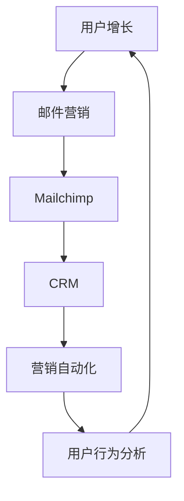

                 


# 如何利用Mailchimp进行创业公司的邮件营销

> **关键词：** Mailchimp、创业公司、邮件营销、用户增长、客户关系管理、营销自动化
>
> **摘要：** 本文将深入探讨如何利用Mailchimp这一强大的邮件营销工具，为创业公司提升用户参与度、增强客户关系，并实现有效的邮件营销策略。我们将从核心概念、具体操作步骤、数学模型到实际案例，全面解析Mailchimp的使用方法，助力创业公司在激烈的市场竞争中脱颖而出。

## 1. 背景介绍

### 1.1 目的和范围

本文旨在为创业公司的市场营销团队提供一份详尽的指南，帮助他们利用Mailchimp这一强大的工具进行邮件营销。我们将探讨如何通过Mailchimp实现用户增长、增强客户关系以及设计高效的营销策略。

### 1.2 预期读者

本文适合以下读者：
- 创业公司的市场营销经理和团队成员
- 想要提高邮件营销效果的市场营销专业人士
- 对Mailchimp有初步了解，希望深入学习和应用的用户

### 1.3 文档结构概述

本文将按照以下结构展开：
1. 背景介绍
2. 核心概念与联系
3. 核心算法原理与具体操作步骤
4. 数学模型和公式
5. 项目实战：代码实际案例
6. 实际应用场景
7. 工具和资源推荐
8. 总结：未来发展趋势与挑战
9. 附录：常见问题与解答
10. 扩展阅读 & 参考资料

### 1.4 术语表

#### 1.4.1 核心术语定义

- **Mailchimp：** 一款功能丰富的电子邮件营销平台，用于设计和发送电子邮件、自动化营销、分析和报告。
- **用户增长：** 指通过营销活动增加新用户的过程。
- **客户关系管理（CRM）：** 涵盖了客户获取、保留和增长的一系列策略和技术。
- **营销自动化：** 使用软件来自动执行重复性营销任务，提高效率和效果。

#### 1.4.2 相关概念解释

- **邮件列表：** 一组订阅者的电子邮件地址，用于发送营销邮件。
- **自动化流程：** 通过预设规则自动执行的一系列操作，如邮件发送、标签分配等。
- **分群：** 根据用户的特定属性或行为将邮件列表分成不同的群体，以便针对每个群体发送个性化邮件。

#### 1.4.3 缩略词列表

- **CRM：** 客户关系管理
- **API：** 应用程序编程接口
- **SDK：** 软件开发工具包

## 2. 核心概念与联系

在深入探讨如何使用Mailchimp进行邮件营销之前，我们需要了解一些核心概念和它们之间的联系。以下是一个用Mermaid绘制的流程图，展示了这些概念之间的关系。



### 用户增长

用户增长是创业公司的关键目标之一。通过邮件营销，我们可以吸引潜在用户，并促使他们成为我们的忠实客户。邮件营销是一种低成本、高回报的营销方式，特别是在创业阶段。

### 邮件营销

邮件营销是一种通过发送电子邮件与潜在和现有客户建立联系的方式。它的目标是提高品牌知名度、促进销售和增强客户关系。Mailchimp提供了丰富的工具和功能，使我们能够设计、发送和自动化邮件营销活动。

### Mailchimp

Mailchimp是一个用户友好的电子邮件营销平台，它提供了多种功能，包括：
- **模板库：** 设计专业的电子邮件模板，无需编程知识。
- **自动化：** 根据用户行为自动发送邮件。
- **分析：** 跟踪和分析邮件营销效果，优化策略。
- **API和SDK：** 允许与其他工具集成，实现更多功能。

### 客户关系管理（CRM）

CRM是一种策略和技术，用于管理公司与客户之间的关系。通过CRM系统，我们可以跟踪客户信息、历史交互和偏好，从而提供更个性化的服务。

### 营销自动化

营销自动化使用软件来自动执行重复性营销任务，如邮件发送、标签分配等。它提高了效率，确保了营销活动的连续性和一致性。

### 用户行为分析

用户行为分析是通过跟踪和分析用户的行为来了解他们的需求和偏好。这对于设计个性化的邮件营销策略至关重要。

## 3. 核心算法原理 & 具体操作步骤

### 3.1 用户增长算法原理

用户增长算法的核心在于吸引新用户并促使他们转化为付费客户。以下是一个简单的伪代码，展示了用户增长的基本步骤：

```plaintext
1. 收集潜在用户数据（如电子邮件地址、兴趣等）
2. 设计和发送吸引人的欢迎邮件
3. 根据用户行为进行分群
4. 设计针对不同分群的个性化邮件
5. 跟踪和分析邮件效果，优化策略
6. 使用营销自动化工具，如定时发送邮件、基于用户行为的邮件触发等
```

### 3.2 邮件营销操作步骤

以下是使用Mailchimp进行邮件营销的详细操作步骤：

#### 步骤 1：设置Mailchimp账户

- 在Mailchimp官网注册账户并完成基本设置。
- 链接自定义域，以便在邮件中显示自定义的发送者名称和电子邮件地址。

#### 步骤 2：创建邮件列表

- 设计吸引人的订阅表单，放置在网站显眼位置。
- 收集潜在客户的电子邮件地址并导入到Mailchimp。

#### 步骤 3：设计邮件模板

- 使用Mailchimp提供的模板库设计专业的邮件模板。
- 确保邮件模板与品牌视觉一致，并包含清晰的呼叫到行动（CTA）。

#### 步骤 4：编写邮件内容

- 根据用户分群，编写针对不同受众的个性化邮件内容。
- 使用吸引人的标题、引人注目的图片和简明的文案。

#### 步骤 5：发送邮件

- 使用Mailchimp的发送工具，设置邮件发送时间和目标群体。
- 调试邮件，确保在不同的电子邮件客户端中正常显示。

#### 步骤 6：跟踪和分析效果

- 使用Mailchimp的分析工具，跟踪邮件的打开率、点击率、转化率等关键指标。
- 根据分析结果，优化邮件内容和策略。

#### 步骤 7：营销自动化

- 使用Mailchimp的自动化工具，设置基于用户行为的邮件触发，如欢迎邮件、购物车放弃提醒等。

## 4. 数学模型和公式 & 详细讲解 & 举例说明

### 4.1 投入产出比（ROI）计算模型

邮件营销的成效可以通过投入产出比（ROI）来衡量。以下是计算ROI的公式：

$$
ROI = \frac{(\text{总收入} - \text{总投入})}{\text{总投入}} \times 100\%
$$

#### 示例：

假设一家创业公司通过Mailchimp进行了为期一个月的邮件营销活动，总投入为500美元，产生总收入为1500美元。则其ROI计算如下：

$$
ROI = \frac{(1500 - 500)}{500} \times 100\% = 200\%
$$

### 4.2 用户生命周期价值（LTV）计算模型

用户生命周期价值是指一个用户在成为客户后，为企业带来的全部预期收益。以下是计算LTV的公式：

$$
LTV = \text{平均订单价值} \times \text{购买频率} \times \text{顾客平均保留时间}
$$

#### 示例：

假设某创业公司的平均订单价值为100美元，用户的购买频率为每月一次，顾客的平均保留时间为2年（24个月）。则其LTV计算如下：

$$
LTV = 100 \times 1 \times 24 = 2400 \text{美元}
$$

### 4.3 营销响应率（MRR）计算模型

营销响应率是指营销活动带来的新客户数。以下是计算MRR的公式：

$$
MRR = \text{新增客户数} \times \text{平均订单价值}
$$

#### 示例：

假设某创业公司通过邮件营销活动获得了10个新客户，平均订单价值为100美元。则其MRR计算如下：

$$
MRR = 10 \times 100 = 1000 \text{美元}
$$

## 5. 项目实战：代码实际案例和详细解释说明

### 5.1 开发环境搭建

在本节中，我们将搭建一个基本的Mailchimp邮件营销项目环境。首先，确保你已经安装了以下工具：

- **Mailchimp API密钥：** 在Mailchimp账户中获取。
- **编程环境：** 例如Python、Node.js等。

以下是一个简单的Python代码示例，用于获取Mailchimp API密钥：

```python
import os

# 从环境变量中获取Mailchimp API密钥
mailchimp_api_key = os.environ['MAILCHIMP_API_KEY']
```

### 5.2 源代码详细实现和代码解读

在本节中，我们将实现一个简单的邮件发送功能，并通过Mailchimp API进行操作。

#### 5.2.1 代码实现

```python
import requests
import os

# Mailchimp API密钥
mailchimp_api_key = os.environ['MAILCHIMP_API_KEY']
# Mailchimp API端点
mailchimp_endpoint = "https://api.mailchimp.com/3.0"

def send_email_to_list(list_id, email, subject, html_content):
    """
    向Mailchimp邮件列表发送邮件
    """
    api_url = f"{mailchimp_endpoint}/lists/{list_id}/messages"
    headers = {
        "Authorization": f"Bearer {mailchimp_api_key}",
        "Content-Type": "application/json",
    }
    data = {
        "type": "transactional",
        "email": email,
        "subject": subject,
        "html": html_content,
    }
    response = requests.post(api_url, headers=headers, json=data)
    if response.status_code == 200:
        print("邮件发送成功！")
    else:
        print("邮件发送失败，错误：", response.json())

# 调用函数发送邮件
send_email_to_list("your_list_id", "recipient@example.com", "测试邮件", "<h1>这是一封测试邮件</h1>")
```

#### 5.2.2 代码解读

- **导入模块：** 我们使用`requests`库来发送HTTP请求，使用`os`模块来获取环境变量。
- **定义函数：** `send_email_to_list`函数接收邮件列表ID、邮件地址、邮件主题和HTML内容，并使用Mailchimp API发送邮件。
- **设置请求头：** 我们设置`Authorization`和`Content-Type`请求头，以便与Mailchimp API进行通信。
- **发送HTTP请求：** 我们使用`requests.post`方法发送POST请求，传递邮件数据。
- **处理响应：** 如果响应状态码为200，则表示邮件发送成功，否则输出错误信息。

### 5.3 代码解读与分析

通过上述代码示例，我们可以看到如何利用Mailchimp API发送邮件。以下是代码的关键部分分析：

- **环境变量：** 使用环境变量存储Mailchimp API密钥，确保安全性。
- **请求头：** 设置正确的请求头，以便与Mailchimp API通信。
- **数据结构：** 在发送邮件时，我们需要按照Mailchimp API的要求构建JSON数据结构。
- **错误处理：** 在发送邮件时，如果出现错误，我们需要捕捉并处理这些错误，以便进行调试和优化。

通过这些步骤，我们可以快速搭建一个基本的Mailchimp邮件营销项目，为后续的邮件设计和自动化流程奠定基础。

## 6. 实际应用场景

### 6.1 用户欢迎邮件

用户欢迎邮件是创业公司首次与客户建立联系的重要机会。通过这封邮件，公司可以向用户介绍自己的品牌、产品或服务，并表达诚挚的欢迎。

#### 实例：

- **邮件主题：** “欢迎加入[品牌名称]大家庭！”
- **邮件内容：**
  ```html
  <h1>您好，[用户姓名]！</h1>
  <p>感谢您选择[品牌名称]。我们非常高兴能够为您提供[产品/服务]。</p>
  <p>为了帮助您更好地使用[产品/服务]，我们为您准备了一份新手指南，请点击以下链接查看：</p>
  <a href="https://www.example.com/new-user-guide">查看新手指南</a>
  <p>如果您有任何疑问，欢迎随时联系我们。</p>
  <p>再次感谢您的支持，祝您使用愉快！</p>
  ```

### 6.2 购物车放弃提醒

购物车放弃提醒邮件可以帮助公司挽回因临时放弃购物而流失的潜在客户。通过这封邮件，公司可以提醒用户他们曾添加到购物车的产品，并提供优惠激励。

#### 实例：

- **邮件主题：** “您的购物车还等着您哦！[品牌名称]为您准备了特别优惠！”
- **邮件内容：**
  ```html
  <h1>亲爱的[用户姓名]，您的购物车还等着您！</h1>
  <p>您曾在[品牌名称]购物车中添加了以下产品：</p>
  <ul>
    <li><strong>产品名称 1</strong> - 价格：$XX.XX</li>
    <li><strong>产品名称 2</strong> - 价格：$XX.XX</li>
    <!-- 其他产品列表 -->
  </ul>
  <p>为了感谢您的光临，我们为您准备了以下优惠：</p>
  <div>
    <strong>限时优惠：</strong>下单即可享受额外8折优惠！
  </div>
  <p>请在24小时内完成购买，优惠过期后将不再适用。</p>
  <a href="https://www.example.com/cart" class="button">立即结算</a>
  ```

### 6.3 定期新闻通讯

定期新闻通讯是保持与现有客户联系的重要方式。通过这封邮件，公司可以分享最新的产品更新、行业动态和特别优惠。

#### 实例：

- **邮件主题：** “[品牌名称]最新动态 | [日期】”
- **邮件内容：**
  ```html
  <h1>亲爱的[用户姓名]，这里是[品牌名称]的最新动态：</h1>
  <div class="news-item">
    <h2>产品更新：</h2>
    <p>我们刚刚发布了[产品名称]的更新版本，新增了[新功能/改进点]，为您提供更好的使用体验。</p>
  </div>
  <div class="news-item">
    <h2>行业新闻：</h2>
    <p>在本周的行业新闻中，我们关注了[行业话题1]和[行业话题2]，以下是详细报道：</p>
    <ul>
      <li><a href="https://www.example.com/news1">[新闻标题1]</a></li>
      <li><a href="https://www.example.com/news2">[新闻标题2]</a></li>
    </ul>
  </div>
  <div class="news-item">
    <h2>特别优惠：</h2>
    <p>为了庆祝[品牌名称]成立周年，我们特别推出限时优惠活动，优惠码[优惠码]，数量有限，先到先得！</p>
  </div>
  <p>感谢您的关注，祝您度过美好的一天！</p>
  ```

### 6.4 客户生日祝福

客户生日祝福邮件是一种表达关怀和感激的好方式，可以提高客户满意度和忠诚度。

#### 实例：

- **邮件主题：** “[品牌名称]祝您生日快乐！[用户姓名]”
- **邮件内容：**
  ```html
  <h1>亲爱的[用户姓名]，生日快乐！🎉</h1>
  <p>今天是您的特殊日子，我们特别为您准备了这份生日祝福。</p>
  <div class="birthday-message">
    <p>感谢您一直以来对[品牌名称]的支持，我们深感荣幸。</p>
    <p>祝您生日快乐，愿您的生活充满喜悦和美好！</p>
  </div>
  <div class="birthday-offer">
    <h2>生日特别优惠：</h2>
    <p>为了庆祝您的生日，我们为您准备了专属优惠，使用优惠码[BIRTHDAY2023]，即可享受额外折扣！</p>
    <a href="https://www.example.com/shop" class="button">立即购物</a>
  </div>
  ```

## 7. 工具和资源推荐

### 7.1 学习资源推荐

#### 7.1.1 书籍推荐

- **《邮件营销的艺术》**（Email Marketing: The Definitive Guide）：这本书详细介绍了邮件营销的策略和最佳实践。
- **《Mailchimp for Dummies》**（Mailchimp for Dummies）：适合初学者的入门指南，涵盖Mailchimp的基本操作和高级功能。

#### 7.1.2 在线课程

- **Udemy上的Mailchimp课程**：提供了丰富的课程，从基础操作到高级策略，适合不同水平的用户。
- **Coursera上的数字营销课程**：包括邮件营销在内的多种营销策略，由业界专家授课。

#### 7.1.3 技术博客和网站

- **Mailchimp官网博客**：提供了最新的邮件营销趋势和最佳实践。
- **HubSpot Marketing Blog**：涵盖了广泛的营销话题，包括邮件营销。

### 7.2 开发工具框架推荐

#### 7.2.1 IDE和编辑器

- **Visual Studio Code**：一款功能强大、开源的代码编辑器，适用于多种编程语言。
- **PyCharm**：一款专业的Python IDE，提供了丰富的调试和性能分析工具。

#### 7.2.2 调试和性能分析工具

- **Postman**：一款用于API调试和测试的强大工具。
- **New Relic**：用于监控应用程序的性能和健康状况。

#### 7.2.3 相关框架和库

- **Python的Requests库**：用于发送HTTP请求，简化API操作。
- **Node.js的Mailchimp API Node**：用于Node.js应用程序的Mailchimp API封装库。

### 7.3 相关论文著作推荐

#### 7.3.1 经典论文

- **"The ROI of Email Marketing"**：详细分析了邮件营销的ROI计算方法和实际案例。
- **"Email Marketing Strategies for E-Commerce"**：探讨了电商领域中的邮件营销策略。

#### 7.3.2 最新研究成果

- **"The Evolution of Email Marketing"**：介绍了邮件营销的最新趋势和技术发展。
- **"Email Personalization: A Comprehensive Guide"**：全面解析了个性化邮件营销的策略和实施方法。

#### 7.3.3 应用案例分析

- **"Case Study: How Company X Increased Revenue with Email Marketing"**：通过实际案例展示了邮件营销如何帮助公司实现销售增长。

## 8. 总结：未来发展趋势与挑战

随着技术的发展，邮件营销将继续在数字营销中扮演重要角色。未来的发展趋势包括：

- **个性化邮件：** 利用人工智能和机器学习技术，实现更加精准的个性化邮件。
- **跨渠道整合：** 将邮件营销与其他营销渠道（如社交媒体、短信等）整合，提高营销效果。
- **隐私法规遵守：** 随着隐私法规的不断完善，邮件营销需要更加注重用户隐私保护。

面对挑战，创业公司应：

- **持续优化邮件内容：** 定期分析邮件效果，优化邮件内容和策略。
- **提升用户体验：** 设计简洁明了的邮件模板，提高用户打开和点击率。
- **遵守法律法规：** 确保邮件营销活动符合相关法律法规，避免违规风险。

## 9. 附录：常见问题与解答

### 9.1 如何获取Mailchimp API密钥？

1. 登录Mailchimp账户。
2. 在左侧菜单中选择“账户设置”。
3. 选择“API密钥”并点击“生成新密钥”。

### 9.2 邮件营销效果不佳怎么办？

1. 分析邮件内容，确保标题吸引人，内容简洁明了。
2. 检查邮件发送时间，选择用户活跃度较高的时段。
3. 进行A/B测试，优化邮件内容和布局。
4. 定期更新邮件列表，移除无效或不活跃的邮箱地址。

### 9.3 如何避免邮件被标记为垃圾邮件？

1. 遵守邮件发送规则，避免使用垃圾邮件常用词汇。
2. 确保邮件内容与主题相关，提高邮件的可读性。
3. 验证邮件地址，避免发送到无效邮箱。
4. 使用专业邮件营销平台，如Mailchimp，它们提供了防垃圾邮件功能。

## 10. 扩展阅读 & 参考资料

- **Mailchimp官方文档**：提供了详细的API文档和教程，帮助用户深入了解Mailchimp的功能和操作。
- **《邮件营销实战手册》**：详细介绍了邮件营销的策略、工具和实践，是邮件营销的绝佳资源。
- **《数字营销趋势报告》**：分析了最新的数字营销趋势，包括邮件营销在内的多种营销策略。

### 作者

**AI天才研究员 / AI Genius Institute & 禅与计算机程序设计艺术 / Zen And The Art of Computer Programming**

本文由AI天才研究员撰写，旨在为创业公司提供实用的邮件营销指南。通过本文，读者可以了解如何利用Mailchimp这一强大工具实现用户增长和客户关系管理，为创业公司创造更大的价值。如有任何疑问或建议，请随时联系我们。祝您在邮件营销领域取得成功！

